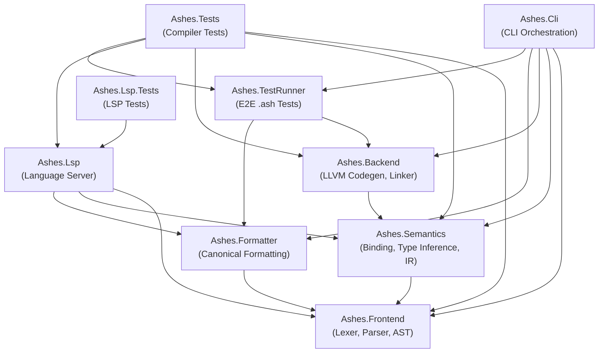
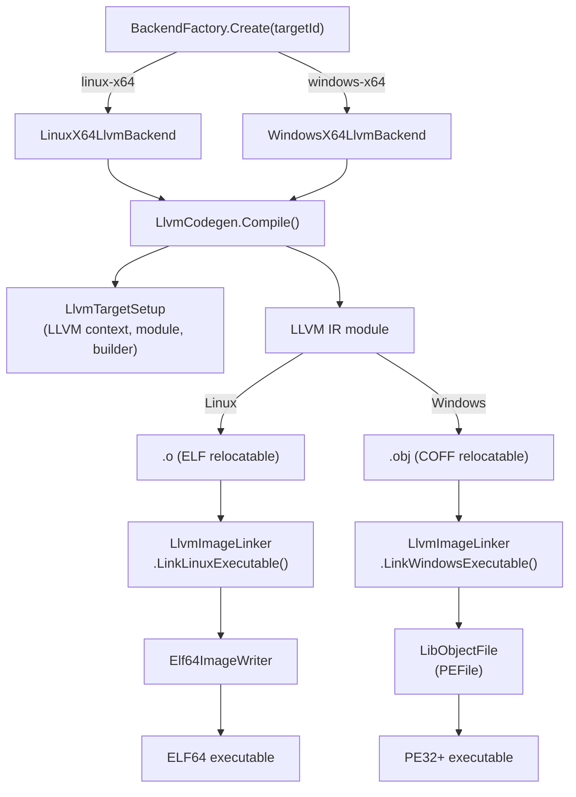

# Compiler Architecture

This document describes the internal architecture of the Ashes compiler,
covering the compilation pipeline, project structure, backend design,
intermediate representation, memory model, and linking strategy.

------------------------------------------------------------------------

## Compilation Pipeline

Source code flows through four major phases before producing a native
executable:

```mermaid
flowchart LR
    A[".ash source"] --> B["Lexer"]
    B --> C["Token stream"]
    C --> D["Parser"]
    D --> E["AST"]
    E --> F["Binder / Resolver\n+ Type Inference"]
    F --> G["Typed AST"]
    G --> H["Lowering"]
    H --> I["IR"]
    I --> J["LLVM Codegen"]
    J --> K["LLVM IR"]
    K --> L["Object code\n(.o / .obj)"]
    L --> M["Linker"]
    M --> N["Native executable\n(ELF / PE)"]
```



| Phase | Project | Key class | Output |
|-------|---------|-----------|--------|
| Tokenization | Ashes.Frontend | `Lexer` | Token stream |
| Parsing | Ashes.Frontend | `Parser` | `Ast` nodes |
| Binding & inference | Ashes.Semantics | `Lowering` | Typed AST + `IrProgram` |
| Code generation | Ashes.Backend | `LlvmCodegen` | LLVM IR → object file |
| Linking | Ashes.Backend | `LlvmImageLinker` | Native executable bytes |

------------------------------------------------------------------------

## Project Dependency Graph

The repository is split into nine .NET projects with strict dependency
rules:



**Key rules:**

- **Frontend** has zero internal dependencies.
- **Semantics** depends only on Frontend.
- **Backend** depends only on Semantics (transitively Frontend).
- **Formatter** depends only on Frontend — it never touches Semantics or Backend.
- **Lsp** must **not** depend on Backend.
- **Cli** is the only orchestration project that wires all phases together.

------------------------------------------------------------------------

## Backend Architecture

The backend converts IR into a native executable through LLVM:



Both backends implement `IBackend` and delegate to the same
`LlvmCodegen.Compile()` entry point, which branches internally based on
the target ID.

### External dependencies

| Package | Version | Purpose |
|---------|---------|---------|
| LLVMSharp | 20.1.2 | .NET bindings to LLVM C API |
| libLLVM.runtime.{linux,win}-x64 | 20.1.2 | Native LLVM libraries |
| LibObjectFile | 2.1.0 | PE32+ executable construction |

------------------------------------------------------------------------

## Intermediate Representation

The IR is a flat, register-based instruction set defined in
`Ashes.Semantics/Ir.cs`. The `Lowering` pass converts the typed AST into
an `IrProgram`, which the backend consumes.

### IrProgram structure

```
IrProgram
├── EntryFunction : IrFunction       — the top-level expression
├── Functions     : List<IrFunction> — lifted lambdas / named functions
└── StringLiterals: List<IrStringLiteral>
```

Each `IrFunction` contains a flat list of `IrInst` records, a local-slot
count, and a temporary-register count.

### Instruction categories

| Category | Instructions |
|----------|-------------|
| Constants | `LoadConstInt`, `LoadConstFloat`, `LoadConstBool`, `LoadConstStr`, `LoadProgramArgs` |
| Locals / memory | `LoadLocal`, `StoreLocal`, `LoadEnv`, `LoadMemOffset`, `StoreMemOffset` |
| Arithmetic | `AddInt`, `SubInt`, `MulInt`, `DivInt`, `AddFloat`, `SubFloat`, `MulFloat`, `DivFloat` |
| Comparisons | `CmpIntEq/Ne/Ge/Le`, `CmpFloatEq/Ne/Ge/Le`, `CmpStrEq/Ne` |
| Strings | `ConcatStr` |
| Closures | `MakeClosure`, `CallClosure` |
| Allocation | `Alloc`, `AllocAdt`, `SetAdtField`, `GetAdtTag`, `GetAdtField` |
| Console I/O | `PrintInt`, `PrintStr`, `PrintBool`, `WriteStr`, `ReadLine`, `PanicStr` |
| File I/O | `FileReadText`, `FileWriteText`, `FileExists` |
| Networking | `HttpGet`, `HttpPost`, `NetTcpConnect`, `NetTcpSend`, `NetTcpReceive`, `NetTcpClose` |
| Control flow | `Label`, `Jump`, `JumpIfFalse`, `Return` |

Registers are addressed by integer index (temporaries). Each instruction
writes to a `Target` register and reads from `Source` / `Left` / `Right`
registers.

------------------------------------------------------------------------

## Memory Model

Ashes programs run without a garbage collector. All heap allocations come
from a single, pre-allocated **4 MB arena** with a bump-pointer cursor.

```
┌──────────────────────────────────────┐
│            4 MB static heap          │
│  ┌─────┬─────┬─────┬──── ─ ─ ─ ──┐  │
│  │alloc│alloc│alloc│   free ...   │  │
│  └─────┴─────┴─────┴──── ─ ─ ─ ──┘  │
│                     ▲                │
│                   cursor             │
└──────────────────────────────────────┘
```

- The heap and cursor are **LLVM module-level globals**, so every function
  (including lifted closures) shares the same allocator.
- `Alloc(n)` bumps the cursor by `n` bytes and returns the old cursor.
- Strings are stored as `[length:i64][bytes...]` on the heap.
- Closures are 16-byte heap cells: `[function-pointer:i64][env-pointer:i64]`.
- ADT values are heap cells: `[tag:i64][field0:i64][field1:i64]...`.
- There is no deallocation — programs that exhaust the arena will fail.

------------------------------------------------------------------------

## Linking

The compiler does **not** shell out to an external linker. Instead,
`LlvmImageLinker` directly transforms LLVM-emitted object files into
executable images.

### Linux (ELF64)

1. LLVM emits an **ELF relocatable** (`.o`).
2. `ParseElfObject` reads section headers, symbol table, and string tables
   using `System.Buffers.Binary`.
3. Allocated data sections (`.rodata`, `.data`, `.bss`) are laid out at a
   page-aligned data VA.
4. `.text` relocations (`R_X86_64_PC32`, `R_X86_64_32`, `R_X86_64_32S`)
   are resolved against text and data section base addresses.
5. A 20-byte **trampoline** is prepended: saves the stack pointer, calls
   the entry function, then invokes `syscall exit(0)`.
6. `Elf64ImageWriter` builds the final two-segment (text + data) ELF64
   executable with the ELF header and two `PT_LOAD` program headers.

### Windows (PE32+)

1. LLVM emits a **COFF relocatable** (`.obj`).
2. `ParseCoffObject` reads section headers, symbols, and relocations.
3. Data sections (`.rdata`, `.data`) are packed into a single PE `.rdata`
   section; `.bss` becomes a separate zero-filled PE section.
4. Import tables are constructed for **KERNEL32.DLL** (`ExitProcess`,
   `GetStdHandle`, `WriteFile`, `ReadFile`, `CreateFileA`, `CloseHandle`,
   etc.), **SHELL32.DLL** (`CommandLineToArgvW`), and **WS2_32.DLL**
   (socket APIs).
5. COFF relocations (`IMAGE_REL_AMD64_ADDR32`, `IMAGE_REL_AMD64_REL32`)
   are resolved, preserving encoded addends.
6. A 24-byte **trampoline** + 35-byte **`__chkstk` stub** are prepended.
   The chkstk stub probes each 4 KB page for stack allocations >4096 bytes.
7. **LibObjectFile** (`PEFile`) assembles the final PE32+ executable with
   `.text`, `.rdata`, optional `.bss` sections, and the import directory.

### Constants

| Constant | Value | Notes |
|----------|-------|-------|
| Image base | `0x400000` | Both ELF and PE |
| Page/section alignment | `0x1000` | 4 KB |
| Heap size | 4 MB | Static arena |
| Input buffer | 64 KB | `ReadLine` buffer |
| Max file read | 1 MB | `FileReadText` limit |

------------------------------------------------------------------------

## How to Add a New Target

Adding a new compile target (e.g., `arm64-linux`) requires:

1. **Add a target ID** in `Backends/TargetIds.cs`.
2. **Create a backend class** implementing `IBackend` in `Backends/`.
   It should delegate to `LlvmCodegen.Compile()` with the new target ID.
3. **Register it** in `BackendFactory.Create()`.
4. **Add a target triple** in `Llvm/LlvmTargetSetup.cs` (e.g.,
   `"aarch64-unknown-linux-gnu"`).
5. **Add codegen branches** in `LlvmCodegen` for any platform-specific
   code (syscall numbers, calling conventions, ABI details).
6. **Add a linker path** in `LlvmImageLinker` for the new object format
   and executable format.
7. **Initialize the LLVM target** in `LlvmTargetSetup.EnsureInitialized()`
   (e.g., `LLVM.InitializeAArch64*`).
