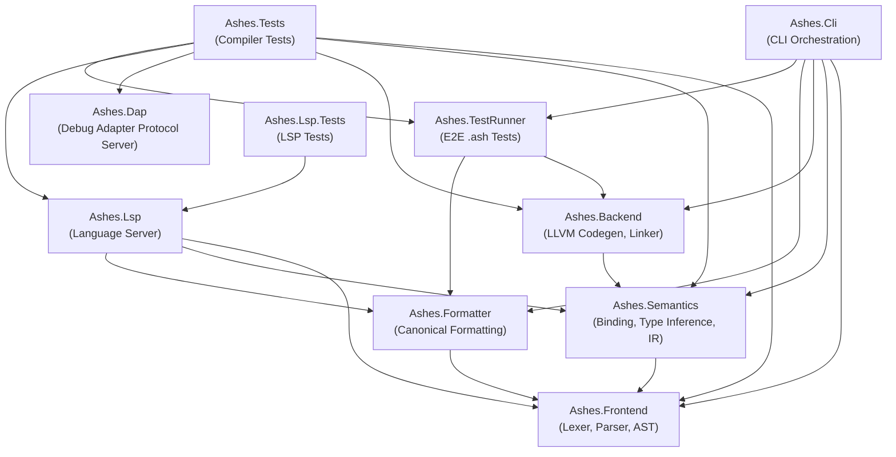
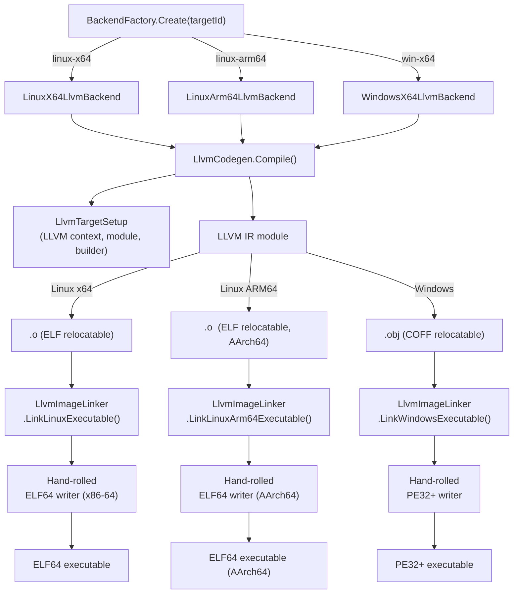

# Compiler Architecture

This document describes the internal architecture of the Ashes compiler,
covering the compilation pipeline, project structure, backend design,
intermediate representation, memory model, and linking strategy.

------------------------------------------------------------------------

## Compilation Pipeline

Source code flows through four major phases before producing a native
executable:

```mermaid
flowchart LR
    A[".ash source"] --> B["Lexer"]
    B --> C["Token stream"]
    C --> D["Parser"]
    D --> E["AST"]
    E --> F["Binder / Resolver\n+ Type Inference"]
    F --> G["Typed AST"]
    G --> H["Lowering"]
    H --> I["IR"]
    I --> J["LLVM Codegen"]
    J --> K["LLVM IR"]
    K --> L["Object code\n(.o / .obj)"]
    L --> M["Linker"]
    M --> N["Native executable\n(ELF / PE)"]
```



| Phase | Project | Key class | Output |
|-------|---------|-----------|--------|
| Tokenization | Ashes.Frontend | `Lexer` | Token stream |
| Parsing | Ashes.Frontend | `Parser` | `Ast` nodes |
| Binding, inference & lowering | Ashes.Semantics | `Lowering` | `IrProgram` |
| Code generation | Ashes.Backend | `LlvmCodegen` | LLVM IR → object file |
| Linking | Ashes.Backend | `LlvmImageLinker` | Native executable bytes |

------------------------------------------------------------------------

## Project Dependency Graph

The repository is split into ten .NET projects with strict dependency
rules:



**Key rules:**

- **Frontend** has zero internal dependencies.
- **Semantics** depends only on Frontend.
- **Backend** depends only on Semantics (transitively Frontend).
- **Formatter** depends only on Frontend — it never touches Semantics or Backend.
- **Lsp** must **not** depend on Backend.
- **Dap** currently has zero internal compiler dependencies and remains a standalone tooling process.
- **Cli** is the only orchestration project that wires all phases together.

------------------------------------------------------------------------

## Tooling Servers

Ashes exposes two editor-facing servers alongside the compiler and CLI:

| Project | Protocol | Responsibility |
|---------|----------|----------------|
| Ashes.Lsp | Language Server Protocol | Syntax highlighting, diagnostics, completions, hovers, formatting |
| Ashes.Dap | Debug Adapter Protocol | Launching debug sessions, translating IDE debug requests to native debugger commands, surfacing runtime state |

`Ashes.Lsp` is a consumer of compiler phases: it requests parsing,
binding, and formatting services from the compiler projects and converts
the results into LSP responses.

`Ashes.Dap` is intentionally outside the compiler pipeline. It does not
parse or type-check `.ash` code; instead it brokers DAP traffic between
the IDE and a native debugger backend such as GDB or LLDB, operating on
already-compiled binaries and their debug information.

------------------------------------------------------------------------

## Backend Architecture

The backend converts IR into a native executable through LLVM:



All backends implement `IBackend` and delegate to the same
`LlvmCodegen.Compile()` entry point, which branches internally based on
the target ID.

### External dependencies

| Dependency | Source | Purpose |
|------------|--------|---------|
| libLLVM (native) | Downloaded via `scripts/download-llvm-native.*` | LLVM C API (`libLLVM.so` / `libLLVM.dll`) |

The compiler talks to LLVM through a thin P/Invoke interop layer
(`Ashes.Backend/Llvm/Interop/LlvmApi.cs`) — no managed wrapper packages
are used.

#### Updating LLVM native libraries

The native libraries live in `runtimes/{linux-x64,linux-arm64,win-x64}/`
and are provisioned before building `Ashes.Backend` with the following
scripts:

| Platform | Command |
|----------|---------|
| Linux / WSL | `./scripts/download-llvm-native.sh [MAJOR]` (default 22) |
| Windows (run from WSL) | `./scripts/download-llvm-native.sh --all [LLVM_VERSION]` |

`Ashes.Backend.csproj` contains OS-conditional `<None>` items that copy
the appropriate native library to the build output directory so that
`dotnet run` / `dotnet test` can locate it at runtime.

To bump the LLVM version, pass the new version to the download script —
no source changes are needed because the LLVM C API is stable across
releases.

------------------------------------------------------------------------

## Intermediate Representation

The IR is a flat, register-based instruction set defined in
`Ashes.Semantics/Ir.cs`. The `Lowering` pass converts the typed AST into
an `IrProgram`, which the backend consumes.

### IrProgram structure

```
IrProgram
├── EntryFunction : IrFunction       — the top-level expression
├── Functions     : List<IrFunction> — lifted lambdas / named functions
└── StringLiterals: List<IrStringLiteral>
```

Each `IrFunction` contains a flat list of `IrInst` records, a local-slot
count, and a temporary-register count.

### Instruction categories

| Category | Instructions |
|----------|-------------|
| Constants | `LoadConstInt`, `LoadConstFloat`, `LoadConstBool`, `LoadConstStr`, `LoadProgramArgs` |
| Locals / memory | `LoadLocal`, `StoreLocal`, `LoadEnv`, `LoadMemOffset`, `StoreMemOffset` |
| Arithmetic | `AddInt`, `SubInt`, `MulInt`, `DivInt`, `AddFloat`, `SubFloat`, `MulFloat`, `DivFloat` |
| Comparisons | `CmpIntEq/Ne/Ge/Le`, `CmpFloatEq/Ne/Ge/Le`, `CmpStrEq/Ne` |
| Strings | `ConcatStr` |
| Closures | `MakeClosure`, `CallClosure` |
| Allocation | `Alloc`, `AllocAdt`, `SetAdtField`, `GetAdtTag`, `GetAdtField` |
| Console I/O | `PrintInt`, `PrintStr`, `PrintBool`, `WriteStr`, `ReadLine`, `PanicStr` |
| File I/O | `FileReadText`, `FileWriteText`, `FileExists` |
| Networking | `HttpGet`, `HttpPost`, `NetTcpConnect`, `NetTcpSend`, `NetTcpReceive`, `NetTcpClose` |
| Control flow | `Label`, `Jump`, `JumpIfFalse`, `Return` |

Registers are addressed by integer index (temporaries). Each instruction
writes to a `Target` register and reads from `Source` / `Left` / `Right`
registers.

------------------------------------------------------------------------

## Memory Model

Ashes programs run without a garbage collector. Heap allocation uses a
**chunked arena allocator** with a bump-pointer cursor and a 4 MB chunk
size.

```
┌──────────────────────── chunk 0 (4 MB) ─────────────────────────┐
│ [prev=0] [alloc] [alloc] [alloc] ... [free]                     │
└─────────────────────────────────────────────────────────────────┘
                                                   │ grow on demand
                                                   ▼
┌──────────────────────── chunk 1 (4 MB) ─────────────────────────┐
│ [prev=chunk0] [alloc] [alloc] ... [free]                        │
└─────────────────────────────────────────────────────────────────┘
                                                               ▲
                                                            cursor
```

- The allocator state lives in **LLVM module-level globals** for the current
   heap cursor and current chunk end, so every function shares one arena.
- Program entry allocates the first chunk from the OS with `mmap` (Linux) or
   `VirtualAlloc` (Windows).
- `Alloc(n)` and dynamic allocation paths bump the cursor inside the current
   chunk. If `cursor + n` would overflow the chunk, the runtime allocates a new
   4 MB chunk, links it to the previous chunk, and continues there.
- Each chunk reserves its first 8 bytes for a `prev` pointer to the previous
   chunk base. Allocations start after that header.
- Ownership scopes in lowered IR save and restore arena watermarks. At scope
   exit, `RestoreArenaState` resets the allocator to the saved cursor/end, and
   `ReclaimArenaChunks` walks the chunk chain and releases abandoned chunks with
   `munmap` or `VirtualFree`.
- `Drop` is therefore not general per-object deallocation. For most owned heap
   values it is a no-op; bulk reclamation happens through arena reset. Resource
   types such as sockets still route `Drop` to explicit cleanup operations.

### Runtime layouts

- Dynamic strings use `[length:i64][bytes...]`. String literals may also be
   emitted as read-only globals with the same in-memory layout instead of being
   copied into the arena.
- Heap closures are 24-byte records:
   `[function-pointer:i64][env-pointer:i64][env-size:i64]`.
- ADT values use `[tag:i64][field0:i64][field1:i64]...`.
- Some temporary values also have stack-allocated forms during codegen
   (notably closures and certain ADTs), so not every runtime value necessarily
   originates from the arena.

This model is still arena-based and non-GC, but it is no longer a single
never-freed static slab. Memory is reclaimed at ownership-scope boundaries,
and whole OS chunks can be returned once they fall out of scope.

------------------------------------------------------------------------

## Linking

The compiler does **not** shell out to an external linker. Instead,
`LlvmImageLinker` directly transforms LLVM-emitted object files into
executable images.

### Linux x86-64 (ELF64)

1. LLVM emits an **ELF relocatable** (`.o`).
2. `ParseElfObject` reads section headers, symbol table, and string tables
   using `System.Buffers.Binary`.
3. Allocated data sections (`.rodata`, `.data`, `.bss`) are laid out at a
   page-aligned data VA.
4. `.text` relocations (`R_X86_64_PC32`, `R_X86_64_32`, `R_X86_64_32S`)
   are resolved against text and data section base addresses.
5. A 20-byte **trampoline** is prepended: saves the stack pointer, calls
   the entry function, then invokes `syscall exit(0)`.
6. A hand-rolled binary writer emits the final two-segment (text + data)
   ELF64 executable with the ELF header and two `PT_LOAD` program headers.

### Linux AArch64 (ELF64)

1. LLVM emits an **ELF relocatable** (`.o`) targeting `aarch64-unknown-linux-gnu`.
2. The same `ParseElfObject` parser is reused — the ELF container format
   is identical for both architectures.
3. AArch64-specific relocations are applied: `R_AARCH64_CALL26`,
   `R_AARCH64_JUMP26`, `R_AARCH64_ADR_PREL_PG_HI21`,
   `R_AARCH64_ADD_ABS_LO12_NC`, `R_AARCH64_LDST_IMM12_LO12_NC*`,
   `R_AARCH64_ABS64`, `R_AARCH64_ABS32`, and `R_AARCH64_PREL32`.
4. A 28-byte **trampoline** (7 AArch64 instructions) is prepended:
   `mov x0, sp; bl entry; mov x0, #0; mov x8, #93; svc #0; brk #0; brk #0`.
5. The ELF header uses `EM_AARCH64 (183)` as the machine type.
6. The same two-segment layout (text + data) is used.

### Windows (PE32+)

1. LLVM emits a **COFF relocatable** (`.obj`).
2. `ParseCoffObject` reads section headers, symbols, and relocations.
3. Data sections (`.rdata`, `.data`) are packed into a single PE `.rdata`
   section; `.bss` becomes a separate zero-filled PE section.
4. Import tables are constructed for **KERNEL32.DLL** (`ExitProcess`,
   `GetStdHandle`, `WriteFile`, `ReadFile`, `CreateFileA`, `CloseHandle`,
   etc.), **SHELL32.DLL** (`CommandLineToArgvW`), and **WS2_32.DLL**
   (socket APIs).
5. COFF relocations (`IMAGE_REL_AMD64_ADDR32`, `IMAGE_REL_AMD64_REL32`)
   are resolved, preserving encoded addends.
6. A 24-byte **trampoline** + 35-byte **`__chkstk` stub** are prepended.
   The chkstk stub probes each 4 KB page for stack allocations >4096 bytes.
7. A hand-rolled binary writer assembles the final PE32+ executable with
   `.text`, `.rdata`, optional `.bss` sections, and the import directory.

### Constants

| Constant | Value | Notes |
|----------|-------|-------|
| Image base | `0x400000` | Both ELF and PE |
| Page/section alignment | `0x1000` | 4 KB |
| Heap size | 4 MB | Static arena |
| Input buffer | 64 KB | `ReadLine` buffer |
| Max file read | 1 MB | `FileReadText` limit |

------------------------------------------------------------------------

## How to Add a New Target

Adding a new compile target requires:

1. **Add a target ID** in `Backends/TargetIds.cs`.
2. **Create a backend class** implementing `IBackend` in `Backends/`.
   It should delegate to `LlvmCodegen.Compile()` with the new target ID.
3. **Register it** in `BackendFactory.Create()`.
4. **Add a target triple** in `Llvm/LlvmTargetSetup.cs` (e.g.,
   `"aarch64-unknown-linux-gnu"`).
5. **Add a codegen flavor** in `LlvmCodegen.LlvmCodegenFlavor` and add
   codegen branches for any platform-specific code (syscall numbers,
   calling conventions, ABI details). Use `IsLinuxFlavor()` for shared
   Linux behavior and `ResolveSyscallNr()` for syscall number translation.
6. **Add a linker path** in `LlvmImageLinker` for the new object format
   and executable format.
7. **Initialize the LLVM target** in `LlvmTargetSetup.EnsureInitialized()`
   (e.g., `LlvmApi.InitializeAArch64*`).

### Currently supported targets

| Target ID | Triple | Object format | Executable format |
|-----------|--------|---------------|-------------------|
| `linux-x64` | `x86_64-unknown-linux-gnu` | ELF64 | ELF64 (x86-64) |
| `linux-arm64` | `aarch64-unknown-linux-gnu` | ELF64 | ELF64 (AArch64) |
| `win-x64` | `x86_64-pc-windows-msvc` | COFF | PE32+ |
