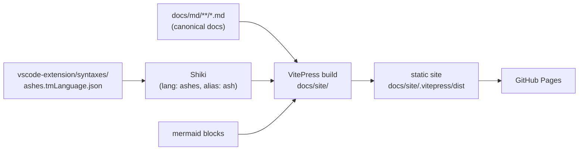

# Documentation Web Site

This is the design of record for the Ashes documentation web site: a static site generated with
**VitePress**, using **Shiki** with the VS Code extension's TextMate grammar so `ash` code blocks are
colorized exactly like in the editor, built from the existing `docs/*.md` files. Design only — nothing
here is built yet.

Goals:

- Publish the existing docs as a browsable, searchable site with proper syntax highlighting for Ashes
  code, Mermaid diagram rendering, and dark/light themes.
- **One source of truth twice over:** the markdown files remain the canonical docs the repo already
  treats as authoritative, and the TextMate grammar is consumed *in place* from
  `vscode-extension/syntaxes/ashes.tmLanguage.json` — never copied or forked.
- Follow the same Node tooling rules as `vscode-extension/` (pnpm, pinned versions, committed lockfile,
  lint/format gates).

Non-goals (initially): rewriting or restructuring doc *content*, versioned docs, i18n, a custom theme
beyond light configuration.

---

## 1. Stack

| Piece | Choice | Why |
|---|---|---|
| Generator | **VitePress** (latest stable) | Markdown-first, ships Shiki natively, local full-text search built in, fast builds |
| Highlighting | **Shiki** via VitePress `markdown.languages` | Accepts raw TextMate grammars — the extension's `ashes.tmLanguage.json` loads directly |
| Ashes grammar | `vscode-extension/syntaxes/ashes.tmLanguage.json` (scope `source.ashes`) | Single source of truth; editor and site can never drift |
| Diagrams | `vitepress-mermaid-renderer` (fallback: small custom markdown-it rule + Vue component) | The docs already use ` ```mermaid ` blocks (7 today); VitePress does not render them natively, and Shiki cannot (it is a highlighter, not a renderer). The older `vitepress-plugin-mermaid` is unmaintained and incompatible with VitePress 2, so it is ruled out. The fallback (~50 lines: fence -> Vue component -> Mermaid.js client-side, with dark/light theme switching) removes plugin risk entirely if the ecosystem goes stale again |
| Search | VitePress built-in local search (minisearch) | No external service; works on a static host |
| Package manager | **pnpm**, pinned via `packageManager` | Same rules as `vscode-extension/` (`pnpm@11.x`, committed `pnpm-lock.yaml`) |
| Node | `^26.0.0` | Matches `vscode-extension/package.json` engines |



---

## 2. Directory layout

The site app lives under `docs/site/`; the markdown moves to `docs/md/`, mirroring the current
structure exactly (flat files plus `future/`). No renames beyond the path prefix — the SCREAMING_SNAKE
filenames stay, so the churn is a prefix change, not a re-review of every link.

```
docs/
  md/                         # canonical markdown (moved from docs/*.md)
    LANGUAGE_SPEC.md
    ARCHITECTURE.md
    ...                       # all current docs/*.md, unchanged names
    future/
      PACKAGE_MANAGER.md
      ...
    index.md                  # NEW: site landing page (hero + section links)
  site/                       # the VitePress app (Node project)
    .vitepress/
      config.ts               # nav, sidebar, Shiki + mermaid setup
      theme/                  # only if light customization becomes necessary
    package.json              # packageManager: pnpm@11.x, engines.node ^26
    pnpm-lock.yaml
  future/DOCS_SITE.md         # this doc (moves to docs/md/future/ with the rest)
```

- `docs/site/.vitepress/config.ts` sets `srcDir: '../md'` — VitePress supports a source directory
  outside the app root, so content and app stay cleanly separated.
- Build output (`docs/site/.vitepress/dist/`) and cache (`.vitepress/cache/`) are gitignored.
- Because every cross-doc link in the markdown is *relative* (`[x](LANGUAGE_SPEC.md)`,
  `[y](future/PACKAGE_MANAGER.md)`), moving all files together preserves them; VitePress resolves
  `.md` links to routes automatically.

**Alternative considered:** leaving the markdown in `docs/` and pointing `srcDir` at `docs/` with
`srcExclude: ['site/**']`. Zero link churn, but it mixes an app directory into the content tree and
makes the site root the same folder agents and contributors edit; the `md/` + `site/` split is the
cleaner long-term shape and the churn is a one-time, mechanical prefix update (§5).

---

## 3. Shiki + grammar integration

VitePress passes custom languages straight to Shiki. The grammar is read from the extension at config
time:

```ts
// docs/site/.vitepress/config.ts
import { readFileSync } from 'node:fs'
import { defineConfig } from 'vitepress'

const ashesGrammar = JSON.parse(
  readFileSync(new URL('../../../vscode-extension/syntaxes/ashes.tmLanguage.json', import.meta.url), 'utf8'),
)

export default defineConfig({
  srcDir: '../md',
  markdown: {
    languages: [{ ...ashesGrammar, name: 'ashes', aliases: ['ash'] }],
    theme: { light: 'github-light', dark: 'github-dark' },
  },
})
```

- The fence tag used in the docs today is ` ```ash ` (35 blocks) — registered as an alias of `ashes`.
- The grammar file is **referenced, not copied**. A grammar improvement in the extension shows up on
  the site on the next build with no synchronization step.
- Other fence languages already in use (`sh`, `bash`, `json`, `csharp`) are Shiki built-ins and need
  nothing.
- There are roughly 35 untagged ` ``` ` blocks across the docs; a migration pass tags each with its
  real language (`ash`, `sh`, `json`, or `text`) so nothing renders as unhighlighted plain blocks.

---

## 4. Site structure (nav/sidebar)

Physical layout stays flat; the sidebar imposes the reading structure:

- **Guide** — DEVELOPMENT, DEBUGGING, TESTING, LOCAL_CI
- **Language** — LANGUAGE_SPEC, STANDARD_LIBRARY, PROJECT_SPEC, FORMATTER_SPEC, DIAGNOSTICS
- **Tooling** — COMPILER_CLI_SPEC
- **Internals** — ARCHITECTURE, IR_REFERENCE
- **Future designs** — everything under `future/` (clearly labeled as design docs, not shipped
  behavior)

A new `index.md` landing page fronts the site (what Ashes is, quick start pointer, section links).
VitePress's local search indexes everything, including `future/`.

Dead-link checking is a build gate: VitePress fails the build on broken internal links, which makes
the site build double as the docs link-linter. Links that intentionally point outside the content tree
(e.g. into `src/` or `scripts/`) are rewritten to GitHub URLs or listed in `ignoreDeadLinks` explicitly
— case by case during migration, preferring the GitHub URL.

---

## 5. Reorganization and link migration

Moving `docs/*.md` to `docs/md/` breaks inbound references from outside the content tree. Complete
inventory (from grep, excluding worktrees):

| File | References | Kind |
|---|---|---|
| `README.md` | 35 | real links — must be updated |
| `CLAUDE.md` | 14 | real links (the doc table agents navigate by) — must be updated |
| `challenges/1brc/FLAWS.md` + `challenges/README.md` | 4 | real links |
| `vscode-extension/README.md` | 2 | real links |
| `docs/DEVELOPMENT.md`, `docs/STANDARD_LIBRARY.md` | 3 | self-referencing `docs/...` style links — become relative or drop the prefix |
| `justfile`, `ci/jobs.sh`, `scripts/init-local-ci.sh` | 6 | comments only ("see docs/LOCAL_CI.md") — update for accuracy |

The move and every reference update land in **one commit** so no state ever has dangling links.
`git mv` preserves history.

---

## 6. Tooling conventions (mirroring `vscode-extension/`)

- `packageManager: "pnpm@11.x"` pinned in `docs/site/package.json`; `pnpm-lock.yaml` committed;
  installs use `pnpm install --frozen-lockfile` in CI.
- `engines.node: "^26.0.0"`.
- Prettier for the site app's own files (`.ts`, `config`, theme). **Scoped to `docs/site/` only** — it
  must not reformat the markdown content, which would churn every doc for zero value.
- ESLint on any nontrivial config/theme TypeScript, `--max-warnings 0`, matching the extension's
  strictness.
- Scripts: `pnpm dev` (live preview), `pnpm build` (static build, fails on dead links), `pnpm preview`.

---

## 7. CI and deployment

- **Build gate:** a CI job runs `pnpm install --frozen-lockfile && pnpm build` in `docs/site/` whenever
  `docs/**` or the grammar file changes — the dead-link check and highlight registration run on every
  docs PR. Wired as a `just` job alongside the existing local CI jobs (see `docs/LOCAL_CI.md`) so local
  and GitHub CI match, same as the VS Code extension build in `scripts/verify.sh`.
- **Deployment: GitHub Pages** via a GitHub Actions workflow on pushes to `main` (build then
  `actions/deploy-pages`). The site is static output, so Pages is free, cache-friendly, and requires no
  infrastructure — consistent with the project's hosting posture.
- `base` is set from the hosting decision: `/Ashes/` for a project page, `/` if a custom domain (e.g.
  `docs.ashes-lang.org`) is attached later. The config reads it from an env var so the choice is not
  baked into source.

---

## 8. Implementation steps (PR-sized)

1. **Scaffold.** `docs/site/` VitePress app (pnpm, pinned versions, lockfile); `srcDir: '../md'`;
   Shiki wired to the extension grammar; mermaid plugin; local search; default theme. Content not yet
   moved — point `srcDir` at a copy of two or three docs to prove highlighting (`ash` fences), mermaid,
   and search. *Acceptance: `pnpm dev` renders an `ash` block colorized and a mermaid block drawn.*
2. **Move + relink.** `git mv docs/*.md docs/md/` (and `docs/future/`), update every inbound reference
   from §5's inventory, add `index.md`, switch `srcDir` to the real tree — one commit. *Acceptance:
   `pnpm build` passes (no dead links); CLAUDE.md/README links resolve on GitHub.*
3. **Fence audit.** Tag the ~35 bare code fences with real languages; fix or explicitly ignore
   out-of-tree links. *Acceptance: build passes with no unhighlighted blocks in a visual pass.*
4. **Nav + landing.** Sidebar sections (§4), landing page, `future/` labeled as design docs.
   *Acceptance: every doc reachable from the sidebar.*
5. **CI + deploy.** The `just` build job, the GitHub Pages workflow, `base` decision. *Acceptance: site
   live on Pages; a PR with a broken doc link fails CI.*

---

## 9. Decisions locked in

1. **VitePress + Shiki**, grammar consumed in place from the VS Code extension (`source.ashes`,
   fence alias `ash`) — never copied.
2. **Layout:** app in `docs/site/`, canonical markdown moved to `docs/md/` mirroring the current
   structure with unchanged filenames; move and relink in a single commit.
3. **Tooling:** pnpm pinned via `packageManager` + committed lockfile + Node `^26`, prettier/eslint
   scoped to the site app only — the same rules as `vscode-extension/`.
4. **Mermaid rendering** via `vitepress-mermaid-renderer`, with the ~50-line custom markdown-it +
   Vue-component approach as the sanctioned fallback (theme-aware, no plugin dependency); dead-link
   checking as a build gate.
5. **Deployment:** static build to GitHub Pages from `main`; `base` configurable by env var.
