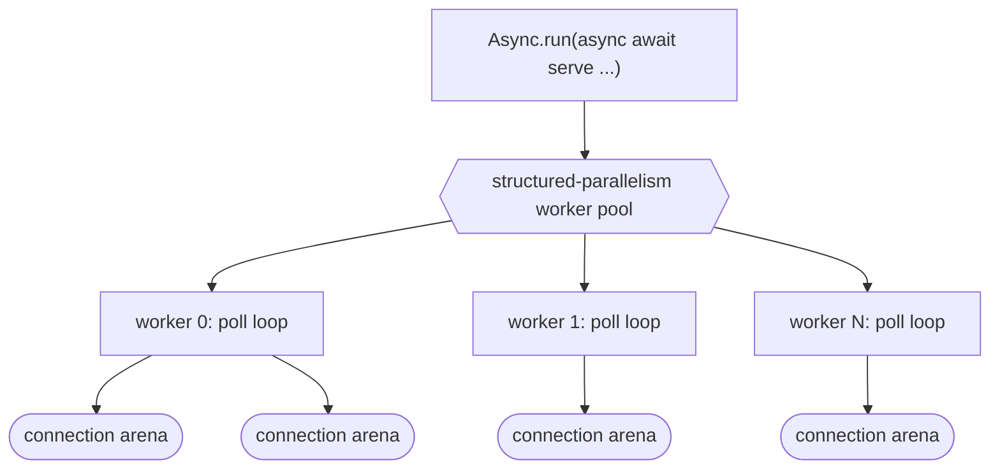
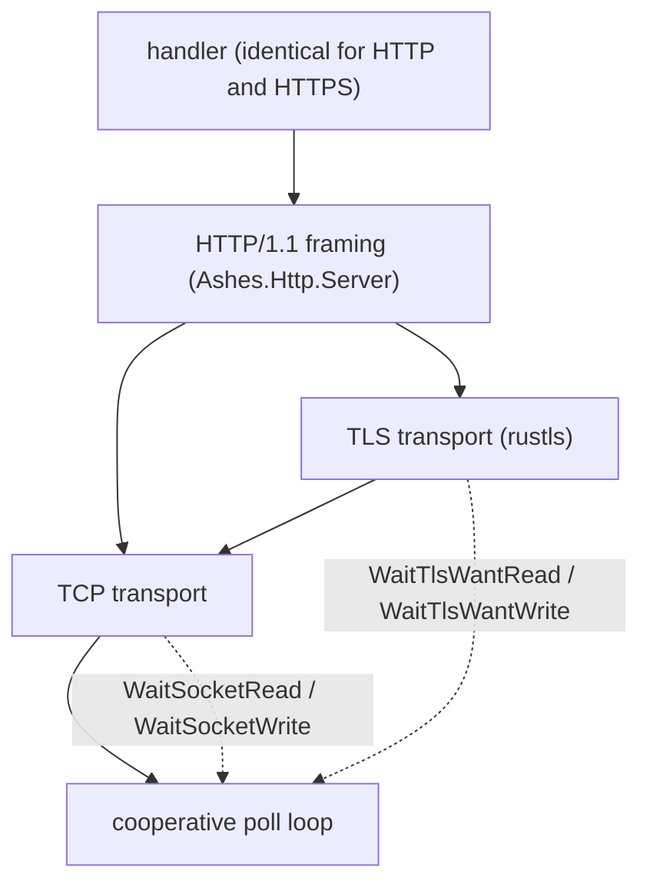
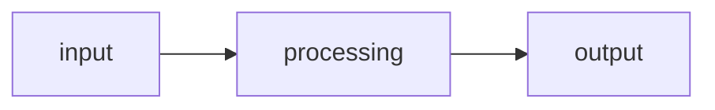
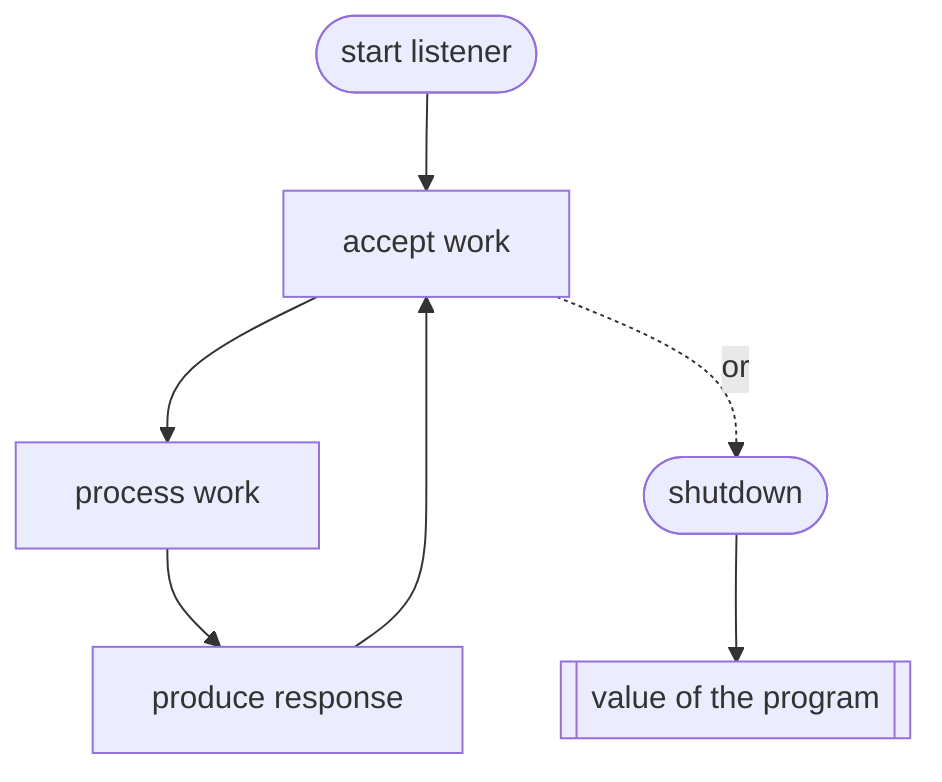

# Future: Server Support

## Status: Design (direction decided)

This document describes the intended design for long-running server support in Ashes. It supersedes
the earlier open-ended exploration: the major forks have been resolved and are recorded below as
decisions, with a smaller set of genuinely open questions left at the end.

It remains a design document, not an implementation guide. The implementation must be derived from
the existing compiler and runtime architecture (parser, semantic analysis, capabilities, async
lowering, IR, state-machine transformation, the cooperative scheduler, the structured-parallelism
runtime, and the arena memory model), not from any code sketch here. The `.ash` snippets are
illustrative surface syntax and are expected to bend to what the compiler actually infers and lowers.

---

## Goal and philosophy

Ashes programs have a clear beginning, a final expression, and eventual termination. Server support
preserves this: a server is not a different kind of program, it is a long-running expression whose
value is the lifecycle of the listener. The program still terminates — it terminates when the server
stops.

There are two entirely separate kinds of result, and keeping them separate is the spine of the whole
design:

- **The per-request / per-connection result** is local to one unit of work. It is consumed to
  produce a response and never affects the server.
- **The server lifecycle result** is the value of the final program expression. `Ok(())` means a
  clean stop (graceful shutdown, explicit stop, cancellation); `Error(...)` means the listener could
  not run (bind failure, unrecoverable listener failure).

---

## Execution model (decided)

A server is not a new runtime. It is the composition of three subsystems Ashes already has:

1. **The cooperative poll loop.** The async runtime is already an event loop: state-machine tasks
   park on typed waits (`WaitSocketRead`, `WaitSocketWrite`, `WaitTlsWantRead`, `WaitTlsWantWrite`,
   `WaitTimer`) and the scheduler `poll()`s the aggregate descriptor set when nothing is runnable.
   Accepting a connection is a task parked on `WaitSocketRead` of the listening descriptor; each
   accepted connection becomes another task on the same loop. No new scheduling concept is required
   to multiplex many connections on one thread.
2. **The structured-parallelism runtime.** Multi-core execution already exists: a worker pool built
   on `clone`/`futex` with a work-conserving queue, each worker owning a per-thread arena.
3. **The arena memory model.** Deterministic, reclaim-by-scope allocation with the reuse
   specialization that keeps hot loops allocation-free.

A server is therefore: **N worker threads (structured parallelism), each running an independent copy
of the cooperative poll loop over its own share of the connections, each connection scoped to its own
arena within the worker.**



The program itself is unchanged — a long-running task awaited as the final expression:

```ash
match Ashes.Async.run(async
    await http.serve(8080)(handle))
with
    | Ok(()) -> io.print("server stopped")
    | Error(e) -> io.print(e)
```

`await` is only legal inside an `async` block driven by `Ashes.Async.run` (see LANGUAGE_SPEC), so the
lifecycle match wraps `Async.run`, not a bare top-level `await`. `serve` returns the lifecycle
`Task(E, ())`.

---

## Concurrency model (decided: multi-threaded)

The server is multi-threaded from the first version. A single-threaded event loop would multiplex
I/O-bound connections well but would serialize on any CPU-bound handler and use one core; a server is
exactly the workload where that ceiling bites.

- **Worker-per-core, independent reactors.** Each worker thread runs its own poll loop and handles
  its own connections. There is no shared connection state and no cross-thread scheduler — this is
  the multi-reactor (prefork) shape, not a single acceptor feeding a thread pool.
- **Accept distribution.** The preferred mechanism is `SO_REUSEPORT`: each worker binds the same
  address independently and the kernel load-balances new connections across them, avoiding a shared
  accept queue and thundering-herd wakeups. A single shared bound descriptor that all workers
  `accept()` on is the fallback where `SO_REUSEPORT` is unavailable. This is a Linux-first mechanism;
  the Windows and arm64 equivalents ride on the same cross-target parallelism work that the
  structured-parallelism runtime already tracks.
- **Worker count** defaults to the detected core count (the same cap the parallel runtime uses) and
  is overridable, mirroring the existing `--parallel-workers` / worker-override surface.
- **Purity is an asset here.** Because there is no mutation, connections are genuinely independent;
  there is no shared mutable request state to guard. Any cross-connection aggregation a program wants
  (counters, metrics) is expressed with the same merge-on-join pattern as `Parallel.reduce`, not
  shared memory.

---

## Handler model (decided: return a response directly)

Handlers produce a response directly. There is no separate `render` function and no
`Result(AppError, Response)` convention imposed by the framework — an error response such as a 404 is
an ordinary `Response`, and the handler builds it. `Result` is reserved for the server lifecycle, not
for application errors.

### HTTP

```ash
import Ashes.Http.Server as http
import Ashes.IO as io

let handle req =
    match http.path(req) with
        | "/health" -> http.text(200)("ok")
        | _ -> http.text(404)("not found")
in
    match Ashes.Async.run(async await http.serve(8080)(handle)) with
        | Ok(()) -> io.print("server stopped")
        | Error(e) -> io.print(e)
```

- The handler type is `Request -> Task(E, Response)`. The normal path is a `Response`. Handlers do
  async work with ordinary `await`:

  ```ash
  let handle req =
      match await users.find(42) with
          | Ok(user) -> http.json(200)(user)
          | Error(_) -> http.text(404)("not found")
  ```

- **Handler failures are always isolated to their connection.** If a handler's task leaks an
  `Error(e)` (an unhandled failure rather than an explicit response), the server turns that single
  connection into a 500 and continues; it never stops the listener. The only failures that end the
  server are lifecycle failures (bind/listener), surfaced through the lifecycle result. Handlers are
  encouraged to catch and build explicit responses; the 500 path is a safety net, not the intended
  error channel.
- There is deliberately no `serveAsync` variant. Async is the model; a synchronous handler is just
  one that never awaits.

### TCP

TCP is session-oriented rather than request/response: the handler owns the connection and reads and
writes until the session ends.

```ash
import Ashes.Net.Tcp.Server as tcp

let recursive handle client =
    match await tcp.receive(client)(4096) with
        | Ok("") -> Ok(())
        | Ok(message) ->
            match await tcp.send(client)("echo: " + message) with
                | Ok(_) -> handle(client)
                | Error(e) -> Error(e)
        | Error(e) -> Error(e)
in
    match Ashes.Async.run(async await tcp.serve(9000)(handle)) with
        | Ok(()) -> io.print("server stopped")
        | Error(e) -> io.print(e)
```

- The handler type is `Connection -> Task(E, ())`. Persistent protocols make the handler naturally
  recursive; no loop construct is introduced. The connection is a resource, closed automatically when
  the handler task completes (see memory lifetime).

---

## Memory lifetime (central constraint)

This is the gating design work, not a side concern. The arena model assumes a program terminates and
reclaims at exit; a server never terminates, so any allocation not scoped and reclaimed accumulates
until the process is killed. Server support is unsound until this is resolved.

- **Per-connection arena scope.** Each accepted connection's handler allocates into a scope bounded
  by that connection's task, reclaimed deterministically when the task completes. Because a single
  worker's poll loop keeps many connections live at once, the requirement is stronger than the
  existing per-thread arena: a worker needs **many concurrent, independently reclaimed scopes**, one
  per live connection, not a single arena reset at a loop boundary.
- **Ties into ownership / resource safety.** A connection (its socket) is a resource with a lifetime;
  its arena scope is exactly that lifetime. This is the same machinery the ownership and
  resource-safety roadmap is building — auto-drop of a resource bound to a scope — applied to a
  connection task. Server lifetimes should be derived from that work rather than a bespoke mechanism.
- **Backpressure and bounds.** Per-worker concurrent-connection limits (accept throttling) cap
  resident memory and protect against overload; connections beyond the limit are queued or rejected
  rather than admitted unboundedly. The reuse specialization keeps steady-state per-request work
  allocation-free on the hot path where it applies.

Concrete acceptance criterion: a server under sustained load must reach a steady-state resident set,
with per-connection allocation returning to the arena on connection close. This should be validated
the way the 1BRC work validates constant memory — resident-set stability across a long run, not just
a smoke test.

---

## Capabilities

Server entry points perform network I/O, so they carry a network capability under the unified
capabilities system (for example `needs Net`). This is consistent with how effectful operations are
tracked elsewhere and makes "this program is a server" visible in its type rather than hidden. The
exact capability name and granularity (one `Net` capability versus split listen/connect) is deferred
to when `serve` is specified against the shipped capabilities surface.

---

## Library before syntax

The first implementation introduces no new language syntax. Server support is a library:

```
http.serve(8080)(handle)
tcp.serve(9000)(handle)
```

Everything above is expressible with existing constructs — functions, `match`, recursion, `async` /
`await`, capabilities, and the parallelism runtime. Dedicated syntax is only worth revisiting if,
after the library matures, it demonstrably improves readability rather than duplicating what these
constructs already express.

---

## Networking layers (decided: TCP first, HTTPS in scope)

The layers stack: a byte transport (plaintext TCP or TLS), then HTTP framing on top of whichever
transport. HTTPS is not a separate server — it is the HTTP server running over a TLS transport, so the
handler is byte-for-byte identical between HTTP and HTTPS.



- **TCP server** is the base primitive: `bind` / `listen` / `accept` added to `Ashes.Net.Tcp.Server`,
  reusing the existing `send` / `receive` / `close` and the existing socket wait kinds. `accept` parks
  on `WaitSocketRead` of the listener.
- **TLS transport** rides the existing hermetic `rustls` runtime. This is a smaller addition than it
  looks: the cooperative poll loop already drives rustls connections through `WaitTlsWantRead` /
  `WaitTlsWantWrite`, the runtime is already embedded per-executable on all three targets
  (linux-x64, linux-arm64, win-x64), and an accepted TLS connection is the existing `TlsSocket`
  runtime type. What is genuinely new is the **server side** of rustls: the client path only uses the
  client-config and certificate-verifier FFI surface, so a server needs the server-config / acceptor
  surface plus certificate-and-key provisioning (present a chain and private key, do the server half
  of the handshake, honor SNI). There is already a `tls-server` loopback fixture in the test harness,
  but it is a C# test helper for exercising the client — not an Ashes-native listener.
- **HTTP server** is a library over the transport: request parsing and response serialization,
  `Ashes.Http.Server`, reusing the HTTP/1.1 conventions already present on the client side. It is
  parameterized over the transport, which is what makes HTTP and HTTPS one code path.

### HTTPS example

The handler is unchanged from the HTTP example; only the listener differs — it takes a TLS config
(certificate chain and private key) and binds a TLS transport:

```ash
import Ashes.Http.Server as http

let handle req =
    match http.path(req) with
        | "/health" -> http.text(200)("ok")
        | _ -> http.text(404)("not found")
in
    let tls = http.tls("cert.pem")("key.pem")
    in
        match Ashes.Async.run(async await http.serveTls(8443)(tls)(handle)) with
            | Ok(()) -> io.print("server stopped")
            | Error(e) -> io.print(e)
```

`serveTls` shares the lifecycle result, the handler contract, and the multi-reactor / per-connection
arena model with `serve`; TLS is purely the transport underneath. The same applies to raw encrypted
TCP sessions — a TLS counterpart to `tcp.serve` where the handler receives a `TlsSocket`.

**Sequencing.** Prove the plaintext TCP-then-HTTP path first, then add the TLS transport; but HTTPS is
a designed-for layer here, not an afterthought — the whole point of parameterizing HTTP over the
transport is that HTTPS falls out without a second handler model.

---

## New work required

Roughly, and to be refined against the codebase:

- `Ashes.Net.Tcp.Server`: `bind`, `listen`, `accept` primitives (non-blocking; `accept` as a
  `WaitSocketRead` on the listener), including the `SO_REUSEPORT` bind option.
- Multi-reactor spawn: run one cooperative poll loop per structured-parallelism worker, over that
  worker's accepted connections.
- Per-connection arena scoping and reclamation, derived from the ownership / resource-safety work,
  plus per-worker connection bounds.
- Graceful shutdown wiring (see open questions).
- `Ashes.Http.Server`: HTTP/1.1 request parser and response serializer, plus response constructors
  (`text`, `json`, status helpers) and accessors (`path`, `method`, headers, body).
- Server-side TLS: expose the rustls-ffi server-config / acceptor surface (the client path uses only
  the client-config and verifier symbols), certificate-chain-and-private-key loading, and the
  server half of the handshake. Wire the accepted `TlsSocket` into the same accept/reactor path; the
  scheduler's existing `WaitTlsWantRead` / `WaitTlsWantWrite` handling is reused as-is. `serveTls`
  (HTTP over TLS) and a TLS `tcp.serve` counterpart sit on top of this.
- Cross-target parity (Windows, arm64) for the accept/reactor path, tracked with the existing
  cross-target parallelism work; server-side TLS matches the same three targets the rustls runtime
  already ships to.

---

## Desired mental model

A normal program:



A server:



Only shutdown produces the value of the overall program.

---

## Open questions

These are genuinely unresolved and should be settled during specification, not invented ahead of it.

### Graceful shutdown mechanism

The default is expected to be OS signals (`SIGINT` / `SIGTERM`) installed by the runtime: stop
accepting, drain in-flight connections, join workers, complete the lifecycle result with `Ok(())`.
Open: whether to also expose an explicit programmatic stop handle (and if so, its shape as a library
value threaded to the handler or returned alongside the server task), and the drain policy and
timeout for in-flight work at shutdown.

### HTTP semantics scope for v1

Keep-alive versus connection-close, `Transfer-Encoding: chunked` on the server side (the client side
currently rejects it), request size limits, and header/body accessor surface all need pinning down.

### TLS server surface

Certificate and key provisioning (PEM file paths first; ACME / auto-renewal out of scope), the exact
`http.tls` config shape, ALPN and whether HTTP/2 is negotiated (the server framing is HTTP/1.1 only
to begin with), SNI and multiple certificates for virtual hosting, TLS-version and cipher policy
(rustls defaults, TLS 1.2 / 1.3), and whether mutual TLS / client-certificate authentication is in
scope. The transport plumbing is settled by reusing rustls; these are the server-config policy
choices to pin down.

### Capability granularity

One `Net` capability versus separate listen/connect capabilities, and how the capability threads
through `serve` and the handler.

### Cross-target accept distribution

The `SO_REUSEPORT` equivalent (or shared-accept behavior) on Windows and arm64, and whether v1 ships
multi-target or Linux-x64 first with the others following the parallelism cross-target work.
