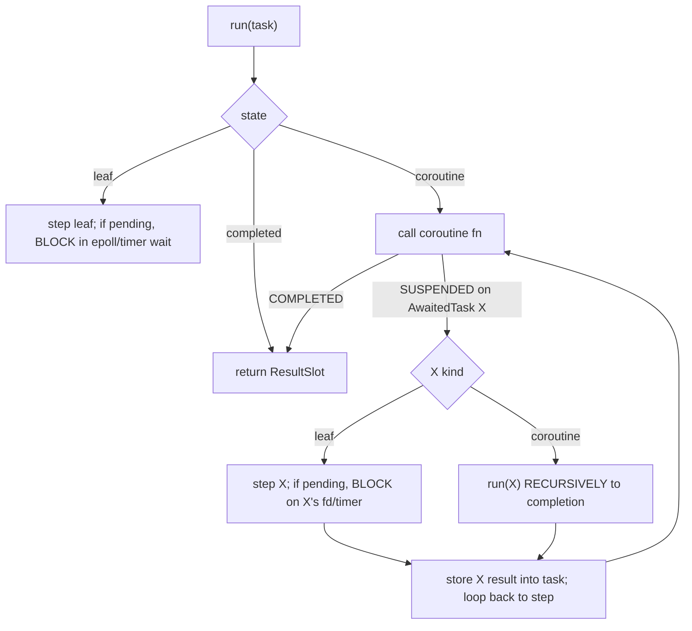
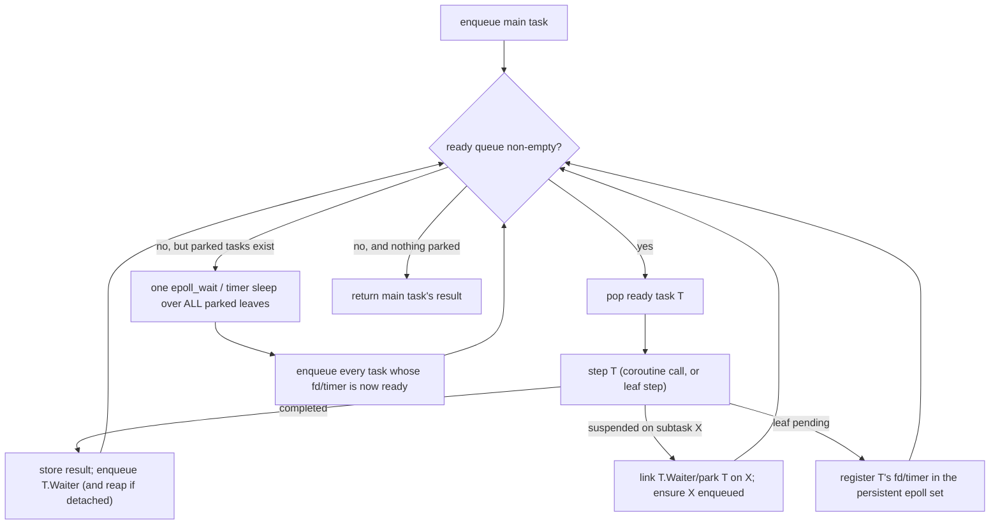

# Future: Run-queue async scheduler

## Status: Design (proposed rework)

This document proposes replacing the current **recursive, synchronous** async driver with a **flat
run-queue scheduler** (park / enqueue-on-ready / resume). It is a design, not an implementation guide:
the implementation must be derived from the existing `StateMachineTransform`, task-struct layout, and
the LLVM task-runner codegen, not from the sketches here.

Motivation is a concrete, observed limitation (see "The problem"): a spawned handler that itself
blocks in `Ashes.Async.all` / `race` serializes every other connection, because the driver runs
awaited work recursively on the C call stack and only advances other tasks opportunistically inside a
wait, under a re-entrancy guard that forbids stepping a peer while one is mid-step.

---

## The current model (as built)

Every `async` value is a heap **task struct** with a fixed header (state index, coroutine function
pointer, result slot, awaited-task pointer, scheduler-chaining / wait metadata) followed by captures
and one slot per across-`await` live variable. `StateMachineTransform` splits the body at each
`await` into numbered states; a suspend spills live slots and returns `0` (SUSPENDED), a completion
returns `1` (COMPLETED) with the state index set to `-1`. Leaf tasks (socket / timer / TLS I/O) have a
negative state index and a per-kind step function.

Driving is **recursive and synchronous**, in `EmitRunTask` / `EmitRunTaskRecursive`:

So `await X` **runs X to completion on the current C stack**. Concurrency is bolted on beside this:

- **Spawned tasks** (`Ashes.Async.spawn`) go on a singly-linked **detached list**
  (`__ashes_detached_head`).
- The blocking wait paths (`EmitWaitForPendingLeafTask`, and the `Async.all`/`race` list wait) call
  `ashes_run_detached()` before blocking. That function iterates the whole detached list and steps
  each task once (until it parks or completes), installing each task's private arena around its step.
- A **re-entrancy guard** (`__ashes_detached_stepping`) makes `ashes_run_detached` a no-op while a
  detached step is already in progress, so a task cannot re-enter and step *itself* (or be stepped
  twice in one round).

---

## The problem — pinpointed

An important nuance, verified by reading the code: a plain `await X` on a spawned handler does **not**
block. The detached stepper `EmitStepTaskUntilPendingOrDone` resolves the awaited sub-task by stepping
it once and, if it is still pending, **mirrors its wait onto the parent and returns** (park), so the
reactor can advance peers. General `await` is already cooperative.

The block is specifically **`Ashes.Async.all` / `race`**. These are lowered *inline* into the
coroutine body (`EmitAsyncAll` / `EmitAsyncRace`), and they call `ashes_wait_pending_task_list`
(`EmitWaitForPendingTaskList`) which **blocks** on `epoll_wait` / cooperative sleep until the children
finish, then collects results. There is no suspend point — the coroutine cannot yield across an
`all`/`race`. So:

- Handler A (detached) is stepped by `ashes_run_detached` → guard is set.
- A's coroutine reaches `Async.all([...])` → `ashes_wait_pending_task_list` **blocks** the reactor
  until A's children complete. Its internal `ashes_run_detached` is a guarded no-op, so peers B/C/D
  never advance while A is inside its `all`.

Measured (this branch): four connections each doing `await all([sleep 250, sleep 250])` complete in
~1000 ms (4×), not ~250 ms.

So the minimal cause is not "recursive driving everywhere" — it is that **`all`/`race` are inline
blocking calls rather than parking suspend points.**

## Two ways to fix

**(A) Full run-queue** (below) — the clean long-term architecture; replaces the whole driver. Largest
change, touches every `async` program.

**(B) Targeted: make `all`/`race` parking composite tasks** — turn `Async.all`/`race` into a suspend
point backed by a small composite task that the existing scheduler drives incrementally (children
parked individually; the reactor's existing aggregate wait advances them; the composite completes and
resumes its awaiter when all / the first child finishes). This reuses the park/mirror machinery in
`EmitStepTaskUntilPendingOrDone` and the persistent epoll set, and is confined to the `all`/`race`
lowering plus one composite step function — it does **not** touch the non-networking inline driver. It
achieves the stated server-fairness goal at a fraction of the risk of (A).

The rest of this document specifies (A). (B) is the recommended near-term step; (A) remains the
eventual target if a single unified scheduler is wanted.

---

## Proposed design: one run queue, no re-entrancy

Replace recursive driving with a single scheduler that owns **all** tasks — the main task, spawned
tasks, and every awaited sub-task — in one flat loop. Nothing is ever driven on another task's stack.

### States and links

Reuse / add task-struct header fields:

- **Ready link** — intrusive singly-linked "next ready task" (reuse the existing `NextTask` slot).
- **Waiter** — backlink: the task blocked on *this* task's completion (set by `await`), so completion
  re-enqueues the waiter. (A composite like `all` holds a small waiter set / counter.)
- **AwaitedTask** — kept: what a suspended coroutine is waiting on.
- Wait metadata (`WaitKind`, `WaitHandle`, timer remaining) — kept, for the aggregate poll.

A task is in exactly one of: **ready** (on the run queue), **parked-on-leaf** (registered in the
persistent epoll / a timer), **parked-on-subtask** (waiting for `AwaitedTask` to complete), or
**completed**.

### `await X` becomes park + link (no recursion)

When a coroutine suspends on `AwaitedTask = X`:

1. If X is already completed, store its result and re-enqueue the awaiting task (it can resume now).
2. Otherwise set `X.Waiter = awaitingTask`, ensure X is scheduled (enqueue X if not already
   ready/parked), and leave the awaiting task **parked-on-subtask**. Do not run X here.

`Ashes.Async.all` / `race` become composite tasks that enqueue their children and complete when all
(resp. the first) child completes, then re-enqueue their waiter.

### The scheduler loop (`Async.run`)

Key properties:

- **No recursion, no re-entrancy guard.** The guard and `ashes_run_detached` disappear; there is one
  loop and one stack frame doing the stepping.
- **Fairness is automatic.** A handler that awaits `all` simply parks; the loop keeps popping other
  ready handlers. Peers overlap.
- **The blocking wait is only reached when the queue is empty.** When something is ready, we never
  block. This subsumes the current "runnable → don't block" special-casing.
- **The persistent epoll set** (already built) is the parked-leaf registry: park = register, wake =
  the fd's task is enqueued. Timers fold into the `epoll_wait` timeout as today.

### Multi-reactor and arenas are unaffected

Each reactor process still runs its own scheduler over its own queue (the fork-based multi-reactor is
orthogonal). Each task keeps its private arena, installed around its step exactly as
`ashes_run_detached` does today. The arena model, the state-machine transform, and the leaf step
functions are reused unchanged; only the *driver* changes.

---

## Phased plan (keep every test green between phases)

A scheduler swap is close to all-or-nothing, so the safe path builds the new loop first and cuts over
once, rather than mutating the recursive driver in place.

1. **Scaffolding.** Add the ready-queue global + head/tail, the `enqueue` / `dequeue` runtime helpers,
   and the `Waiter` header field. No behavior change yet (nothing enqueues).
2. **New scheduler loop behind `Async.run`.** Implement `ashes_scheduler_run(mainTask)` as the flat
   loop above, using the existing leaf step functions and the persistent epoll set. Do **not** wire it
   in yet.
3. **Cut `await` over to park+link** and route `Async.run` / `spawn` through the new loop; delete
   `EmitRunTaskRecursive`, `ashes_run_detached`, and the re-entrancy guard. This is the one big cutover
   — gate it so the whole async e2e + unit suite runs against it.
4. **`Async.all` / `race` as composite tasks** on the queue (children enqueued; completion re-enqueues
   the waiter). Verify the fairness benchmark (4 concurrent `all` handlers overlap ≈ 250 ms).
5. **Cleanup + docs.** Remove dead detached-stepping code, update `architecture.md`, and add the
   fairness regression test.

Risk is concentrated in step 3 (every `async` program depends on it); it must land with the full
suite (compiler unit + LSP + e2e `.ash` + all three targets) green, and be validated against the
server benchmark for no throughput regression.
