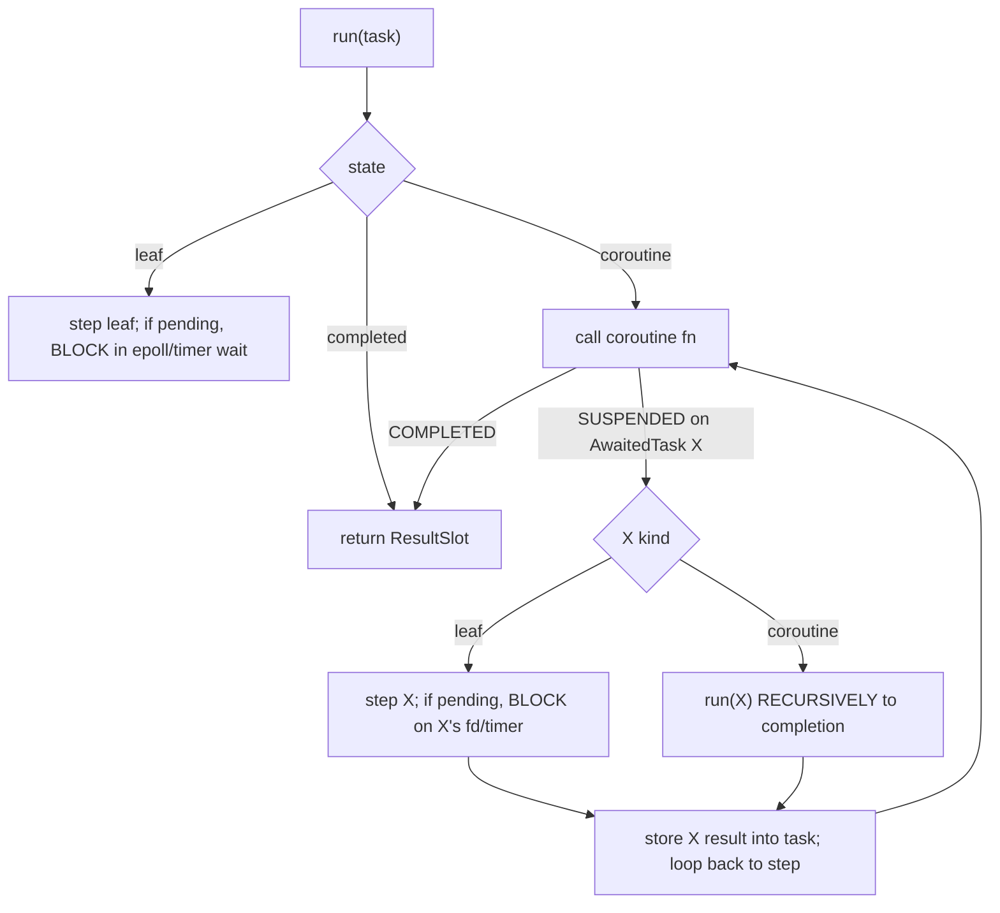
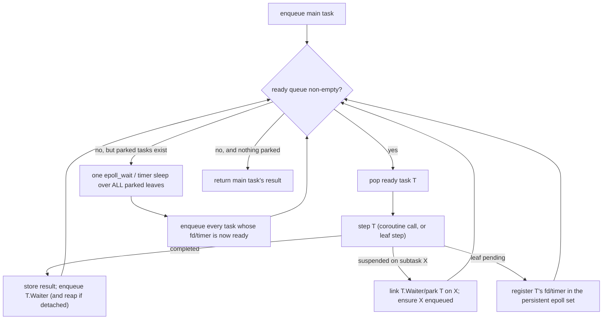

# Future: Run-queue async scheduler

## Status: Scheduler complete + fair; two server-path items remain

Delivered on branch `async-run-queue` (full gate green throughout — 1342 unit incl. arm64-via-qemu,
467 e2e):

- Task-struct fields `ReadyNext` / `Waiter` / `ArenaOwner`; the ready-queue primitives
  (`ashes_ready_enqueue` / `ashes_ready_dequeue`); and `ashes_scheduler_run`, the flat loop.
- `await`-as-park with `Waiter` delivery; the aggregate wait (cooperative timer sleep + persistent
  epoll for socket/TLS/HTTP leaves, requeue-all-on-wakeup).
- Spawn on the queue with option-2 per-task arenas: `ArenaOwner` install/restore around each step and
  reap of fire-and-forget spawned roots on completion.
- **`all` / `race` as parking composite tasks** (`StateAllComposite` / `StateRaceComposite`): a
  composite enqueues its children (`Waiter` = composite), each child completion decrements the
  composite's counter (all) or delivers the first result (race), and the re-enqueued composite collects
  and completes to its own waiter. A spawned handler's `Async.all` now **parks instead of blocking**, so
  peers run — the fairness repro (4 concurrent `all([sleep 250, sleep 250])` handlers) overlaps at
  ~254 ms vs the old ~1004 ms.
- **Zero-init of the run-queue header slots** (`ReadyNext`/`Waiter`/`ArenaOwner`) in every task creator
  — fixes a release-only (-O2) wild-pointer crash that was surfacing under concurrent HTTP load.
- On Linux **every** async program — including servers (spawn + sockets) — runs on the scheduler;
  Windows keeps the legacy driver for socket/spawn programs (the epoll wait is Linux-only).

Benchmark (clean env): TCP echo **315k** req/s, 0 errors (≈ 2× the .NET baseline); non-networking
async, client TCP/TLS/HTTP, and single-reactor HTTP servers all correct.

### Task 1: forkWorkers child cleanup — VERIFIED WORKING

Checked directly: starting a default `Http.Server.serve` spawns one reactor per CPU (32 here), and
killing the parent with `SIGTERM` reaps **all** of them within ~2 s (32 → 0). `PR_SET_PDEATHSIG` works.
The "lingering reactors" seen during development were transient — graceful shutdown takes ~1–2 s and
`bench.sh` only `sleep 0.3`s between stages, so rapid successive runs overlapped. Not a code bug; if
the benchmark tooling needs it, lengthen `bench.sh`'s post-kill wait. No compiler change required.

### Task 2: concurrent HTTP crashes the reactor — REAL BUG, not yet fixed

Confirmed through the harness (the reliable signal), so **not** an environment artifact: firing HTTP
requests **concurrently** at a scheduler-driven server **segfaults the reactor** (`SEGV_MAPERR`, a wild
pointer in the scheduler). Isolated:

- **Sequential** HTTP requests work (`should_serve_http_over_the_tcp_server` passes).
- **Concurrent TCP** works (`should_serve_connections_concurrently`, and the fairness repro, pass).
- **Concurrent HTTP** fails — reliably, at even **4** concurrent requests, single- **or** multi-reactor.

So the trigger is the HTTP handler (its recursive `connLoop` buffering + heavier allocation) under
concurrency, not TCP and not multi-reactor per se. The core-dump stack is the same shape/region as the
pre-fix uninitialized-field crash, so the zero-init fix (already landed) was **necessary but
insufficient** — a second wild-pointer source remains in the scheduler's handling of concurrent,
allocation-heavy coroutine handlers. The earlier "16×200 concurrent, 0 errors" was almost certainly a
stale/lucky server answering (manual binds are unreliable in this sandbox), so it did not actually
clear this.

Repro is captured as a **skipped** regression test:
`LinuxBackendCoverageTests.Linux_backend_llvm_should_serve_http_concurrently_across_workers` — un-skip
once fixed.

**Diagnosis so far** (debug build via `EmitDebugInfo = true`, core + gdb/objdump):

- The faulting instruction is `cmpq $0x1,(%rcx)` in **`lambda_3`** (a `listener`-parameterized function
  — the accept loop) called from `coroutine_2` — i.e. an **ADT tag check on a `Result`** the accept
  loop reads. `%rcx` is `0x7f…001c0`, an arena-range address that is **unmapped**. The `Result` came
  from a preceding `call` (`0x410fc4`, a symbol-less runtime function).
- **Ruled out — use-after-free / reap:** disabling `EmitReapTaskArena` entirely does **not** fix it, and
  the address is unmapped even with nothing freed. So it is a *wild* pointer (a value that was never a
  valid allocation), not a dangling one.
- **Ruled out — ready-queue double-enqueue:** adding a `QueuedFlag` to make `ashes_ready_enqueue`
  idempotent did **not** fix it.
- **So:** the accept coroutine's `ResultSlot` holds a garbage arena pointer — the accept leaf
  (`WaitKind = accept`, `ArenaOwner = 0`, the reactor's global arena) allocated its `Ok(client)` result
  into a **wild arena** while concurrent, allocation-heavy handlers churn. The trigger is *concurrent
  complex handlers* (sequential HTTP and concurrent TCP are both fine), so a handler's step is leaving
  the global allocation cursor in a bad state that a subsequent owner-0 step (the accept leaf) then
  allocates through.

**ROOT CAUSE FOUND — nested scheduler runs.** `await` lowers two ways (Lowering.cs, `LowerAwait`):
inside a coroutine body (`_inCoroutineBody`) it emits `AwaitTask` (a suspend point); anywhere else it
emits `RunTask` (a **blocking** `ashes_scheduler_run`). The server combinators do their looping in
`let recursive` helpers **nested inside** `async(...)` — `serveOne`'s accept loop and `Http.Server`'s
`connLoop`. A lambda body is not run through `StateMachineTransform` (which is linear-only — it splits
at awaits but has no back-edges/loops), so `_inCoroutineBody` is reset to `false` for it (Lowering.cs
~1570), and every `await` in those loops becomes a **nested** `ashes_scheduler_run`. The legacy driver
tolerated nested inline drives; the run-queue scheduler cannot — nested runs re-enter and drive the
**shared** global ready-queue/parked-list, so under concurrent handlers they double-drive and corrupt.
The `cmpq $1,(%rcx)` crash is in the accept loop reading a `Result` returned by such a nested run.

**Confirmed by construction:** disabling the scheduler makes the identical test pass; reap-off,
idempotent-enqueue, and no-op'ing `EmitInstallTaskArena` do **not** fix it (so it is not arena/reap/
queue-self-loop). Ruling this in: `objdump`/`addr2line` show `lambda_3` (the accept loop) calling a
routine that zero-inits the scheduler header slots and reads the TCB — that routine is
`ashes_scheduler_run`, i.e. the accept loop is doing a nested run per `await accept`.

### The proper fix and why it is not a small patch

The loops must stop nesting runs — their `await`s must be **suspend points on the one top-level run**.
Two routes, both non-trivial:

1. **Teach `StateMachineTransform` to compile tail-recursive async loops** (back-edges), so `serveOne`/
   `connLoop` become looping coroutines. This is the "async loops" feature — a real addition to the
   transform, which today is strictly linear.
2. **Rewrite the combinators as spawn-next chains** (each iteration awaits once as a linear coroutine,
   then `spawn`s the next iteration instead of recursing). Attempted on this branch and reverted; it
   surfaced three further blockers:
   - The scheduler must not exit when the main coroutine completes but spawned work is still parked —
     needs the termination keyed on "nothing runnable and nothing parked" (with a re-entrancy depth
     counter so genuinely-nested runs still return on their own task). Prototyped and works.
   - **Windows/legacy driver** does not drive a spawn-next accept chain (no shared run queue), so a
     spawn-next `serveOne` breaks every Windows server test. The combinator rewrite would have to be
     target-aware, or the legacy driver taught the same shape.
   - **A distinct scheduler result-delivery bug** (the real wall): a **spawned** task that awaits a
     socket leaf (e.g. `receive`) and then awaits a **sub-coroutine** (`handler(req)`) gets the
     sub-coroutine's result delivered as **garbage** — `render(resp)` then dereferences a string whose
     data pointer is a tiny integer (crash: `rep`-style copy with `rdi=0`/`rsi=3`). Isolated minimal
     repros (spawn→coroutine-await, nested-spawn, leaf+coroutine-await, handler-param-through-spawn) all
     work; only *socket-leaf-then-coroutine-await inside a spawned task* corrupts. This needs its own
     focused fix before spawn-next servers can work, independent of the loop question.

**Next step:** fix the result-delivery bug first (it blocks any spawn-next server and is the smallest
well-isolated defect), then choose route 1 or 2 for the loops. The `should_serve_http_concurrently…`
regression test stays skipped until then; the branch is otherwise gate-green.

**The scheduler is therefore not yet "done":** fairness, non-networking async, client I/O, TCP servers,
and sequential HTTP are all correct and gate-green, but concurrent HTTP servers crash. This doc stays
until task 2 is fixed; only then move the permanent notes to `internals/architecture.md` and remove it.

## Original design (for reference)

This document originally proposed replacing the current **recursive, synchronous** async driver with a **flat
run-queue scheduler** (park / enqueue-on-ready / resume). It is a design, not an implementation guide:
the implementation must be derived from the existing `StateMachineTransform`, task-struct layout, and
the LLVM task-runner codegen, not from the sketches here.

Motivation is a concrete, observed limitation (see "The problem"): a spawned handler that itself
blocks in `Ashes.Async.all` / `race` serializes every other connection, because the driver runs
awaited work recursively on the C call stack and only advances other tasks opportunistically inside a
wait, under a re-entrancy guard that forbids stepping a peer while one is mid-step.

---

## The current model (as built)

Every `async` value is a heap **task struct** with a fixed header (state index, coroutine function
pointer, result slot, awaited-task pointer, scheduler-chaining / wait metadata) followed by captures
and one slot per across-`await` live variable. `StateMachineTransform` splits the body at each
`await` into numbered states; a suspend spills live slots and returns `0` (SUSPENDED), a completion
returns `1` (COMPLETED) with the state index set to `-1`. Leaf tasks (socket / timer / TLS I/O) have a
negative state index and a per-kind step function.

Driving is **recursive and synchronous**, in `EmitRunTask` / `EmitRunTaskRecursive`:

So `await X` **runs X to completion on the current C stack**. Concurrency is bolted on beside this:

- **Spawned tasks** (`Ashes.Async.spawn`) go on a singly-linked **detached list**
  (`__ashes_detached_head`).
- The blocking wait paths (`EmitWaitForPendingLeafTask`, and the `Async.all`/`race` list wait) call
  `ashes_run_detached()` before blocking. That function iterates the whole detached list and steps
  each task once (until it parks or completes), installing each task's private arena around its step.
- A **re-entrancy guard** (`__ashes_detached_stepping`) makes `ashes_run_detached` a no-op while a
  detached step is already in progress, so a task cannot re-enter and step *itself* (or be stepped
  twice in one round).

---

## The problem — pinpointed

An important nuance, verified by reading the code: a plain `await X` on a spawned handler does **not**
block. The detached stepper `EmitStepTaskUntilPendingOrDone` resolves the awaited sub-task by stepping
it once and, if it is still pending, **mirrors its wait onto the parent and returns** (park), so the
reactor can advance peers. General `await` is already cooperative.

The block is specifically **`Ashes.Async.all` / `race`**. These are lowered *inline* into the
coroutine body (`EmitAsyncAll` / `EmitAsyncRace`), and they call `ashes_wait_pending_task_list`
(`EmitWaitForPendingTaskList`) which **blocks** on `epoll_wait` / cooperative sleep until the children
finish, then collects results. There is no suspend point — the coroutine cannot yield across an
`all`/`race`. So:

- Handler A (detached) is stepped by `ashes_run_detached` → guard is set.
- A's coroutine reaches `Async.all([...])` → `ashes_wait_pending_task_list` **blocks** the reactor
  until A's children complete. Its internal `ashes_run_detached` is a guarded no-op, so peers B/C/D
  never advance while A is inside its `all`.

Measured (this branch): four connections each doing `await all([sleep 250, sleep 250])` complete in
~1000 ms (4×), not ~250 ms.

So the minimal cause is not "recursive driving everywhere" — it is that **`all`/`race` are inline
blocking calls rather than parking suspend points.**

## Two ways to fix

**(A) Full run-queue** (below) — the clean long-term architecture; replaces the whole driver. Largest
change, touches every `async` program.

**(B) Targeted: make `all`/`race` parking composite tasks** — turn `Async.all`/`race` into a suspend
point backed by a small composite task that the existing scheduler drives incrementally (children
parked individually; the reactor's existing aggregate wait advances them; the composite completes and
resumes its awaiter when all / the first child finishes). This reuses the park/mirror machinery in
`EmitStepTaskUntilPendingOrDone` and the persistent epoll set, and is confined to the `all`/`race`
lowering plus one composite step function — it does **not** touch the non-networking inline driver. It
achieves the stated server-fairness goal at a fraction of the risk of (A).

The rest of this document specifies (A). (B) is the recommended near-term step; (A) remains the
eventual target if a single unified scheduler is wanted.

---

## Proposed design: one run queue, no re-entrancy

Replace recursive driving with a single scheduler that owns **all** tasks — the main task, spawned
tasks, and every awaited sub-task — in one flat loop. Nothing is ever driven on another task's stack.

### States and links

Reuse / add task-struct header fields:

- **Ready link** — intrusive singly-linked "next ready task" (reuse the existing `NextTask` slot).
- **Waiter** — backlink: the task blocked on *this* task's completion (set by `await`), so completion
  re-enqueues the waiter. (A composite like `all` holds a small waiter set / counter.)
- **AwaitedTask** — kept: what a suspended coroutine is waiting on.
- Wait metadata (`WaitKind`, `WaitHandle`, timer remaining) — kept, for the aggregate poll.

A task is in exactly one of: **ready** (on the run queue), **parked-on-leaf** (registered in the
persistent epoll / a timer), **parked-on-subtask** (waiting for `AwaitedTask` to complete), or
**completed**.

### `await X` becomes park + link (no recursion)

When a coroutine suspends on `AwaitedTask = X`:

1. If X is already completed, store its result and re-enqueue the awaiting task (it can resume now).
2. Otherwise set `X.Waiter = awaitingTask`, ensure X is scheduled (enqueue X if not already
   ready/parked), and leave the awaiting task **parked-on-subtask**. Do not run X here.

`Ashes.Async.all` / `race` become composite tasks that enqueue their children and complete when all
(resp. the first) child completes, then re-enqueue their waiter.

### The scheduler loop (`Async.run`)

Key properties:

- **No recursion, no re-entrancy guard.** The guard and `ashes_run_detached` disappear; there is one
  loop and one stack frame doing the stepping.
- **Fairness is automatic.** A handler that awaits `all` simply parks; the loop keeps popping other
  ready handlers. Peers overlap.
- **The blocking wait is only reached when the queue is empty.** When something is ready, we never
  block. This subsumes the current "runnable → don't block" special-casing.
- **The persistent epoll set** (already built) is the parked-leaf registry: park = register, wake =
  the fd's task is enqueued. Timers fold into the `epoll_wait` timeout as today.

### Multi-reactor is unaffected

Each reactor process still runs its own scheduler over its own queue (the fork-based multi-reactor is
orthogonal). The state-machine transform and the leaf step functions are reused unchanged; only the
*driver* changes.

### Open design issue: arenas and cross-task result lifetime

This is the subtlety that must be nailed before the loop is written, or it will produce
use-after-free bugs. Today everything is nested on one C stack, so:

- An awaited sub-task is allocated in, and runs in, its **parent's** arena. Its result is therefore
  already in the parent's arena when the parent resumes and reads it — trivially alive.
- A spawned task has its **own** private arena chunk chain (`EmitSpawnTask`), freed on completion by
  `ashes_run_detached` (the task struct itself lives in its first chunk).

Decoupling sub-tasks into the queue breaks the first assumption: a sub-task is now stepped
independently, so "the parent's arena is installed" is no longer automatic, and a completing task's
**result** (a heap value like `Ok(socket)`) must outlive whatever arena is torn down at completion.
Concretely: if a spawned task's private arena is freed on completion (as today) but its result was
allocated there, delivering that result to a waiter is a use-after-free.

Options to resolve (pick before coding the loop):

1. **Per-task arenas for every task, results copied to the waiter on delivery.** On `handle_complete`,
   deep-copy the result out of the completing task's arena into the waiter's arena before freeing.
   Uniform but adds a copy-out at every completion (reuse the existing arena copy-out machinery).
2. **Sub-tasks share the awaiter's arena; only spawned tasks get private arenas.** Keeps the nested
   model's zero-copy for the common `await` case; a spawned task's result is copied out to the reactor
   arena when the reactor (its logical waiter) consumes it. Closer to today's behavior, fewer copies,
   but two arena regimes to track per task.
3. **Never free on completion; rely on reactor-lifetime arenas.** Simplest, but reintroduces unbounded
   growth for long-lived reactors — rejected (the whole point of private-arena reaping is bounded RSS).

**Chosen: option (2).** It is the performance winner — it keeps every `await` zero-copy (a typical
handler awaits 4+ times per request; option 1 would add a deep result copy-out at each, i.e. millions
of avoidable copies/second at server throughput), and localizes the one required copy to the
spawned→reactor boundary that already exists today. The loop, `Waiter` delivery, and `handle_complete`
are specified against this:

- **Sub-tasks** (created by an `await`, incl. `all`/`race` children) allocate in and are stepped with
  the **awaiter's** installed arena — never freed on completion; their result is already in the
  awaiter's arena, so delivery to the `Waiter` is a pointer store, zero-copy.
- **Spawned tasks** keep their private arena (`EmitSpawnTask`), installed around each of their steps
  exactly as `ashes_run_detached` does today, and reaped on completion. A spawned task's result
  crosses into the reactor only where the reactor consumes it, and is deep-copied out there (reusing
  the existing arena copy-out machinery) before the private arena is freed.

Because sub-tasks are stepped **independently** (not nested on the parent's stack), "the awaiter's
arena" must be recoverable at step time. So each task carries an **`ArenaOwner`** header pointer: the
nearest spawned-ancestor task whose private `ArenaCursor`/`ArenaEnd` it shares (0 = the global arena,
used by the main task and its sub-tasks). It propagates on creation — a newly created sub-task
inherits its creator's `ArenaOwner`; a spawned task is its own owner. The scheduler installs
`ArenaOwner`'s cursor around each step and writes the grown cursor back, so all tasks sharing an owner
allocate through one cursor. `ArenaOwner` is distinct from `Waiter`: an `all`/`race` child's waiter is
the composite task, but its arena owner is the enclosing spawned handler.

---

## Phased plan (keep every test green between phases)

A scheduler swap is close to all-or-nothing, so the safe path builds the new loop first and cuts over
once, rather than mutating the recursive driver in place.

1. **Scaffolding.** Add the ready-queue global + head/tail, the `enqueue` / `dequeue` runtime helpers,
   and the `Waiter` header field. No behavior change yet (nothing enqueues).
2. **New scheduler loop behind `Async.run`.** Implement `ashes_scheduler_run(mainTask)` as the flat
   loop above, using the existing leaf step functions and the persistent epoll set. Do **not** wire it
   in yet.
3. **Cut `await` over to park+link** and route `Async.run` / `spawn` through the new loop; delete
   `EmitRunTaskRecursive`, `ashes_run_detached`, and the re-entrancy guard. This is the one big cutover
   — gate it so the whole async e2e + unit suite runs against it.
4. **`Async.all` / `race` as composite tasks** on the queue (children enqueued; completion re-enqueues
   the waiter). Verify the fairness benchmark (4 concurrent `all` handlers overlap ≈ 250 ms).
5. **Cleanup + docs.** Remove dead detached-stepping code, update `architecture.md`, and add the
   fairness regression test.

Risk is concentrated in step 3 (every `async` program depends on it); it must land with the full
suite (compiler unit + LSP + e2e `.ash` + all three targets) green, and be validated against the
server benchmark for no throughput regression.

### Confirmed integration points (so the cutover needs no re-investigation)

- **Where the scheduler lives.** `usesNetworkingRuntimeAbi` (`LlvmCodegen.cs`, the big disjunction
  ending ~line 470) is already true for *any* async program — it includes `RunTask`, `SpawnTask`,
  `AsyncSleep`, `AsyncAll`, `AsyncRace`. So the shared task-runtime functions
  (`ashes_step_task_until_wait_or_done`, `ashes_run_detached`, the leaf steppers) are emitted for every
  async program. Add `ashes_scheduler_run(mainTask)`, `ashes_ready_enqueue(task)`,
  `ashes_ready_dequeue()` in that same ABI block (`LlvmCodegenBuiltins.Net.cs`, alongside the
  `EmitRuntimeFunction("ashes_run_detached", …)` registrations ~line 320).
- **Reusable primitives.** `EmitStepLeafTask` (returns 1 = completed / 0 = pending, setting
  `WaitKind`/`WaitHandle` on park) is the per-leaf step. The coroutine call is a plain
  `call i64 CoroutineFn(task, 0)` returning 1 = COMPLETED / 0 = SUSPENDED (with a fresh `AwaitedTask`
  stored). The persistent epoll set + `ashes_epoll_register` / `EmitWaitForPendingLeafTask` are the
  parked-leaf registry and aggregate wait.
- **Call sites to reroute to `ashes_scheduler_run`.** `RunTask` at `LlvmCodegen.cs:1477`
  (`EmitRunTask`); the three Net-ABI drive sites at `LlvmCodegenBuiltins.Net.cs:583/593/603`; and
  `SpawnTask` (`EmitSpawnTask`, `LlvmCodegenExpressions.cs:1686`) becomes `ashes_ready_enqueue`.
- **`all`/`race`.** Today lowered inline as blocking `ashes_wait_pending_task_list`
  (`EmitAsyncAll`/`EmitAsyncRace` → `EmitWaitForPendingTaskList`). Under the run queue they become
  composite tasks whose children are enqueued and whose completion re-enqueues the awaiter — this is
  also exactly the smaller **option (B)** fix, so it can land first and be reused by (A).
- **To delete at cleanup.** `EmitRunTask`, `EmitRunTaskRecursive`, `EmitRunDetachedBody` /
  `ashes_run_detached`, and the `__ashes_detached_stepping` guard.
