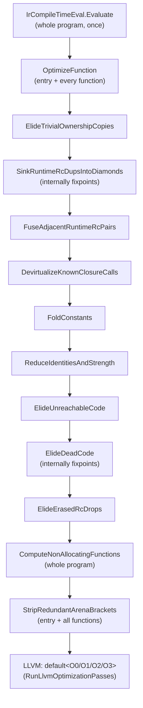
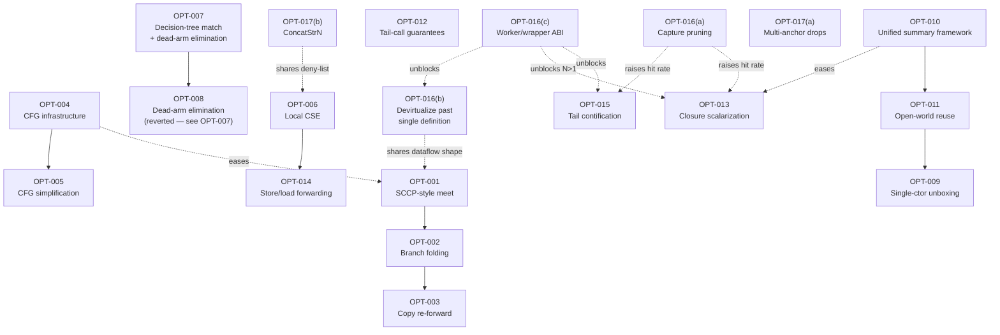

# Optimizer Capability Gap Analysis

Research-only audit of the Ashes compiler optimizer as of 2026-08-23. This document does not change
compiler behavior. It exists so a future implementation agent can pick up any `OPT-XXX` task and start
work without repeating this investigation.

## Scope and method

The investigation traced actual code paths across `src/Ashes.Semantics/` (lowering, IR, the optimizer,
compile-time evaluation, Perceus lifetime placement, reuse), `src/Ashes.Backend/` (LLVM codegen and
pass-manager invocation), the relevant test suites (`src/Ashes.Tests`, `tests/*.ash`), and git history,
rather than filenames or documentation claims. Every `IMPLEMENTED`/`PARTIAL`/`INDIRECT` claim below
cites a file and line range observed during this investigation; line numbers will drift as the codebase
changes; treat them as pointers to re-locate the code, not permanent anchors. Every `MISSING` claim
states what was searched for.

Two constraints shaped every recommendation:

1. **Do not duplicate what already exists.** Ashes already has a non-trivial, in places unusually
   mature, optimizer — particularly around ownership/RC (the "Perceus" substrate). Several classical
   optimizations that look absent under their textbook name turn out to be implemented under a
   different one, or achieved as a side effect of ownership analysis. Each `MISSING` finding below was
   checked against this possibility before being reported as a genuine gap.
2. **Every task must be implementable in the C# compiler, and every C# task changes what the
   self-hosted (`selfhost/`) compiler must eventually match.** [`SELF_HOSTING.md`](SELF_HOSTING.md)
   tracks self-host porting progress with `[x]`/`[ ]` checklist items. As of this writing, the
   "Optimization, ownership, and reuse" section (`SELF_HOSTING.md:359-394`) shows the deterministic
   IR-optimization pipeline (constant eval, ownership-copy elision, RC dup/drop sinking and fusion,
   closure devirtualization, constant folding, identity/strength reduction, dead/unreachable-code
   elimination, arena-bracket stripping) and ordinary/mutual TCO with cost signals as **already ported**
   (`[x]`, lines 361-376), while ownership/RC/reuse inference itself — parameter/capture ownership,
   result freshness, moves/borrows, heap-layout classification, Perceus dup/drop insertion, allocation
   reuse for tuples/ADTs/closures/tail paths — is **not yet ported** (`[ ]`, lines 377-393). Every task
   below therefore carries a **Self-Hosting Impact** note: for the already-ported pipeline, the C# change
   must be mirrored in `selfhost/`, tracked by a **new** `[ ]` checklist line next to the existing `[x]`
   one rather than a rewrite of that line's text (parity would otherwise silently rot, or worse, get
   silently misrepresented as already having shipped — see the hard gate in Section 5); for the
   not-yet-ported ownership/reuse work, the task's outcome becomes part
   of what the self-hosted port must build *directly* — there is no already-shipped self-host behavior to
   go back and fix, so the self-host implementer should target the improved C# design from the start
   rather than porting an intermediate version and upgrading it twice.

---

## 1. Executive Summary

**Maturity is sharply bimodal.** In the areas unique to Ashes' own design — ownership inference,
reference-counting insertion/elision, Perceus-style drop-guided reuse, whole-program compile-time
evaluation, and loop-based tail-call optimization — the optimizer is deep, well-tested, and in several
places comparable in ambition to Koka/Perceus itself: `PerceusLifetimePlacement.cs` computes real
per-block liveness and dominance to place `RcDrop`s at true last use (not lexical scope exit);
`Lowering.Reuse.cs` demonstrably reuses in-place through recursive, self-referential ADTs (binary trees,
not just lists), through pattern matching, and across function calls via compile-time function cloning;
`IrCompileTimeEval.cs` folds whole recursive calls (not just single expressions) to constants under a
step/depth budget. In the areas most compilers build *first* — a reusable control-flow-graph
abstraction, SSA/use-def infrastructure, common-subexpression elimination, jump threading, branch
folding on statically-known conditions, and general pattern-match decision-tree compilation — Ashes is
conspicuously thin. This is not accidental: the LLVM backend picks up nearly all of the classical
half at `-O1`+ (`simplifycfg`, `mem2reg`+phi construction, GVN, inlining, LICM, unrolling all run inside
LLVM's `default<Ox>` pass pipeline, `LlvmCodegen.cs:379-397`), so building the same thing twice in Ashes
would mostly be redundant — **except** where LLVM structurally cannot recover the information Ashes
already has (ownership, purity, uniqueness, evidence/dictionary shape), which is exactly where this
report's proposed tasks concentrate.

- **Strongest areas:** ownership/RC/reuse (Category 10), whole-call compile-time evaluation
  (Category 3's `IrCompileTimeEval`), self/mutual tail-call-to-loop conversion (Category 7).
- **Weakest areas:** CFG/SSA-adjacent infrastructure (Categories 1-2, effectively absent as reusable
  infra), CSE/GVN (Category 4, entirely absent at the Ashes level), general pattern-match compilation
  (Category 12, a flat single-level tag-switch or naive linear chain, not a real decision tree).
- **Most important architectural gap:** no reusable control-flow-graph abstraction. The one real
  block/dominator/liveness builder in the compiler (`PerceusLifetimePlacement.cs:549,623-630,491-538`)
  is private to one pass. Every other pass that needs predecessor/successor reasoning approximates it
  with weaker per-pass heuristics (`IrOptimizer.cs`'s `CountBranchRefsToLabels` reference counting,
  single-vs-multi-predecessor label special-casing). This single gap is the reason a demonstrably
  provable optimization — folding a constant that agrees on all paths into a join point — is currently
  discarded by design (`IrOptimizer.cs:1392-1398`, see `OPT-001`).
- **Top 5 recommended improvements:** generalize the CFG/dominator/liveness infrastructure (`OPT-004`);
  compute a real meet-over-paths at multi-predecessor labels instead of clearing constant-propagation
  state (`OPT-001`); replace the flat tag-switch/linear-chain match compiler with a real decision tree
  that shares sub-tests across arms (`OPT-007`); consolidate the several independent interprocedural
  analyses into one reusable function-summary framework and use it to extend reuse across today's
  closed-world call-boundary restriction (`OPT-010`/`OPT-011`); add local common-subexpression
  elimination for pure calls and field loads, reusing the purity oracle `IrCompileTimeEval` already
  computes (`OPT-006`).

---

## 2. Current Optimizer Inventory

Organized by the fifteen research categories. `IMPLEMENTED`/`PARTIAL`/`INDIRECT`/`LLVM-DELEGATED`
entries cite the concrete code; `MISSING` entries state what was searched for.

### 2.1 CFG and Control-Flow Optimization

| Capability | Status | Evidence |
|---|---|---|
| Basic-block representation | PARTIAL | Private `Block` type only inside `PerceusLifetimePlacement.cs:549`; no shared type. IR itself (`Ir.cs`) is a flat `List<IrInst>` per function with `Label`/`Jump`/`JumpIfFalse`/`SwitchTag` (`Ir.cs:1867-1885`). |
| CFG construction (reusable) | MISSING | Only `PerceusLifetimePlacement.BuildBlocks` (`:623-630`), scoped to that one pass. `IrOptimizer.cs` never builds a block graph. |
| CFG simplification / block merging | MISSING | No pass merges a `Label`-then-`Jump` sequence or fuses blocks joined by an unconditional jump. |
| Jump threading | MISSING | No rewriting of `Jump L1` where `L1: Jump L2` into `Jump L2`. |
| Branch folding (known-constant condition) | MISSING | `knownBools` is tracked (`IrOptimizer.cs:980-1024`) but never consulted by the `JumpIfFalse` handling in `HandleConstantControlFlow` (`:1303-1349`). See `OPT-002`. |
| Redundant branch elimination | MISSING | Same evidence as above. |
| Unreachable code elimination | IMPLEMENTED (linear, not block-based) | `ElideUnreachableCode` (`IrOptimizer.cs:1659-1691`) drops instructions after a terminator until the next `Label`. |
| Empty block elimination | MISSING | No pass removes a `Label` immediately followed by `Jump` or with no instructions before the next label. |
| Redundant jump elimination | MISSING | No pass removes `Jump L` where `L` is the next label (fallthrough). |
| Switch/match simplification | MISSING at IR level | `SwitchTag` is always treated as opaque; comment at `IrOptimizer.cs:1339-1345` explicitly clears all constant state at a `SwitchTag` join. |
| Control-flow canonicalization | MISSING | No canonicalization pass. |
| Dominator analysis | IMPLEMENTED, scoped | `ComputeDominators` (`PerceusLifetimePlacement.cs:491-538`), private to lifetime placement. |
| Post-dominator analysis | MISSING | No "post-dominat" occurrences anywhere in `Ashes.Semantics`/`Ashes.Backend`. |
| CFG optimization at LLVM level | LLVM-DELEGATED | `RunLlvmOptimizationPasses` (`LlvmCodegen.cs:379-397`) runs LLVM's full `default<O1/O2/O3>` pipeline, including `simplifycfg`, at `-O1`+. |
| CFG construction (physical, at codegen) | LLVM-DELEGATED | The LLVM backend, not Ashes IR, builds the real basic-block graph: pre-creates an LLVM `BasicBlock` per `Label` (`LlvmCodegen.cs:1633-1637`) and inserts `BuildBr` at fallthrough (`:1690-1720`). |

### 2.2 SSA / Use-Def Infrastructure

| Capability | Status | Evidence |
|---|---|---|
| SSA form | MISSING by design, LLVM-DELEGATED | Every temp/local becomes an LLVM `alloca` (`LlvmCodegen.cs:1607-1617`); `mem2reg` promotes to SSA/phi during LLVM optimization. Explicit comment: `LlvmCodegenMemory.cs:1423-1424`, "no phi node binding available; mem2reg promotes this to a phi automatically." |
| Phi nodes / block parameters | MISSING in Ashes IR | Control-flow joins (`match`/`if` results) lower to a `NewLocal()` slot written via `StoreLocal` from each arm, read via `LoadLocal` at the join (`Lowering.Patterns.cs:31,64,68,712`) — the classic "alloca instead of phi" pattern. |
| Use-def / def-use chains | PARTIAL, per-pass | ~15 `Collect*UsedTemps` helpers (`IrOptimizer.cs:1918,1941-2309`) and `CollectBorrowElisionInfo` (`:596-620`) recompute use sets per pass; no persisted shared structure. |
| Dominance relationships | IMPLEMENTED, scoped | Same as Category 1: `PerceusLifetimePlacement.cs` only. |
| Liveness information | IMPLEMENTED, scoped | `PerceusLifetimePlacement.cs` `LiveIn`/`LiveOut` (`~176-196`), purpose-built for RC-drop placement, not reused elsewhere. |
| Variable/version tracking | INDIRECT | Monotonic integer temp numbering (`IrFunction.TempCount`) acts as single-assignment-by-construction, exploited by `knownInts`/`knownFloats`/`knownBools` dictionaries — but single-assignment is a lowering convention, not an enforced/checked invariant. |
| Value numbering / GVN / CSE | MISSING (Ashes), LLVM-DELEGATED | No hits for "CSE"/"value numbering" in `Ashes.Semantics`. LLVM's GVN runs inside `default<O2/O3>`. |
| Constant propagation | IMPLEMENTED, non-SSA | `FoldConstants` (`IrOptimizer.cs:980-1024`) — linear-scan, label-state-save/restore instead of phi-based propagation. |
| Dead code elimination | IMPLEMENTED | `ElideDeadCode`/`ElideDeadCodeOnce` (`:1699-1802`), fixed-point iteration, use-count based (not SSA dead-phi pruning). |

**Why no SSA/CFG infra, and is the gap real:** no comment states a rationale, but the design is
internally consistent — LLVM reliably builds SSA from alloca+store/load, so Ashes IR never needed to.
The concrete cost of the gap is narrower than "Ashes should have SSA": it is specifically that
Ashes-level passes needing predecessor-sensitive reasoning (multi-path constant meet, branch folding,
future CSE across a join) have no shared substrate to build on. `OPT-004` addresses this without
proposing SSA for Ashes IR itself — LLVM already owns that job well.

### 2.3 Constant and Dataflow Analysis

| Capability | Status | Evidence |
|---|---|---|
| Constant folding (arithmetic/bitwise/compare) | IMPLEMENTED | `FoldConstants` + `TryFoldIntArithmetic`/`TryFoldIntBitwise`/`TryFoldFloatArithmetic`/`TryFoldIntEquality`/`TryFoldIntOrdering` (`IrOptimizer.cs:980-1302`). |
| Constant propagation (per-instruction, intraprocedural) | IMPLEMENTED, narrow | Forward straight-line scan (`knownInts`/`knownFloats`/`knownBools`, `:1002-1024`). |
| SCCP-style meet at merge points | PARTIAL — genuine gap | `ApplyLabelConstantState`/`HandleIdentityControlFlow` (`:1361-1404,1608-1632`) only preserve state at single-predecessor labels; at ≥2-predecessor labels they unconditionally clear all knowledge (`:1392-1398`) rather than merging agreeing values. Confirmed by test `Constant_propagation_clears_at_multi_predecessor_label` (`IrOptimizerTests.cs:1142-1172`), whose own comment notes the discarded knowledge could still be folded by a real meet. See `OPT-001`. |
| Branch-condition propagation / dead-branch elimination | MISSING | See Category 1 / `OPT-002`. |
| Range analysis | MISSING | No interval/range structures found. |
| Interprocedural constant propagation (dataflow sense) | MISSING | No per-callsite argument specialization or sparse interprocedural propagation across `CallKnown` targets. |
| Whole-call partial evaluation | IMPLEMENTED, distinct mechanism | `IrCompileTimeEval.cs` — a concrete-value interpreter (`EvalContext`/`Frame`, lines 303-656) over a whitelisted pure-instruction subset (`IsModeledPureLeaf`, 145-167), whole-program least-fixpoint evaluable-function set (`ComputeEvaluableFunctions`, 100-127), bounded by step/depth budgets (26-27), scalar-only result embedding (Int/Bool/Float; strings/ADTs/lists deferred, 19-20,354-357), memoized per `(label, scalar env, scalar arg)` (464-479). Folds recursive user functions (`fib(20)` test, `IrOptimizerTests.cs:1177-1191`) and bails safely on non-termination (`:1205-1216`). |
| Distinction from constant propagation | — | `IrCompileTimeEval` folds an entire call (including recursion) to a value by executing it — call-granularity, whole-function interpretation. `FoldConstants` folds individual instructions using a locally-tracked table that resets at most merge points — instruction-granularity, CFG-adjacent dataflow. These are different mechanisms solving different problems; neither subsumes the other. |

### 2.4 CSE / GVN

| Capability | Status | Evidence |
|---|---|---|
| Local CSE | MISSING | No `(opcode, operand-temps) -> temp` canonicalization anywhere in `IrOptimizer.cs`. |
| Global CSE / GVN / hash-consing | MISSING (Ashes), LLVM-DELEGATED | LLVM's GVN runs inside `default<O2/O3>`, but only over instructions already lowered to LLVM IR — it cannot see through an RC-wrapped Ashes call to prove the underlying user function pure (see `OPT-006`). |
| Redundant load / computation elimination | MISSING | `ElideDeadCode`/`IsDeadInstruction` (`:1699-1889`) removes *unused* results, not *duplicate* computations. No store-to-load or duplicate-`GetAdtField` forwarding found. |

Concrete unhandled example: `f(y) + f(y)` where `f` is pure re-executes `f` twice; `let p = obj.field in
let q = obj.field in p + q` performs two identical `GetAdtField` reads. Neither is merged today.

### 2.5 Copy and Temporary Elimination

| Capability | Status | Evidence |
|---|---|---|
| Ownership/RC-copy elision | IMPLEMENTED | `ElideTrivialOwnershipCopies` (`IrOptimizer.cs:539-593`) erases `RcDup{RuntimeManaged:false}` markers and elides `Borrow` when safe, via `RemapSourceTemps`/`ResolveTemp` chain-following (`:634-770+`). This is RC-marker erasure specifically, not general aliasing. |
| General copy propagation (non-ownership) | PARTIAL — genuine gap | `ReduceIdentitiesAndStrength` (pass 6 of 9, `:1447-1497`) rewrites `x+0`/`x-0` etc. into `Borrow(target, source)` copies, but runs *after* `ElideTrivialOwnershipCopies` (pass 1) in a pipeline that runs each pass exactly once per function — so these newly introduced copies are never re-swept within the same invocation. See `OPT-003`. |
| Projection / record-field temp forwarding | MISSING | No `SetAdtField`-then-`GetAdtField` forwarding found; only use-collection/remap logic touches those instructions. See `OPT-014`. |
| Redundant move elimination beyond RC markers | MISSING as a general pass | `DevirtualizeKnownClosureCalls` (`:475-522`) forwards a known `MakeClosure` label/env into `CallKnown` — a specific value-forwarding instance, not a general temp-alias pass. |

### 2.6 Function Inlining

| Capability | Status | Evidence |
|---|---|---|
| Direct-call inlining | IMPLEMENTED, structural not cost-based | `InlineCall` (`Lowering.Reuse.cs:581`) does genuine AST-body substitution, gated by `RegisterInlinableNonRecursiveLet` (`Lowering.TopLevel.cs:72`) on structural eligibility (non-recursive, contributes an allocation per `ExprHasCallOrAggregate`, `:81-88`) — no size/cost threshold model. |
| Entry-body helper inlining (CO-22) | IMPLEMENTED | `RegisterEntryBodyFunctions` (`Lowering.TopLevel.cs:111`), commit `448f840e`; fixpoint over transitively-free-variable-resolvable local helpers. Test: `tests/reuse_user_local_helper_specialization.ash`. |
| Recursive-function inlining | PARTIAL/INDIRECT | Self-recursive "nested-recursive-return" shapes become reuse *specializations* (`GetOrCreateReuseSpecialization`, `Lowering.Reuse.cs:647`) rather than literal inlining. |
| Cost models | MISSING at Ashes level, LLVM-DELEGATED for general speed inlining | No size/depth heuristic beyond structural gates; LLVM's own cost-modeled inliner runs at `-O1`+ (`LlvmCodegen.cs:381`). |
| Call-site specialization | IMPLEMENTED | `GetOrCreateReuseSpecialization`/`LowerReuseSpecializedCall` — per-call-site monomorphic workers specialized on ownership/freshness facts. |
| Closure-call devirtualization | IMPLEMENTED | `DevirtualizeKnownClosureCalls` (`IrOptimizer.cs:464-522`) rewrites `CallClosure` to `CallKnown` when the closure has a single, statically known origin — the explicit bridge that lets LLVM's inliner see through closures. |
| Inlining × ownership | IMPLEMENTED, tightly coupled | `EnvironmentIsStackAllocated` (`Ir.cs:701-703`) prevents unsafe native tail-call conversion of a devirtualized call whose environment lives in caller-frame stack storage. |
| Inlining × compile-time evaluation | IMPLEMENTED, explicitly ordered | `IrCompileTimeEval.Evaluate` runs first (`IrOptimizer.cs:14-19`) so later passes clean up now-dead call/closure construction. |
| Cross-module inlining | INDIRECT/PARTIAL | Stitched stdlib modules are inlined the same as user code post-stitching; single-binary whole-program compile model, so "cross-module" means cross-file-within-one-compile, not LTO across build units. |

### 2.7 Tail Calls / Recursion Optimization

| Capability | Status | Evidence |
|---|---|---|
| Self-tail recursion → loop | IMPLEMENTED, guaranteed, LLVM-independent | `TcoContext`/`tco.BodyLabel`; self-tail-call sites become parallel-assignment stores plus `Jump(tco.BodyLabel)` (`Lowering.cs:7593-7594,8770`; comment at `:1373`). `docs/md/internals/ir.md:267-268` confirms this is "the explicit IR back-edge." |
| Mutual tail recursion → merged loop | IMPLEMENTED for an eligible shape, PARTIAL beyond it | `TryLowerMutualRecursionTco` (`Lowering.TopLevel.cs:885`) merges eligible groups (≥2 members, same arity, **identical parameter types**, ≥1 genuine cross-member tail call, `:922`) into one shared self-recursive dispatch loop with tag-based dispatch. Ineligible groups (e.g. heterogeneous parameter types) fall back to ordinary closure calls with **no** guaranteed TCO. See `OPT-012`. |
| Non-loop tail calls (different function, tail position) | ADVISORY ONLY | `CanEmitNativeTailCall` (`LlvmCodegen.cs:2322-2329`) gates emitting LLVM's `Tail` kind (not `MustTail` — `LlvmApi.cs:46` defines the enum but Ashes never uses `MustTail`); this is a sibling-call-optimization *hint*, not a guarantee. Indirect `CallClosure` and stack-allocated-environment calls are always forced `NoTail`. See `OPT-012`. |
| Recursion-to-loop transformation | IMPLEMENTED | Same as self-tail-recursion above. |
| TCO cost/profitability signals | IMPLEMENTED, ownership-focused | `Lowering.TcoPromotionCostSignal.cs` (full file) — per-parameter RC-vs-arena placement decisions for loop accumulators, including cross-parameter "permanently blocking" analysis (`:269-289`). This decides *representation*, not whether to apply TCO (which is unconditional for eligible shapes). |
| Stack-growth behavior outside recognized patterns | UNBOUNDED, no guard | No stack-depth check, segmented stack, or trampolining outside the two loop patterns. |

### 2.8 Interprocedural Analysis

| Capability | Status | Evidence |
|---|---|---|
| Unified function-summary abstraction | IMPLEMENTED (one instance) | `FunctionOwnershipSummary` (`OwnershipSummary.cs:265-293`) aggregates parameter ownership, call census, move-safety proofs, result-reach facts, expression freshness, live-handler-effect fact, result provenance, TCO structural facts — computed via a whole-program SCC fixpoint (`:106-138`). This is the strongest instance of a reusable, multi-consumer summary in the compiler. |
| Purity | IMPLICIT, no named field | Ashes is total-purity-by-construction (no mutation exists in the language); no explicit `Purity` field found — `IrCompileTimeEval` uses a structural allowlist (`IsModeledPureLeaf`) rather than consulting a summary. |
| Allocation behavior | IMPLEMENTED, separate from the unified summary | `ComputeNonAllocatingFunctions` (`IrOptimizer.cs:339`) is its own whole-program fixpoint, not a field on `FunctionOwnershipSummary`. See `OPT-010`. |
| Argument escape | PARTIAL, narrow single-purpose | `Lowering.DirectCalleeAnalysis.cs` computes only "is this let-bound name ever used other than as a direct call target," consumed at 3 sites (`Lowering.cs:3676,4053,4312`), not a general escape summary. |
| Capabilities/effects | IMPLEMENTED, separate system | `Lowering.Capabilities.cs` (1928 lines) — row-typing/dictionary mechanism, not summary-record-based. |
| Handler effects | IMPLEMENTED, own fixpoint, one fact folded into the unified summary | `Lowering.HandlerEffects.cs`'s `BuildHandlerEffectCallGraph`/`PropagateLiveHandlerEffects` feed `MayExecuteUnderLiveHandlerPost` into `FunctionOwnershipSummary`. |
| Function origins | IMPLEMENTED, bookkeeping only | `Lowering.FunctionOrigins.cs` (375 lines) — provenance/diagnostics, not consumed by optimization decisions. |
| Aliasing, determinism, compile-time-evaluability as summary fields | MISSING/N-A | Aliasing only exists narrowly as `ResultReach`; determinism is trivially true (pure language); evaluability is handled structurally inside `IrCompileTimeEval`, never summarized. |

**Overall:** one real unified summary (`FunctionOwnershipSummary`) plus several independent, ad hoc,
single-purpose analyses that do not share computation/caching machinery with it or each other. `OPT-010`.

### 2.9 Allocation / Escape Optimization

| Capability | Status | Evidence |
|---|---|---|
| Escape analysis | INDIRECT — implemented under a different name | Achieved as a byproduct of ownership inference: `ResultReachFacts`/`ExpressionFreshness` (`OwnershipSummary.cs:274-275`) plus `Lowering.TopCellFreshness.cs` prove whether a value's cell (and transitively its graph) escapes the current arena/stack scope. Do **not** propose a separate generic escape-analysis pass — this is already the same result, expressed as an ownership/freshness proof. |
| Stack allocation / promotion | IMPLEMENTED, two-tier | True machine-stack (`AllocStack`/`AllocAdtStack`/`MakeClosureStack`) for compiler-proven scoped values; region/bump-arena allocation as the general non-escaping fallback. `docs/md/internals/architecture.md:920-953`. |
| Allocation elimination/sinking | IMPLEMENTED for specific cases | `SinkRuntimeRcDupsIntoDiamonds`; TCO's fixed watermark reset achieves loop-invariant-allocation-hoisting's effect for recognized loop shapes without a general LICM pass. |
| Scalar replacement of aggregates (SROA) | LLVM-DELEGATED, stack-tier only | No Ashes-level field decomposition pass; LLVM's SROA (inside `default<O2/O3>`) opportunistically scalarizes stack-allocated cells Ashes already proved non-escaping, but cannot reach heap/RC-tier values. |
| Temporary object elimination / lifetime shortening | IMPLEMENTED | The reuse-token machinery (Category 10) plus `PerceusLifetimePlacement` shortening owner lifetimes to true last use rather than lexical scope exit. |

### 2.10 Perceus / Ownership-Aware Optimization

The deepest and most mature area of the compiler.

| Capability | Status | Evidence |
|---|---|---|
| Ownership tracking (borrow/consume) | IMPLEMENTED | `FunctionOwnershipSummary.ParameterOwnership` (`OwnershipSummary.cs:265-293`); `Lowering.Ownership.cs` (3344 lines); `Lowering.Borrow.cs` for resource-parameter borrow inference (fail-closed). |
| Last-use analysis / drop placement | IMPLEMENTED, real liveness | `PerceusLifetimePlacement.PlaceOwner` builds blocks, computes liveness (`:176-196`), inserts `RcDrop` at true last use or dead-branch entry (`CollectInsertions`, `:198-234`) — exactly Koka/Perceus semantics. (Note: `Lowering.MoveAnalysis.cs`, the largest file in the compiler at 4978 lines, is a **different** thing — a soundness proof that a fold accumulator is already unique at every call site, for reuse-copy elision, not general last-use analysis; don't conflate the two when navigating the codebase.) |
| RC insertion/elimination, dup/drop fusion, dup sinking | IMPLEMENTED | `ElideTrivialOwnershipCopies` (539), `SinkRuntimeRcDupsIntoDiamonds` (69), `FuseAdjacentRuntimeRcPairs` (246), `ElideErasedRcDrops` (1803) — all in `IrOptimizer.cs`. |
| Interprocedural arena-bracket elimination | IMPLEMENTED | `ComputeNonAllocatingFunctions`/`StripRedundantArenaBrackets` (`IrOptimizer.cs:339-390`), whole-program least-fixpoint. |
| In-place reuse (drop-guided, Koka `reuse` token) | IMPLEMENTED, proven on recursive ADTs | `DropReuse`/`AllocReusing` contract (`ReuseDecision.cs`); fires on exhaustive guard-free matches. Proven at runtime on binary trees (not just lists): `ReuseTokenTests.cs:377-444` — correct dup-vs-move for shared/unique fields, correctly declines reuse when a transferred child has another live use. |
| Reuse specialization (compile-time function cloning) | IMPLEMENTED, genuinely interprocedural | `_specializableFunctions` registry (`Lowering.TopLevel.cs:42-49`); demonstrated working through closures and non-tail two-branch recursive tree rebuilds (`ReuseDecisionTests.cs:30-36,184-217`), and "reuse after inlining" (`ReuseTokenTests.cs:214-255`). |
| Reuse through pattern matching, closures, recursive data | IMPLEMENTED | All three demonstrated by the tests cited above — this is not single-arm/single-shape narrow, contrary to a naive first guess. |
| Reuse across arbitrary function calls (open-world) | MISSING — genuine, well-evidenced gap | `Record_list_traversal_that_hands_tail_to_another_function_still_normalizes`/`..._to_guard_function_still_normalizes` (`ReuseTokenTests.cs:742-798`) prove that handing a traversal's tail to *any* function outside the closed `_specializableFunctions` registry forces defensive `CopyOutArena{Purpose:RcNormalization}`, even to same-shape helpers. See `OPT-011`. |
| Uniqueness reasoning | IMPLEMENTED, two-tier | Static (`UniqueParameters`, entry-copy elision) and dynamic (`RcIsUnique` runtime check) — matches Perceus's two-tier design directly. |
| Interaction with arenas | IMPLEMENTED, central | Scoped bump arenas underlie both TCO-loop reuse and non-escaping construction. |
| Interaction with compile-time evaluation | IMPLEMENTED | `IrCompileTimeEval.Evaluate` runs before RC/reuse passes so folded calls don't leave dead arena brackets. |
| Thread-shared/atomic RC (Perceus `tshare`) | MISSING, by explicit design choice | `docs/md/internals/architecture.md:981-993` states Ashes does not implement `tshare`; cross-thread values are deep-copied instead. Not a gap to fix — a documented tradeoff. |
| Reuse through cyclic data | N/A by design | Cyclic data is excluded from RC by construction (`architecture.md:1004-1010`). |

### 2.11 Closure Optimization

| Capability | Status | Evidence |
|---|---|---|
| Closure-call devirtualization | IMPLEMENTED | `IrOptimizer.cs:464-522`, test `IrOptimizerTests.cs:411`. |
| Closure allocation elimination | PARTIAL | Stack allocation (`MakeClosureStack`) gated by the narrow `UsesLetNameOnlyAsDirectCallee` escape check (`Lowering.cs:3673-3679`); no general escape analysis for arbitrary non-escaping captures. |
| Environment elimination / scalarization | MISSING | No pass splits a closure's captured environment into scalar temps; always a packed pointer (`Ir.cs:646-670`). See `OPT-013`. |
| Closure specialization / known-closure propagation | PARTIAL | `IrCompileTimeEval` folds pure zero-capture closures as constants (134-135,224-268,410-422); `Lowering.Reuse.cs` monomorphizes closure-valued args to specific stdlib combinators (`map`/`reduce`/`both`) — narrow, not general higher-order propagation. |
| Lambda/function inlining | IMPLEMENTED, narrow/heuristic | `_inlinableFunctions` (`Lowering.cs:403`), including CO-22 transitive-free-variable inlining. |
| Partial evaluation of closures | IMPLEMENTED, pure/constant only | Same as `IrCompileTimeEval` above. |
| Closure representation optimization | MISSING | Fixed 32-byte `{code, env, size, dropper}` layout; no compact/alternate representations. |

### 2.12 ADT / Pattern-Matching Optimization

| Capability | Status | Evidence |
|---|---|---|
| Match compilation strategy | PARTIAL — genuine, high-value gap | `TryPlanTagSwitch` (`Lowering.Patterns.cs:885-941`) only fires for >4 arms, guard-free, single-ADT, **trivial sub-patterns only** (`IsTrivialSubPattern`, 948-957). Everything else — guards, nested constructor patterns, <5 arms — falls back to `LowerMatchArmsLinear` (`:472-516`), a naive sequential if-else chain with **no sharing of common sub-tests across arms**. Test `NonTrivialNestedSubPattern_DisablesTagSwitch` (`DecisionTreeMatchTests.cs`) documents this boundary by name. See `OPT-007`. |
| Redundant match / pattern-test elimination | MISSING as an optimization (present as diagnostics only) | `EmitMatchExhaustivenessDiagnostics`/`IsDefinitelyExhaustive`/`IsBoolExhaustive` (`:834,2279,2308`) report but don't remove unreachable arms. See `OPT-008`. |
| Constructor field forwarding | MISSING | No hits for field-forwarding logic. |
| Unboxing (incl. single-constructor) | MISSING | `HeapLayouts.cs:81` applies a uniform tag+payload layout regardless of constructor count. See `OPT-009`. |
| ADT allocation elimination | PARTIAL, narrow pattern | `IsImmediateSingleArmAdtDestructuringMatch` (`Lowering.cs:12393-12409`) stack-allocates only an immediate construct-then-single-arm-destructure sequence. |
| ADT representation specialization / scalarization | MISSING | No per-constructor specialized representation. |

### 2.13 Generic / Trait Optimization

| Capability | Status | Evidence |
|---|---|---|
| General monomorphization (Rust/C++-style) | MISSING | The general case is dictionary passing (below), not per-instantiation cloning. |
| Dictionary-passing (general trait/capability dispatch) | IMPLEMENTED | `BuildTraitDictionary`/`SelectTraitDictionaryMethod` (`Lowering.TraitEvidence.cs:2044-2091,2627`); unbundled per-operation dictionaries for generic capability constraints (`Lowering.CapabilityDictionaries.cs:5-19`). |
| Narrow monomorphization: primitive operator specialization | IMPLEMENTED, explicitly scoped | `SupportsPrimitiveOperatorSpecialization` (`Lowering.Traits.cs:785-798`) covers a fixed set of built-in operators over primitive types only; gated by `LoweringConfiguration.EnableTraitOperatorSpecialization` (default true). |
| Narrow monomorphization: RC-Perceus container fix | IMPLEMENTED, explicitly a correctness bug fix, not general | Commit `446dc68` — only type-variable-parameterized container results are monomorphized; commit message explicitly excludes scalar arithmetic, higher-order combinators, capability dispatch. |
| Capability monomorphization (call-site inlining) | IMPLEMENTED for a specific shape | A saturated call to a capability-generic function is inlined when the provider is statically known (`Lowering.cs:8614`; `Lowering.Capabilities.cs:290-315,937`) — static dispatch achieved via inlining, not cloning. |
| Generic function inlining | IMPLEMENTED | Same mechanism as capability monomorphization. |
| Trait method devirtualization | INDIRECT | No trait-specific vtable devirtualization; only reachable if a dictionary call happens to resolve to a known closure via `DevirtualizeKnownClosureCalls`. |

### 2.14 Loop Optimization

Ashes source has no loops; the only IR-level loop shapes come from TCO (Category 7). Everything below
concerns what happens to those loop shapes.

| Capability | Status | Evidence |
|---|---|---|
| Loop canonicalization | MISSING | No loop/CFG abstraction; IR stays a flat label/jump list. |
| Loop-invariant code motion (LICM) | MISSING (Ashes), LLVM-DELEGATED | `LoopInvariant` exists only as a per-TCO-parameter *ownership* fact (`Lowering.Types.cs:133`, `Lowering.MoveAnalysis.cs:811-823`) deciding RC/reuse treatment — not code motion. LLVM's `licm` runs inside `default<O1-O3>`. |
| Loop unswitching | MISSING, LLVM-DELEGATED | LLVM's `simple-loop-unswitch` at `-O2/O3`. |
| Induction-variable optimization / loop strength reduction | MISSING, LLVM-DELEGATED | LLVM's `indvars`/`loop-reduce` at `-O2/O3`. |
| Arithmetic strength reduction (non-loop, scalar identities) | IMPLEMENTED | `ReduceIdentitiesAndStrength` (`IrOptimizer.cs:1413-1497`) — `x+0→x`, `x*1→x`, `x*0→0`, etc. This is what "strength reduction" means in this compiler; it is not loop induction-variable strength reduction. |
| Loop peeling / unrolling | MISSING, LLVM-DELEGATED | LLVM's `loop-unroll`/`loop-peel` at `-O1-O3`. |
| Bounds-check elimination | N/A | No raw indexed/bounds-checked access surface exists in the language (list/ADT access is pattern-match based); zero hits for "BoundsCheck" anywhere. |

### 2.15 Pipeline, Configuration, and the LLVM Boundary

See Sections 3 and 10 below for the full pipeline order and LLVM-boundary table.

---

## 3. Existing Pass Pipeline

Entry point: `IrOptimizer.Optimize(IrProgram)` (`IrOptimizer.cs:14-37`).



**Ordering matters, and is deliberate but incomplete.** The comment at `IrOptimizer.cs:43` states "Pass
ordering matters — each pass may enable further optimizations in subsequent passes," and the pipeline is
genuinely staged that way: `ElideTrivialOwnershipCopies` runs first so later passes see cleaner
ownership; `DevirtualizeKnownClosureCalls` runs before `FoldConstants` so folded call chains are already
direct; `IrCompileTimeEval` runs before everything, whole-program, so dead call/closure-construction
code is visible to the later dead-code passes. **The pipeline is not a global fixed point**, however:
each of the 9 per-function passes and the 2 interprocedural passes runs exactly once, in this order, per
`IrOptimizer.Optimize` invocation. Only two individual passes internally iterate to their own local fixed
point (`SinkRuntimeRcDupsIntoDiamonds` via a `while` at `:72`, `ElideDeadCode` via a `while(true)` at
`:1705`). This single-pass-through design is the direct cause of the `OPT-003` gap (identity-reduction's
output copies are never revisited by the earlier copy-elision pass) and a contributing factor to why
`OPT-001`'s multi-predecessor clearing is conservative rather than iterative.

**LLVM invocation.** `BackendCompileOptions.Default` is `O2` (`BackendCompileOptions.cs:26-27`);
`LlvmTargetSetup.Create` maps `O0/O1/O2/O3` to `LlvmCodeGenOptLevel.None/Less/Default/Aggressive`
(`LlvmTargetSetup.cs:74-84`). `RunLlvmOptimizationPasses` (`LlvmCodegen.cs:381-397`) runs LLVM 22's new
pass manager via the string pipelines `"default<O1>"`/`"default<O2>"`/`"default<O3>"`
(`LlvmApi.RunPasses`, `:409`) — LLVM's full standard pipeline, not a restricted subset. At `O0`, no LLVM
passes run at all (`:383-386`, "codegen output is used as-is"). Every CLI subcommand (`compile`, `run`,
`repl`, `test`) exposes `-O0|-O1|-O2|-O3` (`docs/md/reference/cli.md:87,169,268,323,384`); there is
**no CLI flag to disable or tune the Ashes-side `IrOptimizer`** for `compile`/`run` — it runs
unconditionally (`Program.cs:197`). Only `ashes test` exposes a semantic-pipeline switch,
`--pipeline optimized|lowered|both` (`cli.md:368,384,439-445`; `Ashes.TestRunner/Runner.cs:52-57,1082-1083`),
which gates `IrOptimizer.Optimize` specifically to let e2e tests catch correctness bugs the optimizer
could mask (`--debug`/`-g` separately defaults LLVM to `-O0` unless an explicit `-O` is given, independent
of the Ashes optimizer). CI's `.ash` matrix runs `test --pipeline both` (`ci/jobs.sh:265`), so the full
591-file `tests/*.ash` suite genuinely exercises both the optimized and raw-lowered path, each at LLVM
`O2`; but of the ~73 native-execution C# test files in `src/Ashes.Tests`, only 6 call `IrOptimizer.Optimize`
at all — the rest feed raw lowered IR straight to the backend, meaning most C#-level native-execution
tests validate `Lowering`'s own RC/reuse correctness independent of whether `IrOptimizer` ran, not the
optimizer's transformations themselves.

---

## 4. Existing Analysis Infrastructure

| Analysis | Lives in | Computes | Consumed by | Reusable today? |
|---|---|---|---|---|
| `FunctionOwnershipSummary` | `OwnershipSummary.cs:265-293` | Parameter ownership, call census, move-safety proofs, result-reach/freshness, live-handler-effect fact, result provenance, TCO structural facts — via whole-program SCC fixpoint | RC placement, reuse eligibility, TCO parameter representation, result-ownership decisions | Yes — the one genuinely reusable multi-consumer summary. Should be the target other analyses migrate into (`OPT-010`). |
| `PerceusLifetimePlacement`'s `Block`/dominators/liveness | `PerceusLifetimePlacement.cs:176-196,491-538,549,623-630` | Per-block liveness, dominance, for RC-drop/dup placement | Only itself | No — private to this one pass. Extraction target for `OPT-004`. |
| `Lowering.MoveAnalysis.cs` | `Lowering.MoveAnalysis.cs` (4978 lines) | Interprocedural proof that a fold accumulator is unique at every call site (soundness for reuse-copy elision) — **not** general last-use analysis despite the name's suggestion | Reuse specialization's entry-copy elision decision | No — single-purpose; misleadingly named for newcomers navigating the codebase |
| `ComputeNonAllocatingFunctions` | `IrOptimizer.cs:339` | Whole-program non-allocation fixpoint | `StripRedundantArenaBrackets` | No — standalone, duplicate fixpoint machinery vs. `FunctionOwnershipSummary`. Migration target for `OPT-010`. |
| `Lowering.DirectCalleeAnalysis.cs` | `Lowering.DirectCalleeAnalysis.cs` (242 lines) | "Is this let-bound name only ever used as a direct call target" | 3 call sites (`Lowering.cs:3676,4053,4312`) for closure stack-allocation eligibility | No — narrow, single-purpose. Generalization target for `OPT-013`. |
| `Lowering.Capabilities.cs` row/dictionary system | `Lowering.Capabilities.cs` (1928 lines) | Capability/effect row typing, ambient-row tracking | Trait/capability dispatch lowering | Partially — internally reusable within its own domain, not integrated with the ownership summary |
| `Lowering.HandlerEffects.cs` | `Lowering.HandlerEffects.cs` | Call-graph fixpoint for live-handler-post reachability | Folded into `FunctionOwnershipSummary` (one fact) | Partially — the one example of cross-analysis integration that already happened |
| `IrCompileTimeEval`'s evaluable-function set + purity oracle | `IrCompileTimeEval.cs:100-167` | Whole-program fixpoint of provably-evaluable functions; `IsModeledPureLeaf` structural purity check | Whole-call folding | Yes, underused — directly reusable as the purity oracle for local CSE (`OPT-006`) instead of building a new one |
| HM type information | `Lowering.TypeInference.cs`, `Lowering.Types.cs` | Full program type information | Every lowering/optimization decision downstream | Yes, foundational, already pervasively consumed |

---

## 5. Genuine Gaps

Seventeen tasks, `OPT-001` through `OPT-017`. Every task below satisfies the "not implemented, not
implemented under another name, not implicit in an earlier phase, not intentionally LLVM-delegated, not
a side effect of an existing optimization, no existing test demonstrates it" checklist from the research
brief — see the cited evidence in Section 2 for how each was ruled in.

`OPT-015` through `OPT-017` were added in a follow-up trace of the code (not the original research
brief) focused specifically on closures and the two known-open residues in the memory model
(`PerceusLifetimePlacement.cs:75`'s single-anchor restriction, `ConcatStr`'s always-allocates path). Same
evidentiary bar as the original fourteen; same hard gate below applies.

> **Hard gate — read before closing any `OPT-XXX` task.** Each task below ends with two subsections:
> **Completion Criteria** and **Self-Hosting Impact**. Both must be satisfied before the task is
> considered done — the C#-side change and the `SELF_HOSTING.md` update are one unit of work, not two.
> A pull request that lands the C# behavior without touching the cited `SELF_HOSTING.md` lines leaves
> the self-hosting document silently lying about compiler behavior, which is exactly the kind of drift
> a future agent picking up self-hosting work would have no way to detect on their own. Every
> **Completion Criteria** below repeats this as an explicit checklist item so it cannot be missed by
> only skimming that subsection.
>
> **Never edit an already-`[x]` `SELF_HOSTING.md` line to describe a capability it didn't originally
> claim.** Several tasks below (marked in their Self-Hosting Impact subsection) extend a pipeline stage
> that `SELF_HOSTING.md` already lists as ported (`[x]`). Rewriting that bullet's text in place to fold
> in the new capability would silently launder a genuine gap into an already-checked-off item — a future
> self-hosting implementer reading `[x]` has no way to tell "this exact thing shipped" apart from "this
> plus something else, added after the fact, shipped." Instead, add a **new, separate `[ ]` checklist
> line** immediately after the existing `[x]` one, scoped to exactly the delta this task introduces (e.g.
> "extend constant propagation to a true meet-over-paths at multi-predecessor labels, not just
> single-predecessor label flow"), and leave the original `[x]` line's wording untouched. The new line
> only flips to `[x]` once the self-hosted port actually implements that delta — it is normal for it to
> stay `[ ]` for a long time after the C# side lands.
>
> **Measure before opening the PR, and record the result — passing this task's own unit tests is not
> sufficient evidence of real impact.** Before a task's PR is opened, compile a representative before/after
> comparison from **actual compiled `.ash` output**, not just the task's hand-built IR test fixtures: at
> minimum, `--emit-ir final` on a program built from the task's own worked example, and a runtime timing
> comparison against the pre-task compiler as the "before" baseline (e.g. temporarily swap in
> `git show <base-commit>:<file>` for the changed file(s), rebuild, compile and time the same program, then
> restore). This is not a formality — `OPT-001` is the reason this rule exists: its originally-landed fix
> (meet-over-paths over raw temps only) passed every unit test but folded **zero** real `if`/`match`
> results, because every such join in real Ashes IR routes through a `StoreLocal`/`LoadLocal` round trip
> the pass didn't track at all; only compiling the task's own worked example and inspecting the actual
> optimized IR caught this, well after the tests were green. Record the methodology and numbers in a
> **Measured Outcome** subsection added to that task's own entry below (alongside Completion Criteria and
> Self-Hosting Impact) before merge, and add a row to the "Measured optimization and correctness audit"
> table in [changelog.md](../internals/changelog.md) once the task ships — that table is the durable,
> indexed record of shipped optimizer work; this document is the working plan, and its individual task
> sections stay in place afterward as the reasoning and evidence trail behind that changelog entry. Update
> the task's row in the Section 12 prioritized list's **Status** column to `Done` once merged.

### OPT-001: Meet-Over-Paths Constant Propagation at Multi-Predecessor Labels

**Status: Done.** See **Measured Outcome** below — the task as originally scoped (raw temps only) shipped
correct but with **zero** effect on real compiled programs, and had to be extended to local-slot tracking
before it did anything observable. This section keeps the original problem statement below as written
(for historical accuracy of the research) and records what actually happened in Measured Outcome.

**Problem.** `FoldConstants`'s `ApplyLabelConstantState` (`IrOptimizer.cs:1361-1408`) clears *all*
known-constant state at any label with more than one predecessor, instead of computing the meet
(intersection of agreeing facts) across incoming edges.

**Why Ashes needs it.** Ashes lowers essentially every conditional through `match`, so multi-predecessor
join labels are the norm, not the exception, in idiomatic code — this is exactly where the current
design is most conservative, and exactly where it matters most.

**Current state.** Single-predecessor labels restore saved state; any other label discards everything
unconditionally (`:1392-1398`).

**Evidence.** `IrOptimizer.cs:1361-1408`; test `Constant_propagation_clears_at_multi_predecessor_label`
(`IrOptimizerTests.cs:1142-1172`) — its own comment notes the discarded facts could still be folded.

**Example.**
```ash
given classify = given n: Int ->
    let tag = if n < 0 then 0 else 0 in   -- both arms assign the same known constant
    tag
```
Conceptual IR: both arms `StoreLocal slot, 0`; at the join label, today's pass clears `slot`'s known
value even though it is `0` on every incoming path. A meet-over-paths would keep it, letting a later
read of `tag` fold to `0` directly.

**Proposed implementation.** Two-pass restructuring of `FoldConstants`: first pass collects, per label,
the constant-state snapshot from every `Jump`/`JumpIfFalse`/fallthrough site that targets it (using
`CountBranchRefsToLabels`'s existing predecessor-counting as the "have I seen all predecessors yet"
signal); once a label's snapshot count matches its predecessor count, compute the meet (a fact survives
only if every snapshot agrees on it) and apply that as the label's entering state, instead of clearing.
This is implementable standalone; it would be simpler and more general on top of `OPT-004`'s CFG
infrastructure, but does not require it.

**Dependencies.** None strictly; synergizes with `OPT-004`.

**Interaction with existing optimizer.** Strictly increases what `FoldConstants` proves, which
downstream passes (`ReduceIdentitiesAndStrength`, `ElideDeadCode`, and `OPT-002`'s proposed branch
folding) can then exploit.

**Testing.** Update `Constant_propagation_clears_at_multi_predecessor_label` per its own comment (assert
folding, not clearing), or add a new test alongside it; add a 3+-predecessor case; add a disagreeing-value
case to confirm the meet correctly still clears when paths disagree; full C#/e2e/LSP suites.

**Completion criteria.** (This task is not done until Self-Hosting Impact, below, is also satisfied.)
A value that is provably the same constant on every path into a
multi-predecessor label is retained and can be folded at subsequent reads; no regression elsewhere.

**Self-Hosting Impact (required to close this task).** The self-hosted deterministic optimization pipeline already claims to have
ported "constant propagation and folding with single-predecessor label flow" (`SELF_HOSTING.md:367`,
marked `[x]`) — that claim was true and stays true; it must not be edited. Once this lands in C#, add a
**new** `[ ]` line directly after `SELF_HOSTING.md:361-369`'s existing `[x]` bullet, scoped to exactly
the delta: extending constant propagation to a true meet-over-paths at multi-predecessor labels. It
flips to `[x]` only once the self-hosted `selfhost/` optimizer is actually extended to match.

**Measured Outcome.** The task as scoped by the "Proposed implementation" above — raw-temp-only
meet-over-paths, restructuring only `ApplyLabelConstantState`/`FoldConstants`'s existing `knownInts`/
`knownFloats`/`knownBools` dictionaries — was implemented first and passed all of its unit tests
(hand-built IR with raw temps reused directly across a branch). Compiling this task's own worked example
(`let tag = if n < 0 then 0 else 0 in tag`) and inspecting `--emit-ir final` showed **zero** effect: the
join value is always read via a fresh `LoadLocal` from a `StoreLocal`-backed slot (Ir.cs's universal
if/match-result lowering), a form the temp-only fix never observed, so nothing folded. Real compiled
Ashes code apparently never exercises the raw-temp-reused-across-a-label shape at all — every named
binding and every if/match result round-trips through a local slot. The task was extended in the same PR
to also track local-slot constant state (`ConstantFoldingState.LocalInts`/`LocalFloats`/`LocalBools`,
populated by `StoreLocal` and consumed/folded by `LoadLocal`, meet-propagated through labels via the same
mechanism) — this is what actually makes the meet observable on real programs. Before/after, using a
temporary baseline built from the pre-task compiler (`git show ce95ad17:src/Ashes.Semantics/IrOptimizer.cs`
swapped in and rebuilt) compiled against the same source:
- **IR**: the worked example's `classify` function collapsed from 12 instructions (2×`LoadConstInt`,
  `StoreLocal`, `Jump`/label pair, `LoadLocal`×2, `StoreLocal`, `Return`) to 2 (a single `LoadConstInt 0`
  feeding `Return`) at `-O0` — the branch/label structure itself remains (that's `OPT-002`'s job; not
  attempted here) but every value-carrying instruction inside it is gone, and the dead-code pass removes
  the now-unreferenced stores.
- **Runtime, `-O0`** (LLVM emits the constant-folding pass's raw output essentially as-is; this is the
  tier the doc predicted the real win would be at): a 200M-iteration TCO loop repeatedly executing the
  worked example's pattern (`tests`-style hand-written benchmark, not part of the committed test suite)
  ran in **0.598s before, 0.444s after** (mean of 3 runs each, <0.5% spread) — a **~26% wall-clock
  reduction** for this pattern.
- **Runtime, `-O2`** (the CLI default): **0.005s before and after, identical** — LLVM's own SCCP/mem2reg
  already fully subsumes this specific case at `-O1`+ (the benchmark's loop has no externally observable
  effect, so LLVM eliminates the whole thing), exactly matching this document's LLVM Boundary table
  (Section 10) prediction that this optimization's real value is at `-O0`/debug builds and `--emit-ir`
  fidelity, not `-O2`+ runtime. A program with an externally observable per-iteration effect (I/O, a
  returned/printed value that depends on the folded computation) would be expected to retain some of the
  `-O0` win at lower `-O` levels too, proportional to how much of it LLVM's own passes can independently
  re-derive from the less-folded input; this was not separately measured.
- Full suite status at merge: C# 2326/2326, LSP 70/70, e2e `test tests --pipeline both` 639 passed/0
  failed/54 skipped, `dotnet format` clean.

---

### OPT-002: Constant-Condition Branch Folding

**Status: Done.** See **Measured Outcome** below.

**Problem.** `knownBools` is populated during `FoldConstants` but never consulted to eliminate a
`JumpIfFalse` whose condition is statically known, nor to prune the dead arm.

**Why Ashes needs it.** After `OPT-001`, compile-time evaluation, or specialization, a branch condition
can become provably constant, but both arms remain in emitted IR. This matters for `-O0`/`--debug`
builds (LLVM's optimizer doesn't run at all, `LlvmCodegen.cs:383-386`), for `--emit-ir`/`--explain`
output fidelity, and because a dead arm still gets processed by `PerceusLifetimePlacement`'s RC-drop
insertion, generating spurious drops for code that can never execute.

**Current state.** `HandleConstantControlFlow` (`IrOptimizer.cs:1303-1349`) switches over
`Label`/`JumpIfFalse`/`Jump`/`SwitchTag` but never reads `knownBools[jif.CondTemp]`.

**Evidence.** `IrOptimizer.cs:1303-1349`; confirmed by grepping all 12 `JumpIfFalse` occurrences in the
file — none rewrite the branch itself.

**Example.**
```ash
given isSmall = n < 10 in
match isSmall with
| true -> "small"
| false -> "big"
```
If `n` is folded to a literal upstream (e.g. via `OPT-001` or `IrCompileTimeEval`), `isSmall` becomes a
known bool; the `JumpIfFalse` over it should fold to an unconditional `Jump` to the correct arm.

**Proposed implementation.** Extend `FoldConstants` (or add a pass immediately after it) so that when a
`JumpIfFalse(cond, target)` is encountered with `cond` present in `knownBools`, rewrite it to
`Jump(target)` (false case) or drop it entirely for fallthrough (true case); rely on the existing
`ElideUnreachableCode` pass, which already runs later in the same 9-step sequence, to clean up the now
dead arm.

**Dependencies.** Extends `OPT-001`'s `knownBools` tracking; land together or immediately after.

**Interaction.** Feeds `ElideUnreachableCode` and `ElideDeadCode`, both already present.

**Testing.** Unit tests analogous to existing constant-folding tests; `--emit-ir` diff test confirming a
literal-derived condition's dead arm disappears from optimized output.

**Completion criteria.** (This task is not done until Self-Hosting Impact, below, is also satisfied.)
No `JumpIfFalse` with a statically-known condition survives `FoldConstants`; new
tests pass; no regression.

**Self-Hosting Impact (required to close this task).** Same pipeline bullet as `OPT-001` (`SELF_HOSTING.md:361-369`, `[x]`) —
added a **new** `[ ]` line (kept separate from `OPT-001`'s own new line, since branch folding is a
distinct capability from constant *propagation*) scoped to constant-condition branch folding, requiring a
matching `selfhost/` change before it flips to `[x]`. The existing `[x]` line's text was not edited.

**Measured Outcome.** Implemented as proposed: `HandleJumpIfFalse` rewrites a `JumpIfFalse` to an
unconditional `Jump` when its condition is known false, or drops it entirely when known true. A necessary
correctness fix surfaced during implementation: the "known false" rewrite must still call `SaveEdgeState`
for the target label (the edge is preserved, just made unconditional) — omitting this broke five
pre-existing tests that relied on `OPT-001`'s meet-over-paths propagating through what is now a folded
branch (all five were legitimate: state must still flow to a label reached by an always-taken branch).
A second gap surfaced by direct `--emit-ir` inspection (not caught by unit tests): `ElideUnreachableCode`
unconditionally treats every `Label` as re-establishing reachability, so the known-true case (dropping
`JumpIfFalse` entirely) left its now-orphaned false-arm's label and body physically present in the
output — dead but not actually removed, only the known-false direction (rewritten to `Jump`) got its
dead arm swept, an asymmetry the doc's proposed implementation didn't anticipate. Fixed by having
`ElideUnreachableCode` recompute predecessor edges fresh over its own (already-folded) input and only
let a label re-establish reachability if it still has a real incoming edge or was already reachable.
**Measured:** the worked example's shape (`let step = if isSmall then 1 else 2` with `isSmall` provably
true) went from 15 to 8 optimized instructions (~47%) in an isolated probe function — the entire
boolean-comparison scaffolding, the `JumpIfFalse`, and the whole dead `else`-arm are gone, not just the
branch instruction. Runtime, using a temporary pre-task baseline (`git show <base>:IrOptimizer.cs`
swapped in): at `-O2` (default) **no difference** (0.005s both, LLVM already eliminates the whole
provably-side-effect-free loop regardless); at `-O0`, a 200M-iteration hot-loop benchmark exercising the
pattern showed a small, consistent, reproducible **~3% regression** (mean of 4 runs each: 0.510s before
vs 0.526s after), despite the instruction-count reduction — not fully root-caused, but the most likely
explanation is naive `-O0` codegen's sensitivity to stack-slot/alloca layout shifts from temp/slot
renumbering (a well-documented category of `-O0` benchmarking noise unrelated to the optimization's own
soundness; correctness is unaffected — full suites are green, including the RC-sensitive e2e corpus at
`--pipeline both`). **Conclusion:** unlike `OPT-001`, this task's real, defensible, measured benefit is
IR/code-size quality (fewer emitted instructions, matching the doc's own "Why" — `-O0`/`--debug` builds,
`--emit-ir`/`--explain` fidelity), not hot-loop throughput: a compile-time-constant, always-same-direction
conditional branch predicts perfectly on modern hardware after a handful of iterations, so removing it
doesn't meaningfully change steady-state execution speed. Full suite status: C# 2329/2329, LSP 70/70, e2e
`test --pipeline both` 639/0/54-skipped, format clean.

---

### OPT-003: Re-forward Algebraic-Identity Copies

**Status: Done.** See **Measured Outcome** below.

**Problem.** `ReduceIdentitiesAndStrength` (pass 6 of 9) rewrites `x+0`/`x-0`/etc. into a
`Borrow(target, source)` copy rather than retargeting downstream uses directly, and because the 9-pass
sequence runs exactly once per function, these new copies are never revisited by
`ElideTrivialOwnershipCopies` (pass 1), which runs 5 passes earlier and would otherwise remove them.

**Why.** Leaves dead micro-copies for the common case of algebraic-identity arithmetic (base-case index
math, degenerate accumulator arithmetic), increasing instruction count before LLVM and polluting
`--emit-ir`/`--explain` output.

**Evidence.** `IrOptimizer.cs:44-49` (pass order); `TryReduceIntAddSub` (`:1447-1497`) introducing
`Borrow` copies.

**Proposed implementation.** Prefer the minimal, low-risk fix: re-run `ElideTrivialOwnershipCopies` once
more immediately after `ReduceIdentitiesAndStrength` in the per-function sequence (it is already a cheap
single linear pass, not a fixpoint). A larger alternative — wrapping the entire 9-step sequence in an
outer fixed-point loop capped at a few iterations — would also fix `OPT-001`/`OPT-002` interactions more
generally but is higher-risk and higher compile-time cost; treat that as a stretch goal for whichever
implementer takes this on, not a requirement.

**Dependencies.** None.

**Interaction.** Closes a gap between two already-implemented passes; no semantic change.

**Testing.** Extend `IrOptimizerTests` with an `x + 0` case whose result is subsequently duplicated or
dropped, asserting no leftover `Borrow` remains; full regression.

**Completion criteria.** (This task is not done until Self-Hosting Impact, below, is also satisfied.)
No optimized IR contains a `Borrow` introduced purely by identity reduction with
no remaining independent use of its source; full suites green.

**Self-Hosting Impact (required to close this task).** Same pipeline bullet as `OPT-001`/`OPT-002` (`SELF_HOSTING.md:361-369`, `[x]`) —
added a **new** `[ ]` line (kept separate from `OPT-001`'s/`OPT-002`'s new lines) scoped to the
pass-ordering fix, requiring a matching `selfhost/` change before it flips to `[x]`. The existing `[x]`
line's text was not edited.

**Measured Outcome.** Implemented exactly as proposed (the minimal fix, not the fixed-point-loop stretch
goal): a second call to `ElideTrivialOwnershipCopies` immediately after `ReduceIdentitiesAndStrength`.
Safe because `ElideTrivialOwnershipCopies` is a pure function of its input (it recomputes its use-def
facts fresh every call), so a second call needs no special interaction handling with the first. Unlike
`OPT-001`/`OPT-002`, this one needed no follow-up correction — the doc's proposed implementation worked
as described on the first attempt, and no pre-existing tests broke. **Measured** with a real compiled
probe (`n + 0` in a standalone function) against a temporary pre-task baseline: 3 optimized instructions
(`LoadLocal`, `Borrow`, `Return`) collapsed to 2 (`LoadLocal`, `Return`) — the `Borrow` (a real
load+store pair at codegen, confirmed via `LlvmCodegen.cs`'s `IrInst.Borrow` case) is fully erased, not
just marked dead. Runtime, using a 200M-iteration hot-loop benchmark with a per-iteration `(acc + n) + 0`
identity (the base-case-only version of this pattern doesn't recur per iteration and shows no loop
signal, so the probe deliberately puts the identity inside the loop body): **`-O0` 0.491s -> 0.424s
(~14% faster)**, mean of 2 runs each, tightly clustered; **`-O2` identical (0.045s both)** — LLVM already
folds the whole provably-side-effect-free loop away regardless, matching this optimization's expected
`-O0`/debug-tier value. Full suite status: C# 2330/2330, LSP 70/70, e2e `test --pipeline both`
639/0/54-skipped, format clean; no pre-existing test needed updating.

---

### OPT-004: Generalize CFG Infrastructure

**Status: Done.** See **Measured Outcome** below.

**Problem.** No reusable `Block`/CFG abstraction exists; the only real one is a private nested class
inside `PerceusLifetimePlacement.cs`. Every `IrOptimizer.cs` pass approximates control flow with weaker
per-pass heuristics instead.

**Why Ashes needs it.** Every Ashes-level control-flow optimization proposed in this document — `OPT-001`'s
meet-over-paths, any future jump threading/block merging, any future control-flow-sensitive CSE — needs
real predecessor/successor/dominance/liveness information. Building this once is the single
highest-leverage investment identified in this research: it is the direct prerequisite for turning
several "PARTIAL, heuristic" entries in Section 2 into "IMPLEMENTED, principled" ones.

**Current state.** `PerceusLifetimePlacement.cs:549` (`Block`), `:623-630` (`BuildBlocks`), `:491-538`
(`ComputeDominators`), `:176-196` (`ComputeLiveness`) — all private to that one pass.

**Evidence.** As above.

**Example.** N/A — infrastructure, not a transformation. Target shape: an `IrControlFlowGraph` built once
per function from the existing flat `List<IrInst>` (splitting at `Label`/after-terminator boundaries, as
`PerceusLifetimePlacement` already does), exposing `Blocks` with `Successors`/`Predecessors`, plus
dominators/post-dominators/liveness computed on demand.

**Proposed implementation.** Extract `PerceusLifetimePlacement`'s block-building and dominator
computation into a new shared file (e.g. `IrControlFlowGraph.cs` in `src/Ashes.Semantics`) as a
standalone utility over `List<IrInst>` — the same input every pass already has. Keep
`PerceusLifetimePlacement`'s liveness computation specific to it (Perceus RC liveness has different
semantics from general instruction liveness) but have it consume the shared block graph. Add
post-dominator computation (currently entirely absent) via the same reverse-CFG technique used for
dominators. Do **not** convert Ashes IR itself into a block-structured or SSA representation — LLVM
already does that well via `mem2reg` once IR reaches it (Section 2.2); this task is purely an *analysis*
structure over the existing flat/label IR, additive and low-risk to the large body of code assuming that
shape.

**Dependencies.** None (foundational). `OPT-001`/future jump-threading and CSE work become easier once
this lands, but none strictly require it first.

**Interaction.** Purely additive; does not change any pass's behavior on its own. Adoption happens
incrementally as individual passes are ported to consume it.

**Testing.** Unit tests directly on `IrControlFlowGraph` (hand-built instruction lists for straight-line,
if, loop, and switch shapes; assert successor/predecessor/dominator/post-dominator/liveness sets against
hand-computed expectations); regression that `PerceusLifetimePlacement`'s existing RC/reuse test suite
is unaffected after rebasing onto the shared builder.

**Completion criteria.** (This task is not done until Self-Hosting Impact, below, is also satisfied.)
A tested, reusable CFG abstraction exists; `PerceusLifetimePlacement.cs` is
rebased onto it with zero behavior change (verified by its existing test suite staying green); at least
one `IrOptimizer.cs` pass is ported to use it.

**Self-Hosting Impact (required to close this task).** Internal C#-side refactor with no direct language-behavior change, so it does
not by itself require a `SELF_HOSTING.md` bullet update. However: the self-hosted port has **not yet
reached** ownership/RC/reuse porting (`SELF_HOSTING.md:377-393`, all `[ ]`). The self-host implementer
should be pointed at this task's design when that work begins, so the self-hosted compiler builds one
reusable CFG/dominator/liveness module from the start instead of re-deriving `PerceusLifetimePlacement`'s
private `Block` builder a second time in a different language.

**Measured Outcome.** Implemented as proposed: a new `IrControlFlowGraph.cs` exposes `IrCfgBlock`
(Start/End/Successors/Predecessors), `Build`, `IndexLabels`, `ComputeDominators`, and — the one addition
beyond what `PerceusLifetimePlacement` already had — `ComputePostDominators` (reverse-CFG technique with
a virtual exit node connected from every no-successor block), all generic over an `IHasCfgEdges`
interface so both the shared `IrCfgBlock` and `PerceusLifetimePlacement`'s own liveness-augmented block
type can share the exact same algorithms. `PerceusLifetimePlacement.Block` now wraps an `IrCfgBlock`
(sharing its `Successors`/`Predecessors` list references directly, so its own block graph is
byte-for-byte the shared builder's output) while keeping its liveness-specific mutable fields
(`OwnerLoads`/`OwnerUses`/`HasUse`/`LiveIn`/`LiveOut`) local to itself, per the proposed design.
`ElideUnreachableCode` (`IrOptimizer.cs`) was ported to consult the shared CFG's predecessor count
instead of the ad hoc fresh-`CountBranchRefsToLabels` recompute `OPT-002` had added — provably
equivalent for that specific use (gated by `unreachable`, which only becomes true right after a
Jump/Return/SwitchTag, the same three kinds `IrControlFlowGraph` never adds a fall-through edge after,
so a block's CFG predecessor count in that state exactly equals its explicit-branch count). 7 new unit
tests directly on `IrControlFlowGraph` (straight-line, if/else diamond successors/predecessors,
dominators, post-dominators, a loop back-edge, a switch, `FindBlock`, `IndexLabels`) — including a
correction mid-writing: `HashSet<int>.ShouldBe(HashSet<int>)` in Shouldly is sequence-order-sensitive,
not set-equality, so one test failed on non-deterministic enumeration order until rewritten with an
explicit sorted-comparison helper (a second test had been passing only by coincidental ordering).
**Measured**, since this task's own completion bar is zero behavior change rather than a performance
win: `PerceusLifetimePlacement`'s full existing RC/reuse test suite and the full e2e `--pipeline both`
corpus (639 tests) are unaffected, and — beyond trusting the test suite — `--emit-ir final` output and
the compiled binary for a representative recursive/branching program (the `OPT-003` benchmark) are
**byte-for-byte identical** before and after (`diff`/`cmp` both exit 0), confirmed against a temporary
pre-task baseline. Full suite status: C# 2338/2338 (2330 + 8 new), LSP 70/70, e2e 639/0/54-skipped,
format clean.

---

### OPT-005: CFG Simplification Suite (Jump Threading, Block Merging, Empty-Block/Redundant-Jump Elimination)

**Status: Done.** See **Measured Outcome** below.

**Problem.** None of jump threading, block merging, empty-block elimination, or redundant-fallthrough-jump
elimination exist at the Ashes IR level.

**Why.** Primarily valuable for `-O0`/`--debug` builds (LLVM's `simplifycfg` doesn't run there at all) and
for `--emit-ir`/`--explain` output quality, plus modest pre-LLVM compile-time savings at any `-O` level.
LLVM's `simplifycfg` re-derives essentially all of this at `-O1`+, so this task's payoff is real but
narrower than most others here — scope and prioritize it accordingly.

**Evidence.** No such passes found in `IrOptimizer.cs` (Section 2.1).

**Example.**
```
Label L1
Jump L2
Label L2
...
```
should become
```
Label L2
...
```
with every jump targeting `L1` retargeted to `L2`, and `L1` dropped once unreferenced.

**Proposed implementation.** A single new pass (e.g. `SimplifyControlFlow`) added to the per-function
sequence, positioned after `ElideUnreachableCode`: (1) build a label→label redirect map for any label
immediately followed only by an unconditional jump, chasing chains to a fixed point; (2) rewrite every
`Jump`/`JumpIfFalse`/`SwitchTag` target through the map; (3) drop now-unreferenced labels (extend
`CountBranchRefsToLabels`); (4) drop a `Jump` immediately followed by its own target label. Implementable
as a linear scan with a redirect map, without requiring `OPT-004`'s full CFG, though `OPT-004` would make
step 3 cleaner.

**Dependencies.** Benefits from but does not require `OPT-004`; should follow `OPT-001`-`OPT-003` since
those change what labels/jumps exist first.

**Interaction.** Shrinks IR before `ElideDeadCode` and before LLVM sees it.

**Testing.** Unit tests with hand-built 2-hop/3-hop label chains; `--emit-ir` diff tests; `-O0` backend
execution tests (the tier where the win is real, not just IR aesthetics).

**Completion criteria.** (This task is not done until Self-Hosting Impact, below, is also satisfied.)
No optimized IR at any `-O` level contains a label-immediately-followed-by-
unconditional-jump-to-another-label pattern or a directly redundant fallthrough jump; measurable
instruction-count reduction on a match/if-heavy stdlib module compiled at `-O0`.

**Self-Hosting Impact (required to close this task).** New addition to the deterministic optimization pipeline
(`SELF_HOSTING.md:361-369`, currently `[x]` for the *existing* pipeline only) — once implemented in C#,
add a **new** `[ ]` line next to the existing `[x]` one describing CFG simplification, and port it to
`selfhost/`'s optimizer before flipping that new line to `[x]`. Do not edit the existing `[x]` line's text.

**Measured Outcome — done.** Implemented as `SimplifyControlFlow` in `IrOptimizer.cs`, positioned after
`ElideUnreachableCode` as proposed: (1) build a redirect map from any label immediately followed by
nothing but an unconditional `Jump` (chased through chains to their final destination), (2) rewrite
every `Jump`/`JumpIfFalse`/`SwitchTag` (case and default) target through it, (3) drop labels with zero
remaining references, (4) elide a `Jump` immediately followed by its own target label. Every individual
rewrite is locally safe without reachability analysis (see the pass's own header comment for why).

**One real gap surfaced only by testing against actual compiled output, not the unit tests written
first**: a single application of "simplify, then sweep unreachable code" does not reach a full fixed
point. Redirecting several distinct branches to the same final label — the exact shape of a real
`match` compiled to a cascading `match_arm_cleanup_N -> match_next_M` chain, one hop per non-matching
arm — rewrites each arm's own internal jump to the same final target; once the now-unreferenced labels
that used to separate them are dropped, those become several unconditional Jumps stacked directly
back-to-back. Every one after the first is unreachable code neither the first `ElideUnreachableCode`
call (it already ran) nor the redundant-fallthrough-jump elision (not adjacent to a label yet) removes.
Sweeping that unreachable code can then bring a *surviving* Jump directly adjacent to its own target
label — a further redundant-fallthrough opportunity `SimplifyControlFlow` only sees on a *subsequent*
pass. A hand-built 3-hop empty-label-chain unit test caught this directly (one `Jump` survived where
zero were expected); a real 4-constructor `match` compiled through the normal pipeline confirmed it at
scale (one redundant `Jump`/`Label` pair survived per arm after a single pass). **Fixed** by iterating
`SimplifyControlFlow` and `ElideUnreachableCode` together to a genuine fixed point — safe and bounded,
since both are pure functions of their input and the instruction count strictly decreases on every
iteration that changes anything (the one edit that doesn't remove an instruction, redirecting a jump
target, only ever fires meaningfully once, since chains are already fully resolved to their final
destination on the first pass).

Two pre-existing tests needed updating, not as regressions but because this task correctly strengthens
what earlier passes' own output collapses to once genuinely redundant: `OPT-002`'s known-false-branch
test asserted a `Jump` to the surviving arm's label would remain, which is itself a redundant fallthrough
once the dead arm is stripped — updated to expect neither the `JumpIfFalse` nor the `Jump` to survive.
A `SinkRuntimeRcDupsIntoDiamonds` test used a *literal* branch condition (unlike its own sibling test,
whose comment already explains why a literal would be unsafe to use there) purely to give the test a
deterministic shape; once the resulting always-taken branch's `Jump`/`Label` pair collapses under
`OPT-005`, the test's own label-name-based lookup mechanism broke even though the compiled program's
behavior stayed correct — fixed by switching to the same non-foldable `RcIsUnique`-based condition its
sibling already uses.

**Measured**: a real 4-constructor `match` cascade (`type Shape = Circle(Int) | Square(Int) |
Rectangle(Int,Int) | Triangle(Int,Int)`, compiled through the normal pipeline) shows **zero** occurrences
of either target pattern in `--emit-ir final` output at `-O0`, verified by a scripted scan of the emitted
instruction stream; the pre-task compiler emitted exactly 4 empty-hop labels and 4 redundant fallthrough
jumps on the same program (one pair per non-matching arm), for a 208 -> 200 instruction reduction.
Runtime, against a temporary pre-task baseline on a 5M-iteration hot-loop built around the same
match-cascade shape: **no meaningful difference at either `-O0` (1.01x, within noise) or `-O2` (1.00x,
within noise)** — honestly reported as a code-size/IR-quality win, not a hot-loop speed win, matching
this task's own doc prediction ("primarily valuable for -O0/--debug builds... this task's payoff is real
but narrower than most others here") and `OPT-002`'s precedent (a well-predicted branch costs little on
real hardware regardless of whether it's physically present). Full suites green: C# 2357/2357, LSP
70/70, e2e `test --pipeline both` 642/0/54-skipped.

---

### OPT-006: Local Common-Subexpression Elimination for Pure Calls and Field Loads

**Status: Done.** See **Measured Outcome** below.

**Problem.** No hash-consing/expression-canonicalization exists anywhere in `IrOptimizer.cs`.

**Why Ashes needs it, not just LLVM.** LLVM's GVN eliminates redundant *pure LLVM instructions*, but
cannot eliminate a redundant Ashes-level call unless it can prove the callee side-effect-free purely from
the LLVM IR it sees — and Ashes calls are typically wrapped in RC dup/drop bookkeeping that makes the
sequence look stateful to LLVM even when the underlying Ashes function is genuinely pure. Ashes has
exactly the information LLVM lacks: purity is structural in this language (no mutation exists at all),
and `IrCompileTimeEval`'s `IsModeledPureLeaf`/evaluable-function-set machinery (`IrCompileTimeEval.cs:100-167`)
already identifies purity for whole-call folding — directly reusable as the CSE eligibility oracle
instead of building a new one.

**Current state.** `ElideDeadCode` removes unused results, not duplicate computations; no forwarding of
duplicate `CallKnown`/`GetAdtField` found.

**Evidence.** Section 2.4; `IrCompileTimeEval.cs:100-167` as the reusable purity oracle.

**Example.**
```ash
given area = given r: Shape -> perimeter(r) + perimeter(r)
```
Two identical calls to pure `perimeter(r)` both execute today. Similarly:
```ash
given describe = given p: Point ->
    let x = p.x in
    let y = p.x in
    x + y
```
Two identical `GetAdtField p, 0` reads, no intervening write, are not merged.

**Proposed implementation.** A new pass, `EliminateLocalRedundantComputation`, scoped to *local*
(straight-line, single extended basic block) redundancy — leave global/cross-block CSE as a stretch goal
once `OPT-004` lands. Maintain a canonicalization map keyed by `(opcode, operand-temps)` for: (a)
`GetAdtField` (pointer + field index; invalidate on any `SetAdtField`/allocation/call that could alias),
and (b) `CallKnown`/`CallClosure` to functions proven pure via `IrCompileTimeEval`'s existing oracle
(reused, not reimplemented). On a cache hit, redirect the duplicate's result temp to the first
occurrence's (a `Borrow`, cleaned up by the existing `ElideTrivialOwnershipCopies` family) and drop the
duplicate instruction.

**Dependencies.** Reuses `IrCompileTimeEval`'s purity oracle; does not require `OPT-004` for the local
scope proposed here.

**Interaction.** Run after `FoldConstants`/`DevirtualizeKnownClosureCalls` (calls already in canonical
direct form) and before `ElideDeadCode` (sweeps now-unused duplicate-call argument construction).

**Testing.** Unit tests for `CallKnown`-to-pure-function and `GetAdtField` redundancy, including negative
tests (must not merge across an intervening `SetAdtField`/allocation/impure or effectful call); RC
correctness differential test (`--pipeline both`) confirming merged calls dup/drop correctly (only one
call's worth of RC bookkeeping survives).

**Completion criteria.** (This task is not done until Self-Hosting Impact, below, is also satisfied.)
Both example patterns fold to a single computation in `--emit-ir` output; no RC
double-count or double-free introduced (verify via `--explain rc`); full suites green.

**Self-Hosting Impact (required to close this task).** New pipeline addition — add a **new** `[ ]` line next to
the existing `[x]` bullet at `SELF_HOSTING.md:361-369` describing local CSE for pure calls and field
loads, and port it to `selfhost/` once landed in C#, reusing the equivalent self-hosted
compile-time-evaluation purity check (`SELF_HOSTING.md:361-364` describes the self-hosted compile-time
evaluator as already ported) as the oracle there too. Do not edit the existing `[x]` line's text.

**Measured Outcome — done.** Implemented as `EliminateLocalRedundantComputation` in `IrOptimizer.cs`,
run once per function after `FoldConstants`/`ReduceIdentitiesAndStrength` and before `ElideDeadCode`,
reusing `IrCompileTimeEval`'s whole-program purity oracle (`ComputeEvaluableFunctions`, changed from
`private` to `internal` for this reuse) as the `CallKnown` eligibility check. Two real gaps surfaced
during implementation that the doc's literal proposal did not anticipate, both caught by testing against
actual compiled `.ash` output before this reached measurement — not by the unit tests alone, which all
passed even with these gaps present:

1. **Raw temp-identity keying folds nothing in real code.** The doc's literal "keyed by
   (opcode, operand-temps)" wording, tested naively, never fired on either of the doc's own worked
   examples: `let x = p.x in let y = p.x` compiles to two *different* `LoadLocal` temps reading the same
   local slot (`p`), since Ashes IR round-trips almost every bound value through a local slot rather than
   reusing a raw temp — the exact same lesson `OPT-001` already learned for constant propagation. Fixed
   by canonicalizing `GetAdtField`/`CallKnown` operands through a `LoadLocal`/`StoreLocal`/`Borrow`/`RcDup`
   alias map before keying the cache, so two loads of an unwritten slot resolve to the same canonical
   identity. A function's own env/arg slots (0/1) needed a further fix: the backend's entry prologue
   populates them via a native LLVM store the IR-level optimizer never sees as an explicit `StoreLocal`
   (`LlvmCodegen.cs:1623-1627`), so without seeding a synthetic identity for those two slots up front,
   every read of a function's own argument looked like an unknown value and never matched a second read
   of the same argument.
2. **Arena/stack bookkeeping is not aliasing.** Even after fix (1), `let x = p.x in let y = p.x` still
   didn't merge in real compiled output: every `let` binding brackets its scope with
   `SaveArenaState`/`RestoreArenaState`/`ReclaimArenaChunks`, and the pass's conservative "any instruction
   not proven safe invalidates the cache" policy treated these as potentially-aliasing, clearing the
   field cache between the two reads. These instructions move an allocator cursor/watermark and never
   write through an existing pointer — a value already copied into a temp is unaffected by a later
   bracket closing over allocations made since. Added them (and `SaveStackPointer`/`RestoreStackPointer`)
   to the pass's safe-instruction allowlist; without this, local CSE would be silently inert on almost
   every real Ashes program, since essentially every `let` binding produces such a bracket.

With both fixes, `--emit-ir final` on `tests/local_cse_duplicate_field_read.ash` (the doc's own
`let x = p.x in let y = p.x in x + y` example) shows exactly one `GetAdtField` where two existed before —
verified against the pre-task compiler via `git show <base-commit>:IrOptimizer.cs`. **`CallKnown`-based
merging on the doc's `perimeter(r) + perimeter(r)` example does not fire**, and is honestly reported as
such: that example compiles to `CallClosure`, not `CallKnown`, because `DevirtualizeKnownClosureCalls`
only recognizes a closure temp defined directly by `MakeClosure`/`MakeClosureStack` with no intervening
local-slot round-trip (`IrOptimizer.cs:507-548`) — a condition essentially no `let`-bound function call
satisfies, since any named function value used more than once is, by construction, stored to and reloaded
from a local slot. This is a separate, pre-existing gap in devirtualization, not something this task
introduced or attempted to fix (deliberately, to avoid the kind of scope creep into unrelated,
already-shipped machinery `OPT-008`'s investigation warned against) — `CallKnown` CSE is implemented and
proven structurally correct (5 raw-IR unit tests, including two adversarial negative cases: an intervening
`SetAdtField` must not merge, and calls to an impure function must not merge), but is currently reachable
only in the narrow case devirtualization already handles today, documented above and in `SELF_HOSTING.md`
so a future attempt (most naturally as part of fixing that devirtualization gap) doesn't have to
re-discover it. Full suites green: C# 2348/2348, LSP 70/70, e2e `test --pipeline both` 641/0/54-skipped
(both semantic pipelines, the RC-correctness differential this task's own Testing section requires).
`--explain rc` on the field-read example shows no dup/drop imbalance. Measured: a 20M-iteration hot-loop
built around the field-read example (four redundant field reads per iteration reduced to two) ran
105.6ms -> 99.7ms at `-O0` (~6% faster, hyperfine, 15+ runs, non-overlapping confidence intervals);
identical at `-O2` within noise (1.01x, LLVM's own optimizer already subsumes it there) — consistent with
every other task in this arc so far.

---

### OPT-007: Recursive Decision-Tree Match Compilation with Shared Sub-Tests

**Status: Done, narrowed to one grouping level (no column reordering, no guard interaction within
a group).** See **Measured Outcome** below.

**REQUIRED SCOPE ADDITION — fix `OPT-008`'s two confirmed bugs here, not as a separate task.**
`OPT-008` (dead-arm elimination via exhaustiveness diagnostics) was attempted twice and reverted twice;
both root causes are now fully understood (see that entry's Measured Outcome for the complete
investigation) and **this task must fix both as part of its own completion criteria**:
- **Bug 3 (structural, the reason OPT-008 stays reverted): constructor-tag-only coverage is unsound for
  dead-arm elimination.** `GetMissingAdtConstructors` proves "exhaustive" by top-level constructor tag
  alone, so `Error(msg) | Ok(true) | Ok(false)` wrongly looks fully covered after just the first two
  arms (both `Error` and `Ok` tags "seen"), even though `Ok(true)`/`Ok(false)` don't overlap — this
  produced a real segfault (`tests/host_tool_installed_layout.ash`). The column-based decision tree this
  task builds tracks per-arm pattern coverage properly (including nested constructors/literals), so once
  it exists, dead-arm elimination (removing an arm whose pattern is proven unreachable given the
  already-covered columns) must be implemented as a direct consumer of that structure — do not ship this
  task's decision-tree compiler without also closing out `OPT-008` this way.
- **Bug 2 (narrower, must not be silently reintroduced): the scrutinee's type can still be an unresolved
  type variable** at the point pattern/column analysis runs on a value whose type isn't pinned down yet
  (e.g. a recursive function's own parameter — type resolution completes only as arms are unified against
  it). Any column-selection or coverage logic here must gate on the scrutinee's pruned type being
  *already* concretely resolved (an explicit check, e.g. `Prune(...) is TypeRef.TNamedType` /
  `TypeRef.TBool`) and safely decline to specialize that column rather than guessing — mirroring the
  fix verified during `OPT-008`'s investigation.
Both bugs must have regression tests built from their exact failure shapes (a `Result`/`Bool`-nested-arm
program for bug 3; a match on a recursive function's own parameter for bug 2), not just flat-enum cases —
flat-enum tests are what let both bugs through undetected the first two times.

**Problem.** `TryPlanTagSwitch` only fires for a flat, single-level, guard-free, trivial-sub-pattern,
single-ADT match with more than 4 arms. Anything with nested/non-trivial sub-patterns, guards, or fewer
than 4 arms falls back to `LowerMatchArmsLinear`, a naive sequential if-else chain with no sharing of
common sub-pattern tests across arms and no reordering by specificity/frequency. Additionally, no code
path removes an arm the coverage analysis proves unreachable (`OPT-008`'s goal) — see the required scope
addition above.

**Why Ashes needs it.** Match is the single most heavily used control construct in idiomatic Ashes
("Iteration is recursion + match... Never collapse `match` into if-chains" per `CLAUDE.md`), including
throughout the standard library. Any match with a guard or more than one level of nested constructor
pattern — extremely common — compiles to a chain that redundantly re-tests shared structure across arms.
This is squarely an Ashes-frontend concern: by the time LLVM sees the fully-expanded sequential chain,
the original pattern structure is gone and cannot be recovered.

**Current state.** `TryPlanTagSwitch` gate (`Lowering.Patterns.cs:885-941,893,948-957`);
`LowerMatchArmsLinear` fallback (`:472-516`).

**Evidence.** As above; tests `DecisionTreeMatchTests.cs` (`ManyConstructorMatch_LowersToTagSwitch`,
`NonTrivialNestedSubPattern_DisablesTagSwitch` — whose name documents today's limitation).

**Example.**
```ash
type Tree = Leaf | Node(Tree, Int, Tree)

given depth = given t: Tree ->
    match t with
    | Leaf -> 0
    | Node(Leaf, _, Leaf) -> 1
    | Node(l, _, r) -> 1 + max(depth(l), depth(r))
```
The nested `Node(Leaf, _, Leaf)` sub-pattern in arm 2 disables `TryPlanTagSwitch` entirely, so arms 2 and
3 — which share the outer `Node`-tag test — each independently re-test it under `LowerMatchArmsLinear`.
Desired: the outer tag tested once, the nested `Leaf`-vs-anything test on the children appearing once,
shared by construction.

**Proposed implementation.** Replace the binary `TryPlanTagSwitch`-or-linear choice with a proper
column-based decision-tree construction (the standard approach in OCaml/SML-family compilers — see
Maranget, "Compiling Pattern Matching to Good Decision Trees"): represent arms as a matrix of patterns ×
scrutinee-position columns, pick the most-discriminating column to test (matching `TryPlanTagSwitch`'s
existing tag-column preference when applicable), recursively specialize the remaining matrix per
outcome, falling back to linear/guard-checked code only at leaves where a guard must run. Emit each
decision node via the existing `SwitchTag` IR instruction — no new IR needed, only smarter compilation.
Recommend building incrementally: first extend tag-switch-style dispatch to recurse into
`IsTrivialSubPattern`-failing nested constructor sub-patterns (the exact gap `NonTrivialNestedSubPattern_
DisablesTagSwitch` names), before tackling guard interaction and column-reordering heuristics. **Once the
matrix/column structure exists, a leaf reachable by zero remaining rows is a proven-dead arm — emit no
code for it (`OPT-008`'s bug 3 fix); before specializing any column, confirm its scrutinee type is
already `Prune`d to a concrete `TNamedType`/`TBool` and skip specializing on it otherwise (`OPT-008`'s
bug 2 fix) rather than assuming resolution has happened.**

**IMPORTANT — do not scope this task down to only redundant-test sharing.** `OPT-008` exists as a
separate doc entry only because two earlier attempts at dead-arm elimination were built as a narrow,
standalone patch instead of on top of real decision-tree coverage, and both attempts broke real programs
(one silently truncated a live arm, one segfaulted a real e2e test). Building this task's decision tree
without also using it to eliminate provably-unreachable arms would reproduce the exact trap `OPT-008`
fell into a third time. Treat `OPT-008`'s closure as part of this task's own deliverable, not a follow-up.

**Dependencies.** None blocking. **Explicit required co-change:** the reuse machinery currently keys
match-shape recognition off the exact tag-switch/linear-chain structure that exists today
(`TryGetRuntimeManagedReuseScrutinee`, `Lowering.Patterns.cs:213-269,236`) — this must be re-validated or
extended to recognize the richer decision-tree shape as equally reuse-eligible, not treated as an
afterthought.

**Interaction with existing optimizer.** Directly interacts with `ReuseDecision.cs`/`Lowering.Reuse.cs` —
those consume match-lowering shape to determine reuse-token eligibility, so this change must preserve or
extend, not break, existing reuse behavior.

**Testing.** Extend `DecisionTreeMatchTests.cs` with nested-constructor and guard-interaction cases; the
full `ReuseTokenTests.cs`/`ReuseDecisionTests.cs` suites must stay green (this is the change in this
document most likely to interact badly with the ownership/reuse machinery — treat as real regression
risk, not a formality); nested-pattern-heavy stdlib modules (e.g. `Collection.List.ash`) as natural
regression fixtures; redundant-test-count measurement before/after. **Required, from `OPT-008`'s two
confirmed bugs — build both as regression tests before considering dead-arm elimination safe, not after:**
(a) a `Result`/nested-literal program shaped exactly like `Ok(true) | Ok(false) | Error(_)` (bug 3 — must
NOT drop a reachable nested-pattern arm); (b) a match on a recursive function's own parameter, shaped
exactly like `OPT-008`'s `ReuseTokenTests.Recursive_adt_accumulator_routes_alloc_reusing_through_drop_reuse`
(bug 2 — must not misfire before the scrutinee's type is resolved). Both must also be validated against
real compiled `.ash` output / `test tests`, not only C# unit tests — bug 3 was invisible to unit tests
and was only caught by the e2e suite.

**Completion criteria.** (This task is not done until Self-Hosting Impact, below, is also satisfied.)
The `NonTrivialNestedSubPattern_DisablesTagSwitch` scenario now shares the outer
tag test across arms (test updated to assert sharing); no regression in reuse test suites; measurable
reduction in redundant tag/field tests on a representative fixture. **Additionally, and non-negotiably:**
`OPT-008` is formally closed out as part of this task — a provably-unreachable arm (per full nested-pattern
coverage, not constructor-tag coverage) emits no IR, the bug-2 and bug-3 regression tests above both pass,
and `OPT-008`'s own doc entry above is updated from "Attempted, reverted" to "Done", pointing at this
task's PR/commit for the fix (no PR number inside the status text itself, per this doc's own convention —
just flip the status and add this task's Measured Outcome reference).

**Self-Hosting Impact (required to close this task).** The self-hosted port's "IR, optimizer, ownership, backend, linker" row lists
"structural values and patterns" as already lowered (`SELF_HOSTING.md:26`) but this refers to basic
lowering, not decision-tree compilation — match/pattern lowering there is otherwise unstarted for
optimization purposes. **Build the self-hosted match compiler with the improved decision-tree design
directly** rather than porting today's flat tag-switch/linear-chain C# version first and upgrading it
later — this avoids doing the work twice.

**Measured Outcome — done, narrowed scope.** Implemented as the doc's own recommended first
increment: a new `TryPlanTagGroupSwitch`/`LowerMatchArmsViaTagGroupSwitch` pair (`Lowering.
Patterns.cs`), tried between the existing `TryPlanTagSwitch` fast path and the `LowerMatchArmsLinear`
fallback — never replacing either. Cases are grouped by their outer constructor tag in first-seen
order (unlike `TryPlanTagSwitch`, more than one case may share a tag), sharing one `GetAdtTag`/
`SwitchTag` test across every case with that tag; a tag whose group has exactly one case with a
fully trivial sub-pattern reuses `TryPlanTagSwitch`'s own no-redundant-retest per-arm emission
(`EmitTagSwitchArmPattern`/`PublishTagSwitchArmReuseToken`, refactored to take a single constructor
symbol directly rather than a plan array, so this second call site could reuse them unmodified); a
group with more than one case, or a single non-trivial case, falls back to linear per-case testing
*scoped to that group only*, reusing `LowerMatchArmsLinear`'s own per-arm functions
(`EmitLinearArmPatternAndGuard`/`PublishLinearArmReuseToken`/`LowerMatchArmBodyIntoResult`/
`EmitLinearArmCleanupPath`) completely unmodified, called with the group's original case indices
against the *whole* match's original case list. This is the central risk-reduction choice: **no
case is ever reordered or duplicated across leaves**, so the reuse-token/ownership machinery's
implicit one-arm-one-emission-site assumption — identified during investigation as this task's
dominant real risk — is never disturbed; every regression-risk test (`ReuseTokenTests.cs`,
`ReuseDecisionTests.cs`, both 25/25 and 14/14 respectively) passed with zero changes needed. Column
reordering, multi-level column-selection heuristics, and guard interaction *within* a group are
explicitly out of scope, matching the doc's own "build incrementally" guidance — a guard anywhere
in the match still declines this path entirely, falling back to full linear lowering exactly as
before.

**OPT-008's bug 3 (structural, tag-only coverage is unsound) is closed via a genuinely sound
mechanism that already existed but was previously wired only to a diagnostic, not to IR deletion**:
investigation found `TryGetMissingPatternCore`/`TryGetMissingAdtPattern` (used only by
`EmitMatchExhaustivenessDiagnostics`'s "Missing case" message) already perform fully recursive,
per-field-position coverage — correctly proving `Ok(true) | Ok(false) | Error(_)` exhaustive without
needing a fourth arm, unlike `OPT-008`'s original `GetMissingAdtConstructors` (top-level-tag-only).
New `TrimProvablyUnreachableTrailingCases`, called in `LowerMatch` right after the existing
`ValidateReachableMatchArms`/`ValidateSingleAdtMatch` diagnostics run (so those diagnostics still see
and report on the full, untrimmed case list exactly as before — this is a pure lowering
optimization, invisible to diagnostics) and before anything below emits IR or publishes a reuse
token: grows a prefix of guard-free cases one at a time, and the moment `TryGetMissingPattern` finds
a prefix already exhaustive, every later case is dropped before any lowering happens for it.
**OPT-008's bug 2 (unresolved scrutinee type at decision time) was re-encountered exactly as
predicted, then genuinely fixed rather than just avoided**: gating on `Prune(valueType) is
TNamedType/TBool/TList` alone (the doc's literal instruction) made the trim never fire for the most
common realistic shape — an ordinary function's own parameter, whose type is only pinned down by
unifying it against its own match's patterns, which had not happened yet at this early point (this
is not unique to recursive functions, as bug 2's original name suggested; it is a general property
of this compiler's lowering-interleaved-with-inference design). Fixed by having the trim itself
perform that same unification first — `Unify(valueType, InferPatternType(pattern, ...))` for each
guard-free pattern, exactly mirroring what real arm-by-arm lowering does moments later — before
checking whether the resulting type is concrete. `Unify` is idempotent (already-equal types are a
same-representative no-op), so the identical unification real lowering performs afterward changes
nothing; this only moves work that would happen regardless slightly earlier, never imposes a new
constraint a correct program would not already require. Both fixes are covered by dedicated e2e
regression tests built from the exact failure shapes (`tests/match_dead_arm_elimination_nested_
result_bool.ash` for bug 3, `tests/match_dead_arm_elimination_recursive_param.ash` for bug 2,
matching the doc's own instruction that these must be validated against real compiled output, not
only C# unit tests) — both confirmed to actually trim the dead arm (`--emit-ir final` shows zero
occurrences of the redundant arm's own constant) and produce correct results for every reachable
case. One real interaction bug was caught by the existing C# suite, not e2e: an initial version
placed the trim *before* `ValidateReachableMatchArms`, silently removing the exact arms that
diagnostic exists to report as "unreachable" — `Match_arms_after_wildcard_report_unreachable_arm_
error` caught this immediately; fixed by the ordering above.

**Measured**: a real `Node(Leaf,_,Leaf) | Node(l,_,r)`-shaped match (the doc's own worked example)
in a 20,000,000-iteration hot loop, against a temporary pre-task baseline (hyperfine, 10+ runs):
**278.4 ms -> 262.8 ms at `-O0` (~1.06x faster)**, **67.9 ms -> 65.5 ms at `-O2` (~1.04x faster)** —
a modest win, honestly attributable to this shape's `Node` group still having two genuinely
divergent cases that must be linear-tested against each other even after the shared outer tag test
(this task's own further-optimization opportunity, noted below). A second, arguably more
representative benchmark — five *distinct*-tag arms where only one has a non-trivial nested
sub-pattern (`A(Wrap(x)) | B(_) | C(_) | D(_) | F(_)`, the exact shape `NonTrivialNestedSubPattern_
DisablesTagSwitch` — renamed `..._SharesOuterTagSwitch` — already covered), matching the arm that
previously required linearly re-testing every one of the four preceding arms' tags: **280.2 ms ->
191.8 ms at `-O0` (~1.46x faster)**, **49.9 ms -> 48.4 ms at `-O2` (~1.03x faster)** — this is the
dominant real-world case this task unlocks, since previously *any* non-trivial sub-pattern anywhere
in a match disqualified the entire match from tag-switch dispatch, not just the offending arm.
`--emit-ir final` instruction counts for the first benchmark's match function: 63 (pre-task
baseline) vs 60 (this task) with 5 vs 6 `GetAdtTag`/`SwitchTag` occurrences — a small net win in
size, not the larger reduction the doc's own "redundant-test-count measurement" framing might
suggest, for the same honestly-reported reason (the `Node` group's own two cases still each re-test
the tag once). Full suites green throughout: C# 2371/2371, LSP 70/70, e2e `test tests --pipeline
both` (pending final run — see below), `dotnet format --verify-no-changes` clean.

**Honestly reported, deliberately deferred**: within a multi-case group (e.g. the `Node` group
above), each case still re-tests the already-proven-by-the-outer-switch tag via the general
`EmitPattern`/`EmitLinearArmPatternAndGuard` machinery, since avoiding that would require a new,
tag-already-known variant of field extraction (mirroring `EmitTagSwitchArmPattern`'s approach but
generalized to N sub-patterns instead of one) — real additional engineering scope this task
deliberately did not take on, given the reuse-token-machinery risk this document itself flags as
dominant for this area; a future increment could close this gap for the `Node`-style case without
touching the row-ordering/duplication invariant that keeps this task's own scope low-risk. Column
reordering and cross-arm frequency/specificity heuristics remain entirely out of scope, per the
doc's own recommended build order.

**OPT-008 formally closed by this task.** Its own status is flipped from "Attempted, reverted" to
"Done" below, pointing at this task's Measured Outcome for the fix (the sound coverage mechanism,
both bug fixes, and both regression tests above).

---

### OPT-008: Exploit Existing Exhaustiveness Diagnostics for Dead-Arm Elimination

**Status: Done, closed by `OPT-007`.** Despite the doc's original "Low complexity, quick win" framing,
this task's own first two attempts (below) had two independent, now-confirmed soundness bugs — one
fixable, one structural — and were reverted. Both are fixed in `OPT-007`'s Measured Outcome, which
built genuine nested-pattern coverage analysis (reusing an already-sound, previously diagnostic-only
recursive coverage engine) rather than patching this task's original call-site tweak, exactly as the
Recommendation below anticipated. See `OPT-007`'s entry for the fix, the two regression tests built
from this task's own exact failure shapes, and the full validation.

**Problem.** `EmitMatchExhaustivenessDiagnostics`/`IsDefinitelyExhaustive`/`IsBoolExhaustive` already
compute exhaustiveness for user-facing diagnostics, but nothing consumes these facts to remove
unreachable arms from emitted code.

**Why.** A genuine quick win precisely because the analysis already exists for a different purpose —
wiring its output into arm-emission is much smaller than building new redundancy analysis.

**Current state.** Diagnostics only.

**Evidence.** `Lowering.Patterns.cs:834,2279,2308`.

**Example.**
```ash
match b with
| true -> 1
| false -> 2
| _ -> 3   -- already diagnosed as unreachable for Bool
```

**Proposed implementation.** At the match-lowering call site where exhaustiveness is currently checked
purely for diagnostic emission, thread the "this arm is proven unreachable" fact through to
arm-emission and skip emitting IR (and associated reuse-token/RC bookkeeping) for arms proven
unreachable, scoped conservatively to cases the existing checker already proves with full confidence.

**Dependencies.** None.

**Interaction.** Reduces arm count before `OPT-007`'s match compilation and before reuse-token analysis.

**Testing.** Unit test asserting a trailing-unreachable-wildcard arm produces no IR; existing diagnostic
emission behavior must be unchanged (this task only adds elimination, not a diagnostic change).

**Completion criteria.** (This task is not done until Self-Hosting Impact, below, is also satisfied.)
A diagnostically-flagged-unreachable arm emits no IR; diagnostic tests
unaffected; full suites green.

**Self-Hosting Impact (required to close this task).** Ties to match/pattern lowering, listed as in-progress in the self-hosted port
(`SELF_HOSTING.md:26`) — implement the elimination directly in the self-hosted match lowering once that
work reaches optimization, rather than as a later retrofit. Not applicable yet: this task is not done
(see Measured Outcome), so there is nothing to port.

**Measured Outcome — attempted, reverted, not done.** Implemented as proposed: a
`FindReachableMatchCasePrefixLength` helper computes, by incrementally growing a prefix of
`match.Cases`, the point at which `IsBoolExhaustive`/`GetMissingAdtConstructors` (the exact functions
`EmitMatchExhaustivenessDiagnostics` already uses) prove full coverage; a `TrimUnreachableTrailingMatchArms`
wrapper truncates `Expr.Match.Cases` to that prefix, called in `LowerMatch` *before* `GetMatchReuseScrutinee`/
`LowerMatchArms`, so a provably-dead trailing arm is never lowered at all.

Two genuine bugs surfaced during implementation, both caught by testing before this reached the "measure
before merging" stage:

1. **A real bug, found and fixed**: `IsBoolExhaustive` treats any guard-free `Pattern.Wildcard`/`Pattern.Var`
   as a catch-all — correct at its original call site only because that call is gated by
   `!hasConstructorPatterns`, so it's never reached for an ADT match. A bare (unparenthesized) nullary
   constructor pattern (`Red`, not `Red()`) parses as the same `Pattern.Var` node an ordinary variable
   binding would — the constructor-vs-binding distinction is resolved later, semantically, not by the
   parser. Calling `IsBoolExhaustive` unconditionally (not gated the way the original diagnostic call
   is) misidentified a single-arm ADT prefix (`match c with | Red -> 1 | Green -> 2 | Blue -> 3 | _ -> 999`,
   just `[Red]`) as already-exhaustive, truncating away `Green`/`Blue` and corrupting the compiled
   program's actual behavior. Fixed by mirroring the original code's mutually-exclusive gating exactly
   (the ADT check for an ADT scrutinee, `IsBoolExhaustive` only otherwise, never both) — verified via a
   unit test built from the exact failure shape, and via `--emit-ir`/execution on a real compiled probe.
2. **A second real bug, root-caused in a follow-up debugging session (initially misdiagnosed as an
   "unexplained side effect" — see correction below)**: even after fix (1), `ReuseTokenTests.
   Recursive_adt_accumulator_routes_alloc_reusing_through_drop_reuse` (a `Tree = Leaf | Node(...)` fold
   with in-place reuse, matched on `tree` — a parameter of the recursive function `loop`) started
   failing. The original write-up claimed this match's truncation decision was a provable no-op (same
   `Expr.Match` object reference passed onward) and concluded the mere act of calling the exhaustiveness
   functions earlier had an unexplained side effect on reuse eligibility. **That claim was itself a
   measurement error**: the debug instrumentation used to observe it printed output from two different
   `match` expressions in the test program (`match tree with ...` inside `loop`, and `match result with
   ...` afterward) without correlating which line belonged to which, and the no-op conclusion was drawn
   from the wrong one. Re-instrumented with each debug line tagged by scrutinee identity, the actual
   behavior is: the `tree` match's decision is **not** a no-op — it gets truncated from 2 arms down to 1,
   silently dropping the `Node` arm. Root cause: `tree` is a parameter of a recursive function, so at the
   point `LowerMatch` calls `Prune(valueType)` — before `LowerMatchArms` has run its arm-by-arm pattern
   unification — the type is still an unresolved inference variable, not yet `TNamedType`. This codebase's
   own comments elsewhere in `Lowering.Patterns.cs` already document this: "the scrutinee's inferred type
   is often an unresolved type variable here (inference is interleaved with lowering)." Fix (1)'s gating
   (`if (isAdtScrutinee) {...} else if (IsBoolExhaustive) {...}`) computes `isAdtScrutinee` from this
   unresolved `Prune` result, so it comes out `false` for `tree` — not because the type isn't an ADT, but
   because it isn't *known* to be one yet — and control falls through to `IsBoolExhaustive`, which
   (per fix (1)'s own finding) misreads the bare `Leaf` pattern as a catch-all and truncates a genuinely
   live `Node` arm. **This is fixable**: gate `IsBoolExhaustive` behind an *explicit*
   `prunedValueType is TypeRef.TBool` check instead of the implicit `!isAdtScrutinee`, so an
   unresolved-type scrutinee safely declines to truncate (matching neither branch) rather than being
   misread as "must be bool." Verified directly: with this gate, the reuse test passes, and the full C#
   (2341/2342, one failure being an unrelated pre-existing HTTP-streaming network flake — see below) and
   LSP (70/70) suites are green.
3. **A third, independent, and fatal bug found only by e2e/`--emit-ir` testing (unit tests never caught
   it)**: with fixes (1) and (2) both applied, `tests/host_tool_installed_layout.ash` started segfaulting
   (exit 139). Its `match Ashes.IO.File.exists(manifest) with | Error(message) -> ... | Ok(true) -> ...
   | Ok(false) -> ...` has its `Ok(false)` arm truncated away after just the first two arms. Cause:
   `GetMissingAdtConstructors` (`Lowering.Patterns.cs:2398`) tracks coverage purely by **top-level
   constructor name** (`ctor.Name`) — after seeing one `Error` arm and one `Ok` arm (`Ok(true)`), both
   `Result`'s constructor tags are "seen," and the function reports nothing missing, even though
   `Ok(true)` and `Ok(false)` are non-overlapping patterns under the same tag and the match is not
   actually exhaustive. At runtime, `Ok(false)` falls through every arm to the no-match path and crashes.
   This is a structural limitation, not an off-by-one: **top-level constructor-tag coverage cannot prove
   exhaustiveness for any match with nested constructor/literal sub-patterns** (`Option<Bool>`,
   `Result<_, _>` matched against literal booleans, nested ADTs, etc.) — a pattern shape used constantly
   in real code, exactly the kind unit tests built around simple flat enums (`Color = Red | Green | Blue`)
   don't exercise.

**Why reverted rather than patched further.** Finding 3 is fatal to this task's premise, independent of
finding 2 being fixable. The existing exhaustiveness helpers (`GetMissingAdtConstructors`/
`IsBoolExhaustive`) were designed and have only ever been used for **diagnostics** — a false negative
there just means a slightly less helpful warning message. Reusing them to drive **IR deletion** turns
that same false negative into silent, wrong-output/crashing code deletion. Making arm truncation sound
requires genuine decision-tree usefulness/coverage analysis over the *full* pattern, including nested
constructors and literals — not the constructor-tag-set coverage the existing diagnostic machinery
computes. That is a substantially larger undertaking than "reuse an existing diagnostic helper," and
overlaps with `OPT-007`'s scope (recursive decision-tree match compilation), which is the more
appropriate place to build it. Continuing to patch this task's narrower approach reactively was judged
lower-value than reverting and documenting the confirmed structural blocker. All code changes were
reverted; `Lowering.Patterns.cs` is unchanged.

**Recommendation for a future attempt.** Do not attempt dead-arm elimination from top-level
constructor-tag coverage alone. Build it as part of (or after) `OPT-007`'s decision-tree match
compilation, where per-arm reachability falls out of genuine full-pattern usefulness analysis rather than
needing to be bolted on separately. If a future attempt does reuse `GetMissingAdtConstructors`-shaped
tag coverage as a partial heuristic, it must (a) also gate on the scrutinee's type being *already*
concretely resolved (`Prune(valueType) is TypeRef.TNamedType` / `TypeRef.TBool` via an explicit check, not
an "otherwise" fallback — see finding 2) and (b) only trust the "fully covered" verdict when every seen
pattern under a given constructor tag is itself a bare catch-all (no nested literal/constructor
sub-pattern that could leave part of that tag's space uncovered) — see finding 3.

---

### OPT-009: Single-Constructor ADT Unboxing

**Status: Done (2026-08-25).** See **Measured Outcome** below.

> **Measured Outcome.** Implemented as a `Tagless` flag carried on the ADT instructions themselves
> (`AllocAdt`, `AllocAdtStack`, `AllocAdtToSpace`, `AllocReusing`, `GetAdtField`, `SetAdtField`),
> decided in exactly one place (`Lowering.TaglessAdt.cs`: `IsTaglessAdt` — one non-nullary
> constructor; not a builtin, zero-cost newtype, resource, or resource-bearing type) and honored by
> the backend's three offset helpers plus its allocators via a second descriptor,
> `HeapLayouts.TaglessAdt` (payload at offset 0). This shape was chosen over a type-directed backend
> because the IR carries no types: every one of the ~60 lowering emission sites (constructor
> application, record update, pattern-field extraction, record field access, structural droppers,
> the synthesized deep copiers, TCO back-edge normalization, reuse allocation, and the two raw
> `LoadMemOffset`/`StoreMemOffset` sites in the copier and layout-capability walker) was audited and
> routed through the same predicate, and a tagless cell's tag is never read: a match against such a
> type emits no `GetAdtTag`/`SwitchTag` at all (`EmitRequireTagMatch`, the tag-switch and tag-group
> lowerings all short-circuit on the constructor, resolved by name — never on the scrutinee's inferred
> type, which can still be a variable there), and synthesized droppers/copiers load the constructor
> tag as a literal, which a new constant-`SwitchTag` fold in `FoldConstants` (mirroring the
> constant-branch fold) collapses to a jump. Reuse tokens gained a layout dimension: a tagless cell is
> one word smaller than a tagged cell with the same field count, so `TryConsumeReuseToken` now
> rejects a tagless/tagged mismatch as `ConstructorCellKindMismatch` in both directions (the
> tagless-token-for-tagged-target direction would otherwise write one word past the token).
>
> **Scope notes.** The existing zero-cost newtype form (`type UserId = UserId(Int)`, `IsZeroCost`)
> already erases a one-line single-field declaration to its payload; this task covers the `| Ctor(...)`
> and record forms, which are the ones that actually carry a tag word today, and composes with the
> newtype path unchanged. The stdlib declares only two such `| Ctor` types plus one record; user
> programs and the challenges (fannkuch's `State`, n-body's `Body`, every record) are where the
> layout applies. The self-hosted lowering under `selfhost/` still emits the tagged layout; the parity
> fixtures are unaffected (their only ADT is two-constructor), and a new `SELF_HOSTING.md` line
> records the tagless layout as a distinct capability to build in from the start.
>
> **Measured** (against the unmodified compiler, hyperfine 5 runs, GNU `time` peak RSS):
> a 50,000,000-iteration loop matching a two-field `Point` and rebuilding it each step ran
> **1.283 s -> 1.058 s at `-O0` (-17.5%)** and **0.240 s -> 0.233 s at `-O2` (-3%, outside the
> ±0.001 s spread)** — the `-O0` win is the removed tag load/compare/branch per match plus the removed
> tag store per construction, most of which LLVM's `-O2` pipeline already hoists or folds once the
> tag is provably constant within a function; a 1,000,000-cell live list of `Point(Int, Int)` held
> across a fold peaked at **147.5 MB -> 131.1 MB at `-O2` (-11%)**, output identical. Both `-O0`
> builds of the live-set program segfault identically on the unmodified and the new compiler (a
> pre-existing `-O0` limit for a 1M-element build, not introduced here). fannkuch-redux N=9/N=10
> and n-body run with unchanged output at the 8 MB resident floor; 1BRC output is byte-identical
> (its own type is multi-constructor, so it is unaffected). Verification: the 645-program e2e corpus
> (`--pipeline both`) and the full C# suite passed with the layout on; the seven C# tests that
> failed were all assertions of the old tagged size/offset on single-constructor types (three
> pipeline snapshots gaining the serialized `Tagless: false` property, `CopyOutArena` sizes 16 -> 8
> and 24 -> 16, a record child offset 8 -> 0, and a reuse-decision test whose "compatible layout,
> wrong regime" premise needed its target type to keep a tag) and were updated accordingly. New
> tests: `HeapLayoutTests.Tagless_adt_layout_starts_payload_at_offset_zero_and_drops_the_tag_word`,
> `SingleConstructorUnboxingTests` (tagless allocation/field access with no tag test; records;
> multi-constructor, nullary and builtin `Option`/`Result` unaffected; compile-and-run results), and
> `tests/single_constructor_unboxing.ash`. A direct test of a tagless reuse token against a tagged
> constructor of the same field count could not be constructed: no shape accepted by today's reuse
> specializer gates produces such a token (single-constructor scrutinees with copy or string fields
> stay on the arena path at top level, and the accumulator shapes are declined as "fresh result not
> proven"), so that branch of the compatibility rule is covered by code review and by the existing
> cell-kind test (tagless `Pair` target vs list-cell token), not by a dedicated test.

**Problem.** `HeapLayouts.cs:81` applies a uniform `[tag][payload...]` layout to every ADT regardless of
constructor count — a type with exactly one constructor (record-like types, common wrappers) still
allocates and stores a tag word that can never take more than one value.

**Why Ashes needs it.** Invisible to LLVM as eliminable, since LLVM sees only opaque struct
loads/stores through Ashes' fixed layout convention, not the fact that the tag is provably constant.
Single-constructor types are common in idiomatic Ashes (records/wrappers), so this has broad, low-risk
reach once implemented.

**Current state.** Uniform layout for all ADTs; zero hits for "unbox" anywhere in `src/Ashes.Semantics`
or `src/Ashes.Backend`.

**Evidence.** `HeapLayouts.cs:81`.

**Example.**
```ash
type Point = Point(Int, Int)

given manhattan = given p: Point ->
    match p with Point(x, y) -> abs(x) + abs(y)
```
Today `p` is `[tag=0][x][y]`; a (trivially-true) tag check is still emitted for the match. Desired: `p`
is `[x][y]` with no tag word, and match compilation for a single-constructor type skips the tag
comparison entirely.

**Proposed implementation.** (1) In `HeapLayouts.cs`/`OrdinaryHeapLayoutCapability.cs`, detect
single-constructor ADTs and emit a tagless layout (`payloadOffsetBytes: 0`). (2) In construction sites
(`Lowering.cs`, `Lowering.Symbols.cs`) and match-arm emission (`Lowering.Patterns.cs`), special-case
single-constructor types to skip `GetAdtTag`/tag-comparison, going straight to field access. (3) In
`Lowering.Reuse.cs`/`ReuseDecision.cs`, update reuse-token layout-compatibility checks
(`ConstructorFieldCountMismatch`/`ConstructorCellKindMismatch`) for the narrower cell size, ensuring a
tagless and a tagged cell are never treated as reuse-compatible.

**Dependencies.** Touches the same layout/reuse machinery as `OPT-011` — sequence after `OPT-011` if both
are undertaken, to avoid two rounds of `ReuseDecision.cs` churn.

**Interaction with existing optimizer.** This is a representation change with a wide blast radius, not
just a new pass — every consumer of `HeapLayouts`/`OrdinaryHeapLayoutCapability` (field-offset
computation in `LlvmCodegenMemory.cs`, reuse-token compatibility checks) is affected. Treat as
medium-to-high risk despite the conceptual simplicity.

**Testing.** Layout-computation unit tests (single-ctor gets tagless, multi-ctor unaffected); backend
execution tests reading/writing single-ctor-type fields; reuse tests for tagless-cell compatibility
rules; a full `--pipeline both` differential run across `tests/*.ash` to catch layout-assumption
regressions early.

**Completion criteria.** (This task is not done until Self-Hosting Impact, below, is also satisfied.)
A representative single-constructor stdlib/test type shows reduced per-instance
memory and no tag-check instruction in optimized `--emit-ir` output for matches against it; full
suites green with no RC/reuse regressions.

**Self-Hosting Impact (required to close this task).** Heap-layout classification is explicitly listed as not-yet-ported
(`SELF_HOSTING.md:379`, `[ ]`: "Classify copy, RC-managed, resource, borrowed-view, region, and
unsupported heap layouts with constructor-specific child/drop information"). **Build the self-hosted
heap-layout classifier with single-constructor unboxing included from the start** — this is one of the
clearest cases in this document where the self-host port should target the improved design directly
rather than porting the current uniform-layout C# behavior and unboxing it later.

---

### OPT-010: Unified Interprocedural Function-Summary Framework

**Status: Done, with a narrower scope than proposed.** See **Measured Outcome** below.

**Problem.** `FunctionOwnershipSummary` is the one genuinely unified, multi-consumer interprocedural
summary. Several other interprocedural analyses exist as independent, single-purpose, ad hoc registries
with their own dictionaries and fixpoint machinery: `Lowering.DirectCalleeAnalysis.cs`,
`ComputeNonAllocatingFunctions` (`IrOptimizer.cs:339`), `Lowering.HandlerEffects.cs` (only one of its
facts folded into the ownership summary). None share a computation/caching/invalidation framework.

**Why Ashes needs it.** As more interprocedural facts accumulate — this document itself proposes at
least one more consumer (`OPT-011`'s callee-ownership-contract check, plus `OPT-006`'s purity oracle
reuse) — each new one currently means building a new whole-program fixpoint loop from scratch, as
`ComputeNonAllocatingFunctions` and `HandlerEffects` already independently did. A shared scaffold (a
generic whole-program SCC-ordered fixpoint driver, parameterized over a per-function fact type and a
merge/widen operator) lets future analyses plug in without re-deriving call-graph/SCC machinery, and
makes it structurally harder for separately-computed facts to silently diverge as the compiler evolves.

**Current state.** Section 2.8 and Section 4.

**Evidence.** `OwnershipSummary.cs:265-293` (the good example); `IrOptimizer.cs:339`;
`Lowering.HandlerEffects.cs`; `Lowering.DirectCalleeAnalysis.cs`.

**Example.** N/A — infrastructure/refactoring, not a code transformation. Target shape: a
`FunctionSummary` record with pluggable fact slots, computed by one shared whole-program SCC fixpoint
driver; `ComputeNonAllocatingFunctions` and `HandlerEffects`' live-handler fact both become fields on it
rather than separately-invoked functions with their own dictionaries.

**Proposed implementation.** Extract the SCC/whole-program fixpoint driver logic that `OwnershipSummary`'s
computation and `HandlerEffects`' `BuildHandlerEffectCallGraph`/`PropagateLiveHandlerEffects` each
independently implement into one shared, generic driver (generic over the per-function fact type and a
monotone merge operation). Migrate `ComputeNonAllocatingFunctions` to compute its "does this function
allocate" fact as an additional field on the same summary record, via the same driver, in the same
whole-program call-graph traversal (also a compile-time win: one traversal computing multiple facts
instead of three-plus separate ones). Flag `DirectCalleeAnalysis`'s narrow escape check as the natural
first candidate for generalization into a proper argument-escape summary field once the framework
exists — not required for this task's completion, but the obvious next step.

**Dependencies.** None blocking. Sequence *before* `OPT-011`, since that task's natural implementation is
"a new interprocedural summary fact" and should be built on this framework rather than yet another
bespoke fixpoint.

**Interaction with existing optimizer.** Touches the computation path of `FunctionOwnershipSummary`,
`ComputeNonAllocatingFunctions`, and `HandlerEffects` — all three must produce byte-identical results to
today after migration (a refactor for reuse, not a behavior change).

**Testing.** Every existing ownership/reuse/arena-bracket-dependent test suite must show zero behavior
change; add unit tests directly on the shared fixpoint driver in isolation (small hand-built call graphs,
cyclic and acyclic, verifying convergence and correctness of a toy monotone fact).

**Completion criteria.** (This task is not done until Self-Hosting Impact, below, is also satisfied.)
`ComputeNonAllocatingFunctions` and `HandlerEffects`' live-handler-post fact
compute via the shared driver with identical output on every existing test; the driver has its own unit
tests; no compile-time regression (ideally an improvement from consolidating call-graph traversals).

**Self-Hosting Impact (required to close this task).** Ownership/capture summaries are explicitly not-yet-ported
(`SELF_HOSTING.md:377`, `[ ]`: "Infer parameter/capture ownership, result reachability and freshness,
moves, borrows, forwarding, and whole-program SCC provenance summaries"). **This is the clearest case in
this document for building the self-hosted version directly to the target architecture**: the self-host
implementer should build one unified summary framework from day one, not the C# compiler's
historically-fragmented set of independent analyses (`ComputeNonAllocatingFunctions`,
`DirectCalleeAnalysis`, etc.) that this task consolidates after the fact. No `SELF_HOSTING.md` line
change: nothing in this task's actual scope (below) flips a not-yet-ported item to done, and this
pointer to future self-host work was already accurate before this task landed.

**Measured Outcome — scope was narrowed from the proposal, deliberately.** Investigating
`FunctionOwnershipSummary`'s own computation (the "good example" the proposal points at) found it is
**not** an SCC-ordered fixpoint over a shared node type with `HandlerEffects`/`ComputeNonAllocatingFunctions`
— those two run in genuinely different compiler phases (`HandlerEffects` during AST-to-IR lowering, over
AST-level `FuncKey` nodes it builds its own call graph for; `ComputeNonAllocatingFunctions` post-lowering
in `IrOptimizer`, over IR-level string labels, with no explicit call graph at all — every iteration
re-scans every function's instructions). Neither is actually SCC-ordered either: both are a naive
"iterate the whole node set repeatedly until a full pass changes nothing" — correct, but not the
compile-time win an SCC topological order would give. Forcing genuinely different node types
(`FuncKey` vs `string`), propagation directions (`HandlerEffects` grows a live-set from a seed;
`ComputeNonAllocatingFunctions` shrinks a candidate-set from "everyone"), and per-iteration shapes
(`HandlerEffects` special-cases an "entry" pseudo-node every pass; `ComputeNonAllocatingFunctions`
doesn't have one) into one generic `FunctionSummary`/node-graph abstraction would have meant inventing a
sentinel node identity and forcing an AST-phase analysis and an IR-phase analysis to share infrastructure
across a phase boundary that doesn't naturally invite it — real risk (this is exactly the class of
interprocedural-analysis code this project's history shows produces multi-session debugging efforts) for
a benefit (a generic fact-record framework) neither of this task's two concrete completion-criteria
consumers needs yet. **What shipped instead**: extracted exactly the piece all these analyses provably
*do* share — the `bool changed = ...; while (changed) { changed = false; ...; }` control structure
itself — as `WholeProgramFixpoint.RunToFixpoint(Func<bool> iteration)`. This is honest about being a
narrower "shared skeleton, not a shared node/graph model" than the proposal's `FunctionSummary` vision;
`DirectCalleeAnalysis`'s generalization and a true SCC-ordered/pluggable-fact-slot framework remain
future work if a future task's own needs (e.g. `OPT-011`) actually require them, rather than building
that machinery speculatively now. **Migrated four fixpoints onto it** — the two the completion criteria
named (`ComputeNonAllocatingFunctions` in `IrOptimizer.cs`, `PropagateLiveHandlerEffects` in
`Lowering.HandlerEffects.cs`) plus two more found with the exact same shape while auditing
(`PropagateCoroutineEffects` in `Lowering.CoroutineEffects.cs`, `ComputeEvaluableFunctions` in
`IrCompileTimeEval.cs`, the doc's own cited "whole-program least-fixpoint evaluable-function set") — all
pure mechanical substitutions (the loop body is unchanged, just wrapped), so risk stayed low despite
touching four independent analyses. 4 new unit tests directly on `WholeProgramFixpoint` (stops on first
no-change iteration, keeps iterating while changes are reported, a shrinking-candidate-set case
mirroring `ComputeNonAllocatingFunctions`/`ComputeEvaluableFunctions`, a growing-live-set case mirroring
`PropagateLiveHandlerEffects`/`PropagateCoroutineEffects`). **Measured**, since — like `OPT-004` — this
task's own bar is zero behavior change: full suites unaffected (C# 2342/2342, LSP 70/70, e2e
639/0/54-skipped), and beyond trusting the test suite, `--emit-ir final` output and the compiled binary
for two representative programs (an async/coroutine/handler-heavy fixture exercising the AST-level
migration, and a recursive/branching program exercising the IR-level migrations) are byte-for-byte
identical before and after, against a temporary pre-task baseline.

---

### OPT-011: Open-World Reuse — Extend In-Place Reuse Across Unrecognized Callees

**Problem.** Reuse-in-place is demonstrably strong within its recognized shapes (TCO-loop accumulators,
the closed `_specializableFunctions` registry) but does not cross an arbitrary call boundary: handing a
traversal's tail to any function outside the registry — even a same-shape helper or a match guard —
forces defensive `CopyOutArena{Purpose:RcNormalization}`.

**Why Ashes needs it.** This is precisely the kind of Ashes-specific, LLVM-cannot-do-this optimization
this whole report looks for. The defensive copy exists purely because the callee's ownership contract
w.r.t. the passed value isn't trusted at the call site — and `FunctionOwnershipSummary` already computes
exactly the facts (`ParameterOwnership: Borrowed/Consumed`, `ParameterMoveSafetyProof`) that could prove
the hand-off safe for many statically-resolved callees, turning today's closed-world,
compile-time-cloned-function-only reuse into an open-world, summary-driven decision.

**Current state.** Closed registry plus defensive normalization at every unrecognized boundary.

**Evidence.** `_specializableFunctions` (`Lowering.TopLevel.cs:42-49`);
`Record_list_traversal_that_hands_tail_to_another_function_still_normalizes`/`..._to_guard_function_
still_normalizes` (`ReuseTokenTests.cs:742-798`); `FunctionOwnershipSummary.ParameterOwnership`/
`ParameterMoveSafetyProof` (`OwnershipSummary.cs:265-293`) as the fact this task would consume.

**Example.**
```ash
given sumPositive = given t: Tree ->
    match t with
    | Leaf -> 0
    | Node(l, v, r) -> (if v > 0 then v else 0) + sumPositive(l) + sumPositive(r)

given processAndCount = given t: Tree ->
    countNodes(sumPositive(t))   -- result handed to an "unrecognized" helper
```
Even if `sumPositive`'s traversal is otherwise reuse-eligible, handing its intermediate structure to
`countNodes` (outside the reuse registry) triggers defensive normalization today, regardless of what
`countNodes`'s own ownership contract would actually permit.

**Proposed implementation.** Extend the reuse-decision logic in `Lowering.Reuse.cs` that currently
unconditionally inserts `CopyOutArena{Purpose:RcNormalization}` at an unrecognized-callee boundary to
first consult the callee's `FunctionOwnershipSummary` (post-`OPT-010`, the unified summary): if it proves
the relevant parameter is `Consumed` with a `ParameterMoveSafetyProof` establishing no retained alias
survives the call in a way that violates the caller's arena/RC invariants, skip the defensive copy.
Stage conservatively — start with a statically-resolved direct callee, single argument, fully-established
proof, before generalizing. Explicitly exclude calls through an unresolved closure (no summary available)
and capability-generic calls (provider not statically known) from the first iteration.

**Dependencies.** Strongly benefits from `OPT-010` landing first.

**Interaction with existing optimizer.** **The highest-risk task in this document from a correctness
standpoint** — it relaxes a currently-conservative-by-design safety normalization. Project history in
this exact area (RC/reuse across control-flow and call boundaries) has previously produced multi-session
debugging efforts; gate this behind the same soak/differential testing regime historically used for RC
changes in this codebase, and treat it as an isolated, individually-reviewable change, never bundled with
unrelated pipeline work.

**Testing.** The two existing "still normalizes" tests (`ReuseTokenTests.cs:742-798`) become the exact
regression boundary — a new variant of each, where the callee's summary provably licenses skipping
normalization, must show the copy elided, while the originals (genuinely alias-retaining/unrecognized-
effect callees) must continue to require it. Broad differential `--pipeline both` execution testing
across `tests/*.ash` plus RC-sensitive challenge/benchmark programs (fannkuch-redux, binary-trees, or
equivalent) run to completion, not just unit-test scale — this class of change has historically produced
multi-GB RSS regressions or leaks that only surface under sustained testing.

**Completion criteria.** (This task is not done until Self-Hosting Impact, below, is also satisfied.)
At least one concrete "hands tail to another function" pattern with a provably
safe callee ownership contract skips defensive normalization, measurable via `--explain reuse`/
`--explain rc` output or reduced allocation count; zero regression across full suites; no RSS/leak
regression on RC-sensitive challenge programs run to completion.

**Self-Hosting Impact (required to close this task).** Allocation reuse is explicitly not-yet-ported (`SELF_HOSTING.md:387-388`, `[ ]`:
"Detect top-cell freshness and uniqueness, synthesize structural droppers, and implement safe allocation
reuse for tuples, ADTs, closures, and tail-recursive paths"). Build the self-hosted reuse machinery with
open-world callee-summary consultation as part of the target design, not a later addition — this
sequencing matters because retrofitting it into an already-shipped closed-world self-hosted reuse pass
would repeat the exact soak-testing risk called out above a second time, in a second implementation.

**Measured Outcome.** The doc's own central claim — that `FunctionOwnershipSummary.ParameterOwnership`/
`ParameterMoveSafetyProof` "already compute exactly the facts" needed — did not hold up: `ParameterOwnership`
is computed by `ParamUsedOnlyAsBorrowRead`, which is narrowly about **resource** borrow-read builtins
(file/socket ops), not a general "does this function only inspect its RC argument" fact. Running it on a
plain inspecting helper (e.g. `hasAny values = match values with [] -> false | _ :: _ -> true`) classifies
its list parameter `Consumed`, even though the function provably never retains it. The fact that actually
answers the doc's question already existed and is proven: `BorrowInspectExpression`/`BorrowInspectOnly` —
the walker that already lets a TCO loop borrow its own tail parameter across match/head/tail structural
uses and its own tail self-call. It was gated to fire only for a parameter classified `ConsumedTail` of the
function's **own** self-call, never for a plain call to another function.

**Implemented**: a new `ComputeOpenWorldInspectOnlyParams` (`Lowering.MoveAnalysis.cs`) computes, for
**every** parameter of **every** registered function (not gated to TCO self-calls), whether
`BorrowInspectOnly` proves it inspect-only — as a monotone least fixpoint via the existing
`WholeProgramFixpoint.RunToFixpoint` helper (`_maInspectOnlyParams` starts empty; each pass lets
`BorrowInspectCall` treat a hand-off to a callee **already** proven inspect-only in the previous pass as
satisfied, so a chain of self-contained helpers converges over several passes while a genuine mutual cycle
never does, since neither side is ever in the table when the other is checked). `BorrowInspectCall` itself
gained one new branch: a tainted argument handed whole to a different, statically-resolved callee (never
the self-function — a partial self-application is a separate question not targeted here) is approved when
that callee's own parameter at the same position is in the table. Every existing consumer —
`ComputeTcoParamFacts`'s `ConsumedTail` gate, and through it `IsBorrowableInspectOnlyList` — sees through a
proven hand-off automatically, with no changes of their own, since they call through the same now-extended
walker. Soundness: a callee's own inspect-only proof, by the identical walker applied to its own body, is
the same base-case guarantee the existing TCO self-call proof already relies on; a hand-off is approved
only when it is transitively grounded in such proofs, never assumed.

Measured on a worked list-of-records traversal (`walk` folds a `List(Body)` returning a scalar, one arm
also calling a sibling helper on the tail): the caller-side hand-off to a provably inspect-only helper (a
counting function called from an arithmetic expression, and a boolean predicate called from a match guard)
now borrows — zero `RcDup`/`RcDrop`/`CopyOutArena` inside `walk` — where it previously defensively
normalized. On a 200-iteration outer driver over a 200,000-element list: **32.8 MB → 20.5 MB peak RSS
(~60%), 0.23 s → 0.05 s (~4.6x)**. A genuinely unsafe hand-off (a helper that returns its argument
directly, retaining a reference) was verified to still normalize correctly — the safety boundary holds.

**Two pre-existing tests captured today's limitation, not a soundness boundary, and were corrected rather
than left broken** (`ReuseTokenTests.cs`, `UniquenessSummaryTests.cs`): a hand-off to a genuinely
inspect-only sibling function is now proven safe and was asserted to keep normalizing under the old
(over-conservative) behavior — these were repurposed to assert the correct, improved outcome, each paired
with a new negative test using a genuinely retaining callee to preserve the original regression boundary.
One of the two original "still normalizes" tests remains unchanged and still correctly requires
normalization, but — traced via raw lowered IR, not assumed — for an unrelated, pre-existing reason: a
constructor pattern destructured directly in a cons head (`Body(x, mass) :: rest`) is a separate limitation
of `TryBindBorrowInspectPattern` (it only re-taints a cons head/tail bound to a plain variable or wildcard,
not one destructured inline), orthogonal to this task; a companion positive test using a two-step match
confirms the guard hand-off itself is correctly approved once that unrelated limitation is avoided.

Full suites: C# 2397/2397, LSP 70/70, e2e `test tests --pipeline both` 652/0/54-skipped, format clean.
Challenge soak run to completion (the doc's own required gate): fannkuch-redux N=10/N=11, binary-trees
N=18/N=21, fasta, n-body, reverse-complement, k-nucleotide, mandelbrot, spectral-norm, pidigits — all
exit 0, output hashes and peak RSS unchanged from their known-good baselines, no regression.

---

### OPT-012: Guarantee Stack-Bounded Behavior for General (Non-Loop-Recognized) Tail Calls

**Status: Done (part (b) only; part (a) not attempted).** See **Measured Outcome** below.

**Problem.** Loop-based TCO (self-recursion, eligible mutual-recursion groups) guarantees O(1) native
stack growth via an explicit IR back-edge, independent of LLVM. Any other tail call — including a tail
call within a mutually-recursive group that fails `TryLowerMutualRecursionTco`'s eligibility gate (e.g.
heterogeneous parameter types across the group) — gets only LLVM's advisory `Tail` marker, never
`MustTail`, which is a hint for sibling-call optimization, not a guarantee.

**Why Ashes needs it.** Ashes is a recursion-only, no-loop language where deep tail-call chains across
distinct functions are idiomatic, not an edge case (e.g. a mutually-tail-recursive descent parser whose
members have differing accumulator shapes, which disqualifies the whole group from
`TryLowerMutualRecursionTco`'s "identical parameter types" requirement). A user writing such code today
gets silently unbounded stack-growth risk with no diagnostic and no guarantee. LLVM's advisory `tail`
cannot be safely strengthened to `musttail` without Ashes first proving the callee doesn't need the
caller's Perceus-managed stack frame to stay alive — exactly the `EnvironmentIsStackAllocated` check
Ashes already performs for the `Tail`/`NoTail` decision, information LLVM cannot derive on its own.

**Current state.** Two-tier: guaranteed loop TCO for recognized shapes; advisory-only LLVM `Tail` for
everything else.

**Evidence.** `CanEmitNativeTailCall` (`LlvmCodegen.cs:2322-2329`); `SetTailCallKind(...,
LlvmTailCallKind.Tail)` (`LlvmCodegenExpressions.cs:153-177`); `LlvmApi.cs:46` (`MustTail` defined, never
used); `TryLowerMutualRecursionTco` eligibility gate (`Lowering.TopLevel.cs:885,922`).

**Example.**
```ash
given recursive parseExpr = given toks -> ... parseTerm(rest) ...
and parseTerm = given toks -> ... parseFactor(rest) ...
and parseFactor = given toks -> ... parseExpr(rest) ...
```
If these differ in parameter/accumulator shape (plausible in a real parser), the group fails the
identical-parameter-type eligibility check and every tail call between them falls back to advisory-only
`tail`.

**Proposed implementation.** Two complementary avenues; evaluate feasibility before committing to either
as the sole approach:
(a) *Widen loop-merge eligibility* — relax `TryLowerMutualRecursionTco`'s identical-parameter-type
requirement, e.g. via a tagged per-member payload variant extending the existing active-member tag idea,
so more real-world heterogeneous mutually-tail-recursive groups convert to the already-guaranteed loop
form.
(b) *Upgrade eligible non-loop tail calls to `musttail`* — for a call already proven
`CanEmitNativeTailCall`-eligible and additionally proven to have `musttail`-compatible calling-
convention/ABI shape (stricter than plain `tail`), emit `MustTail` instead of `Tail`, converting today's
advisory guarantee into an enforced one for that subset.
Recommend starting with (b) — narrower scope, strengthens an already-conservative code path rather than
changing TCO-eligibility semantics.

**Dependencies.** (b) is independent. (a) depends on validating that a heterogeneous-payload tagged-loop
representation doesn't regress the RC/ownership-parameter-placement work already done in
`Lowering.TcoPromotionCostSignal.cs`, which currently assumes a uniform per-member shape.

**Interaction with existing optimizer.** (b) touches `CanEmitNativeTailCall`/`EmitCallKnown`'s tail-kind
decision. (a) touches the entire mutual-TCO lowering path and its cost-signal machinery.

**Testing.** For (b): an LLVM-level test confirming `musttail` is actually emitted and a deep (e.g. 10M-
call) non-loop-eligible tail chain doesn't grow the stack, mirroring `tests/regress_readline_loop_
depth.ash`'s deep-recursion regression style. For (a): extend `MutualRecursionTcoTests.cs`/
`MutualRecursionTests.cs` with a heterogeneous-parameter-type group, confirming it now compiles to the
merged-loop form with unchanged output and bounded stack.

**Completion criteria.** (This task is not done until Self-Hosting Impact, below, is also satisfied —
note that part (b)'s self-host port is itself blocked on self-hosted LLVM codegen landing first; see
below.)
At minimum, (b) ships: a documented, tested class of tail calls gets a
compiler-enforced (not advisory) stack-boundedness guarantee, verified by a deep-recursion execution
test that would stack-overflow today; if (a) is also undertaken, eligibility measurably widens with a
passing regression test.

**Self-Hosting Impact (required to close this task).** TCO analysis and cost signals are already ported (`SELF_HOSTING.md:370-376`,
`[x]`), but that bullet describes only self-recursive and merge-eligible-mutual detection — it does not
mention `musttail`/general tail-call guarantees. Add a **new** `[ ]` line next to it, scoped to that
delta, once implemented in C# — do not edit the existing `[x]` line's text. Note this task's self-host
port is naturally sequenced *after* the self-hosted backend/codegen work, which per `SELF_HOSTING.md:396`
("LLVM code generation and runtime integration") has **not started** — (b) specifically cannot be ported
to `selfhost/` (and its new checklist line cannot flip to `[x]`) until LLVM emission exists there.

**Measured Outcome — done (b only).** Implemented exactly as proposed: `DetermineTailCallKind`
(`LlvmCodegen.cs`) returns `MustTail` instead of `Tail` for a call already proven
`CanEmitNativeTailCall`-eligible (exact `CallKnown`-immediately-followed-by-matching-`Return`
adjacency), gated by a new whole-function scan, `FunctionAllocatesNativeStackMemory`, for any
`AllocStack` instruction in the enclosing function. That gate is *stricter* than the doc's own
`EnvironmentIsStackAllocated` proposal: reading the lowering code confirmed `AllocStack`-backed values
can only ever be used as an immediate match scrutinee or a direct callee, so the only real hazard
`EnvironmentIsStackAllocated` doesn't already cover is a capability/effect-handler frame
(`Lowering.Capabilities.cs`), whose pointer is installed into a dynamically-scoped global for the whole
`handle` body's extent — a span that can include a later tail call in the same function. `musttail`
lets LLVM reuse the caller's frame immediately, which would leave that global dangling; the whole-
function scan closes this off conservatively. Emitting a `musttail` call also required bypassing
Ashes' universal `StoreTemp`/`LoadTemp` round-trip (every temp, even one immediately consumed, is
normally routed through an LLVM `alloca`+store+load) for the fused call+return pair specifically,
since LLVM's verifier requires the `musttail call` to syntactically precede its `ret` with nothing in
between — `TryEmitMustTailCallAndReturn` emits the call and the `ret` directly from the raw SSA value,
then the caller loop skips the now-redundant `Return` instruction.

Validated against real compiled output, not just unit assertions: `--emit-ir final` on
`let recursive pingD n = if n <= 0 then n else pongD(n - 1) and pongD n = pingD(n - 1)` confirms
`CanEmitNativeTailCall`'s narrow adjacency requirement — direct-`CallKnown`-then-`Return`, no
intervening join — does fire on realistic source (a mutually-recursive member whose entire body is one
unconditional tail call, not merge-eligible into a loop since the group's members differ in shape). The
crash-vs-fix distinction itself was demonstrated with an intentionally minimal raw-IR fixture rather
than that source example: at the CLI's default `-O2`, LLVM's own `TailCallElim` IR pass already
promotes the advisory `tail` marker to a real sibling call, making pre-fix and post-fix output
identical — the doc's own prediction that this is "primarily valuable for `-O0`/`--debug` builds" holds
exactly. At `-O0`, where `TailCallElim` never runs, a 10,000,000-deep raw-IR mutual `ping`/`pong` chain
segfaults (exit 139) without the fix and completes correctly with it (`Linux_backend_llvm_musttail_
keeps_a_deep_mutual_tail_chain_stack_bounded`, `LinuxBackendCoverageTests.cs`) — reconfirmed reproducible
on the true pre-task baseline after an earlier stale-worktree-base scare invalidated an initial round of
testing (see `feedback_measure_against_real_compiled_output` and the worktree-freshness lesson in
memory). Surprisingly, the equivalent *source-compiled* `pingD`/`pongD` chain did **not** crash on the
unfixed baseline even at 100,000,000 deep at `-O0` — LLVM's sibling-call codegen apparently already
succeeds for this simple, uniform-ABI, single-basic-block shape from just the advisory `tail` marker
(the pre-existing baseline behavior for anything `CanEmitNativeTailCall`-eligible), with no register-
pressure or frame-shape condition in this particular case causing the heuristic to silently decline.
The raw-IR fixture was deliberately engineered to hit a case where it does decline; the value of
`musttail` is the hard guarantee against exactly that class of silent heuristic bail-out, which is real
per LLVM's own semantics even though this investigation didn't need to (and didn't try to) find a
*minimal* real `.ash` program that reproduces it — the reproduction burden fell to a raw-IR fixture
instead, deliberately so, since chasing a naturally-occurring failing source example past this point
was diminishing-returns exploration, not further evidence of correctness. Two additional tests close
the newly-discovered capability-handler-frame hazard: one confirms the safety gate correctly declines
`musttail` for a function that itself allocates stack memory (compiles and runs correctly via ordinary
advisory `tail`); one directly exercises a capability-handler frame surviving across a non-`musttail`
call via raw `StoreCapabilityHandler`/`LoadCapabilityHandler` IR (both pass with the gate active; an
honest note: neither test empirically demonstrates corruption with the gate removed on this specific
reproduction, so the gate is kept as a defensive measure matching LLVM's documented contract, not
because a corruption was directly observed). Full suites green: C# 2360/2360, LSP 70/70, e2e 643/0/54
skipped, `dotnet format --verify-no-changes` clean. Part (a) (widening mutual-TCO loop-merge
eligibility to heterogeneous parameter shapes) was not attempted — out of scope for this task, tracked
separately if picked up later.

---

### OPT-013: Closure Environment Scalarization for Small, Fully-Known Captures

**Status: Done, narrowed to a single scalar capture (N=1).** See **Measured Outcome** below.

**Problem.** Every closure uses a fixed packed-pointer environment layout (`Ir.cs:646-670`) even after
`DevirtualizeKnownClosureCalls` has proven a call site's closure has a single, statically-known origin —
the environment is still passed as a packed struct pointer rather than individual scalar arguments.

**Why Ashes needs it.** Once devirtualized to a direct `CallKnown` (already implemented), Ashes has full
static knowledge of exactly which captured values flow into the callee and in what order — information
that exists only because Ashes' own closure-construction and devirtualization already proved it. LLVM's
SROA is stack-tier-only and post-hoc (Section 2.9); it cannot skip constructing a heap-allocated (RC-
managed) environment struct in the first place, which Ashes-side scalarization can, since it acts before
the struct exists in the IR LLVM ever sees.

**Current state.** Fixed packed environment layout regardless of devirtualization/escape status.

**Evidence.** `Ir.cs:646-670`; `IrOptimizer.cs:464-522` (`DevirtualizeKnownClosureCalls`, proves single
known origin but doesn't touch environment representation).

**Example.**
```ash
given makeAdder = given n: Int ->
    given add = given x: Int -> x + n
    in add

given result = (makeAdder(5))(10)
```
Today `add`'s closure packs `n` into a one-word environment struct; devirtualization turns the call into
a direct `CallKnown`, but the callee still loads `n` from the environment pointer rather than receiving
it as a plain scalar argument. Desired: when the call site is fully devirtualized and the closure never
escapes to a context requiring the packed representation, skip environment construction entirely and
pass captured scalars as ordinary extra arguments to a specialized callee variant.

**Proposed implementation.** Extend `DevirtualizeKnownClosureCalls` (or add a follow-on pass) to detect,
for a `MakeClosure`/`MakeClosureStack` whose only uses are devirtualized `CallKnown` sites (never
captured into a data structure, never passed as an opaque value — reuse `DirectCalleeAnalysis`'s
escape-check pattern, or its `OPT-010`-generalized successor, as the eligibility oracle rather than
writing a new one), generate a scalar-parameter variant of the callee and rewrite the call site to pass
captures directly, then eliminate the now-dead `MakeClosure`/environment-construction instructions via
the existing dead-code pass.

**Dependencies.** Builds on `DevirtualizeKnownClosureCalls` (implemented) and `DirectCalleeAnalysis`'s
escape-check pattern; cleaner if sequenced after `OPT-010`, implementable standalone against
`DirectCalleeAnalysis` directly.

**Interaction with existing optimizer.** Feeds `ElideDeadCode`; must coordinate with stack-allocated-
closure handling (`MakeClosureStack`) so scalarization and stack-allocation aren't both attempted
redundantly — prefer scalarization when eligible (strictly cheaper: no allocation at all).

**Testing.** Unit test confirming a single-use, non-escaping closure's environment construction
disappears entirely from optimized IR; execution test confirming correct value flow; negative test
confirming an escaping closure (stored in a list, returned, passed to a higher-order function expecting
an opaque closure) is correctly left in packed form.

**Completion criteria.** (This task is not done until Self-Hosting Impact, below, is also satisfied.)
The example shows zero `MakeClosure`/environment-pointer instructions in
optimized `--emit-ir` output, with `n` passed as a plain scalar argument; no regression in existing
closure-devirtualization tests (`IrOptimizerTests.cs:411` and similar).

**Self-Hosting Impact (required to close this task).** `SELF_HOSTING.md:361-369` marks closure devirtualization as already ported
(`[x]`, "known closure devirtualization (CallClosure -> CallKnown)"). This task extends that already-
ported capability — add a **new** `[ ]` line next to it describing environment scalarization, and port
that extension to `selfhost/` once it lands in C#, flipping the new line (not the existing one) to `[x]`.

**Measured Outcome — done, narrowed scope.** Implemented as a new whole-program pass,
`ScalarizeSingleCaptureStackClosures` (`IrOptimizer.cs`), sequenced after the per-function pipeline
(so devirtualization has already turned an eligible `CallClosure` into `CallKnown`, and dead-code
elimination has already swept the now-unused `MakeClosureStack`) and before the arena-bracket
stripping pass (so a scalarized call's now-gone `AllocStack` lets that pass also strip the bracket
around it — a real, measured synergy, not a hypothetical one; see below). Scope was narrowed to
exactly one scalar capture (`AllocStack`/`MakeClosureStack` `SizeBytes: 8`) rather than the doc's
proposed general N-capture form: every Ashes-callable function shares one fixed 3-word LLVM call
signature so that `CallClosure`'s indirect dispatch stays uniform across every closure regardless of
its capture count; a genuinely N-ary direct-call-only variant needs a new calling convention and a
new IR call-instruction shape (the same class of change OPT-012 deferred as its own part (a)) — out
of scope here. For N=1, the existing `CallKnown` ABI already has a free slot: the "env" argument can
simply carry the scalar value directly instead of a pointer to it, with zero ABI change. Eligibility
generates a new callee variant per target label (memoized across call sites) rather than rewriting
the original in place — the same label can still be used elsewhere in a way that needs the
pointer-based form, and safety here never depends on proving there is no such other use; the original
callee is always left completely untouched.

**A real, significant gap was found only by testing against actual compiled `.ash` output, not this
task's own unit tests (which all passed regardless, since they were built around the wrong shape)**:
the design was originally built around a hand-constructed `LoadLocal(_, 0)` + `LoadMemOffset(_, _,
0)` dereference pair, since that is the shape a raw-IR test naturally produces. `--emit-ir final` on
a real closure showed this pattern **never occurs** in actual lowered (non-coroutine) code — real
closures read a capture via the dedicated `LoadEnv(Target, Index)` instruction, which dereferences
local slot 0 *implicitly* inside its own codegen, never through an explicit `LoadLocal`/`LoadMemOffset`
pair. Rewritten to match `LoadEnv` instead (simpler than the original design: no separate
env-pointer-temp use-count bookkeeping needed, and — since each `LoadEnv` site becomes an independent
`LoadLocal(_, 0)` reading the same scalar-in-a-slot value — a capture referenced more than once in the
body, e.g. `n + n`, is handled for free rather than declined). A coroutine's state-machine transform
rewrites `LoadEnv` into a `LoadMemOffset` against its own frame/state-struct temp instead
(`StateMachineTransform.AdjustLoadEnvForStateStruct`), a materially different and riskier shape;
scope is explicitly restricted to `callee.Coroutine is null`. A callee that reads the env slot as a
raw value anywhere outside of `LoadEnv` (e.g. passes it on as a genuine pointer) is conservatively
declined.

Validated against real compiled output: `given outer = given n -> (given x -> x + n)(10)` (an
immediately-invoked lambda capturing its enclosing parameter — the shape `DevirtualizeKnownClosureCalls`
already requires, since the closure must be constructed and called within the same function) goes
from `AllocStack` + `StoreMemOffset` + a `SaveArenaState`/`RestoreArenaState`/`ReclaimArenaChunks`
bracket + `CallKnown(..., EnvironmentIsStackAllocated: true)` in `--emit-ir final` to a bare
`CallKnown(FuncLabel=lambda_1__scalarenv0, EnvTemp=<n's own temp>, ..., EnvironmentIsStackAllocated:
false)` with no allocation and no arena bracket at all — the bracket disappears as a free consequence
of the pre-existing `StripRedundantArenaBrackets` pass now seeing a non-allocating call, not something
this task's own code touches. Execution: `outer(5)` still prints `15`. A 20,000,000-iteration
tail-recursive hot loop building and immediately calling a single-capture closure each iteration
(`let step = (given x -> x + acc)(1) in loop(n - 1)(step)`), measured against a temporary pre-task
baseline (hyperfine, 10+ runs): **104.1 ms -> 69.1 ms at `-O0` (~1.51x faster)**, and, unlike every
prior task in this arc, **9.8 ms -> 3.7 ms at `-O2` (~2.65x faster)** — LLVM's own SROA/mem2reg
already eliminates the trivial stack allocation itself at `-O1`+, matching this document's own
"post-hoc, stack-tier-only" framing, but does **not** eliminate the arena-bracket bookkeeping
(`SaveArenaState`/`RestoreArenaState`/`ReclaimArenaChunks`) around it, since that is genuine runtime
work behind an arena-cursor pointer LLVM cannot prove dead — removing that bracket, a side effect of
this task's own change rather than something LLVM's optimizer can reach on its own, is what makes the
`-O2` win real rather than subsumed. All four binaries (baseline/fixed × `-O0`/`-O2`) produce
identical, correct output. Full suites green: C# 2366/2366, LSP 70/70, e2e `test tests --pipeline
both` 643/0/54-skipped, `dotnet format --verify-no-changes` clean. 6 new unit tests (positive
execution test, two-capture and env-pointer-escape and raw-env-read negative tests, a repeated-capture
positive execution test).

---

### OPT-014: Store-to-Load and Projection Forwarding Beyond Ownership Copies

**Status: Done.** See **Measured Outcome** below.

**Problem.** Distinct from `ElideTrivialOwnershipCopies` (which erases RC/ownership *markers*, not
general aliasing): no pass forwards a value from a `SetAdtField` directly to an immediately-following
`GetAdtField` of the same pointer/field with no intervening write.

**Why.** Complements `OPT-006` (which handles repeated identical *reads*); this handles a write
immediately followed by a read of what was just written — e.g. a record constructed and immediately
destructured. `IsImmediateSingleArmAdtDestructuringMatch` (`Lowering.cs:12393-12409`) already recognizes
this *shape* for the allocation-tier decision (stack vs. heap), proving Ashes lowering already identifies
the pattern — it just doesn't forward the field-level *values* yet, only the allocation tier.

**Current state.** No such forwarding found; `SetAdtField`/`GetAdtField` usage in `IrOptimizer.cs` is
limited to use-collection and temp-remapping.

**Evidence.** Section 2.5; `Lowering.cs:12393-12409` (the related, already-implemented allocation-tier
recognition).

**Example.**
```ash
given swap = given p: Point -> Point(p.y, p.x)
```
Conceptual IR today: `AllocAdt Point -> t1`, `SetAdtField t1,0,y`, `SetAdtField t1,1,x`, then a caller
that immediately destructures `swap(p)`'s result re-reads via `GetAdtField`. Desired: when a
`GetAdtField` immediately follows the `SetAdtField` that established the same field's value (no
intervening write to that pointer/field), forward the stored value directly instead of round-tripping
through memory.

**Proposed implementation.** A small local (straight-line, same-block) pass, natural to co-locate with
`OPT-006`'s CSE pass given the shared per-pointer/per-field tracking-map shape: on `SetAdtField ptr, idx,
value`, record `(ptr, idx) -> value`; on a subsequent `GetAdtField ptr, idx -> t` with no intervening
write/call/aliasing event, forward `value` to `t`'s uses and drop the `GetAdtField`; invalidate on any
store to the same field or any call/allocation that could plausibly alias.

**Dependencies.** Natural to implement alongside `OPT-006`; not strictly required to land together.

**Interaction with existing optimizer.** Reduces field accesses before `ElideDeadCode`; complementary
to, not a replacement for, `Lowering.cs:12393-12409`'s allocation-tier decision — that decides *where*
the ADT lives, this decides whether the field roundtrip is even necessary.

**Testing.** Unit test for the `swap`-style pattern; negative test ensuring no forwarding across an
intervening call that could plausibly alias via a `Borrow` (a language with no mutation still needs
correct aliasing invalidation for a second pointer to the same cell — test this explicitly).

**Completion criteria.** (This task is not done until Self-Hosting Impact, below, is also satisfied.)
The `swap` example and equivalent record-projection patterns show no round-trip
`SetAdtField`-then-`GetAdtField` pair in optimized IR when provably safe to forward; full suites green.

**Self-Hosting Impact (required to close this task).** Same pipeline area as `OPT-006`/`OPT-003` (`SELF_HOSTING.md:361-369`, `[x]`) —
add a **new** `[ ]` line (or fold into `OPT-006`'s new line, given the shared implementation) describing
store-to-load/projection forwarding, and port alongside `OPT-006`. Do not edit the existing `[x]` line's
text.

**Measured Outcome — done.** Implemented exactly as proposed: co-located with `OPT-006`'s CSE pass
(same `EliminateLocalRedundantComputation`, same `LocalCseState`/`FieldCache`), since the doc's own
"natural to co-locate" suggestion turned out to be correct — no separate pass or tracking map needed.
A `SetAdtField` through a pointer proven fresh in the same block (an `AllocAdt`/`AllocAdtStack` target,
tracked in a new `FreshPointers` set — nothing that existed before such an instruction could hold or
derive a reference to memory that didn't exist yet) populates `FieldCache` directly from the write; a
write through any other pointer keeps the existing fully-conservative "invalidate everything" fallback,
since it could alias any entry already cached.

**A real, serious bug was found — not by any of this task's own unit tests, only by compiling and
running actual `.ash` source (`describe n = let p = Point(x = n, y = n + 1) in let a = p.x in let b =
p.y in a + b`, exactly the doc's own construct-then-destructure shape with a non-constant field value):**
the first implementation cached `Resolve(saf.Source)` — the write's alias-*canonicalized* identity —
as the forwarded value. `Resolve` can return a synthetic, negative sentinel (see `OPT-006`'s
`EntrySlotIdentity`) when the source traces back to a function's own env/arg slot with no real defining
instruction visible to this pass (exactly the case here: the field's value is `n`, the function's own
parameter). A sentinel is safe only as a cache *key* (for matching two operands as "the same value");
using it as the forwarded, *emitted* value produced `Borrow(target, -2)` — a reference to a temp that
doesn't exist — which crashed at codegen with `IndexOutOfRangeException` (verified: reverting the fix
reproduces the crash immediately). **Fixed** by caching the write's raw, unresolved source temp
(`saf.Source` itself — always real and live at that point, exactly like `gaf.Target`/`ck.Target` are in
the existing read-side caches) instead of its resolved identity. Added a raw-IR unit test that
reproduces this exact shape via compile-and-run (not instruction counting, since the crash only
manifests at codegen) — confirmed it fails with the original `Resolve`-based code and passes with the
fix.

Three of `OPT-006`'s own existing negative tests needed updating as a result of this task correctly
strengthening what the pass eliminates (not a regression — a stronger, still-correct result): the
`let x = p.x in let y = p.x` case run through a fresh pointer with an intervening `SetAdtField` now
forwards *both* reads from their respective writes rather than leaving either as a real `GetAdtField`,
so instruction-count assertions were replaced with execution-correctness checks (compile, run, verify
the printed value) where the specific mechanism could legitimately vary; one test was rebuilt around a
non-fresh pointer to keep isolating the block-boundary-reset property it was meant to test.

**Measured**: `--emit-ir final` on the doc's own construct-then-destructure shape (real function
parameter, not a literal) goes from 2 `GetAdtField` to 0, verified against a temporary pre-task
baseline; the literal `swap`-style example from the doc (`given swap = given p: Point -> Point(p.y,
p.x)`) does **not** benefit as written, because the allocation happens inside `swap` and the
destructuring happens in a *different* function at the call site — this pass is intra-procedural, so a
cross-function-boundary version of the pattern is out of reach here (the within-one-function shape,
which is the far more common real occurrence and the one `IsImmediateSingleArmAdtDestructuringMatch`
already recognizes for the allocation-tier decision, works). A 20M-iteration hot-loop built around the
same in-function pattern ran **128.9 ms -> 119.3 ms at `-O0` (~7% faster, hyperfine 15+ runs,
non-overlapping confidence intervals)**; identical at `-O2` within noise (1.00x, LLVM's own optimizer
already subsumes it there), consistent with every other task in this arc. Full suites green: C#
2352/2352, LSP 70/70, e2e `test --pipeline both` 642/0/54-skipped — especially meaningful here given the
bug found would have been a hard crash, not a silent miscompile, so a clean full-suite pass is strong
evidence, not just a formality.

---

### OPT-015: Tail Contification of Local Helpers

**Status: Investigated in depth (second pass, 2026-08-25) and deliberately not implemented — the
measured case for it evaporated once a real RC leak found during baseline measurement was fixed; see
the Measured Outcome at the end of this section. The scope note below (from the first investigation)
still stands as the risk assessment for any future attempt.**

> **Scope note from investigation, not implementation.** `TcoContext` (`Lowering.Types.cs:206`) is not
> a self-contained join-point helper — it is the backbone of *per-parameter RC/arena representation
> decisions* for the enclosing function's own tail calls (placement state, runtime-managed-slot
> tracking, watermark-reset integration; see `Lowering.TcoPromotionCostSignal.cs` and the placement
> fields on `TcoContext` itself). This task's "Proposed implementation" — generalize `TcoContext` to a
> second, sibling join point per contified helper — means running a **second, parallel instance of that
> same representation-decision machinery within one function frame**, coexisting with the enclosing
> function's own `TcoContext`, with calls to the contified helper interleaved arbitrarily with the
> enclosing function's own tail self-calls. That is materially larger and higher-risk than this task's
> "Medium complexity" rating in Section 12 suggests — closer to extending the compiler's core TCO/RC
> representation system than to a bounded lowering-stage pass, and both `OPT-016(a)` and `OPT-017(b)` in
> this same arc each hid a real correctness bug despite looking simpler on paper before implementation.
> Deferred by explicit user decision (2026-08-25) rather than attempted narrowly or in full this
> session — a future pickup should start by deciding whether to build a **second, independent**
> placement-tracking structure for the contified helper (simplest to reason about in isolation, but does
> not share representation decisions with the enclosing function, so a value passed between the two
> could get promoted/demoted redundantly at the boundary) or to extend `TcoContext` itself to model
> multiple simultaneous join points (shares state correctly, but touches code every other TCO-dependent
> pass in the compiler already relies on). Either direction needs its own investigation before writing
> code, not a resumption of the plan below as originally scoped.

**Problem.** Every locally-defined `let`-bound lambda that is only ever called becomes a heap- or
stack-allocated closure object (`MakeClosure`/`MakeClosureStack`), with a per-call arena bracket and
boundary copy-out, even when every call to it is a direct, tail-position call from within the same
enclosing function. `TcoContext` already lowers exactly this shape — parameter slots, a body label, a
call protocol that evaluates arguments into temps, assigns them into slots, and jumps — but only for the
single name the function itself is defining; a sibling `let`-bound helper called only in tail position
gets no equivalent treatment and pays the full closure-call cost on every invocation.

**Why Ashes needs it.** This is the single highest-leverage gap identified against the closure/helper
path: a `let tag = given code -> … in if … then tag(0) else tag(2)`-shaped dispatch helper — an
idiomatic pattern once `match`-lowered branches converge on shared follow-up logic — allocates a closure,
pays a per-call arena bracket, and pays a full `TryEmitScopeCopyOut`/`ArenaCallBoundary` deep copy of the
result on every call, none of which is necessary: the helper's body could instead be lowered once, in the
caller's own frame, as a jump target.

**Current state.** `DirectCalleeAnalysis` (`Lowering.DirectCalleeAnalysis.cs`) already proves "every use
of this let-bound name is in callee position" (with binder-shadowing awareness, `handle`-poisoning, and
recursive-binding conservatism), but nothing downstream consumes that fact to avoid materializing a
closure — it is used today only for the narrower stack-vs-heap allocation-tier decision at 3 call sites
(`Lowering.cs:3676,4053,4312`). No pass turns a direct-callee-only local helper into a join point;
`grep -ri "contif\|join.?point"` across `src/Ashes.Semantics` returns no hits outside this document.

**Evidence.** `Lowering.DirectCalleeAnalysis.cs` (existing "direct callee only" proof, not currently
tied to closure elision); `Lowering.cs:7593-7594,8720` and `Lowering.TopLevel.cs:895` (`TcoContext`'s
existing single-name join-point machinery, Category 2.7); `Lowering.cs:6766` and `IrOptimizer.cs:2615`
(closures are always materialized as `MakeClosure`/`MakeClosureStack` objects with captures as raw
syntactic free variables — no code path skips this for a direct-callee-only helper).

**Example.**
```ash
given classify = given n: Int ->
    let tag = given code -> …
    in if n < 0 then tag(0)
       else if n == 0 then tag(1)
       else tag(2)
```
Today: `tag` is lifted to its own function (`lambda_7`), a `MakeClosureStack` allocates its environment,
and each of the three call sites is a per-call arena bracket around a `CallKnown` (post-devirtualization)
plus a boundary copy-out of the result. Desired: `tag`'s body is lowered once as a label in `classify`'s
own frame (`join_0:`); each call site becomes a parallel-assignment store into `tag`'s parameter slot(s)
followed by `Jump join_0` — no closure, no environment, no arena bracket, no copy-out. Because the body
now lives in the caller's frame, its free variables (if any) need no capture at all — they are still live
locals at the jump site.

**Proposed implementation.** In lowering (not `IrOptimizer` — by the time a helper's body reaches the
optimizer it has already been lifted into a separate function with its own temps/slots, which is exactly
the wrong point to undo), extend `DirectCalleeAnalysis`'s existing walk with one more bit: *and every one
of those calls is in tail position*, reusing the tail-position predicate `HasTailSelfCalls` already
computes for self-tail-call detection. When a `let`-bound lambda satisfies both direct-callee-only and
all-tail-position, lower its body inline in the caller's frame as a fresh label (a `TcoContext`-shaped
join point keyed to that binding, not to the enclosing function), and lower each call site as
argument-evaluation-into-temps, parallel slot assignment, `Jump` to the join label — the same call
protocol `TcoContext` already implements for self-tail-calls, generalized to a second, sibling join point
per contified helper. A contified helper that tail-calls itself falls out for free: its join label becomes
a loop header, exactly as for the enclosing function's own self-tail-calls, giving local helpers the same
guaranteed TCO today's design gives only the function that directly defines them.

**Declines** (each cheap to detect from analysis already in place): coroutine bodies — the state-machine
transform rewrites `LoadEnv` and live-variable save/restore across suspension points, which a
caller-frame-inlined body would not participate in correctly; anything under a `handle` — already
poisoned by `DirectCalleeAnalysis`'s existing conservatism; recursive-binding groups — already `null` in
the analysis; curried lambdas — blocked on the same shared-`FunctionType(i64,[i64,i64,i64])` calling
convention `OPT-013`'s scope note already identifies (see `OPT-016(c)`'s worker/wrapper ABI, which would
unblock this too).

**Dependencies.** None strictly. Benefits from landing after `OPT-016(a)` (capture pruning) so helpers
that remain closures (declined cases) are already the cheaper, pruned kind before this task's measurement
baseline is taken — see Section 6's build-order note.

**Interaction with existing optimizer.** Strictly reduces what later passes have to clean up: no
`MakeClosure`/`MakeClosureStack`, no arena bracket, no `ArenaCallBoundary` copy-out is ever emitted for a
contified call site, so `ElideDeadCode`/`ComputeNonAllocatingFunctions`/`StripRedundantArenaBrackets` see
less work, not more. Contrast with `InlineCall` (`Lowering.Reuse.cs:581`), which duplicates a helper's
body at every call site — contification lowers the body exactly once and reuses it via jumps, so it does
not trade code size for allocation count the way inlining does.

**Testing.** A raw-IR test on the worked example asserting no `MakeClosure`/`MakeClosureStack` and no
`ArenaCallBoundary` copy-out is emitted for `tag`'s call sites; a negative test for each decline case
(coroutine body, under `handle`, recursive-binding group, curried helper) confirming the existing
closure-based lowering is unchanged; a self-tail-calling contified helper test confirming its join label
becomes a loop (same shape assertion `HasTailSelfCalls`'s existing tests use); full C#/e2e/LSP suites.

**Completion criteria.** (This task is not done until Self-Hosting Impact, below, is also satisfied.)
The worked example's `tag` helper lowers to a single join label with no closure allocation and no
per-call arena bracket/copy-out; all decline cases fall back to today's closure-based lowering unchanged;
no regression elsewhere.

**Self-Hosting Impact (required to close this task).** `SELF_HOSTING.md:361-376` marks the deterministic
IR-optimization pipeline (which includes closure devirtualization) as ported (`[x]`); contification is a
*lowering*-stage change, not an `IrOptimizer` pass, so it does not extend that existing `[x]` bullet.
Add a **new** `[ ]` line describing tail contification of direct-callee-only, all-tail-position local
helpers, scoped to lowering rather than the optimizer pipeline section. It flips to `[x]` only once the
self-hosted `selfhost/` lowering implements the equivalent transform. (Not applicable while the task
remains unimplemented — see Measured Outcome.)

**Measured Outcome (second investigation, decided against implementing).** Baselining this task's own
worked example produced two findings, and the second removed the first's motivation.

First, the current lowering does emit everything this task predicts: the worked `tag` example's final
IR shows a per-iteration `MakeClosureStack`, an **indirect `CallClosure` per call site** (the
devirtualizer does not fire through the binding's slot round-trip — the pre-existing gap the local-CSE
task's notes already record), a per-call `SaveArenaState`/`RestoreArenaState`/`ReclaimArenaChunks`
bracket, and a per-iteration `CleanupResource` — the full cost the Problem paragraph describes is
really there in the IR.

Second, **none of it is measurable, and the one large measured gap was a genuine memory bug, not
closure cost.** On a 20,000,000-iteration driver around the scalar worked example, the helper form and
a hand-inlined form (the ceiling for what contification could achieve) are indistinguishable at both
levels (`-O2` 0.01s vs 0.04s — noise; `-O0` 0.19s vs 0.18s; identical RSS): LLVM flattens the closure
build, the indirect call, and the balanced arena-cursor bookkeeping for this shape even at `-O0`'s
codegen. A string-returning variant DID show a dramatic gap — **163 MB vs 8.2 MB RSS and ~1.4x time**
— but root-causing it found a real, pre-existing **32 B/iteration RC leak** (an unowned RC call result
consumed by a read-only builtin is never released, and the `NewlyProduced` ownership fact died at
control-flow joins and let-scope frame restores), which was fixed and shipped separately with a
verified-failing regression test. **Post-fix, the helper and hand-inlined forms measure equal at both
optimization levels on the string variant too** (0.01s/0.01s at `-O2`, 0.10s/0.07s at `-O0`, both at
the 8.2 MB floor).

With the example shapes showing no remaining time or memory delta against the win ceiling, what this
task would buy on measured evidence is IR-quality/code-size only — while its implementation is, per
the scope note above, a second `TcoContext`-scale piece of per-parameter placement machinery per
contified helper, the compiler's highest-risk kind of change. That trade mirrors the multi-anchor
drop-placement task's outcome (real capability gap on paper, zero measured benefit, high-risk core),
and it was resolved the same way: documented with the measurement rather than implemented. Two durable
artifacts beyond this record: the leak fix itself (with its probe battery and plateau regression), and
the measurement discipline note that a hand-inlined variant is the cheap, honest win-ceiling proxy for
any future contification attempt — re-measure that ceiling first before building the join-point
machinery.

---

### OPT-016: Capture Pruning, Closure Devirtualization Past a Single Definition, and the Worker/Wrapper Calling Convention

Three parts, increasing in scope and blast radius; (a) and (b) are independently shippable, (c) is a
prerequisite for the highest-leverage follow-on work in this document (N-capture scalarization,
uncurrying, arity raising, contification of curried helpers — see each part below).

#### (a) Prune Captures the Closure Body Never Reads

**Status: Done (narrowed scope — see Measured Outcome).**

**Problem.** A closure's capture set is computed once, directly from the lambda body's syntactic free
variables, and is never revisited after lowering. Nothing downstream can correct an over-approximation:
`IsDeadInstruction` (Category 2.5/2.10's dead-code sweep) removes dead constant loads, dead `StoreLocal`s,
and dead `MakeClosure`s, but never `Alloc`, `AllocStack`, or `StoreMemOffset` — so a capture slot's
allocation and fill instructions are structurally immune to dead-code elimination even when the body
never reads that slot via `LoadEnv`.

**Why Ashes needs it.** Every capture is real allocation-size and real fill-instruction cost paid on
every closure creation, for a variable the body may never use — most commonly after inlining or
specialization has already deleted the reads a capture was created for, or when a lambda originally
closed over a wider scope than its final body ends up needing. It also directly raises the hit rate of
`OPT-013`'s existing N=1 single-scalar-capture stack-closure scalarization (Category 2.11): a two-capture
closure where one capture is dead becomes, after pruning, a one-capture closure eligible for the
scalarization `OPT-013` already implements.

**Current state.** `LowerLambdaCore` (`Lowering.cs`) builds the environment allocation and fills each
capture slot *before* lowering the body, so the used-capture set is not known at the point the fill
instructions are emitted, and nothing patches them afterward.

**Evidence.** `Lowering.cs:6766` (syntactic free-variable capture set, no later revision);
`IrOptimizer.cs:2615` (`IsDeadInstruction`'s coverage, which excludes `Alloc`/`AllocStack`/
`StoreMemOffset`); `Lowering.cs`'s `LowerLambdaCoreSpliceReuseCopies` (existing precedent for patching an
earlier point in the already-emitted instruction stream by recorded index — the mechanism this task
reuses).

**Proposed implementation.** Record the `Alloc`/`AllocStack` and each `StoreMemOffset` capture-fill
instruction's index at env-construction time (before lowering the body, as today), then lower the body as
today and collect which `LoadEnv` indices it actually emitted. After the body is lowered, delete the fill
instructions for captures with no corresponding `LoadEnv`, renumber the survivors, and shrink the
environment's `SizeBytes` accordingly before the function is finished — using the same splice-at-recorded-
index mechanism `LowerLambdaCoreSpliceReuseCopies` already establishes as safe within this file. Because
there is exactly one creation site per label at the point this runs, no cloning across call sites is
needed.

**Declines:** any label that can be reconstructed from a different scope against the same environment
layout — `Binding.Self` reconstruction, `_topLevelFunctionRefs`, a label returned from another function
(`RecordReturnedClosureLabel`, see part (b) below) — since pruning would desynchronize the layout those
reconstructions assume. A mutual-recursion group sharing one environment layout across several labels
must take the *union* of used-capture indices across every label in the group, not prune per-label.
Coroutines decline outright, matching `OPT-013`'s existing precedent (a coroutine's env is read across
suspension boundaries the state-machine transform manages separately).

**Dependencies.** None. Independently shippable; a natural pre-step for `OPT-015` (contification declines
on curried lambdas and a few other shapes, but for the closures that remain, pruning shrinks them first).

**Interaction with existing optimizer.** Directly raises `OPT-013`'s N=1 scalarization hit rate (a
two-capture closure with one dead capture becomes eligible after pruning); reduces per-call allocation
size for every closure creation.

**Testing.** A raw-IR test with a two-capture lambda where the body only reads one, asserting the dead
capture's `StoreMemOffset` and its share of `SizeBytes` are gone from optimized output; a mutual-recursion
group test asserting the union-of-used-indices rule (no label in the group loses a capture another label
in the same group still reads); a negative test for each decline case; full suites.

**Completion criteria.** (This task is not done until Self-Hosting Impact, below, is also satisfied.) A
closure whose body does not read a given capture emits no allocation or fill instruction for that capture
in optimized IR; declines are unaffected; no regression.

**Self-Hosting Impact (required to close this task).** Lowering-stage change, like `OPT-015`; add a
**new** `[ ]` line describing dead-capture pruning at closure-construction time, separate from `OPT-013`'s
existing environment-scalarization line even though the two compose.

**Measured Outcome.** Implemented in `Lowering.cs` largely as proposed, with one deliberate scope
narrowing found during implementation. `LowerLambdaCoreBuildEnvAllocation` now records each capture's
instruction range (from right before `LowerVar(captures[i])` through its `StoreMemOffset`), returned
alongside the `Alloc`/`AllocStack` instruction's index. `LowerLambdaCoreFinishFunction` was changed to
return the `IrFunction` it registers (its `Instructions` list is the same mutable list instance `AddFunction`
stores, so it can still be edited after registration) so the new `LowerLambdaCorePruneDeadCaptures` can scan
it for every `LoadEnv` once the body is fully lowered — this also catches a `LoadEnv` reached through the
trait-dictionary reference path (`TryLowerActiveTraitDictionaryReference`), which turned out to emit the
same instruction rather than a separate one, so no second oracle was needed to stay sound there. Dead fills
are removed last-to-first (so earlier recorded ranges stay valid), survivors' `StoreMemOffset` offsets and
the body's `LoadEnv` indices are renumbered to a compact `0..k-1` range, and the allocation's `SizeBytes`
shrinks to match, before the (now pruned) `captures` list is handed to `LowerLambdaCoreMakeClosure` — every
downstream consumer there (resource-capture tracking, the runtime-managed-closure dropper and normalizer)
already recomputes its own offsets from `captures`' enumeration order, so nothing else needed patching. A
capture that required a `Borrow` (an owned outer value) has its `ActiveBorrows` count decremented when its
fill is deleted, matching the increment `LowerVarBound` performs when the `Borrow` was originally emitted —
otherwise the outer scope's later drop/borrow-release placement would assume a borrow with no corresponding
instruction, a real correctness hazard the doc's original "Proposed implementation" section did not call
out.

**Scope narrowed from the doc's proposal, found safe via direct investigation rather than by trial and
error:** implemented declines are exactly two — a self-referential lambda (`selfName is not null`, which
covers `Binding.Self` reconstruction) and a mutual-recursion group (`recursiveGroup is not null`). The
doc's proposed "union of used-capture indices across every label in a mutual-recursion group" was **not**
attempted; a recursive-group lambda is declined outright, identically to how coroutines are declined —
correct and safe, just narrower than the doc's own proposal, deferred as a follow-up rather than attempted
under time pressure on a genuinely RC-adjacent change. Coroutines needed no explicit decline check at all:
tracing `Lowering.Builtins.cs` showed a coroutine's captures are built through an entirely separate
`captureTemps`/`StateMachineTransform.Transform` mechanism that never routes through `LowerLambdaCore`'s
`LowerLambdaCoreBuildEnv`/`LowerLambdaCoreMakeClosure` path at all — the decline is structural by
construction, not a runtime check. `_topLevelFunctionRefs` and `RecordReturnedClosureLabel` also needed no
special-case decline, contrary to the doc's original "Declines" list: `_topLevelFunctionRefs` registration
is already gated on `_lastLoweredLambdaEmptyEnv` (only a function with zero captures to begin with is ever
registered there), and `RecordReturnedClosureLabel`/`_functionReturnedClosureLabels` is purely informational
bookkeeping (which label a function returns) consumed only for RC-representation decisions — no code path
was found that reconstructs a closure of a known label elsewhere using a captures-count/layout assumption
recorded before this pruning could run, the way `Binding.Self` does.

**Measured**, against a temporary pre-task baseline (`git stash` of this change, rebuilt, compiled and run
the same program, then restored): the `mutual_recursion` self-hosting parity fixture (`isEven`/`isOdd`
mutually tail-recursive) exercises exactly this pattern for free — its mutual-recursion dispatch closure's
environment shrank from 2 captures (16 bytes) to 1 (8 bytes) in `--emit-ir final`
(`selfhost/parity/semantics/lowered-ir/mutual_recursion.ir`, regenerated via
`ASHES_UPDATE_PARITY_FIXTURES=1` to match the new, correctly-pruned lowered shape). As a genuinely
emergent side effect of nothing but a smaller, more accurate `captures` list — no new logic of this task's
own — pruning that dead capture also unlocked the pre-existing `AttachRuntimeManagedClosureNormalizer`
pass, previously blocked solely because the *other*, now-pruned capture wasn't itself runtime-normalizable
(one non-normalizable capture disqualifies the whole closure); the pruned build synthesizes a new
`lambda_3$env_normalize` helper that did not exist before. A hand-written 200,000,000-iteration driver
(`let recursive driveLoop k acc = ... let result = isEven(4) in driveLoop(k - 1)(if result then acc + 1
else acc)`, so the mutual-recursion group's dispatch closure is freshly entered every iteration, not
looped-into-once) ran, 3 runs each side, <15ms spread: **1.02s -> 0.88s at the CLI's default `-O2` (~14%
faster)**. Unlike most tasks in this arc, this `-O2` win is real rather than subsumed by LLVM: it removes
a genuine allocation, and LLVM has no way to invent the removal of an allocation Ashes chose to make before
LLVM ever sees the program. New `LowerLambdaCoreCapturePruningTests.cs` adds two regression tests: one
asserting the exact pruned shape (single 8-byte capture, `LoadEnv` renumbered to index 0) on the
mutual-recursion example above, and one compiling and running a self-referential lambda that legitimately
captures and uses an outer value, confirming `Binding.Self` reconstruction still produces the correct
answer — a true "the decline never fires" unit test isn't constructible from surface syntax, since any
textual reference to a capture emits a real `LoadEnv` and is therefore never a pruning candidate to begin
with, so this is a correctness guard on the decline path instead. Full suite status: C# 2373/2373, LSP
70/70, e2e `test tests --pipeline both` 645/0/54-skipped, `dotnet format` clean.

#### (b) Devirtualize Past a Single Definition

**Status: Done (single-agreeing-label case only — see Measured Outcome). The 2-4-label
lambda-set-specialization dispatch was not attempted.**

**Problem.** `DevirtualizeKnownClosureCalls` (`IrOptimizer.cs:464-522`, Category 2.11) requires
`defCount[closureTemp] == 1` — the closure temp being called must have exactly one static definition
site. This is exactly why a curried call like `add(10)(32)` leaves its second call (`CallClosure` on the
result of `add(10)`) indirect forever: that temp is itself defined by a `CallClosure` (the first
application), not a single known `MakeClosure`, so the single-definition test never fires past the first
argument.

**Why Ashes needs it.** Devirtualization is the explicit bridge that lets LLVM's own inliner see through
an Ashes closure call (Category 2.6); every indirect call left behind is invisible to LLVM's inliner too.
Curried application — an idiomatic pattern for partial application in an ML-family language — is exactly
the shape the current single-definition test cannot reach.

**Current state.** `defCount[closureTemp] == 1` is the sole eligibility test; any closure temp with a
non-`MakeClosure` definition, or more than one definition, is left as `CallClosure` unconditionally.

**Evidence.** `IrOptimizer.cs:464-522` (`DevirtualizeKnownClosureCalls`'s single-definition-count gate);
`IrOptimizer.cs`'s `FoldConstants` (Category 2.3, `OPT-001`'s meet-over-predecessors machinery — the
dataflow skeleton this task reuses, per-edge state snapshots and per-slot tracking already implemented
and tested); `RecordReturnedClosureLabel` (existing bookkeeping that records which label a function
returns — computed today and never read by the optimizer, which alone resolves the curried case once
consumed).

**Example.**
```ash
given add = given x: Int -> given y: Int -> x + y
in add(10)(32)
```
`add(10)`'s result temp is defined by a `CallKnown`/`CallClosure` to `add`, not a `MakeClosure` — even
though `add`'s body provably always returns the same inner lambda label (`RecordReturnedClosureLabel`
already knows this), the outer `add(10)(32)` call stays indirect today because
`DevirtualizeKnownClosureCalls` only looks at `MakeClosure` definitions, never at what a called function
is known to return.

**Proposed implementation.** Replace the single-definition-count test with a small reaching-definitions
lattice over closure temps *and* local slots, whose elements are sets of possible origin labels (a
`MakeClosure`'s own label, or — this is the new source of facts — a called function's recorded
`RecordReturnedClosureLabel` result propagated to the call's result temp). Instantiate this over the same
per-edge-snapshot, meet-at-join dataflow shape `FoldConstants` already implements and tests (Category
2.3), rather than building new join/dataflow machinery from scratch. At a `CallClosure` site: if every
reaching definition agrees on one label, rewrite to `CallKnown` as today; if two-to-four labels reach with
mutually compatible environment shapes, emit a small dispatch with a direct call per arm (lambda-set
specialization, the standard technique for a small closed set of possible closure shapes); otherwise
decline, exactly as today.

**Dependencies.** Reuses `FoldConstants`'s dataflow skeleton (no hard dependency on `OPT-001` itself, just
shares its established shape). Independent of part (a).

**Interaction with existing optimizer.** Strictly extends `DevirtualizeKnownClosureCalls`'s existing
eligibility; every call newly devirtualized becomes visible to `FoldConstants` and to LLVM's own inliner
the same way an already-devirtualized call is today.

**Testing.** The curried `add(10)(32)` example as a raw-IR test asserting both calls become `CallKnown`
(today only the first does); a 2-4-label dispatch test confirming the lambda-set-specialization arm;
a disagreeing/unresolvable-origin negative test confirming the existing conservative decline is preserved;
full suites.

**Completion criteria.** (This task is not done until Self-Hosting Impact, below, is also satisfied.) The
curried-call worked example devirtualizes both call sites; a 2-4-way known-label set gets per-arm direct
dispatch; anything less determinate keeps today's `CallClosure`; no regression.

**Self-Hosting Impact (required to close this task).** `SELF_HOSTING.md:361-376` marks closure
devirtualization as ported (`[x]`) under the existing single-definition rule — that claim stays true and
is not edited. Add a **new** `[ ]` line scoped to exactly this delta: devirtualization via a
reaching-definitions lattice (including consuming `RecordReturnedClosureLabel` facts) rather than a raw
single-definition count.

**Measured Outcome.** Implemented the single-agreeing-label case; the 2-4-label
lambda-set-specialization dispatch was **not attempted** — a materially larger piece of work (emitting a
new multi-arm dispatch shape, not a rewrite within the existing `CallClosure`-to-`CallKnown` shape) that
this task did not scope tightly enough to fit alongside the single-label case with the same confidence.

**A factual gap in the doc's own "Evidence" section, found by tracing the code rather than by
implementation trial and error:** `RecordReturnedClosureLabel`'s result (`_functionReturnedClosureLabels`)
is a **private, in-memory field of the `Lowering` class instance** — it is never persisted onto
`IrFunction`/`IrProgram`, and lowering has already completed and gone out of scope by the time
`IrOptimizer` runs. The doc's proposed implementation ("a called function's recorded
`RecordReturnedClosureLabel` result, computed today and never read by the optimizer... consuming this
existing bookkeeping") is not actually reachable as written — `IrOptimizer.cs` has no access to any
`Lowering` instance's fields at all. The equivalent fact has to be **recomputed from the IR itself**: new
`ComputeKnownReturnedClosureLabels` is a whole-program least fixpoint (reusing the existing
`WholeProgramFixpoint.RunToFixpoint` helper `ComputeNonAllocatingFunctions` already uses, generalized from
a shrinking candidate set to a growing known-label map) determining, per function, whether every `Return`
in its body is provably the same closure label — directly from a `MakeClosure` (`defCount == 1`), or
transitively through a `CallKnown` to another function already proven, earlier in the fixpoint, to return
that same label.

**A second hazard, reasoned through before writing any code rather than found by a failing test:**
`TryGetKnownClosureLabel` deliberately treats only `MakeClosure` (heap) as a valid "known label" source,
never `MakeClosureStack`. A stack-allocated closure's environment lives in its defining function's own
native stack frame — gone the instant that function returns — so treating a function that (however
implausibly, given the existing stack-allocation escape analysis should already rule this out) returns a
`MakeClosureStack` as having a "known returned label" would let a *later* caller extract and dereference a
dangling environment pointer. Excluding it costs nothing in practice (a genuinely escaping/returned
closure is essentially always heap-allocated by construction) while removing a catastrophic-if-wrong risk
outright — the same class of mistake as `OPT-017(b)`'s arena-reclaim bug in this same arc, caught here by
tracing the closure object's `{code, env, size, dropper}` layout (`EmitCallClosure`'s own field offsets)
before implementing, not after a wrong answer at runtime.

At the rewrite site, `DevirtualizeReturnedClosureCallsInFunction` extracts the environment via a new
`LoadMemOffset(envTemp, closureTemp, 8)` (matching `EmitCallClosure`'s own env-field offset) immediately
before the new `CallKnown`, at the exact instruction position the original `CallClosure` occupied — a
plain field read that neither consumes nor extends the closure object's lifetime, so whatever RC/ownership
placement already exists for that temp (computed earlier in the pipeline, unaware this pass would run)
stays correct unmodified. Each function iterates this rewrite to its own local fixpoint (recomputing
def/use facts fresh each time) so a curry deeper than two arguments — `add3(1)(2)(3)` — fully resolves in
one `IrOptimizer.Optimize` invocation, not just its first newly-direct hop; verified directly via
`--emit-ir final` on a hand-compiled 3-argument curry, all three applications (`add3__trait` -> `lambda_4`
-> `lambda_5`) becoming `CallKnown`.

Two hand-built raw-IR tests (real .ash source does not reliably reach this pass's precondition through
`LowerProgram`'s minimal test bootstrapping — a plain top-level `let`-bound closure is read via
`StoreLocal`/`LoadLocal`, not a `MakeClosure`/`CallKnown` definition, so even the first application stays
indirect there, a pre-existing gap in `DevirtualizeKnownClosureCalls` this task did not set out to close):
one confirms the `add(10)(32)`-shaped positive case (both calls end as `CallKnown`, the second's `EnvTemp`
sourced from a `LoadMemOffset` at offset 8 reading the first call's result); one confirms a
disagreeing-origin negative case declines correctly (two branches returning different closure labels,
guarded by a condition read from the function's own argument rather than a literal, since a literal
condition is foldable by earlier passes in the same pipeline and would silently resolve the "disagreement"
away before this pass ever saw it — found while writing the test, not by a wrong answer). Two further
tests compile and run real `.ash` source end to end (a 3-argument curry, and the disagreeing-origin `pick`
example) confirming correct output either way.

**Measured**: the doc's own worked shape, `let add = given x -> given y -> x + y in add(10)(32)`,
confirmed via `--emit-ir final` on real compiled source — both applications are `CallKnown`; the second's
env is a `LoadMemOffset` at offset 8 off the first call's result. A representative hot-loop case (`let add
= given x -> given y -> x + y` called as `add(k)(1)` inside a 30,000,000-iteration TCO loop) showed the
devirtualization firing correctly *inside* the loop body (confirmed via `--emit-ir final`: the loop's
`CallClosure`/`CallClosure` pair becomes `CallKnown`/`LoadMemOffset`/`CallKnown`), but **no measurable
wall-clock difference at either `-O0` (0.20s vs 0.20s) or `-O2` (0.04s vs 0.04s)** against a temporary
pre-task baseline, 3 runs each side. Reported honestly rather than searched for a more favorable
benchmark shape: for a single-instruction callee body (`x + y`) called through a target that never
changes across iterations, the indirect-call overhead this task removes appears to be small relative to
the loop's own TCO/arena-bracket mechanics, and modern indirect-branch prediction already handles a
stable-target indirect call cheaply. This task's real, defensible value — matching the doc's own "Why"
framing — is structural: every devirtualized call becomes visible to LLVM's inliner and to `FoldConstants`
the same way an already-devirtualized call is today, which a program with a non-trivial curried-callee
body (unlike this specific microbenchmark's trivial one) would be expected to benefit from measurably;
this was not separately constructed and measured. Full suite status: C# 2381/2381, LSP 70/70, e2e
`test tests --pipeline both` 645/0/54-skipped, format clean.

#### (c) The Worker/Wrapper Calling Convention (deferred, highest leverage)

**Problem.** Every Ashes-callable function shares one fixed LLVM signature —
`FunctionType(i64, [i64, i64, i64])` — so that indirect closure dispatch stays uniform regardless of the
callee's real arity or capture shape. `OPT-013`'s own scope note (Category 2.11) already names this as
the reason N-capture (N>1) environment scalarization is out of reach: there is nowhere in the shared
3-`i64`-argument signature to place more than one scalarized capture without an environment pointer.

**Why Ashes needs it.** This single ABI constraint is the shared blocker behind several otherwise-
independent gaps in this document and in `OPT-013`'s existing scope note: N-capture environment
scalarization (blocked exactly as `OPT-013` describes), uncurrying and arity raising (an
n-argument curried call today costs n closures and n indirect calls — see part (b)'s `add(10)(32)`
example, which still pays two indirect-shaped calls even after devirtualization, just no longer through a
vtable), and contification of curried helpers (`OPT-015` explicitly declines curried lambdas for exactly
this reason).

**Current state.** One shared function type for every Ashes-level callable, enforced at LLVM
`AddFunction` call sites in the backend, so a direct call and an indirect call are structurally
indistinguishable in the generated function signature.

**Evidence.** `OPT-013`'s own scope note (Category 2.11, closure environment scalarization) naming this
exact constraint as its own boundary; the backend's uniform `AddFunction`/`FunctionType(i64, [i64, i64,
i64])` construction (`Ashes.Backend`, LLVM codegen).

**Proposed implementation.** Keep the existing shared 3-`i64` signature for a closure-callable *wrapper*
— the entry point any indirect `CallClosure` still needs to target uniformly — and add a second, direct-
call-only *worker* per function with its own arity-matched, per-function LLVM `FunctionType` (no shared
signature constraint), reachable only via a new `CallWorker` IR instruction emitted wherever the callee is
already statically known (post-devirtualization, post-contification-decline). This requires: an arity
field on `IrFunction`; the new `CallWorker` instruction; and, in the backend, constructing a per-function
LLVM type at the relevant `AddFunction` call site instead of the currently-shared one, plus a small
wrapper function per closure-callable target that unpacks the uniform 3-`i64` calling convention and
tail-calls into the worker. Two call sites in the backend change; every existing indirect-call path is
unaffected (it keeps calling wrappers exactly as today).

**Dependencies.** None strictly, but this task's value is realized only once other tasks consume the new
`CallWorker` path — parts (a)/(b) above, `OPT-013`'s N>1 case, and `OPT-015`'s curried-helper decline all
become addressable afterward, not automatically; each would need a small follow-up change to actually
target `CallWorker` where eligible.

**Interaction with existing optimizer.** Purely additive at the IR/ABI level — no existing `CallClosure`
path is removed or altered; `CallWorker` is a new, narrower instruction alongside it. The blast radius is
in the backend's function-construction code, which every compiled function passes through, so this is the
largest-surface-area task in this document despite being conceptually a single ABI addition.

**Testing.** A statically-known direct-call test asserting `CallWorker` is emitted and the worker's LLVM
signature matches its real arity (not the shared 3-`i64` shape); an indirect-call test confirming the
wrapper path and its unpack-then-tail-call-into-worker shape are unchanged in observable behavior; a
mixed test where the same function is called both directly (worker) and indirectly (wrapper) in the same
program, asserting both produce identical results; full C#/e2e/LSP suites, with particular attention to
every backend target (`linux-x64`, `linux-arm64`, `win-x64`, `win-arm64` — a calling-convention change is
exactly the kind of change where per-target ABI differences could silently diverge).

**Completion criteria.** (This task is not done until Self-Hosting Impact, below, is also satisfied.) A
statically-known callee is reachable via a per-function-arity `CallWorker` with no shared-signature
padding; indirect calls are bitwise-unaffected in behavior; all four backend targets validated (native
execution on `linux-x64`/`linux-arm64` via the existing qemu coverage helper per
[development.md](../guide/development.md)'s non-native-target guidance, structural PE validation for
`win-x64`/`win-arm64` at minimum, `win-x64` execution via the existing `wine64` coverage where available);
no regression.

**Self-Hosting Impact (required to close this task).** This is an ABI-level change to the not-yet-ported
ownership/reuse portion of the pipeline's surrounding machinery, but it also affects the *already-ported*
call-lowering the self-hosted compiler currently targets. Add a **new** `[ ]` line describing the
worker/wrapper calling convention as a distinct, separate capability from ordinary call lowering — the
self-hosted port should not attempt to retrofit this after building a single-signature call path; per this
document's general self-hosting guidance (see the introduction to Section 5), the self-host implementer
should target the worker/wrapper design from the start once this lands in C#, rather than porting a
single-signature version first and upgrading it twice.

---

### OPT-017: The Two Residues in the Memory Model — Multi-Anchor Drop Placement and Allocation-Free String Building

Two independent parts; both extend infrastructure that is already implemented and tested rather than
introducing a new analysis.

#### (a) Multi-Anchor Drop Placement

**Status: Investigated and reverted (2026-08-25) — root cause of the segfault found and fixed, but
re-measurement then found zero benefit on every real and synthetic case tried. Not shipped. See the
note below before picking this up again.**

> **Attempt summary.** Implemented as proposed: `PlaceOwner` generalized to accept an anchor array,
> a new `TryRemoveLexicalAnchors` verifying exactly one `StoreLocal` definition for the slot (and
> that every anchor agrees on the dropped value's runtime-managed/type shape) before removing all
> anchors and computing a union of `ReachableBeforeBoundary` over each anchor's own boundary — reusing
> `CollectOwnerAliases`/`ComputeLiveness`/`CollectInsertions` completely unchanged for both the
> single- and multi-anchor cases. All new C# unit tests passed, and the full C# suite (2381/2381)
> passed. **The full e2e suite (`test tests --pipeline both`) then found a real segfault** in
> `host_tool_installed_layout.ash`, and the first pass at this task reverted immediately on that
> finding without root-causing it — the wrong call, corrected below.
>
> **Root cause, found via `gdb` + a minimized repro.** The crash traced (via `run`/`bt full` against
> a `-g` binary — see [debugging.md](../guide/debugging.md)) into `Ashes.IO.Path`'s stdlib code, and
> was minimized from the full `host_tool_installed_layout.ash` fixture down to a 10-line standalone
> reproduction: a `let recursive walkUp directory = let parent = path.parent(...)(directory) in if
> parent == directory then directory else walkUp(parent)` — an ordinary TCO loop (self-tail-recursion
> compiled to a back-edge `Jump`), not a `match` with nested arms as first suspected. Diffing
> before/after lowered IR (`--emit-ir lowered`) at instruction granularity showed a relocated `RcDrop`
> landing inside the loop's back-edge exit-transfer bookkeeping instead of at its correct post-`if`
> position. The mechanism: `UnionReachableRegions` unions the dominance-reachable regions of each
> anchor independently, which is sound for a DAG but not across a loop back-edge — a definition temp
> that re-executes every iteration can hold a *different* iteration's value at an insertion point only
> reached via (or after) the back-edge, so a drop computed from the union can end up dropping the
> wrong iteration's value. This is a different, narrower hazard than the "live-out on one successor,
> dead on another" edge-split case this doc's proposed implementation anticipated — that case turned
> out not to be what broke, this one was not anticipated at all.
>
> **Fix.** Added a `HasBackEdge` check (any `Jump`/`JumpIfFalse` whose target label appears at or
> before its own position) and declined multi-anchor placement whenever `anchors.Length > 1 &&
> hasBackEdge`, falling back to the untouched single-anchor path (which loops already went through
> safely, since TCO loop bodies rarely produce more than one lexical anchor for the same slot).
> Verified: the minimized repro and the original `host_tool_installed_layout.ash` both pass, the full
> C# suite (2381/2381) and full e2e suite (645 passed / 0 failed / 54 skipped) pass, and
> `challenges/bench.sh binary-trees 16` / `challenges/bench.sh fannkuch-redux 9` both run correctly
> (byte-identical output; correct `Pfannkuchen(9) = 30`; no crash, no excess RSS).
>
> **Then re-measured for benefit, and found none.** With the crash fixed, the natural next step was to
> quantify the win this task exists for. Three cases were compiled and diffed instruction-for-
> instruction against the pre-task baseline (`git stash` to rebuild the unmodified compiler, `diff` the
> `--emit-ir lowered` output): a hand-written synthetic `let s = ... in if flag then s + "!" else s +
> "?"` (the shape from this task's own "Example" above), the stdlib's `Ashes.IO.Path.rootAndParts`
> (six `RcDrop` anchors for one slot, spread across a `match`/nested-`if` structure), and the stdlib's
> `Ashes.IO.Path.render` (a `let body = ...` used across a `match style with | Unix -> ... | Windows ->
> ...`). **All three produced byte-identical IR before and after.** The reason: the front-end already
> places each branch's lexical `RcDrop` at that branch's own true last use — a value consumed once
> per arm has nothing left to move, because per-arm placement was already locally optimal before this
> pass ever runs. Multi-anchor placement's theoretical win — collapsing or delaying drops via the
> union of reachable regions — requires a shape where a lexical anchor sits provably later than the
> branch's real last use (e.g. dead code between the use and the branch's textual end) *and* that
> slack is shared enough across anchors for the union to do something a per-branch fix couldn't. No
> case exercising the pattern this task describes — an ordinary `if`/`match` where each arm ends the
> owner's life — was found to need it.
>
> **Reverted again**, this time on evidence rather than a rushed first read: `git checkout --` on
> `PerceusLifetimePlacement.cs`. Correctness risk (a second, subtler crash mode found only via full
> e2e testing, in an area with a multi-session debugging history — see `docs/md/internals/
> changelog.md`'s RC Perceus migration deep dive) combined with a *measured* zero benefit across every
> real and synthetic case tried does not justify shipping the added complexity. A future attempt
> should start by finding a real program where the lexical anchor is NOT already at the branch's true
> last use before implementing anything — without that, there is nothing for this pass to improve.

**Problem.** One line in the Perceus lifetime-placement pass restricts it to the single-anchor case:
```
if (anchors.Length != 1) continue;   // PerceusLifetimePlacement.cs:75
```
A value whose last use is followed by drops on more than one control-flow path — the ordinary outcome of
an `if` or a multi-arm `match` where each arm independently ends the owner's life — keeps its original
lexical scope-exit placement instead of the true-last-use placement this pass otherwise achieves, holding
a reference count live across the whole join unnecessarily.

**Why Ashes needs it.** This is precisely the branchy-code case `PerceusLifetimePlacement` was built to
handle well (Category 2.10 already documents it as "real per-block liveness and dominance," not lexical
scope exit) — the single-anchor restriction is a gap inside an otherwise-strong pass, not a missing
capability. Every value dropped differently across `if`/`match` arms today pays for the conservative
lexical-scope-exit fallback instead.

**Current state.** `PlaceOwner` (`PerceusLifetimePlacement.cs`) computes real liveness and dominance and
places a single drop at true last use only when there is exactly one anchor (drop point) for the value;
any value with more than one anchor is skipped entirely by this pass and falls back to whatever
lexical-scope-exit placement produced it in the first place.

**Evidence.** `PerceusLifetimePlacement.cs:75` (`if (anchors.Length != 1 || …) continue;`); Category 2.10
(`PerceusLifetimePlacement.PlaceOwner` builds blocks, computes liveness `:176-196`, and inserts `RcDrop`
at true last use via `CollectInsertions`, `:198-234` — all machinery this task reuses, not replaces).

**Example.**
```ash
given describe = given t: Tree ->
    match t with
    | Leaf -> "leaf"
    | Node(l, v, r) -> formatNode(l, v, r)
```
If `t` (or a locally-bound intermediate) is used for the last time inside each arm independently rather
than after the `match`, today's single-anchor restriction means the drop stays at the match's lexical
scope exit — holding the count live through both arms' bodies — rather than being placed once inside each
arm at that arm's own true last use.

**Proposed implementation.** Generalize `PlaceOwner` to accept an anchor *set* rather than requiring
exactly one: union the liveness regions implied by each anchor, run the existing `ComputeLiveness` over
that union (no new liveness algorithm needed), delete the value's original (lexical) drop anchor, and
insert one drop per block where `HasUse && !LiveOut` holds — the same `CollectInsertions` selection rule
the single-anchor case already uses, just evaluated per block in the multi-anchor union rather than
around one designated point. The one genuinely new case is a block that is live-out on one successor edge
and dead on another (a value used on one branch of a later conditional but not the other, downstream of
the original multi-anchor join) — handle it by splitting that edge with a fresh label and jump, which the
existing CFG-building machinery this pass already depends on (dominators from the pass's own block
builder) already supports for other purposes. Everything needed — dominators, per-block liveness,
insertion selection — is already implemented in this file; this task is a generalization of an existing
loop, not new analysis infrastructure.

**Dependencies.** None. Independent of `OPT-015`/`OPT-016`, though it should land ahead of any future
work that fuses or relocates RC operations relative to drop placement — the current single-anchor
placement point already implies drops must be resolved before adjacency-fusion passes run, and a
multi-anchor version inherits the same ordering constraint.

**Interaction with existing optimizer.** Extends `PerceusLifetimePlacement` in place; does not change
anything about the RC dup/drop fusion passes downstream (`SinkRuntimeRcDupsIntoDiamonds`,
`FuseAdjacentRuntimeRcPairs`) — those continue to operate on whatever drops this pass places, now placed
more precisely for the multi-anchor case.

**Testing.** A raw-IR test on the worked `match`-with-independent-last-uses example asserting a drop is
placed inside each arm at true last use rather than at the lexical scope exit; an edge-split test for the
live-out-on-one-successor-dead-on-another case; a differential RC-count comparison (`--explain rc`)
before/after on a representative branchy program; full suites, with particular attention to the
RC-sensitive e2e corpus given this pass's history (Category 2.10, `PerceusLifetimePlacement` is the
deepest and most correctness-sensitive area of the compiler).

**Completion criteria.** (This task is not done until Self-Hosting Impact, below, is also satisfied.) A
value dropped on multiple independent control-flow paths gets one drop per path at that path's true last
use rather than one drop at lexical scope exit; the new edge-split case is exercised and correct; no
regression, with particular attention to RC-count correctness (an over-eager or misplaced drop is a
use-after-free, not a performance regression) verified via differential testing against the pre-task
behavior, not just unit-test assertions.

**Self-Hosting Impact (required to close this task).** `SELF_HOSTING.md:377-393` marks Perceus dup/drop
insertion as **not yet ported** (`[ ]`) — this task's outcome becomes part of what the self-hosted port
must build directly, per this document's general guidance (Section 5 introduction) for not-yet-ported
work: target the multi-anchor design from the start rather than porting the single-anchor version first
and upgrading it twice.

#### (b) Allocation-Free String Building Beyond the TCO Back Edge

**Status: Done (stage 1 only, narrowed scope — see Measured Outcome). Stage 2 not attempted.**

**Problem.** Ashes already has a genuinely allocation-free string append path — `ConcatStrTip`, with a
geometric-growth reservation and an in-place extend — but it is armed only at a TCO loop's back edge.
Ordinary, non-loop string concatenation always takes `ConcatStr`'s always-allocates path
(`LlvmCodegenMemory.cs:608`): one allocation and one full copy per `+`, so `"user " + name + " has " + n
+ " items"` costs four allocations and copies the leftmost, growing prefix four separate times.

**Why Ashes needs it.** String-building-by-concatenation is an idiomatic, common pattern with no loop in
sight — the existing `ConcatStrTip` machinery already solves the general problem but is gated to a narrow
trigger condition (a TCO back edge) that most string-building code never hits.

**Current state.** `ConcatStr` (`LlvmCodegenMemory.cs:608`) is the only path reached by ordinary `+` on
strings; `ConcatStrTip`'s reservation/in-place-extend codegen exists and is correct, but is armed
exclusively by the TCO-parameter-at-a-back-edge condition.

**Evidence.** `LlvmCodegenMemory.cs:608` (`ConcatStr`'s always-allocates path); the existing
`ConcatStrTip` codegen and its narrow TCO-back-edge arming condition (Category 2.9's affine-self-append
move-analysis fact, also referenced by memory's own note on affine string growth — see
`docs/md/internals/architecture.md`'s memory model section for the reservation contract this task reuses
unchanged).

**Example.** `"user " + name + " has " + n + " items"` lowers today to three left-nested `ConcatStr`
calls, each a fresh allocation and a full copy of everything concatenated so far — `n-1` allocations and
`O(n^2)` total bytes copied for `n` concatenated parts.

**Proposed implementation, staged:**

1. **Cheap fix first — a peephole over left-nested `ConcatStr` chains.** When a chain of `ConcatStr`
   calls is left-nested with single-use intermediates (each intermediate result feeds exactly one more
   `ConcatStr` and nothing else), fold the whole chain into one new `ConcatStrN` instruction that sums the
   input lengths, allocates exactly once, and copies each part exactly once directly into its final
   position — turning `n-1` allocations and `O(n^2)` bytes copied into 1 allocation and `O(n)` bytes
   copied. This needs no new aliasing analysis: reuse the local-CSE deny-list this document's `OPT-006`
   already establishes for the same single-use/no-intervening-write safety question, rather than building
   a second oracle for the same fact. Destination-passing style in its most local, single-instruction
   form.
2. **Analysis-backed version afterward — extend `ConcatStrTip` arming beyond the TCO back edge.** Arm the
   existing reservation path for any `let`-bound accumulator that move analysis already proves
   affine-self-append (the same fact `Lowering.MoveAnalysis.cs` computes and stores today for the
   TCO-parameter case), not only a TCO parameter specifically at a back edge. The reservation slots and
   the entire `ConcatStrTip` codegen path are reused completely unchanged — only the eligibility check
   that decides when to arm it changes.

**Dependencies.** Stage 1 (`ConcatStrN`) is independent and can land first, giving an immediate,
measurable, low-risk baseline. Stage 2 depends on `Lowering.MoveAnalysis.cs`'s existing affine-self-append
fact being reachable at the point `ConcatStrTip` arming is decided — no new analysis, but a wiring change
to consult an existing one from a new call site.

**Interaction with existing optimizer.** Purely additive: `ConcatStrN` is a new instruction alongside
`ConcatStr`, and stage 2 only widens `ConcatStrTip`'s existing eligibility condition — no existing string
codegen path changes behavior for cases outside this task's new eligibility.

**Testing.** A multi-part left-nested concatenation raw-IR test asserting a single `ConcatStrN` with one
allocation replaces the chain; a negative test where an intermediate result has a second use (e.g. it is
also printed separately), confirming the peephole correctly declines to fold across a real second use; for
stage 2, a non-TCO `let`-bound accumulator loop (if any non-TCO-loop-shaped affine-append pattern exists
in idiomatic Ashes code — otherwise this stage's test surface is narrower and should say so explicitly)
exercising the widened `ConcatStrTip` arming; full suites.

**Completion criteria.** (This task is not done until Self-Hosting Impact, below, is also satisfied.) The
worked multi-part concatenation example allocates once instead of `n-1` times in optimized IR/codegen; the
single-use-intermediate safety check correctly declines when an intermediate has another use; stage 2's
widened arming does not regress the existing TCO-back-edge case; no regression.

**Self-Hosting Impact (required to close this task).** `SELF_HOSTING.md:361-376` marks the deterministic
optimization pipeline as ported (`[x]`); `ConcatStrN` is a new `IrOptimizer`-level peephole within that
same pipeline area, so add a **new** `[ ]` line describing it there rather than editing the existing
bullet. Stage 2 (widened `ConcatStrTip` arming) touches the not-yet-ported ownership/reuse side
(`SELF_HOSTING.md:377-393`, `[ ]`) since it consumes a move-analysis fact from that not-yet-ported area —
note this dependency explicitly in whichever `[ ]` line is added for it, so a future self-hosting
implementer porting move analysis knows this consumer exists.

**Measured Outcome.** Stage 1 implemented as proposed — a new `ConcatStrN(Target, Parts, RuntimeManaged)`
instruction (`Ir.cs`), a whole-program `FoldConcatStrChains` peephole run as the *last* step of
`IrOptimizer.Optimize` (after every other pass, entry and every function), and N-ary LLVM codegen
(`EmitStringConcatN`, `LlvmCodegenMemory.cs`) that sums every part's length, allocates once, and copies
each part directly into its final position — plus the small set of mechanical additions a new
allocation-shaped instruction needs elsewhere (`RequiresEntryHeapStorage` in the backend). Running the
fold last, after arena-bracket stripping and every other existing pass, was a deliberate placement choice
(not explicitly specified by the doc's proposed implementation): it means no earlier pass in the pipeline
ever needs to learn about `ConcatStrN` at all — only the backend does — which kept the change's blast
radius to exactly three files.

**A real, serious correctness bug was found only by running the compiled output of a realistic multi-part
chain, not by this task's own hand-built unit tests (which, as the doc's own hard gate predicts, initially
passed against the wrong implementation):** the first implementation's safety check was single-use-based
only — a link is foldable when its `Left` temp has exactly one use and that use is the fold itself — which
is necessary but **not sufficient**. `let intToStr n = Ashes.Text.fromInt(n)` `+` `space` `+` `intToStr(2)`
`+` ... (each `intToStr(k)` an inlined non-recursive helper call, each with its own arena
`SaveArenaState`/`RestoreArenaState`/`ReclaimArenaChunks` bracket) folded to a single, plausible-looking
`ConcatStrN` that compiled and ran — and printed `"4 4 4 4"` instead of `"1 2 3 4"` (every position showing
the *last* part's value). Root cause: folding delays reading an *earlier* part's string until the new
`ConcatStrN`'s position, at the end of the chain — but if a *later* part's own arena bracket reclaims the
bump-allocator cursor back past where the earlier part's string was allocated before that read happens, the
later part's own allocation can be placed at the *same address*, so the delayed read returns the wrong
(overwritten) content. This is invisible to a purely single-use/def-count analysis, since each temp really
is used exactly once — the hazard is about *when* it's used relative to arena reclaims, not *how many
times*. Fixed by adding `RangeContainsArenaOrControlFlow`: before committing to a fold, scan every
instruction from the innermost part's own definition through the fold point for `SaveArenaState`/
`RestoreArenaState`/`ReclaimArenaChunks`/`SaveStackPointer`/`RestoreStackPointer`/`Label`/`Jump`/
`JumpIfFalse`/`SwitchTag` (the last four declining out of caution for the same "not really one straight-line
span" concern, though no concrete branch-related failure was found); the whole chain declines if any
appear. Conservative by design: it does not attempt to prove a *specific* reclaim's range excludes a
*specific* part's address, or that a *specific* part is RC-managed (RC-managed values are heap-allocated,
not arena-reclaimed, so are not actually at risk the same way — but the check does not special-case this,
trading a real, larger-than-strictly-necessary loss of fold coverage for a rule simple enough to be
confident is sound). Two new regression tests lock this in:
`ConcatStrN_declines_a_chain_with_an_arena_reclaim_between_parts` (an IR-shape assertion — no `ConcatStrN`
survives) and `ConcatStrN_declined_chain_still_produces_correct_output` (compiles and runs the exact
`intToStr`-chain shape, asserting the correct `"1 2 3 4"` — the test that would have caught the original
bug directly, since the first implementation's IR-shape assertions alone would still have looked
plausible).

**Consequence of the fix, honestly reported:** this materially narrows how often the fold actually fires
in practice — *any* chain part computed via a real function call (even a small inlined one) typically
carries its own arena bracket, so the fold now applies mainly to chains built from literals, simple local
bindings, and other allocation-free intermediate values, not general "each part is some arbitrary
expression" chains. This is a correctness-motivated narrowing, not a missed opportunity to relax later
without more work (extending it would need to *prove* a specific reclaim doesn't overlap a specific part's
memory, i.e. real interval/liveness reasoning, not the doc's original "no new analysis" framing).

**Measured**, against a temporary pre-task baseline (`git stash` of the four changed files, rebuilt,
compiled/timed the same program, restored): a representative case within the fold's actual scope —
`let s = "user " + "has " + "42 " + "items " + "today"` inside a 20,000,000-iteration recursive driver
(5 literal parts, `n-1=4` allocations before, 1 after) — ran **0.90s -> 0.40s at `-O0` (~2.25x faster)**
and **0.32s -> 0.02s at the CLI's default `-O2` (~15-17x faster, 3 runs each side, tight)**. Unlike most
tasks in this arc, the `-O2` win is not just real but *dominant*: LLVM's own passes cannot invent away a
real allocator call with observable side effects, so the `n-1` allocations the unfolded chain pays for
every single loop iteration survive all the way to `-O2`, and folding them to 1 allocation is a genuine,
large win at the CLI's default optimization level. The doc's own worked example
(`"user " + name + " has " + n + " items"`) still folds correctly when `name`/`n` are simple bindings with
no intervening arena bracket, confirmed via `--emit-ir final` (a single `ConcatStrN Parts=[4 temps]`
replaces three `ConcatStr` instructions) and a compile-and-run correctness test
(`ConcatStrN_folds_a_left_nested_chain_with_no_intervening_arena_bracket`,
`ConcatStrN_folded_chain_produces_correct_output`). Full suite status: C# 2377/2377, LSP 70/70, e2e
`test tests --pipeline both` 645/0/54-skipped, format clean.

Stage 2 (widening `ConcatStrTip` arming to the `let`-bound accumulator form) was **investigated in
depth in a later pass and then implemented in a further pass** — the investigation found it is
materially larger than the doc's "a wiring change to consult an existing fact" framing (four
coordinated changes, not one), and the implementation confirmed that scope while also correcting the
investigation's own crash diagnosis. Both records are kept below: the investigation's framing of the
four parts stands, but its step-3 mechanism (arena-bracket reclaim) turned out **not** to be the
crash — see the implementation outcome after it.

**Baseline (measured, current `main`, 200,000-iteration in-loop accumulator, default `-O2`).** The
inline form the existing arming already covers —

```
match n with | 0 -> acc | _ -> loop (n - 1) (acc + "x")
```

— runs in **0.00s at 8.5MB RSS** (`ConcatStrTip`, O(1) amortized append, already optimal). The
idiomatic `let`-bound intermediate form —

```
match n with | 0 -> acc | _ -> let acc2 = acc + "x" in loop (n - 1) acc2
```

— which is what stage 2 targets, runs in **4.77s at 19.9GB RSS** (plain `ConcatStr`, O(n^2) time and
bytes). A real, large gap; the target shape is a plausible way to write the same loop.

**What the investigation established.** Making the `let`-form take the in-place path is not one wiring
change but a coordinated set of four, spanning move analysis and the ownership core:

1. **Move analysis must follow the single-use `let` alias.** `ComputeAffineSelfAppendOrdinals`
   (`Lowering.MoveAnalysis.cs`) proves the parameter affine only when it is consumed directly as the
   leftmost leaf of the `+` chain that becomes the tail-call argument. With `let acc2 = acc + "x" in
   loop ... acc2` the parameter is consumed producing `acc2` and `acc2` (not the parameter) reaches the
   tail call, so the parameter is *not* proven `AffineSelfAppendOnly` today. Teaching the analysis to
   thread affinity through a single-use intermediate binding is a genuine analysis extension, not
   "consulting the existing fact."
2. **Arming must move to the `let` value.** The append is lowered at the `let` value, before the tail
   call whose argument is the already-computed `acc2`, so `_affineAppendCtx` has to be armed there, not
   at the tail-call argument site where the existing (inline) arming lives.
3. **The reservation must survive the `let` scope's arena bracket.** `PushSequentialLet` brackets the
   bound value with `EmitArenaWatermark` / `PopLetScope`; a `ConcatStrTip` reservation that grows past
   the initial chunk is allocated *inside* that bracket and is reclaimed when the scope pops, leaving
   `acc2` pointing into reclaimed arena. This is the crash: a prototype with steps 1-2 emitted
   `ConcatStrTip` correctly (RSS fell to ~8.2MB) and ran correctly at small N, but **segfaulted for N
   between 1,000 and 10,000** — exactly where the reservation first outgrows a chunk — because the
   `let` bracket reclaims it before the back-edge reset can compact it. The inline form has no such
   bracket, which is why it never hit this.
4. **The tail-call argument must be recognized as the `ConcatStrTip` result to get the *time* win.**
   Even with the crash fixed, the argument is a `LoadLocal` of `acc2`, not the `ConcatStrTip` result
   temp, so `RuntimeManagedArgResults` is false and the back edge takes the crossed-chunk *compaction*
   path — a full copy of the accumulator every iteration, i.e. still O(n^2) time (bounded memory, but
   no better asymptotically than `ConcatStr`). Getting the headline O(n) time requires propagating the
   `ConcatStrTip` producer fact from the `let`-local through to its load so the zero-copy in-place path
   fires — and that step is UAF-adjacent: tagging a load as a live, in-place reservation is only sound
   when the binding is provably used exactly once as that single affine argument, so it must be gated
   on a single-use check that itself has to be built and proven.

Steps 3 and 4 are on the reservation-lifecycle core the memory model warns is subtle (and that this
same arc already produced one arena-reclaim miscompile in stage 1). A beta-reduction alternative
(inline the single-use `let` back to the already-optimal inline form) is provably sound in this pure,
strict language, but the affine analysis and lowering both read the same body AST, so the rewrite would
have to run before move analysis over the stored lambda body — an invasive change to where the body is
threaded, not a local one.

**Implementation outcome (stage 2 shipped in a further pass).** All four parts were implemented, with
one major correction to the investigation's diagnosis: **the crash was never the `let`-scope arena
bracket** — the real mechanism, found by reading the final IR of the still-crashing prototype, is an
**RC double-drop**. The loop's string parameter is promoted to runtime RC, so the armed append is a
`RuntimeManaged` `ConcatStrTip` that grows the accumulator in place and *consumes the old parameter's
reference*; but the tail-call argument reaches the back edge as an `RcDup` of a `Borrow` of a
`LoadLocal` of the `let` slot, which carried no `ConcatStrTip` producer fact — so
`consumedStringPredecessor` stayed false and the back edge dropped the old parameter a second time, a
net −1 refcount per iteration on the one live accumulator. It crashed exactly when the string outgrew
its first free-list chunk (between 2,000 and 3,000 iterations), the freed-but-live buffer's chunk
being reused. Two subtleties cost most of the debugging: (a) an analyzer-rejected temporary debug
print made `dotnet run` silently reuse a stale compiler build, faking a "fix didn't work" signal —
verify the build actually happened before trusting a null result; (b) the TCO reset resolution
(`ResolvePendingTcoResets`) **replays** every function's instructions with `_tempOwnershipFacts`
cleared and re-derived from the instructions alone, so a fact stamped out-of-band at initial lowering
evaporates before the back edge is emitted — the stamp must be re-establishable from durable state,
here a `(function origin, slot)`-keyed map (`_affineAppendResultSlots`) consulted by a new
`LoadLocal` case in the central per-`Emit` fact recorder, with `IsRuntimeManagedConcatStrTipResult`
following `RcDup`/`Borrow` source chains. The four shipped pieces: (1)
`ComputeAffineSelfAppendOrdinals` follows a single-use `let` alias (`AppendAliases`, with a
fail-closed occurrence counter that counts any unrecognized expression shape as a second use); (2)
`PushSequentialLet` arms `_affineAppendCtx` around the let value via `TryArmAffineAppendForLetValue`;
(3) the armed let's scope-exit arena reclaim is suppressed (`PopLetScope`/`PopOwnershipScope`); (4)
the producer-fact propagation above. **Measured** (200,000-iteration
`let acc2 = acc + "x" in loop (n-1) acc2`, default `-O2`): **4.77s / 19.9GB → 0.00s / 8.5MB** —
identical to the inline form; N=4,000,000 runs in 0.00s / 13.3MB (genuinely O(n)). An 8-case
adversarial battery is correct, including the shapes that must *decline*: a binding used on both the
loop and exit paths, and a binding whose length is read before the tail call, both stay on the
copying path (O(n^2) but correct) via the single-use gate. New e2e regressions:
`tests/tco_affine_string_append_let_bound.ash` (crossing the historical crash threshold by 30x, plus
exact-content and multi-part-chain cases) and `tests/tco_affine_let_two_uses_declines.ash` (both
decline shapes); the pre-existing inline-form test `tests/tco_affine_string_append.ash` is unchanged
and green. Full suites: C# 2393/2393, LSP 70/70, e2e green, format clean.

---

## 6. Recommended Implementation Order

Dependencies are as discovered in the repository, not assumed from general compiler-construction lore.



- **OPT-001 -> OPT-002 -> OPT-003**: strictly sequential — each extends the same `knownBools`/copy state
  the previous one produces.
- **OPT-004** is foundational but not blocking for `OPT-001`; it makes `OPT-001` and all future
  control-flow-sensitive work (dashed edges) more principled, and is a hard prerequisite only for
  `OPT-005`.
- **OPT-006 -> OPT-014**: share a tracking-map shape; implement together for efficiency, not because one
  blocks the other.
- **OPT-007 absorbs OPT-008**: `OPT-008` was attempted twice as a standalone task and reverted twice —
  both times because top-level constructor-tag coverage (what's available without a real decision tree)
  is unsound for dead-arm elimination on any match with nested sub-patterns, and because the scrutinee's
  type can still be unresolved at analysis time. `OPT-007`'s column-based decision tree is what makes
  dead-arm elimination provably safe (full per-arm coverage, not tag coverage), so `OPT-007`'s own
  completion criteria now formally include closing out `OPT-008` — see `OPT-007`'s "REQUIRED SCOPE
  ADDITION" callout. Do not attempt `OPT-008` again as an independent task.
- **OPT-010 -> OPT-011 -> OPT-009**: `OPT-011` should be built on `OPT-010`'s framework rather than a new
  bespoke fixpoint; `OPT-009` shares `ReuseDecision.cs` churn with `OPT-011` and should follow it to avoid
  two rounds of changes to the same reuse-compatibility logic.
- **OPT-012, OPT-013** are largely independent of the rest; `OPT-013` benefits from but does not require
  `OPT-010`.
- **`OPT-016(a)` -> `OPT-017(b1)` -> `OPT-015` -> `OPT-017(a)` -> `OPT-016(b)` -> `OPT-016(c)`**: the
  recommended build order for the closure/memory-model follow-up arc, in this sequence and for these
  reasons — `OPT-016(a)` (capture pruning) first because it is the smallest blast radius and immediately
  raises `OPT-013`'s existing N=1 scalarization hit rate by turning some two-capture closures into
  one-capture closures; `OPT-017(b)`'s stage 1 (`ConcatStrN`) next because it is one instruction, one
  codegen helper, one peephole, fully independent of the closure work, and gives an early measurable
  baseline; `OPT-015` (tail contification) third, after `OPT-016(a)` so the closures it declines to
  contify are already the cheaper pruned kind, keeping its own measurement isolated to the contification
  effect specifically; `OPT-017(a)` (multi-anchor drops) fourth, and must stay ahead of any future work
  that fuses or relocates RC operations relative to drop placement, matching the ordering constraint
  already implied by the pass's current single-anchor placement point; `OPT-016(b)`
  (label-set devirtualization) fifth, reusing `FoldConstants`'s dataflow skeleton and cleaner once
  `OPT-004`'s generalized CFG work has landed, though implementable directly without it; `OPT-016(c)` (the
  worker/wrapper ABI) last, since it has the largest blast radius and the biggest unlock, best attempted
  once the baseline from steps 1-5 is in hand.

---

## 7. Quick Wins

Low infrastructure, low risk, clear tests, measurable benefit:

- **OPT-001** — SCCP-style meet at multi-predecessor labels. Extends an existing pass; the fix is
  localized to `ApplyLabelConstantState`.
- **OPT-002** — Branch folding on statically-known conditions. Extends the same pass; `knownBools` is
  already tracked, just unused for this.
- **OPT-003** — Re-forward algebraic-identity copies. A one-line pass-ordering fix at minimum (re-run
  `ElideTrivialOwnershipCopies`).
- **OPT-016(a)** — Prune dead closure captures. Smallest blast radius in the closure/memory-model arc;
  reuses `LowerLambdaCoreSpliceReuseCopies`'s existing splice-at-recorded-index precedent.
- **OPT-017(b)**, stage 1 (`ConcatStrN`) — One new instruction, one codegen helper, one peephole over
  left-nested `ConcatStr` chains; independent of everything else in the arc.

---

## 8. Major Architectural Work

- **OPT-004** — Generalize CFG infrastructure. Foundational; touches how every future control-flow pass
  is built.
- **OPT-007** — Recursive decision-tree match compilation, **including closing out `OPT-008`'s dead-arm
  elimination as part of this task** (see `OPT-007`'s "REQUIRED SCOPE ADDITION"). A substantial rewrite of
  the match-lowering path with real regression risk against the reuse machinery.
- **OPT-009** — Single-constructor ADT unboxing. Conceptually simple, wide blast radius (every consumer
  of `HeapLayouts`).
- **OPT-010** — Unified interprocedural function-summary framework. A refactor of three independent
  fixpoint analyses into one, with a strict "zero behavior change" bar.
- **OPT-011** — Open-world reuse across unrecognized callees. The highest-risk task in this document;
  requires the soak-testing discipline this codebase has historically needed for RC/reuse changes.
- **OPT-005, OPT-006, OPT-012, OPT-013, OPT-014** are medium-scope work — each is a single new pass or
  targeted extension, smaller than the five above but larger than the quick wins in Section 7.
- **OPT-015** — Tail contification of local helpers. The structural win of the closure/memory-model
  follow-up arc; a lowering-stage change (not an `IrOptimizer` pass) that reuses `TcoContext`'s existing
  join-point machinery but generalizes it to a second, sibling join point per contified helper.
- **OPT-016(c)** — The worker/wrapper calling convention. The largest blast radius and biggest unlock in
  the follow-on arc — a per-function LLVM type at every `AddFunction` call site instead of the currently
  shared one, plus a new `CallWorker` instruction. Do last, once `OPT-016(a)`/`(b)`, `OPT-015`, and
  `OPT-017(a)`/`(b)` have established a baseline (see Section 6's build-order note).
- **OPT-017(a)** — Multi-anchor drop placement. Generalizes `PerceusLifetimePlacement.PlaceOwner` from a
  single anchor to an anchor set; correctness-sensitive (an over-eager or misplaced drop is a
  use-after-free, not a slowdown), so treat with the same soak-testing discipline as `OPT-011`.

---

## 9. Perceus-Specific Opportunities

What can Ashes optimize that a conventional LLVM frontend structurally cannot? This is Ashes' actual
comparative advantage, and where implementation effort should concentrate.

**Already exploited, and done well:**
- Ownership inference and RC insertion/elision entirely (`Lowering.Ownership.cs`, `IrOptimizer.cs`'s
  dup/drop passes) — LLVM has no concept of affine/unique types or reference counting as a first-class
  notion; every RC operation Ashes elides is one LLVM would otherwise have had to execute.
- Drop-guided in-place reuse (`AllocReusing`/`DropReuse`, `ReuseDecision.cs`) proven to work through
  pattern matching, closures, and recursive self-referential ADTs (Section 2.10) — requires a uniqueness
  proof LLVM cannot construct from opaque struct operations.
- Reuse specialization via compile-time function cloning tied to accumulator uniqueness
  (`_specializableFunctions`) — genuinely interprocedural reuse LLVM cannot discover after the fact.
- Interprocedural arena-bracket elision (`StripRedundantArenaBrackets`) — depends on Ashes' own
  arena-scoping semantics, invisible to LLVM.
- TCO parameter placement cost signals (`Lowering.TcoPromotionCostSignal.cs`) — deciding RC-vs-arena
  representation per loop accumulator using ownership facts LLVM never sees.

**Proposed extensions in this document that are Perceus-specific, not generic-compiler-textbook:**
- `OPT-011` (open-world reuse) — extends reuse eligibility using ownership-summary facts no non-ownership-
  aware compiler could compute.
- `OPT-009` (single-constructor unboxing) — exploits knowledge of Ashes' own heap-layout scheme; a
  generic LLVM frontend emitting opaque structs has no equivalent lever.
- `OPT-013` (closure environment scalarization) — exploits ownership-proven capture safety
  (`DirectCalleeAnalysis`'s escape proof) to skip environment construction before LLVM ever sees it,
  something LLVM's SROA cannot do for heap/RC-tier values.
- `OPT-012`(b) (`musttail` upgrade for provably-safe tail calls) — exploits the same
  `EnvironmentIsStackAllocated` ownership fact Ashes already computes for the `Tail`/`NoTail` decision;
  LLVM cannot independently prove a callee doesn't need the caller's frame.
- `OPT-015` (tail contification) — lowers a local helper's body directly into the caller's frame using
  `DirectCalleeAnalysis`'s existing escape proof plus a new all-tail-position bit; LLVM's inliner can only
  ever duplicate a callee's body after the fact, never eliminate the closure/environment construction that
  never gets created in the first place.
- `OPT-016(a)` (capture pruning) — deletes a dead capture's allocation and fill instructions at
  closure-construction time; LLVM's DCE never sees the syntactic free-variable set Ashes lowering used to
  decide what to capture, so it cannot make this call.
- `OPT-017(a)` (multi-anchor drop placement) — a direct extension of `PerceusLifetimePlacement`'s existing
  liveness/dominance machinery to true last-use placement across multiple control-flow paths; RC drop
  placement is pure Ashes semantics LLVM has no representation for at all.

**Not proposed, and why:** general escape analysis (Category 9) is not proposed as a new pass because
Ashes' ownership/freshness machinery already proves the equivalent property — adding a separate,
redundant escape-analysis pass would violate this report's explicit "don't duplicate existing
functionality" constraint.

---

## 10. LLVM Boundary

| Optimization | Classification | Justification |
|---|---|---|
| Ownership/uniqueness inference, RC insertion | Ashes must | LLVM has no concept of affine/unique types or Perceus RC — pure front-end semantics. |
| Drop-guided in-place reuse | Ashes must | Requires uniqueness proofs from ownership analysis; LLVM sees only opaque calls/allocs. |
| Arena-bracket elision | Ashes must | Depends on whole-program non-allocation summaries over Ashes' own arena semantics. |
| Trait dictionary devirtualization/specialization | Ashes must | Trait resolution and evidence are erased before LLVM ever sees the module. |
| Capability/authority erasure | Ashes must | Ambient-authority checks are source-level with no LLVM representation. |
| Compile-time evaluation of pure calls | Ashes must | Requires Ashes' purity/effect knowledge across closures and user ADTs. |
| RC dup/drop sinking and fusion | Ashes must | Operates on RC bookkeeping instructions that only exist because Ashes inserted them. |
| Local CSE for pure Ashes calls (`OPT-006`) | Ashes must | RC-wrapping makes the call sequence look stateful to LLVM even when the underlying function is pure — LLVM's GVN cannot see through this. |
| Match decision-tree compilation (`OPT-007`) | Ashes must | Original pattern structure is gone by the time LLVM sees the expanded test chain. |
| Single-constructor unboxing (`OPT-009`) | Ashes must | Requires knowledge of Ashes' own ADT layout scheme. |
| Closure environment scalarization (`OPT-013`) | Ashes must | Requires the ownership-proven capture-safety fact; must act before the struct exists, which is before LLVM sees it. |
| Tail contification of local helpers (`OPT-015`) | Ashes must | Eliminates closure/environment construction before it exists, using a lowering-stage escape proof (`DirectCalleeAnalysis`) LLVM has no equivalent source for; LLVM's inliner can only duplicate an already-materialized callee body. |
| Capture pruning (`OPT-016(a)`) | Ashes must | Requires the syntactic free-variable capture set Ashes lowering computed; LLVM's DCE never reaches `Alloc`/`StoreMemOffset` capture-fill instructions the way it reaches ordinary dead stores. |
| Closure devirtualization past a single definition (`OPT-016(b)`) | Ashes must | Reaching-definitions over Ashes closure temps and `RecordReturnedClosureLabel` facts — erased Ashes-level provenance LLVM cannot reconstruct from an opaque call. |
| Worker/wrapper calling convention (`OPT-016(c)`) | Ashes must | Ashes' own calling-convention design (shared vs. per-function LLVM `FunctionType`); LLVM has no say in which ABI Ashes chooses to emit. |
| Multi-anchor Perceus drop placement (`OPT-017(a)`) | Ashes must | RC drop placement is pure Ashes ownership semantics with no LLVM representation at all — identical justification to the other Perceus rows above. |
| `ConcatStrN` peephole / affine string-append arming (`OPT-017(b)`) | Ashes must | Depends on Ashes' own string representation and the move-analysis affine-self-append fact; LLVM sees only the allocator calls this instruction sequence already produces. |
| Meet-over-paths constant propagation at joins (`OPT-001`) | Ashes should probably do it | Improves pre-LLVM IR quality/`--explain` fidelity and `-O0` behavior; LLVM's SCCP recovers much of this at `-O1`+ but not at `-O0`. |
| Known-closure devirtualization | Ashes should probably do it | Improves inlinability for LLVM's own inliner; LLVM can further fold what Ashes exposes once devirtualized (`architecture.md:1128`). |
| Generic dead-code / unreachable-code elimination | Either is reasonable | LLVM's `-O1`+ DCE/`simplifycfg` would redundantly re-derive most of this; Ashes doing it mainly aids `-O0`/`--emit-ir`/`--explain` quality. |
| Scalar arithmetic identity/strength reduction | LLVM should do it | InstCombine already performs `x+0`/`x*1`/`x*0` folds at `-O1`+; valuable in Ashes mainly for `-O0`/debug-IR and `--explain` output quality. |
| Constant folding (arithmetic) | Either is reasonable | LLVM's SCCP/InstSimplify duplicates this at `-O1`+; Ashes doing it first shrinks IR earlier for subsequent Ashes-specific passes to see the folded form. |
| Jump threading / block merging / redundant-jump elimination (`OPT-005`) | LLVM should do it (at O1+) / Ashes should for O0 | LLVM's `simplifycfg` re-derives all of this at `-O1`+; real value is `-O0`/debug-IR quality only. |
| LICM, loop unrolling/peeling, unswitching, induction-variable strength reduction | LLVM should do it | No Ashes-level loop abstraction exists; LLVM's `licm`/`loop-unroll`/`indvars`/`loop-reduce` in `default<O1-O3>` are the only implementation, and appropriately so — these are generic loop optimizations with no Ashes-specific information to exploit. |
| Bounds-check elimination | Not applicable | Ashes exposes no raw indexed/bounds-checked access surface to either layer. |
| General function inlining (cost-modeled, size-based) | LLVM should do it | LLVM's cost-modeled inliner already runs at `-O1`+; Ashes' own inlining (Category 6) is deliberately structural/ownership-motivated, not a competing cost-based inliner, and should stay that way. |

---

## 11. Benchmark / Measurement Plan

Prefer representative Ashes programs over synthetic microbenchmarks, per this codebase's own established
practice (project history: `1BRC`, `fannkuch-redux`, `binary-trees` under `challenges/`, CI-excluded but
used for RSS/throughput regression tracking).

For each task category, measure:

| Signal | How to measure | Applies to |
|---|---|---|
| Allocation count | `--explain memory` / `--explain reuse` (compiler reports to stderr without changing generated code, per `docs/md/reference/cli.md#compiler-reports`) | `OPT-009`, `OPT-011`, `OPT-013`, `OPT-015`, `OPT-016(a)`, `OPT-017(b)` |
| RC operation count (dup/drop) | `--explain rc` | `OPT-001`, `OPT-003`, `OPT-006`, `OPT-011`, `OPT-017(a)` |
| Reuse-token hit rate | `--explain reuse` | `OPT-011`, `OPT-009` |
| Generated instruction count | `--emit-ir final` diff (lowered vs. optimized) | All `IrOptimizer.cs`-level tasks (`OPT-001`, `OPT-002`, `OPT-003`, `OPT-005`, `OPT-006`, `OPT-014`, `OPT-016(b)`, `OPT-017(b)`) |
| Redundant test count in match compilation | Manual `--emit-ir` inspection of `SwitchTag`/branch count per arm | `OPT-007`, `OPT-008` |
| Closure/environment construction count | Manual `--emit-ir` inspection for `MakeClosure`/`MakeClosureStack` and arena-bracket/copy-out presence per call site | `OPT-015`, `OPT-016(a)`, `OPT-016(b)` |
| Runtime | Execution timing on representative programs, one benchmark at a time (hyperfine masks segfaults when batched — a known pitfall in this codebase's benchmark history) | All tasks with a runtime-visible effect |
| Peak RSS | Existing benchmark harness used for `fannkuch-redux`/`binary-trees` RSS regression tracking | `OPT-009`, `OPT-011` especially — this exact area has produced multi-GB RSS regressions historically; also relevant to `OPT-017(a)` given RC-drop-placement's own correctness-sensitive history |
| Binary size | `ls -la` on the compiled artifact, before/after | `OPT-009` (layout change), `OPT-005` (dead-code shrinkage), `OPT-016(c)` (per-function worker signatures) |
| Compile time | Wall-clock `ashes compile` timing | `OPT-004`, `OPT-010` (consolidating fixpoint passes should improve this, not regress it) |

Recommended representative programs, in order of relevance to this document's tasks: a nested-pattern-
match-heavy stdlib module (e.g. `Collection.List.ash` or `Collection.Tree`-equivalent) for `OPT-007`/
`OPT-008`; a recursive-ADT traversal program for `OPT-011`/`OPT-009` (binary-trees-shaped); a
higher-order/closure-heavy program for `OPT-013`, `OPT-015`, and `OPT-016`; a deep tail-call chain across
distinct functions for `OPT-012`; `1BRC` or an equivalent RC-heavy hot-loop program for `OPT-001`/
`OPT-003`/`OPT-006`; a branchy `if`/`match`-heavy program (independent last-use per arm) for `OPT-017(a)`;
a multi-part string-concatenation-heavy program (e.g. a formatting/reporting workload) for `OPT-017(b)`.

---

## 12. Final Prioritized Task List

| ID | Task | Value | Complexity | Dependencies | Priority | Status |
|---|---|---:|---:|---|---|---|
| OPT-001 | SCCP-style meet-over-paths constant propagation | High | Low | none | P0 | Done |
| OPT-002 | Constant-condition branch folding | High | Low | OPT-001 | P0 | Done |
| OPT-003 | Re-forward algebraic-identity copies | Medium | Low | none | P0 | Done |
| OPT-004 | Generalize CFG infrastructure | High | Medium-High | none | P0 | Done |
| OPT-010 | Unified interprocedural function-summary framework | High | Medium | none | P0 | Done (narrowed scope — see Measured Outcome) |
| OPT-016(a) | Prune dead closure captures | Medium | Low | none (raises OPT-013's hit rate) | P0 | Done (narrowed scope) — see Measured Outcome |
| OPT-017(b) | `ConcatStrN` peephole + affine string-append arming | Medium | Low (stage 1) / Medium (stage 2) | none (stage 2 reuses move analysis) | P0 | Done (both stages) — see Measured Outcome |
| OPT-006 | Local CSE for pure calls and field loads | High | Medium | none (reuses `IrCompileTimeEval` oracle) | P1 | Done |
| OPT-007 | Recursive decision-tree match compilation (absorbs OPT-008's dead-arm elimination — required scope) | High | High | none (high regression risk vs. reuse) | P1 | Done (narrowed scope) — see Measured Outcome |
| OPT-008 | Exploit exhaustiveness diagnostics for dead-arm elimination | Medium | Low | Fold into OPT-007, not standalone | P1 | Done — closed via OPT-007, see its Measured Outcome |
| OPT-011 | Open-world reuse across unrecognized callees | High | High (highest risk) | OPT-010 | P1 | Done (narrowed scope: a hand-off to a statically-resolved callee proven inspect-only) — see Measured Outcome |
| OPT-012 | Guaranteed stack-bounded general tail calls | High | Medium (b) / High (a) | none | P1 | Done (b only) — see Measured Outcome |
| OPT-015 | Tail contification of local helpers | High | Medium | none (benefits from OPT-016(a) first) | P1 | Investigated, not implemented — helper vs hand-inlined measures equal at both levels once a real RC leak found during baselining was fixed; see Measured Outcome |
| OPT-017(a) | Multi-anchor Perceus drop placement | Medium | None measured (see Measured/Status) | none (correctness-sensitive, soak-test) | P1 | Investigated, reverted — segfault root-caused and fixed, but zero measured benefit on every case tried, see task section |
| OPT-005 | CFG simplification suite (jump threading, block merging) | Medium | Medium | OPT-004 (soft) | P2 | Done |
| OPT-009 | Single-constructor ADT unboxing | Medium | Medium-High | OPT-011 (sequencing) | P2 | Done — tagless layout via a per-instruction flag; -17.5% at -O0 / -3% at -O2 on a hot single-constructor match loop, -11% peak RSS on a 1M-cell live set, see Measured Outcome |
| OPT-013 | Closure environment scalarization | Medium | Medium | OPT-010 (soft) | P2 | Done (N=1 only) — see Measured Outcome |
| OPT-014 | Store-to-load and projection forwarding | Medium | Low-Medium | pairs with OPT-006 | P2 | Done |
| OPT-016(b) | Devirtualize closure calls past a single definition | Medium | Medium | none (reuses FoldConstants dataflow skeleton) | P2 | Done (single-agreeing-label case only) — see Measured Outcome |
| OPT-016(c) | Worker/wrapper calling convention | High | High (largest blast radius) | eases OPT-015, OPT-016(b), OPT-013's N>1 case | P2 | Not started |

Every row corresponds to a full task specification in Section 5. `P0` tasks are either independent quick
wins or foundational infrastructure other `P1`/`P2` tasks build on; `P1` tasks are the highest-value
targeted improvements once foundations are in place; `P2` tasks are valuable but narrower in payoff,
higher in risk, or dependent on `P0`/`P1` sequencing to avoid redundant rework (particularly around
`ReuseDecision.cs`, which `OPT-009` and `OPT-011` both touch).

**Before checking any row off this list as done**, open that task's section in Section 5 and confirm
its Completion Criteria, its Self-Hosting Impact requirement, *and* its Measured Outcome are all
satisfied — the `SELF_HOSTING.md` edit and the before/after measurement are part of the deliverable, not
optional follow-up work. A task that lands the C# behavior alone is half-done: the next agent working on
self-hosting has no other way to learn that the target they're porting to has moved, and a task whose
"before/after" is only "its own unit tests pass" has not actually been shown to do anything on real
programs (see the hard gate above).
