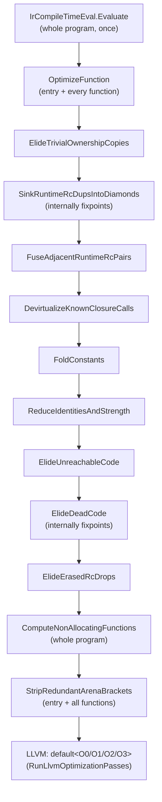
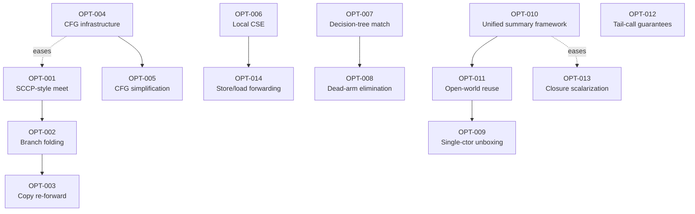

# Optimizer Capability Gap Analysis

Research-only audit of the Ashes compiler optimizer as of 2026-08-23. This document does not change
compiler behavior. It exists so a future implementation agent can pick up any `OPT-XXX` task and start
work without repeating this investigation.

## Scope and method

The investigation traced actual code paths across `src/Ashes.Semantics/` (lowering, IR, the optimizer,
compile-time evaluation, Perceus lifetime placement, reuse), `src/Ashes.Backend/` (LLVM codegen and
pass-manager invocation), the relevant test suites (`src/Ashes.Tests`, `tests/*.ash`), and git history,
rather than filenames or documentation claims. Every `IMPLEMENTED`/`PARTIAL`/`INDIRECT` claim below
cites a file and line range observed during this investigation; line numbers will drift as the codebase
changes; treat them as pointers to re-locate the code, not permanent anchors. Every `MISSING` claim
states what was searched for.

Two constraints shaped every recommendation:

1. **Do not duplicate what already exists.** Ashes already has a non-trivial, in places unusually
   mature, optimizer — particularly around ownership/RC (the "Perceus" substrate). Several classical
   optimizations that look absent under their textbook name turn out to be implemented under a
   different one, or achieved as a side effect of ownership analysis. Each `MISSING` finding below was
   checked against this possibility before being reported as a genuine gap.
2. **Every task must be implementable in the C# compiler, and every C# task changes what the
   self-hosted (`selfhost/`) compiler must eventually match.** [`SELF_HOSTING.md`](SELF_HOSTING.md)
   tracks self-host porting progress with `[x]`/`[ ]` checklist items. As of this writing, the
   "Optimization, ownership, and reuse" section (`SELF_HOSTING.md:359-394`) shows the deterministic
   IR-optimization pipeline (constant eval, ownership-copy elision, RC dup/drop sinking and fusion,
   closure devirtualization, constant folding, identity/strength reduction, dead/unreachable-code
   elimination, arena-bracket stripping) and ordinary/mutual TCO with cost signals as **already ported**
   (`[x]`, lines 361-376), while ownership/RC/reuse inference itself — parameter/capture ownership,
   result freshness, moves/borrows, heap-layout classification, Perceus dup/drop insertion, allocation
   reuse for tuples/ADTs/closures/tail paths — is **not yet ported** (`[ ]`, lines 377-393). Every task
   below therefore carries a **Self-Hosting Impact** note: for the already-ported pipeline, the C# change
   must be mirrored in `selfhost/`, tracked by a **new** `[ ]` checklist line next to the existing `[x]`
   one rather than a rewrite of that line's text (parity would otherwise silently rot, or worse, get
   silently misrepresented as already having shipped — see the hard gate in Section 5); for the
   not-yet-ported ownership/reuse work, the task's outcome becomes part
   of what the self-hosted port must build *directly* — there is no already-shipped self-host behavior to
   go back and fix, so the self-host implementer should target the improved C# design from the start
   rather than porting an intermediate version and upgrading it twice.

---

## 1. Executive Summary

**Maturity is sharply bimodal.** In the areas unique to Ashes' own design — ownership inference,
reference-counting insertion/elision, Perceus-style drop-guided reuse, whole-program compile-time
evaluation, and loop-based tail-call optimization — the optimizer is deep, well-tested, and in several
places comparable in ambition to Koka/Perceus itself: `PerceusLifetimePlacement.cs` computes real
per-block liveness and dominance to place `RcDrop`s at true last use (not lexical scope exit);
`Lowering.Reuse.cs` demonstrably reuses in-place through recursive, self-referential ADTs (binary trees,
not just lists), through pattern matching, and across function calls via compile-time function cloning;
`IrCompileTimeEval.cs` folds whole recursive calls (not just single expressions) to constants under a
step/depth budget. In the areas most compilers build *first* — a reusable control-flow-graph
abstraction, SSA/use-def infrastructure, common-subexpression elimination, jump threading, branch
folding on statically-known conditions, and general pattern-match decision-tree compilation — Ashes is
conspicuously thin. This is not accidental: the LLVM backend picks up nearly all of the classical
half at `-O1`+ (`simplifycfg`, `mem2reg`+phi construction, GVN, inlining, LICM, unrolling all run inside
LLVM's `default<Ox>` pass pipeline, `LlvmCodegen.cs:379-397`), so building the same thing twice in Ashes
would mostly be redundant — **except** where LLVM structurally cannot recover the information Ashes
already has (ownership, purity, uniqueness, evidence/dictionary shape), which is exactly where this
report's proposed tasks concentrate.

- **Strongest areas:** ownership/RC/reuse (Category 10), whole-call compile-time evaluation
  (Category 3's `IrCompileTimeEval`), self/mutual tail-call-to-loop conversion (Category 7).
- **Weakest areas:** CFG/SSA-adjacent infrastructure (Categories 1-2, effectively absent as reusable
  infra), CSE/GVN (Category 4, entirely absent at the Ashes level), general pattern-match compilation
  (Category 12, a flat single-level tag-switch or naive linear chain, not a real decision tree).
- **Most important architectural gap:** no reusable control-flow-graph abstraction. The one real
  block/dominator/liveness builder in the compiler (`PerceusLifetimePlacement.cs:549,623-630,491-538`)
  is private to one pass. Every other pass that needs predecessor/successor reasoning approximates it
  with weaker per-pass heuristics (`IrOptimizer.cs`'s `CountBranchRefsToLabels` reference counting,
  single-vs-multi-predecessor label special-casing). This single gap is the reason a demonstrably
  provable optimization — folding a constant that agrees on all paths into a join point — is currently
  discarded by design (`IrOptimizer.cs:1392-1398`, see `OPT-001`).
- **Top 5 recommended improvements:** generalize the CFG/dominator/liveness infrastructure (`OPT-004`);
  compute a real meet-over-paths at multi-predecessor labels instead of clearing constant-propagation
  state (`OPT-001`); replace the flat tag-switch/linear-chain match compiler with a real decision tree
  that shares sub-tests across arms (`OPT-007`); consolidate the several independent interprocedural
  analyses into one reusable function-summary framework and use it to extend reuse across today's
  closed-world call-boundary restriction (`OPT-010`/`OPT-011`); add local common-subexpression
  elimination for pure calls and field loads, reusing the purity oracle `IrCompileTimeEval` already
  computes (`OPT-006`).

---

## 2. Current Optimizer Inventory

Organized by the fifteen research categories. `IMPLEMENTED`/`PARTIAL`/`INDIRECT`/`LLVM-DELEGATED`
entries cite the concrete code; `MISSING` entries state what was searched for.

### 2.1 CFG and Control-Flow Optimization

| Capability | Status | Evidence |
|---|---|---|
| Basic-block representation | PARTIAL | Private `Block` type only inside `PerceusLifetimePlacement.cs:549`; no shared type. IR itself (`Ir.cs`) is a flat `List<IrInst>` per function with `Label`/`Jump`/`JumpIfFalse`/`SwitchTag` (`Ir.cs:1867-1885`). |
| CFG construction (reusable) | MISSING | Only `PerceusLifetimePlacement.BuildBlocks` (`:623-630`), scoped to that one pass. `IrOptimizer.cs` never builds a block graph. |
| CFG simplification / block merging | MISSING | No pass merges a `Label`-then-`Jump` sequence or fuses blocks joined by an unconditional jump. |
| Jump threading | MISSING | No rewriting of `Jump L1` where `L1: Jump L2` into `Jump L2`. |
| Branch folding (known-constant condition) | MISSING | `knownBools` is tracked (`IrOptimizer.cs:980-1024`) but never consulted by the `JumpIfFalse` handling in `HandleConstantControlFlow` (`:1303-1349`). See `OPT-002`. |
| Redundant branch elimination | MISSING | Same evidence as above. |
| Unreachable code elimination | IMPLEMENTED (linear, not block-based) | `ElideUnreachableCode` (`IrOptimizer.cs:1659-1691`) drops instructions after a terminator until the next `Label`. |
| Empty block elimination | MISSING | No pass removes a `Label` immediately followed by `Jump` or with no instructions before the next label. |
| Redundant jump elimination | MISSING | No pass removes `Jump L` where `L` is the next label (fallthrough). |
| Switch/match simplification | MISSING at IR level | `SwitchTag` is always treated as opaque; comment at `IrOptimizer.cs:1339-1345` explicitly clears all constant state at a `SwitchTag` join. |
| Control-flow canonicalization | MISSING | No canonicalization pass. |
| Dominator analysis | IMPLEMENTED, scoped | `ComputeDominators` (`PerceusLifetimePlacement.cs:491-538`), private to lifetime placement. |
| Post-dominator analysis | MISSING | No "post-dominat" occurrences anywhere in `Ashes.Semantics`/`Ashes.Backend`. |
| CFG optimization at LLVM level | LLVM-DELEGATED | `RunLlvmOptimizationPasses` (`LlvmCodegen.cs:379-397`) runs LLVM's full `default<O1/O2/O3>` pipeline, including `simplifycfg`, at `-O1`+. |
| CFG construction (physical, at codegen) | LLVM-DELEGATED | The LLVM backend, not Ashes IR, builds the real basic-block graph: pre-creates an LLVM `BasicBlock` per `Label` (`LlvmCodegen.cs:1633-1637`) and inserts `BuildBr` at fallthrough (`:1690-1720`). |

### 2.2 SSA / Use-Def Infrastructure

| Capability | Status | Evidence |
|---|---|---|
| SSA form | MISSING by design, LLVM-DELEGATED | Every temp/local becomes an LLVM `alloca` (`LlvmCodegen.cs:1607-1617`); `mem2reg` promotes to SSA/phi during LLVM optimization. Explicit comment: `LlvmCodegenMemory.cs:1423-1424`, "no phi node binding available; mem2reg promotes this to a phi automatically." |
| Phi nodes / block parameters | MISSING in Ashes IR | Control-flow joins (`match`/`if` results) lower to a `NewLocal()` slot written via `StoreLocal` from each arm, read via `LoadLocal` at the join (`Lowering.Patterns.cs:31,64,68,712`) — the classic "alloca instead of phi" pattern. |
| Use-def / def-use chains | PARTIAL, per-pass | ~15 `Collect*UsedTemps` helpers (`IrOptimizer.cs:1918,1941-2309`) and `CollectBorrowElisionInfo` (`:596-620`) recompute use sets per pass; no persisted shared structure. |
| Dominance relationships | IMPLEMENTED, scoped | Same as Category 1: `PerceusLifetimePlacement.cs` only. |
| Liveness information | IMPLEMENTED, scoped | `PerceusLifetimePlacement.cs` `LiveIn`/`LiveOut` (`~176-196`), purpose-built for RC-drop placement, not reused elsewhere. |
| Variable/version tracking | INDIRECT | Monotonic integer temp numbering (`IrFunction.TempCount`) acts as single-assignment-by-construction, exploited by `knownInts`/`knownFloats`/`knownBools` dictionaries — but single-assignment is a lowering convention, not an enforced/checked invariant. |
| Value numbering / GVN / CSE | MISSING (Ashes), LLVM-DELEGATED | No hits for "CSE"/"value numbering" in `Ashes.Semantics`. LLVM's GVN runs inside `default<O2/O3>`. |
| Constant propagation | IMPLEMENTED, non-SSA | `FoldConstants` (`IrOptimizer.cs:980-1024`) — linear-scan, label-state-save/restore instead of phi-based propagation. |
| Dead code elimination | IMPLEMENTED | `ElideDeadCode`/`ElideDeadCodeOnce` (`:1699-1802`), fixed-point iteration, use-count based (not SSA dead-phi pruning). |

**Why no SSA/CFG infra, and is the gap real:** no comment states a rationale, but the design is
internally consistent — LLVM reliably builds SSA from alloca+store/load, so Ashes IR never needed to.
The concrete cost of the gap is narrower than "Ashes should have SSA": it is specifically that
Ashes-level passes needing predecessor-sensitive reasoning (multi-path constant meet, branch folding,
future CSE across a join) have no shared substrate to build on. `OPT-004` addresses this without
proposing SSA for Ashes IR itself — LLVM already owns that job well.

### 2.3 Constant and Dataflow Analysis

| Capability | Status | Evidence |
|---|---|---|
| Constant folding (arithmetic/bitwise/compare) | IMPLEMENTED | `FoldConstants` + `TryFoldIntArithmetic`/`TryFoldIntBitwise`/`TryFoldFloatArithmetic`/`TryFoldIntEquality`/`TryFoldIntOrdering` (`IrOptimizer.cs:980-1302`). |
| Constant propagation (per-instruction, intraprocedural) | IMPLEMENTED, narrow | Forward straight-line scan (`knownInts`/`knownFloats`/`knownBools`, `:1002-1024`). |
| SCCP-style meet at merge points | PARTIAL — genuine gap | `ApplyLabelConstantState`/`HandleIdentityControlFlow` (`:1361-1404,1608-1632`) only preserve state at single-predecessor labels; at ≥2-predecessor labels they unconditionally clear all knowledge (`:1392-1398`) rather than merging agreeing values. Confirmed by test `Constant_propagation_clears_at_multi_predecessor_label` (`IrOptimizerTests.cs:1142-1172`), whose own comment notes the discarded knowledge could still be folded by a real meet. See `OPT-001`. |
| Branch-condition propagation / dead-branch elimination | MISSING | See Category 1 / `OPT-002`. |
| Range analysis | MISSING | No interval/range structures found. |
| Interprocedural constant propagation (dataflow sense) | MISSING | No per-callsite argument specialization or sparse interprocedural propagation across `CallKnown` targets. |
| Whole-call partial evaluation | IMPLEMENTED, distinct mechanism | `IrCompileTimeEval.cs` — a concrete-value interpreter (`EvalContext`/`Frame`, lines 303-656) over a whitelisted pure-instruction subset (`IsModeledPureLeaf`, 145-167), whole-program least-fixpoint evaluable-function set (`ComputeEvaluableFunctions`, 100-127), bounded by step/depth budgets (26-27), scalar-only result embedding (Int/Bool/Float; strings/ADTs/lists deferred, 19-20,354-357), memoized per `(label, scalar env, scalar arg)` (464-479). Folds recursive user functions (`fib(20)` test, `IrOptimizerTests.cs:1177-1191`) and bails safely on non-termination (`:1205-1216`). |
| Distinction from constant propagation | — | `IrCompileTimeEval` folds an entire call (including recursion) to a value by executing it — call-granularity, whole-function interpretation. `FoldConstants` folds individual instructions using a locally-tracked table that resets at most merge points — instruction-granularity, CFG-adjacent dataflow. These are different mechanisms solving different problems; neither subsumes the other. |

### 2.4 CSE / GVN

| Capability | Status | Evidence |
|---|---|---|
| Local CSE | MISSING | No `(opcode, operand-temps) -> temp` canonicalization anywhere in `IrOptimizer.cs`. |
| Global CSE / GVN / hash-consing | MISSING (Ashes), LLVM-DELEGATED | LLVM's GVN runs inside `default<O2/O3>`, but only over instructions already lowered to LLVM IR — it cannot see through an RC-wrapped Ashes call to prove the underlying user function pure (see `OPT-006`). |
| Redundant load / computation elimination | MISSING | `ElideDeadCode`/`IsDeadInstruction` (`:1699-1889`) removes *unused* results, not *duplicate* computations. No store-to-load or duplicate-`GetAdtField` forwarding found. |

Concrete unhandled example: `f(y) + f(y)` where `f` is pure re-executes `f` twice; `let p = obj.field in
let q = obj.field in p + q` performs two identical `GetAdtField` reads. Neither is merged today.

### 2.5 Copy and Temporary Elimination

| Capability | Status | Evidence |
|---|---|---|
| Ownership/RC-copy elision | IMPLEMENTED | `ElideTrivialOwnershipCopies` (`IrOptimizer.cs:539-593`) erases `RcDup{RuntimeManaged:false}` markers and elides `Borrow` when safe, via `RemapSourceTemps`/`ResolveTemp` chain-following (`:634-770+`). This is RC-marker erasure specifically, not general aliasing. |
| General copy propagation (non-ownership) | PARTIAL — genuine gap | `ReduceIdentitiesAndStrength` (pass 6 of 9, `:1447-1497`) rewrites `x+0`/`x-0` etc. into `Borrow(target, source)` copies, but runs *after* `ElideTrivialOwnershipCopies` (pass 1) in a pipeline that runs each pass exactly once per function — so these newly introduced copies are never re-swept within the same invocation. See `OPT-003`. |
| Projection / record-field temp forwarding | MISSING | No `SetAdtField`-then-`GetAdtField` forwarding found; only use-collection/remap logic touches those instructions. See `OPT-014`. |
| Redundant move elimination beyond RC markers | MISSING as a general pass | `DevirtualizeKnownClosureCalls` (`:475-522`) forwards a known `MakeClosure` label/env into `CallKnown` — a specific value-forwarding instance, not a general temp-alias pass. |

### 2.6 Function Inlining

| Capability | Status | Evidence |
|---|---|---|
| Direct-call inlining | IMPLEMENTED, structural not cost-based | `InlineCall` (`Lowering.Reuse.cs:581`) does genuine AST-body substitution, gated by `RegisterInlinableNonRecursiveLet` (`Lowering.TopLevel.cs:72`) on structural eligibility (non-recursive, contributes an allocation per `ExprHasCallOrAggregate`, `:81-88`) — no size/cost threshold model. |
| Entry-body helper inlining (CO-22) | IMPLEMENTED | `RegisterEntryBodyFunctions` (`Lowering.TopLevel.cs:111`), commit `448f840e`; fixpoint over transitively-free-variable-resolvable local helpers. Test: `tests/reuse_user_local_helper_specialization.ash`. |
| Recursive-function inlining | PARTIAL/INDIRECT | Self-recursive "nested-recursive-return" shapes become reuse *specializations* (`GetOrCreateReuseSpecialization`, `Lowering.Reuse.cs:647`) rather than literal inlining. |
| Cost models | MISSING at Ashes level, LLVM-DELEGATED for general speed inlining | No size/depth heuristic beyond structural gates; LLVM's own cost-modeled inliner runs at `-O1`+ (`LlvmCodegen.cs:381`). |
| Call-site specialization | IMPLEMENTED | `GetOrCreateReuseSpecialization`/`LowerReuseSpecializedCall` — per-call-site monomorphic workers specialized on ownership/freshness facts. |
| Closure-call devirtualization | IMPLEMENTED | `DevirtualizeKnownClosureCalls` (`IrOptimizer.cs:464-522`) rewrites `CallClosure` to `CallKnown` when the closure has a single, statically known origin — the explicit bridge that lets LLVM's inliner see through closures. |
| Inlining × ownership | IMPLEMENTED, tightly coupled | `EnvironmentIsStackAllocated` (`Ir.cs:701-703`) prevents unsafe native tail-call conversion of a devirtualized call whose environment lives in caller-frame stack storage. |
| Inlining × compile-time evaluation | IMPLEMENTED, explicitly ordered | `IrCompileTimeEval.Evaluate` runs first (`IrOptimizer.cs:14-19`) so later passes clean up now-dead call/closure construction. |
| Cross-module inlining | INDIRECT/PARTIAL | Stitched stdlib modules are inlined the same as user code post-stitching; single-binary whole-program compile model, so "cross-module" means cross-file-within-one-compile, not LTO across build units. |

### 2.7 Tail Calls / Recursion Optimization

| Capability | Status | Evidence |
|---|---|---|
| Self-tail recursion → loop | IMPLEMENTED, guaranteed, LLVM-independent | `TcoContext`/`tco.BodyLabel`; self-tail-call sites become parallel-assignment stores plus `Jump(tco.BodyLabel)` (`Lowering.cs:7593-7594,8770`; comment at `:1373`). `docs/md/internals/ir.md:267-268` confirms this is "the explicit IR back-edge." |
| Mutual tail recursion → merged loop | IMPLEMENTED for an eligible shape, PARTIAL beyond it | `TryLowerMutualRecursionTco` (`Lowering.TopLevel.cs:885`) merges eligible groups (≥2 members, same arity, **identical parameter types**, ≥1 genuine cross-member tail call, `:922`) into one shared self-recursive dispatch loop with tag-based dispatch. Ineligible groups (e.g. heterogeneous parameter types) fall back to ordinary closure calls with **no** guaranteed TCO. See `OPT-012`. |
| Non-loop tail calls (different function, tail position) | ADVISORY ONLY | `CanEmitNativeTailCall` (`LlvmCodegen.cs:2322-2329`) gates emitting LLVM's `Tail` kind (not `MustTail` — `LlvmApi.cs:46` defines the enum but Ashes never uses `MustTail`); this is a sibling-call-optimization *hint*, not a guarantee. Indirect `CallClosure` and stack-allocated-environment calls are always forced `NoTail`. See `OPT-012`. |
| Recursion-to-loop transformation | IMPLEMENTED | Same as self-tail-recursion above. |
| TCO cost/profitability signals | IMPLEMENTED, ownership-focused | `Lowering.TcoPromotionCostSignal.cs` (full file) — per-parameter RC-vs-arena placement decisions for loop accumulators, including cross-parameter "permanently blocking" analysis (`:269-289`). This decides *representation*, not whether to apply TCO (which is unconditional for eligible shapes). |
| Stack-growth behavior outside recognized patterns | UNBOUNDED, no guard | No stack-depth check, segmented stack, or trampolining outside the two loop patterns. |

### 2.8 Interprocedural Analysis

| Capability | Status | Evidence |
|---|---|---|
| Unified function-summary abstraction | IMPLEMENTED (one instance) | `FunctionOwnershipSummary` (`OwnershipSummary.cs:265-293`) aggregates parameter ownership, call census, move-safety proofs, result-reach facts, expression freshness, live-handler-effect fact, result provenance, TCO structural facts — computed via a whole-program SCC fixpoint (`:106-138`). This is the strongest instance of a reusable, multi-consumer summary in the compiler. |
| Purity | IMPLICIT, no named field | Ashes is total-purity-by-construction (no mutation exists in the language); no explicit `Purity` field found — `IrCompileTimeEval` uses a structural allowlist (`IsModeledPureLeaf`) rather than consulting a summary. |
| Allocation behavior | IMPLEMENTED, separate from the unified summary | `ComputeNonAllocatingFunctions` (`IrOptimizer.cs:339`) is its own whole-program fixpoint, not a field on `FunctionOwnershipSummary`. See `OPT-010`. |
| Argument escape | PARTIAL, narrow single-purpose | `Lowering.DirectCalleeAnalysis.cs` computes only "is this let-bound name ever used other than as a direct call target," consumed at 3 sites (`Lowering.cs:3676,4053,4312`), not a general escape summary. |
| Capabilities/effects | IMPLEMENTED, separate system | `Lowering.Capabilities.cs` (1928 lines) — row-typing/dictionary mechanism, not summary-record-based. |
| Handler effects | IMPLEMENTED, own fixpoint, one fact folded into the unified summary | `Lowering.HandlerEffects.cs`'s `BuildHandlerEffectCallGraph`/`PropagateLiveHandlerEffects` feed `MayExecuteUnderLiveHandlerPost` into `FunctionOwnershipSummary`. |
| Function origins | IMPLEMENTED, bookkeeping only | `Lowering.FunctionOrigins.cs` (375 lines) — provenance/diagnostics, not consumed by optimization decisions. |
| Aliasing, determinism, compile-time-evaluability as summary fields | MISSING/N-A | Aliasing only exists narrowly as `ResultReach`; determinism is trivially true (pure language); evaluability is handled structurally inside `IrCompileTimeEval`, never summarized. |

**Overall:** one real unified summary (`FunctionOwnershipSummary`) plus several independent, ad hoc,
single-purpose analyses that do not share computation/caching machinery with it or each other. `OPT-010`.

### 2.9 Allocation / Escape Optimization

| Capability | Status | Evidence |
|---|---|---|
| Escape analysis | INDIRECT — implemented under a different name | Achieved as a byproduct of ownership inference: `ResultReachFacts`/`ExpressionFreshness` (`OwnershipSummary.cs:274-275`) plus `Lowering.TopCellFreshness.cs` prove whether a value's cell (and transitively its graph) escapes the current arena/stack scope. Do **not** propose a separate generic escape-analysis pass — this is already the same result, expressed as an ownership/freshness proof. |
| Stack allocation / promotion | IMPLEMENTED, two-tier | True machine-stack (`AllocStack`/`AllocAdtStack`/`MakeClosureStack`) for compiler-proven scoped values; region/bump-arena allocation as the general non-escaping fallback. `docs/md/internals/architecture.md:920-953`. |
| Allocation elimination/sinking | IMPLEMENTED for specific cases | `SinkRuntimeRcDupsIntoDiamonds`; TCO's fixed watermark reset achieves loop-invariant-allocation-hoisting's effect for recognized loop shapes without a general LICM pass. |
| Scalar replacement of aggregates (SROA) | LLVM-DELEGATED, stack-tier only | No Ashes-level field decomposition pass; LLVM's SROA (inside `default<O2/O3>`) opportunistically scalarizes stack-allocated cells Ashes already proved non-escaping, but cannot reach heap/RC-tier values. |
| Temporary object elimination / lifetime shortening | IMPLEMENTED | The reuse-token machinery (Category 10) plus `PerceusLifetimePlacement` shortening owner lifetimes to true last use rather than lexical scope exit. |

### 2.10 Perceus / Ownership-Aware Optimization

The deepest and most mature area of the compiler.

| Capability | Status | Evidence |
|---|---|---|
| Ownership tracking (borrow/consume) | IMPLEMENTED | `FunctionOwnershipSummary.ParameterOwnership` (`OwnershipSummary.cs:265-293`); `Lowering.Ownership.cs` (3344 lines); `Lowering.Borrow.cs` for resource-parameter borrow inference (fail-closed). |
| Last-use analysis / drop placement | IMPLEMENTED, real liveness | `PerceusLifetimePlacement.PlaceOwner` builds blocks, computes liveness (`:176-196`), inserts `RcDrop` at true last use or dead-branch entry (`CollectInsertions`, `:198-234`) — exactly Koka/Perceus semantics. (Note: `Lowering.MoveAnalysis.cs`, the largest file in the compiler at 4978 lines, is a **different** thing — a soundness proof that a fold accumulator is already unique at every call site, for reuse-copy elision, not general last-use analysis; don't conflate the two when navigating the codebase.) |
| RC insertion/elimination, dup/drop fusion, dup sinking | IMPLEMENTED | `ElideTrivialOwnershipCopies` (539), `SinkRuntimeRcDupsIntoDiamonds` (69), `FuseAdjacentRuntimeRcPairs` (246), `ElideErasedRcDrops` (1803) — all in `IrOptimizer.cs`. |
| Interprocedural arena-bracket elimination | IMPLEMENTED | `ComputeNonAllocatingFunctions`/`StripRedundantArenaBrackets` (`IrOptimizer.cs:339-390`), whole-program least-fixpoint. |
| In-place reuse (drop-guided, Koka `reuse` token) | IMPLEMENTED, proven on recursive ADTs | `DropReuse`/`AllocReusing` contract (`ReuseDecision.cs`); fires on exhaustive guard-free matches. Proven at runtime on binary trees (not just lists): `ReuseTokenTests.cs:377-444` — correct dup-vs-move for shared/unique fields, correctly declines reuse when a transferred child has another live use. |
| Reuse specialization (compile-time function cloning) | IMPLEMENTED, genuinely interprocedural | `_specializableFunctions` registry (`Lowering.TopLevel.cs:42-49`); demonstrated working through closures and non-tail two-branch recursive tree rebuilds (`ReuseDecisionTests.cs:30-36,184-217`), and "reuse after inlining" (`ReuseTokenTests.cs:214-255`). |
| Reuse through pattern matching, closures, recursive data | IMPLEMENTED | All three demonstrated by the tests cited above — this is not single-arm/single-shape narrow, contrary to a naive first guess. |
| Reuse across arbitrary function calls (open-world) | MISSING — genuine, well-evidenced gap | `Record_list_traversal_that_hands_tail_to_another_function_still_normalizes`/`..._to_guard_function_still_normalizes` (`ReuseTokenTests.cs:742-798`) prove that handing a traversal's tail to *any* function outside the closed `_specializableFunctions` registry forces defensive `CopyOutArena{Purpose:RcNormalization}`, even to same-shape helpers. See `OPT-011`. |
| Uniqueness reasoning | IMPLEMENTED, two-tier | Static (`UniqueParameters`, entry-copy elision) and dynamic (`RcIsUnique` runtime check) — matches Perceus's two-tier design directly. |
| Interaction with arenas | IMPLEMENTED, central | Scoped bump arenas underlie both TCO-loop reuse and non-escaping construction. |
| Interaction with compile-time evaluation | IMPLEMENTED | `IrCompileTimeEval.Evaluate` runs before RC/reuse passes so folded calls don't leave dead arena brackets. |
| Thread-shared/atomic RC (Perceus `tshare`) | MISSING, by explicit design choice | `docs/md/internals/architecture.md:981-993` states Ashes does not implement `tshare`; cross-thread values are deep-copied instead. Not a gap to fix — a documented tradeoff. |
| Reuse through cyclic data | N/A by design | Cyclic data is excluded from RC by construction (`architecture.md:1004-1010`). |

### 2.11 Closure Optimization

| Capability | Status | Evidence |
|---|---|---|
| Closure-call devirtualization | IMPLEMENTED | `IrOptimizer.cs:464-522`, test `IrOptimizerTests.cs:411`. |
| Closure allocation elimination | PARTIAL | Stack allocation (`MakeClosureStack`) gated by the narrow `UsesLetNameOnlyAsDirectCallee` escape check (`Lowering.cs:3673-3679`); no general escape analysis for arbitrary non-escaping captures. |
| Environment elimination / scalarization | MISSING | No pass splits a closure's captured environment into scalar temps; always a packed pointer (`Ir.cs:646-670`). See `OPT-013`. |
| Closure specialization / known-closure propagation | PARTIAL | `IrCompileTimeEval` folds pure zero-capture closures as constants (134-135,224-268,410-422); `Lowering.Reuse.cs` monomorphizes closure-valued args to specific stdlib combinators (`map`/`reduce`/`both`) — narrow, not general higher-order propagation. |
| Lambda/function inlining | IMPLEMENTED, narrow/heuristic | `_inlinableFunctions` (`Lowering.cs:403`), including CO-22 transitive-free-variable inlining. |
| Partial evaluation of closures | IMPLEMENTED, pure/constant only | Same as `IrCompileTimeEval` above. |
| Closure representation optimization | MISSING | Fixed 32-byte `{code, env, size, dropper}` layout; no compact/alternate representations. |

### 2.12 ADT / Pattern-Matching Optimization

| Capability | Status | Evidence |
|---|---|---|
| Match compilation strategy | PARTIAL — genuine, high-value gap | `TryPlanTagSwitch` (`Lowering.Patterns.cs:885-941`) only fires for >4 arms, guard-free, single-ADT, **trivial sub-patterns only** (`IsTrivialSubPattern`, 948-957). Everything else — guards, nested constructor patterns, <5 arms — falls back to `LowerMatchArmsLinear` (`:472-516`), a naive sequential if-else chain with **no sharing of common sub-tests across arms**. Test `NonTrivialNestedSubPattern_DisablesTagSwitch` (`DecisionTreeMatchTests.cs`) documents this boundary by name. See `OPT-007`. |
| Redundant match / pattern-test elimination | MISSING as an optimization (present as diagnostics only) | `EmitMatchExhaustivenessDiagnostics`/`IsDefinitelyExhaustive`/`IsBoolExhaustive` (`:834,2279,2308`) report but don't remove unreachable arms. See `OPT-008`. |
| Constructor field forwarding | MISSING | No hits for field-forwarding logic. |
| Unboxing (incl. single-constructor) | MISSING | `HeapLayouts.cs:81` applies a uniform tag+payload layout regardless of constructor count. See `OPT-009`. |
| ADT allocation elimination | PARTIAL, narrow pattern | `IsImmediateSingleArmAdtDestructuringMatch` (`Lowering.cs:12393-12409`) stack-allocates only an immediate construct-then-single-arm-destructure sequence. |
| ADT representation specialization / scalarization | MISSING | No per-constructor specialized representation. |

### 2.13 Generic / Trait Optimization

| Capability | Status | Evidence |
|---|---|---|
| General monomorphization (Rust/C++-style) | MISSING | The general case is dictionary passing (below), not per-instantiation cloning. |
| Dictionary-passing (general trait/capability dispatch) | IMPLEMENTED | `BuildTraitDictionary`/`SelectTraitDictionaryMethod` (`Lowering.TraitEvidence.cs:2044-2091,2627`); unbundled per-operation dictionaries for generic capability constraints (`Lowering.CapabilityDictionaries.cs:5-19`). |
| Narrow monomorphization: primitive operator specialization | IMPLEMENTED, explicitly scoped | `SupportsPrimitiveOperatorSpecialization` (`Lowering.Traits.cs:785-798`) covers a fixed set of built-in operators over primitive types only; gated by `LoweringConfiguration.EnableTraitOperatorSpecialization` (default true). |
| Narrow monomorphization: RC-Perceus container fix | IMPLEMENTED, explicitly a correctness bug fix, not general | Commit `446dc68` — only type-variable-parameterized container results are monomorphized; commit message explicitly excludes scalar arithmetic, higher-order combinators, capability dispatch. |
| Capability monomorphization (call-site inlining) | IMPLEMENTED for a specific shape | A saturated call to a capability-generic function is inlined when the provider is statically known (`Lowering.cs:8614`; `Lowering.Capabilities.cs:290-315,937`) — static dispatch achieved via inlining, not cloning. |
| Generic function inlining | IMPLEMENTED | Same mechanism as capability monomorphization. |
| Trait method devirtualization | INDIRECT | No trait-specific vtable devirtualization; only reachable if a dictionary call happens to resolve to a known closure via `DevirtualizeKnownClosureCalls`. |

### 2.14 Loop Optimization

Ashes source has no loops; the only IR-level loop shapes come from TCO (Category 7). Everything below
concerns what happens to those loop shapes.

| Capability | Status | Evidence |
|---|---|---|
| Loop canonicalization | MISSING | No loop/CFG abstraction; IR stays a flat label/jump list. |
| Loop-invariant code motion (LICM) | MISSING (Ashes), LLVM-DELEGATED | `LoopInvariant` exists only as a per-TCO-parameter *ownership* fact (`Lowering.Types.cs:133`, `Lowering.MoveAnalysis.cs:811-823`) deciding RC/reuse treatment — not code motion. LLVM's `licm` runs inside `default<O1-O3>`. |
| Loop unswitching | MISSING, LLVM-DELEGATED | LLVM's `simple-loop-unswitch` at `-O2/O3`. |
| Induction-variable optimization / loop strength reduction | MISSING, LLVM-DELEGATED | LLVM's `indvars`/`loop-reduce` at `-O2/O3`. |
| Arithmetic strength reduction (non-loop, scalar identities) | IMPLEMENTED | `ReduceIdentitiesAndStrength` (`IrOptimizer.cs:1413-1497`) — `x+0→x`, `x*1→x`, `x*0→0`, etc. This is what "strength reduction" means in this compiler; it is not loop induction-variable strength reduction. |
| Loop peeling / unrolling | MISSING, LLVM-DELEGATED | LLVM's `loop-unroll`/`loop-peel` at `-O1-O3`. |
| Bounds-check elimination | N/A | No raw indexed/bounds-checked access surface exists in the language (list/ADT access is pattern-match based); zero hits for "BoundsCheck" anywhere. |

### 2.15 Pipeline, Configuration, and the LLVM Boundary

See Sections 3 and 10 below for the full pipeline order and LLVM-boundary table.

---

## 3. Existing Pass Pipeline

Entry point: `IrOptimizer.Optimize(IrProgram)` (`IrOptimizer.cs:14-37`).



**Ordering matters, and is deliberate but incomplete.** The comment at `IrOptimizer.cs:43` states "Pass
ordering matters — each pass may enable further optimizations in subsequent passes," and the pipeline is
genuinely staged that way: `ElideTrivialOwnershipCopies` runs first so later passes see cleaner
ownership; `DevirtualizeKnownClosureCalls` runs before `FoldConstants` so folded call chains are already
direct; `IrCompileTimeEval` runs before everything, whole-program, so dead call/closure-construction
code is visible to the later dead-code passes. **The pipeline is not a global fixed point**, however:
each of the 9 per-function passes and the 2 interprocedural passes runs exactly once, in this order, per
`IrOptimizer.Optimize` invocation. Only two individual passes internally iterate to their own local fixed
point (`SinkRuntimeRcDupsIntoDiamonds` via a `while` at `:72`, `ElideDeadCode` via a `while(true)` at
`:1705`). This single-pass-through design is the direct cause of the `OPT-003` gap (identity-reduction's
output copies are never revisited by the earlier copy-elision pass) and a contributing factor to why
`OPT-001`'s multi-predecessor clearing is conservative rather than iterative.

**LLVM invocation.** `BackendCompileOptions.Default` is `O2` (`BackendCompileOptions.cs:26-27`);
`LlvmTargetSetup.Create` maps `O0/O1/O2/O3` to `LlvmCodeGenOptLevel.None/Less/Default/Aggressive`
(`LlvmTargetSetup.cs:74-84`). `RunLlvmOptimizationPasses` (`LlvmCodegen.cs:381-397`) runs LLVM 22's new
pass manager via the string pipelines `"default<O1>"`/`"default<O2>"`/`"default<O3>"`
(`LlvmApi.RunPasses`, `:409`) — LLVM's full standard pipeline, not a restricted subset. At `O0`, no LLVM
passes run at all (`:383-386`, "codegen output is used as-is"). Every CLI subcommand (`compile`, `run`,
`repl`, `test`) exposes `-O0|-O1|-O2|-O3` (`docs/md/reference/cli.md:87,169,268,323,384`); there is
**no CLI flag to disable or tune the Ashes-side `IrOptimizer`** for `compile`/`run` — it runs
unconditionally (`Program.cs:197`). Only `ashes test` exposes a semantic-pipeline switch,
`--pipeline optimized|lowered|both` (`cli.md:368,384,439-445`; `Ashes.TestRunner/Runner.cs:52-57,1082-1083`),
which gates `IrOptimizer.Optimize` specifically to let e2e tests catch correctness bugs the optimizer
could mask (`--debug`/`-g` separately defaults LLVM to `-O0` unless an explicit `-O` is given, independent
of the Ashes optimizer). CI's `.ash` matrix runs `test --pipeline both` (`ci/jobs.sh:265`), so the full
591-file `tests/*.ash` suite genuinely exercises both the optimized and raw-lowered path, each at LLVM
`O2`; but of the ~73 native-execution C# test files in `src/Ashes.Tests`, only 6 call `IrOptimizer.Optimize`
at all — the rest feed raw lowered IR straight to the backend, meaning most C#-level native-execution
tests validate `Lowering`'s own RC/reuse correctness independent of whether `IrOptimizer` ran, not the
optimizer's transformations themselves.

---

## 4. Existing Analysis Infrastructure

| Analysis | Lives in | Computes | Consumed by | Reusable today? |
|---|---|---|---|---|
| `FunctionOwnershipSummary` | `OwnershipSummary.cs:265-293` | Parameter ownership, call census, move-safety proofs, result-reach/freshness, live-handler-effect fact, result provenance, TCO structural facts — via whole-program SCC fixpoint | RC placement, reuse eligibility, TCO parameter representation, result-ownership decisions | Yes — the one genuinely reusable multi-consumer summary. Should be the target other analyses migrate into (`OPT-010`). |
| `PerceusLifetimePlacement`'s `Block`/dominators/liveness | `PerceusLifetimePlacement.cs:176-196,491-538,549,623-630` | Per-block liveness, dominance, for RC-drop/dup placement | Only itself | No — private to this one pass. Extraction target for `OPT-004`. |
| `Lowering.MoveAnalysis.cs` | `Lowering.MoveAnalysis.cs` (4978 lines) | Interprocedural proof that a fold accumulator is unique at every call site (soundness for reuse-copy elision) — **not** general last-use analysis despite the name's suggestion | Reuse specialization's entry-copy elision decision | No — single-purpose; misleadingly named for newcomers navigating the codebase |
| `ComputeNonAllocatingFunctions` | `IrOptimizer.cs:339` | Whole-program non-allocation fixpoint | `StripRedundantArenaBrackets` | No — standalone, duplicate fixpoint machinery vs. `FunctionOwnershipSummary`. Migration target for `OPT-010`. |
| `Lowering.DirectCalleeAnalysis.cs` | `Lowering.DirectCalleeAnalysis.cs` (242 lines) | "Is this let-bound name only ever used as a direct call target" | 3 call sites (`Lowering.cs:3676,4053,4312`) for closure stack-allocation eligibility | No — narrow, single-purpose. Generalization target for `OPT-013`. |
| `Lowering.Capabilities.cs` row/dictionary system | `Lowering.Capabilities.cs` (1928 lines) | Capability/effect row typing, ambient-row tracking | Trait/capability dispatch lowering | Partially — internally reusable within its own domain, not integrated with the ownership summary |
| `Lowering.HandlerEffects.cs` | `Lowering.HandlerEffects.cs` | Call-graph fixpoint for live-handler-post reachability | Folded into `FunctionOwnershipSummary` (one fact) | Partially — the one example of cross-analysis integration that already happened |
| `IrCompileTimeEval`'s evaluable-function set + purity oracle | `IrCompileTimeEval.cs:100-167` | Whole-program fixpoint of provably-evaluable functions; `IsModeledPureLeaf` structural purity check | Whole-call folding | Yes, underused — directly reusable as the purity oracle for local CSE (`OPT-006`) instead of building a new one |
| HM type information | `Lowering.TypeInference.cs`, `Lowering.Types.cs` | Full program type information | Every lowering/optimization decision downstream | Yes, foundational, already pervasively consumed |

---

## 5. Genuine Gaps

Fourteen tasks, `OPT-001` through `OPT-014`. Every task below satisfies the "not implemented, not
implemented under another name, not implicit in an earlier phase, not intentionally LLVM-delegated, not
a side effect of an existing optimization, no existing test demonstrates it" checklist from the research
brief — see the cited evidence in Section 2 for how each was ruled in.

> **Hard gate — read before closing any `OPT-XXX` task.** Each task below ends with two subsections:
> **Completion Criteria** and **Self-Hosting Impact**. Both must be satisfied before the task is
> considered done — the C#-side change and the `SELF_HOSTING.md` update are one unit of work, not two.
> A pull request that lands the C# behavior without touching the cited `SELF_HOSTING.md` lines leaves
> the self-hosting document silently lying about compiler behavior, which is exactly the kind of drift
> a future agent picking up self-hosting work would have no way to detect on their own. Every
> **Completion Criteria** below repeats this as an explicit checklist item so it cannot be missed by
> only skimming that subsection.
>
> **Never edit an already-`[x]` `SELF_HOSTING.md` line to describe a capability it didn't originally
> claim.** Several tasks below (marked in their Self-Hosting Impact subsection) extend a pipeline stage
> that `SELF_HOSTING.md` already lists as ported (`[x]`). Rewriting that bullet's text in place to fold
> in the new capability would silently launder a genuine gap into an already-checked-off item — a future
> self-hosting implementer reading `[x]` has no way to tell "this exact thing shipped" apart from "this
> plus something else, added after the fact, shipped." Instead, add a **new, separate `[ ]` checklist
> line** immediately after the existing `[x]` one, scoped to exactly the delta this task introduces (e.g.
> "extend constant propagation to a true meet-over-paths at multi-predecessor labels, not just
> single-predecessor label flow"), and leave the original `[x]` line's wording untouched. The new line
> only flips to `[x]` once the self-hosted port actually implements that delta — it is normal for it to
> stay `[ ]` for a long time after the C# side lands.
>
> **Measure before opening the PR, and record the result — passing this task's own unit tests is not
> sufficient evidence of real impact.** Before a task's PR is opened, compile a representative before/after
> comparison from **actual compiled `.ash` output**, not just the task's hand-built IR test fixtures: at
> minimum, `--emit-ir final` on a program built from the task's own worked example, and a runtime timing
> comparison against the pre-task compiler as the "before" baseline (e.g. temporarily swap in
> `git show <base-commit>:<file>` for the changed file(s), rebuild, compile and time the same program, then
> restore). This is not a formality — `OPT-001` is the reason this rule exists: its originally-landed fix
> (meet-over-paths over raw temps only) passed every unit test but folded **zero** real `if`/`match`
> results, because every such join in real Ashes IR routes through a `StoreLocal`/`LoadLocal` round trip
> the pass didn't track at all; only compiling the task's own worked example and inspecting the actual
> optimized IR caught this, well after the tests were green. Record the methodology and numbers in a
> **Measured Outcome** subsection added to that task's own entry below (alongside Completion Criteria and
> Self-Hosting Impact) before merge, and add a row to the "Measured optimization and correctness audit"
> table in [changelog.md](../internals/changelog.md) once the task ships — that table is the durable,
> indexed record of shipped optimizer work; this document is the working plan, and its individual task
> sections stay in place afterward as the reasoning and evidence trail behind that changelog entry. Update
> the task's row in the Section 12 prioritized list's **Status** column to `Done` once merged.

### OPT-001: Meet-Over-Paths Constant Propagation at Multi-Predecessor Labels

**Status: Done.** See **Measured Outcome** below — the task as originally scoped (raw temps only) shipped
correct but with **zero** effect on real compiled programs, and had to be extended to local-slot tracking
before it did anything observable. This section keeps the original problem statement below as written
(for historical accuracy of the research) and records what actually happened in Measured Outcome.

**Problem.** `FoldConstants`'s `ApplyLabelConstantState` (`IrOptimizer.cs:1361-1408`) clears *all*
known-constant state at any label with more than one predecessor, instead of computing the meet
(intersection of agreeing facts) across incoming edges.

**Why Ashes needs it.** Ashes lowers essentially every conditional through `match`, so multi-predecessor
join labels are the norm, not the exception, in idiomatic code — this is exactly where the current
design is most conservative, and exactly where it matters most.

**Current state.** Single-predecessor labels restore saved state; any other label discards everything
unconditionally (`:1392-1398`).

**Evidence.** `IrOptimizer.cs:1361-1408`; test `Constant_propagation_clears_at_multi_predecessor_label`
(`IrOptimizerTests.cs:1142-1172`) — its own comment notes the discarded facts could still be folded.

**Example.**
```ash
given classify = given n: Int ->
    let tag = if n < 0 then 0 else 0 in   -- both arms assign the same known constant
    tag
```
Conceptual IR: both arms `StoreLocal slot, 0`; at the join label, today's pass clears `slot`'s known
value even though it is `0` on every incoming path. A meet-over-paths would keep it, letting a later
read of `tag` fold to `0` directly.

**Proposed implementation.** Two-pass restructuring of `FoldConstants`: first pass collects, per label,
the constant-state snapshot from every `Jump`/`JumpIfFalse`/fallthrough site that targets it (using
`CountBranchRefsToLabels`'s existing predecessor-counting as the "have I seen all predecessors yet"
signal); once a label's snapshot count matches its predecessor count, compute the meet (a fact survives
only if every snapshot agrees on it) and apply that as the label's entering state, instead of clearing.
This is implementable standalone; it would be simpler and more general on top of `OPT-004`'s CFG
infrastructure, but does not require it.

**Dependencies.** None strictly; synergizes with `OPT-004`.

**Interaction with existing optimizer.** Strictly increases what `FoldConstants` proves, which
downstream passes (`ReduceIdentitiesAndStrength`, `ElideDeadCode`, and `OPT-002`'s proposed branch
folding) can then exploit.

**Testing.** Update `Constant_propagation_clears_at_multi_predecessor_label` per its own comment (assert
folding, not clearing), or add a new test alongside it; add a 3+-predecessor case; add a disagreeing-value
case to confirm the meet correctly still clears when paths disagree; full C#/e2e/LSP suites.

**Completion criteria.** (This task is not done until Self-Hosting Impact, below, is also satisfied.)
A value that is provably the same constant on every path into a
multi-predecessor label is retained and can be folded at subsequent reads; no regression elsewhere.

**Self-Hosting Impact (required to close this task).** The self-hosted deterministic optimization pipeline already claims to have
ported "constant propagation and folding with single-predecessor label flow" (`SELF_HOSTING.md:367`,
marked `[x]`) — that claim was true and stays true; it must not be edited. Once this lands in C#, add a
**new** `[ ]` line directly after `SELF_HOSTING.md:361-369`'s existing `[x]` bullet, scoped to exactly
the delta: extending constant propagation to a true meet-over-paths at multi-predecessor labels. It
flips to `[x]` only once the self-hosted `selfhost/` optimizer is actually extended to match.

**Measured Outcome.** The task as scoped by the "Proposed implementation" above — raw-temp-only
meet-over-paths, restructuring only `ApplyLabelConstantState`/`FoldConstants`'s existing `knownInts`/
`knownFloats`/`knownBools` dictionaries — was implemented first and passed all of its unit tests
(hand-built IR with raw temps reused directly across a branch). Compiling this task's own worked example
(`let tag = if n < 0 then 0 else 0 in tag`) and inspecting `--emit-ir final` showed **zero** effect: the
join value is always read via a fresh `LoadLocal` from a `StoreLocal`-backed slot (Ir.cs's universal
if/match-result lowering), a form the temp-only fix never observed, so nothing folded. Real compiled
Ashes code apparently never exercises the raw-temp-reused-across-a-label shape at all — every named
binding and every if/match result round-trips through a local slot. The task was extended in the same PR
to also track local-slot constant state (`ConstantFoldingState.LocalInts`/`LocalFloats`/`LocalBools`,
populated by `StoreLocal` and consumed/folded by `LoadLocal`, meet-propagated through labels via the same
mechanism) — this is what actually makes the meet observable on real programs. Before/after, using a
temporary baseline built from the pre-task compiler (`git show ce95ad17:src/Ashes.Semantics/IrOptimizer.cs`
swapped in and rebuilt) compiled against the same source:
- **IR**: the worked example's `classify` function collapsed from 12 instructions (2×`LoadConstInt`,
  `StoreLocal`, `Jump`/label pair, `LoadLocal`×2, `StoreLocal`, `Return`) to 2 (a single `LoadConstInt 0`
  feeding `Return`) at `-O0` — the branch/label structure itself remains (that's `OPT-002`'s job; not
  attempted here) but every value-carrying instruction inside it is gone, and the dead-code pass removes
  the now-unreferenced stores.
- **Runtime, `-O0`** (LLVM emits the constant-folding pass's raw output essentially as-is; this is the
  tier the doc predicted the real win would be at): a 200M-iteration TCO loop repeatedly executing the
  worked example's pattern (`tests`-style hand-written benchmark, not part of the committed test suite)
  ran in **0.598s before, 0.444s after** (mean of 3 runs each, <0.5% spread) — a **~26% wall-clock
  reduction** for this pattern.
- **Runtime, `-O2`** (the CLI default): **0.005s before and after, identical** — LLVM's own SCCP/mem2reg
  already fully subsumes this specific case at `-O1`+ (the benchmark's loop has no externally observable
  effect, so LLVM eliminates the whole thing), exactly matching this document's LLVM Boundary table
  (Section 10) prediction that this optimization's real value is at `-O0`/debug builds and `--emit-ir`
  fidelity, not `-O2`+ runtime. A program with an externally observable per-iteration effect (I/O, a
  returned/printed value that depends on the folded computation) would be expected to retain some of the
  `-O0` win at lower `-O` levels too, proportional to how much of it LLVM's own passes can independently
  re-derive from the less-folded input; this was not separately measured.
- Full suite status at merge: C# 2326/2326, LSP 70/70, e2e `test tests --pipeline both` 639 passed/0
  failed/54 skipped, `dotnet format` clean.

---

### OPT-002: Constant-Condition Branch Folding

**Status: Done.** See **Measured Outcome** below.

**Problem.** `knownBools` is populated during `FoldConstants` but never consulted to eliminate a
`JumpIfFalse` whose condition is statically known, nor to prune the dead arm.

**Why Ashes needs it.** After `OPT-001`, compile-time evaluation, or specialization, a branch condition
can become provably constant, but both arms remain in emitted IR. This matters for `-O0`/`--debug`
builds (LLVM's optimizer doesn't run at all, `LlvmCodegen.cs:383-386`), for `--emit-ir`/`--explain`
output fidelity, and because a dead arm still gets processed by `PerceusLifetimePlacement`'s RC-drop
insertion, generating spurious drops for code that can never execute.

**Current state.** `HandleConstantControlFlow` (`IrOptimizer.cs:1303-1349`) switches over
`Label`/`JumpIfFalse`/`Jump`/`SwitchTag` but never reads `knownBools[jif.CondTemp]`.

**Evidence.** `IrOptimizer.cs:1303-1349`; confirmed by grepping all 12 `JumpIfFalse` occurrences in the
file — none rewrite the branch itself.

**Example.**
```ash
given isSmall = n < 10 in
match isSmall with
| true -> "small"
| false -> "big"
```
If `n` is folded to a literal upstream (e.g. via `OPT-001` or `IrCompileTimeEval`), `isSmall` becomes a
known bool; the `JumpIfFalse` over it should fold to an unconditional `Jump` to the correct arm.

**Proposed implementation.** Extend `FoldConstants` (or add a pass immediately after it) so that when a
`JumpIfFalse(cond, target)` is encountered with `cond` present in `knownBools`, rewrite it to
`Jump(target)` (false case) or drop it entirely for fallthrough (true case); rely on the existing
`ElideUnreachableCode` pass, which already runs later in the same 9-step sequence, to clean up the now
dead arm.

**Dependencies.** Extends `OPT-001`'s `knownBools` tracking; land together or immediately after.

**Interaction.** Feeds `ElideUnreachableCode` and `ElideDeadCode`, both already present.

**Testing.** Unit tests analogous to existing constant-folding tests; `--emit-ir` diff test confirming a
literal-derived condition's dead arm disappears from optimized output.

**Completion criteria.** (This task is not done until Self-Hosting Impact, below, is also satisfied.)
No `JumpIfFalse` with a statically-known condition survives `FoldConstants`; new
tests pass; no regression.

**Self-Hosting Impact (required to close this task).** Same pipeline bullet as `OPT-001` (`SELF_HOSTING.md:361-369`, `[x]`) —
added a **new** `[ ]` line (kept separate from `OPT-001`'s own new line, since branch folding is a
distinct capability from constant *propagation*) scoped to constant-condition branch folding, requiring a
matching `selfhost/` change before it flips to `[x]`. The existing `[x]` line's text was not edited.

**Measured Outcome.** Implemented as proposed: `HandleJumpIfFalse` rewrites a `JumpIfFalse` to an
unconditional `Jump` when its condition is known false, or drops it entirely when known true. A necessary
correctness fix surfaced during implementation: the "known false" rewrite must still call `SaveEdgeState`
for the target label (the edge is preserved, just made unconditional) — omitting this broke five
pre-existing tests that relied on `OPT-001`'s meet-over-paths propagating through what is now a folded
branch (all five were legitimate: state must still flow to a label reached by an always-taken branch).
A second gap surfaced by direct `--emit-ir` inspection (not caught by unit tests): `ElideUnreachableCode`
unconditionally treats every `Label` as re-establishing reachability, so the known-true case (dropping
`JumpIfFalse` entirely) left its now-orphaned false-arm's label and body physically present in the
output — dead but not actually removed, only the known-false direction (rewritten to `Jump`) got its
dead arm swept, an asymmetry the doc's proposed implementation didn't anticipate. Fixed by having
`ElideUnreachableCode` recompute predecessor edges fresh over its own (already-folded) input and only
let a label re-establish reachability if it still has a real incoming edge or was already reachable.
**Measured:** the worked example's shape (`let step = if isSmall then 1 else 2` with `isSmall` provably
true) went from 15 to 8 optimized instructions (~47%) in an isolated probe function — the entire
boolean-comparison scaffolding, the `JumpIfFalse`, and the whole dead `else`-arm are gone, not just the
branch instruction. Runtime, using a temporary pre-task baseline (`git show <base>:IrOptimizer.cs`
swapped in): at `-O2` (default) **no difference** (0.005s both, LLVM already eliminates the whole
provably-side-effect-free loop regardless); at `-O0`, a 200M-iteration hot-loop benchmark exercising the
pattern showed a small, consistent, reproducible **~3% regression** (mean of 4 runs each: 0.510s before
vs 0.526s after), despite the instruction-count reduction — not fully root-caused, but the most likely
explanation is naive `-O0` codegen's sensitivity to stack-slot/alloca layout shifts from temp/slot
renumbering (a well-documented category of `-O0` benchmarking noise unrelated to the optimization's own
soundness; correctness is unaffected — full suites are green, including the RC-sensitive e2e corpus at
`--pipeline both`). **Conclusion:** unlike `OPT-001`, this task's real, defensible, measured benefit is
IR/code-size quality (fewer emitted instructions, matching the doc's own "Why" — `-O0`/`--debug` builds,
`--emit-ir`/`--explain` fidelity), not hot-loop throughput: a compile-time-constant, always-same-direction
conditional branch predicts perfectly on modern hardware after a handful of iterations, so removing it
doesn't meaningfully change steady-state execution speed. Full suite status: C# 2329/2329, LSP 70/70, e2e
`test --pipeline both` 639/0/54-skipped, format clean.

---

### OPT-003: Re-forward Algebraic-Identity Copies

**Problem.** `ReduceIdentitiesAndStrength` (pass 6 of 9) rewrites `x+0`/`x-0`/etc. into a
`Borrow(target, source)` copy rather than retargeting downstream uses directly, and because the 9-pass
sequence runs exactly once per function, these new copies are never revisited by
`ElideTrivialOwnershipCopies` (pass 1), which runs 5 passes earlier and would otherwise remove them.

**Why.** Leaves dead micro-copies for the common case of algebraic-identity arithmetic (base-case index
math, degenerate accumulator arithmetic), increasing instruction count before LLVM and polluting
`--emit-ir`/`--explain` output.

**Evidence.** `IrOptimizer.cs:44-49` (pass order); `TryReduceIntAddSub` (`:1447-1497`) introducing
`Borrow` copies.

**Proposed implementation.** Prefer the minimal, low-risk fix: re-run `ElideTrivialOwnershipCopies` once
more immediately after `ReduceIdentitiesAndStrength` in the per-function sequence (it is already a cheap
single linear pass, not a fixpoint). A larger alternative — wrapping the entire 9-step sequence in an
outer fixed-point loop capped at a few iterations — would also fix `OPT-001`/`OPT-002` interactions more
generally but is higher-risk and higher compile-time cost; treat that as a stretch goal for whichever
implementer takes this on, not a requirement.

**Dependencies.** None.

**Interaction.** Closes a gap between two already-implemented passes; no semantic change.

**Testing.** Extend `IrOptimizerTests` with an `x + 0` case whose result is subsequently duplicated or
dropped, asserting no leftover `Borrow` remains; full regression.

**Completion criteria.** (This task is not done until Self-Hosting Impact, below, is also satisfied.)
No optimized IR contains a `Borrow` introduced purely by identity reduction with
no remaining independent use of its source; full suites green.

**Self-Hosting Impact (required to close this task).** Same pipeline bullet as `OPT-001`/`OPT-002` (`SELF_HOSTING.md:361-369`, `[x]`) —
add a **new** `[ ]` line (or extend `OPT-001`'s/`OPT-002`'s new line if landing together) scoped to the
pass-ordering fix, requiring a matching `selfhost/` change before it flips to `[x]`. Do not edit the
existing `[x]` line's text.

---

### OPT-004: Generalize CFG Infrastructure

**Problem.** No reusable `Block`/CFG abstraction exists; the only real one is a private nested class
inside `PerceusLifetimePlacement.cs`. Every `IrOptimizer.cs` pass approximates control flow with weaker
per-pass heuristics instead.

**Why Ashes needs it.** Every Ashes-level control-flow optimization proposed in this document — `OPT-001`'s
meet-over-paths, any future jump threading/block merging, any future control-flow-sensitive CSE — needs
real predecessor/successor/dominance/liveness information. Building this once is the single
highest-leverage investment identified in this research: it is the direct prerequisite for turning
several "PARTIAL, heuristic" entries in Section 2 into "IMPLEMENTED, principled" ones.

**Current state.** `PerceusLifetimePlacement.cs:549` (`Block`), `:623-630` (`BuildBlocks`), `:491-538`
(`ComputeDominators`), `:176-196` (`ComputeLiveness`) — all private to that one pass.

**Evidence.** As above.

**Example.** N/A — infrastructure, not a transformation. Target shape: an `IrControlFlowGraph` built once
per function from the existing flat `List<IrInst>` (splitting at `Label`/after-terminator boundaries, as
`PerceusLifetimePlacement` already does), exposing `Blocks` with `Successors`/`Predecessors`, plus
dominators/post-dominators/liveness computed on demand.

**Proposed implementation.** Extract `PerceusLifetimePlacement`'s block-building and dominator
computation into a new shared file (e.g. `IrControlFlowGraph.cs` in `src/Ashes.Semantics`) as a
standalone utility over `List<IrInst>` — the same input every pass already has. Keep
`PerceusLifetimePlacement`'s liveness computation specific to it (Perceus RC liveness has different
semantics from general instruction liveness) but have it consume the shared block graph. Add
post-dominator computation (currently entirely absent) via the same reverse-CFG technique used for
dominators. Do **not** convert Ashes IR itself into a block-structured or SSA representation — LLVM
already does that well via `mem2reg` once IR reaches it (Section 2.2); this task is purely an *analysis*
structure over the existing flat/label IR, additive and low-risk to the large body of code assuming that
shape.

**Dependencies.** None (foundational). `OPT-001`/future jump-threading and CSE work become easier once
this lands, but none strictly require it first.

**Interaction.** Purely additive; does not change any pass's behavior on its own. Adoption happens
incrementally as individual passes are ported to consume it.

**Testing.** Unit tests directly on `IrControlFlowGraph` (hand-built instruction lists for straight-line,
if, loop, and switch shapes; assert successor/predecessor/dominator/post-dominator/liveness sets against
hand-computed expectations); regression that `PerceusLifetimePlacement`'s existing RC/reuse test suite
is unaffected after rebasing onto the shared builder.

**Completion criteria.** (This task is not done until Self-Hosting Impact, below, is also satisfied.)
A tested, reusable CFG abstraction exists; `PerceusLifetimePlacement.cs` is
rebased onto it with zero behavior change (verified by its existing test suite staying green); at least
one `IrOptimizer.cs` pass is ported to use it.

**Self-Hosting Impact (required to close this task).** Internal C#-side refactor with no direct language-behavior change, so it does
not by itself require a `SELF_HOSTING.md` bullet update. However: the self-hosted port has **not yet
reached** ownership/RC/reuse porting (`SELF_HOSTING.md:377-393`, all `[ ]`). The self-host implementer
should be pointed at this task's design when that work begins, so the self-hosted compiler builds one
reusable CFG/dominator/liveness module from the start instead of re-deriving `PerceusLifetimePlacement`'s
private `Block` builder a second time in a different language.

---

### OPT-005: CFG Simplification Suite (Jump Threading, Block Merging, Empty-Block/Redundant-Jump Elimination)

**Problem.** None of jump threading, block merging, empty-block elimination, or redundant-fallthrough-jump
elimination exist at the Ashes IR level.

**Why.** Primarily valuable for `-O0`/`--debug` builds (LLVM's `simplifycfg` doesn't run there at all) and
for `--emit-ir`/`--explain` output quality, plus modest pre-LLVM compile-time savings at any `-O` level.
LLVM's `simplifycfg` re-derives essentially all of this at `-O1`+, so this task's payoff is real but
narrower than most others here — scope and prioritize it accordingly.

**Evidence.** No such passes found in `IrOptimizer.cs` (Section 2.1).

**Example.**
```
Label L1
Jump L2
Label L2
...
```
should become
```
Label L2
...
```
with every jump targeting `L1` retargeted to `L2`, and `L1` dropped once unreferenced.

**Proposed implementation.** A single new pass (e.g. `SimplifyControlFlow`) added to the per-function
sequence, positioned after `ElideUnreachableCode`: (1) build a label→label redirect map for any label
immediately followed only by an unconditional jump, chasing chains to a fixed point; (2) rewrite every
`Jump`/`JumpIfFalse`/`SwitchTag` target through the map; (3) drop now-unreferenced labels (extend
`CountBranchRefsToLabels`); (4) drop a `Jump` immediately followed by its own target label. Implementable
as a linear scan with a redirect map, without requiring `OPT-004`'s full CFG, though `OPT-004` would make
step 3 cleaner.

**Dependencies.** Benefits from but does not require `OPT-004`; should follow `OPT-001`-`OPT-003` since
those change what labels/jumps exist first.

**Interaction.** Shrinks IR before `ElideDeadCode` and before LLVM sees it.

**Testing.** Unit tests with hand-built 2-hop/3-hop label chains; `--emit-ir` diff tests; `-O0` backend
execution tests (the tier where the win is real, not just IR aesthetics).

**Completion criteria.** (This task is not done until Self-Hosting Impact, below, is also satisfied.)
No optimized IR at any `-O` level contains a label-immediately-followed-by-
unconditional-jump-to-another-label pattern or a directly redundant fallthrough jump; measurable
instruction-count reduction on a match/if-heavy stdlib module compiled at `-O0`.

**Self-Hosting Impact (required to close this task).** New addition to the deterministic optimization pipeline
(`SELF_HOSTING.md:361-369`, currently `[x]` for the *existing* pipeline only) — once implemented in C#,
add a **new** `[ ]` line next to the existing `[x]` one describing CFG simplification, and port it to
`selfhost/`'s optimizer before flipping that new line to `[x]`. Do not edit the existing `[x]` line's text.

---

### OPT-006: Local Common-Subexpression Elimination for Pure Calls and Field Loads

**Problem.** No hash-consing/expression-canonicalization exists anywhere in `IrOptimizer.cs`.

**Why Ashes needs it, not just LLVM.** LLVM's GVN eliminates redundant *pure LLVM instructions*, but
cannot eliminate a redundant Ashes-level call unless it can prove the callee side-effect-free purely from
the LLVM IR it sees — and Ashes calls are typically wrapped in RC dup/drop bookkeeping that makes the
sequence look stateful to LLVM even when the underlying Ashes function is genuinely pure. Ashes has
exactly the information LLVM lacks: purity is structural in this language (no mutation exists at all),
and `IrCompileTimeEval`'s `IsModeledPureLeaf`/evaluable-function-set machinery (`IrCompileTimeEval.cs:100-167`)
already identifies purity for whole-call folding — directly reusable as the CSE eligibility oracle
instead of building a new one.

**Current state.** `ElideDeadCode` removes unused results, not duplicate computations; no forwarding of
duplicate `CallKnown`/`GetAdtField` found.

**Evidence.** Section 2.4; `IrCompileTimeEval.cs:100-167` as the reusable purity oracle.

**Example.**
```ash
given area = given r: Shape -> perimeter(r) + perimeter(r)
```
Two identical calls to pure `perimeter(r)` both execute today. Similarly:
```ash
given describe = given p: Point ->
    let x = p.x in
    let y = p.x in
    x + y
```
Two identical `GetAdtField p, 0` reads, no intervening write, are not merged.

**Proposed implementation.** A new pass, `EliminateLocalRedundantComputation`, scoped to *local*
(straight-line, single extended basic block) redundancy — leave global/cross-block CSE as a stretch goal
once `OPT-004` lands. Maintain a canonicalization map keyed by `(opcode, operand-temps)` for: (a)
`GetAdtField` (pointer + field index; invalidate on any `SetAdtField`/allocation/call that could alias),
and (b) `CallKnown`/`CallClosure` to functions proven pure via `IrCompileTimeEval`'s existing oracle
(reused, not reimplemented). On a cache hit, redirect the duplicate's result temp to the first
occurrence's (a `Borrow`, cleaned up by the existing `ElideTrivialOwnershipCopies` family) and drop the
duplicate instruction.

**Dependencies.** Reuses `IrCompileTimeEval`'s purity oracle; does not require `OPT-004` for the local
scope proposed here.

**Interaction.** Run after `FoldConstants`/`DevirtualizeKnownClosureCalls` (calls already in canonical
direct form) and before `ElideDeadCode` (sweeps now-unused duplicate-call argument construction).

**Testing.** Unit tests for `CallKnown`-to-pure-function and `GetAdtField` redundancy, including negative
tests (must not merge across an intervening `SetAdtField`/allocation/impure or effectful call); RC
correctness differential test (`--pipeline both`) confirming merged calls dup/drop correctly (only one
call's worth of RC bookkeeping survives).

**Completion criteria.** (This task is not done until Self-Hosting Impact, below, is also satisfied.)
Both example patterns fold to a single computation in `--emit-ir` output; no RC
double-count or double-free introduced (verify via `--explain rc`); full suites green.

**Self-Hosting Impact (required to close this task).** New pipeline addition — add a **new** `[ ]` line next to
the existing `[x]` bullet at `SELF_HOSTING.md:361-369` describing local CSE for pure calls and field
loads, and port it to `selfhost/` once landed in C#, reusing the equivalent self-hosted
compile-time-evaluation purity check (`SELF_HOSTING.md:361-364` describes the self-hosted compile-time
evaluator as already ported) as the oracle there too. Do not edit the existing `[x]` line's text.

---

### OPT-007: Recursive Decision-Tree Match Compilation with Shared Sub-Tests

**Problem.** `TryPlanTagSwitch` only fires for a flat, single-level, guard-free, trivial-sub-pattern,
single-ADT match with more than 4 arms. Anything with nested/non-trivial sub-patterns, guards, or fewer
than 4 arms falls back to `LowerMatchArmsLinear`, a naive sequential if-else chain with no sharing of
common sub-pattern tests across arms and no reordering by specificity/frequency.

**Why Ashes needs it.** Match is the single most heavily used control construct in idiomatic Ashes
("Iteration is recursion + match... Never collapse `match` into if-chains" per `CLAUDE.md`), including
throughout the standard library. Any match with a guard or more than one level of nested constructor
pattern — extremely common — compiles to a chain that redundantly re-tests shared structure across arms.
This is squarely an Ashes-frontend concern: by the time LLVM sees the fully-expanded sequential chain,
the original pattern structure is gone and cannot be recovered.

**Current state.** `TryPlanTagSwitch` gate (`Lowering.Patterns.cs:885-941,893,948-957`);
`LowerMatchArmsLinear` fallback (`:472-516`).

**Evidence.** As above; tests `DecisionTreeMatchTests.cs` (`ManyConstructorMatch_LowersToTagSwitch`,
`NonTrivialNestedSubPattern_DisablesTagSwitch` — whose name documents today's limitation).

**Example.**
```ash
type Tree = Leaf | Node(Tree, Int, Tree)

given depth = given t: Tree ->
    match t with
    | Leaf -> 0
    | Node(Leaf, _, Leaf) -> 1
    | Node(l, _, r) -> 1 + max(depth(l), depth(r))
```
The nested `Node(Leaf, _, Leaf)` sub-pattern in arm 2 disables `TryPlanTagSwitch` entirely, so arms 2 and
3 — which share the outer `Node`-tag test — each independently re-test it under `LowerMatchArmsLinear`.
Desired: the outer tag tested once, the nested `Leaf`-vs-anything test on the children appearing once,
shared by construction.

**Proposed implementation.** Replace the binary `TryPlanTagSwitch`-or-linear choice with a proper
column-based decision-tree construction (the standard approach in OCaml/SML-family compilers — see
Maranget, "Compiling Pattern Matching to Good Decision Trees"): represent arms as a matrix of patterns ×
scrutinee-position columns, pick the most-discriminating column to test (matching `TryPlanTagSwitch`'s
existing tag-column preference when applicable), recursively specialize the remaining matrix per
outcome, falling back to linear/guard-checked code only at leaves where a guard must run. Emit each
decision node via the existing `SwitchTag` IR instruction — no new IR needed, only smarter compilation.
Recommend building incrementally: first extend tag-switch-style dispatch to recurse into
`IsTrivialSubPattern`-failing nested constructor sub-patterns (the exact gap `NonTrivialNestedSubPattern_
DisablesTagSwitch` names), before tackling guard interaction and column-reordering heuristics.

**Dependencies.** None blocking. **Explicit required co-change:** the reuse machinery currently keys
match-shape recognition off the exact tag-switch/linear-chain structure that exists today
(`TryGetRuntimeManagedReuseScrutinee`, `Lowering.Patterns.cs:213-269,236`) — this must be re-validated or
extended to recognize the richer decision-tree shape as equally reuse-eligible, not treated as an
afterthought.

**Interaction with existing optimizer.** Directly interacts with `ReuseDecision.cs`/`Lowering.Reuse.cs` —
those consume match-lowering shape to determine reuse-token eligibility, so this change must preserve or
extend, not break, existing reuse behavior.

**Testing.** Extend `DecisionTreeMatchTests.cs` with nested-constructor and guard-interaction cases; the
full `ReuseTokenTests.cs`/`ReuseDecisionTests.cs` suites must stay green (this is the change in this
document most likely to interact badly with the ownership/reuse machinery — treat as real regression
risk, not a formality); nested-pattern-heavy stdlib modules (e.g. `Collection.List.ash`) as natural
regression fixtures; redundant-test-count measurement before/after.

**Completion criteria.** (This task is not done until Self-Hosting Impact, below, is also satisfied.)
The `NonTrivialNestedSubPattern_DisablesTagSwitch` scenario now shares the outer
tag test across arms (test updated to assert sharing); no regression in reuse test suites; measurable
reduction in redundant tag/field tests on a representative fixture.

**Self-Hosting Impact (required to close this task).** The self-hosted port's "IR, optimizer, ownership, backend, linker" row lists
"structural values and patterns" as already lowered (`SELF_HOSTING.md:26`) but this refers to basic
lowering, not decision-tree compilation — match/pattern lowering there is otherwise unstarted for
optimization purposes. **Build the self-hosted match compiler with the improved decision-tree design
directly** rather than porting today's flat tag-switch/linear-chain C# version first and upgrading it
later — this avoids doing the work twice.

---

### OPT-008: Exploit Existing Exhaustiveness Diagnostics for Dead-Arm Elimination

**Problem.** `EmitMatchExhaustivenessDiagnostics`/`IsDefinitelyExhaustive`/`IsBoolExhaustive` already
compute exhaustiveness for user-facing diagnostics, but nothing consumes these facts to remove
unreachable arms from emitted code.

**Why.** A genuine quick win precisely because the analysis already exists for a different purpose —
wiring its output into arm-emission is much smaller than building new redundancy analysis.

**Current state.** Diagnostics only.

**Evidence.** `Lowering.Patterns.cs:834,2279,2308`.

**Example.**
```ash
match b with
| true -> 1
| false -> 2
| _ -> 3   -- already diagnosed as unreachable for Bool
```

**Proposed implementation.** At the match-lowering call site where exhaustiveness is currently checked
purely for diagnostic emission, thread the "this arm is proven unreachable" fact through to
arm-emission and skip emitting IR (and associated reuse-token/RC bookkeeping) for arms proven
unreachable, scoped conservatively to cases the existing checker already proves with full confidence.

**Dependencies.** None.

**Interaction.** Reduces arm count before `OPT-007`'s match compilation and before reuse-token analysis.

**Testing.** Unit test asserting a trailing-unreachable-wildcard arm produces no IR; existing diagnostic
emission behavior must be unchanged (this task only adds elimination, not a diagnostic change).

**Completion criteria.** (This task is not done until Self-Hosting Impact, below, is also satisfied.)
A diagnostically-flagged-unreachable arm emits no IR; diagnostic tests
unaffected; full suites green.

**Self-Hosting Impact (required to close this task).** Ties to match/pattern lowering, listed as in-progress in the self-hosted port
(`SELF_HOSTING.md:26`) — implement the elimination directly in the self-hosted match lowering once that
work reaches optimization, rather than as a later retrofit.

---

### OPT-009: Single-Constructor ADT Unboxing

**Problem.** `HeapLayouts.cs:81` applies a uniform `[tag][payload...]` layout to every ADT regardless of
constructor count — a type with exactly one constructor (record-like types, common wrappers) still
allocates and stores a tag word that can never take more than one value.

**Why Ashes needs it.** Invisible to LLVM as eliminable, since LLVM sees only opaque struct
loads/stores through Ashes' fixed layout convention, not the fact that the tag is provably constant.
Single-constructor types are common in idiomatic Ashes (records/wrappers), so this has broad, low-risk
reach once implemented.

**Current state.** Uniform layout for all ADTs; zero hits for "unbox" anywhere in `src/Ashes.Semantics`
or `src/Ashes.Backend`.

**Evidence.** `HeapLayouts.cs:81`.

**Example.**
```ash
type Point = Point(Int, Int)

given manhattan = given p: Point ->
    match p with Point(x, y) -> abs(x) + abs(y)
```
Today `p` is `[tag=0][x][y]`; a (trivially-true) tag check is still emitted for the match. Desired: `p`
is `[x][y]` with no tag word, and match compilation for a single-constructor type skips the tag
comparison entirely.

**Proposed implementation.** (1) In `HeapLayouts.cs`/`OrdinaryHeapLayoutCapability.cs`, detect
single-constructor ADTs and emit a tagless layout (`payloadOffsetBytes: 0`). (2) In construction sites
(`Lowering.cs`, `Lowering.Symbols.cs`) and match-arm emission (`Lowering.Patterns.cs`), special-case
single-constructor types to skip `GetAdtTag`/tag-comparison, going straight to field access. (3) In
`Lowering.Reuse.cs`/`ReuseDecision.cs`, update reuse-token layout-compatibility checks
(`ConstructorFieldCountMismatch`/`ConstructorCellKindMismatch`) for the narrower cell size, ensuring a
tagless and a tagged cell are never treated as reuse-compatible.

**Dependencies.** Touches the same layout/reuse machinery as `OPT-011` — sequence after `OPT-011` if both
are undertaken, to avoid two rounds of `ReuseDecision.cs` churn.

**Interaction with existing optimizer.** This is a representation change with a wide blast radius, not
just a new pass — every consumer of `HeapLayouts`/`OrdinaryHeapLayoutCapability` (field-offset
computation in `LlvmCodegenMemory.cs`, reuse-token compatibility checks) is affected. Treat as
medium-to-high risk despite the conceptual simplicity.

**Testing.** Layout-computation unit tests (single-ctor gets tagless, multi-ctor unaffected); backend
execution tests reading/writing single-ctor-type fields; reuse tests for tagless-cell compatibility
rules; a full `--pipeline both` differential run across `tests/*.ash` to catch layout-assumption
regressions early.

**Completion criteria.** (This task is not done until Self-Hosting Impact, below, is also satisfied.)
A representative single-constructor stdlib/test type shows reduced per-instance
memory and no tag-check instruction in optimized `--emit-ir` output for matches against it; full
suites green with no RC/reuse regressions.

**Self-Hosting Impact (required to close this task).** Heap-layout classification is explicitly listed as not-yet-ported
(`SELF_HOSTING.md:379`, `[ ]`: "Classify copy, RC-managed, resource, borrowed-view, region, and
unsupported heap layouts with constructor-specific child/drop information"). **Build the self-hosted
heap-layout classifier with single-constructor unboxing included from the start** — this is one of the
clearest cases in this document where the self-host port should target the improved design directly
rather than porting the current uniform-layout C# behavior and unboxing it later.

---

### OPT-010: Unified Interprocedural Function-Summary Framework

**Problem.** `FunctionOwnershipSummary` is the one genuinely unified, multi-consumer interprocedural
summary. Several other interprocedural analyses exist as independent, single-purpose, ad hoc registries
with their own dictionaries and fixpoint machinery: `Lowering.DirectCalleeAnalysis.cs`,
`ComputeNonAllocatingFunctions` (`IrOptimizer.cs:339`), `Lowering.HandlerEffects.cs` (only one of its
facts folded into the ownership summary). None share a computation/caching/invalidation framework.

**Why Ashes needs it.** As more interprocedural facts accumulate — this document itself proposes at
least one more consumer (`OPT-011`'s callee-ownership-contract check, plus `OPT-006`'s purity oracle
reuse) — each new one currently means building a new whole-program fixpoint loop from scratch, as
`ComputeNonAllocatingFunctions` and `HandlerEffects` already independently did. A shared scaffold (a
generic whole-program SCC-ordered fixpoint driver, parameterized over a per-function fact type and a
merge/widen operator) lets future analyses plug in without re-deriving call-graph/SCC machinery, and
makes it structurally harder for separately-computed facts to silently diverge as the compiler evolves.

**Current state.** Section 2.8 and Section 4.

**Evidence.** `OwnershipSummary.cs:265-293` (the good example); `IrOptimizer.cs:339`;
`Lowering.HandlerEffects.cs`; `Lowering.DirectCalleeAnalysis.cs`.

**Example.** N/A — infrastructure/refactoring, not a code transformation. Target shape: a
`FunctionSummary` record with pluggable fact slots, computed by one shared whole-program SCC fixpoint
driver; `ComputeNonAllocatingFunctions` and `HandlerEffects`' live-handler fact both become fields on it
rather than separately-invoked functions with their own dictionaries.

**Proposed implementation.** Extract the SCC/whole-program fixpoint driver logic that `OwnershipSummary`'s
computation and `HandlerEffects`' `BuildHandlerEffectCallGraph`/`PropagateLiveHandlerEffects` each
independently implement into one shared, generic driver (generic over the per-function fact type and a
monotone merge operation). Migrate `ComputeNonAllocatingFunctions` to compute its "does this function
allocate" fact as an additional field on the same summary record, via the same driver, in the same
whole-program call-graph traversal (also a compile-time win: one traversal computing multiple facts
instead of three-plus separate ones). Flag `DirectCalleeAnalysis`'s narrow escape check as the natural
first candidate for generalization into a proper argument-escape summary field once the framework
exists — not required for this task's completion, but the obvious next step.

**Dependencies.** None blocking. Sequence *before* `OPT-011`, since that task's natural implementation is
"a new interprocedural summary fact" and should be built on this framework rather than yet another
bespoke fixpoint.

**Interaction with existing optimizer.** Touches the computation path of `FunctionOwnershipSummary`,
`ComputeNonAllocatingFunctions`, and `HandlerEffects` — all three must produce byte-identical results to
today after migration (a refactor for reuse, not a behavior change).

**Testing.** Every existing ownership/reuse/arena-bracket-dependent test suite must show zero behavior
change; add unit tests directly on the shared fixpoint driver in isolation (small hand-built call graphs,
cyclic and acyclic, verifying convergence and correctness of a toy monotone fact).

**Completion criteria.** (This task is not done until Self-Hosting Impact, below, is also satisfied.)
`ComputeNonAllocatingFunctions` and `HandlerEffects`' live-handler-post fact
compute via the shared driver with identical output on every existing test; the driver has its own unit
tests; no compile-time regression (ideally an improvement from consolidating call-graph traversals).

**Self-Hosting Impact (required to close this task).** Ownership/capture summaries are explicitly not-yet-ported
(`SELF_HOSTING.md:377`, `[ ]`: "Infer parameter/capture ownership, result reachability and freshness,
moves, borrows, forwarding, and whole-program SCC provenance summaries"). **This is the clearest case in
this document for building the self-hosted version directly to the target architecture**: the self-host
implementer should build one unified summary framework from day one, not the C# compiler's
historically-fragmented set of independent analyses (`ComputeNonAllocatingFunctions`,
`DirectCalleeAnalysis`, etc.) that this task consolidates after the fact.

---

### OPT-011: Open-World Reuse — Extend In-Place Reuse Across Unrecognized Callees

**Problem.** Reuse-in-place is demonstrably strong within its recognized shapes (TCO-loop accumulators,
the closed `_specializableFunctions` registry) but does not cross an arbitrary call boundary: handing a
traversal's tail to any function outside the registry — even a same-shape helper or a match guard —
forces defensive `CopyOutArena{Purpose:RcNormalization}`.

**Why Ashes needs it.** This is precisely the kind of Ashes-specific, LLVM-cannot-do-this optimization
this whole report looks for. The defensive copy exists purely because the callee's ownership contract
w.r.t. the passed value isn't trusted at the call site — and `FunctionOwnershipSummary` already computes
exactly the facts (`ParameterOwnership: Borrowed/Consumed`, `ParameterMoveSafetyProof`) that could prove
the hand-off safe for many statically-resolved callees, turning today's closed-world,
compile-time-cloned-function-only reuse into an open-world, summary-driven decision.

**Current state.** Closed registry plus defensive normalization at every unrecognized boundary.

**Evidence.** `_specializableFunctions` (`Lowering.TopLevel.cs:42-49`);
`Record_list_traversal_that_hands_tail_to_another_function_still_normalizes`/`..._to_guard_function_
still_normalizes` (`ReuseTokenTests.cs:742-798`); `FunctionOwnershipSummary.ParameterOwnership`/
`ParameterMoveSafetyProof` (`OwnershipSummary.cs:265-293`) as the fact this task would consume.

**Example.**
```ash
given sumPositive = given t: Tree ->
    match t with
    | Leaf -> 0
    | Node(l, v, r) -> (if v > 0 then v else 0) + sumPositive(l) + sumPositive(r)

given processAndCount = given t: Tree ->
    countNodes(sumPositive(t))   -- result handed to an "unrecognized" helper
```
Even if `sumPositive`'s traversal is otherwise reuse-eligible, handing its intermediate structure to
`countNodes` (outside the reuse registry) triggers defensive normalization today, regardless of what
`countNodes`'s own ownership contract would actually permit.

**Proposed implementation.** Extend the reuse-decision logic in `Lowering.Reuse.cs` that currently
unconditionally inserts `CopyOutArena{Purpose:RcNormalization}` at an unrecognized-callee boundary to
first consult the callee's `FunctionOwnershipSummary` (post-`OPT-010`, the unified summary): if it proves
the relevant parameter is `Consumed` with a `ParameterMoveSafetyProof` establishing no retained alias
survives the call in a way that violates the caller's arena/RC invariants, skip the defensive copy.
Stage conservatively — start with a statically-resolved direct callee, single argument, fully-established
proof, before generalizing. Explicitly exclude calls through an unresolved closure (no summary available)
and capability-generic calls (provider not statically known) from the first iteration.

**Dependencies.** Strongly benefits from `OPT-010` landing first.

**Interaction with existing optimizer.** **The highest-risk task in this document from a correctness
standpoint** — it relaxes a currently-conservative-by-design safety normalization. Project history in
this exact area (RC/reuse across control-flow and call boundaries) has previously produced multi-session
debugging efforts; gate this behind the same soak/differential testing regime historically used for RC
changes in this codebase, and treat it as an isolated, individually-reviewable change, never bundled with
unrelated pipeline work.

**Testing.** The two existing "still normalizes" tests (`ReuseTokenTests.cs:742-798`) become the exact
regression boundary — a new variant of each, where the callee's summary provably licenses skipping
normalization, must show the copy elided, while the originals (genuinely alias-retaining/unrecognized-
effect callees) must continue to require it. Broad differential `--pipeline both` execution testing
across `tests/*.ash` plus RC-sensitive challenge/benchmark programs (fannkuch-redux, binary-trees, or
equivalent) run to completion, not just unit-test scale — this class of change has historically produced
multi-GB RSS regressions or leaks that only surface under sustained testing.

**Completion criteria.** (This task is not done until Self-Hosting Impact, below, is also satisfied.)
At least one concrete "hands tail to another function" pattern with a provably
safe callee ownership contract skips defensive normalization, measurable via `--explain reuse`/
`--explain rc` output or reduced allocation count; zero regression across full suites; no RSS/leak
regression on RC-sensitive challenge programs run to completion.

**Self-Hosting Impact (required to close this task).** Allocation reuse is explicitly not-yet-ported (`SELF_HOSTING.md:387-388`, `[ ]`:
"Detect top-cell freshness and uniqueness, synthesize structural droppers, and implement safe allocation
reuse for tuples, ADTs, closures, and tail-recursive paths"). Build the self-hosted reuse machinery with
open-world callee-summary consultation as part of the target design, not a later addition — this
sequencing matters because retrofitting it into an already-shipped closed-world self-hosted reuse pass
would repeat the exact soak-testing risk called out above a second time, in a second implementation.

---

### OPT-012: Guarantee Stack-Bounded Behavior for General (Non-Loop-Recognized) Tail Calls

**Problem.** Loop-based TCO (self-recursion, eligible mutual-recursion groups) guarantees O(1) native
stack growth via an explicit IR back-edge, independent of LLVM. Any other tail call — including a tail
call within a mutually-recursive group that fails `TryLowerMutualRecursionTco`'s eligibility gate (e.g.
heterogeneous parameter types across the group) — gets only LLVM's advisory `Tail` marker, never
`MustTail`, which is a hint for sibling-call optimization, not a guarantee.

**Why Ashes needs it.** Ashes is a recursion-only, no-loop language where deep tail-call chains across
distinct functions are idiomatic, not an edge case (e.g. a mutually-tail-recursive descent parser whose
members have differing accumulator shapes, which disqualifies the whole group from
`TryLowerMutualRecursionTco`'s "identical parameter types" requirement). A user writing such code today
gets silently unbounded stack-growth risk with no diagnostic and no guarantee. LLVM's advisory `tail`
cannot be safely strengthened to `musttail` without Ashes first proving the callee doesn't need the
caller's Perceus-managed stack frame to stay alive — exactly the `EnvironmentIsStackAllocated` check
Ashes already performs for the `Tail`/`NoTail` decision, information LLVM cannot derive on its own.

**Current state.** Two-tier: guaranteed loop TCO for recognized shapes; advisory-only LLVM `Tail` for
everything else.

**Evidence.** `CanEmitNativeTailCall` (`LlvmCodegen.cs:2322-2329`); `SetTailCallKind(...,
LlvmTailCallKind.Tail)` (`LlvmCodegenExpressions.cs:153-177`); `LlvmApi.cs:46` (`MustTail` defined, never
used); `TryLowerMutualRecursionTco` eligibility gate (`Lowering.TopLevel.cs:885,922`).

**Example.**
```ash
given recursive parseExpr = given toks -> ... parseTerm(rest) ...
and parseTerm = given toks -> ... parseFactor(rest) ...
and parseFactor = given toks -> ... parseExpr(rest) ...
```
If these differ in parameter/accumulator shape (plausible in a real parser), the group fails the
identical-parameter-type eligibility check and every tail call between them falls back to advisory-only
`tail`.

**Proposed implementation.** Two complementary avenues; evaluate feasibility before committing to either
as the sole approach:
(a) *Widen loop-merge eligibility* — relax `TryLowerMutualRecursionTco`'s identical-parameter-type
requirement, e.g. via a tagged per-member payload variant extending the existing active-member tag idea,
so more real-world heterogeneous mutually-tail-recursive groups convert to the already-guaranteed loop
form.
(b) *Upgrade eligible non-loop tail calls to `musttail`* — for a call already proven
`CanEmitNativeTailCall`-eligible and additionally proven to have `musttail`-compatible calling-
convention/ABI shape (stricter than plain `tail`), emit `MustTail` instead of `Tail`, converting today's
advisory guarantee into an enforced one for that subset.
Recommend starting with (b) — narrower scope, strengthens an already-conservative code path rather than
changing TCO-eligibility semantics.

**Dependencies.** (b) is independent. (a) depends on validating that a heterogeneous-payload tagged-loop
representation doesn't regress the RC/ownership-parameter-placement work already done in
`Lowering.TcoPromotionCostSignal.cs`, which currently assumes a uniform per-member shape.

**Interaction with existing optimizer.** (b) touches `CanEmitNativeTailCall`/`EmitCallKnown`'s tail-kind
decision. (a) touches the entire mutual-TCO lowering path and its cost-signal machinery.

**Testing.** For (b): an LLVM-level test confirming `musttail` is actually emitted and a deep (e.g. 10M-
call) non-loop-eligible tail chain doesn't grow the stack, mirroring `tests/regress_readline_loop_
depth.ash`'s deep-recursion regression style. For (a): extend `MutualRecursionTcoTests.cs`/
`MutualRecursionTests.cs` with a heterogeneous-parameter-type group, confirming it now compiles to the
merged-loop form with unchanged output and bounded stack.

**Completion criteria.** (This task is not done until Self-Hosting Impact, below, is also satisfied —
note that part (b)'s self-host port is itself blocked on self-hosted LLVM codegen landing first; see
below.)
At minimum, (b) ships: a documented, tested class of tail calls gets a
compiler-enforced (not advisory) stack-boundedness guarantee, verified by a deep-recursion execution
test that would stack-overflow today; if (a) is also undertaken, eligibility measurably widens with a
passing regression test.

**Self-Hosting Impact (required to close this task).** TCO analysis and cost signals are already ported (`SELF_HOSTING.md:370-376`,
`[x]`), but that bullet describes only self-recursive and merge-eligible-mutual detection — it does not
mention `musttail`/general tail-call guarantees. Add a **new** `[ ]` line next to it, scoped to that
delta, once implemented in C# — do not edit the existing `[x]` line's text. Note this task's self-host
port is naturally sequenced *after* the self-hosted backend/codegen work, which per `SELF_HOSTING.md:396`
("LLVM code generation and runtime integration") has **not started** — (b) specifically cannot be ported
to `selfhost/` (and its new checklist line cannot flip to `[x]`) until LLVM emission exists there.

---

### OPT-013: Closure Environment Scalarization for Small, Fully-Known Captures

**Problem.** Every closure uses a fixed packed-pointer environment layout (`Ir.cs:646-670`) even after
`DevirtualizeKnownClosureCalls` has proven a call site's closure has a single, statically-known origin —
the environment is still passed as a packed struct pointer rather than individual scalar arguments.

**Why Ashes needs it.** Once devirtualized to a direct `CallKnown` (already implemented), Ashes has full
static knowledge of exactly which captured values flow into the callee and in what order — information
that exists only because Ashes' own closure-construction and devirtualization already proved it. LLVM's
SROA is stack-tier-only and post-hoc (Section 2.9); it cannot skip constructing a heap-allocated (RC-
managed) environment struct in the first place, which Ashes-side scalarization can, since it acts before
the struct exists in the IR LLVM ever sees.

**Current state.** Fixed packed environment layout regardless of devirtualization/escape status.

**Evidence.** `Ir.cs:646-670`; `IrOptimizer.cs:464-522` (`DevirtualizeKnownClosureCalls`, proves single
known origin but doesn't touch environment representation).

**Example.**
```ash
given makeAdder = given n: Int ->
    given add = given x: Int -> x + n
    in add

given result = (makeAdder(5))(10)
```
Today `add`'s closure packs `n` into a one-word environment struct; devirtualization turns the call into
a direct `CallKnown`, but the callee still loads `n` from the environment pointer rather than receiving
it as a plain scalar argument. Desired: when the call site is fully devirtualized and the closure never
escapes to a context requiring the packed representation, skip environment construction entirely and
pass captured scalars as ordinary extra arguments to a specialized callee variant.

**Proposed implementation.** Extend `DevirtualizeKnownClosureCalls` (or add a follow-on pass) to detect,
for a `MakeClosure`/`MakeClosureStack` whose only uses are devirtualized `CallKnown` sites (never
captured into a data structure, never passed as an opaque value — reuse `DirectCalleeAnalysis`'s
escape-check pattern, or its `OPT-010`-generalized successor, as the eligibility oracle rather than
writing a new one), generate a scalar-parameter variant of the callee and rewrite the call site to pass
captures directly, then eliminate the now-dead `MakeClosure`/environment-construction instructions via
the existing dead-code pass.

**Dependencies.** Builds on `DevirtualizeKnownClosureCalls` (implemented) and `DirectCalleeAnalysis`'s
escape-check pattern; cleaner if sequenced after `OPT-010`, implementable standalone against
`DirectCalleeAnalysis` directly.

**Interaction with existing optimizer.** Feeds `ElideDeadCode`; must coordinate with stack-allocated-
closure handling (`MakeClosureStack`) so scalarization and stack-allocation aren't both attempted
redundantly — prefer scalarization when eligible (strictly cheaper: no allocation at all).

**Testing.** Unit test confirming a single-use, non-escaping closure's environment construction
disappears entirely from optimized IR; execution test confirming correct value flow; negative test
confirming an escaping closure (stored in a list, returned, passed to a higher-order function expecting
an opaque closure) is correctly left in packed form.

**Completion criteria.** (This task is not done until Self-Hosting Impact, below, is also satisfied.)
The example shows zero `MakeClosure`/environment-pointer instructions in
optimized `--emit-ir` output, with `n` passed as a plain scalar argument; no regression in existing
closure-devirtualization tests (`IrOptimizerTests.cs:411` and similar).

**Self-Hosting Impact (required to close this task).** `SELF_HOSTING.md:361-369` marks closure devirtualization as already ported
(`[x]`, "known closure devirtualization (CallClosure -> CallKnown)"). This task extends that already-
ported capability — add a **new** `[ ]` line next to it describing environment scalarization, and port
that extension to `selfhost/` once it lands in C#, flipping the new line (not the existing one) to `[x]`.

---

### OPT-014: Store-to-Load and Projection Forwarding Beyond Ownership Copies

**Problem.** Distinct from `ElideTrivialOwnershipCopies` (which erases RC/ownership *markers*, not
general aliasing): no pass forwards a value from a `SetAdtField` directly to an immediately-following
`GetAdtField` of the same pointer/field with no intervening write.

**Why.** Complements `OPT-006` (which handles repeated identical *reads*); this handles a write
immediately followed by a read of what was just written — e.g. a record constructed and immediately
destructured. `IsImmediateSingleArmAdtDestructuringMatch` (`Lowering.cs:12393-12409`) already recognizes
this *shape* for the allocation-tier decision (stack vs. heap), proving Ashes lowering already identifies
the pattern — it just doesn't forward the field-level *values* yet, only the allocation tier.

**Current state.** No such forwarding found; `SetAdtField`/`GetAdtField` usage in `IrOptimizer.cs` is
limited to use-collection and temp-remapping.

**Evidence.** Section 2.5; `Lowering.cs:12393-12409` (the related, already-implemented allocation-tier
recognition).

**Example.**
```ash
given swap = given p: Point -> Point(p.y, p.x)
```
Conceptual IR today: `AllocAdt Point -> t1`, `SetAdtField t1,0,y`, `SetAdtField t1,1,x`, then a caller
that immediately destructures `swap(p)`'s result re-reads via `GetAdtField`. Desired: when a
`GetAdtField` immediately follows the `SetAdtField` that established the same field's value (no
intervening write to that pointer/field), forward the stored value directly instead of round-tripping
through memory.

**Proposed implementation.** A small local (straight-line, same-block) pass, natural to co-locate with
`OPT-006`'s CSE pass given the shared per-pointer/per-field tracking-map shape: on `SetAdtField ptr, idx,
value`, record `(ptr, idx) -> value`; on a subsequent `GetAdtField ptr, idx -> t` with no intervening
write/call/aliasing event, forward `value` to `t`'s uses and drop the `GetAdtField`; invalidate on any
store to the same field or any call/allocation that could plausibly alias.

**Dependencies.** Natural to implement alongside `OPT-006`; not strictly required to land together.

**Interaction with existing optimizer.** Reduces field accesses before `ElideDeadCode`; complementary
to, not a replacement for, `Lowering.cs:12393-12409`'s allocation-tier decision — that decides *where*
the ADT lives, this decides whether the field roundtrip is even necessary.

**Testing.** Unit test for the `swap`-style pattern; negative test ensuring no forwarding across an
intervening call that could plausibly alias via a `Borrow` (a language with no mutation still needs
correct aliasing invalidation for a second pointer to the same cell — test this explicitly).

**Completion criteria.** (This task is not done until Self-Hosting Impact, below, is also satisfied.)
The `swap` example and equivalent record-projection patterns show no round-trip
`SetAdtField`-then-`GetAdtField` pair in optimized IR when provably safe to forward; full suites green.

**Self-Hosting Impact (required to close this task).** Same pipeline area as `OPT-006`/`OPT-003` (`SELF_HOSTING.md:361-369`, `[x]`) —
add a **new** `[ ]` line (or fold into `OPT-006`'s new line, given the shared implementation) describing
store-to-load/projection forwarding, and port alongside `OPT-006`. Do not edit the existing `[x]` line's
text.

---

## 6. Recommended Implementation Order

Dependencies are as discovered in the repository, not assumed from general compiler-construction lore.



- **OPT-001 -> OPT-002 -> OPT-003**: strictly sequential — each extends the same `knownBools`/copy state
  the previous one produces.
- **OPT-004** is foundational but not blocking for `OPT-001`; it makes `OPT-001` and all future
  control-flow-sensitive work (dashed edges) more principled, and is a hard prerequisite only for
  `OPT-005`.
- **OPT-006 -> OPT-014**: share a tracking-map shape; implement together for efficiency, not because one
  blocks the other.
- **OPT-007 -> OPT-008**: `OPT-008`'s dead-arm elimination is far more valuable once `OPT-007`'s
  decision-tree compilation exists to expose more provably-dead arms, though it is independently useful
  today.
- **OPT-010 -> OPT-011 -> OPT-009**: `OPT-011` should be built on `OPT-010`'s framework rather than a new
  bespoke fixpoint; `OPT-009` shares `ReuseDecision.cs` churn with `OPT-011` and should follow it to avoid
  two rounds of changes to the same reuse-compatibility logic.
- **OPT-012, OPT-013** are largely independent of the rest; `OPT-013` benefits from but does not require
  `OPT-010`.

---

## 7. Quick Wins

Low infrastructure, low risk, clear tests, measurable benefit:

- **OPT-001** — SCCP-style meet at multi-predecessor labels. Extends an existing pass; the fix is
  localized to `ApplyLabelConstantState`.
- **OPT-002** — Branch folding on statically-known conditions. Extends the same pass; `knownBools` is
  already tracked, just unused for this.
- **OPT-003** — Re-forward algebraic-identity copies. A one-line pass-ordering fix at minimum (re-run
  `ElideTrivialOwnershipCopies`).
- **OPT-008** — Exploit existing exhaustiveness diagnostics for dead-arm elimination. The analysis
  already exists; this only wires it into codegen.

---

## 8. Major Architectural Work

- **OPT-004** — Generalize CFG infrastructure. Foundational; touches how every future control-flow pass
  is built.
- **OPT-007** — Recursive decision-tree match compilation. A substantial rewrite of the match-lowering
  path with real regression risk against the reuse machinery.
- **OPT-009** — Single-constructor ADT unboxing. Conceptually simple, wide blast radius (every consumer
  of `HeapLayouts`).
- **OPT-010** — Unified interprocedural function-summary framework. A refactor of three independent
  fixpoint analyses into one, with a strict "zero behavior change" bar.
- **OPT-011** — Open-world reuse across unrecognized callees. The highest-risk task in this document;
  requires the soak-testing discipline this codebase has historically needed for RC/reuse changes.
- **OPT-005, OPT-006, OPT-012, OPT-013, OPT-014** are medium-scope work — each is a single new pass or
  targeted extension, smaller than the five above but larger than the quick wins in Section 7.

---

## 9. Perceus-Specific Opportunities

What can Ashes optimize that a conventional LLVM frontend structurally cannot? This is Ashes' actual
comparative advantage, and where implementation effort should concentrate.

**Already exploited, and done well:**
- Ownership inference and RC insertion/elision entirely (`Lowering.Ownership.cs`, `IrOptimizer.cs`'s
  dup/drop passes) — LLVM has no concept of affine/unique types or reference counting as a first-class
  notion; every RC operation Ashes elides is one LLVM would otherwise have had to execute.
- Drop-guided in-place reuse (`AllocReusing`/`DropReuse`, `ReuseDecision.cs`) proven to work through
  pattern matching, closures, and recursive self-referential ADTs (Section 2.10) — requires a uniqueness
  proof LLVM cannot construct from opaque struct operations.
- Reuse specialization via compile-time function cloning tied to accumulator uniqueness
  (`_specializableFunctions`) — genuinely interprocedural reuse LLVM cannot discover after the fact.
- Interprocedural arena-bracket elision (`StripRedundantArenaBrackets`) — depends on Ashes' own
  arena-scoping semantics, invisible to LLVM.
- TCO parameter placement cost signals (`Lowering.TcoPromotionCostSignal.cs`) — deciding RC-vs-arena
  representation per loop accumulator using ownership facts LLVM never sees.

**Proposed extensions in this document that are Perceus-specific, not generic-compiler-textbook:**
- `OPT-011` (open-world reuse) — extends reuse eligibility using ownership-summary facts no non-ownership-
  aware compiler could compute.
- `OPT-009` (single-constructor unboxing) — exploits knowledge of Ashes' own heap-layout scheme; a
  generic LLVM frontend emitting opaque structs has no equivalent lever.
- `OPT-013` (closure environment scalarization) — exploits ownership-proven capture safety
  (`DirectCalleeAnalysis`'s escape proof) to skip environment construction before LLVM ever sees it,
  something LLVM's SROA cannot do for heap/RC-tier values.
- `OPT-012`(b) (`musttail` upgrade for provably-safe tail calls) — exploits the same
  `EnvironmentIsStackAllocated` ownership fact Ashes already computes for the `Tail`/`NoTail` decision;
  LLVM cannot independently prove a callee doesn't need the caller's frame.

**Not proposed, and why:** general escape analysis (Category 9) is not proposed as a new pass because
Ashes' ownership/freshness machinery already proves the equivalent property — adding a separate,
redundant escape-analysis pass would violate this report's explicit "don't duplicate existing
functionality" constraint.

---

## 10. LLVM Boundary

| Optimization | Classification | Justification |
|---|---|---|
| Ownership/uniqueness inference, RC insertion | Ashes must | LLVM has no concept of affine/unique types or Perceus RC — pure front-end semantics. |
| Drop-guided in-place reuse | Ashes must | Requires uniqueness proofs from ownership analysis; LLVM sees only opaque calls/allocs. |
| Arena-bracket elision | Ashes must | Depends on whole-program non-allocation summaries over Ashes' own arena semantics. |
| Trait dictionary devirtualization/specialization | Ashes must | Trait resolution and evidence are erased before LLVM ever sees the module. |
| Capability/authority erasure | Ashes must | Ambient-authority checks are source-level with no LLVM representation. |
| Compile-time evaluation of pure calls | Ashes must | Requires Ashes' purity/effect knowledge across closures and user ADTs. |
| RC dup/drop sinking and fusion | Ashes must | Operates on RC bookkeeping instructions that only exist because Ashes inserted them. |
| Local CSE for pure Ashes calls (`OPT-006`) | Ashes must | RC-wrapping makes the call sequence look stateful to LLVM even when the underlying function is pure — LLVM's GVN cannot see through this. |
| Match decision-tree compilation (`OPT-007`) | Ashes must | Original pattern structure is gone by the time LLVM sees the expanded test chain. |
| Single-constructor unboxing (`OPT-009`) | Ashes must | Requires knowledge of Ashes' own ADT layout scheme. |
| Closure environment scalarization (`OPT-013`) | Ashes must | Requires the ownership-proven capture-safety fact; must act before the struct exists, which is before LLVM sees it. |
| Meet-over-paths constant propagation at joins (`OPT-001`) | Ashes should probably do it | Improves pre-LLVM IR quality/`--explain` fidelity and `-O0` behavior; LLVM's SCCP recovers much of this at `-O1`+ but not at `-O0`. |
| Known-closure devirtualization | Ashes should probably do it | Improves inlinability for LLVM's own inliner; LLVM can further fold what Ashes exposes once devirtualized (`architecture.md:1128`). |
| Generic dead-code / unreachable-code elimination | Either is reasonable | LLVM's `-O1`+ DCE/`simplifycfg` would redundantly re-derive most of this; Ashes doing it mainly aids `-O0`/`--emit-ir`/`--explain` quality. |
| Scalar arithmetic identity/strength reduction | LLVM should do it | InstCombine already performs `x+0`/`x*1`/`x*0` folds at `-O1`+; valuable in Ashes mainly for `-O0`/debug-IR and `--explain` output quality. |
| Constant folding (arithmetic) | Either is reasonable | LLVM's SCCP/InstSimplify duplicates this at `-O1`+; Ashes doing it first shrinks IR earlier for subsequent Ashes-specific passes to see the folded form. |
| Jump threading / block merging / redundant-jump elimination (`OPT-005`) | LLVM should do it (at O1+) / Ashes should for O0 | LLVM's `simplifycfg` re-derives all of this at `-O1`+; real value is `-O0`/debug-IR quality only. |
| LICM, loop unrolling/peeling, unswitching, induction-variable strength reduction | LLVM should do it | No Ashes-level loop abstraction exists; LLVM's `licm`/`loop-unroll`/`indvars`/`loop-reduce` in `default<O1-O3>` are the only implementation, and appropriately so — these are generic loop optimizations with no Ashes-specific information to exploit. |
| Bounds-check elimination | Not applicable | Ashes exposes no raw indexed/bounds-checked access surface to either layer. |
| General function inlining (cost-modeled, size-based) | LLVM should do it | LLVM's cost-modeled inliner already runs at `-O1`+; Ashes' own inlining (Category 6) is deliberately structural/ownership-motivated, not a competing cost-based inliner, and should stay that way. |

---

## 11. Benchmark / Measurement Plan

Prefer representative Ashes programs over synthetic microbenchmarks, per this codebase's own established
practice (project history: `1BRC`, `fannkuch-redux`, `binary-trees` under `challenges/`, CI-excluded but
used for RSS/throughput regression tracking).

For each task category, measure:

| Signal | How to measure | Applies to |
|---|---|---|
| Allocation count | `--explain memory` / `--explain reuse` (compiler reports to stderr without changing generated code, per `docs/md/reference/cli.md#compiler-reports`) | `OPT-009`, `OPT-011`, `OPT-013` |
| RC operation count (dup/drop) | `--explain rc` | `OPT-001`, `OPT-003`, `OPT-006`, `OPT-011` |
| Reuse-token hit rate | `--explain reuse` | `OPT-011`, `OPT-009` |
| Generated instruction count | `--emit-ir final` diff (lowered vs. optimized) | All `IrOptimizer.cs`-level tasks (`OPT-001`, `OPT-002`, `OPT-003`, `OPT-005`, `OPT-006`, `OPT-014`) |
| Redundant test count in match compilation | Manual `--emit-ir` inspection of `SwitchTag`/branch count per arm | `OPT-007`, `OPT-008` |
| Runtime | Execution timing on representative programs, one benchmark at a time (hyperfine masks segfaults when batched — a known pitfall in this codebase's benchmark history) | All tasks with a runtime-visible effect |
| Peak RSS | Existing benchmark harness used for `fannkuch-redux`/`binary-trees` RSS regression tracking | `OPT-009`, `OPT-011` especially — this exact area has produced multi-GB RSS regressions historically |
| Binary size | `ls -la` on the compiled artifact, before/after | `OPT-009` (layout change), `OPT-005` (dead-code shrinkage) |
| Compile time | Wall-clock `ashes compile` timing | `OPT-004`, `OPT-010` (consolidating fixpoint passes should improve this, not regress it) |

Recommended representative programs, in order of relevance to this document's tasks: a nested-pattern-
match-heavy stdlib module (e.g. `Collection.List.ash` or `Collection.Tree`-equivalent) for `OPT-007`/
`OPT-008`; a recursive-ADT traversal program for `OPT-011`/`OPT-009` (binary-trees-shaped); a
higher-order/closure-heavy program for `OPT-013`; a deep tail-call chain across distinct functions for
`OPT-012`; `1BRC` or an equivalent RC-heavy hot-loop program for `OPT-001`/`OPT-003`/`OPT-006`.

---

## 12. Final Prioritized Task List

| ID | Task | Value | Complexity | Dependencies | Priority | Status |
|---|---|---:|---:|---|---|---|
| OPT-001 | SCCP-style meet-over-paths constant propagation | High | Low | none | P0 | Done |
| OPT-002 | Constant-condition branch folding | High | Low | OPT-001 | P0 | Done |
| OPT-003 | Re-forward algebraic-identity copies | Medium | Low | none | P0 | Not started |
| OPT-004 | Generalize CFG infrastructure | High | Medium-High | none | P0 | Not started |
| OPT-010 | Unified interprocedural function-summary framework | High | Medium | none | P0 | Not started |
| OPT-006 | Local CSE for pure calls and field loads | High | Medium | none (reuses `IrCompileTimeEval` oracle) | P1 | Not started |
| OPT-007 | Recursive decision-tree match compilation | High | High | none (high regression risk vs. reuse) | P1 | Not started |
| OPT-008 | Exploit exhaustiveness diagnostics for dead-arm elimination | Medium | Low | none | P1 | Not started |
| OPT-011 | Open-world reuse across unrecognized callees | High | High (highest risk) | OPT-010 | P1 | Not started |
| OPT-012 | Guaranteed stack-bounded general tail calls | High | Medium (b) / High (a) | none | P1 | Not started |
| OPT-005 | CFG simplification suite (jump threading, block merging) | Medium | Medium | OPT-004 (soft) | P2 | Not started |
| OPT-009 | Single-constructor ADT unboxing | Medium | Medium-High | OPT-011 (sequencing) | P2 | Not started |
| OPT-013 | Closure environment scalarization | Medium | Medium | OPT-010 (soft) | P2 | Not started |
| OPT-014 | Store-to-load and projection forwarding | Medium | Low-Medium | pairs with OPT-006 | P2 | Not started |

Every row corresponds to a full task specification in Section 5. `P0` tasks are either independent quick
wins or foundational infrastructure other `P1`/`P2` tasks build on; `P1` tasks are the highest-value
targeted improvements once foundations are in place; `P2` tasks are valuable but narrower in payoff,
higher in risk, or dependent on `P0`/`P1` sequencing to avoid redundant rework (particularly around
`ReuseDecision.cs`, which `OPT-009` and `OPT-011` both touch).

**Before checking any row off this list as done**, open that task's section in Section 5 and confirm
its Completion Criteria, its Self-Hosting Impact requirement, *and* its Measured Outcome are all
satisfied — the `SELF_HOSTING.md` edit and the before/after measurement are part of the deliverable, not
optional follow-up work. A task that lands the C# behavior alone is half-done: the next agent working on
self-hosting has no other way to learn that the target they're porting to has moved, and a task whose
"before/after" is only "its own unit tests pass" has not actually been shown to do anything on real
programs (see the hard gate above).
