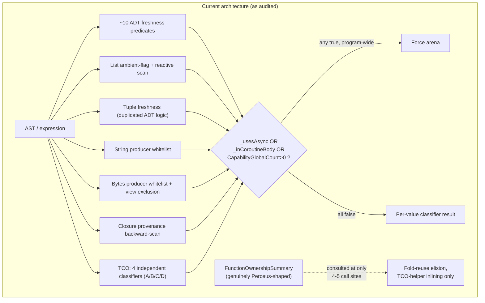
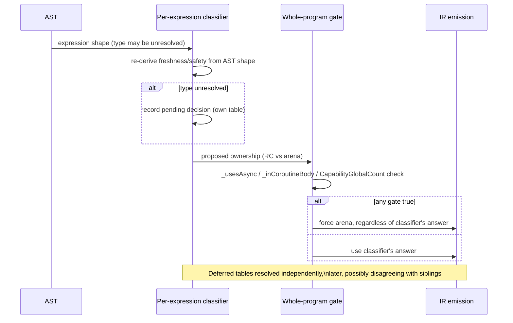
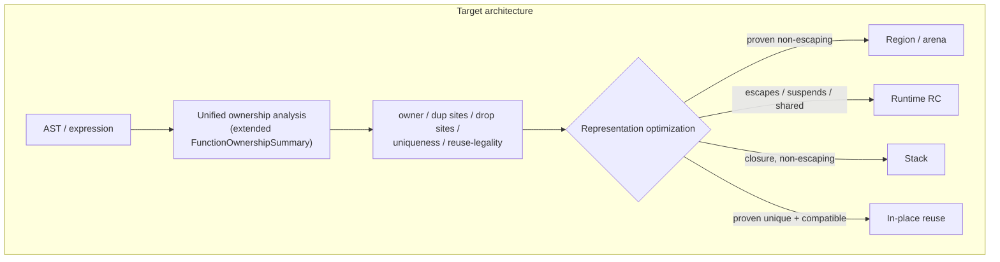

# Perceus Ownership Unification — Design Document

Status: implementation in progress. Produced from four parallel code audits (core data types;
closures & loop-carried/TCO values; async/task-frame values; capability/handler & request-local
values), synthesized here. Phase 0 (extending `FunctionOwnershipSummary` with expression-level
freshness and closure-forwarding provenance, `#303`), Phase 1 (Strings/Bytes/BigInt
builtin-freshness metadata, `#302`), Phase 2 (capability RC-eligibility gate narrowing, `#301`),
Phase 3 (closure/function-result provenance unification + borrow-forwarding fix, `#308`), and
Phase 4 (ADTs and Tuples per-expression top-cell freshness, unifying `ProducesFreshRuntimeManageableAdt`/
`IsFreshRuntimeManageableAdtExpression`/`IsFreshConstructorTree`/`ProducesFreshTuple`) have all
landed on `main`. Phases 5-7 are not yet started.

Known follow-ups from Phase 0, not yet landed: confirming the shadow-compare result at the full
`challenges/fannkuch-redux` N=11 workload (only N=9 was run, for sandbox resource-safety reasons);
teaching `FunctionResultProvenance` to consult Phase 1's `BuiltinRegistry.ProducesFreshRcResult`
metadata so a function forwarding to a builtin string/bytes/bigint producer is also recognized as
RC-eligible (currently under-recognized — a real, understood, not-yet-closed gap, not a defect).

Phase 4 follow-up: the "top-cell fresh" notion this session's own checkpoint anticipated (a
narrower sibling of Phase 0's `ExpressionFreshness` — "was this specific outer cell freshly
allocated" rather than "does nothing anywhere in this value alias a parameter") turned out to be
purely syntactic (no interprocedural alias reasoning needed to answer "is this expression literally
a constructor/tuple application"), so it is implemented as a standalone recursive query
(`Lowering.TopCellFreshness.cs`) rather than folded into the `ResultReach` fixpoint — routing it
through that fixpoint would have narrowed its domain to only `_maFuncs`-registered functions, a
regression versus the ad hoc classifiers it replaces. One design assumption from this phase's own
checkpoint was tried and found wrong during implementation, not just proposed: tuples do NOT share
the ADT CO-38/PR #299 same-parent-type reconciliation hazard (a tuple type has exactly one shape, and
the ambient RC-tuple flag only ever gates literal `TupleLit` allocations actually present in the
lowered body, never a passthrough binding) — an AND-based reconciliation attempt for
`ProducesFreshTuple` broke two live regression tests before being reverted to its original
existence-check (OR) semantics. Whoever picks up Phase 5 (Lists) should not assume the ADT
reconciliation pattern transfers to every category without re-deriving whether the same hazard
actually applies.

## 0. Objective (restated)

Make Perceus the single semantic ownership model for every ordinary immutable heap value. Region
allocation, stack allocation, in-place reuse, and RC-as-runtime-representation become optimizations
chosen *after* ownership (owner, dup/drop sites, uniqueness, reuse-legality) is already established —
not parallel ownership models the compiler arbitrates between per call site. Resources (`File`,
`Socket`, `Process`), scheduler bookkeeping, native runtime state, stack scalars, and foreign
allocations (PCRE2, mbedTLS) are unaffected and out of scope.

## 1. Current architecture

The RC-Perceus migration (`a8c9ca5`, landed 2026-07-23, documented in
`docs/md/internals/changelog.md`'s "RC Perceus migration chronology") states its intent plainly:
RC is "the general lifetime substrate for escaping ordinary heap graphs," and arena is retained only
for "compiler-proven scoped values." **The audits found this is not what the implementation actually
does.** There is no single gate that decides ownership once and then picks a representation.
Instead, for essentially every value-producing expression, `Lowering.cs`/`Lowering.Ownership.cs`
run a **bespoke syntactic classifier** that re-derives "is this fresh / is this safe to promote"
from the shape of the AST node that produced the value — not from any persistent, computed-once
ownership fact.

Concretely, the audits catalogued the classifier families:

| Value category | Classifier family | Approx. count | File |
|---|---|---|---|
| ADTs | `CanRuntimeManageAdt`, `CanRuntimeManageCopyAdt`, `..GenericCopyAdtConstructorApplication`, `..FreshHeapChildAdtConstructorApplication`, `..OwnedChildAdt(ConstructorApplication)`, `..RecursiveCopyAdt`, `IsFreshConstructorTree`, `IsFreshRuntimeManageableAdtExpression`, `ProducesFreshRuntimeManageableAdt` | ~10 | `Lowering.Ownership.cs`, `Lowering.cs` |
| Lists | `_runtimeRcListAllocationRequested` (ambient flag) + `IsRuntimeManageableListElement` + `IsRuntimeManagedResultTemp` (reactive scan) + `IsFreshListConstructionExpression`/`IsImmediateCopyListMatchUse`/`TryGetRuntimeRcListTailExtension` | ~6 | `Lowering.Patterns.cs`, `Lowering.cs` |
| Tuples | `ProducesFreshTuple`, `CanRuntimeManageFreshTupleExpression`, `CanRuntimeManageOwnedTupleType` — near-duplicates of the ADT-field dispatch | 3 | `Lowering.Ownership.cs`, `Lowering.cs` |
| Strings | `IsRuntimeRcStringProducer` — qualified-call-name whitelist | 1 | `Lowering.cs` |
| Bytes | `IsRuntimeRcBytesProducer` + `IsRuntimeRcClosureCaptureSafeBytesProducer` + `IsArenaAllocationFreeBytesOperand` + view-exclusion `RuntimeManagedTcoListElementContainsBytes` | 4 | `Lowering.cs`, `Lowering.Ownership.cs` |
| Closures (result/argument RC metadata) | `_functionReturnedClosureLabels`/`_runtimeManagedFunctionResultLabels`/`_knownFunctionLabelsBySlot`, populated by a **backward instruction scan** (`RecordFunctionResultProvenance`/`RecordReturnedClosureLabel`) | 1 system, whole-program side table | `Lowering.cs` |
| TCO loop accumulators | (A) `TcoContext.RuntimeManagedParamSlots` (whole-loop, all-or-nothing, type-shape-driven) + (B) `GetTcoCopyOutKind`/arena `TcoBackEdge*` machinery (CO-28/29/32/34/35/36, independent of A) + (C) `_runtimeManagedResultTemps` (temp-grained) + (D) `_runtimeManagedTcoPatternAliases` (pattern-derived-value grained, PR #298) | **4 independent classifiers**, reconciled only by hand-sequenced dispatch order | `Lowering.Types.cs`, `Lowering.cs`, `Lowering.Ownership.cs` |
| Async/await-captured values, task frames | `_usesAsync`/`_inCoroutineBody` — two **whole-program/lexical-scope booleans**, set once before lowering starts, gating ~12+ call sites to force arena treatment regardless of whether the specific value ever crosses a suspend point | 2 flags, program-wide | `Lowering.cs:819-823`, consumed throughout |
| Capability/handler environments | `CapabilityGlobalCount > 0` — a **whole-compilation-unit** count (not per-function, not per-value), gating the *same* ~15 call sites as the async flags | 1 flag, program-wide | `Lowering.Capabilities.cs:364` |

A genuinely Perceus-shaped, general-purpose ownership analysis **already exists**:
`Lowering.MoveAnalysis.cs`'s `FunctionOwnershipSummary` (`OwnershipSummary.cs`) computes
consumed/borrowed parameters, unique parameters, and result-freshness/reach via a real interprocedural
fixpoint, and its own doc comment calls it "the stable bridge between today's move/reuse analyses and
the owned and borrowed environments used by RC Perceus." **It is consulted at only 4-5 call sites in
the entire compiler** (fold-reuse copy elision and TCO-helper-inlining eligibility) — never by
`LowerVar`'s runtime-managed decision, never by closure-capture-ownership decisions, never by
`TcoContext`'s classification. The "bridge" is aspirational in its own doc comment, not actual in
the code. This is the single clearest, most concrete lever for the proposed redesign (§5).

Codegen itself (`src/Ashes.Backend/Llvm/LlvmCodegenMemory.cs`) is comparatively trivial: an
`EmitAllocAdt(..., runtimeManaged)`/`EmitRuntimeRcAlloc` vs. bump-pointer `EmitAlloc` choice keyed on
one boolean baked into the IR during lowering. All of the actual complexity — and all of the actual
risk — is upstream, in `Ashes.Semantics`.

## 2. Ownership flow

Ownership decisions are made **at lowering time, interleaved with Hindley-Milner unification**, at
each of several distinct "escape points": a function result, a `let`-scope exit, a TCO back-edge, a
closure capture, a match-arm result, a call argument/result boundary. Because a value's type is often
still an unresolved type variable when its producing expression first lowers (unification with later
call sites hasn't happened yet), several of these classifiers cannot decide inline and instead record
a *pending* decision (`PendingTcoReset`, `IrInst.TcoResetPending`, `_pendingNestedTcoPatternAliasSites`,
`_pendingRuntimeArgumentFlags`) that gets resolved and spliced back into the instruction stream later,
independently, by its own resolver pass. **Each of these deferred-resolution tables can reach a
different conclusion than a sibling table would for the same underlying value** — this "record now,
resolve independently later" pattern is directly implicated in two of the historical bugs found by
the closures/TCO audit (CO-34(b)'s late-typed-accumulator leak, and PR #298's nested-pattern-alias
use-after-free).

Three **whole-program** gates sit on top of all of this and can override any per-value classification
outcome: `_usesAsync`, `_inCoroutineBody`, `CapabilityGlobalCount > 0`. All three collapse to the
same effect at nearly the same ~15 call sites (`TryEmitScopeCopyOut`, `LowerCallCopyOutResult`,
`MakeClosure`'s `ReturnsRuntimeManaged`, `TrackRuntimeManagedMatchScrutinee`, etc.): force arena
(`ArenaScopeBoundary`/`ArenaCallBoundary`) instead of RC (`RcNormalization`), **for every value in
every function**, not just values that plausibly interact with async/capabilities. `_usesAsync` and
`CapabilityGlobalCount` are computed once, before lowering starts, from a whole-program pre-scan —
they are never narrowed per function or per value.

Provenance is frequently tracked **reactively** rather than forward-propagated: `IsRuntimeManagedResultTemp`
(the single most load-bearing predicate in the compiler for this question) performs a **linear
backward scan of every IR instruction emitted so far** looking for an `AllocAdt`/`ConcatStr`/etc. with
`RuntimeManaged: true` targeting the temp in question. Closure result/argument provenance
(`RecordFunctionResultProvenance`) does the same kind of backward scan for `MakeClosure`. Both are
provably incomplete for a value that reaches its use site *by forwarding through a chain of calls*
rather than by direct construction — exactly the shape that (per this session's own investigation)
caused the fannkuch-redux regression's dominant remaining leak.

## 3. Storage flow

Once a value is classified, storage is mechanical and largely uniform:

- **Arena**: bump-pointer allocation (`EmitAlloc`) into a growable-chunk arena; reclamation is a
  scope/TCO-back-edge watermark reset (`RestoreArenaState`/`ReclaimArenaChunks`), never a per-value
  operation.
- **RC**: 16-byte header + payload (`EmitRuntimeRcAlloc`), refcounted via `RcDup`/`RcDrop`, backed by
  per-thread dense chunks plus exact-size free-list bins for small cells, direct OS return for large
  cells.
- **Stack** (closures only): `MakeClosureStack`, lexically scoped.
- **Borrowed view** (Bytes only): `BytesSubView`, tied to a resource/mmap region, never RC or arena
  — a genuine third representation, discussed in §7.
- **Task/scheduler region**: a task's state struct is a single arena allocation with bulk (not
  per-value) reclamation on completion.

The representation layer is, with one exception (Bytes views, §7), **already generic enough to
accept either model without change** — `EmitCreateTaskCopyCaptures`, for instance, does a raw
word-for-word bit copy into a task frame with zero ownership awareness; it would copy an RC pointer
exactly as happily as an arena pointer. This confirms the target architecture's core premise:
representation choice is not, today, the hard part. Ownership *decision-making* is.

## 4. Places where they are coupled today

The four audits together catalogued **~50 distinct call sites** where an ownership-model distinction
changes **which IR instructions get emitted** — not merely which allocator a value lands in. The full
per-site detail lives in the four audit transcripts (available on request); the load-bearing pattern,
repeated across every category, is:

1. A boolean ownership classification (`RuntimeManaged`, "is this a known function label",
   "is this param in `RuntimeManagedParamSlots`") determines **which of two structurally different
   lowering functions runs** (e.g. `LowerEscapingResult` vs. plain `LowerExpr`; `TryEmitScopeCopyOut`'s
   `RcNormalization` vs. `ArenaScopeBoundary` branch; `EmitTcoBackEdgeArenaBlock`'s three-way
   first-match dispatch).
2. That, in turn, decides **whether an explicit drop/dup is emitted at all**, and for which values
   (RC ADTs get a recursive `RcDrop` walk per child; arena ADTs get an implicit no-op watermark
   reset — same source construct, different instruction sequences).
3. In closure/call-boundary cases, it changes **the calling-convention ABI bit itself**
   (`ClosureResultOwnershipBit`/`ClosureArgumentOwnershipBit`), not just a local decision.
4. For TCO loops specifically, an all-or-nothing veto (`LowerLambdaCoreRejectPartialRuntimeManagedTcoFrame`)
   means **one hard-to-classify accumulator silently changes the emitted code for every other
   accumulator in the same loop**.
5. For async/capability values, a **whole-program** flag overrides every per-value classifier's
   answer at once, for every function, regardless of whether that function's values are anywhere
   near an `await` or a `handle`.

Two coupling points deserve special call-out because they are the cleanest and the murkiest,
respectively:

- **Cleanest**: `Lowering.Capabilities.cs:364`'s `CapabilityGlobalCount`. A program that declares a
  capability and resolves every use of it statically via `provide` (zero dynamic dispatch anywhere)
  still pays the full program-wide RC-disablement cost, for every value in every function, forever.
  No documented reason was found for bundling this with the async/coroutine exception; the one
  in-code comment justifying the bundling (`Lowering.Patterns.cs:929-934`) explicitly reasons about
  *only* the async/coroutine half.
- **Murkiest**: `PerceusLifetimePlacement.cs`'s CFG builder has no notion of `Suspend`/`Resume` at
  all. For any value that *does* get classified `RuntimeManaged=true` and whose lexical scope spans
  an `await`, the drop-placement pass's forward-reachability search cannot see past a coroutine
  state boundary (each state is a disconnected subgraph, dispatched only via a `SwitchTag` header),
  so it places the `RcDrop` right after the pre-suspend save — even when the value is read again
  after resume. **No test in the entire suite exercises this interaction**: the state-machine
  transform's own unit tests call `StateMachineTransform.Transform` directly and never invoke
  `PerceusLifetimePlacement`; every async e2e fixture captures only `Int` values across an `await`,
  never a `Str`/`List`/ADT. This is very likely why the bug hasn't surfaced: the *other* coupling
  (the whole-program `_usesAsync` gate) currently prevents async-touched heap values from ever
  reaching RC in the first place, which incidentally also prevents this CFG-blindness bug from firing.
  **These two bugs currently mask each other.**

## 5. Proposal for separating ownership from representation

The unifying move all four audits converge on: **extend `FunctionOwnershipSummary` (and the
fixpoint that computes it) into the one thing every category's classifier queries**, instead of each
category re-deriving freshness/uniqueness from AST shape independently. Concretely, four extensions
to the existing (already-Perceus-shaped, already-interprocedural) analysis:

1. **Expression-level, not just whole-function-level.** Today the summary answers "is this
   function's *result* fresh" — the ADT/tuple/list/match-arm classifiers need "is *this
   sub-expression* fresh," at arbitrary points inside a function body, not just at its return.
2. **Cover builtins/intrinsics, not just user-defined functions.** `_maFuncs` (the summary's
   registration table) only covers top-level user functions. Every `Ashes.Text.fromInt`-style
   producer whitelist (Strings, Bytes, BigInt) should instead be a **declared fact on the intrinsic's
   metadata** (extending `BuiltinRegistry`, which already carries per-intrinsic metadata for other
   purposes) — "this intrinsic's result is fresh and uniquely owned" — looked up once, not
   re-derived by parsing the call-site AST's qualified name every time.
3. **Cover closure identity/provenance.** `_functionReturnedClosureLabels`/`_knownFunctionLabelsBySlot`
   (the backward-scan system implicated in the fannkuch-redux leak) should become a field on the
   summary, computed by the same fixpoint that computes `ResultReach`, extended to reason about
   closure identity through curried/forwarding returns — the exact case the current backward scan
   cannot see.
4. **Cover TCO parameters.** `TcoContext`'s ~17 independently-scanned classification fields should
   shrink to reading one ownership decision per parameter off the (now expression-level) summary;
   the all-or-nothing frame veto should be deleted, since a unified per-value model can express
   "this parameter is RC, that one in the same loop is arena" safely (today it cannot, which is
   *why* the veto exists — see the CO-38/PR #299 precedent, which shows exactly this kind of
   accidental mixing being unsafe when done *implicitly*; the goal is to make it safe and *explicit*).

Once ownership is decided this way, **region/arena/stack placement becomes a downstream question**:
"has the ownership analysis proven this value non-escaping / scope-bounded?" — if yes, arena is a
legal, purely-representational optimization; if no, RC. `CanArenaReset`/`GetTcoCopyOutKind` would be
*consulted* only for values the ownership layer has already cleared, not run independently against
every value's raw type as a competing classification.

For the two whole-program gates (`_usesAsync`/`_inCoroutineBody`, `CapabilityGlobalCount`), the
proposal is **not** to remove the underlying restriction (which is real for the task struct and the
one-shot post's captured extent) but to **narrow its granularity**: from "is this program/function
touched by async/capabilities at all" to "does this specific value's live range intersect an actual
suspend point / actual dynamic capability dispatch." The `LivePostsGuard` mechanism (already
correctly scoped to a *temporal* window, if not a *value* window) and `StateMachineTransform`'s
existing per-suspend-point liveness analysis (already computing exactly the save/restore set needed)
are both cited by name in the audits as the natural sources for this narrower signal — they already
exist and already compute close to what's needed, just for a different consumer today.

## 6. Migration plan

Do **not** attempt this as one change. The audits independently converge on a category ordering
driven by complexity and by which categories' fixes are prerequisites for others:

**Phase 0 — prerequisite, no behavior change.** Extend `OwnershipSummary.cs`'s
`FunctionOwnershipSummary` record with the new fields (§5, items 1-4) *without yet routing any
classifier through it* — i.e. compute it in parallel, assert-compare its answer against each existing
classifier's answer in debug builds, and fix any disagreement found before anything depends on the
new analysis. This directly reuses the project's own established practice (soak-testing new
ownership logic against old before cutover) and produces, as a side effect, concrete evidence of how
often the new analysis would have changed behavior versus the old ad hoc classifiers.

**Phase 1 — Strings/Bytes builtin-freshness metadata (Medium complexity, low risk).** Collapse
`IsRuntimeRcStringProducer`/`IsRuntimeRcBytesProducer`/`IsRuntimeRcBigIntProducer` into one
table-driven lookup against `BuiltinRegistry` metadata. Mechanical, narrow blast radius, and proves
the "consult a declared fact instead of re-deriving from AST shape" pattern end-to-end before
touching anything TCO/reuse-adjacent. Bytes' view/owned distinction stays a first-class tag (§7) —
this phase does not touch that.

**Phase 2 — Capability gate narrowing (Medium complexity, concentrated).** Replace
`CapabilityGlobalCount > 0` with a genuinely dynamic-dispatch-scoped signal (distinguish
static-`provide`-only programs, which need no exception at all, from programs with real `handle`
sites). Concentrated in ~15 call sites all in three files; the fix is narrowing a predicate, not
redesigning a mechanism. Do this before touching async narrowing (Phase 5) since the two gates are
currently checked together at every site and separating them first makes each easier to reason about
independently.

**Phase 3 — Closure result/argument provenance unification (Medium complexity) — landed.** Fold
`_functionReturnedClosureLabels`/`_runtimeManagedFunctionResultLabels`/`_knownFunctionLabelsBySlot`
into the extended summary (§5 item 3). **This phase bundles two mechanistically distinct fixes —
keep them distinguished, both here and in any future retelling:**

1. The `FunctionResultProvenance`/closure-forwarding mechanism itself (the phase's originally-scoped
   work). Measured effect on fannkuch-redux N=11 in isolation: small, ~45 GB → ~44 GB (~2%).
   `FunctionResultProvenance`'s "forwards to another function" classification answers "does the
   *whole result* forward," not "is *this constructor argument* fresh when it comes from calling
   another user function" — the latter is a genuinely different, inter-procedural question
   (`IsFreshConstructionArgument`'s domain) needing each callee's own provenance resolved recursively
   through a call cycle (`rotateFirst`/`setAt`/`insertAt`/`nextPerm` all call each other in the
   fannkuch accumulator chain) — real, separate work, adjacent to Phase 6/`GetAdtField` territory,
   correctly declined rather than chased under this phase's scope.
2. A second, narrower fix folded into the same phase: broadening `LowerVar`'s `Borrow`-path
   condition (registering a borrowed alias as "already RC-safe" under the same general condition
   already used for the pre-borrow temp, instead of only the narrow TCO-alias case) — a different
   code path than `FunctionResultProvenance` entirely. **This fix alone reproduces the full
   47 GB → 27.4 GB fannkuch-redux improvement**, verified twice for reproducibility, output unchanged
   (checksum `556355`, `Pfannkuchen(11) = 51`), and confirmed via manual revert-and-rebuild that a
   regression test genuinely depends on it.

fannkuch-redux N=11 after Phase 3: **~27.4 GB**, down from the ~47 GB regression baseline — a real,
substantial, verified improvement, but **not the whole story**: 27.4 GB is still far above the
pre-regression historical baseline (~3.8 MB). **fannkuch-redux's remaining dominant leak driver is
confirmed to be a separate, third gap**: `GetAdtField`/match-extracted-field provenance in
`Lowering.Patterns.cs` (a `match st with | S(perm, count) -> ...`-shaped extraction question, not a
closure-forwarding question) — this remains unfixed and is not part of Phase 3, 4, or 5 as currently
scoped; whoever tackles it next should treat it as its own investigation, likely adjacent to Phase 6,
and should start from Phase 3's own `ASHES_EXPLAIN_OWNERSHIP=all` trace of
`nextPerm`/`rotateFirst`/`setAt`/`insertAt`/`loop` against the real
`challenges/fannkuch-redux/fannkuch-redux.ash` rather than re-deriving the diagnosis from scratch.

**Phase 4 — ADTs and Tuples per-expression freshness — landed.** Added a standalone "top-cell
fresh" query (`Lowering.TopCellFreshness.cs`) — a syntactic sibling of Phase 0's
`ExpressionFreshness`, not folded into its interprocedural fixpoint (see the status note above for
why). `ProducesFreshRuntimeManageableAdt`/`IsFreshRuntimeManageableAdtExpression`/
`IsFreshConstructorTree` now route through it, and its `AnyArmConsistentlyFresh` helper generalizes
the CO-38/PR #299 per-arm reconciliation (every terminal arm building the same parent type must
independently agree, never an OR across disagreeing siblings) to an arbitrary number of sibling
constructors, not just the original bug's binary if/else. Of the audit's 3 tuple-specific
predicates, only `ProducesFreshTuple` was genuinely a duplicated freshness classifier (moved onto
the same shared control-flow walk, `CollectFreshEscapeTerminals`); `CanRuntimeManageFreshTupleExpression`
and `CanRuntimeManageOwnedTupleType` turned out to be type-shape/per-field-producer-acceptance gates
analogous to the 7 orthogonal ADT predicates, not freshness classifiers, and were left alone.
`ProducesFreshTuple` keeps its original existence-check (OR) semantics rather than adopting the
ADT's AND-based reconciliation — see the status note above for why that turned out not to apply to
tuples. Full C# suite (1693/1693), LSP suite (52/52), e2e suite (539/0), and the full `challenges/`
suite (binary-trees N=21, fannkuch-redux N=11, n-body, spectral-norm, mandelbrot, fasta,
reverse-complement, k-nucleotide, 1brc) all confirmed unchanged versus the Phase 3 baseline.

**Phase 5 — Lists (Very large, highest risk of this group).** Replace the ambient
`_runtimeRcListAllocationRequested` flag and the reactive `IsRuntimeManagedResultTemp` backward scan
with the same forward-computed, per-expression ownership fact used for ADTs. Do this *after* Phase 4
since list-of-ADT classification depends on ADT freshness being already unified. This phase also
needs to reconcile the two independently-implemented reuse-token soundness proofs
(`_linearReuseNames` arena path vs. `TryGetRuntimeManagedReuseScrutinee` RC path in
`Lowering.Patterns.cs`) into one, since Lists is where that duplication is sharpest.

**Phase 6 — TCO loop-carried values (Very large, depends on Phases 3-5).** Collapse the four
independent classifiers (A/B/C/D, §1) into one per-parameter ownership decision; delete the
all-or-nothing frame veto; fold pattern-derived-alias tracking (D) into ordinary dup/drop placement
instead of a separate pending-sites table. This phase cannot start meaningfully before Phases 3-5
land, since TCO's classifiers are built on top of (and duplicate) the ADT/List/closure machinery
those phases are unifying.

**Phase 7 — Async/task-frame narrowing (Very large, most dangerous, do last).** Two sub-parts that
must both land together, not separately:
  (a) Replace `_usesAsync`/`_inCoroutineBody`'s whole-program scope with a per-value "does this
      value's live range cross an actual suspend point" signal, sourced from
      `StateMachineTransform`'s existing per-suspend-point liveness analysis.
  (b) **Before** (a) ships, fix `PerceusLifetimePlacement`'s CFG-blindness to `Suspend`/`Resume`
      boundaries (either by teaching its CFG builder about coroutine state transitions, or — the
      audit's preferred direction — by running the pass on the pre-`StateMachineTransform` linear
      instruction stream, before the coroutine split, so ordinary CFG reasoning naturally spans the
      await). **Landing (a) without (b) converts today's over-conservative leak-shaped failure mode
      into a use-after-free-shaped failure mode** — this is the single most load-bearing warning
      across all four audits and must be the release-gating check for this phase.
  (c) Design and land a **new** task-frame teardown hook (walk RC-owned payload slots and drop them)
      before any task-frame payload is allowed to become RC-owned — this mechanism does not exist in
      any form today (arena reclamation is bulk-region and genuinely doesn't need one), and its
      absence would otherwise leak every RC value captured by a cancelled/losing-race/never-completing
      task.
  New soak tests (heap value captured across an `await`, read on both sides; RC value captured by a
  task that never completes) must exist and pass *before* this phase is considered done — none exist
  today (confirmed by audit: every async e2e fixture only ever captures `Int` across an `await`).

## 7. Risks

**Two categories are genuinely NOT reducible to "ownership first, representation later" and need
explicit exceptions, not omissions:**

- **Bytes' borrowed mmap view.** A `Bytes` view over an `Ashes.IO.File.mmap`'d region is not
  separable into "ownership" and "representation" — the view's non-ownership *is* its
  representation (a raw pointer into someone else's mapping). This is correctly out of scope per the
  user's own framing (resources/foreign allocations are excluded), but the current code conflates
  "is this a view" with "is this RC-ineligible" via a producer-name exclusion list
  (`RuntimeManagedTcoListElementContainsBytes`) rather than a first-class tag on the value. The
  unification should give views a **structural, type-level tag** ("owned buffer" vs. "borrowed
  view") rather than continuing to detect them by producer-name walks — this is squarely in scope
  even though the view mechanism itself stays as-is.
- **Task-frame teardown on non-normal completion.** Discussed in Phase 7(c) above — this is net-new
  machinery, not a refactor of existing machinery, and is the single largest genuinely new piece of
  the whole plan.

**This is the highest-risk code in the compiler by the project's own repeated admission**
(`changelog.md:339-340`: "the reuse / lifetime analyses, where the CO-8/CO-9 use-after-frees lived").
Every phase above touches code with a specific, named historical incident:

| Phase | Historical precedent(s) | Failure mode |
|---|---|---|
| 3 (closures) | fannkuch-redux investigation (this session) | Silent leak from unrecognized-already-RC value — the borrow-path half of this phase closes the 47GB->27.4GB regression; the closure-forwarding half alone would not have (see §7) |
| 4 (ADTs/Tuples) | PR #299 / CO-38 | Silent leak from mixed arena/RC sibling representations |
| 5 (Lists) | CO-32's Phase A/B overlap ("readme_showcase priced 41.00 instead of 12.50") | Silent **wrong value**, not just leak — masked by optimized builds |
| 6 (TCO) | CO-8, CO-9, CO-28/29/32/34/35, PR #298 | Use-after-free / segfault / silent leak, six distinct historical incidents in this one subsystem |
| 7 (async) | (none yet — currently masked by over-conservatism, see §4) | Use-after-free if narrowed before the CFG-blindness fix lands |

**Discrepancy resolved (was open, now fully settled by Phase 3's actual measurement)**: PR #299's own
commit message attributed fannkuch-redux's regression to "a different, still-open bug in the RC
allocator's free-list reuse for list cons cells." A separate, earlier, never-landed experimental fix
(discarded diff) had instead pointed at two things together — the closure/function-result provenance
gap and a `LowerVar` `Borrow`-path condition — and measured a 47GB→27.4GB improvement from the
combination. Phase 3's formal, safety-reviewed re-implementation isolated the two: the
closure-forwarding mechanism alone gives only ~2%; the `Borrow`-path fix alone reproduces the full
47GB→27.4GB figure. **The free-list theory is now considered settled as incorrect** — the real
mechanism was the `Borrow`-path condition the whole time, confirmed via manual revert-and-rebuild
against the real benchmark. What remains unresolved is *only* the residual ~27.4GB — confirmed by
direct `FunctionResultProvenance`/`GetAdtField` inspection against the real fannkuch program to be
the match-extracted-field provenance gap (`GetAdtField` in `Lowering.Patterns.cs`) — a
`match`-destructuring question, distinct from both the closure-forwarding and `Borrow`-path
mechanisms already fixed. This remains unfixed. Whoever picks it up next should start from Phase 3's
PR discussion (direct `ASHES_EXPLAIN_OWNERSHIP=all` trace of
`nextPerm`/`rotateFirst`/`setAt`/`insertAt`/`loop` on the real
`challenges/fannkuch-redux/fannkuch-redux.ash`) rather than re-deriving the diagnosis from scratch.

**General mitigation for every phase**: this project's established discipline — "growing-key UAF
stress tests at every step," soak testing at 2K/10K/50K+ workload scales, verifying every new test
fails without its fix via `git stash` before trusting it, and the milestone gate already agreed for
the self-hosting effort (all `challenges/` benchmarks + full test suite must show no regression) —
should apply to every phase here, not just the self-hosting track.

## 8. Recommended implementation order

As enumerated in §6: **Phase 0 → 1 → 2 → 3 → 4 → 5 → 6 → 7**, with Phase 7 gated on its own two
sub-parts landing together (never (a) without (b)). Phases 1-3 are the highest-value, lowest-risk
starting point: mechanical, narrow blast radius, and each gives a real measured improvement while
proving the "unified ownership fact, consulted not re-derived" pattern — Phase 3 in particular
resolves the fannkuch-redux regression from ~47GB to ~27.4GB. fannkuch-redux's remaining residual
leak (~27.4GB, still far above the pre-regression ~3.8MB baseline) is now confirmed to be a separate,
unscoped gap (§7) — Phases 4-6 are where the bulk of the risk and effort live, and should
not start until 1-3 have proven the "unified ownership fact, consulted not re-derived" pattern works
in production on real benchmarks. Phase 7 is deliberately last: it requires new test infrastructure
that doesn't exist yet, touches the one subsystem where the audits found a currently-*masked* bug
(the CFG-blindness/whole-program-gate interaction), and its failure mode if sequenced wrong is
strictly worse (UAF) than the failure mode it's fixing (leak).

This is multi-week/large-milestone-scale work in aggregate — not a sprint, and not a single PR. Per
the user's own instruction, do not force any phase past its audit's stated risk level if a
correctness issue is discovered mid-phase; stop and report, the same discipline already applied
throughout this audit.
