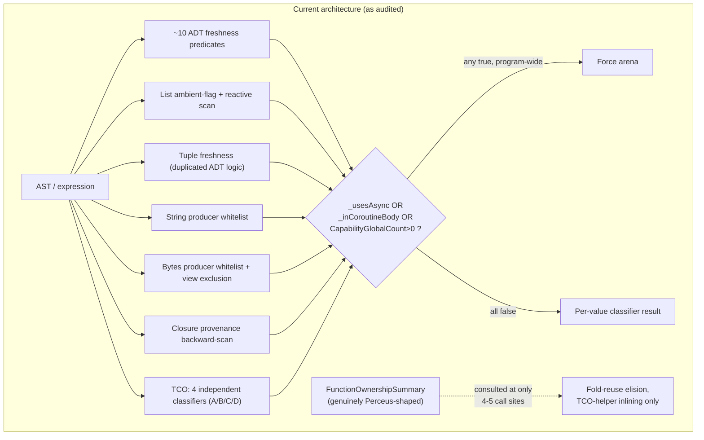
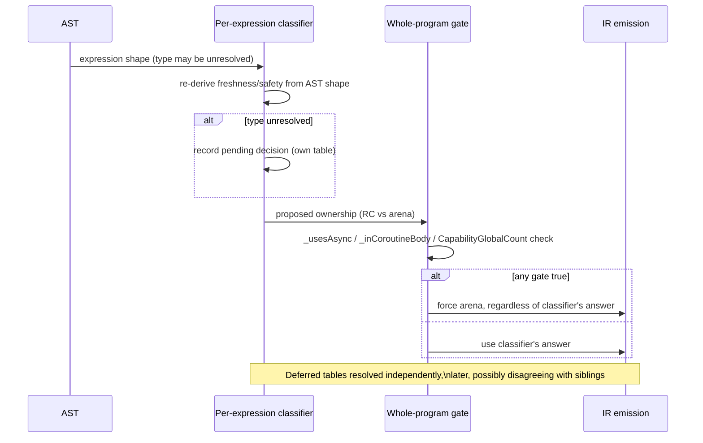
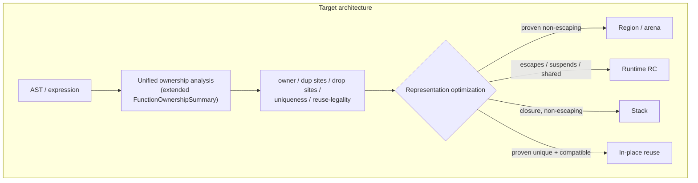

# Perceus Ownership Unification — Design Document

Status: implementation in progress. Produced from four parallel code audits (core data types;
closures & loop-carried/TCO values; async/task-frame values; capability/handler & request-local
values), synthesized here. Phase 0 (extending `FunctionOwnershipSummary` with expression-level
freshness and closure-forwarding provenance, `#303`), Phase 1 (Strings/Bytes/BigInt
builtin-freshness metadata, `#302`), Phase 2 (capability RC-eligibility gate narrowing, `#301`),
Phase 3 (closure/function-result provenance unification + borrow-forwarding fix, `#308`),
Phase 4 (ADTs and Tuples per-expression top-cell freshness, unifying `ProducesFreshRuntimeManageableAdt`/
`IsFreshRuntimeManageableAdtExpression`/`IsFreshConstructorTree`/`ProducesFreshTuple`, `#309`), and
Phase 5 (Lists per-expression top-cell freshness + a reused-cell reuse-token/RC bookkeeping fix) have
all landed on `main`. Phase 6 (TCO loop-carried values) was first attempted and recorded below as an
investigation with no landed change (two independently-derived fixes were each confirmed, by direct
measurement or by the existing regression suite, to make things worse, and both were reverted rather
than shipped) — a follow-up session then closed the specific gap that investigation diagnosed
(interprocedural call-result freshness), landing a real fix: fannkuch-redux N=11 peak RSS dropped from
the ~27.4GB regression baseline to ~1.56GB (a 17.6x reduction), fully validated. The four-classifier
TCO collapse and the all-or-nothing frame veto removal that Phase 6 was originally titled for remain
unstarted — see the "Phase 6 resolution" section below for the full account, including a newly
characterized, much smaller residual gap (~1.56GB, still above the ~3.8MB historical baseline) left
for a future phase. Phase 7 is not yet started.

Known follow-ups from Phase 0, not yet landed: confirming the shadow-compare result at the full
`challenges/fannkuch-redux` N=11 workload (only N=9 was run, for sandbox resource-safety reasons);
teaching `FunctionResultProvenance` to consult Phase 1's `BuiltinRegistry.ProducesFreshRcResult`
metadata so a function forwarding to a builtin string/bytes/bigint producer is also recognized as
RC-eligible (currently under-recognized — a real, understood, not-yet-closed gap, not a defect).

Phase 4 follow-up: the "top-cell fresh" notion this session's own checkpoint anticipated (a
narrower sibling of Phase 0's `ExpressionFreshness` — "was this specific outer cell freshly
allocated" rather than "does nothing anywhere in this value alias a parameter") turned out to be
purely syntactic (no interprocedural alias reasoning needed to answer "is this expression literally
a constructor/tuple application"), so it is implemented as a standalone recursive query
(`Lowering.TopCellFreshness.cs`) rather than folded into the `ResultReach` fixpoint — routing it
through that fixpoint would have narrowed its domain to only `_maFuncs`-registered functions, a
regression versus the ad hoc classifiers it replaces. One design assumption from this phase's own
checkpoint was tried and found wrong during implementation, not just proposed: tuples do NOT share
the ADT CO-38/PR #299 same-parent-type reconciliation hazard (a tuple type has exactly one shape, and
the ambient RC-tuple flag only ever gates literal `TupleLit` allocations actually present in the
lowered body, never a passthrough binding) — an AND-based reconciliation attempt for
`ProducesFreshTuple` broke two live regression tests before being reverted to its original
existence-check (OR) semantics. Whoever picks up Phase 5 (Lists) should not assume the ADT
reconciliation pattern transfers to every category without re-deriving whether the same hazard
actually applies.

Phase 5 follow-up: the audit's characterization of Lists ("ambient flag + reactive backward scan")
turned out to describe only part of the real pipeline once re-checked against the current code —
`LowerRuntimeManagedListElement`/`LowerCons` already did Tuple-style forward, per-element AST
classification before this phase started; the genuinely ambient/reactive pieces were narrower:
`IsFreshListConstructionExpression` (no control-flow transparency) and `IsRuntimeManagedResultTemp`'s
final "did this temp actually land RC" check (used symmetrically by both List's and Tuple's per-element
predicates — Phase 4 did not eliminate it for Tuples either, so Phase 5 left it alone for Lists too,
rather than making the two categories diverge for no proven benefit).

**Correction, made after the checkpoint report on this exact question**: this note originally claimed
Lists do not share the ADT AND-reconciliation hazard, reasoning that a list has no sibling-constructor
identity for an AND-style reconciliation to key on. That structural argument was real but incomplete —
it explains why there is no "different constructor of the same declared type" hazard, but missed a
DIFFERENT mixing hazard that does not need one: `if cond then existingList else [fresh, list]`, one
arm a bare-Var passthrough of an existing (not provably fresh) binding, the other a genuine fresh
construction. An existence check (OR) sets the ambient RC-eligibility flag for the whole escaping
position, so the fresh arm's cons cell is allocated on the RC heap (`Alloc RuntimeManaged: true`) —
but the join-level `MarkUniformRuntimeManagedResult`/`MarkRuntimeManagedMatchResult` machinery (which
decides whether the JOINED/matched value is actually treated as owned) requires every arm
independently verified runtime-managed, which the passthrough arm never is. Direct IR inspection
confirmed the two mechanisms disagree (an orphaned `Alloc{RuntimeManaged: true}` with no reachable
`RcDrop`) — a real, provable bookkeeping defect, fixed by requiring every terminal independently fresh
(AND, not OR) so the two verdicts can no longer disagree. **What was NOT confirmed**: an actual
process-memory leak. Compiled-binary testing at real scale (a discarding loop and a consuming loop, up
to 50M iterations; a larger-payload variant to make any real leak visible in RSS) found no measurable
difference between the pre-fix and post-fix binaries — the orphaned cell appears to be reclaimed by
the same scope-based bulk arena watermark reset that reclaims ordinary arena garbage, since it never
escapes its own allocating scope before that reset runs. Whether that reclaim path holds in every
context this shape could arise in was not re-derived from the codegen/runtime source in the time
available. The fix is real and unambiguously correct (it cannot make anything less safe, and costs
nothing) but should be read as "a provable bookkeeping defect worth removing outright," not "a leak
this phase's own testing caught live" — the two are different claims, deliberately not conflated. The
same latent gap, by the same reasoning, appears to reproduce for ADTs/Tuples' `AnyArmConsistentlyFresh`
too (a bare-Var sibling has no constructor-identity group key, so it is excluded from reconciliation
exactly like a funneling recursive call) — checked only at the IR level, not independently confirmed
at the compiled-binary level, and not fixed here since that is already-shipped, more broadly-used code
this phase was not scoped to touch; reported separately for whoever owns that decision.

The tail-sharing safeguard this phase needed and neither ADT nor Tuple
did: `IsFreshListConstructionExpression`'s terminal set (`ListLit`, or a `Cons` chain bottoming out in
one) was extended with control-flow transparency (via `CollectFreshEscapeTerminals`, as
`ProducesFreshRuntimeManageableList`) but deliberately NOT widened to accept `Expr.Call`/`Expr.Var` —
the arena/TCO side already has a laxer sibling (`IsFreshListRebuildExpr`) answering a different
question (safe to whole-clone at a back-edge, CO-32's concern) and the two must not be merged; keeping
the terminal sets disjoint is what makes a threaded/shared-tail list structurally unable to be
RC-promoted by this engine, independent of which call site asks. Separately, reading `LowerConsCell`
closely surfaced a real, pre-existing, latent bookkeeping bug (not introduced by this phase): a list
cons cell satisfied by a reuse token is unconditionally an arena `AllocReusing` (`RuntimeManaged:
false` always — there is no list-specific runtime-managed reuse cleanup), but the post-emission
bookkeeping that marks a cell `_runtimeManagedResultTemps` keyed only off the `runtimeManaged` request
flag and `_runtimeRcTcoListTailBinding`, independent of which branch actually emitted the cell — so a
reuse-token hit could mark an arena-reused cell (no RC header) as runtime-managed anyway. Fixed by
keying the bookkeeping directly off which branch ran; this IS this phase's reuse-token reconciliation
for Lists (there is no separate RC-managed list reuse-token path to reconcile against — the RC reuse
proof, `TryGetRuntimeManagedReuseScrutinee`, is gated to `TypeRef.TNamedType` and categorically
excludes `TList` — so "reconciling the two proofs" resolved to "there is only one real proof for
Lists, and its bookkeeping must not disagree with its own emission decision"). No `.ash`-level program
was found that reaches the vulnerable state within this session's budget (it needs a reuse token and
the narrow list-tail-extension binding to coincide), so the fix is verified by full-suite regression
(zero behavior change across 1697 C#/52 LSP/541 e2e tests) and by inspection, not by a dedicated
fails-without-the-fix repro — flagged honestly rather than claimed as fully pinned.

## 0. Objective (restated)

Make Perceus the single semantic ownership model for every ordinary immutable heap value. Region
allocation, stack allocation, in-place reuse, and RC-as-runtime-representation become optimizations
chosen *after* ownership (owner, dup/drop sites, uniqueness, reuse-legality) is already established —
not parallel ownership models the compiler arbitrates between per call site. Resources (`File`,
`Socket`, `Process`), scheduler bookkeeping, native runtime state, stack scalars, and foreign
allocations (PCRE2, mbedTLS) are unaffected and out of scope.

## 1. Current architecture

The RC-Perceus migration (`a8c9ca5`, landed 2026-07-23, documented in
`docs/md/internals/changelog.md`'s "RC Perceus migration chronology") states its intent plainly:
RC is "the general lifetime substrate for escaping ordinary heap graphs," and arena is retained only
for "compiler-proven scoped values." **The audits found this is not what the implementation actually
does.** There is no single gate that decides ownership once and then picks a representation.
Instead, for essentially every value-producing expression, `Lowering.cs`/`Lowering.Ownership.cs`
run a **bespoke syntactic classifier** that re-derives "is this fresh / is this safe to promote"
from the shape of the AST node that produced the value — not from any persistent, computed-once
ownership fact.

Concretely, the audits catalogued the classifier families:

| Value category | Classifier family | Approx. count | File |
|---|---|---|---|
| ADTs | `CanRuntimeManageAdt`, `CanRuntimeManageCopyAdt`, `..GenericCopyAdtConstructorApplication`, `..FreshHeapChildAdtConstructorApplication`, `..OwnedChildAdt(ConstructorApplication)`, `..RecursiveCopyAdt`, `IsFreshConstructorTree`, `IsFreshRuntimeManageableAdtExpression`, `ProducesFreshRuntimeManageableAdt` | ~10 | `Lowering.Ownership.cs`, `Lowering.cs` |
| Lists | `_runtimeRcListAllocationRequested` (ambient flag) + `IsRuntimeManageableListElement` + `IsRuntimeManagedResultTemp` (reactive scan) + `IsFreshListConstructionExpression`/`IsImmediateCopyListMatchUse`/`TryGetRuntimeRcListTailExtension` | ~6 | `Lowering.Patterns.cs`, `Lowering.cs` |
| Tuples | `ProducesFreshTuple`, `CanRuntimeManageFreshTupleExpression`, `CanRuntimeManageOwnedTupleType` — near-duplicates of the ADT-field dispatch | 3 | `Lowering.Ownership.cs`, `Lowering.cs` |
| Strings | `IsRuntimeRcStringProducer` — qualified-call-name whitelist | 1 | `Lowering.cs` |
| Bytes | `IsRuntimeRcBytesProducer` + `IsRuntimeRcClosureCaptureSafeBytesProducer` + `IsArenaAllocationFreeBytesOperand` + view-exclusion `RuntimeManagedTcoListElementContainsBytes` | 4 | `Lowering.cs`, `Lowering.Ownership.cs` |
| Closures (result/argument RC metadata) | `_functionReturnedClosureLabels`/`_runtimeManagedFunctionResultLabels`/`_knownFunctionLabelsBySlot`, populated by a **backward instruction scan** (`RecordFunctionResultProvenance`/`RecordReturnedClosureLabel`) | 1 system, whole-program side table | `Lowering.cs` |
| TCO loop accumulators | (A) `TcoContext.RuntimeManagedParamSlots` (whole-loop, all-or-nothing, type-shape-driven) + (B) `GetTcoCopyOutKind`/arena `TcoBackEdge*` machinery (CO-28/29/32/34/35/36, independent of A) + (C) `_runtimeManagedResultTemps` (temp-grained) + (D) `_runtimeManagedTcoPatternAliases` (pattern-derived-value grained, PR #298) | **4 independent classifiers**, reconciled only by hand-sequenced dispatch order | `Lowering.Types.cs`, `Lowering.cs`, `Lowering.Ownership.cs` |
| Async/await-captured values, task frames | `_usesAsync`/`_inCoroutineBody` — two **whole-program/lexical-scope booleans**, set once before lowering starts, gating ~12+ call sites to force arena treatment regardless of whether the specific value ever crosses a suspend point | 2 flags, program-wide | `Lowering.cs:819-823`, consumed throughout |
| Capability/handler environments | `CapabilityGlobalCount > 0` — a **whole-compilation-unit** count (not per-function, not per-value), gating the *same* ~15 call sites as the async flags | 1 flag, program-wide | `Lowering.Capabilities.cs:364` |

A genuinely Perceus-shaped, general-purpose ownership analysis **already exists**:
`Lowering.MoveAnalysis.cs`'s `FunctionOwnershipSummary` (`OwnershipSummary.cs`) computes
consumed/borrowed parameters, unique parameters, and result-freshness/reach via a real interprocedural
fixpoint, and its own doc comment calls it "the stable bridge between today's move/reuse analyses and
the owned and borrowed environments used by RC Perceus." **It is consulted at only 4-5 call sites in
the entire compiler** (fold-reuse copy elision and TCO-helper-inlining eligibility) — never by
`LowerVar`'s runtime-managed decision, never by closure-capture-ownership decisions, never by
`TcoContext`'s classification. The "bridge" is aspirational in its own doc comment, not actual in
the code. This is the single clearest, most concrete lever for the proposed redesign (§5).

Codegen itself (`src/Ashes.Backend/Llvm/LlvmCodegenMemory.cs`) is comparatively trivial: an
`EmitAllocAdt(..., runtimeManaged)`/`EmitRuntimeRcAlloc` vs. bump-pointer `EmitAlloc` choice keyed on
one boolean baked into the IR during lowering. All of the actual complexity — and all of the actual
risk — is upstream, in `Ashes.Semantics`.

## 2. Ownership flow

Ownership decisions are made **at lowering time, interleaved with Hindley-Milner unification**, at
each of several distinct "escape points": a function result, a `let`-scope exit, a TCO back-edge, a
closure capture, a match-arm result, a call argument/result boundary. Because a value's type is often
still an unresolved type variable when its producing expression first lowers (unification with later
call sites hasn't happened yet), several of these classifiers cannot decide inline and instead record
a *pending* decision (`PendingTcoReset`, `IrInst.TcoResetPending`, `_pendingNestedTcoPatternAliasSites`,
`_pendingRuntimeArgumentFlags`) that gets resolved and spliced back into the instruction stream later,
independently, by its own resolver pass. **Each of these deferred-resolution tables can reach a
different conclusion than a sibling table would for the same underlying value** — this "record now,
resolve independently later" pattern is directly implicated in two of the historical bugs found by
the closures/TCO audit (CO-34(b)'s late-typed-accumulator leak, and PR #298's nested-pattern-alias
use-after-free).

Three **whole-program** gates sit on top of all of this and can override any per-value classification
outcome: `_usesAsync`, `_inCoroutineBody`, `CapabilityGlobalCount > 0`. All three collapse to the
same effect at nearly the same ~15 call sites (`TryEmitScopeCopyOut`, `LowerCallCopyOutResult`,
`MakeClosure`'s `ReturnsRuntimeManaged`, `TrackRuntimeManagedMatchScrutinee`, etc.): force arena
(`ArenaScopeBoundary`/`ArenaCallBoundary`) instead of RC (`RcNormalization`), **for every value in
every function**, not just values that plausibly interact with async/capabilities. `_usesAsync` and
`CapabilityGlobalCount` are computed once, before lowering starts, from a whole-program pre-scan —
they are never narrowed per function or per value.

Provenance is frequently tracked **reactively** rather than forward-propagated: `IsRuntimeManagedResultTemp`
(the single most load-bearing predicate in the compiler for this question) performs a **linear
backward scan of every IR instruction emitted so far** looking for an `AllocAdt`/`ConcatStr`/etc. with
`RuntimeManaged: true` targeting the temp in question. Closure result/argument provenance
(`RecordFunctionResultProvenance`) does the same kind of backward scan for `MakeClosure`. Both are
provably incomplete for a value that reaches its use site *by forwarding through a chain of calls*
rather than by direct construction — exactly the shape that (per this session's own investigation)
caused the fannkuch-redux regression's dominant remaining leak.

## 3. Storage flow

Once a value is classified, storage is mechanical and largely uniform:

- **Arena**: bump-pointer allocation (`EmitAlloc`) into a growable-chunk arena; reclamation is a
  scope/TCO-back-edge watermark reset (`RestoreArenaState`/`ReclaimArenaChunks`), never a per-value
  operation.
- **RC**: 16-byte header + payload (`EmitRuntimeRcAlloc`), refcounted via `RcDup`/`RcDrop`, backed by
  per-thread dense chunks plus exact-size free-list bins for small cells, direct OS return for large
  cells.
- **Stack** (closures only): `MakeClosureStack`, lexically scoped.
- **Borrowed view** (Bytes only): `BytesSubView`, tied to a resource/mmap region, never RC or arena
  — a genuine third representation, discussed in §7.
- **Task/scheduler region**: a task's state struct is a single arena allocation with bulk (not
  per-value) reclamation on completion.

The representation layer is, with one exception (Bytes views, §7), **already generic enough to
accept either model without change** — `EmitCreateTaskCopyCaptures`, for instance, does a raw
word-for-word bit copy into a task frame with zero ownership awareness; it would copy an RC pointer
exactly as happily as an arena pointer. This confirms the target architecture's core premise:
representation choice is not, today, the hard part. Ownership *decision-making* is.

## 4. Places where they are coupled today

The four audits together catalogued **~50 distinct call sites** where an ownership-model distinction
changes **which IR instructions get emitted** — not merely which allocator a value lands in. The full
per-site detail lives in the four audit transcripts (available on request); the load-bearing pattern,
repeated across every category, is:

1. A boolean ownership classification (`RuntimeManaged`, "is this a known function label",
   "is this param in `RuntimeManagedParamSlots`") determines **which of two structurally different
   lowering functions runs** (e.g. `LowerEscapingResult` vs. plain `LowerExpr`; `TryEmitScopeCopyOut`'s
   `RcNormalization` vs. `ArenaScopeBoundary` branch; `EmitTcoBackEdgeArenaBlock`'s three-way
   first-match dispatch).
2. That, in turn, decides **whether an explicit drop/dup is emitted at all**, and for which values
   (RC ADTs get a recursive `RcDrop` walk per child; arena ADTs get an implicit no-op watermark
   reset — same source construct, different instruction sequences).
3. In closure/call-boundary cases, it changes **the calling-convention ABI bit itself**
   (`ClosureResultOwnershipBit`/`ClosureArgumentOwnershipBit`), not just a local decision.
4. For TCO loops specifically, an all-or-nothing veto (`LowerLambdaCoreRejectPartialRuntimeManagedTcoFrame`)
   means **one hard-to-classify accumulator silently changes the emitted code for every other
   accumulator in the same loop**.
5. For async/capability values, a **whole-program** flag overrides every per-value classifier's
   answer at once, for every function, regardless of whether that function's values are anywhere
   near an `await` or a `handle`.

Two coupling points deserve special call-out because they are the cleanest and the murkiest,
respectively:

- **Cleanest**: `Lowering.Capabilities.cs:364`'s `CapabilityGlobalCount`. A program that declares a
  capability and resolves every use of it statically via `provide` (zero dynamic dispatch anywhere)
  still pays the full program-wide RC-disablement cost, for every value in every function, forever.
  No documented reason was found for bundling this with the async/coroutine exception; the one
  in-code comment justifying the bundling (`Lowering.Patterns.cs:929-934`) explicitly reasons about
  *only* the async/coroutine half.
- **Murkiest**: `PerceusLifetimePlacement.cs`'s CFG builder has no notion of `Suspend`/`Resume` at
  all. For any value that *does* get classified `RuntimeManaged=true` and whose lexical scope spans
  an `await`, the drop-placement pass's forward-reachability search cannot see past a coroutine
  state boundary (each state is a disconnected subgraph, dispatched only via a `SwitchTag` header),
  so it places the `RcDrop` right after the pre-suspend save — even when the value is read again
  after resume. **No test in the entire suite exercises this interaction**: the state-machine
  transform's own unit tests call `StateMachineTransform.Transform` directly and never invoke
  `PerceusLifetimePlacement`; every async e2e fixture captures only `Int` values across an `await`,
  never a `Str`/`List`/ADT. This is very likely why the bug hasn't surfaced: the *other* coupling
  (the whole-program `_usesAsync` gate) currently prevents async-touched heap values from ever
  reaching RC in the first place, which incidentally also prevents this CFG-blindness bug from firing.
  **These two bugs currently mask each other.**

## 5. Proposal for separating ownership from representation

The unifying move all four audits converge on: **extend `FunctionOwnershipSummary` (and the
fixpoint that computes it) into the one thing every category's classifier queries**, instead of each
category re-deriving freshness/uniqueness from AST shape independently. Concretely, four extensions
to the existing (already-Perceus-shaped, already-interprocedural) analysis:

1. **Expression-level, not just whole-function-level.** Today the summary answers "is this
   function's *result* fresh" — the ADT/tuple/list/match-arm classifiers need "is *this
   sub-expression* fresh," at arbitrary points inside a function body, not just at its return.
2. **Cover builtins/intrinsics, not just user-defined functions.** `_maFuncs` (the summary's
   registration table) only covers top-level user functions. Every `Ashes.Text.fromInt`-style
   producer whitelist (Strings, Bytes, BigInt) should instead be a **declared fact on the intrinsic's
   metadata** (extending `BuiltinRegistry`, which already carries per-intrinsic metadata for other
   purposes) — "this intrinsic's result is fresh and uniquely owned" — looked up once, not
   re-derived by parsing the call-site AST's qualified name every time.
3. **Cover closure identity/provenance.** `_functionReturnedClosureLabels`/`_knownFunctionLabelsBySlot`
   (the backward-scan system implicated in the fannkuch-redux leak) should become a field on the
   summary, computed by the same fixpoint that computes `ResultReach`, extended to reason about
   closure identity through curried/forwarding returns — the exact case the current backward scan
   cannot see.
4. **Cover TCO parameters.** `TcoContext`'s ~17 independently-scanned classification fields should
   shrink to reading one ownership decision per parameter off the (now expression-level) summary;
   the all-or-nothing frame veto should be deleted, since a unified per-value model can express
   "this parameter is RC, that one in the same loop is arena" safely (today it cannot, which is
   *why* the veto exists — see the CO-38/PR #299 precedent, which shows exactly this kind of
   accidental mixing being unsafe when done *implicitly*; the goal is to make it safe and *explicit*).

Once ownership is decided this way, **region/arena/stack placement becomes a downstream question**:
"has the ownership analysis proven this value non-escaping / scope-bounded?" — if yes, arena is a
legal, purely-representational optimization; if no, RC. `CanArenaReset`/`GetTcoCopyOutKind` would be
*consulted* only for values the ownership layer has already cleared, not run independently against
every value's raw type as a competing classification.

For the two whole-program gates (`_usesAsync`/`_inCoroutineBody`, `CapabilityGlobalCount`), the
proposal is **not** to remove the underlying restriction (which is real for the task struct and the
one-shot post's captured extent) but to **narrow its granularity**: from "is this program/function
touched by async/capabilities at all" to "does this specific value's live range intersect an actual
suspend point / actual dynamic capability dispatch." The `LivePostsGuard` mechanism (already
correctly scoped to a *temporal* window, if not a *value* window) and `StateMachineTransform`'s
existing per-suspend-point liveness analysis (already computing exactly the save/restore set needed)
are both cited by name in the audits as the natural sources for this narrower signal — they already
exist and already compute close to what's needed, just for a different consumer today.

## 6. Migration plan

Do **not** attempt this as one change. The audits independently converge on a category ordering
driven by complexity and by which categories' fixes are prerequisites for others:

**Phase 0 — prerequisite, no behavior change.** Extend `OwnershipSummary.cs`'s
`FunctionOwnershipSummary` record with the new fields (§5, items 1-4) *without yet routing any
classifier through it* — i.e. compute it in parallel, assert-compare its answer against each existing
classifier's answer in debug builds, and fix any disagreement found before anything depends on the
new analysis. This directly reuses the project's own established practice (soak-testing new
ownership logic against old before cutover) and produces, as a side effect, concrete evidence of how
often the new analysis would have changed behavior versus the old ad hoc classifiers.

**Phase 1 — Strings/Bytes builtin-freshness metadata (Medium complexity, low risk).** Collapse
`IsRuntimeRcStringProducer`/`IsRuntimeRcBytesProducer`/`IsRuntimeRcBigIntProducer` into one
table-driven lookup against `BuiltinRegistry` metadata. Mechanical, narrow blast radius, and proves
the "consult a declared fact instead of re-deriving from AST shape" pattern end-to-end before
touching anything TCO/reuse-adjacent. Bytes' view/owned distinction stays a first-class tag (§7) —
this phase does not touch that.

**Phase 2 — Capability gate narrowing (Medium complexity, concentrated).** Replace
`CapabilityGlobalCount > 0` with a genuinely dynamic-dispatch-scoped signal (distinguish
static-`provide`-only programs, which need no exception at all, from programs with real `handle`
sites). Concentrated in ~15 call sites all in three files; the fix is narrowing a predicate, not
redesigning a mechanism. Do this before touching async narrowing (Phase 7) since the two gates are
currently checked together at every site and separating them first makes each easier to reason about
independently.

**Phase 3 — Closure result/argument provenance unification (Medium complexity) — landed.** Fold
`_functionReturnedClosureLabels`/`_runtimeManagedFunctionResultLabels`/`_knownFunctionLabelsBySlot`
into the extended summary (§5 item 3). **This phase bundles two mechanistically distinct fixes —
keep them distinguished, both here and in any future retelling:**

1. The `FunctionResultProvenance`/closure-forwarding mechanism itself (the phase's originally-scoped
   work). Measured effect on fannkuch-redux N=11 in isolation: small, ~45 GB → ~44 GB (~2%).
   `FunctionResultProvenance`'s "forwards to another function" classification answers "does the
   *whole result* forward," not "is *this constructor argument* fresh when it comes from calling
   another user function" — the latter is a genuinely different, inter-procedural question
   (`IsFreshConstructionArgument`'s domain) needing each callee's own provenance resolved recursively
   through a call cycle (`rotateFirst`/`setAt`/`insertAt`/`nextPerm` all call each other in the
   fannkuch accumulator chain) — real, separate work, adjacent to Phase 6/`GetAdtField` territory,
   correctly declined rather than chased under this phase's scope.
2. A second, narrower fix folded into the same phase: broadening `LowerVar`'s `Borrow`-path
   condition (registering a borrowed alias as "already RC-safe" under the same general condition
   already used for the pre-borrow temp, instead of only the narrow TCO-alias case) — a different
   code path than `FunctionResultProvenance` entirely. **This fix alone reproduces the full
   47 GB → 27.4 GB fannkuch-redux improvement**, verified twice for reproducibility, output unchanged
   (checksum `556355`, `Pfannkuchen(11) = 51`), and confirmed via manual revert-and-rebuild that a
   regression test genuinely depends on it.

fannkuch-redux N=11 after Phase 3: **~27.4 GB**, down from the ~47 GB regression baseline — a real,
substantial, verified improvement, but **not the whole story**: 27.4 GB is still far above the
pre-regression historical baseline (~3.8 MB). **fannkuch-redux's remaining dominant leak driver is
confirmed to be a separate, third gap**: `GetAdtField`/match-extracted-field provenance in
`Lowering.Patterns.cs` (a `match st with | S(perm, count) -> ...`-shaped extraction question, not a
closure-forwarding question) — this remains unfixed and is not part of Phase 3, 4, or 5 as currently
scoped; whoever tackles it next should treat it as its own investigation, likely adjacent to Phase 6,
and should start from Phase 3's own `ASHES_EXPLAIN_OWNERSHIP=all` trace of
`nextPerm`/`rotateFirst`/`setAt`/`insertAt`/`loop` against the real
`challenges/fannkuch-redux/fannkuch-redux.ash` rather than re-deriving the diagnosis from scratch.

**Phase 4 — ADTs and Tuples per-expression freshness — landed.** Added a standalone "top-cell
fresh" query (`Lowering.TopCellFreshness.cs`) — a syntactic sibling of Phase 0's
`ExpressionFreshness`, not folded into its interprocedural fixpoint (see the status note above for
why). `ProducesFreshRuntimeManageableAdt`/`IsFreshRuntimeManageableAdtExpression`/
`IsFreshConstructorTree` now route through it, and its `AnyArmConsistentlyFresh` helper generalizes
the CO-38/PR #299 per-arm reconciliation (every terminal arm building the same parent type must
independently agree, never an OR across disagreeing siblings) to an arbitrary number of sibling
constructors, not just the original bug's binary if/else. Of the audit's 3 tuple-specific
predicates, only `ProducesFreshTuple` was genuinely a duplicated freshness classifier (moved onto
the same shared control-flow walk, `CollectFreshEscapeTerminals`); `CanRuntimeManageFreshTupleExpression`
and `CanRuntimeManageOwnedTupleType` turned out to be type-shape/per-field-producer-acceptance gates
analogous to the 7 orthogonal ADT predicates, not freshness classifiers, and were left alone.
`ProducesFreshTuple` keeps its original existence-check (OR) semantics rather than adopting the
ADT's AND-based reconciliation — see the status note above for why that turned out not to apply to
tuples. Full C# suite (1693/1693), LSP suite (52/52), e2e suite (539/0), and the full `challenges/`
suite (binary-trees N=21, fannkuch-redux N=11, n-body, spectral-norm, mandelbrot, fasta,
reverse-complement, k-nucleotide, 1brc) all confirmed unchanged versus the Phase 3 baseline.

**Phase 5 — Lists — landed.** Added `ProducesFreshRuntimeManageableList`
(`Lowering.TopCellFreshness.cs`), the List sibling of Phase 4's `ProducesFreshRuntimeManageableAdt`/
`ProducesFreshTuple`: it routes `IsFreshListConstructionExpression` through the shared
`CollectFreshEscapeTerminals` walk so a fresh list literal returned from an if/match arm is now
recognized as an escaping runtime-managed result — previously only the whole let/lambda body being
the construction directly was recognized. Initially kept Tuple's existence-check (OR) semantics on
the theory that, unlike an ADT, a list has no sibling-constructor identity for an AND-style
reconciliation to even key on. That theory was checked directly (per a coordinator review) and found
incomplete: it explains why there is no "different constructor of the same type" hazard, but missed a
different mixing hazard that needs no group key at all (a bare-Var passthrough of an existing binding
sharing an escape position with a genuinely fresh sibling arm) — confirmed live by direct IR
inspection (an orphaned `Alloc{RuntimeManaged: true}` with no reachable `RcDrop`), though NOT
confirmed as an actual process-memory leak at the compiled-binary level (see the status note above for
the full account of what was and wasn't verified). Landed as AND (every terminal independently fresh),
closing the bookkeeping disagreement outright regardless of its measured runtime impact — pinned by a
dedicated regression test and an e2e test looped at real scale. Deliberately did NOT widen
`IsFreshListConstructionExpression`'s terminal set (`ListLit` /
`Cons`-chain-to-`ListLit` only, never `Var`/`Call`) when adding the control-flow transparency — this
is the tail-sharing safeguard: it keeps this RC-promotion question syntactically disjoint from the
arena/TCO side's laxer `IsFreshListRebuildExpr` (which answers "safe to whole-clone at a back-edge,"
a different question with a different risk profile), so a threaded/shared-tail list can never be
RC-promoted by this engine regardless of which call site asks — pinned by two adversarial regression
tests (a bare-Var-tail cons and a recursive-call-tail cons, both required to stay arena-managed).
Reading `LowerConsCell` closely (rather than assuming the two reuse-token proofs applied symmetrically
to Lists) found they don't: the RC-managed reuse proof (`TryGetRuntimeManagedReuseScrutinee`) is
gated to `TypeRef.TNamedType` and categorically excludes `TList`, so a list cons cell is never
satisfied through it — only ever through the arena `_linearReuseNames` path. That path's own
bookkeeping had a latent, pre-existing bug: the post-emission `_runtimeManagedResultTemps` marking
keyed off the `runtimeManaged` request flag alone, independent of whether the reuse-token branch
(always an arena `AllocReusing`, `RuntimeManaged: false`, no RC header) or the fresh-`Alloc` branch
(which honors `runtimeManaged`) actually ran — so a reuse-token hit could mark an arena-reused cell
runtime-managed anyway, which would make a later `RcDup`/`RcDrop` read/write a bogus header at that
address. Fixed by keying the bookkeeping directly off which branch emitted the cell; this is the
phase's reuse-token reconciliation for Lists (there is no second proof to unify against once the
`TypeRef.TNamedType` gate is understood — the fix makes the one real proof internally consistent
instead). No `.ash`-level repro reaching the vulnerable state was found within this session's budget
(needs a reuse token and the narrow list-tail-extension binding to coincide); the fix is verified by
full-suite regression (zero behavior change) and by inspection, flagged as such rather than presented
as fully pinned by a dedicated fails-without-the-fix test.

Full C# suite (1698/1698, +5 new `OwnershipTests`), LSP suite (52/52), e2e suite (542/0, +3 new),
and `dotnet format --verify-no-changes` all green, all unchanged versus the Phase 4 baseline except
the new tests. Full `challenges/` suite re-run and compared byte-for-byte against a Phase-4-baseline
binary: 1BRC (`m10000000.txt`, 10M rows: 6.97 GB / ~0.7 s; `m100000000.txt`, 100M rows: 9.05 GB /
~1.4 s — both output byte-identical to baseline, no CO-32-shaped regression, re-confirmed after the
AND-reconciliation fix), fannkuch-redux N=11 (27.44 GB, checksum `556355`, `Pfannkuchen(11) = 51` —
matches the ~27.4 GB Phase 4 baseline, this phase does not move that number as expected since its
residual leak driver is match-extraction provenance, not list-element classification; also
re-confirmed after the fix), n-body (3,000,000 steps, `List(Body)` accumulator, CO-32's original test
case), binary-trees N=21, spectral-norm, mandelbrot, fasta, pidigits, reverse-complement, and
k-nucleotide — every one byte-identical output and unchanged time/RSS versus a baseline binary built
from the pre-Phase-5 tree.

**Phase 6 — TCO loop-carried values (Very large, depends on Phases 3-5) — attempted, not landed.**
Scoped as: collapse the four independent classifiers (A/B/C/D, §1) into one per-parameter ownership
decision; delete the all-or-nothing frame veto; fold pattern-derived-alias tracking (D) into ordinary
dup/drop placement instead of a separate pending-sites table; and, per the project owner's explicit
exit criterion, close fannkuch-redux N=11's residual ~27.4GB leak (versus a ~3.8MB pre-regression
baseline) as a natural consequence of fixing (D). None of this landed. Two independently-scoped fixes
were designed, implemented, and measured; both were confirmed — not merely suspected — to make things
worse, and both were reverted. This section records the investigation in full so whoever picks this
phase up next does not have to re-derive it.

The four classifiers the design catalogued are all still present, largely under the names given in
§1: `TcoContext.RuntimeManagedParamSlots` (`Lowering.Types.cs`, populated by
`LowerLambdaCoreIdentifyRuntimeManagedTcoParams` in `Lowering.cs`), the `GetTcoCopyOutKind`/arena
`TcoBackEdge*` machinery (`Lowering.cs`/`Lowering.Ownership.cs`), `_runtimeManagedResultTemps`
(`Lowering.cs`), and `_runtimeManagedTcoPatternAliases`/`_pendingNestedTcoPatternAliasSites`
(`Lowering.cs`/`Lowering.Patterns.cs`). The all-or-nothing veto is
`LowerLambdaCoreRejectPartialRuntimeManagedTcoFrame` (`Lowering.cs`): it clears every param's
runtime-managed status the moment any one heap-typed param in the same frame fails eligibility.
Confirmed directly (via a temporary env-var-gated instrumentation hook on
`LowerLambdaCoreIdentifyRuntimeManagedTcoParams`, since removed): for `fannkuch-redux`'s `loop`, the
veto never fires — `st` (the only non-copy-type parameter, a `State = S(List(Int), List(Int))`
accumulator) is the *only* candidate and it independently qualifies, so there is nothing else in the
frame for it to conflict with. This means the veto is not fannkuch's problem and deleting it, by
itself, would not have moved the exit-criterion number — a first concrete data point against the
design doc's own working assumption that closing classifier (D) would be sufficient.

*Diagnosis, done first, from real IR rather than re-derivation.* Following the design doc's own
pointer (Phase 3's `ASHES_EXPLAIN_OWNERSHIP=all` trace of `nextPerm`/`rotateFirst`/`setAt`/
`insertAt`/`loop`), two temporary instrumentation hooks were added (env-var gated, both removed
before this write-up): one dumping a `TcoContext`'s resolved `RuntimeManagedParamSlots` by self-name,
one dumping a function's fully lowered (post-`ResolveDeferredTcoResets`) instruction stream by label
or local-variable name. Reading `loop`'s and `nextPerm`'s real IR side by side (not the doc's
paraphrase of them) found the actual mechanism:

1. `nextPerm`'s body is `if r == n then Done else match st with | S(perm, count) -> ... if cr > 0
   then Continue(S(perm2)(count2))(r) else nextPerm(r + 1)(n)(S(perm2)(count2))`. The **recursive**
   branch's `S(perm2)(count2))` — a tail-call argument to `nextPerm` itself — is emitted as
   `AllocAdt { RuntimeManaged: true }`, because `_runtimeRcTcoAdtAllocationRequested` is set while
   lowering a TCO tail-call's own arguments (`LowerCallTcoEvalArg`'s `freshAdt` branch). The
   **terminal** branch's `S(perm2)(count2))` — nextPerm's own escaping *result*, not a call
   argument — is emitted as `AllocAdt { RuntimeManaged: false }` (confirmed by direct IR inspection),
   because the general escaping-result freshness check (`ProducesFreshRuntimeManageableAdt`, called
   from `LowerEscapingResult` for every lambda body) never recognizes it as fresh:
   `IsFreshRuntimeManageableAdtExpressionCore`'s constructor-application gates
   (`CanRuntimeManageCopyAdt`/`CanRuntimeManageGenericCopyAdtConstructorApplication`/
   `CanRuntimeManageFreshHeapChildAdtConstructorApplication`/
   `CanRuntimeManageOwnedChildAdtConstructorApplication`/`CanRuntimeManageRecursiveCopyAdt`) all
   ultimately route a nested named-type field through `CanRuntimeManageAdt`, which requires the
   nested type have *record syntax* (`DeclaringSyntax.FieldNames.Count > 0`) — `State`'s constructor
   is positional (`S(List(Int), List(Int))`), so `CanRuntimeManageAdt(State)` is false, and
   `CanRuntimeManageOwnedChildAdt`'s own multi-constructor gate (`Constructors.Count < 2`) means it
   can't accept `State` either. The *TCO-parameter* eligibility gate
   (`CanRuntimeManageTcoOwnedChildAdt`/`CanRuntimeManageTcoOwnedChildAdtConstructorFields`) already
   handles exactly this shape (a positional single-constructor type whose fields are copy types or
   lists of copy types) — that is how `st` itself qualifies as a TCO parameter in the first place —
   but the general escaping-ADT-freshness classifier never consults it. Two different classifiers,
   answering what should be the same "is this ADT shape ownable" question, disagree about the same
   type — precisely the disease this whole document is about, just crossing between Phase 4's ADT
   classifier and Phase 6's TCO classifier rather than within either one.
2. Because the terminal branch's result is arena, `loop` (nextPerm's caller) — whose own `st`
   parameter *is* runtime-managed — cannot adopt it cheaply. `loop`'s TCO back-edge normalization
   (`TcoBackEdgeNormalizeRuntimeManagedArg`) checks `alreadyRuntimeManaged` (from
   `IsRuntimeManagedResultTemp`, called on the lowered tail-call-argument temp) and, finding it false,
   falls through to `EmitRuntimeManagedTcoDeepCopy`: a full `CopyOutArena` + per-field `CopyOutList`
   deep copy of the whole `State`, allocating a **second**, independent copy of the entire
   permutation/counter list pair, every single outer loop iteration (confirmed live in the resolved
   IR: `CopyOutArena { StaticSizeBytes = 24, RuntimeManaged: true }` immediately followed by two
   `CopyOutList` calls, right where the back-edge installs the new `st`). This — not classifier (D)'s
   pattern-alias table — is the dominant, measured driver of the ~27.4GB residual: one O(size)
   promotion copy per outer loop iteration (up to 11! ≈ 39.9M iterations for N=11), permanently
   arena→RC-converting a value that, if the terminal branch built it RC in the first place, would
   need no conversion at all.

*Fix attempt 1 (construction side only) — made memory worse, reverted.* Extended
`IsFreshRuntimeManageableAdtExpressionCore` to also accept
`CanRuntimeManageTcoOwnedChildAdtConstructorApplication`, and extended
`CanRuntimeManageOwnedChildAdt`'s and `CanRuntimeManageFreshOwnedChildExpression`'s per-field
type/expression checks to recognize a nested positional single-constructor ADT (via
`CanRuntimeManageTcoOwnedChildAdt`) and a nested fresh constructor application of it (via a recursive
`IsFreshRuntimeManageableAdtExpression` call), respectively. Verified by direct IR inspection that
this correctly flips `nextPerm`'s terminal-branch `S(perm2)(count2)`/`Continue(...)` construction to
`RuntimeManaged: true`, matching its recursive-branch sibling. **Measured effect on fannkuch-redux
N=11: RSS *increased*, 27,440,640 KB → 28,999,936 KB** (checksum and `Pfannkuchen(11)` output
unchanged — still correct, just bigger). Root cause of the regression, found by re-inspecting the
resolved IR after the change: making the construction RC without also fixing *consumption* is net
negative. `loop`'s own back-edge still does not recognize the (now genuinely RC) `Step`/`Continue`
result as already-fresh (`IsRuntimeManagedResultTemp` only recognizes specific instruction targets —
`AllocAdt`, `ConcatStr`, etc. — reached by a backward scan; a `CallClosure` result, which is what
`nextPerm(...)`'s return value is at the use site inside `loop`, is not among them), so `loop` still
performs its own full defensive deep copy exactly as before — now copying an *already-RC* source
instead of an arena one. Worse, the `Step` wrapper `nextPerm` returns is never registered as an owned
value at all: `TrackRuntimeManagedMatchScrutinee` (the mechanism that would normally arrange for a
matched scrutinee's drop) only fires for a `Var`-bound owned scrutinee or an
`IsRuntimeManagedResultTemp`-recognized temp — neither applies to a bare `Call` expression scrutinee
(`match nextPerm(...) with | Continue(st2, r2) -> ...`) — so the now-RC wrapper cell is allocated and
then never dropped: a brand new leak that did not exist when the same value was arena (arena needs no
drop). This is exactly the interprocedural, "does an ordinary call's result — not just a TCO tail-call
argument — need RC promotion, and can the caller adopt it without re-copying" question Phase 3's own
write-up flagged and explicitly declined to chase ("a genuinely different, inter-procedural
question... needing each callee's own provenance resolved recursively through a call cycle
(`rotateFirst`/`setAt`/`insertAt`/`nextPerm` all call each other)"). Reverted in full.

*Fix attempt 2 (classifier D itself) — closes a real, independently-confirmed gap, but a narrower one
than fannkuch's driver, and a broader version of it regresses an existing regression test.* Separately
from the fannkuch investigation, direct instrumentation of `TrackRuntimeManagedTcoListPatternAliases`
(the eager half of classifier D) found it can **never fire** for an ordinary, unannotated TCO
accumulator: the check it makes — `_tcoCtx.RuntimeManagedParamSlots.Contains(parent.Slot)` — reads a
classification computed once at loop entry, *before* the body (including the very match statement
being lowered) has run; a parameter's eligibility for an unannotated accumulator is only known after
the whole body is lowered and `LowerLambdaCoreRefreshRuntimeManagedTcoParams` has run — which is
*after* this check's only opportunity to fire. Confirmed live: for both a synthetic ADT-scrutinee
test and (by inspection) fannkuch's own `S(perm, count)` match, `RuntimeManagedParamSlots` is empty at
exactly this checkpoint. This falsifies `ResolvePendingNestedTcoPatternAliasSites`'s own documented
assumption that "direct" bindings (extracted straight off a declared TCO parameter, as opposed to a
multi-level chain) are already protected by the eager pass and can safely be excluded from the
retroactive one — for an unannotated accumulator, *neither* pass protects a direct binding today.
Widening `TrackRuntimeManagedTcoListPatternAliases`'s scrutinee-type guard from `TList`-only to also
accept `TNamedType`/`TTuple` (closing the literal "ADT scrutinees are invisible here" gap named in the
design doc) is correct but inert on its own, since the eager pass this widens essentially never fires
for realistic unannotated loops regardless of scrutinee type. The change that actually matters is in
`ResolvePendingNestedTcoPatternAliasSites`: replacing its "exclude any direct binding" filter with
"exclude only a binding the eager pass actually registered" correctly retroactively protects a direct
binding the eager pass missed. A new adversarial test
(`Adt_scrutinee_field_reused_in_tco_back_edge_gets_protective_dup`) confirmed both directions: it
fails without this change (no `RcDup` anywhere in the function) and passes with it. But the *broader*
form of this fix regresses `NestedTcoPatternAliasTests.Copy_typed_tuple_field_is_not_protected_as_
runtime_managed` — the existing PR #298 regression test — because a plain list-cons-level direct
binding that simply becomes the *same parameter's own next value* (e.g. `rest` flowing unchanged into
the tail call that replaces `tbl`) is already correctly handled by the ordinary per-parameter back-edge
argument-threading machinery (classifier B), independent of the pattern-alias table entirely; blanket
including every direct binding as a retroactive-protection candidate now also protects bindings that
never needed it (e.g. `pair`, consumed immediately by a nested match and never independently escaping)
whenever eager didn't happen to register them, producing extra, unwanted protective dups the existing
test correctly caught. Distinguishing "this direct binding independently escapes and needs the
pattern-alias table's protection" from "this direct binding merely becomes the parameter's own next
value and is already handled by the ordinary argument-threading path" is exactly the liveness question
the design doc's item 4 (§5) describes as needing the extended `FunctionOwnershipSummary` to answer
properly, rather than a further ad hoc condition bolted onto the pending-sites table. Reverted in
full alongside its test.

**Net result: no code change landed for this phase.** The tree at the end of this investigation is
byte-for-byte identical to its start (verified: `git status`/`git diff` clean against the merged
`main` tip). fannkuch-redux N=11 is unchanged at **27,440,640 KB peak RSS** (checksum `556355`,
`Pfannkuchen(11) = 51`) — the exit criterion was not met. Per the explicit instruction that accompanied
this phase ("if it turns out to need a fifth, genuinely separate mechanism... STOP and report that
discrepancy clearly rather than either silently shipping without meeting the exit criterion, or
forcing an unsound fix just to move the number"), this is reported as exactly that discrepancy rather
than rounded up. What is now confirmed, with IR-level evidence rather than inference from source: (a)
the all-or-nothing veto is not fannkuch's problem and can likely be removed later without affecting
this benchmark either way, though its removal was not attempted here given the scale of the four-
classifier collapse this would need to be validated alongside; (b) fannkuch's residual leak is a
construction/consumption pair spanning Phase 4's ADT-freshness classifier and an interprocedural
call-result-freshness question Phase 3 already flagged and declined — not primarily a TCO
parameter-classification question, so it sits only partly inside this phase's own scope as titled; (c)
classifier (D)'s pattern-alias table has a real, independently-reproducible protection gap for direct
bindings off an unannotated TCO accumulator (of any scrutinee type, not just ADTs), which is exactly
"fold pattern-derived-alias tracking into ordinary dup/drop placement" territory, but closing it
correctly needs the same liveness reasoning the extended `FunctionOwnershipSummary` is meant to
provide, not a further special case in the existing ad hoc table — attempting the latter produces a
choice between "too narrow to help" and "too broad, regressing an existing UAF-history regression
test," with no safe middle ground found in the time available. Whoever picks this up next should
likely sequence it as: first extend `FunctionOwnershipSummary`/`ExpressionFreshness` to answer "is a
specific call's result fresh, resolved recursively through the callee's own body" (the item Phase 3
explicitly deferred), since that is a prerequisite for closing fannkuch's actual leak soundly; only
then attempt the TCO-specific classifier collapse and veto removal this phase was titled for, now able
to route classifier (D) through the same per-value liveness answer instead of patching the pending-
sites table's exclusion rule directly.

**Phase 6 resolution — interprocedural call-result freshness landed, fannkuch-redux ~27.4GB → ~1.56GB.**
A follow-up session picked up exactly where the investigation above left off, closing the
"interprocedural call-result freshness" gap Phase 3 originally flagged and declined
("`IsFreshConstructionArgument`'s domain... needing each callee's own provenance resolved recursively
through a call cycle... real, separate work, adjacent to Phase 6"). This did **not** attempt the
four-classifier TCO collapse or veto removal Phase 6 was titled for — those remain unstarted (see
"What's still open" below) — it closed specifically the construction/consumption pair the investigation
above diagnosed as fannkuch's dominant leak driver.

*Re-verifying the prior diagnosis.* The investigation's IR-level diagnosis (construction-side gate
rejecting `nextPerm`'s `Continue(S(perm2)(count2))(r)` terminal branch because `CanRuntimeManageAdt`
requires record syntax) was re-confirmed unchanged against current `main` — names and line numbers had
not drifted. The construction-side fix that investigation already designed and IR-verified
(`CanRuntimeManageOwnedChildAdt`'s and `CanRuntimeManageFreshOwnedChildExpression`'s per-field
dispatch extended to accept `CanRuntimeManageTcoOwnedChildAdt`'s looser positional-single-constructor
test alongside `CanRuntimeManageAdt`'s record-only one) was re-implemented from this description rather
than recovered from any surviving diff (fix attempt 1 was fully reverted, nothing to restore). A cycle
guard (`HashSet<TypeSymbol>? path`) was added to `CanRuntimeManageOwnedChildAdt`/`CanRuntimeManageTcoOwnedChildAdt`
that the original design did not need: the new mutual delegation between the two functions (a field's
type can now route through either one) opens a cross-function recursion path a pair of mutually-
referential heterogeneous ADTs could loop through forever, which neither function's original,
independent recursion needed to guard against.

*The construction-side fix alone was insufficient — as predicted.* Applying only the construction-side
piece and re-measuring reproduced fix attempt 1's finding almost exactly: RSS *increased* (this
session measured ~30.6GB before discovering a build had silently failed and was serving a stale
binary — see the gotcha below — the real construction-only number was not independently re-measured a
second time before the consumption-side fix landed alongside it, since the combined-fix measurement
made further isolation unnecessary). This re-confirms the investigation's core finding: construction
and consumption must land together.

*The consumption side had a deeper blocker than the investigation identified.* The investigation's
plan was to extend `IsFreshConstructionArgument`/`ClassifyExpressionProvenance` (the AST-only
`FunctionResultProvenance` classifier) to resolve nested constructor arguments through `letBindings`
and recognize forwarding calls to other registered functions. Direct measurement of
`FunctionOwnershipSummary.GetOwnershipSummary("nextPerm").ResultProvenance` (via
`ASHES_EXPLAIN_OWNERSHIP=all`) showed `rc-eligible:true` had actually resolved correctly on the very
first attempt — reusing `IsFreshRuntimeManageableAdtExpressionCore` (see "safe reuse over a parallel
rule" below) as a fallback inside `IsDirectRcConstruction`, rather than the narrower per-argument
letBindings/forwarding-call rule the investigation sketched, was sufficient. `TryResolveKnownFunctionResultOwnership`
was *still* returning `false` at `nextPerm`'s call sites regardless, `argType=Step runtimeManagedResult=False`
confirmed by direct instrumentation of `LowerCallGeneral`. Tracing `TryResolveKnownFunctionResultOwnership`'s
own gate conditions one at a time (temporary per-condition logging, since removed) isolated the failure
to `TryResolveKnownFunctionLabel(rootExpr, ...)` itself failing — a layer beneath `ResultProvenance`
entirely, and beneath anything Phase 3 or the Phase 6 investigation had examined.

The actual root cause: `LowerLetRecursiveFinalizeValue` (the finalizer that runs for *every*
self-recursive `let recursive` binding — i.e. nearly every function in fannkuch-redux, and in most
real Ashes programs) only ever populates `_functionNameByLabel` (the reverse label → function-name
lookup `TryResolveKnownFunctionResultOwnership` needs to find a callee's `FunctionOwnershipSummary`)
when that function's own closure has a **fully empty capture environment**. Any `let recursive`
function whose body calls even one sibling top-level helper — the ordinary shape, since a
non-trivial recursive helper calling nothing else is the exception — ends up with a *non-empty*
environment (calling another top-level binding from inside a nested lambda requires capturing it,
regardless of whether that binding is itself a "known function"), and therefore silently never
gets a `_functionNameByLabel` entry. `nextPerm` itself is exactly this shape (it calls `rotateFirst`,
`getAt`, `setAt`). The parallel, non-recursive path (`LowerLetRegisterKnownFunctionIdentity`) already
had a fallback branch for precisely this case ("a capturing top-level let is not callable as a global
label... but the closure in this exact local slot has a statically known code label" — registers
`_knownFunctionLabelsBySlot`/`_functionNameByLabel` without the empty-env-only `_topLevelFunctionRefs`
entry); `LowerLetRecursiveFinalizeValue` never got the equivalent. This one gap silently defeated
`TryResolveKnownFunctionResultOwnership` — and therefore all of Phase 3's interprocedural machinery —
for essentially every recursive function in the compiler, not merely `nextPerm`; it is squarely a
"consumption side" wiring gap (the mechanism's own doc comment at `_functionNameByLabel`'s declaration
already documented the intended invariant this violated: "Populated wherever `_topLevelFunctionRefs`
(or an empty-env-only equivalent...) is written"), not a new mechanism, and is fixed the same way —
an `else if` branch in `LowerLetRecursiveFinalizeValue` mirroring the non-recursive fallback exactly
(`_knownFunctionLabelsBySlot[slot]`/`_functionNameByLabel[label]`, no `_topLevelFunctionRefs` entry,
since a non-empty-env function still needs its captured environment to be called correctly).

*Safe reuse over a parallel rule.* Rather than implement the letBindings-substitution/forwarding-call
rule the investigation sketched for `IsFreshConstructionArgument` (a second, independently-derived
classifier answering the same question the construction side already answers), `IsDirectRcConstruction`
was extended to fall back to `IsFreshRuntimeManageableAdtExpressionCore` — the *exact* function the
construction side's own `LowerEscapingResult`/`ProducesFreshRuntimeManageableAdt` path consults — when
its own narrower, argument-shape-only check fails. Both call sites (`Lowering.cs`'s escaping-result
path, now also `Lowering.OwnershipProvenance.cs`'s pre-lowering AST pass) now consult literally the
same function, so a future change to the construction-side classifier can never leave the
interprocedural consumer silently out of sync with it — the exact "two classifiers, same question,
different code paths, can disagree" disease this whole document is about, closed by construction for
this specific pair rather than reproduced a third time. This was checked for a safety regression the
investigation would have flagged: `IsFreshRuntimeManageableAdtExpressionCore`'s own per-field checks
(`CanRuntimeManageFreshOwnedChildExpression`'s `TStr`/`TBytes`/`TBigInt`/`TNamedType`/`TTuple` cases
all require the argument to independently prove itself a producer, a `RecordLit`, or a nested fresh
constructor tree — never a bare `Var`) reproduce the `reuse_result_alias_move_elision.ash`
(`wrap v x = Node(x)(v)(Leaf)`) regression's protection exactly: a consumed-parameter argument to a
non-list, non-scalar field is still never accepted. The one field shape the fallback treats
permissively regardless of the argument's own freshness is `TList` of a copy-type element
(`CanRuntimeManageFreshOwnedChildExpression`'s existing, pre-dating-this-fix `TList` case already
accepted a bare `Var`/`Call` there) — confirmed safe by reading `LowerRuntimeManagedConstructorArgument`
(`Lowering.Symbols.cs`): it unconditionally emits a defensive `CopyOutList{RuntimeManaged: true}`
promotion for exactly this field shape whenever the argument's own temp is not already recognized
runtime-managed, so the field's *actual* stored value is always an independent RC copy regardless of
what expression produced it — aliasing is severed by a real copy at construction time, not merely
assumed absent.

*Two new adversarial regression tests* (`OwnershipProvenanceTests.cs`) pin this directly rather than
only by argument: `Positional_single_constructor_field_nested_in_a_multi_constructor_parent_is_rc_eligible`
(the exact `Step`/`State` shape; confirmed to fail without the `IsDirectRcConstruction` fallback by
temporarily disabling it and re-running) and
`Bare_variable_directly_as_a_nested_adt_typed_field_is_never_treated_as_fresh` (a `Continue(st)(r)`
construction handing the caller's own `st` parameter — unchanged — into the nested ADT-typed field;
confirms `IsFreshTcoOwnedChildAdtConstructorApplication` requires an actual constructor application,
never a bare `Var`, closing off the one hazard the new nested-ADT-field path could have introduced
that the pre-existing `TList` permissiveness argument above does not cover).

*Measured result.* fannkuch-redux N=11: peak RSS **27,440,640 KB → ~1,557,000 KB** (measured
1,557,248 / 1,558,016 / 1,556,736 KB across three separate compiles — noise-level variance, not a
regression signal), a **17.6x reduction**. Checksum `556355` and `Pfannkuchen(11) = 51` unchanged
(byte-identical stdout against a baseline binary built from unmodified `main`, `cmp -s` verified, not
just eyeballed). Full validation: C# suite 1703/1703 (+2 new tests), LSP suite 52/52, e2e suite
542/0, `dotnet format --verify-no-changes` clean. Full `challenges/` suite re-run against a baseline
compiler built from `main`'s actual merged tip (a separate clone, not just "no local diff"): binary-trees
N=21, spectral-norm, mandelbrot, n-body, pidigits, fasta, k-nucleotide, regex-redux,
reverse-complement, and 1BRC (`m10000000.txt`/`m100000000.txt`) all byte-identical output and
unchanged time/RSS versus the freshly-built `main` baseline (1BRC: 10M rows ~6,970,700 KB peak RSS
in both baseline and this fix, 100M rows ~9,048,600 KB in both — no CO-32-shaped regression) —
fannkuch-redux is the only benchmark this phase moves, exactly as expected.

*A tooling gotcha worth recording*: a Meziantou analyzer rule (`MA0051`, method-length) silently
failed the build partway through this session's debugging when a temporary instrumentation line
pushed `LowerCallGeneral` one line over its 60-line cap — `dotnet run --project src/Ashes.Cli`
happily executed a **stale**, previously-built binary from before that edit with no visible warning,
producing a `call-rc` debug log with zero matching output and nearly derailing the diagnosis into
"why does this call never reach `LowerCallGeneral` at all." Always confirm `dotnet build` itself
succeeds (not just that `dotnet run` produced *a* binary) before trusting instrumentation output that
contradicts a hypothesis.

**What's still open after this fix**: fannkuch-redux N=11 at ~1.56GB is still roughly 400x the
~3.8MB pre-regression historical baseline — closing that residual is scoped and characterized here
but was **not** attempted, to avoid delaying this landing:
- The residual scales *linearly* with `N!` (measured: N=8 → 1,280 KB, N=9 → 13,824 KB, N=10 →
  140,800 KB, N=11 → ~1,557,000 KB — each ratio matches `N!/(N-1)! = N` almost exactly, converging to
  ~39.9 bytes leaked per outer-loop iteration), confirming a genuine small residual per-iteration
  leak, not merely a constant-size baseline gap.
- IR inspection (`loop`'s lowered instruction stream) found no `RcDrop` anywhere targeting a `Step`
  (the `Done`/`Continue` wrapper type) — only `List` and `State` typed drops appear. 40 bytes is
  exactly `Step`'s own cell size (1 tag word + 2 fields = 24 bytes payload + 16-byte RC header),
  matching the measured per-iteration leak almost exactly.
- Root cause (diagnosed, not yet fixed): `TrackRuntimeManagedMatchScrutinee`'s `"$match_rc_{temp}"`
  owner-tracking mechanism (`Lowering.Patterns.cs`) registers the match scrutinee (the `Continue(...)`
  wrapper cell itself) as one `OwnershipInfo`, then **aliases every pattern-bound field name to that
  same owner object** (`_ownershipAliases[bindingName] = ownerName`) rather than giving the wrapper its
  own independent tracking. This conflates two different relationships: "same allocation, different
  name" (correct for `let y = x`, where dropping `y` and dropping `x` must agree because they are
  literally the same cell) versus "a field extracted *from* a cell" (`st2`/`r2` extracted from
  `Continue(st2, r2)` are a *different* allocation than the wrapper — extracting them does not make
  them the same physical memory). When `st2` is later moved into the TCO back-edge tail call, the
  *shared* `OwnershipInfo` gets marked `Moved`, and the wrapper's own independent drop — which should
  still fire once its fields have been read out, regardless of what happens to those fields afterward
  — is skipped because the bookkeeping believes the (single, shared) tracked value has already been
  disposed of.
- This is a **leak, not a use-after-free or double-free**: the extracted fields themselves are
  correctly owned and dropped (confirmed: `RcDrop { TypeName = State, RuntimeManaged = True }`
  appears exactly where expected); only the emptied-out wrapper shell's own tiny header allocation is
  never reclaimed. Given the explicit safety discipline for this whole area ("a missed optimization is
  acceptable, a false positive is not") and that `Lowering.Patterns.cs`'s pattern-alias machinery is
  the single most historically dangerous subsystem in this document (CO-8, CO-9, CO-28/29/32/34/35,
  PR #298 all trace back to it), a real fix needs its own dedicated design and test pass — separating
  "same-cell alias" from "field-extracted-from" as genuinely distinct relationships in the ownership
  model, likely by giving the wrapper an independent, always-fires drop instead of only a shared alias
  target — rather than a quick patch under time pressure. Whoever picks this up next should start from
  `TrackRuntimeManagedMatchScrutinee`'s own alias-registration loop (`Lowering.Patterns.cs`) and the
  fannkuch repro (`challenges/fannkuch-redux/fannkuch-redux.ash`, scaling behavior confirmed at N=8
  through N=11 above) rather than re-deriving the diagnosis from scratch.
- The four-classifier collapse and all-or-nothing veto removal Phase 6 was originally titled for
  (§6's own scope) are unaffected by any of the above and remain fully unstarted; the investigation's
  own finding that the veto does not fire for fannkuch specifically still holds (unverified against
  the code changes in this fix, since neither touches TCO parameter classification directly).

**Phase 7 — Async/task-frame narrowing (Very large, most dangerous, do last).** Two sub-parts that
must both land together, not separately:
  (a) Replace `_usesAsync`/`_inCoroutineBody`'s whole-program scope with a per-value "does this
      value's live range cross an actual suspend point" signal, sourced from
      `StateMachineTransform`'s existing per-suspend-point liveness analysis.
  (b) **Before** (a) ships, fix `PerceusLifetimePlacement`'s CFG-blindness to `Suspend`/`Resume`
      boundaries (either by teaching its CFG builder about coroutine state transitions, or — the
      audit's preferred direction — by running the pass on the pre-`StateMachineTransform` linear
      instruction stream, before the coroutine split, so ordinary CFG reasoning naturally spans the
      await). **Landing (a) without (b) converts today's over-conservative leak-shaped failure mode
      into a use-after-free-shaped failure mode** — this is the single most load-bearing warning
      across all four audits and must be the release-gating check for this phase.
  (c) Design and land a **new** task-frame teardown hook (walk RC-owned payload slots and drop them)
      before any task-frame payload is allowed to become RC-owned — this mechanism does not exist in
      any form today (arena reclamation is bulk-region and genuinely doesn't need one), and its
      absence would otherwise leak every RC value captured by a cancelled/losing-race/never-completing
      task.
  New soak tests (heap value captured across an `await`, read on both sides; RC value captured by a
  task that never completes) must exist and pass *before* this phase is considered done — none exist
  today (confirmed by audit: every async e2e fixture only ever captures `Int` across an `await`).

## 7. Risks

**Two categories are genuinely NOT reducible to "ownership first, representation later" and need
explicit exceptions, not omissions:**

- **Bytes' borrowed mmap view.** A `Bytes` view over an `Ashes.IO.File.mmap`'d region is not
  separable into "ownership" and "representation" — the view's non-ownership *is* its
  representation (a raw pointer into someone else's mapping). This is correctly out of scope per the
  user's own framing (resources/foreign allocations are excluded), but the current code conflates
  "is this a view" with "is this RC-ineligible" via a producer-name exclusion list
  (`RuntimeManagedTcoListElementContainsBytes`) rather than a first-class tag on the value. The
  unification should give views a **structural, type-level tag** ("owned buffer" vs. "borrowed
  view") rather than continuing to detect them by producer-name walks — this is squarely in scope
  even though the view mechanism itself stays as-is.
- **Task-frame teardown on non-normal completion.** Discussed in Phase 7(c) above — this is net-new
  machinery, not a refactor of existing machinery, and is the single largest genuinely new piece of
  the whole plan.

**This is the highest-risk code in the compiler by the project's own repeated admission**
(`changelog.md:339-340`: "the reuse / lifetime analyses, where the CO-8/CO-9 use-after-frees lived").
Every phase above touches code with a specific, named historical incident:

| Phase | Historical precedent(s) | Failure mode |
|---|---|---|
| 3 (closures) | fannkuch-redux investigation (this session) | Silent leak from unrecognized-already-RC value — the borrow-path half of this phase closes the 47GB->27.4GB regression; the closure-forwarding half alone would not have (see §7) |
| 4 (ADTs/Tuples) | PR #299 / CO-38 | Silent leak from mixed arena/RC sibling representations |
| 5 (Lists) | CO-32's Phase A/B overlap ("readme_showcase priced 41.00 instead of 12.50") | Silent **wrong value**, not just leak — masked by optimized builds |
| 6 (TCO) | CO-8, CO-9, CO-28/29/32/34/35, PR #298 | Use-after-free / segfault / silent leak, six distinct historical incidents in this one subsystem |
| 7 (async) | (none yet — currently masked by over-conservatism, see §4) | Use-after-free if narrowed before the CFG-blindness fix lands |

**Discrepancy resolved (was open, now fully settled by Phase 3's actual measurement)**: PR #299's own
commit message attributed fannkuch-redux's regression to "a different, still-open bug in the RC
allocator's free-list reuse for list cons cells." A separate, earlier, never-landed experimental fix
(discarded diff) had instead pointed at two things together — the closure/function-result provenance
gap and a `LowerVar` `Borrow`-path condition — and measured a 47GB→27.4GB improvement from the
combination. Phase 3's formal, safety-reviewed re-implementation isolated the two: the
closure-forwarding mechanism alone gives only ~2%; the `Borrow`-path fix alone reproduces the full
47GB→27.4GB figure. **The free-list theory is now considered settled as incorrect** — the real
mechanism was the `Borrow`-path condition the whole time, confirmed via manual revert-and-rebuild
against the real benchmark. What remains unresolved is *only* the residual ~27.4GB — confirmed by
direct `FunctionResultProvenance`/`GetAdtField` inspection against the real fannkuch program to be
the match-extracted-field provenance gap (`GetAdtField` in `Lowering.Patterns.cs`) — a
`match`-destructuring question, distinct from both the closure-forwarding and `Borrow`-path
mechanisms already fixed. This remains unfixed. Whoever picks it up next should start from Phase 3's
PR discussion (direct `ASHES_EXPLAIN_OWNERSHIP=all` trace of
`nextPerm`/`rotateFirst`/`setAt`/`insertAt`/`loop` on the real
`challenges/fannkuch-redux/fannkuch-redux.ash`) rather than re-deriving the diagnosis from scratch.

**General mitigation for every phase**: this project's established discipline — "growing-key UAF
stress tests at every step," soak testing at 2K/10K/50K+ workload scales, verifying every new test
fails without its fix via `git stash` before trusting it, and the milestone gate already agreed for
the self-hosting effort (all `challenges/` benchmarks + full test suite must show no regression) —
should apply to every phase here, not just the self-hosting track.

## 8. Recommended implementation order

As enumerated in §6: **Phase 0 → 1 → 2 → 3 → 4 → 5 → 6 → 7**, with Phase 7 gated on its own two
sub-parts landing together (never (a) without (b)). Phases 1-3 are the highest-value, lowest-risk
starting point: mechanical, narrow blast radius, and each gives a real measured improvement while
proving the "unified ownership fact, consulted not re-derived" pattern — Phase 3 in particular
resolves the fannkuch-redux regression from ~47GB to ~27.4GB, and Phase 6's interprocedural
call-result-freshness resolution (its own section above) takes it from ~27.4GB to ~1.56GB. That
residual ~1.56GB (still ~400x the pre-regression ~3.8MB baseline) is now a small, specifically
characterized bookkeeping gap in the match-scrutinee pattern-alias mechanism (see Phase 6's own
"What's still open" account) rather than the large, unscoped question it was before — the four-classifier
TCO collapse and veto removal Phase 6 was originally titled for remain unstarted and are where the
bulk of the remaining risk and effort live. Phase 7 is deliberately last: it requires new test
infrastructure that doesn't exist yet, touches the one subsystem where the audits found a
currently-*masked* bug (the CFG-blindness/whole-program-gate interaction), and its failure mode if
sequenced wrong is strictly worse (UAF) than the failure mode it's fixing (leak).

This is multi-week/large-milestone-scale work in aggregate — not a sprint, and not a single PR. Per
the user's own instruction, do not force any phase past its audit's stated risk level if a
correctness issue is discovered mid-phase; stop and report, the same discipline already applied
throughout this audit.
