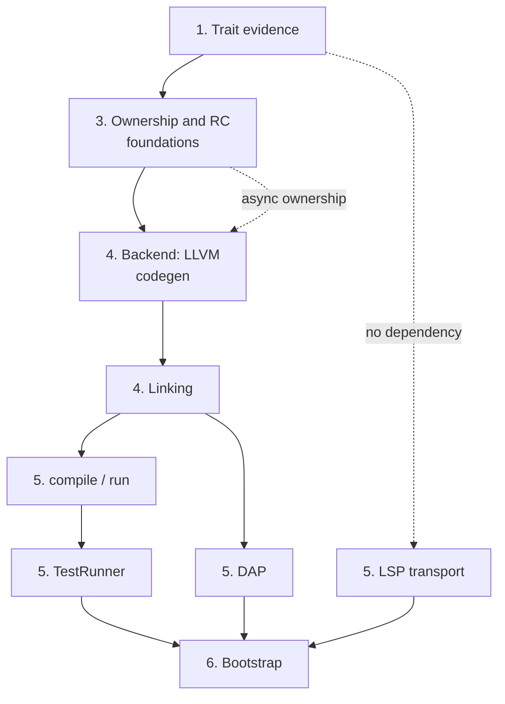

# Self-Hosting: Building the Ashes Compiler in Ashes

Status as of 2026-08-25. This document contains both the capability audit of what Ashes-the-language,
its compiler/runtime, and its standard library must provide before a compiler can be written in Ashes,
and the implementation handoff for the active self-hosted toolchain migration. See
[FUTURE_FEATURES.md](FUTURE_FEATURES.md) for how self-hosting fits the broader roadmap and the
[self-hosted toolchain README](https://github.com/MattiasHognas/Ashes/blob/main/selfhost/README.md)
for package boundaries and commands.

## Migration state

The new implementation lives entirely under `selfhost/`. It is pure Ashes: Python, shell, C#, and
Node.js helpers are not part of its implementation or test path. The existing .NET toolchain remains
in the repository permanently as a buildable, tested stage-0 and behavioral reference after the
self-hosted compiler becomes the default. The Node.js VS Code extension also remains in the repository,
and so does the .NET registry server (`src/Ashes.Registry`): it is a deployed service, not part of the
toolchain a user runs, so only its client commands are ported. Neither implementation may be removed or
changed merely to make the self-hosted port easier.

| Area | Ported surface | State |
|---|---|---|
| Frontend | Tokens, UTF-8 source spans, lexer, typed syntax model, leading import-header separation, inline-module lifting and validation, expressions, patterns, types, and whole-program parsing for all current declaration forms | Implemented and covered by pure-Ashes tests; token streams also have shared stage-0/self-hosted parity fixtures |
| Formatter | Canonical formatting for complete programs, declarations, expressions, patterns, and types, including precedence and idempotence coverage | Implemented and covered by pure-Ashes tests |
| Semantics foundations | Stable symbols/scopes, semantic types, substitution, unordered open-row unification, constrained schemes, and source type resolution | Implemented and covered by pure-Ashes tests |
| Expression/program inference | Core and structural expressions, operators, records, guarded matches, Result pipelines, `let?`, annotations, constructors, recursive groups, aliases, zero-cost types, sequential top-level inference, and package-aware inference of dependency-ordered stitched modules | Implemented for the listed surface |
| Capabilities | Declaration and operation schemes, effect propagation, handlers and `resume`, provider registration, exact concrete provider satisfaction, abstract requirement preservation, and provider/handler ambiguity rejection | Implemented for inference; lowering and code generation remain |
| Traits | Operator constraints; trait declaration/method registration; forward supertrait validation; cycle rejection; qualified method schemes; default-body type checking; ordinary implementation registration with rigid heads, requirements, optional defaults, and type-checked supplied methods; deterministic duplicate/structural-overlap rejection; package orphan ownership for traits and nominal head types; decreasing conditional requirements; selected-default dependency validation; canonical constraints with transitive supertrait elimination; written binding-requirement boundary validation; recursive concrete instance evidence resolution; canonical failure traces; deterministic hidden-dictionary ABI shape planning; ABI-ordered call-site evidence argument planning; constrained-function application/partial-capture planning; active evidence forwarding with deterministic supertrait paths; active trait-method slot planning; concrete dictionary-construction input planning with supplied/default method selection; dependency-aware selected-method construction order; evidence transport destinations for direct functions, closures, aggregates, and async frames; constrained-value rewriting with hidden parameters, dictionary destructuring, and unambiguous method binding; constrained-reference rewriting with exact or inherited active evidence; concrete dictionary-value rewriting with selected method bindings and nested supertrait values; the shipped standard trait ABI plus primitive/structural implementation heads bound to rewritten `Ashes.Trait` source bodies; and deterministic, declaration-aware `deriving` expansion for ordinary and zero-cost nominal types | Declaration, ordinary implementation, coherence, termination, default-cycle, constraint-canonicalization, written `requires` validation, evidence-plan resolution, structured resolution failures, dictionary ABI layouts, call-site evidence arguments, constrained-function application plans, recursive/sibling evidence-forwarding plans, active method-access plans, concrete construction inputs, selected-method build order, value-transport plans, constrained-value/reference rewriting, concrete dictionary-value rewriting, standard implementation evidence/source binding, syntax-level deriving expansion, and semantic deriving eligibility validation implemented; physical IR lowering remains |
| IR, optimizer, ownership, backend, linker | Complete IR model/text form plus core lowering for constants, lexical locals, calls, closures, captures, control flow, recursion, structural values and patterns, operators, BigInt literals, and the shipped non-async/non-FFI builtin operations; arena brackets, call windows, and lifetime placement over six byte-exact IR parity fixtures; a linux-x64 LLVM backend and pure-Ashes ELF linker producing real executables | In progress; trait-evidence/provider/async lowering, Perceus dup/drop emission, reuse, optimization levels, and the other three targets remain |
| CLI, LSP, DAP, TestRunner, fuzzing runner, registry commands | Package boundaries are defined; `fmt` and `init` are ported (see the checklist below) | Started |
| Bootstrap | No stage-1/stage-2 compiler build or equivalence comparison yet | Not started |

The current packages intentionally form the same strict dependency graph as the existing toolchain:
`frontend` has no compiler dependency, `formatter` depends only on `frontend`, and `semantics` depends
only on `frontend`. Do not move backend behavior into those packages. Future packages must follow the
dependency table in the
[self-hosted README](https://github.com/MattiasHognas/Ashes/blob/main/selfhost/README.md#package-dependency-graph)
and
must reference only the packages they actually consume.

### Planned work

Work should continue in dependency order. Each item below is a reviewable milestone or a short series
of milestones; split an item when its tests and public contract can stand alone. The six phases below
still hold at that granularity, but three keystone decisions gate the shape of everything under them —
naming them explicitly here keeps them from hiding inside a longer numbered item:

1. **Complete trait semantics.** Thread evidence through every value shape and lower dictionaries and
   method dispatch. Add `deriving` expansion only after ordinary evidence works end to end. The
   remaining gap is one architectural decision — call-site dictionary forwarding, under "Traits,
   implementations, and evidence" below — blocked on making `CoreLowering`'s own local type
   reconstruction constraint-aware, or merging it with the external inference pass into one
   type-variable space. Every other item in this phase (concrete dictionary construction, the standard
   trait ABI, `deriving`'s physical lowering, and the "supply evidence from a requirement's instantiated
   type, never trait name alone" item under "Optimization, ownership, and reuse", which is the same gap
   seen from the ownership side) is inert until one of those two paths lands. Verify generic capability
   evidence disambiguation (under "Capabilities and handlers") before writing any code for it —
   inference's own provider-ambiguity rejection may already make it unreachable in practice.
2. **Close whole-program semantic gaps.** Port import/module and export resolution, external declaration
   typing and ABI metadata, package/project stitching, remaining declaration namespace rules, exhaustive
   diagnostics, and any expression/type-inference behavior not yet represented by the focused tests.
   Compare observable results with the C# compiler rather than copying its internal object graph. This
   phase does not depend on phase 1 and is largely residue — small, self-contained items (resource
   move/borrow/consume rules, the registry/lock-file graph's network half, source-function origins
   through the future IR) that can close out alongside it rather than after it.
3. **Define and lower the complete IR.** Port the current IR model and text form, expression and
   declaration lowering, trait/capability evidence, async state machines, optimization passes, ownership
   and move analysis, Perceus lifetime placement, reuse, and compiler explanation/tooling metadata. Keep
   ownership inferred and retain the current no-GC memory contract. Internally this phase has its own
   hard order, under "Optimization, ownership, and reuse": heap layout classification (copy /
   RC-managed / resource / borrowed-view / region / unsupported — build the tagless single-constructor
   ADT layout against this classifier from the start, not bolted on afterward) comes before the
   ownership/move-analysis pass (parameter/capture ownership, freshness, reachability, borrows,
   forwarding, whole-program SCC provenance), which comes before Perceus duplication/drop insertion
   itself. Almost every other item in that section is a *port*, not new design — each already has a
   stage-0-proven fix, and several have a minimized repro or a written regression test from this
   project's own history. The highest-value single ports, each covering several crash shapes at once:
   retaining runtime-managed children in an escaping/owning aggregate (the class stage-0's #608 closed),
   releasing a pattern-bound value passed by name as a TCO back-edge argument (the class stage-0's
   fannkuch-redux investigation closed — 2.4 GB to a flat 8.2 MB), and supplying trait evidence from a
   requirement's instantiated type rather than by name (the class stage-0's #650 closed). Reuse
   (structural droppers, safe allocation reuse) and coroutine-frame/async ownership close out this
   phase; cross-mode validation and the `ownership`/`rc`/`reuse`/`memory` explain snapshots prove it
   held.
4. **Port native code generation and linking.** Implement LLVM emission, target ABI handling, runtime
   and bitcode selection, ELF/PE construction, external libraries/resources, debug information, and all
   four target RIDs. Start with the host target but preserve target-independent APIs from the outset.
   LLVM C API bindings and host `libLLVM` loading gate everything else under "LLVM code generation and
   runtime integration"; IR emission needs phase 3's ownership/RC shape settled, but not every one of
   its bug-class items fixed first. Under "Object parsing and executable linking", object parsing gates
   the four target layouts, which are then independent of each other — do linux-x64 first, since it
   unblocks every later phase that only needs one working target. The `musttail` upgrade item (under
   "Optimization, ownership, and reuse") is explicitly blocked on this phase existing; the
   scheduler/async runtime item needs phase 3's coroutine-frame ownership decided first.
5. **Port the toolchain consumers.** Build the Ashes CLI orchestration and registry commands, then the
   TestRunner, LSP, DAP, and deterministic fuzzing/fuzzyrunner packages. LSP and DAP remain consumers of
   compiler packages; they must not duplicate parsing, inference, lowering, or runtime behavior. `fmt`,
   the manifest commands (`init`/`add`/`remove`/`restore`/`tree`/`why`), and the LSP transport itself
   have no dependency on phase 4 at all — the formatter, `ProjectSupport`, and frontend/semantics are
   already done, so these can start as soon as there is time for them rather than waiting their turn.
   `compile`/`run`/`repl`, by contrast, need phase 4 finished end to end, and TestRunner needs `compile`
   and `run` before it can compile a single test. DAP needs phase 4's debug information and a real,
   linked executable to attach to. The full `.ash` corpus run through both toolchains, at the end of
   this phase, is the first honest parity signal for the whole port.
6. **Bootstrap and prove parity.** Produce a stage-1 compiler with the existing compiler, use stage 1 to
   build stage 2, compare deterministic compiler artifacts or normalized observable output, and run the
   same source/test corpus through both implementations. Add reproducible bootstrap and release jobs
   only after host-target parity is stable, then extend execution/structural validation to every RID.
   Grow the standing phase benchmark at every milestone along the way, not only here — it has already
   surfaced four real stage-0 memory bugs in one week of use, and a crashing corpus file it finds is a
   bug to record, not a file to quietly exclude.

### Current execution roadmap (compiler only)

The six phases above remain the dependency frame; this is the concrete, ordered work plan from
today's state to a complete self-hosted **compiler** — frontend, semantics, backend, linker, CLI,
and TestRunner through bootstrap. LSP, DAP, the registry client commands, and the fuzzing runner
are deliberately out of scope here; they follow the compiler and are tracked only by the checklist
below. Milestones are ordered by dependency, each one landable as its own short series of PRs, and
each closes with the standing gate: the affected test surface green, the phase benchmark run, and
no compile-time or RSS regression. Every checklist item below carries a stable ID
(**`SECTION-N`**, e.g. `OPT-25`); each milestone lists the IDs that gate it — a milestone is done
when those IDs are `[x]` (or their named "Open:" tail is closed, for a shared `[~]` item).

1. **Finish the file-system and process builtin surface.** Resource-typed handles in the
   self-hosted lowering first (the compiler-provided-handle classification and deterministic
   cleanup stage 0 already proves; it unblocks `File.open`/`readChunk`/`readLine`/`close` and the
   resource-alias diagnostics at once), then the File read family (landed:
   `readText`/`readAllBytes`/`mmap`/`writeBytes`/`makeExecutable` over the proven raw-syscall
   helpers), `Environment` (landed: all five members over libc imports), `Console` basics
   (landed: all four members), the real buffered-stdout ring with
   flush-on-exit (`writeBuffered`/`flush` currently write immediately — sound but unbatched), and
   `Process.*` (landed: all six members over raw `pipe2`/`fork`/`execve`/`wait4`/`kill`
   syscalls, with the entry-captured `__ashes_envp` and the linker's new `.bss` segment carrying
   the parent environment into children). `Process` is what lets the TestRunner spawn compiled
   tests at all.
   Gates: SEM-14, LNK-4 (its "Open:" tail), and the files/environment/process/console/
   buffered-stdout slice of CG-11.
2. **Memory-model correctness.** The backend's RC/arena stand-ins deliberately leak today; this
   milestone retires that debt in phase 3's own internal order: complete heap-layout
   classification, then ownership/move analysis, then Perceus duplication/drop insertion (leading
   with the three named highest-value bug-class ports), then real scoped arenas in place of the
   `malloc` stand-ins, reuse, `--debug-disable-reuse` parity, and the four explain snapshots.
   Gate hard on the challenge benchmarks: this is where compile-time and RSS regressions would
   first appear.
   Gates: OPT-22..OPT-27, OPT-29, OPT-30, OPT-32..OPT-36, OPT-38..OPT-42, OPT-44..OPT-51,
   CG-6, CG-10, CG-16, SEM-18, SEM-19, PKG-8, and CG-4's arena/drop tail.
3. **Trait and capability physical lowering.** The one keystone decision — call-site dictionary
   forwarding via constraint-aware local type reconstruction, or a merged type-variable space —
   then dictionary construction/dispatch lowering, the standard trait ABI, `deriving`'s physical
   lowering, and capability handler/provider/static-provider dictionary lowering (which also
   unblocks the remaining provider diagnostics). Independent enough of milestone 2 that the
   keystone decision can be made in parallel; the physical lowering itself wants milestone 2's
   ownership shape settled.
   Gates: TRT-13..TRT-15, CAP-7, CAP-8, SEM-15, OPT-28, and IR-8's trait/provider tail.
4. **The async/Task arc.** Coroutine-frame ownership (decided in milestone 2), the
   `StateMachineTransform` port completion, and the run-queue scheduler/task runtime codegen —
   the single largest remaining corpus block (~65 test files).
   Gates: OPT-43, CG-12.
5. **Optimizer and performance parity.** Optimization-level selection (`-O0`..`-O3`), the
   remaining `IrOptimizer` passes, and the mutual-recursion merge widening, benchmarked against
   stage 0 on the standing phase benchmark and the challenge programs.
   Gates: OPT-13, OPT-19, OPT-20, and CG-3's optimization-level tail.
6. **Net and vendored bitcode.** Sockets/TLS/HTTP builtins, Mbed TLS/openlibm/PCRE2 bitcode
   selection and linking, `Ashes.Number.Math` transcendentals, BigInt, and Regex — the remaining
   builtin families, all behind the same declare-per-module/import-whitelist mechanism already in
   place.
   Gates: CG-13 and the net/clock/entropy/regex/math/BigInt slice of CG-11.
7. **TestRunner port and full-corpus parity.** Discovery, the directive surface, isolation,
   timeouts, and reporting (needs milestone 1's `Process` and File surface), then the full
   `tests/` corpus and `examples/` run through BOTH toolchains with every difference classified —
   the first honest parity signal for the whole port.
   Gates: TR-1..TR-6.
8. **CLI completion.** `compile`/`run` option parity (`--target`, `-O`, `--debug`, `--emit-ir`,
   `--explain`, `--project` compile), the `test` command over the ported TestRunner, `install`,
   and the stateful `repl`.
   Gates: CLI-4, CLI-9, and the "Open:" tails of CLI-1..CLI-3.
9. **Targets beyond linux-x64 and debug information.** Object-parsing generalization, then the
   three remaining image layouts in the documented order (linux-arm64 ELF, win-x64 PE with the
   Windows runtime builtins, win-arm64 PE structurally), plus DWARF debug information — kept in
   the compiler scope even though its main consumer (DAP) is out of scope here.
   Gates: LNK-1, LNK-7..LNK-13, CG-2, CG-8, CG-9, CG-14, CG-15.
   **Organizing rule, decided up front so the first port does not set the wrong precedent.** The
   platform surface is three axes, not one, and each takes a different treatment. *Image format*
   (ELF/PE) and the relocation/trampoline work under it is genuinely different code: separate
   modules, as stage 0 already does (`LlvmImageLinkerElf`/`…ElfArm64`/`…Pe`/`…PeArm64`);
   `ElfLinker.ash` gains siblings rather than branches. *Architecture* (x64/arm64) changes syscall
   numbers and asm constraints but not the emitters: a resolver seam, the shape of stage 0's
   `ResolveSyscallNr` + `EmitSyscallArm64`/`EmitSyscallX86`, so the ~120 call sites pay nothing —
   the linux-x64 wrappers are already isolated in `IrCodegen.Syscalls.LinuxX64.ash` for exactly
   this. *OS* (raw syscall vs Win32 import) is the one to get right: most builtin emitters share
   their whole algorithm across platforms (`emitFileReadText`'s open/measure/allocate/read-loop/
   validate/close is identical on Windows) and differ only in primitives, so thread a record of
   those primitives through them — the way `DirectoryExternals` already threads libc handles —
   and do NOT duplicate the emitter per target. Stage 0 took the inline-branch route here and pays
   for it: ~110 `IsLinuxFlavor`/`IsWindowsFlavor` branches across twelve files, with 99
   `EmitLinux*`/`EmitWindows*` references inside `LlvmCodegenBuiltins.File.cs` alone. Split by file
   only where the ALGORITHM diverges, not merely the primitives — `Directory.entries`' `readdir`
   stream versus `FindFirstFile` iteration is the standing example, and stage 0 splits there too
   (`LlvmCodegenBuiltins.Directory.Windows.cs`). Name such a file subject-first, platform-last
   (`IrCodegen.Filesystem.Windows.ash`) so a subject's slices sort together. The primitives record
   itself is deliberately NOT built ahead of the first Windows emitter: its shape should be derived
   from a real second implementation, and converting the direct calls to it is a mechanical rename
   the existing fixtures verify.
10. **Bootstrap and retirement.** Stage 1 (built by stage 0) builds stage 2; compare deterministic
    artifacts or normalized output; compile and run the compiler, standard library, examples, and
    corpus with the bootstrapped compiler; wire the reproducible bootstrap/packaging jobs; and
    only then retire the .NET toolchain from the default path.
    Gates: BOOT-1..BOOT-4, BOOT-6..BOOT-11, and BOOT-5's compiler/CLI/TestRunner bundles (its
    LSP/DAP/fuzzing bundles belong to the out-of-scope tracks).

Continuous residue alongside every milestone, not a milestone of its own: the remaining
diagnostics and namespace/inference gap items (SEM-17), cross-implementation parity fixtures as
phases stabilize (PKG-6), the registry/lock tail of MOD-7 and stitching-origins tail of MOD-8,
and the phase benchmark after every landed slice (BOOT-8).

### Toolchain implementation checklist

This is the authoritative feature inventory for the self-hosted toolchain. It tracks observable
compiler and tool behavior, not the presence of similarly named data types. The status markers are:

- `[x]` — implemented in pure Ashes and covered by an executable pure-Ashes test;
- `[~]` — a useful part is implemented, but the current compiler's complete observable contract is
  not yet covered;
- `[ ]` — not implemented in the self-hosted toolchain.

The checklist covers the currently shipped toolchain. Features explicitly listed as unsupported or
future work in the language reference are not self-hosting requirements until they become part of the
shipped language. The existing C#, .NET, and Node.js implementations remain the compatibility oracle;
their internal class boundaries are not requirements when a smaller pure-Ashes design preserves the
same public behavior.

#### Package and test foundations

- [x] **PKG-1** Define pure-Ashes `frontend`, `formatter`, and `semantics` packages with the required dependency
  direction and no host-language implementation helpers.
- [x] **PKG-2** Keep package tests in separate `devDependency` projects and compile them into standalone native
  executables.
- [x] **PKG-3** Exercise frontend, formatter, and semantics tests with reuse enabled and with
  `--debug-disable-reuse`.
- [x] **PKG-4** Supply the language, standard-library, host-environment, filesystem, process, byte-buffer, JSON,
  regex, and installed-layout capabilities identified by the prerequisite audit below.
- [x] **PKG-5** Document every production module's responsibility and load-bearing invariants, preserving
  behaviorally relevant stage-0 contracts without copying host-language API boilerplate.
- [~] **PKG-6** Add cross-implementation parity fixtures as each self-hosted phase gains a stable serialized
  public result. Versioned token-stream fixtures now compare every public token field between stage 0
  and the pure-Ashes lexer; syntax, formatted source, diagnostics, inferred schemes, IR, and executable
  parity formats remain.
- [x] **PKG-7** Make every self-hosted package buildable from a restored source-only dependency graph without
  undeclared checkout-relative inputs.
- [x] **PKG-8** Run the three script-style project test files (`ProjectDiscoveryTests.ash`,
  `ProjectSourceEnumerationTests.ash`, `ProjectCompilationPlanningTests.ash` under
  `selfhost/tests/semantics/`) from a suite: they are trailing-expression scripts that no runner
  invokes today, so their assertions have not been executed since they were written. Wire them
  into the projects suite (or a runner of their own if they need the repository layout), fix
  whatever has rotted, and keep them in the standing gate.
  Done: the three files now live in `selfhost/tests/projects/`, export their `run...Tests`
  entry, and run first in that suite's `Main.ash` ahead of the dependency-graph and lock-file
  groups, with a pass line of their own. They build their fixtures under the process's
  temporary directory and remove them afterwards, so they need no repository layout. Nothing
  had rotted: every assertion passes as written against the current discovery, enumeration,
  and planning modules.

#### Frontend and source model

- [x] **FE-1** Model tokens, structured diagnostics, and canonical UTF-8 byte spans.
- [x] **FE-2** Lex identifiers, keywords, operators, comments, whitespace, strings, runes, signed and unsigned
  integers, floats, and malformed input, including Unicode scalar validation.
- [x] **FE-3** Model the complete typed syntax surface for programs, declarations, expressions, patterns, and
  type expressions without collapsing those categories.
- [x] **FE-4** Parse literals, variables, qualified references, calls, tuples, lists, records, record updates,
  unary/binary operators, pipes, and their precedence and associativity.
- [x] **FE-5** Parse lambdas, conditionals, nested and recursive bindings, `let?`, `let!`, matches, guards,
  handlers, `perform`, and every current pattern form.
- [x] **FE-6** Parse named, applied, tuple, function, pointer, capability-row, annotated, and constrained type
  syntax.
- [x] **FE-7** Parse exports, aliases, algebraic/record/zero-cost types, flat top-level bindings, recursive
  groups, and optional trailing expressions after the project layer has separated any import header.
- [x] **FE-8** Parse external functions and types, ownership annotations, resources and destructors, native
  strings, pointers, buffers, out parameters, capability rows, and `symbol@library` aliases.
- [x] **FE-9** Parse capability declarations, static providers, trait declarations, implementations,
  supertraits, requirements, defaults, and deriving clauses.
- [x] **FE-10** Preserve source-ordered recovery diagnostics and the current declaration-boundary behavior for
  incomplete editor input and project-stitched programs.
- [x] **FE-11** Compare the complete frontend diagnostic corpus with the C# frontend by diagnostic code, span,
  ordering, and recovery result (the versioned `ashes-diagnostic-v1` parity format under
  `parity/frontend/diagnostics`, checked from both stage 0 and
  `selfhost/tests/frontend-diagnostic-parity`). Porting surfaced and fixed: unsigned-literal
  overflow picking the wrong diagnostic, an unmatched closing bracket permanently disabling
  declaration-boundary detection, three divergent end-of-input wordings unified behind one shared
  check, a refutable-let-pattern span read after its arena scope was reclaimed, and a spurious
  `ASH003` code on the constructor-less-type diagnostic.

#### Formatter

- [x] **FMT-1** Canonically format every expression, pattern, and type form while preserving precedence.
- [x] **FMT-2** Canonically format complete programs and every top-level declaration form.
- [x] **FMT-3** Preserve intentional source spellings where the formatter contract requires them and sort only
  semantically unordered surfaces such as requirement sets.
- [x] **FMT-4** Cover golden output, parse-format-parse behavior, and formatter idempotence.
- [x] **FMT-5** Preserve written import headers and leading/standalone comments around the formatted AST body
  (`formatSource`): the leading comment block kept verbatim, imports re-rendered canonically,
  standalone comments reinserted at their whitespace-insensitive token-signature anchors (next
  anchor, then previous, then top of file — no comment text is ever dropped).
- [x] **FMT-6** Apply formatter options for indentation/newlines (`FormattingOptions`, applied as a
  post-processing rescale over the fixed-4-space internal output) and the opt-in pipeline-layout
  collection (`x |> f |> g` from a nested call chain, all-or-nothing, stopping at a capitalized
  constructor once an outer stage exists). Porting found and fixed a pre-existing stage-0
  double-newline-conversion bug (`\r\r\n`) and a stage-order reversal in the first selfhost port.
- [x] **FMT-7** Keep the parentheses around a record update used as a record-literal field value (and in
  multiline call arguments and list elements) whenever another sibling follows — dropping them
  makes the update absorb the following fields, so the formatted file no longer parses the same.
  The rule is written into the formatter reference; covered by `selfhost/tests/formatter/Main.ash`.
- [x] **FMT-8** Compare the full formatter corpus and malformed-input behavior with the C# formatter. The
  whole-file pass found one crash — a nested `let name param = ...` binding's sugar-parameter list
  clobbered by arena reuse one call after parsing, fixed by deep-copying the built value before
  span construction in `parserParseTopLevelBinding` — and a boundary-splitter gate (a declaration
  value is no longer cut at an indented `then`/`else`/`in`/pipe line after a completed call).

#### Semantic foundations and ordinary inference

- [x] **SEM-1** Model stable symbols, qualified identities, immutable lexical scopes, and deterministic fresh
  type variables.
- [x] **SEM-2** Model semantic primitive, unsigned, function, tuple, list, pointer, named, capability, and open-row
  types.
- [x] **SEM-3** Compute free variables, substitutions, occurs checks, structural unification, generalization,
  instantiation, and constrained rank-1 schemes.
- [x] **SEM-4** Unify capability rows independently of declaration order and allow open tails to absorb unmatched
  capabilities.
- [x] **SEM-5** Resolve source primitives, parameters, functions, tuples, pointers, aliases, nominal types,
  zero-cost types, and capability rows.
- [x] **SEM-6** Infer literals, variables, lambdas, calls, tuples, lists, conditionals, ordinary lets, recursive
  lets, and annotations with let-polymorphism.
- [x] **SEM-7** Infer all operator families while retaining their trait constraints.
- [x] **SEM-8** Infer matches, guards, literal/list/tuple/constructor/record/as/or patterns, and consistent
  pattern-local bindings.
- [x] **SEM-9** Register algebraic, record, alias, and zero-cost declarations; infer constructors, constructor
  patterns, record literals, and record updates.
- [x] **SEM-10** Infer `Result` map/flat-map/error-map pipelines and `let?` propagation.
- [x] **SEM-11** Infer sequential top-level bindings, shared-monomorphic recursive groups, and an optional trailing
  expression.
- [x] **SEM-12** Infer async bodies, `await`, `let!`, task result/error propagation, and structured task APIs:
  the standard `Task(e, a)` type is seeded next to `Maybe`/`Result`, `await task` types as the
  `Result(e, a)` the task runs to (`ExpectedTaskType` otherwise), and `let!` exposes that `Result`
  to the ordinary propagation rules; lowering `await` belongs to core lowering.
- [x] **SEM-13** Perform complete match exhaustiveness, redundancy, large-ADT hardening, and source-compatible
  diagnostic reporting (`matchCoverageError`, stage 0's message text; also enforced during
  single-file lowering via `checkCoreMatchCoverage`, so the `tests/pattern_*` diagnostics fail
  through the self-hosted CLI with stage 0's wording). Porting found the parser had no column rule
  for match/handler arm attachment — a nested match silently swallowed the enclosing match's
  remaining arms; `parserLeadingPipeColumn` now ends an arm list at any `|` dedented past the
  first arm's column, as stage 0 does.
- [x] **SEM-14** Enforce resource move/borrow/consume rules, deterministic cleanup constraints, and use-after-move
  diagnostics at the semantic boundary. In `CoreLowering.ash`, every owned `let` or pattern
  binding whose resolved type is a resource — the compiler-provided `FileHandle` and `Process`,
  or a declared `external type T resource destructor f` by its opaque name — is live, closed, or
  moved. Closed: an explicit `File.close`, or a `consume` argument of the resource's own
  destructor (closing a moved or closed binding is reported: moved-close, double close). Moved:
  stored into a constructor, tuple, list, or cons cell; passed to a consuming callee (a let-bound
  lambda borrows a parameter only when stage 0's `isParamUsedOnlyAsBorrowRead` proves it reads
  it, any other callee and any non-destructor `consume` external consumes; a `borrow` external
  only reads); captured by a closure; or returned as its arm's result. A resource builtin or
  external reading a released binding reports stage 0's use-after-close/use-after-move messages,
  and a live binding gets stage 0's `CleanupResource` at its `let` or arm exit — naming the
  destructor ABI for a declared resource — which the backend lowers to `close` for a handle and
  pipe-close plus reap for a process (the destructor call itself is CG-8's). Residue tracked
  elsewhere: sockets join the resource names with milestone 6's net builtins; the recursive
  cleanup of a resource-bearing aggregate and the dropper of a resource-capturing closure are
  OPT-25's; the cleanup a tail self-call must run before its back edge is OPT-25's TCO tail
  (today the arm's cleanup follows the call, which keeps that call an ordinary call rather than
  a fused tail call).
- [~] **SEM-15** Seed the shipped standard trait/type identities and primitive/structural implementation heads so
  ordinary evidence resolution no longer depends only on focused test declarations. The remaining
  builtin and standard-library value/type environment must be populated through module stitching.
- [x] **SEM-16** Validate every written binding `requires` clause against the inferred canonical external
  requirement set, including recursive groups and ambiguity checks.
- [~] **SEM-17** Port the remaining declaration namespace, duplicate-name, shadowing, annotation, and inference
  diagnostics with stable codes and source spans. Done: `ASH013` (duplicate top-level binding) and
  `ASH014` (forward reference and non-`recursive` self-reference, kept distinct from
  genuinely-unknown names). `ASH016` was never missing — import-resolution collision checking
  already covers it. `ASH015` has no stage-0 reference implementation at all — nothing to port
  until stage 0 implements it.
- [x] **SEM-18** Resolve a polymorphic `==` the way stage 0 does when the operands' type is still a
  variable at the comparison. `tests/runtime_rc_tco_nested_tuple_pattern_alias.ash` is rejected by
  the self-hosted lowering with a `String`/`Int` mismatch (`CoreCallTypeMismatch`) where stage 0
  accepts the program: the comparison's operand type is defaulted before the pattern alias that
  pins it is seen. Establish which side stage 0 takes (the deferred operator default sealed at
  finalization against the finished substitution), mirror it, and register the fixture in the
  loop sweep. The trait-evidence lowering of `==` on a derived type stays under TRT-15.
  Done: stage 0 maps such a comparison to the `Eq` trait, emits a placeholder when the operand
  is still a variable, and lowers the binding again with a late type hint once the body has pinned
  it, so the fixture's `lit == ch` becomes a `CmpStrEq`. The self-hosted lowering now takes the
  path its deferred `+` already took: two unresolved operands are unified with each other, an
  integer comparison is emitted speculatively and recorded under its target temp, and the shared
  variable joins the body's unresolved call results, so a body that pins it later is lowered a
  second time against the resolved type. The finalization rewrite covers the still-speculative
  survivors (a lambda pinned by the enclosing program): `CmpStrEq`/`CmpStrNe`, the float forms,
  and the BigInt compare expansion, which takes two fresh temps past the function's count. A
  variable no body pins seals to the integer comparison, as `+` seals to `AddInt`, until TRT-15's
  dictionaries. Both fixtures (`runtime_rc_tco_nested_tuple_pattern_alias`,
  `runtime_rc_whole_string_pattern_recursion`) compile and match stage 0 in the loop sweep.
- [x] **SEM-19** Report an argument type mismatch once per call. Stage 0 reports the same mismatch
  three times at the call span on an ordinary call (the expected-type unification in `LowerExpr`
  plus the contextual unification) and twice on a tail self-call; the self-hosted lowering rejects
  the same programs through `ensureFunctionType` binding the open return to a fresh arrow and
  reports a location-less `CoreCallTypeMismatch`. Dedupe stage 0's diagnostics at the call span,
  give the self-hosted mismatch the call's span, and pin both in the diagnostic parity fixtures.
  Done: stage 0's call site owns the report. A `LoweredValueRequest` whose expected type is
  caller-reported (`WithCallerReportedExpectedType`: a call argument's parameter type, a list
  literal's element type) makes the expected-type unification in `LowerExpr`, the call result
  pre-constraint, and the result unification in `LowerCallFinish` silent
  (`SuppressUnificationDiagnostics`), the literal pre-constraint is always silent, and the tail
  self-call's contextual unification reports at the call span like the ordinary path, so an
  ordinary call, a tail self-call, a call-shaped argument (one report per call), and a list-literal
  argument (one `ASH005`) each report a mismatch exactly once. The self-hosted `CoreCallTypeMismatch`
  carries a `CoreMismatchSite`: every unification failure takes the innermost enclosing span and
  its resolved location (stage 0's span stack), and a call argument's failure takes the call's
  span plus the argument's ordinal and the callee's display name, attached by the ordinary and tail
  self-call argument bindings and by the argument request the expected type travels under
  (`ConsumerRequest.argumentSite`, so a nested call's result pre-constraint and the unforwarded
  expected-type unification report the outer argument, as stage 0's silenced unifications leave
  the outer call site to). `LoweringDiagnostics.ash` renders it as stage 0's `ASH002` text with
  stage 0's type spelling (`List<Int>`, shared `a`, `b` variable names) and the CLI prints
  `path:line:col ASH002 message`. Porting the tail self-call fixture surfaced a typing gap fixed
  on the way: a recursive member's first parameter annotation was dropped (`lambdaParts` kept no
  annotation) and its body was lowered without the member's result type as the expected type, so
  a self-call met fresh arrows instead of the annotated parameter types and the mismatch surfaced
  at the outer call; the annotation now binds before the body and the body request carries the
  result type (`withRecursiveBodyRequest`), as stage 0's lambda-chain lowering does. The new
  `selfhost/parity/semantics/diagnostics` fixtures pin both calls in the `ashes-diagnostic-v1`
  format, checked by `SelfhostSemanticDiagnosticParityTests` and the
  `selfhost/tests/semantics-diagnostic-parity` suite. Not ported: stage 0's enclosing contexts
  (`-> in if branches`) and the excerpt lines under a diagnostic.

#### Capabilities and handlers

- [x] **CAP-1** Register capability declarations and parameter-sharing operation schemes.
- [x] **CAP-2** Propagate ambient effects through implicit/explicit operations, lambdas, ordinary and
  higher-order calls, partial application, and `Result` pipelines.
- [x] **CAP-3** Infer handler operation arms, shared instances, `resume`, return arms, arm effects, and residual
  row discharge.
- [x] **CAP-4** Register complete, coherent, instance-specialized static providers and type-check their operation
  implementations.
- [x] **CAP-5** Satisfy exact concrete capability requirements from providers while retaining abstract
  requirements and rejecting provider/handler ambiguity.
- [x] **CAP-6** Lower dynamic handler evidence, one-shot continuation state, pre/post handler control flow, and
  dynamically scoped handler globals into IR — the mechanism is described under the
  "Lower capability handlers/providers and trait evidence" entry in "IR model and lowering".
- [~] **CAP-7** Lower static-provider dictionaries and generic capability evidence into IR. Done:
  static-provider dictionary calls (`emitStaticProviderCall`), and `findStaticProvider` matching
  on capability name AND resolved type arguments (name-only matching cannot distinguish
  `provide Log(Int)` from `provide Log(Str)`; given no required arguments it matches by name only
  when every candidate agrees, reporting ambiguity otherwise). Open: the whole-program wiring —
  `CoreStaticProviderLayout` is constructed nowhere outside test fixtures, since
  `TypeEnvironment` carries no operation implementation `Expr`s (needs a `ProviderDecl` AST walk),
  and deriving a call site's required type arguments is nontrivial when the capability parameter
  appears only in return position (`get : Unit -> a`).
- [ ] **CAP-8** Validate capability explanations and observable behavior against normal, optimization-disabled,
  and reuse-disabled C# compilation.
- [ ] **CAP-9** Type a static-provider operation call from the operation's declared signature.
  `lowerPerform`'s static-provider branch still hands `emitStaticProviderCall` a `Unit` result
  type, so a provider-backed operation whose result is used as anything but `Unit` fails with a
  type mismatch; the dynamic perform branch was fixed on 2026-09-07 (`performResultType`
  instantiates the scheme `registerTopLevelCapabilityDeclaration` records and unifies it with the
  argument types), and the provider branch should share that helper once CAP-7's whole-program
  provider wiring exists.
- [ ] **CAP-10** Give a handler arm closure stage 0's argument normalization and returns-bit
  epilogue. Stage 0's `LowerHandleLowerArmClosures` emits the arm closure with
  `AcceptsRuntimeManagedArgument`, normalizes the operation argument at entry
  (`rc_arg_normalize_*`), and copies the result out on the returns bit (`rc_result_owned_*`);
  the self-hosted `installOperationArmClosures` lowers the arm body as a plain match under a
  live-posts guard with neither, so `tests/consumed_argument_through_handler.ash` peaks at
  60.7 MB through the self-hosted compiler against 28.7 MB through stage 0. OPT-49a's mirror
  (the perform site adopting the arm's reference-counted result) needs the returns bit first.

#### Traits, implementations, and evidence

- [x] **TRT-1** Infer operator constraints and retain them in generalized schemes.
- [x] **TRT-2** Register trait declarations, qualified method schemes, forward supertraits, acyclic supertrait
  graphs, and type-checked default bodies.
- [x] **TRT-3** Register ordinary `implement` declarations with resolved rigid heads, requirements, supplied
  methods, and inherited defaults.
- [x] **TRT-4** Validate implementation trait/arity, method uniqueness and completeness, substituted method
  signatures, capability rows, and requirement variables.
- [x] **TRT-5** Reject exact duplicate and structurally overlapping implementation heads independently of source
  or traversal order.
- [x] **TRT-6** Track package provenance for traits and nominal head types and enforce the orphan ownership rule.
- [x] **TRT-7** Validate decreasing conditional requirements for generic implementation heads while allowing
  fixed requirements on fully concrete heads.
- [x] **TRT-8** Reject dependency cycles among the defaults selected by an implementation while allowing a
  supplied method override to break the cycle.
- [x] **TRT-9** Canonicalize constraints, remove exact duplicates, and remove supertraits implied by stronger
  constraints.
- [x] **TRT-10** Validate written binding `requires` clauses against inferred canonical constraints, including
  nested lets, recursive groups, invalid trait heads, and ambiguous requirement variables.
- [x] **TRT-11** Resolve unique concrete instances recursively with cycle/depth guards while preserving abstract
  constraints as hidden dictionary parameters.
- [x] **TRT-12** Diagnose missing, ambiguous, incoherent, non-terminating, and ambiguous-type-variable goals with
  canonical requirement traces.
- [~] **TRT-13** Plan hidden trait dictionary parameters, method fields, specialized direct-supertrait fields,
  call-site evidence arguments in deterministic ABI order, constrained-partial-application evidence
  capture, exact and inherited active-dictionary forwarding across recursive and sibling call
  edges, ABI-ordered supplied/default method fields with dependency-aware build order, dictionary
  transport destinations (direct parameters, closure captures, nested aggregates, async frames),
  and constrained value/reference rewriting; physically thread dictionaries through the lowered
  representations. Done: every planning layer above, plus the first real lowering wiring —
  `lowerCoreProgramWithEnvironment` elaborates a plain constrained top-level `let`'s value against
  genuine `inferProgram` output; the sole-active-parameter inherited-forwarding fallback (stage
  0's `FindActiveTraitDictionaryParameter` semantics — raw scheme constraints from two bindings
  never share a type-variable id, so exact stable-key matching alone can never fire); and
  call-site forwarding as a pure pre-lowering AST rewrite, gated on the call argument being
  syntactically one of the caller's own outermost lambda parameters (sound via HM unification —
  an unguarded trait-name-only match forwarded the WRONG evidence for an unrelated concrete call,
  proven by IR dump). Open: recursive-binding value elaboration, concrete/global call-site
  resolution for an unconstrained caller, and the phase plan's keystone — constraint-aware local
  type reconstruction in `CoreLowering.ash`, or one merged type-variable space with inference
  (the local reconstruction and the external environment share no variable space; merging their
  outputs into one scheme produced an infinite substitution cycle).- [~] Rewrite concrete dictionary construction into dependency-ordered selected method bindings,
  ABI-ordered fields, and recursively constructed inherited evidence. Lower those values, default
  dispatch, method selection, and safe concrete specialization into IR without changing unoptimized
  behavior.
- [~] **TRT-14** Register the shipped standard trait ABI and primitive/structural implementation heads, including
  recursive evidence requirements and stable compiler-private implementation references. The stitching
  phase now binds those references to rewritten `Ashes.Trait` source bodies by alpha-normalized
  implementation-head structure; physical dictionary lowering remains.
- [~] **TRT-15** Expand `deriving {Eq, Ord, Show, Hash}` into ordinary implementations before coherence checking.
  Ordinary and zero-cost nominal declarations now expand in written order, retain only payload-relevant
  type-parameter requirements, generate deterministic method bodies, and participate in ordinary
  coherence and evidence resolution. Function, pointer, task, unbound-variable, and non-regular
  recursive fields are rejected. A stitched-program declaration context also rejects builtin and
  declared resources, opaque external types, capabilities, and transparent aliases to unsupported
  fields independently of declaration or module order. Physical dictionary and method lowering remains;
  until it lands, the selfhost rejects `==` on a list of a `deriving {Eq}` record
  (`tests/reuse_specialization_declines_unreachable_helper.ash`, `CoreOperatorTypeMismatch` on
  `List(Live)`), the one shared fixture that needs a derived implementation at run time.
- [x] **TRT-16** Stage 0: compile a concrete instance's implementation lambdas once instead of
  rebuilding them at every use. Every `==`, `show`, `compare`, or `hash` on a derived type
  rewrote the whole nested dictionary value at the call site, closures for each method of each
  nested type included, so the emitted program grew linearly with the number of uses of a large
  derived type rather than with the number of types: a three-level derived type cost about 660
  functions, 19,000 IR lines, and 1 MB of binary per use, and the self-hosted semantics test
  program (`selfhost/tests/semantics`) was 79,348 functions and 4.06 million IR lines, of which
  78,713 functions were copies of another function after masking numbers; 1.2 million lines
  carried `Ashes.Trait` source locations and another 1.4 million the derived instances of
  `Types.ash` and `Token.ash`. Its stage-0 compile had gone from 36 s at `--debug` and about
  100 s at the default level on 2026-08-26 to 4.5 min and 10.6 min on 2026-09-07 (212 MB and 53
  MB binaries, 14 GB peak resident set), while the source grew 1.8x.
  Done (2026-09-07): `BuildTraitImplementationMethod` offers the implementation lambda it lowers
  for sharing under the goal's stable key, the method, and the construction context (the
  enclosing instances' self-ties, the hidden dictionary parameters active at the site, and the
  coroutine placement), and `LowerLambdaCore` reuses the recorded function when a later
  construction in the same context computes the same captures, emitting only the environment and
  the closure object; the self-tie ordinal is assigned once per goal and method so every
  construction binds the same tie name. Only fully concrete plans share. The repro's four
  `==`/`show` sites went from 2,654 functions to 193; the semantics test program to 19,619
  functions and 1.35 million IR lines, its default-level compile to 5.5 min, 13 MB, 7.7 GB.
  Three more stage-0 levers followed in the same change: the lifetime placement's alias-store
  scan indexed by slot (5.5 to 4.0 min), hover-type recording skipped outside the language
  server and resolved layout types memoized (4.0 to 3.4 min), and parallel code generation over
  partitions of the program module merged into one relocatable object (3.4 to 1.9 min; see
  [Parallel code generation](../internals/architecture.md#parallel-code-generation)). Compile
  phases are reported under `ASHES_TIMING`. Stage 1: the self-hosted trait lowering (TRT-13 to
  TRT-15) must build dictionaries over shared implementation functions from the start, never the
  per-use form; the other levers are tracked as OPT-53, CG-17, and CLI-11. Track the stage-0
  compile time and peak resident set of the self-hosted packages in the phase benchmark
  (BOOT-8) so the next drift is caught at a milestone close.

#### Modules, projects, externals, and whole-program semantics

- [x] **MOD-1** Separate and validate leading import headers while preserving their written forms, aliases,
  selectors, source lines, and imports-stripped UTF-8 body offsets for formatting and diagnostics;
  retain uppercase-final paths for the resolver to disambiguate as modules or type selectors.
- [x] **MOD-2** Resolve whole-module, aliased, value-selector, and type-selector imports using typed module
  interfaces, longest-module-path ambiguity rules, export validation, and post-resolution collision
  checks. Map module names to source paths and select project, include, dependency, or shipped-library
  sources with ambiguity and reserved-namespace checks. Construct deterministic reachable-module plans
  in dependency-first order, reject cycles, and enumerate filesystem-backed sources deterministically.
- [x] **MOD-3** Validate explicit exports and build value/type/constructor/submodule interfaces from parsed
  programs without exporting externals, trailing bodies, private declarations, or imported modules
  implicitly.
- [x] **MOD-4** Enforce sequential visibility, qualification, reserved namespaces, module cycles, and stable
  compiler-private names across stitched modules. Dependency planning, cycle rejection, and
  dependency-ordered semantic scopes assign deterministic definition identities, record ordinary
  versus recursive visibility boundaries, realize resolved selectors and whole-module imports, validate
  full/short qualifiers and collisions, and assign stable public and compiler-private names. Syntax-tree
  rewriting preserves lexical shadows and source spans while replacing declaration, value, constructor,
  type, trait, and capability references with those compiler names.
- [x] **MOD-5** Parse and validate typed `ashes.json` manifests, including entry extensions, package versions,
  defaults, source roots, includes, output settings, registry/path dependencies, dev dependencies,
  root-level local `overrides`, and forward-compatible unknown fields. Filesystem path resolution and
  entry existence checks belong to project discovery.
- [x] **MOD-6** Discover projects upward, honor explicit project selection, load manifests, resolve project
  paths, validate entry existence, and deterministically plan reachable modules from source-only
  packages.
- [~] **MOD-7** Resolve path and registry package graphs, lock files, package identities, one-version-per-package
  coherence, and program-global providers/implementations. Recursive path dependency resolution,
  dev-dependency propagation, cycle and namespace validation, diamond deduplication, and compilation
  planning across dependency source roots are complete. The typed versioned lock-file model, strict
  parser, selected-manifest lock-path mapping, content-addressed cache-path mapping, consumption of
  restored locked packages as validated dependency source roots, and root-only local override
  substitution with exact locked namespace/version checks are also complete; dependency-declared
  overrides are ignored. Registry resolution, cache materialization, and hash verification remain.
  Stitched-project inference now accumulates providers and implementations in one program-global
  environment.
- [~] **MOD-8** Stitch the complete project while preserving original file/module spans, definition identities,
  package provenance, and source-function origins. Semantic definition plans now retain source spans,
  source paths, module names, package identities, qualified names, and compiler names; rewritten module
  syntax retains its `At` spans. Rewritten modules are now combined in dependency order, compile-time
  exports and non-entry bodies are removed, the single entry body is retained, and half-open module
  regions plus definition-to-item placements preserve deterministic source/package provenance.
  The combined declarations are inferred in that same order while switching package ownership at every
  module boundary; deriving output stays module-local while eligibility validation shares the stitched
  declaration context, trait orphan checks retain package identity, and implementation coherence is
  program-global. An unqualified name two whole-module imports both export is rejected only where
  the module uses it unqualified (stage 0's referenced-name rule: `import Ashes.Collection.List as
  list` beside `import Ashes.Text as text` is routine, and both export `length`); an unused
  collision keeps the first import's binding, and a local top-level definition of the name shadows
  every import. Retaining source-function origins through the future IR remains.
- [x] **MOD-9** Lift and resolve inline modules, enforce their restricted declaration surface, and integrate them
  with cross-file imports, exports, aliases, and selector ambiguity rules. Pure-Ashes lifting covers
  header recognition, indentation and dedenting, nested name composition, child-before-parent order,
  same-scope qualifier rewriting, and restricted-body, reserved-name, and duplicate-name validation.
  Reachable compilation planning now publishes synthetic sources with stable provenance, orders nested
  children before parents, rejects reachable file/inline collisions, honors compatibility and explicit
  parent exports, and resolves cross-file whole-module, alias, value-selector, and uppercase type imports.
- [x] **MOD-10** Type external functions, opaque/declared resource types, ownership modes, native strings, arrays,
  pointers, buffers, out parameters, symbols, libraries, and capability requirements. External opaque
  types are registered before function typing; source-call shapes omit compiler-owned out parameters,
  append their values to results, retain ABI syntax for validation, and keep direct-only contracts out
  of first-class bindings.
- [x] **MOD-11** Validate external ABI combinations and produce the metadata required by lowering, code generation,
  linking, LSP, and package capability auditing. Pure-Ashes validation resolves transparent aliases and
  zero-cost representations, preserves ordered parameter/source shapes and native ownership, verifies
  resource and owned-string destructors, and publishes canonical function, resource, symbol/library,
  direct-call, and sorted runtime-authority metadata with the inferred program.
- [x] **MOD-12** Match the current compiler's entry-expression rules, project diagnostics, and deterministic
  diagnostic ordering across files. Declaration-only entries infer Unit, non-entry trailing bodies
  are ignored, and reachable parse diagnostics retain their structured source/span data in stable
  discovery, span, and emission order.

#### IR model and lowering

- [x] **IR-1** Model the complete `IrProgram` — functions, registers, locals, literals, coroutine metadata,
  ownership instructions, and stable function-origin lineage — covering all 229 instruction
  variants, source locations, task-frame ABI constants, and external/trait metadata.
- [x] **IR-2** The canonical lowered/final IR text format and deterministic function selection used by
  `--emit-ir` and compiler reports, matching stage 0's ordering, annotations, operand rules, and
  the complete 229-instruction textual vocabulary.
- [x] **IR-3** Lower constants, locals, strict left-to-right evaluation, calls, closures, captures, partial
  applications, and lifted functions, driving a whole `ProgramSyntax` (top-level items threaded
  directly; `let recursive ... and ...` groups split into member and continuation lowerers;
  duplicate top-level bindings rejected). Covered by `CoreProgramLoweringTests.ash` and the
  byte-for-byte `selfhost/tests/ir-program-parity` fixtures.
- [x] **IR-4** Lower control flow, conditions, matches, guards, recursion, mutual recursion, and tail calls
  (recursive groups predeclare monomorphic member types and share one environment; tail-position
  recursive applications stay ordinary calls at this phase — the optimization milestone owns the
  back-edge transforms).
- [x] **IR-5** Lower tuples, lists, strings, bytes, nominal/record/zero-cost ADTs, constructors, field
  access, patterns, and record updates with stage-0-compatible layouts (tuple words, two-word list
  cells, interned strings, tagged cells, erased zero-cost wrappers). A field read through a
  receiver whose type is still a variable at the access (a parameter read before any call
  constrains it) resolves by the field's name when exactly one record type declares it, stage 0's
  `ResolveRecordReceiverByFieldName`; an ambiguous field leaves the receiver unresolved.
- [x] **IR-6** Lower operators, BigInt, text/number conversions, program arguments, panic, standard I/O,
  filesystem, environment, process, networking, TLS/HTTP, regex, and other builtin operations.
- [x] **IR-7** Lower external calls, resources/destructors, native ownership conventions, library/resource
  references, and target ABI metadata.
- [~] **IR-8** Lower capability handlers/providers and trait evidence according to the completed semantic
  plans. Done: dynamically scoped handler globals (save/switch/restore around a `handle`),
  static-provider dictionary calls, operation-arm closure installation, and stage 0's entire
  `TryRewriteResume` family — tail-position `resume(e)`, one-shot `let x = resume(v) in body`
  (post closures queued at the `perform` site and folded at `handle` exit), the one-shot
  match-scrutinee shape, non-resuming `let`/`let recursive` prefixes, and `if`/`match` branches
  resuming independently; a `resume` in any other position is rejected
  (`UnsupportedOperationArmResume`) rather than lowering wrong. Covered by
  `CoreCapabilityLoweringTests.ash`. Open: trait-evidence physical lowering (tracked under the
  traits section) and the static `provide` capability-resolution pipeline.
- [x] **IR-9** Retain source maps, definition/hover identities, diagnostic locations, function origins, and
  explanation metadata through generated helper functions (single- and multi-file source contexts,
  structured provenance, hover/public-authority collectors, compilation decision snapshots).
- [x] **IR-10** Resolve a dependency module's combined-source positions through stitched item regions — the
  self-hosted stitcher combines syntax trees, so a module's spans stay offsets into its own file,
  and every emitted instruction carries the innermost enclosing `ExprAt` span. Covered by
  `MetadataAndOriginsTests.ash`. (Stage 0's re-rendered text regions needed `SourceLineAnchor`
  fragment anchors instead — recorded there.)
- [x] **IR-11** Validate lowered IR invariants (program- and function-level) and compare normalized
  lowered-IR fixtures byte-for-byte with the C# compiler
  (`selfhost/parity/semantics/lowered-ir/`).

#### Optimization, ownership, and reuse

- [x] **OPT-1** Port compile-time evaluation (bounded step/depth budgets, scalar call folding) and the
  deterministic IR optimization pipeline: ownership-copy elision, RcDup sinking and RcDup/RcDrop
  fusion, known-closure devirtualization, constant propagation/folding, identity elimination and
  strength reduction, unreachable/dead-code elimination, and redundant arena-bracket stripping.
- [x] **OPT-2** Constant propagation computes a true meet-over-paths at multi-predecessor labels (one fact
  snapshot per incoming edge, intersected once all are observed; unobserved back edges clear) and
  tracks local-slot state — essential, since real lowered IR routes every `let` and join through a
  slot, so temp-only facts fold nothing. Covered by `selfhost/tests/semantics/IrOptimizerTests.ash`.
- [x] **OPT-3** Fold statically-known conditional branches and `SwitchTag`s, recomputing predecessor edges
  from the post-fold instruction list so a newly-unreferenced label dies with its body.
- [x] **OPT-4** Re-run ownership-copy elision after identity elimination/strength reduction (the identity
  rewrite introduces copies the earlier elision pass never revisits; the pass recomputes its facts
  per call, so a second run is safe).
- [x] **OPT-5** Devirtualization reaches a curried call's later applications via a whole-program
  known-returned-label fixpoint (`CallKnown` to a function proven to return one heap `MakeClosure`
  label rewrites to an env-word load plus direct `CallKnown`, iterated to a local fixed point).
  A stack closure never qualifies as a known returned label — its environment dies with the frame.
- [x] **OPT-6** Block-local common-subexpression elimination over duplicate `GetAdtField` reads and pure
  `CallKnown` calls, keyed through a LoadLocal/StoreLocal/Borrow/RcDup alias map with seeded
  env/arg-slot identities; invalidated by potential aliased writes but NOT by arena/stack
  bookkeeping (cursor moves, not writes).
- [x] **OPT-7** Store-to-load forwarding through provably-fresh allocation targets. The cached value must be
  the write's raw source temp, never its alias-canonicalized identity — a canonicalized sentinel is
  a valid cache key but crashes codegen if emitted as a value.
- [x] **OPT-8** Closure environment scalarization for one scalar capture (the captured value rides the env
  argument of a memoized `__scalarenvN` callee variant; `LoadEnv`-only callees, coroutines
  excluded), and
- [x] **OPT-9** for two captures (the second rides the free ownership-flag word), reaching let-bound local
  helpers via slot-resolved devirtualization with dead-load and dropper-free cleanup removal.
- [x] **OPT-10** Prune closure captures the lowered body never reads (`pruneDeadCaptures`): fills deleted,
  survivors renumbered compactly, environment shrunk; self-referential lambdas and
  mutual-recursion groups decline.
- [x] **OPT-11** Fold left-nested single-use string-concatenation chains into one N-ary `ConcatStrN` as the
  pipeline's last step. Single-use analysis alone is insufficient: the fold delays reads across the
  chain, so any arena save/restore/reclaim, stack-pointer bracket, or branch between the innermost
  part and the fold point declines the whole chain (a reclaim can reuse an earlier part's address).
- [x] **OPT-12** The two whole-program closure-environment passes between the per-function pipeline and
  scalarization: captured-closure-call devirtualization (every creation site stores the same label,
  settled by a fixpoint over the capture graph) and currying-stage inlining (a copy-only stage's
  chain rewritten to a caller-frame environment). These took the stitched packages from
  almost-all-`CallClosure` to mostly-direct calls.
- [ ] **OPT-13** Widen the affine-accumulator in-place-append (`ConcatStrTip`) arming to the `let`-bound form
  `let acc2 = acc + rhs in loop(...)(acc2)`, as stage 0 now does: a fail-closed single-use counter
  gates eligibility, the append arms at the `let`'s value, and loads of the armed binding carry the
  producer fact so the back edge skips the predecessor release (without the skip the accumulator is
  freed while live). The fact must be re-derivable from durable per-function state — stage 0's
  reset resolution replays instructions with per-temp facts cleared.
- [x] **OPT-14** Control-flow simplification (jump threading, unreferenced-label removal, redundant
  fallthrough elision), iterated with unreachable-code elimination to a true fixed point — one pass
  cannot fully collapse a real multi-arm match cascade.
- [x] **OPT-15** Tag-grouped match compilation (`planTagGroups`/`lowerMatchArmsViaTagGroups`): arms grouped by
  outer tag, one switch, linear testing scoped inside a group. Sharp edges, each confirmed by a
  real failure: unify the scrutinee against the patterns BEFORE deciding (its type can still be a
  variable that only these patterns pin down); a group's fail target is the match's trailing
  default arm when one exists, never the exhaustiveness-failure label; and a bare `None`-style arm
  is a variable pattern syntactically — it must resolve against the constructor table or it becomes
  a catch-all that absorbs every later arm.
- [x] **OPT-16** Gate the dead-arm trim to shapes the coverage engine analyzes exactly (catch-alls, bool
  literals, empty list, constructors whose children are all catch-alls). The "Missing case" engine
  under-approximates by design — correct for a diagnostic, unsound as an unreachability proof
  (record sub-patterns contribute no constraints; per-column independence misses cross-column
  gaps), and the unsound trim deleted live arms in the semantics package itself.
- [x] **OPT-17** Ordinary and mutual tail-call optimization, stack-safety rules, and profitability/cost
  signals, with SCC decomposition and tag-based dispatch trampoline plans. Covered by
  `selfhost/tests/semantics/TcoTests.ash`.
- [x] **OPT-18** Upgrade the advisory `tail` marker to `musttail` for proven-eligible non-loop tail calls,
  gated on a whole-function scan for native stack allocations; `IrCodegen.ash` fuses direct,
  stored-to-join-slot, and fallthrough-into-join shapes through arbitrarily deep copy-forwarding
  chains (`computeTailJoins`, including an `if` join reached only by a jump that forwards into the
  enclosing `match` join), and currying-stage inlining heap-allocates a self-re-entering
  chain's environment so recursive back edges stay fusable.
- [ ] **OPT-19** Widen mutual-recursion loop merging past same-arity/identical-parameter-type groups: one
  dispatch slot per agreeing parameter position plus one per distinct type elsewhere, non-callee
  slots filled with the slot type's default literal; a slot type with no constructible default, or
  differing result types, declines the group. The base same-arity merge itself is not ported yet
  (stage 0's `TryLowerMutualRecursionTco` through `RewriteGroupTailCalls` in
  `Lowering.TopLevel.cs`: the merged `lambda_N` loop body, `__recgroup_dispatch_N`, and the
  `MutualRecursionWrapper` members); the `mutual_recursion` IR parity fixture, whose `recgroup_*`
  members and entry already match, joins the parity runner with it.
- [ ] **OPT-20** Resolve a member body's **non-tail** sibling references inside the merged dispatch: bind
  every member name to its already-emitted closure slot while lowering the synthesized dispatch
  body, or a well-formed program hits the forward-reference diagnostic (`ASH014`).
- [x] **OPT-21** Infer parameter/capture ownership, result reachability and freshness, moves, borrows,
  forwarding, and whole-program SCC provenance summaries.
- [x] **OPT-22** Prove open-world inspect-only parameters as a monotone least fixpoint over every registered
  function, so in-place reuse borrowing survives a hand-off to a proven read-only helper
  (`FunctionOwnershipSummary.ParameterOwnership` cannot answer this — it classifies a plain
  inspecting helper's parameter as consumed).
  Done (`OwnershipInference.ash`): `inferProgramParameterOwnership` classifies every registered
  function's parameters as a whole-program fixpoint in stage 0's direction (the proven set
  starts empty, a parameter is promoted to borrowed once every mention is a borrow read, passes
  repeat until stable), so a hand-off to a proven inspecting helper or a chain of them stays
  borrowed, a genuine hand-off cycle never converges and stays consumed, and a shadowed,
  unregistered, ambiguous, or partially applied callee still consumes;
  `inferProgramOwnership` reports the fixpoint verdict. `CoreLowering` seeds its state with the
  fixpoint over the program's top-level functions (`withProgramParameterOwnership`) and its
  call-site borrow decision (`markCallArgumentsMoved`) overlays the proven verdict on the
  single-function summary the way stage 0's call lowering consults its proven inspect-only set:
  a parameter the fixpoint proved borrowed stays a borrow where the single-function summary saw
  a consuming hand-off, for a callee that is a registered top-level function with the classified
  parameter chain; a local lambda or a shadowing name keeps the single-function verdict.
- [~] **OPT-23** Classify copy, RC-managed, resource, borrowed-view, region, and unsupported heap layouts.
  Done (`HeapLayoutClassification.ash`): resource-bearing and unresolved-type detection
  (cycle-guarded) and per-child drop kinds for list/tuple/ADT shapes, with constructor fields
  instantiated against concrete type arguments; the structural copy kind of the whole graph and of
  every child (inline, shallow, deep, or none), whether every owned child is droppable, the
  runtime outer-cell reuse eligibility with its copy/record/owned-child/TCO-owned-child/recursive
  ADT and TCO list-element support flags, and the stable rejection flags (resource or borrowed-view
  containment, unsupported child drop layout, unresolved type, unsupported outer-cell reuse).
  Deferred to reuse specialization: the borrowed-view projection of a capability. The reuse flags
  now have a first consumer (OPT-42's ordinary match-arm path), gated on a still-open producer gap
  — see OPT-42's own note. FIXED (2026-09-05): every cycle guard on the classification walks keyed
  on the symbol id alone, and the lowering's own type layer names every declared type with id 0,
  so a nested named type (a record of records, a record holding a resource-bearing record) looked
  like a cycle back into its parent: nested records were never admitted to the record layout, and
  resource or unresolved-type containment through a nested type was missed. The guards now key
  on the id and name together (`heapPathContains`), as the constructor lookup already did.
- [~] **OPT-24** Lay out a single-constructor ADT without a tag word (payload at offset 0), the tagless flag
  carried on every ADT instruction; skip tag tests in matches, load the tag as a literal in
  synthesized droppers/copiers, and keep reuse tokens layout-exact. Build the classifier with this
  layout from the start rather than unboxing the tagged layout later. Done: `TaglessAdtLayout.ash`
  decides the flag once per type declaration (a sole constructor of arity at least one that is
  not compiler-provided, zero-cost, a resource handle, or resource-bearing through any field, type
  argument, list, or tuple) and owns the offset/size helpers the lowering and backend share;
  `CoreConstructorLayout.tagless` carries the decision, and `CoreLowering.ash` emits it on
  `AllocAdt`/`SetAdtField`/`GetAdtField` at construction, record access and update, and
  pattern-field loads, skipping the tag compare (the `ptr != 0` guard stays) and the sole-group
  `GetAdtTag`/`SwitchTag`; `IrText` prints `Tagless=true` as stage 0 does; the backend sizes the
  cell, skips the tag store, offsets fields from 0, and refuses a `GetAdtTag` of a tagless cell
  before emitting a function. Covered by `TaglessAdtLayoutTests.ash` and the tagless record,
  nested, generic, tail-loop, and nullary programs in `selfhost/tests/backend/Main.ash`. The
  synthesized droppers and copiers read the flag: field loads and stores carry it, the
  deep-copy plan of a sole-constructor type never switches on a tag, and the constructor-switching
  ADT dropper loads a tagless cell's tag as the literal 0 (stage 0's `EmitAdtTag`), checked by
  `StructuralDroppersTests.ash`. Open: `AllocAdtStack`/`AllocAdtToSpace`/`AllocReusing` carry the
  flag but are not lowered or emitted yet; reuse-token layout exactness waits on reuse
  specialization.
- [~] **OPT-25** Insert Perceus duplication/drop operations and deterministic resource cleanup across
  ordinary, exceptional, handler, and coroutine control flow. Done: arena save/restore/reclaim
  brackets around every flat top-level `let`, nested `let` chain binding (closing LIFO after the
  innermost body), `match` arm on the linear dispatch path (save before the pattern test;
  restore/reclaim on both exits, the arm's own `match_arm_cleanup_N` block jumping on to the real
  fail target), and general call spine (opened before the callee, closed after the last
  application), each closed under stage 0's scope rule: reset when the result's resolved type
  survives a reset (scalars and zero-cost wrappers of them; an operator-defaulted variable counts
  as `Int`), otherwise left open (copy-out is not ported). The rule is type-directed, so the
  context's expected type is threaded through the lowering state as stage 0's
  `LoweredValueRequest.ExpectedType`: a `let`, recursive binding, lambda, `if`, `match`, `handle`,
  call, list literal, and cons forward it to the parts stage 0 forwards it to (the else branch
  expects the then branch's type, a call argument its parameter type, a list element its element
  type, a lambda pins its parameter type from it), every other expression is unified with it
  afterwards, and a general call constrains its spine's result with it before any argument is
  lowered — so a sibling call inside a recursive-group member, whose result type is unresolved on
  its own, still resets its window. A constructor allocates in the arena unless its consumer
  requests an RC cell (`runtimeAdtRequested`, consumed at instantiation), the dead top-level `let`
  path being the one requester. Reads of owned bindings emit stage 0's `Borrow` alias; a bracketed
  `let` that owns its binding spills the body result to a slot across the closing restore
  (`closeOwnedLetBracket`) and anchors the release at the scope exit; the ported
  `PerceusLifetimePlacement` (over `IrControlFlowGraph`) re-inserts each drop at the control-flow
  precise last use per block, with compensating `RcDup`s for borrowed closure arguments and
  record-field stores. Both compilers follow the owner through the same aliases: `Borrow`, a slot
  holding an alias (only for loads a store of the alias can reach: a load earlier in the store's
  own block reads the previous value, the loop parameter a back edge releases before storing its
  successor), an arena cell that embeds an alias without a reference of its own (a list
  literal's cons cell, a tuple, a closure environment), a closure made over such an environment,
  and the result of a call that receives an alias as its argument, closure, or environment (the
  callee may carry the pointer out, and the copy-out past the call window reads it). Before the
  cell and call-result rules the drop of a `let`-owned string embedded in a list literal landed
  right after the store, before the consuming call or the copy-out of its result — silent for a
  recycled small string, a segfault for an OS-backed one of 4 KiB or more (`Text.join` over a
  built line); regression `tests/list_literal_keeps_built_string_alive_across_call.ash`. A join
  block that some predecessor reaches without the owner (a path that already released it) no
  longer takes the drop at its entry, which ran twice on that path; the live branch's edge gets
  its own block (`<function>_rc_edge_<slot>_<block>`: drop, then jump to the join) — the
  `pattern_match` fixture's second arm cleanup now shows that block, and the widened aliasing
  had otherwise double-freed a runtime-managed string in the CLI test suite's tree rendering.
  Tagged constructor patterns on the linear path guard the tag test with
  `ptr != 0` in stage 0's temp order; the tag-group path binds fields under the switch without
  either. Closures carry stage 0's origins (`SourceFunction from <let name>`, `ClosureHelper` with
  the `lambda:<start>:<length>:<param>` discriminator, anonymous helpers), a scalar-capture
  environment normalizer (`<label>$env_normalize`), and a let-bound lambda used only as a direct
  callee is a `MakeClosureStack`. Runtime-managed strings follow stage 0's
  `LoweredValueRequest`: a consumer that keeps a fresh string alive (a direct binding result, an
  immediate `Text.length`/`byteLength`/`IO.print` use) asks the fresh-string builtins
  (`fromInt`/`fromFloat`/`formatFloat`/`fromBigInt`/`toHex`/ASCII case/`Rune.toText`/
  `Bytes.subText`) for an RC result (`RuntimeManaged=true`), the consumed operand of a
  print/write/`byteLength`/concat is released right after the use (`RcDrop ... RuntimeManaged`
  on a newly produced temp), a `let` adopts its RC value as an owner released at scope exit
  unless its body tail-forwards the binding (the read then transfers ownership without a
  `Borrow`), a lambda whose body produces an RC value is a `MakeClosure ReturnsRuntimeManaged`
  and a single-argument call to it marks its result newly produced, and a scope that owned and
  released a binding closes with stage 0's `PopOwnershipScope` copy-out: a heap result that
  cannot survive the reset but has a copy-out kind (a string or `Bytes`, a list over scalars, a
  same-arity scalar-field ADT) is copied past the reset as an RC-normalized
  `CopyOutArena`/`CopyOutList`, the ADT's static size counting its tag word only when the type
  is not tagless. Every `match` arm is bracketed on every dispatch path: the tag-group
  (`SwitchTag`) path brackets each linearly tested group case with its own `match_arm_cleanup_N`
  block (the `match_group_next_N` label allocated first) and a trivial single-case group on its
  success path only, and the capability-operation arms bracket like linear arms. An arm's
  pattern bindings are stage 0's `TrackOwnedBindingsInPattern` owners (a resource, or any
  heap-typed binding by its owned type name), released at the arm exit after the result store
  (`RcDrop ... OwnerSlot=N`, moved to the last use by the placement pass), and an arm that owned
  a live binding closes with the same `PopOwnershipScope` copy-out as an owned `let`, the copy
  replacing the result in the match slot; a record field receiver is loaded without the
  owned-read `Borrow`, as stage 0's `TryLowerRecordFieldLoad` does. The `let_bindings`,
  `nested_let_scopes`, `scalar_match`, `ownerless_match`, `pattern_match`, `closure_capture`,
  `heap_result_builtin`, `heap_result_let`, `heap_result_list`, `record_pattern`,
  `tag_group_arm_brackets`, and `match_arm_copy_out` fixtures match stage 0 byte-for-byte,
  source locations included (`MatchArmScopeTests.ash` covers the list and tagged-ADT arm
  copy-outs, the lambda arm's pattern-owner release, and the operation-arm brackets). A self-recursive tail call is still a `CallClosure`; the backend fuses it
  into a `musttail` when the instruction past the call's own window close stores or returns its
  result. A function whose parameter always reaches its result (`ResultReach.ash`, stage 0's
  `ResultAlwaysReachesVariable` over the parsed tree, following saturated calls into the
  let-bound callees the lowering already records) normalizes a string or ADT argument at entry:
  the `rc_arg_normalize_copy`/`rc_arg_normalize_done` block reads the hidden ownership flag
  (`LoadArgumentOwnership`), copies a borrowed argument into an owned value (an RC-normalized
  `CopyOutArena` for a string or a same-arity scalar-field ADT, a `CopyOutList` for a list over
  copyable heads, the per-child deep copy for a tuple and a runtime-managed ADT, single- and
  multi-constructor), stores it back into the argument slot ahead of the body, and the closure
  carrying the function is a `MakeClosure`/`MakeClosureStack AcceptsRuntimeManagedArgument`;
  the normalized functions of the `parameter_reaches_result_string`,
  `parameter_reaches_result_record`, and `parameter_reaches_result_record_update` fixtures
  match stage 0's text (`ResultReachTests.ash`). A general call closes its window under stage 0's
  `LowerCallRestoreArena`: a scalar result, or a result the callee is known to place on the RC
  heap (a single application of a let-bound function whose lowered body produced an RC result
  of a runtime-manageable type, or of a heap type without any copy-out), resets the window; any
  other result whose type has a call copy-out (the scope kinds plus lists of strings and of
  scalar lists, `GetCallCopyOutKind`) reads the callee's `ReturnsRuntimeManaged` bit before the
  call and crosses the reset through the conditional `call_copy_arena_result` /
  `call_reclaim_owned_result` block, the reloaded slot value being the RC result; a
  self-recursive callee keeps the plain scope rule so the backend's tail fusion still finds the
  call adjacent to its return. On the argument side (`LowerAppliedClosureCall`), an RC argument
  (a fresh runtime temp, or a binding that owns one) to a parameter the callee does not borrow
  reads the callee's `AcceptsRuntimeManagedArgument` bit: a fresh argument the callee's result
  keeps, or that an entry-normalizing callee adopts (`runtimeNormalizedArgumentLabels`), passes
  as is; a named binding the result may keep is retained unconditionally; any other is retained
  under the bit through the `rc_call_argument_not_retained` slot. The flag rides on the
  `CallClosure`, and a fresh string, `Bytes`, `BigInt`, closure, or childless-ADT argument the
  callee did not take is released after the call. `CallOwnership.ash` holds the pure rules
  (copy-out kind, callee borrow and reach facts), and the reach analysis poisons a call through
  a qualified or computed callee as stage 0 does. The `call_result_copy_out` and
  `call_argument_retain` fixtures join the byte-identical set. A saturated application of a
  curried let-bound function follows stage 0's returned-closure chain
  (`functionReturnedClosureLabels`, recorded from the last closure instruction producing a
  body temp) to the innermost stage's recorded placement, the known-result decision is gated by
  the RC-eligibility provenance (`CallResultProvenance.ash` classifies each let-bound function's
  terminal arms as stage 0's `BuildProvenanceFunctionNode` does and `OwnershipProvenance.ash`
  solves the forwarding fixpoint; a body-RC but non-eligible callee still reads the returns
  bit), a `ConcatStr` carries `RuntimeManaged=true` when its consumer asked for a runtime string
  (its operands lowered without the request, its result newly produced, a newly produced
  operand released after the use), and a consumed list, tuple, or ADT argument is released
  through stage 0's inline `rcdrop_list`/`rc_drop_tuple_shared`/`rc_drop_shared` walks (the
  spine-only and shallow releases when the callee's arena result may keep the parts, the
  constructor-switching dropper for a recursive or owned-child ADT); the
  `consumed_list_argument` fixture joins the byte-identical set, while
  `curried_known_call_result` and `concat_runtime_result` match stage 0 up to the trait-evidence
  header and the curried inner lambda's locations (`CallWindowLoweringTests.ash`). A fresh runtime-managed scrutinee
  matched directly (a call result or a nested match result that is a string, `Bytes`, or a list
  over scalars) is owned by the arm that matched it, stage 0's `$match_rc_N`: after the pattern
  test and guard the arm stores it into an owner slot of its own, releases it at the arm exit
  (`RcDrop ... OwnerSlot=N RuntimeManaged=true`, moved to the store by the placement pass; a
  list owner walks its spine inline through the `rcdrop_list_N` loop, stage 0's
  `EmitRuntimeManagedListDrop`), and closes with the owned-scope copy-out; an arm whose pattern
  binds the whole scrutinee or a heap value out of it takes no owner. The match result carries
  stage 0's `MarkRuntimeManagedMatchResult` status: runtime-managed when every arm stored a
  runtime-managed value (the empty list literal of a list-typed join counts), newly produced only
  when every arm's was, so a lambda whose body is such a match is a `ReturnsRuntimeManaged`
  closure and a known call to it resets its window. Beside a fresh-string arm, a literal string
  arm of a guard-free match is normalized to an RC-normalized `CopyOutArena` of the constant
  (`ShouldNormalizeStaticStringMatchArms`; stage 0 applies no such rule to `if`). With a
  capability in the program, an arm's closing reset and its cleanup block's reset run under the
  live-posts guard (`live_posts_skip_N`, the counter one past the pending-post register). The
  pure rules live in `MatchArmOwnership.ash`; the `match_rc_scrutinee` and
  `match_list_scrutinee_drop` fixtures join the byte-identical set, and `MatchArmScopeTests.ash`
  covers the guarded arm resets under a `handle` at the expression level (the
  `handle_match_arm_reset` fixture stays out of the runner: the single-file lowering takes no
  capability declarations). The TCO loop of a self-recursive
  function is lowered as stage 0's loop rather than a call the backend fuses: the chain
  parameters the loop body captures move into local slots at entry (`LoadEnv`, `StoreLocal`), an
  unread or shadowed parameter gets a zeroed synthetic slot, the fixed loop-entry watermark, the
  compaction-size slot, and a reservation slot pair per affine accumulator
  (`TcoAffineAppend.ash`, stage 0's `ComputeAffineSelfAppendOrdinals`) precede the
  `lambda_N_body` label, the per-iteration watermark and `SaveStackPointer` follow it, and the
  back edge evaluates every argument into a temp under the children transfer, loads the old
  parameters, stores the new ones, releases the iteration-local runtime owners, resets the
  per-iteration watermark when every argument's resolved type survives a reset (both resolved
  through a `TcoResetPending` placeholder once the function body is lowered, the pre-restore
  slot and release temps allocated after the body's own), restores the stack pointer, and jumps;
  the backend emits `SaveStackPointer`/`RestoreStackPointer` through `llvm.stacksave`/
  `llvm.stackrestore`. The `tco_scalar_loop`, `tco_scalar_owned_let`, and
  `tco_unused_chain_parameter` fixtures join the byte-identical set; `TcoLoopLoweringTests.ash`
  holds the loop-function comparisons of `tco_list_walk` (identical loop function; the program
  lacks the list capture's closure normalizer and dropper) and
  `tco_non_tail_self_call_in_operator_operand` (the scalar loops match except for the window
  reset of the non-tail self-call under the operator, whose result type stage 0 infers before
  lowering). Runtime-managed loop parameters (stage 0's `RuntimeManagedSlotsInOrder`) are now
  ported for the `Str` shape: `TcoRuntimeManagedParams.ash`'s `runtimeManagedStrOrdinals` decides,
  from the loop's raw body before lowering, which parameters are rebuilt only through `+` — read
  through a plain-variable alias first — or passed straight through at every tail self-call, and
  `CoreLowering.ash` splices the entry normalization at the recorded loop-entry point once the
  whole body's types resolve (the function's own direct argument reads the caller's hidden
  ownership flag via `LoadArgumentOwnership`, stage 0's `EmitRuntimeManagedTcoArgumentNormalization`;
  a captured chain parameter is always copied, stage 0's `EmitRuntimeManagedTcoParamCopy`) and
  sets the slot's active flag; the tail self-call's own `+` chain rooted at the parameter is
  armed (`affineAppendContextFor`, stage 0's `LowerCallTcoArmAffineStringArg`) so the
  concatenation is the reservation-growing `ConcatStrTip` over the loop's reservation slot pair,
  promoted to `RuntimeManaged=true` once the parameter's placement is final
  (`promoteAffineAppends`, stage 0's `PromoteRuntimeManagedStringConcats`); the back edge takes
  the runtime-managed reset for a `Str`-only loop as well (the in-place append consumed the
  predecessor's reference, so nothing is released; any other successor is copied out to the
  reference-counted heap and the predecessor released under the active flag; the fixed
  loop-entry watermark is restored and the successor stored with its flag set), and the exit
  transfer-checks the slot against the loop's result under the flag, the copy-ADT slots' own
  check, with the loop's closure advertising a runtime-managed result. The backend grows the
  reservation in place when the left operand is the recorded reservation and the bytes fit,
  and otherwise concatenates into a fresh doubling-headroom allocation placed by the flag,
  releasing the old reference-counted accumulator and recording the new bounds
  (`emitConcatStrTip`, stage 0's `EmitConcatStrTip`). The accumulator's loop function of
  `tests/tco_runtime_managed_str_accumulator_plateau.ash` matches stage 0's text; run through
  the backend suite next to a 200000-element `List(Str)` consumed through its own pattern-owned
  tail, the fixture went from 19.8 GB of RSS and 1.1 s (every append copied the whole
  accumulator into the arena, no back-edge reset) to 47 MB and 0.01 s. A single-parameter loop
  (`let recursive loop n = ...`) now runs the same placement finalization as a curried one (its
  body is entered straight from the recursive binding, which used to finish without it, leaving
  every active flag unretired and unnormalized). Open here: the `let`-bound append form
  (`let acc2 = acc + rhs in loop(n - 1)(acc2)`, OPT-13's arming; the successor is copied out at
  the back edge instead) and an append whose operand types are still unresolved when it is
  lowered (the deferred add seals to a copying `ConcatStr`). A `List`-typed
  parameter is placed the same way in two self-call shapes (`TcoRuntimeManagedParams.ash`'s
  `tcoSelfCallShapes`, stage 0's `TcoSelfCallArgumentShape` walk over the loop body's `if`
  branches, `match` arms, and `let` bodies): grown by one cons cell per iteration onto the
  parameter's own value (every back edge's cell allocated on the reference-counted heap, its head
  a fresh producer or a retained owner) or consumed through its own pattern-bound tail over heap
  heads whose arm keeps them borrowed (`namesBorrowedOnly`: an operator operand, a scrutinee, a
  condition, a field read, or an argument of a borrowing builtin — a head passed to a self-call
  or user function, consed, stored, returned, or captured keeps the list in the arena, since no
  pattern-owner protective duplicate is ported). The resolved element must support the
  runtime-managed accumulator layout and a spine copy (`listHeadCopyKindOf`), and a sibling that
  permanently blocks the frame's reclaim (stage 0's `IsPermanentlyBlockingTcoParam`) demotes every
  list candidate. Each candidate's active flag is allocated at loop entry; an admitted slot is
  normalized at entry (`CopyOutList` under the ownership flag for the direct argument, unconditional
  for a captured chain parameter) with its flag set, every back edge with a runtime-managed list
  takes stage 0's runtime-managed reset (`TcoBackEdgeTryEmitRuntimeManagedReset`: a consumed
  tail's successor is retained null-tolerantly and the old root released under the flag, the
  iteration owners released, the fixed loop-entry watermark restored, the successors stored with
  their flags set, the chunks reclaimed), and the exit releases each slot under its flag through
  the shared-cell `rcdrop_list` walk, transfer-checked against a list-typed result whose direct
  read of a slot also marks the function's result runtime-managed. Verified at 200000 iterations
  by `tests/tco_runtime_managed_list_accumulator_plateau.ash` through the backend suite and by
  `TcoOwnershipRulesTests.ash`. A consumed list whose heads outlive their arm (a head forwarded
  to another parameter) is admitted too, its heads protected by their pattern owners' retains
  (string-like heads first, aggregate heads once the promoted release named the structural
  dropper, see OPT-25's note); the active flag a list-shaped parameter gets
  at the loop entry is retired from the function's slots when the resolved types keep the list
  in the arena, so the numbering stays stage 0's. A single-constructor copy ADT parameter (every
  field a scalar, stage 0's `CanCopyOutAdt`) is placed on the reference-counted heap too: its
  cell is copied out under the caller's ownership flag at entry, every back edge copies the fresh
  arena successor out (`CopyOutArena` by the cell's size) and releases the predecessor under the
  active flag before the loop-entry watermark is restored, and the exit transfers the value to
  the caller when it is the body's result or releases it; a loop that rebuilt a record every
  iteration went from 50.7 MB to 5.6 MB of RSS at three million iterations
  (`tests/tco_runtime_managed_record_accumulator_plateau.ash`). A tuple of scalars takes the same
  placement under the type name `Tuple`
  (`tests/tco_runtime_managed_tuple_accumulator_plateau.ash`, 50.7 MB to 5.6 MB). A record with
  owned children (a `Str` field) copies its children with the cell at entry and at every back
  edge, releases the dying arena successor's own child references after the copy, and releases
  the predecessor and the exit value through the cell's inline structural walk (`RcIsUnique`,
  the children, `rc_drop_shared`, the cell), as stage 0's
  `EmitRuntimeManagedTcoConstructorDeepCopy` and `EmitRuntimeManagedAdtDrop` do
  (`tests/tco_runtime_managed_owned_child_record_accumulator_plateau.ash`, 145 MB to 5.6 MB). A
  record of records takes the same path once the classification admits it (see OPT-23's fix),
  with the nested cells copied recursively
  (`tests/tco_runtime_managed_param_field_read_into_successor.ash`, 30 MB to 5.6 MB). FIXED in
  both compilers (2026-09-05): the back edge released every owned child of the dying successor as
  a reference-counted cell, but a child the construction built as a fresh literal
  (`Pair(previous = State(...), ...)`) is an arena cell with no header — stage 0 decremented
  whatever word preceded it and the self-hosted backend handed the pointer to `free`. The successor's
  argument expression now reaches the back edge (`PendingTcoReset.ArgExpressions`,
  `CoreTcoReset.argumentExpressions`), and a literal child releases only the references it holds,
  recursively through nested constructor, record, tuple, list and cons literals
  (`TryEmitRuntimeManagedTcoLiteralChildrenRelease`, `emitLiteralChildrenRelease`). A list
  accumulator over record heads (`collect(n - 1)(State(...))(s :: acc)`) is admitted with the
  record parameter it conses: the entry normalizes the borrowed list through stage 0's
  `rc_normalize_list` walk (`ListDeepArgumentCopy`, each head deep-copied into a fresh
  reference-counted cell), a loop-parameter read consed into a sibling accumulator or into the
  exit arm's cell takes the retain marker the constructor path already took (`retainListElement`,
  `retainConsTail`; a parameter's own read inside the argument that rebuilds it is the reference
  the back edge moves, `backEdgeArgumentSlot`), and a cons cell around an admitted parameter's
  read is placed on the reference-counted heap as it is lowered (`loopParameterIsRuntimeManaged`,
  the frame's later demotion never reclaims the arena at the back edge, so an early placement
  never dangles). The loop's lowered IR matches stage 0's
  (`tests/tco_runtime_managed_record_list_accumulator.ash`). A `Str` parameter the affine
  analysis declines (read a second time outside its own successor, or rebuilt from a producer
  not rooted at it) is placed by its type through the same ADT-slot machinery as stage 0's
  `IsRcEligibleScalarTupleOrAdtType` places it: its cell plan is the one-piece string copy, its
  fresh successor is asked for a reference-counted string (`tailSelfCallStringSuccessor`) so
  the back edge stores it directly, the old value is released under the active flag, and the
  exit transfers or releases it; the affine in-place append keeps its own path
  (`tests/tco_runtime_managed_str_param_non_affine_plateau.ash`, and
  `tests/tco_runtime_managed_param_consed_into_sibling_accumulator.ash` now takes the
  reference-counted path). Tuple literal elements take the loop-parameter retain marker too
  (stage 0's `RetainRuntimeManagedTupleChildren`). A list parameter rebuilt as a fresh literal
  at every back edge (`step(n - 1)([fromInt(n), head])`, stage 0's `FreshListRebuild` fact) has
  its own self-call shape (`TcoFreshListShape`: a list literal, or a cons chain ending in one)
  and takes the ADT-slot placement under the type name `List`: the entry normalization and the
  back-edge copy are the list's own copy plan (`CopyOutList` over string or scalar heads, the
  cell-by-cell walk over record heads), the old value releases through the list walk, and a
  pattern owner extracted from such a parameter is placed by the ADT-slot entries as well
  (`patternSiteRootManaged`). A divergence fixed on the way: the self-hosted list-literal
  lowering took a pattern-owner duplicate at every element, which stage 0 takes only at tuple
  elements, constructor arguments, cons parts and tail-call arguments, so a matched head consed
  into a copied-out literal leaked one reference per iteration
  (`tests/tco_runtime_managed_fresh_list_rebuild_plateau.ash`, 22 MB to 5.6 MB). A
  body result that reloads an
  `if`/`match` join every branch stored a runtime-managed slot's read into marks the function's
  result runtime-managed, as a direct read did, through nested joins as well (an `if` whose
  branches both take the back edge inside a `match` arm). A consumed list whose matched
  aggregate heads escape their arm is admitted like one over strings: the head's promoted
  pattern-owner release names the record's structural dropper (`synthesizeStructuralDropperLabel`
  in `promotePatternOwnerMarkers`, stage 0's `SynthesizeStructuralOwnerDropper`), so the release
  reaches the record's string child, and the escaping-head guard and its borrow walk are gone
  (`tests/tco_runtime_managed_consumed_record_heads_escape.ash`). Three gaps on the caller's side
  surfaced with it and are closed: a recursive binding is now a known callee (recorded as a
  let-lambda with its label, its body placement, and its returned-closure chain, so a call
  through the name reads the loop's `ReturnsRuntimeManaged` bit statically, as stage 0's
  `TryGetCompiledFunctionResultRuntimeManaged` does); a fresh runtime-managed tuple, record, or
  heap-element list matched directly is owned by the arm (stage 0's
  `TrackRuntimeManagedMatchScrutineeOwner`, a plain variable pattern owning it through its own
  slot and handing its reference on when returned, `TryTrackWholeRuntimeManagedMatchBinding` and
  `TransferVariableRuntimeManagedMatchResult`); and the iteration-local owners released at a back
  edge walk their owned children inline (stage 0's `EmitOwnedValueDrop`) instead of dropping the
  cell alone. A matched head returned from an `if` branch inside its arm takes the pattern-owner
  duplicate as the branch's result (stage 0's `TransferDirectRuntimeManagedBranchResult`, a
  marker until the loop's finalize places the owner), the join every reaching branch stores such
  a result into crosses the arm's reset without a copy (`patternOwnerResultTemps`), and the
  literal arms beside a retained owner are normalized so the loop's result is uniformly
  runtime-managed: a string literal arm is copied to the reference-counted heap
  (`shouldNormalizeStaticStringArms` sees through an `if` and counts a retained owner as a fresh
  arm and a tail self-call as a runtime-managed one; stage 0's `IsRuntimeManagedStringMatchArm`
  does the same), and a fresh constructor arm requests the reference-counted cell
  (`retainedPatternOwnerTerminal` is a funnel of the escaping-result reconciliation, stage 0's
  `IsRetainedPatternOwnerTerminal` in `IsProvenFreshCallFunnelArm`). FIXED in stage 0
  (2026-09-05) with the same rule: the string-head search leaked the retained head and, through
  the caller's child-preserving release of a result it took for arena-placed, the list's heads as
  well, 127 MB over three hundred thousand searches
  (`tests/tco_runtime_managed_find_string_head_plateau.ash`,
  `Linux_backend_llvm_find_loop_returning_string_head_memory_should_plateau`). A static
  constructor arm (every argument a literal, or another such application: `Item(name = "none",
  weight = 0)`) is a value that owns nothing, which placement deliberately keeps in the arena
  (`Directly_escaping_adt_with_literal_string_child_remains_arena_managed`), so beside a
  retained head it is built in the arena as usual and deep-copied to the reference-counted heap
  the way a literal string arm is copied (`staticConstructorArm` in `lowerMatchArmBody`, stage
  0's `IsStaticConstructorArm` in `LowerMatchArmExpression` through
  `EmitRuntimeManagedTcoDeepCopy`); the record-head search runs at 5.6 MB through both compilers
  (250 MB and 33 MB before, `tests/tco_runtime_managed_find_record_head_plateau.ash`,
  `Linux_backend_llvm_find_loop_returning_record_head_memory_should_plateau`). A loop parameter
  the reference-counted placement does not admit (a multi-constructor variant, a big integer, a
  tuple or ADT with heap children) stays in the arena and takes stage 0's fixed-watermark
  compaction at the back edge (`emitArenaTcoReset`, stage 0's `EmitTcoBackEdgeArenaBlock` past
  the runtime-managed reset): the per-iteration watermark is restored when every argument
  survives a reset on its own (a scalar, a resource handle, or the loop's own unchanged value,
  `TcoBackEdgeTryEmitPlainReset`), and otherwise, when every heap argument has a whole-value copy
  (a string or big integer by size, a same-arity scalar-field ADT by its cell, a deep-copyable
  ADT or tuple through its clone; a list keeps the arena), the compaction runs under stage 0's
  threshold (`emitCompactionCheck`: the arena grew past twice the live size recorded in the
  compaction-size slot plus 4096 bytes, or the cursor left the watermark's chunk): every heap
  argument is copied up above the cursor, a deep clone twice (`emitCompactionUpCopies`), the
  arena is reset to the fixed loop-entry watermark with an arena string reservation's slots
  zeroed, the copies are copied down onto the watermark (an affine arena string re-reserving
  through an empty in-place append) and stored (`emitCompactionDownCopies`), the chunks above
  are reclaimed, and the live size is recorded, or the watermark rebased to the new chunk's
  allocation start read from the chunk footer when the copy crossed a chunk
  (`emitCompactionRecord`). The deep clone is `StructuralCopiers.ash`'s `synthesizeDeepCopy`
  (stage 0's `EmitDeepCopy`): a string or bytes value copies by its length, a tuple is rebuilt
  element by element, a list over scalar, string or scalar-list heads copies through the
  cons-chain copy, a list over deep-copyable heads clones cell by cell through a synthesized
  `__deepcopy_list_N` copier (stage 0's `EmitListDeepCopierBody`), and a named type calls its
  synthesized `__deepcopy_N` copier (`AdtDeepCopier`, cached per pretty type beside the
  droppers) through a closure whose environment holds the closure itself, the copier switching
  on the constructor tag, allocating a fresh cell of the same constructor, and copying every
  field, a field of the type itself through the self-closure.
  `tests/tco_arena_variant_accumulator_plateau.ash` (a
  `Empty | Filled(Int, Int)` parameter over three million iterations) went from 75 MB to 5.6 MB
  through the self-hosted compiler (stage 0: 4.1 MB), its back edge matching stage 0's text up
  to the reuse-specialization and dead retention-flag blocks stage 0 still emits around it.
  Open: the single-cell list copies under the advancing watermark (a
  `head :: <accumulator>` list the runtime-managed placement declines keeps the arena; no shared
  `tco_*`, `runtime_rc_*`, `escaping_*`, `aggregate_*`, or `reuse_*` fixture makes stage 0 emit
  `CopyOutTcoListCell` or a single-cell compaction copy any more, its runtime-managed list
  admissions having taken every such shape, so the port waits for a shape that needs it), the
  resources and closures among the back-edge releases, the mutual-recursion loop merge
  (milestone 5's OPT-19; `mutual_recursion` stays out of the parity runner until then: its
  `recgroup_*` members and entry already match, the merged `lambda_N` body,
  `__recgroup_dispatch_N`, and the `MutualRecursionWrapper`s are missing), the deferred call-result copy-out for a result whose layout is still
  unresolved at the call (`CallResultCopyOutPending`), the provenance classification's
  `IsFreshRuntimeManageableAdtExpressionCore` fallback and its fresh `Bytes`/`BigInt` builtin
  producers (only the fresh-string builtins ground a node; a `let recursive` binding is not a
  forwarding target), the runtime flag on a deferred add that seals to `ConcatStr`, the
  `BigInt.parse`/`Text.uncons` result droppers of a consumed argument, the capability live-posts guard around the call reset, the RC request for a constructor or list built in a lambda's arm (stage 0 allocates
  it `RuntimeManaged` and flags the closure `ReturnsRuntimeManaged`; the selfhost copies the
  arena result out at the arm close instead), the scrutinee owner of an ADT, tuple, or closure
  scrutinee and of an arm that binds the whole scrutinee or a heap value out of it (stage 0's
  independently owned fields, the binding-to-owner aliasing, and the
  `TransferDirectRuntimeManagedMatchResult` transfer of a returned binding; such an arm keeps
  today's unowned scrutinee), the TCO-parameter branch of the join rule
  (`BranchJoinsRuntimeManagedResult`), the live-posts guard around an arm's guarded copy-out
  close and around the `let` and call resets, the whole-program `handle` fixture (the
  single-file lowering takes no capability declarations), the `Borrow` of a captured closure
  read as a callee (stage 0 borrows an owned capture; the selfhost loads it bare, which keeps a
  function whose match scrutinee calls a captured function out of the parity runner), the dead
  `ReturnsRuntimeManaged` bit read stage 0 emits before a known-RC call of a match-bodied
  callee, coroutine/async back edges, the
  `rc_normalize_list` deep-copy loop of an entry-normalized list child over non-copyable heads
  (such a parameter is left unnormalized), the source locations of a curried inner lambda's
  instructions (stage 0 tags them with the `let`'s span, which keeps the three
  `parameter_reaches_result_*` fixtures and the entry-normalized `_start_main`s out of the
  parity runner), the owner-alias walk across curried chains, borrowed reads of owned bindings
  at call sites, and the remaining runtime-managed aggregate placements. Done on the aggregate
  side: a `let` whose value is a fresh list matched immediately (directly, or through a cons onto
  it) or returned directly, a record literal read only as a field receiver, matched by one
  constructor arm, or returned as a fresh tree, a tuple literal returned directly, and a
  constructor application matched immediately or returned as a fresh runtime-manageable value
  ask for stage 0's `List`/`Record`/`Tuple`/`Adt` representation (`aggregateLetValueRequest`, at
  nested and top-level `let`s alike, the top-level body being the rest of the program); a lambda
  body whose terminal arms build a fresh runtime-manageable constructor, list, tuple, or record
  tree asks for it as stage 0's `LowerEscapingResult` does (`functionBodyRequest` over
  `AggregateOwnership`'s escape terminals and arm reconciliation) and otherwise carries its
  children out under the transfer; a constructor honors the request through
  `isRuntimeManagedConstructorCandidate` (copy, generic-copy-over-literals, fresh-heap-child,
  owned-child, accumulator-shaped, and fresh recursive-copy applications, the record rule, the
  nullary rule), lowering each field under stage 0's per-field string/list/tuple request,
  normalizing an arena list field with `CopyOutList`, and retaining its live-owner children after
  all fields (`AllocAdt RuntimeManaged=true`, the closure `ReturnsRuntimeManaged`); a tuple is
  runtime-managed when every element is (`isRuntimeManageableTupleElement`) and a list cell when
  its head is (`isRuntimeManageableListElement`), the runtime or escaping tuple, list literal,
  and cons cell retaining every owned child they store (OPT-30); and a runtime-managed owned
  `let` releases at its scope exit with stage 0's inline walk (`StructuralDroppers`'
  `synthesizeOwnedAggregateRelease` spliced into the function: the `rcdrop_unique_list` walk of
  a fresh list, the `rcdrop_list` walk of any other list, the tuple walk, the known-constructor
  field walk under `rc_drop_known_shared`, and the type-directed ADT walk), the owner's
  `OwnedReleasePlan` (deep uniqueness, constructor) recorded when the `let` adopts the value and
  shared once a runtime cell retains the binding. A capture of an owned binding borrows its read
  as stage 0's by-name owner lookup does. The `owned_let_list_drop` and
  `aggregate_children_retain` fixtures join the byte-identical set
  (`OwnedAggregateReleaseTests.ash` covers the function-level shapes and the syntactic
  predicates). A `Str`-typed loop parameter's own runtime-managed placement is now separately
  closed (OPT-26/OPT-27/OPT-29's "the runtime-managed loop parameters" tail: entry
  normalization, back-edge retain/drop, and the exit transfer check, gated on the parameter
  being rebuilt only through `+` — read through a plain-variable alias too — or passed straight
  through at every tail self-call, `TcoRuntimeManagedParams.ash`'s `runtimeManagedStrOrdinals`).
  The match-bodied consumed list loop (`sumTextLengths xs total = match xs with [] -> total |
  s :: rest -> sumTextLengths(rest)(total + byteLength(s))`) now lowers as stage 0's shape:
  stage 0 lowers a binding that encountered a trait requirement against the closed type its
  discovery pass inferred (`ElaborateInferredTraitBindings` rewrites the binding with that type
  as its annotation), so the head `s` is `Str` at its pattern and is tracked, borrowed, and
  anchored, while the same head in a body with no mapped operator (`bang(head) :: stamp(tail)`,
  `non_tail_self_call_list_result`) stays untracked; the self-hosted lowering reaches the same
  point by lowering a body that applies a mapped operator (`exprAppliesMappedOperator`, stage
  0's `GetMappedOperatorTraitName` set) a second time when its first pass closed a scope type
  it entered with as a variable (`bodyEncounteredRequirementClosedScope`,
  `pattern_head_read_under_operator` pins the rule); a tail self-call argument
  that reads the pattern binding the ownership facts proved to be its root parameter's
  unchanged successor (`PatternTransferredToSameParameter`) takes one reference before the old
  root is walked unconditionally and its active flag cleared, ahead of the old-parameter loads
  and the stores (stage 0's `LowerCallTcoTransferPatternBindings`, decided at the back edge from
  the parameters' resolved types, deferred to the body's next lowering while any is a
  variable), and the reset stores the already runtime-managed successor without a second
  retain, its guarded release standing down; the exit checks every runtime-managed slot against
  a reference-counted body result under one selection flag whatever the result's type (stage
  0's `IsRuntimeManagedResultTemp` gate, replacing the per-kind type gates); and the deferred
  reset blocks take their labels from a separate range per function, renumbered once the whole
  program is lowered, entry first and lifted functions in order (stage 0 resolves the blocks at
  the end of lowering with the program-global label counter). `tco_consumed_list_parameter_borrowed_head`
  and `tco_consumed_list_parameter_returned_head` are whole-program parity fixtures. Open
  beside it: an affine accumulator's concatenation through a `let` alias (`let r = acc in ...
  loop(n - 1)(r + "x")`, `TcoOwnershipRulesTests`' alias program) is still built in the arena
  and copied out at the reset, where stage 0's `PromoteLoopBoundStringConcats` promotes the
  `ConcatStr` through the alias slot (a fixed point over the loads of managed slots and the
  slots stored only from managed temps, promoting the concatenations that flow to a parameter
  store or the body result outside a mixed join).
  The record loops followed: the exit releases every runtime-managed slot in parameter order
  (stage 0's `RuntimeManagedSlotsInOrder`, the admission order, which is parameter order for
  slots admitted together; `emitTcoExitDropsInOrder` replaces the string, list, ADT grouping),
  a record successor's back-edge copy burns the two temps stage 0's
  `TcoBackEdgeNormalizeRuntimeManagedArg` and `EmitRuntimeManagedTcoDeepCopy` allocate ahead of
  the constructor deep copy, and a closure capturing a sole-constructor record gets its
  environment normalizer and closure dropper (`AdtCaptureCopy`: the cell copied out with its
  owned children re-established by their own kinds, the dropper releasing it through the
  unique-guarded walk); the synthesized `__deepcopy` copiers now carry the synthesizing site's
  location as the droppers do. `tco_record_parameter_exit_before_list_accumulator`,
  `tco_owned_child_record_accumulator`, and `tco_record_string_field_into_successor` are
  whole-program parity fixtures. A loop parameter read of any type, or a heap-typed field read
  out of one, stored into a constructor field retains outright when its slot is admitted by
  then and otherwise through stage 0's pending skeleton (`rc_constructor_field_not_retained`:
  the value routed through a slot the retain path overwrites, under a flag finalize zeroes for
  an unadmitted root, `emitPendingConstructorFieldRetain`), replacing the identity marker the
  finalize pass promoted; and the dropper and copier label cache now survives a lambda body
  (`restoreOuterFrame`), so a type's structural dropper and deep copier are synthesized once
  per program as stage 0 does rather than once per loop.
  `tco_record_field_read_into_successor` is a whole-program parity fixture. A loop parameter of
  any type read into a tuple or list cell takes the identity duplicate stage 0's
  `DuplicateRuntimeManagedTcoParameterForAggregate` emits (the scalar skip is gone; the
  finalize pass leaves an unplaced parameter's marker as the identity it is), and the back
  edge's synthetic zero counts as a reference-counted arm result the way stage 0's
  `LowerCallTcoBackEdgeDummy` marks it, ownership-neutral (recorded in `backEdgeDummyTemps`
  rather than marked, so the function's own result never counts it), so the reachable arms
  alone decide the join's representation and the back-edge arm closes its arena bracket;
  `tco_consumed_record_list_tuple_result` pins both. A list of records grown by cons at every
  tail self-call now admits from its static shape and element layout the way stage 0's
  `EvaluateTcoRcEligibility` does: a pattern binding rooted at a loop parameter the frame
  admits by now counts as reference-counted at the cons (`loopParameterIsRuntimeManaged`
  through `patternBindingRootSlot`, the list case joined to `loopSlotIsRuntimeManaged`), so
  the cell is allocated reference-counted from the first pass and the accumulator's admission
  follows instead of waiting on it; the head of such a cell takes an independent copy when it
  is not reference-counted already (stage 0's `NormalizeRuntimeManagedListElement`: a string or
  list by its copy-out, a record by the constructor deep copy behind two burned temps, the
  field loads and stores located and the copy-outs not) and a pattern owner is no longer
  transfer-retained (its identity marker is its retain, as stage 0's
  `DuplicateRuntimeManagedOwnedValueForTransfer` skips pattern owners); an arm returning the
  direct read of an admitted loop parameter resets its bracket as stage 0 does for a
  runtime-managed owner's read. `tco_record_head_consed_into_sibling_accumulator` is a
  whole-program parity fixture. The two record-head loops followed: a field access reads its
  receiver without the pattern-owner borrow (stage 0's `TryLowerRecordFieldLoad` loads the
  receiver plain even for a pattern owner); a pattern owner stored into a constructor argument
  takes its identity marker under a transferring request as well as under an owning one
  (`retainEscapingConstructorArgument`); a runtime-managed ADT slot passed through unchanged at
  a back edge whose other argument changes shape is retained (`RcDup`, stage 0's
  `TcoBackEdgeRetainRuntimeManagedArg`) rather than deep-copied, and its arena reservation
  zeroing stands down like a runtime argument's (`resetArgumentIsManaged`); and the deferred
  reset's inline release of an iteration owner runs with the span cleared, as stage 0 resolves
  the deferred blocks without a location. `tco_returned_record_head` and
  `tco_record_head_stored_into_copy_adt_successor` are whole-program parity fixtures. The arena
  variant loop followed, which was stage 0's direct in-place reuse of a loop accumulator: a
  parameter the loop body matches directly by a constructor pattern
  (`collectCtorMatchedScrutinees`, recorded on the loop context), not placed on the
  reference-counted heap at the provisional entry, of a non-resource ADT with no whole-cell
  shallow copy but a synthesizable arena copier, is a linear reuse root
  (`scanDirectReuseAccumulators`, stage 0's `LowerLambdaCoreScanDirectReuse`): its copier is
  synthesized at the loop entry (so it takes the lambda id ahead of the body's compaction
  labels, as stage 0's `TrySynthesizeAdtCopier` in the scan does), its name joins
  `linearReuseNames`, and a match on it hands each arm's dead matched cell out as an arena
  reuse token (`DropReuse` without the runtime flag, no rebuild requirement, an unconsumed
  token merely discarded) unless the first arm's constructor carries a heap field (stage 0's
  `IsArenaReuseUnsafeForRuntimeManagedChildren`); a same-constructor rebuild consumes the token
  in place (`AllocReusing` in the arena, its fields unguarded), the resolved back edge keeps a
  linear root out of reference-counted placement (stage 0's `ReuseAccumulator` placement
  reason), and once the body is lowered a body without a field-bearing `AllocReusing` reverts
  its nullary reuses to fresh allocations and omits the entry copies (`PrepareDirectReuseBody`),
  while a structural rebuild's entry deep copy is elided when the whole-program move analysis
  proves the accumulator uniquely owned at every call (`moveSafetyProof` over the program's
  top-level functions and call sites, now carried on the lowering state) and emitted at the
  loop-entry splice point otherwise. `tco_variant_parameter_reused_in_place` is a whole-program
  parity fixture; the nullary-revert and shared-accumulator entry-copy shapes are checked
  against stage 0 by scratch programs only. Found beside it and left open: a bare nullary
  constructor passed directly as a variant parameter's successor (`count(n - 1)(Empty)(acc)`)
  is a reference-counted candidate in stage 0 (`AllocAdt RuntimeManaged=true`) while the
  self-hosted request keeps it in the arena, and a copier stage 0 synthesizes at a deferred
  reset lands after the lambdas in the function list, where the self-hosted one is appended as
  the body is lowered.
  Open on the aggregate side: the closure-capture `let` rules
  (`IsImmediateRuntimeClosureCaptureUse`), the tracked child bindings of an immediate match
  (`RuntimeAdtChildBindings`), the `Bytes`/`BigInt` producers, the TCO list-element
  normalization and loop-parameter retains for a `List`- or ADT-typed parameter (the
  `tco_let_call_result_in_accumulator_record.ash` and `tco_owned_let_in_operand_self_call.ash`
  shapes), the proven-fresh call funnel of the ownership
  summary, the runtime-managed scrutinee owner and the match result's all-arms runtime status
  (which keep `lambda_returns_record` out of the runner: its `_start_main` still copies the
  match result out at the top-level scope exit), and the pattern-owner `RcDrop` naming the
  structural dropper.
  Cascading drops: `StructuralDroppers.ash` synthesizes stage 0's structural owner dropper
  (`__rcdrop_structural_N`, the iterative list-spine walk with an owned-head release, the
  unique-guarded tuple and single-constructor walks, string/bytes/bigint leaves) and the
  constructor-switching ADT dropper (`__rcdrop_N`, called for a recursive-copy or owned-child
  ADT child, self-calls through the label cache) as complete env-and-arg `IrFunction`s with
  their type-owned origins, from the pruned type and `HeapLayoutClassification`'s per-child drop
  kinds under a per-name symbol id, matching stage 0's instruction text for a record with a list
  and a string, a list of such records, a tuple with a list, a recursive tree, and an owned-child
  variant (`StructuralDroppersTests.ash`); a field load carries the OPT-24 tagless flag decided
  over the constructors in scope (`typeIsTagless`, a user-declared resource or zero-cost type
  being invisible to the dropper environment and left tagged). `CoreLowering` caches the labels
  per pretty type (`dropperLabels`), names the dropper on the dead top-level constructor drop,
  and splices the same walks inline for a runtime-managed owned `let` at its scope exit
  (`synthesizeOwnedAggregateRelease`, see the aggregate placements above). Open on the
  droppers: the `Result(Str, BigInt)` and text-uncons special drops, zero-cost erasure in the
  classification environment (the dropper environment carries no type-resolution context), and
  naming the dropper on the pattern-owner releases once those are runtime-managed.
- [~] **OPT-26** Retain a runtime-managed owned binding that a tail self-call argument carries out of its
  scope (the argument escapes the iteration like a result escapes its callee — request
  `TransfersRuntimeManagedChildren`, honored by the constructor-argument path even without an
  owning aggregate consumer). Regression: `tests/tco_let_call_result_in_accumulator_record.ash`.
  Done: the consumer request carries stage 0's `TransfersRuntimeManagedChildren`
  (`transfersRuntimeManagedChildren`); a tail self-call's arguments — `isTailSelfCall`: the
  enclosing loop function applied to all of its parameters in tail position of its loop body
  (OPT-29) — are lowered under the transfer, which the constructor, record, cons-head,
  list-literal, and tuple paths forward to their children and honor by retaining the read of a
  live `let` owner (`retainTransferredChild`: the `Borrow`, then an `RcDup RuntimeManaged=true`
  whose duplicate is what the cell stores, guarded `MayBeEmpty` for a list-typed owner), stage 0's
  `DuplicateRuntimeManagedOwnedValueForTransfer`; the argument's own read of an owner is retained
  the same way, and the cons tail is not forwarded to, as in stage 0. Covered by
  `TcoOwnershipRulesTests.ash` and the shared `tests/tco_owned_let_in_tail_argument_record.ash`
  (a known call whose body is a fresh-string builtin — the one `let` value the selfhost places on
  the RC heap today) run through the backend suite, next to the regression fixture itself, whose
  `let label = taken(...)` result stays an arena string until call-result RC normalization is
  ported, so no retain fires on it. The tail self-call's arguments are now the loop's back edge
  (OPT-25), lowered into temps under the transfer before any parameter slot changes.
  Runtime-managed loop parameter placement itself is now ported for the `Str` shape (a
  parameter rebuilt only through `+`, or passed straight through, at every tail self-call —
  OPT-29's own note): `TcoRuntimeManagedParams.ash`'s `runtimeManagedStrOrdinals` decides it
  from the loop's raw AST before the body is lowered (reusing `TcoAffineAppend.ash`'s walk over
  a body with every plain-variable `let` alias inlined by name first, so a `let r = acc in ...`
  wrapper does not hide the accumulator from it), and `CoreLowering.ash`'s
  `finalizeTcoRuntimeManagedParams`/`tcoBackEdgeDropStrPredecessors` splice in the entry
  normalization, the back-edge predecessor release, and the transfer-checked exit release once
  the whole body's types are resolved. Verified leak-free and crash-free at 200000 iterations by
  `tests/tco_runtime_managed_str_accumulator_plateau.ash`, run through the backend suite. Open:
  the Perceus pattern-owner duplicate an owning consumer adds
  (`DuplicatePerceusPatternOwnerForAggregate`) and the loop-parameter retain marker
  (`DuplicateRuntimeManagedTcoParameterForAggregate`) for a `List`- or ADT-typed loop parameter,
  waiting on pattern owners (a grown or consumed `List` parameter is now placed runtime-managed
  under OPT-25's shape rules, an ADT parameter is not). FIXED in stage 0 (2026-09-05): the
  loop-parameter retain marker was skipped for every read inside a tail self-call's arguments,
  so a runtime-managed `Str` parameter consed into a sibling accumulator
  (`collect(n - 1)(text + suffix)(text :: acc)`) was released by the back edge while the cell
  still held it, a use-after-free the self-hosted lowering never had; the marker is now skipped
  only for the parameter's read inside its own successor
  (`tests/tco_runtime_managed_param_consed_into_sibling_accumulator.ash`). FIXED in stage 0
  (2026-09-05): a field read out of a runtime-managed record parameter (`pair.current`) stored
  into a successor record was never retained at all — the back edge's deep copy released the
  dying successor's borrowed child and the old parameter's structural release freed it again, a
  crash after enough iterations; `TryResolveTcoParameterRead` now treats a heap-typed field read
  of a loop parameter like the parameter itself in both retain paths, its own successor included
  (`tests/tco_runtime_managed_param_field_read_into_successor.ash`). The self-hosted lowering had
  the same gap for the string-field shape once OPT-25 placed owned-child records
  (`State(label = s.label, ...)`, a double free); it now takes an identity `RcDup` marker for a
  heap-typed loop-parameter read or field read stored into a constructor cell
  (`retainLoopParameterChild`, recorded in `tcoParameterRetainSites`) and promotes the markers of
  every parameter the frame places on the reference-counted heap at finalization
  (`promoteTcoParameterRetains`, stage 0's `FinalizeTcoParameterAggregateRetains`), checked by
  `tests/tco_runtime_managed_param_string_field_into_successor.ash` through both backends;
  `tco_owned_let_in_tail_argument_record.ash` and
  `tco_let_call_result_in_accumulator_record.ash`'s remaining diff from stage 0 is a
  call-argument-retention gap for a plain top-level function called from inside the loop body
  (whether the callee accepts a runtime-managed argument, checked through a hidden closure
  flag) — a different mechanism than the loop parameter's own placement, left open here.
- [x] **OPT-27** Decide a `let`'s runtime-RC ownership from what its value temp IS, not how it is
  represented: only a fresh producer or a transferred value confers a releasable reference; a
  plain read of an RC-normalized slot is a borrowed read, and registering it as an owner
  double-releases every iteration. Regression: `tests/tco_let_alias_of_rc_parameter.ash`.
  `adoptRuntimeLetValue` registers an owner only for a `RuntimeNewlyProduced` value temp — a
  fresh producer's result, a known call marked by its callee's body placement, a copy-out, or a
  transferred read (`transferRuntimeOwner`); a parameter `LoadLocal`, a `LoadEnv`, a pattern-field
  load, and the `Borrow` of an owner's read are never marked, so `let r = acc` inside a loop
  releases nothing at its exit (`TcoOwnershipRulesTests.ash`; the regression program runs through
  the backend suite). The RC-normalized loop parameter the rule guards against arrives with
  OPT-25's parameter entry normalization. Selfhost port: `acc` itself (the parameter `r`
  aliases) is now placed runtime-managed and carries its own back-edge predecessor release and
  transfer-checked exit release (OPT-26/OPT-29's shared "runtime-managed loop parameters" tail),
  while `r`'s own reads still add neither — `TcoOwnershipRulesTests.ash`'s
  `expectLetAliasOfParameterIsNotAnOwner` now asserts exactly the parameter's own two releases
  and no duplicate from the alias.
- [ ] **OPT-28** Supply the evidence for a trait requirement inside a constrained function from the
  requirement's own instantiated type, never by trait name alone — the call lowering must unify
  the real arguments first, keep any name-threaded hint only for a still-bare type variable, and
  never serve a concrete requirement from the active dictionary. Regression:
  `tests/trait_concrete_requirement_inside_polymorphic_function.ash`.
- [~] **OPT-29** Keep every operator operand out of tail position: in a genuine TCO loop, a self-call that is
  an operand of an operator in another branch is an ordinary call, never a back-edge jump.
  Regression: `tests/tco_non_tail_self_call_in_operator_operand.ash` (its `Ashes.Trait.Show.show`
  call keeps it from compiling through the self-hosted compiler until milestone 3's trait
  lowering; with `aggregate_result_retains_runtime_managed_children.ash` it is one of the loop
  sweep's two known compile failures, both against a baseline of 56 passing fixtures). Done: the consumer request
  carries stage 0's `InTailPosition` (`tailPosition`), true at a loop body's root — a recursive
  binding whose innermost lambda body `hasTailSelfCalls` gets a `CoreTcoLoop`
  (`recursiveTcoLoop`), the curried lambdas between the binding and that body stay in the loop and
  any other lambda leaves it (`enterLambdaTcoLoop`) — and forwarded only through `let` and
  `let recursive` bodies, `if` branches (`&&`/`||` included), `match` arms, and the call node
  itself; every operator operand, call argument, `let` value, condition, and scrutinee is lowered
  without it (`tailPositionForwards`, the request-side `TcoTailPositionScope`). The flag decides
  the tail self-call whose arguments transfer their children (OPT-26); the call itself stays a
  `CallClosure` the backend fuses only when its result is stored or returned, so an operand
  self-call is an ordinary call by construction. Covered by `TcoTests.ash` (`hasTailSelfCalls`
  over operator operands), `TcoOwnershipRulesTests.ash` (the operand branch's cons stores the
  plain borrow, the tail branch's the retained duplicate), and the regression program plus
  `tests/tco_owned_let_in_operand_self_call.ash` run through the backend suite. The loop itself
  is lowered under OPT-25 (parameter slots, the `lambda_N_body` back edge, `SaveStackPointer`,
  the deferred back-edge reset), so an operand self-call is an ordinary call and a tail self-call
  the loop's jump; the regression program's scalar loops are compared with stage 0's in
  `TcoLoopLoweringTests.ash`. Runtime-managed loop parameter placement (argument ownership flags
  with entry and back-edge normalization, the exit transfer — OPT-25's own "Open:" tail has the
  mechanism) is now ported for a `Str` parameter, closing the gap for
  `tco_let_alias_of_rc_parameter.ash`'s `loop` and `walk` functions specifically
  (`TcoOwnershipRulesTests.ash`'s `expectLetAliasOfParameterIsNotAnOwner`); the whole program
  still differs from stage 0 (a `let`-wrapped `if`-window `Str` copy-out neither this nor OPT-25
  ports, and its `pascalCaseCharacters`/`continuePascalCase` pair is mutual recursion, milestone
  5's OPT-19), so it stays out of the parity runner. A `List`- or ADT-typed loop parameter (the
  OPT-26 and OPT-29 fixtures proper) follows OPT-25's list shapes for a grown or consumed `List`
  (the operand fixture's `acc` is now a runtime-managed list), and an ADT parameter follows
  OPT-25's copy-ADT, tuple, owned-child and nested-record placements (#866 to #870).
- [~] **OPT-30** Retain every runtime-managed child an escaping or owning aggregate stores — tuples, list
  literals, and cons cells exactly like the ADT constructor path; a loop parameter's retain is a
  marker upgraded at finalization when its placement is runtime-RC. Regression:
  `tests/aggregate_result_retains_runtime_managed_children.ash` (compiles through the self-hosted
  compiler only once milestone 3's trait lowering resolves its `Ashes.Trait.Show.show` call; the
  loop sweep's second known compile failure). Done: a tuple retains each
  element read from a live owner after the tuple temp is allocated and before the cell is
  (`retainAggregateChildTemps`) when it is runtime-managed or escaping (the transfer flag, the
  loop body's tail position, or a runtime tuple request); a list literal's and a cons cell's head
  are retained as they are lowered when the list is runtime-managed or escaping, and an escaping
  arena cons cell retains its owned tail null-tolerantly (`retainConsTail`); the
  `aggregate_children_retain` fixture (a tuple, a list literal, and a cons of `let`-owned
  strings and lists escaping their functions) matches stage 0 byte for byte and runs through the
  backend suite. The loop-parameter retain marker and its finalization are ported (#869, #871,
  #872: an identity `RcDup` marker for a loop-parameter read or field read stored into a
  constructor, cons, list-literal or tuple cell, promoted to a real retain once the frame places
  the parameter). Done (2026-09-07): the pattern-owner duplicate of OPT-26 on a tuple element
  (`duplicatePatternOwnerChild` per element, before the post-element retains, as stage 0's
  `LowerTupleLiteral` has it, so a destructured scalar element takes the identity marker too);
  the loop-parameter retain of a constructor argument now follows every argument
  (`retainConstructorLoopParameterArguments`, stage 0's
  `RetainRuntimeManagedTcoConstructorArguments`) ahead of the owned-child retains instead of
  landing at the read; and a fresh string successor of a `Str` parameter placed by type takes
  the reference-counted request only when its concatenation reads the parameter itself or a
  `let` bound to a plain read of it (`concatChainReadsParameter`, `variableReadsParameterSlot`),
  the shape stage 0's promotion reaches from the parameter through such an alias; a
  successor reading no parameter (`fromInt(n) + "-x"`) is built in the arena and copied out by
  the back edge, stage 0's shape since before OPT-46 (checked against a build of the pre-OPT-46
  commit), where the self-hosted request for a reference-counted successor was the divergence.
  Two numbering
  mirrors came with the whole-program fixtures: the tuple release allocates stage 0's
  `rc_drop_tuple_shared` label even for a tuple of scalars, which needs no unique-cell walk, and
  the closure environment normalizer emits its leaf `CopyOutArena` without a location, as stage
  0's deep-copy emitter does. A survey of the
  fifteen import-free loop fixtures against stage 0's lowered IR
  (`tests/tco_runtime_managed_*`, `tco_arena_variant_accumulator_plateau`) now matches all
  fifteen exactly (`fresh_list_rebuild`, `record_accumulator`, `tuple_accumulator`,
  `str_param_non_affine`, `list_accumulator`, `str_accumulator`, `find_string_head`,
  `record_list_accumulator`, `owned_child_record_accumulator`,
  `param_string_field_into_successor`, `param_field_read_into_successor`,
  `record_param_consed_into_sibling_accumulator`, `find_record_head`,
  `consumed_record_heads_escape`, `tco_arena_variant_accumulator_plateau`, and the
  whole-program parity fixtures
  `tco_tuple_parameter_rebuild`, `tco_str_parameter_fresh_successor`,
  `tco_consumed_list_parameter_borrowed_head`, `tco_consumed_list_parameter_returned_head`,
  `tco_record_parameter_exit_before_list_accumulator`, `tco_owned_child_record_accumulator`,
  `tco_record_string_field_into_successor`, `tco_record_field_read_into_successor`,
  `tco_consumed_record_list_tuple_result`, `tco_record_head_consed_into_sibling_accumulator`,
  `tco_returned_record_head`, `tco_record_head_stored_into_copy_adt_successor`,
  `tco_variant_parameter_reused_in_place`); the loop survey carries no remaining divergence. Related interim narrowing: the
  consumed-call-argument child-preserving release now applies only when the callee's VERIFIED
  compiled result is arena-placed or unresolved — a verified runtime-managed result copied or
  retained the parts it kept, so the caller deep-releases (skipping there leaked one reference per
  kept part, 507 MB → 8.2 MB on the consumed-tuple-head plateau workload).
  The selfhost's result-reach analysis now records component reach like stage 0's `values/0`
  entries: a `match` arm binds each pattern variable to the scrutinee's reach at its component
  path (`bindPatternReach`: cons head/tail, tuple and constructor positions, record fields, `as`
  aliases, or-patterns), so a callee that keeps a destructured part of a parameter reaches that
  parameter through a component rather than poisoning the state or missing it. The
  consumed-argument rules split on it (`calleeResultReachesArgument` sums the whole and
  component entries; `calleeResultReachesArgumentWhole` the whole entry alone): a fresh argument
  moves into the callee only when the result may keep the value itself, while a component reach
  keeps the caller's spine release with its children preserved. Before the split the destructured
  case was a poisoned state whose transfer freed the moved-out lines
  (`tests/tco_loop_moves_split_line_into_accumulator.ash` printed a freed count,
  `tests/escaping_tuple_nested_adt_lifetime.ash` a clobbered payload).
  FIXED concrete instance (root-caused and closed 2026-09-02): a TCO arm rebuilding its state ADT
  around a pattern-extracted list field dup-transferred the binding's ownership into the fresh
  ARENA successor, and the back-edge normalization copied the aggregate without releasing the
  dying original's owned references — every iteration's `CopyOutList` copy survived one count too
  high (~250 B/iteration; 204 MB at 200K iterations). `EmitRuntimeManagedTcoConstructorDeepCopy`
  now releases the source's owned children after copying them (top level only — nesting is
  handled by the release's own cascading walk), scoped to the back-edge ADT normalization path.
  The plateau test passes deterministically; 200K-iteration probes plateau at 8.2 MB. Tuple
  successors were probed with the analogous rebuild shape and plateau at 4.1 MB — no release
  needed there. Still open here: the entry-side parameter normalization (a one-time, not
  per-iteration, non-release).
- [x] **OPT-31** Keep a heap aggregate alive when stored through a generic parameter of a function neither
  inlined nor specialized: both call-lowering paths copy the argument into the persistent to-space
  region (the RC heap is NOT immune — it shares the arena's reclaimable cursor). Covers `Str` and
  `List(Str)`; extend on new failing shapes. Regression:
  `src/Ashes.Tests/GenericParameterHeapValueUafTests.cs`.
- [x] **OPT-32** Retain the elements a generic function (`Ashes.Collection.List.reverse`) moves from a
  consumed list into cells it builds — the generic cons allocates an arena cell around a
  type-variable head with no retain. Root cause was one call-boundary gap, not the cons cell
  itself: `GetCallCopyOutKind` recognized only a `Str` head or a list of arena-resettable elements
  and fell straight to `CopyOutKind.None` for anything else a generic function's element type
  variable can be instantiated with — a tuple, a named record/ADT, `Bytes`, `BigInt`, or a nested
  list over one of those — so a generic function's returned list of such elements escaped the call
  with no normalization at all, in place of the retain a monomorphic accumulator's own TCO
  parameter-entry normalization already performs for the identical element shape via
  `EmitRuntimeManagedTcoListDeepCopy`. Fixed by routing that already-proven recursive per-element
  deep-copy machinery through the call-result path too (`CanEmitRuntimeManagedListElementDeepCopy`,
  `LowerUncoveredCallResultCopyOut`, `LowerCallDeepCopyOutListResult` in `Lowering.cs`/
  `Lowering.Ownership.cs`), both for the immediate and the type-inference-deferred copy-out sites.
  Regression: `src/Ashes.Tests/GenericListRetainsRuntimeManagedElementsTests.cs` (an IR-level
  assertion that the deep-copy walk now appears at the call site, plus a churn-loop execution
  test) and `tests/generic_reverse_retains_runtime_managed_elements.ash`. Two consequences of
  that copy now owning what was arena-placed before, both caller-side in `LowerCallFinish`: a
  call's consumed runtime-managed arguments are released only after its result is normalized
  (the deep copy of `append(map(f)(xs))(map(f)(ys))` read records the release had already
  freed through the callee's arena cells), and a deep-copied generic result consumed by a callee
  whose result stays in its own region (neither normalized here nor produced runtime-managed)
  and whose ownership summary is poisoned is not released at all — that callee may have borrowed
  the records' strings into a region that outlives the call (the self-hosted lowering's
  `finishMatchArm` stores an `ArmOwner` type name into an emitted `CleanupResource`), exactly as it
  could when the list was arena-placed, so the copy is left with the callee the way its arena
  predecessor was (`ConsumedDeepCopiedListStaysWithCallee`). Regression:
  `ConsumedArgumentsReleasedAfterResultNormalizationTests.cs`,
  `tests/generic_append_of_generic_map_results_releases_after_copy.ash`,
  `tests/generic_result_consumed_by_opaque_callee_keeps_parts.ash`. The same release rule also
  trusted a result-reach summary that `Lowering.MoveAnalysis.cs` had left empty: a record update
  and a dotted field read of a local (`x with f = v`, `x.f`, the latter parsed as a qualified
  name) were unmodeled and poisoned with no parameter in the reach set, so a fresh
  reference-counted argument a callee embedded through `with` was released by the caller right
  after the call and its block reused by the next allocation of the same size. Both are modeled
  now: the update's target and a field read reach the result through a component, the updated
  values whole (`OwnershipProvenanceTests.cs`).
- [x] **OPT-33** Check an inlined helper's references transitively before inlining it inside a reuse arm or
  specialization (a helper's own body must resolve in the isolated scope too; an already-visited
  helper counts as resolved). Regression: `ReuseInlineResolutionTests`. Not yet applicable to
  selfhost: OPT-42's ordinary match-arm reuse path never inlines a helper call into an arm (no
  `InlineCall`/`_inliningInProgress` family is ported), so there is nothing for this check to gate
  yet — it becomes relevant once helper inlining or fold specialization lands.
  Done: helper inlining landed with OPT-48, and its `inlinedReferencesResolveHere` walks a
  candidate's free names transitively (lexical binding, constructor, a helper already accepted
  on the walk, or an inlinable helper whose own references resolve in turn). Pinning it against
  stage 0 found three divergences, all closed: a top-level function the caller never captured
  now resolves by label the way stage 0's `_topLevelFunctionRefs` does (`topLevelFunctionRefs`,
  recorded at a top-level `let` whose closure has an empty environment and rebuilt with a null
  environment by `lowerTopLevelFunctionReference`, also accepted by the reference check); the
  runtime-managed temp facts are now cleared when a lambda's body begins
  (`prepareLambdaBodyState`), since an outer function's temp numbers leaked into a spliced
  helper's nested loop and gave its closure a returns bit stage 0 does not set; and the forced
  retain flag of a pending call argument is reserved for a pattern binding extracted from a loop
  parameter (`patternBindingArgumentRootSlot`), not a read of the parameter itself, as stage 0's
  `TryGetRuntimeManagedPatternBindingArgument` has it. The whole-program parity fixtures
  `inlined_helper_chain_under_back_edge` (a helper chain spliced under a back edge),
  `inlined_helper_sibling_by_label` (a spliced helper calling an uncaptured top-level function),
  `inlined_helper_sibling_spliced` (a helper whose sibling is spliced in turn), and
  `helper_call_without_inline_trigger` (the same helper left as a call outside any trigger) pin
  the decisions.
- [x] **OPT-34** Admit a tuple whose elements include a list of records to runtime-RC placement, or retain
  rather than clone the string elements of an escaping arena tuple — threading a large string
  through such a tuple currently deep-copies it per rebuild (the self-hosted parser moved to a
  `Bytes` view to sidestep this; the general cost remains). Shipped: the per-rebuild copy came
  from `MaterializeEscapingArenaTupleElements` cloning every string binding placed into an
  arena-shell tuple, including one bound out of the borrowed parameter, whose release is an arena
  identity marker. Stage 0 now clones only a string whose owner really releases it (a
  runtime-managed let or match owner, a stable pattern owner, or an untracked binding); a
  borrowed parameter part is carried as is, since the parameter outlives the call and the call
  boundary copies the escaping result out as a whole. A 128 KB state string threaded through
  20000 rebuilds went from 0.49 s to under 10 ms; the shared
  `tests/escaping_tuple_borrowed_state_string.ash` runs the carried and the still-cloned shapes
  through both backends. The self-hosted lowering never had the clone. Admitting the tuple itself
  to runtime-RC placement (a list-of-records element needs a synthesized list dropper over record
  heads and a runtime-managed cons for the rebuilt list) stays open as a later placement widening.
- [x] **OPT-35** Retain, rather than copy, a borrowed string returned out of an aggregate parameter when the
  caller can prove the aggregate is reference-counted (accessor shape:
  `Borrow` + `CopyOutArena RcNormalization` copies the whole string per call). Root cause: an
  accessor's own compiled body (`let name (p: Person) = p.name`, a bare `GetAdtField` + `Return`)
  never allocates anything RC, so its per-callee `ReturnsRuntimeManaged` bit is `false`, baked once
  into every closure value built for that function (`LowerVar`'s top-level-function-ref case) — it
  can never reflect what a *specific call site's* own argument is, so `CopyOutArena
  RcNormalization` ran on every call regardless. Fixed with a call-site-local decision, not a
  change to the callee's bit: `IsTrivialParameterFieldAccessorBody` (`Lowering.cs`) recognizes the
  callee's body shape (a bare `LoadLocal`/`[Borrow]`/`GetAdtField` of its own single parameter,
  restricted to a Shallow-copyable field); `ClassifyAccessorArgumentRc` classifies the call site's
  own argument as `NotRc` (unchanged copy behavior), `DefinitelyRc` (a fresh temp, or a named
  binding whose own `OwnershipInfo` already says `RuntimeManaged` — the same per-name fact OPT-27's
  let-ownership rules read), or `PendingTcoSlot` for a self-recursive loop's own parameter, whose
  arena-vs-runtime-RC placement is not settled this early in lowering (`TryGetRuntimeManagedCallArgument`'s
  own documented timing) — resolved later by `FinalizeAccessorResultRetains`, an `RcDup`-marker
  mechanism mirroring `TcoParameterAggregateRetain`. Verified: a 200000-call loop over a `Person`
  sourced from a genuinely RC-placed `List(Person)` (the TCO parameter-entry path places it RC)
  went from 15.06s / 38.6M minor page faults (the old unconditional copy of a ~768 KB field) to
  0.06s / 4K page faults after the fix — a ~250x improvement — with RSS materially unchanged (the
  per-iteration arena bracket already reclaimed the copy either way; the win is the eliminated copy
  work, not peak memory). Regression:
  `src/Ashes.Tests/AccessorRetainsRcAggregateFieldTests.cs` (an IR-level assertion that the call
  site emits a forced-true ownership flag followed by an `RcDup ... RuntimeManaged=true` in place
  of the old packed-word bit-63 read, plus a correctness execution test) and
  `tests/accessor_returns_retained_string_from_rc_record.ash`.
- [x] **OPT-36** Keep a large string alive when a tail-recursive loop moves it from the list (or tuple state)
  it consumes into its accumulator — the consumed cell's release frees the moved element, read
  back freed for any string past one arena chunk. Repro: split a 15 KB line, walk it inline
  consing the lines, join the result. Closed by the consumed-argument release rule: a fresh list
  consumed by a callee whose result reaches its parts is released spine-only in the caller
  (`LowerCallDropConsumedRuntimeArguments`, the child-preserving walk), so the moved lines stay
  alive for the join. Regression: `tests/tco_loop_moves_split_line_into_accumulator.ash` (three
  5 KB lines split inline, walked, then read back after 20000 unrelated allocations).
- [x] **OPT-37** Release a TCO loop's aggregate result in its caller when the exit arm builds an ADT from the
  loop's own runtime-managed accumulators — the shell is recognized as runtime-manageable when its
  field is the enclosing loop's own parameter slot (narrowly — not any outer variable).
  Regression: `LinuxBackendCoverageTests.cs` (mechanism + RSS-plateau behavior tests).
- [x] **OPT-38** Release a plain runtime-RC value extracted by a match pattern and passed by name as a TCO
  back-edge argument: argument evaluation retains it for the successor, so the back edge must also
  release the pattern-bound owner's reference — it is not a moved value and must not follow the
  moved-argument rule written for resources. Only a plateau-over-iterations test catches this
  class (confirmed 2.4 GB → 8.2 MB on fannkuch-redux).
  Selfhost port: `let recursive f n xs last = match xs with | [] -> last | head :: rest ->
  f(n - 1)(rest)(head)` used to store the raw pattern-extracted `head` into the runtime-managed
  `last` slot with no retain while the back edge released the predecessor `last` — an
  over-release rather than the leak first suspected: with `xs: List(Str)`, the list's strings
  were freed while the list still held them (a use-after-free the selfhost-compiled
  `tests/tco_pattern_head_forwarded_to_other_parameter.ash` crashed on). Closed by porting stage
  0's pattern-binding ownership: `PatternBindingOwnership.ash` classifies every binder a `match`
  extracts from a loop parameter by its uses (borrowed by a plain call, transferred to its own
  parameter, embedded in an aggregate, forwarded to another parameter or captured, or
  unclassified), keyed by the binder's span; `CoreLowering.ash` binds a protected binder as a
  pattern owner (`CoreBinding.patternOwner`) whose reads always borrow, records a placement site
  after the arm's pattern, takes an identity `RcDup` where the binding is read into a tail
  self-call argument, a cons, a list literal, or an owning constructor, releases it at the arm exit
  under its resolved type name (`PatternBinding` while unresolved), and at the loop's finalize
  promotes the markers of a binder whose root parameter is runtime-managed or whose own type is
  `Str`/`Bytes`/`BigInt` to real retains and releases and splices stage 0's protective duplicate
  right after the pattern (`PatternBindingOwnershipTests.ash`, `TcoOwnershipRulesTests.ash`).
  A runtime-managed root with an aggregate-typed escaping binder names the structural dropper
  on the promoted release, and the consumed-tail guard over escaping heads is gone (see OPT-25's
  note).
- [x] **OPT-39** Release the RC-managed result of a call consumed only by a read-only builtin once nothing
  else owns it. Three facts must stay consistent: the release fires only for freshly-produced
  arguments; an if/match join keeps "newly produced" only when every arm was fresh; a let-scope's
  save/reload preserves the fact across the reload. Needs a long-running plateau test. Shipped:
  stage 0 releases the consumed result in all three shapes and its
  `Linux_backend_llvm_read_builtin_consumed_call_result_memory_should_plateau` test holds the RSS
  flat over 200000 iterations; the self-hosted lowering emits the same `RcDrop` after the read
  for a direct call result and for an `if`/`match` join of fresh branches, keeps a join with a
  borrowed branch and a let-owned result unreleased (the owner's scope-exit drop covers it), and
  the shared `tests/rc_release_read_builtin_join_result.ash` runs all four shapes through both
  backends. The self-hosted binaries plateau too since the backend places `ConcatStr`/
  `ConcatStrN`/`TextFromInt` results by their runtime-managed flag (CG-4): the direct, join,
  let-scope and discarded-result probes run 200000 iterations in 5.6 MB of RSS, down from 55 to
  190 MB when every string result was a `malloc` that nothing freed. `Text.uncons`/`unconsText`
  results are placed by the same flag: an escaping runtime-managed result owns copied strings, a
  reference-counted tuple, and a reference-counted option cell, while the immediate arena result
  keeps zero-copy views over the scrutinee's bytes (`emitArenaStringView`, stage 0's
  `EmitStringView`) with its tuple and option cell in the arena. `Text.length` walks a string by
  `unconsText` in a non-tail recursion, so a 15 KB string cost 121 MB of tail copies held by
  the nested frames and now costs 9 MB, and
  `tests/tco_loop_moves_split_line_into_accumulator.ash` runs in 11.6 MB instead of 124 MB.
  That recursion also overflowed the stack — the self-hosted `fmt` segfaulted on every source
  above roughly 90 KB, stage 0's own binaries above roughly 250 KB — so `Ashes.Text.length`,
  `take`, and `drop` now walk the bytes with an index (`countCodepoints`, `cpByteOffset`) and
  slice; regression `tests/text_length_take_drop_large_string.ash`. What remains is the frame
  size: this backend emits at LLVM optimization level none, so a call frame is about four times
  stage 0's, and `Collection.List.map`/`filter`/`append` (one frame per element by design, the
  shape the reuse optimizer relies on) overflow the 8 MB machine stack at about 100000 elements
  against stage 0's 400000. The self-hosted `fmt` therefore still faults on the three sources
  whose token lists pass that bound (`TypeInference.ash`, `ProgramInference.ash`,
  `OwnershipInference.ash`); optimization-level selection is milestone 5's first item.
- [~] **OPT-40** Place stack, scoped-region, task/capability-region, persistent-region, RC, special-resource, global,
  and OS-backed allocations under the current no-GC contract. Done, each under the item that
  owns its mechanism: the scoped region (the arena, with its brackets, fixed-watermark
  compaction, and back-edge resets; OPT-25), the reference-counted heap (the `{count, size}`
  cells, retains, drops, droppers, and copiers; CG-6 and OPT-25's aggregate placements),
  special resources (compiler-provided handles with deterministic cleanup; SEM-14), globals
  (the `.bss` segment with the entry-captured environment pointer, and string literals under
  the immortal sentinel; CG-7 and CG-6), and the OS-backed file view (`File.mmap`'s zero-copy
  `Bytes`; LNK-4). Open: stack placement — the backend emits the stack forms (`AllocAdtStack`,
  `MakeClosureStack`), but the lowering never chooses them, since stage 0's proof that a value
  never escapes its frame is not ported; the persistent regions — the backend emits the
  to-space and blob forms from hand-built IR only (see CG-4), and the lowering produces none
  until OPT-42 reaches the reuse specialization; and the task and capability regions, which
  belong to milestone 4 (CG-12, OPT-43) and are not started.
- [ ] **OPT-41** Normalize complete graphs and insert deep-copy boundaries where region or ownership rules require
  them. Done (2026-09-06): a generic callee's deep-copied list result shares nothing with the
  call's consumed arguments, so stage 0 releases them with their elements after the copy instead
  of spine-only (`resultDeepCopied` through `LowerCallRestoreArena` to
  `LowerCallDropConsumedRuntimeArguments`); `tests/generic_append_map_churn_plateau.ash` leaked
  every record and string once per iteration before (32.8 MB at 200000 iterations, 8.2 MB at
  20000). Done (2026-09-06, both compilers): the arena-result boundary. A generic body applying
  a closure parameter has no static layout for the result, stores it wherever an arena value
  goes, and its own caller deep-copies the whole result out, so a reference-counted result
  returned into it was never released (a `map` over a function returning a fresh string or
  record leaked one value per element). Such a call site now sets bit 1 of the hidden ownership
  word (`RequestsArenaResult`, a type variable anywhere in the application's result type), and a
  callee whose result is reference-counted honors it in its epilogue
  (`LowerLambdaCoreNormalizeRequestedArenaResult` / `normalizeRequestedArenaResult`): the
  result is deep-copied into the arena (`CopyOutPurpose.ArenaResultBoundary`) and the original
  released; the entry normalization masks bit 0 for its own flag. Beside it, a string parameter
  the entry normalization owns because the result always reaches it now counts as a fresh owned
  child of the record storing it (`IsNormalizedAlwaysReturnedStringParameterRead`), so that
  record is placed on the RC heap and releases the owned copy with itself; the selfhost decides
  the normalization before the body is lowered for the same reason (`withNormalizedAlwaysReturnedParameter`)
  and computes the function-body request against the prepared body state, not the outer one.
  A function whose body result is a plain read of that normalized parameter (`identity (s: Str)
  = s`) returns the owned value on both flag paths, so both compilers count the body result as
  runtime-managed for a plain function (`ReturnsNormalizedAlwaysReturnedParameter` /
  `adoptNormalizedParameterResult`): the closure carries the returns bit beside the accepts
  bit, callers adopt the value instead of copying it, and the epilogue honors a generic
  caller's arena-result request, which `apply(identity)(fresh)` through a parameter function
  had been missing (512 bytes leaked per call in both compilers;
  `tests/runtime_rc_normalized_parameter_returned_through_parameter_function_plateau.ash`).
  The churn fixture is flat at 8.2 MB (stage 0) and 5.6 MB (selfhost) at both 20000 and 200000
  iterations. Done (2026-09-06): the same loop over a string-returning function
  (`tests/generic_map_string_churn_plateau.ash`) grew from 8.2 MB to 12.3 MB, because the
  conditional list copy-out with string heads copies the heads on its arena branch while the
  consumed first argument was released spine-only on both branches; the release now follows the
  result's branch (`EmitConsumedArgumentDropByResultBranch` / `emitConsumedArgumentDropByResultBranch`:
  spine-only on the owned branch, with the elements on the copied one), and stage 0 also
  releases the elements outright after an unconditional head-copying list copy-out (the selfhost
  has no unconditional call copy-out yet, so only its conditional case applies). The parity fixture
  `consumed_string_list_copied_release` covers the branch in both compilers. Done (2026-09-06):
  the string fixture still grew in the selfhost (9.4 MB to 43 MB) because its result-reach
  analysis was a per-function approximation: a plain-name call summed the callee's and the
  argument's reach (so the argument read as reached whole), a `let recursive` name was bound to
  its analyzed body instead of the nested function being registered, and an unbound name was
  bottom instead of poison, so `append`'s summary said its result keeps both parameters whole
  (stage 0: `left` by component, poisoned) and both fresh `map` results handed over without a
  retain or release. `ResultReachSummaries.ash` now ports stage 0's `MoveAnalysis` result reach:
  a registry of every let-bound function, nested ones included, with the functions in scope of
  its body (sequential top-level scoping, recursive groups, parameter and pattern shadowing), the
  Map.set shape registered over its outer parameters plus accumulator with the inner self-call
  resolved against the enclosing summary, a least fixpoint from bottom, call-site substitution
  of the callee's stored summary (whole roots versus `name/*` components, multiplicity capped at
  two with internal-sharing and path-ancestor poison, over-application inlined one level over
  argument markers), constructor and record fields skipping copy-typed scalars, sole nullary
  constructors, dotted field reads through named sub-cells, and poison for free names, lambdas,
  pipes, handlers, and unmodelled calls. The lowering resolves a callee's summary by name and
  lambda identity (`letLambdaIdentities`), taking the registered parameters and body, and the
  decision snapshot lists nested functions with their qualified names. The string fixture is flat
  at 5.6 MB and the ownership report of the append probe matches stage 0 line for line;
  `aggregate_children_retain`'s ownership explain fixture matches and its known difference is
  retired. Done (2026-09-06): the selfhost suppressed the returns-bit read for every call to the
  enclosing recursive binding (the backend fuses a self call and its return into a loop, which a
  copy-out block between them would break), so a self call outside tail position
  (`bang(head) :: stamp(tail)`) kept its string-list result in an open window and placement
  never protected the pattern-owned tail across it. The consumer request now carries the tail
  position of every function body (`tailCall`, stage 0's `InTailPosition` without the loop
  condition), the suppression applies to tail self calls only, and the closure a self reference
  rebuilds carries its environment size in bytes rather than its capture count; parity fixture
  `non_tail_self_call_list_result`. Done (2026-09-06): a `match` on a fresh reference-counted
  call result made its scrutinee owner only in arms binding nothing heap-typed (the selfhost
  assumed stage 0 aliases a bound field to the owner and hands the owner over), so an arm binding
  a string head (`head :: _ -> print(head)`) never released the list, and one returning the head
  would have released it under the result once the owner existed. Every arm now adopts the owner
  (stage 0's `TrackRuntimeManagedMatchScrutineeOwner`), and an arm whose result is a heap value
  its pattern bound out of the scrutinee retains it and releases the owner right there through
  its structural dropper (`transferScrutineeChildResult`, stage 0's
  `EmitRuntimeManagedParentFieldTransfer`), the dropper's instructions carrying the match's
  location as stage 0's do; parity fixtures `match_fresh_scrutinee_owner_release` and
  `match_fresh_scrutinee_head_returned`. Done (2026-09-06): the self-hosted lowering infers as it
  lowers, where stage 0 lowers against the whole program's finished inference, so a call whose
  result type a later expression of the same body resolves (a self call under a string
  concatenation, `"a" + go(n - 1)`, whose result only the concatenation pins) still saw a type
  variable at the call: it asked the callee for an arena result and skipped the returns-bit read
  and the copy-out stage 0 emits. The lowering now records every call whose result type was
  unresolved when it was lowered (`unresolvedCallResults`), and a function body that finishes
  with such a type resolved is lowered a second time from its entry state
  (`lowerFunctionBodyResolvingCalls`) carrying only the finished substitution and variable
  supply, so counters, labels, and lifted functions are numbered as in one pass over resolved
  types; a body whose call results stay unresolved (a generic function's own parameter) keeps
  the single pass, and compile time of the larger tests is unchanged. A recursive member's
  epilogue now also honors the arena-result request (`normalizeRequestedArenaResult`) as a
  plain lambda's does. Parity fixture `self_call_operand_string_result`. Resolving the type
  exposed a second gap the arena path had hidden: the heap-typed bindings a pattern bound out of
  a fresh reference-counted scrutinee (`library :: reversedSymbol` over a `reverse` result) were
  read as borrows nothing owned, so a constructor or call carrying one past the arm's release
  stored the freed string (`tests/escaping_tuple_nested_adt_lifetime.ash` printed the other
  call's library). Stage 0 aliases such a binding to the arm's scrutinee owner; the self-hosted
  lowering now records the same aliases (`runtimeOwnerAliases`, `aliasArmBindingsToOwner`) and
  resolves them wherever a live owner is looked up (`liveRuntimeOwnerSlot`,
  `namesRuntimeOwner`), so the transfer retain, the aggregate child retain, and the call
  argument hand-off treat the binding as the owner's value. Done (2026-09-06): a self call
  passing a loop parameter, or a pattern binding extracted from one, whose placement the
  finalize pass still decides (a list walk's `1 + count(tail)`) now takes stage 0's pending
  argument-retain skeleton: the callee's accepts bit is read and the argument retained under it
  (or under a forced flag when the callee's result may keep the binding), the flag is registered
  under the parameter's slot (`pendingRuntimeArgumentFlags`), and finalize rewrites the flag's
  definition to zero for a parameter the frame keeps in the arena
  (`resolvePendingArgumentFlags`, stage 0's `ResolvePendingRuntimeArgumentFlags`). Every such
  argument stays pending until finalize: the per-slot admission the body can read
  (`tcoAdtSlotAdmitted`) is still demoted with the frame, and handing an arena value over under
  the accepts bit let the callee reuse it in place (`tco_deep_adt_accumulator` rebuilt its count
  list on top of the loop's own). Parity fixture
  `tco_non_tail_self_call_in_operator_operand` is registered in the runner and its six loops
  compared in `TcoLoopLoweringTests`. Done (2026-09-06): a closure capturing a string, bytes, a
  big integer, or a list over scalars now gets its environment normalizer and closure dropper
  when its closure is emitted, as stage 0 synthesizes them (`recordClosureNormalizer`,
  `synthesizeClosureDropper`): `lambda_N$env_normalize` copies each such capture out into the
  escaping environment (`CopyOutArena`, `CopyOutList`) beside the word copies of the scalars and
  returns the address of the `__rc_cdrop_N` dropper, synthesized once per owned-capture layout
  and taking a lambda id like any lifted function, which walks each owned capture. A closure
  whose captures include a still-unresolved type keeps the deferred scalar-only decision; one
  capturing a tuple, a multi-constructor named type, a list over heap elements, or a function
  gets none, as in stage 0 for the latter. A sole-constructor named capture (2026-09-07)
  qualifies: a scalar-field cell copies out by its size, a cell with owned children copies out
  and re-establishes each owned child by its own kind behind the temp stage 0's deep-copy
  emitter burns (`AdtCaptureCopy`), and the dropper releases it through the unique-guarded
  walk. Parity fixture `tco_list_walk` joins the runner. Still open
  (cosmetic): the selfhost attaches no source
  location to instructions synthesized outside any located expression (a curried stage's
  closure construction, epilogue blocks), where stage 0 attaches the declaration span. Done
  (2026-09-06, both compilers): an un-annotated parameter missed the pre-body decision in both
  compilers, since both interleave inference with lowering and the parameter's type resolved
  only inside the body: `let toEntry n = Item(name = n, flag = true)` normalized its argument
  after the body but kept the record in the arena, orphaning the owned copy
  (`tests/generic_append_map_churn_unannotated_plateau.ash` grew from 8.2 MB to 20.5 MB in
  stage 0 and from 7.4 MB to 24 MB in the selfhost at 200000 iterations). Before the body is
  lowered, an un-annotated parameter whose type is still a variable now takes the declared type
  of the first constructor field it is passed to directly anywhere in the body (the bare
  parameter as a record literal field or a positional constructor argument, outside any binder
  that shadows it) when that field holds a string or a named type
  (`LowerLambdaCoreSeedParamTypeFromConstructorFields` / `seedParameterFromConstructorFields`),
  the unification the body would perform later; the fixture is flat in both compilers and the
  un-annotated builder lowers exactly as the annotated one (parity fixture
  `unannotated_parameter_record`). Done (2026-09-06, selfhost): the generic list deep-copy
  call path. A known callee whose declared scheme yields a list over one of its own quantified
  variables (`mapAll(toItem)(xs)`) builds its result for every instantiation alike, so a
  result over records has no call copy-out and stayed in an open window in the selfhost. The
  call now closes its window through the per-element deep copy the loop entry normalization
  already uses (`emitCallDeepCopyOut`, stage 0's `LowerCallDeepCopyOutListResult`: the
  `rc_normalize_list` walk, unconditionally when the call read no returns flag, else on the
  flag's arena branch), the result is recorded as deep-copied (`genericDeepCopiedListTemps`),
  the consumed arguments are released with their parts after it, and a consumed list an earlier
  deep copy produced is left with a callee whose result reach is unknown when that result was
  neither copied out nor produced reference-counted (stage 0's
  `ConsumedDeepCopiedListStaysWithCallee`). A call result whose type still holds an unresolved
  layout also takes the slot and temp stage 0's deferred copy-out placeholder takes, so a
  generic body's numbering matches. The churn fixture's loop matches stage 0 apart from the
  inlined `List.length` entry helper (not ported), and `CallWindowLoweringTests` pins the entry
  function of parity fixture `generic_list_result_deep_copy` line for line (the whole program
  stays out of the runner until the synthesized copier and epilogue carry stage 0's locations).
  Open before that: a borrowed `Str`/`Bytes`/`BigInt` part of a parameter or pattern binding stored into
  an aggregate is never retained at the store. For a runtime-RC aggregate that retain would be
  balanced by its dropper and is the Perceus-correct rule; for an arena aggregate (the self-hosted
  lowering's emitted instruction records, say) there is no dropper to balance it, so the arena
  consumer relies on the borrowed value's owner outliving the region instead — which is what the
  release-side rule under OPT-32 preserves for a generic callee's deep-copied result. Closing this
  needs the store-site retain for runtime-RC aggregates, mirrored in `CoreLowering.ash` with the
  affected parity oracles regenerated.
- [~] **OPT-42** Detect top-cell freshness and uniqueness, synthesize structural droppers, and implement safe
  allocation reuse for tuples, ADTs, closures, and tail-recursive paths. Done: a first consumer of
  `HeapLayoutClassification.ash`'s reuse-eligibility flags for the ORDINARY (non-TCO,
  non-specialization) match-arm path — `ReuseSpecialization.ash` (the pure Expr/Pattern-shape
  analysis: `reusePatternConstructorArity`/`reusePatternFieldBindings` extract a matched
  constructor's field-index-to-bound-name map, `reuseArmBodyRebuildsSameConstructor` recognizes a
  same-name, same-arity rebuild through nested `let`s including a field-order-projected record
  literal, `reuseTransferredFieldsSafe` checks every pointer-typed field is passed straight through
  unchanged rather than dropped or replaced, `exprMentionsName` is the shadow-blind dead-cell
  check) plus the state-threaded `CoreLowering.ash` hooks: `withReuseScrutinee` gates a whole match
  (exhaustive, guard-free, every case a distinct constructor of one type, every case's own rebuild
  transfer-safe — narrower than stage 0's cross-constructor reuse by requiring every arm, not only
  the ones with pointer fields, to rebuild its own matched constructor, so a produced token is
  always consumed by construction and the unconsumed-token release path stage 0 needs never
  arises), `reuseTokenIfEligible`/`reuseTruncateArmTokens` publish and bookkeep one `DropReuse`
  token per arm, and `allocateOrReuseConstructorCell`/`reuseEmitTransferredChild` consume it with
  `AllocReusing`, branching a transferred pointer field on the token's own runtime nullness exactly
  like stage 0's `EmitRuntimeReuseTransferredChild`. Verified: 16 existing whole-program parity
  fixtures re-checked byte-identical (no regression), 19 unit tests in
  `ReuseSpecializationTests.ash` covering the analysis functions directly, and a stage-0 oracle
  pair (`reuse_record_update.source`/`.ir`, `reuse_list_map.source`/`.ir`) that DOES emit
  `DropReuse`/`AllocReusing` for this exact mechanism, plus a `reuse_shared_falls_back` pair where
  stage 0 correctly emits neither (the scrutinee is provably shared by a second top-level binding).
  Activated end to end (2026-09-05): the three oracle pairs are registered in
  `ir-program-parity/Main.ash` and match byte for byte (the runner drops stage 0's `trait
  evidence` section, which trait lowering does not produce until milestone 3). The gate is stage
  0's `TryGetRuntimeManagedReuseScrutinee` rather than a runtime temp: the scrutinee must be a
  `let` binding still owning its reference-counted value (`liveRuntimeOwnerSlot`), every arm
  guard-free and leaving the cell dead, and the match a transfer-safe rebuild; the owner is then
  released into the arms' tokens (`withReuseScrutinee`), so no scope-exit release or arm adoption
  competes with `DropReuse`. Feeding it, four placement gaps closed: an ordinary `let` body now
  carries stage 0's `LowerEscapingResult` request (`escapingLetBodyRequest`, chain-aware like
  `LowerSequentialBindingChain`, applied to the remaining program body for a top-level `let`); a
  self-recursive copy ADT `let` matched immediately by a reuse-safe rebuild is placed on the
  reference-counted heap (`isImmediateSafeAdtMatchUse`, stage 0's
  `RuntimeReusePointerFieldsAreSafe` branch, with positional constructors matched by arity); a
  bare nullary constructor keeps the consumer's aggregate request (`aggregateRequestForwards`,
  stage 0's `LowerNullaryConstructor`), so a runtime-managed parent's `Nil` field lands beside
  it; and `let y = x` over an owned binding is an alias the original owner alone releases
  (`letAliasesOwnedBinding`, stage 0's `TrackLetOwnership`). A live token is consumed whatever
  the rebuild's own placement request, its transferred pointer child read without a borrow
  (`reuseTransferredNames`, stage 0's alias to the dead scrutinee owner) and guarded on the
  token's runtime nullness. The TCO-loop-native ARENA direct-reuse mechanism
  (`LowerLambdaCoreScanDirectReuse` and `CollectCtorMatchedScrutinees`'s constructor-pattern-only
  scan) is ported under OPT-25's aggregate tail (2026-09-07: linear reuse roots, arena tokens,
  the no-structural-reuse revert, and the move-safe entry-copy elision; see OPT-25's note and
  `tco_variant_parameter_reused_in_place`). The full fold/list reuse SPECIALIZATION (`f$reuse`
  functions, to-space allocation, `RcIsUnique`-gated runtime uniqueness checks, structural
  droppers) is not ported — substantially larger than either slice and still open.
- [ ] **OPT-43** Compute coroutine-frame ownership, async capture lifetimes, parallel handoff rules, and cleanup of
  cancelled or completed tasks.
- [~] **OPT-44** Preserve semantics under `--debug-disable-reuse`, optimization levels, trait specialization
  changes, and explanation/report instrumentation. Done (2026-09-05): `--debug-disable-reuse` on
  `compile` and `run` (stage 0's hidden flag, `LoweringConfiguration.EnableReuse`) threads
  `reuseEnabled` into the lowering state (`lowerCoreProgramWithSourceAndReuse`); with it off
  `withReuseScrutinee` publishes no token and `isImmediateSafeAdtMatchUse` withholds the
  recursive-copy admission a reuse-safe rebuild justifies, so every cell allocates fresh and the
  owner's scope-exit release stands — the placement the selfhost had before OPT-42's activation.
  Stage 0 instead keeps publishing tokens and refuses to consume them; the IR under the flag
  therefore differs while the program's behavior is the same. Open: optimization levels
  (milestone 5), trait specialization (milestone 3), and the report instrumentation's reuse
  decisions under the flag.
- [~] **OPT-45** Produce stable `ownership`, `rc`, `reuse`, and `memory` explanation snapshots equivalent to the
  current public reports. Done: the report model, reporter, and formatter (`ExplainReport.ash`,
  `IrExplainReporter.ash`, `ExplainReportFormatter.ash`, `ReuseDecision.ash`), the decision
  snapshot capture (`captureDecisionSnapshot` in `DecisionSnapshot.ash`, built from whole-program
  ownership inference and the lowered origins), move-safety proofs, reuse decisions, and value
  placements (the `memory` report's `representation` blocks, recorded during lowering in
  `CoreLowering.ash` and finalized once against the final substitution), rendering byte-identical
  `ownership`, `rc`, `reuse`, and `memory` reports for the shared parity fixtures against stage 0's
  text under `selfhost/parity/semantics/explain/` across all 24 fixtures (`ExplainReportTests.ash`).
  Open: the `memory` report's `representation` counts are classified by a post-hoc, flow-insensitive
  walk over the lowered IR (`DecisionSnapshot.ash`'s `classifyInstructionRepr`) rather than the
  per-value ownership facts stage 0 records during lowering, so a value whose slot is written by more
  than one branch — a TCO loop's own result-slot join, a closure builder's environment copy, or a
  match/if result join — is classified from whichever branch wrote it last in program order instead
  of the branch that actually produced it; pinned as a known difference for `consumed_list_argument`,
  `match_rc_scrutinee`, `tco_scalar_loop`, `tco_scalar_owned_let`, `tco_unused_chain_parameter`,
  `aggregate_children_retain`, and `closure_capture`. The `mutual_recursion` RC counts and its
  memory report's dispatch-wrapper representation block also wait on recursive-group lowering
  parity. Separately, `closure_capture`'s ownership report does not trace a top-level binding
  aliasing a curried partial application back to the outer function's own second parameter, so its
  call site looks under-applied; it is also pinned as a known difference. Result-reach through a
  destructured pattern component is tracked since the component-reach port, so `record_pattern`
  and `tag_group_arm_brackets` match stage 0 in every report.
- [x] **OPT-46** Admit every `Str` loop parameter to the reference-counted heap as stage 0's
  `IsRcEligibleScalarTupleOrAdtType` does. The self-hosted admission (`runtimeManagedStrOrdinals`
  and the affine-append walk) declines a string parameter the successor reads more than once
  (`widen(n - 1)(text + text)`), so such a loop keeps its strings in the arena and grows per
  iteration where stage 0 plateaus. Widen the admission, keep the affine in-place append for the
  single-read shape, and pin the two-read shape with a plateau fixture through both compilers.
  Done: measured, the premise did not hold. The self-hosted walk already admits a parameter its
  successor reads twice (`text + text` is the parameter's own append; only the in-place tip
  reservation stays single-read), its loop plateaus at 5.6 MB, and the growth was stage 0's: a
  guard-plus-double successor (`if byteLength(text) >= 4096 then "ab" else text + text`) grew to
  211 MB, and a successor cut out of the parameter by the standard library's `substring` to 408 MB.
  Three stage-0 defects, each fixed in both compilers where the rule exists: a control-flow join of
  a literal and a fresh string was an arena join whose later copy-out orphaned the fresh branch's
  reference-counted value, so a reconcilable join (`IsReconcilableFreshStringJoin`, the match
  arms' rule extended to `if`) now asks its branches for a runtime-managed string and copies the
  literal branches inside their branch (`WithReconcilableFreshStringJoinRequest`,
  `TryLowerStaticStringNormalizedBranch`; self-hosted `withReconcilableFreshStringJoinRequest`,
  `lowerStaticStringNormalizedBody`); the post-hoc promotion of a concatenation reached from a
  runtime-managed parameter is limited to values that flow to a parameter store or the result and
  outside a mixed join (`TempsFlowingToLoopParameters`, `MixedJoinSources`), and the concat fold
  accepts arena inner links under a reference-counted root; and a fresh reference-counted builtin
  result reaches none of its arguments in the ownership summaries (both reach walks), which made
  `substring`'s result fresh, so the entry-helper inliner took it and now releases a fresh
  reference-counted argument the inlined result cannot keep (`ReleaseInlinedFreshArguments`). The
  self-hosted backend's `BytesSubText` also allocated a reference-counted cell for an arena request
  (a 4 KB leak per slice); it now places the string where the instruction asked. Pinned by
  `tests/tco_runtime_managed_str_parameter_read_twice_plateau.ash` (both compilers, 200000
  iterations, 8.2 and 5.9 MB) and
  `Linux_backend_llvm_runtime_rc_string_parameter_read_twice_memory_should_plateau`; the explain
  parity fixtures record the now-fresh results. With those results no longer poisoning their
  callers, stage 0 counts a call whose result reaches no parameter as a moved argument, so the
  self-hosted ownership inference now applies the same result-alias rule (`resultAliasMove` over
  the program's reach summaries) and the parity reports agree on which parameters are unique.
- [x] **OPT-47** Retain a whole ADT loop parameter consed into a sibling list accumulator
  (`collect(n - 1)(State(...))(s :: acc)`) in the self-hosted lowering, stage 0's rule since the
  sibling-accumulator UAF fix. The shape is reachable only once a list over records is admitted
  as a runtime-managed list parameter alongside the record parameter it stores; confirm the
  admission after the record-list accumulator work, add the retain at the cons, and pin the
  shape with a fixture whose output would print the released record otherwise.
  Done: confirmed rather than added. The record-list accumulator work admits both parameters
  (the record slot is copied out of the arena at entry and at every back edge, the list slot is
  normalized at entry), and its `retainListElement` marker already puts the `RcDup` of the
  record parameter on the cons cell before the back edge releases the old record; the
  self-hosted loop body matches stage 0's instruction for instruction at the cons and the back
  edge, differing only in temp numbering, the always-emitted list exit-transfer check, and
  stage 0's dead constant-guarded retain of the successor's scalar field.
  `tests/tco_runtime_managed_record_param_consed_into_sibling_accumulator.ash` pins the shape
  through both compilers: 20000 records consed behind their successor, then read in both
  orders, so a released record would print reused memory. The self-hosted binary's higher peak
  for a retained list of records (about 290 bytes per record against stage 0's 200) is the
  libc `malloc` allocator recorded under CG-4, not a lowering difference: the same probe
  without the string field shows a gap of the same kind while the instruction streams agree,
  and both binaries scale linearly in the record count.
- [x] **OPT-48** Port stage 0's entry-helper inlining: a call to a stdlib or user function whose
  body is a `let recursive go ... in go(seed)(argument)` entry (`List.length`, `List.reverse`, the
  fold family) is lowered as the loop closure built in the caller and applied directly, so the
  argument passes without the accepts-bit retain of a general call. The churn fixture's loop
  (`tests/generic_append_map_churn_plateau.ash`) differs from stage 0 only at its
  `list.length(entries)` call for this reason; the parity fixtures and the churn loop diff are
  the oracle.
  Done: `HelperInlining.ash` carries the structural shapes (`exprHasCallOrAggregate`, the
  nested-recursive-return shape stage 0 specializes instead of inlining), and every
  non-recursive let-bound lambda whose innermost body allocates or calls is registered as an
  inlinable helper when its `let` is lowered, stitched stdlib functions included. A saturated
  call to such a helper is spliced into its site (`tryInlineHelperCall`, before the general
  call's arena window opens) while a reuse token is live, or under a loop's back edge when the
  helper's result reach is fresh; the helper must not be inlining already, its name must still
  bind a function at the site, and every name its body reads past its parameters must resolve
  there lexically, as a constructor, or as an inlinable helper in turn (a top-level function the
  caller did not capture resolves by label since OPT-33, see below). The arguments
  are lowered under a plain request into fresh locals, the parameters bound to those locals, the
  body lowered under the call's own request, and a fresh reference-counted argument the result
  cannot keep is released after the body (`releaseInlinedFreshArguments`). The churn loop now
  lowers instruction for instruction as stage 0 does, and
  `inlined_entry_helper_under_back_edge` pins a user helper spliced under a back edge as a
  whole-program parity fixture.
- [~] **OPT-49** Both compilers: honor a poisoned result reach when releasing a consumed fresh
  reference-counted argument. Only the deep-copied list case consults the callee's poison
  (`ConsumedDeepCopiedListStaysWithCallee` / `consumedDeepCopiedListStaysWithCallee`); the
  remaining poison sources (a lambda, `await`, a handler, a result pipe, an unresolved callee)
  can still release an argument the callee's arena-placed result embeds. Model each shape
  precisely rather than forcing retains (which would leak), mirror the rule in
  `CoreLowering.ash`, and pin each source with a parity fixture and an execution test.
  Measured (2026-09-07): no shape over-releases. A fresh string consumed by a callee whose
  result reach is poisoned reaches the caller either copied (the arena-result request, bit 1 of
  the ownership word, and the conditional copy-out on an unknown returns bit both copy the
  result before the consumed argument is released) or adopted, so the probes print correctly
  and the defects are leaks: the unresolved callee (`apply f s = f(s)` applied to `identity`)
  leaked the returned string in both compilers, fixed by the returns bit of a returned
  normalized parameter (see the arena-result boundary above); a result pipe (`|?>`) and an
  awaited task (`await echo(fresh)` inside an async body) both plateau at 8.2 MB; a handler arm
  (`handle Tag.tag(s) with | Tag.tag(text) -> resume(text)`) leaked the arm's
  reference-counted copy of `text`, which the perform site took for an arena value and the
  handle copied at its scope boundary (about 615 bytes per call in stage 0), until OPT-49a made
  the perform site adopt it and the handle release it (8.2 MB plateau); a record holding a
  closure that captures the normalized parameter (`Box(reader = given (u) -> s)`) leaked the
  owned string through an arena environment nothing released, fixed in stage 0 by OPT-49b
  below (the closure owns the capture on the reference-counted heap and the record releases
  the closure as a child). `tests/consumed_argument_*` pin the correct output of every shape
  through stage 0. The remaining work is split below.
- [x] **OPT-49a** Stage 0: the perform site adopts a handler arm's reference-counted result.
  Read the arm closure's returns bit at the call, take the value as newly produced on that
  branch and copy it out otherwise, so the handle's scope-boundary copy no longer duplicates a
  value nothing releases; the arm closure built by `LowerHandleLowerArmClosures` must carry the
  returns bit its lowered body earned.
  Done (2026-09-07): `EmitPerform` reads the arm closure's returns bit at the saturating call
  and adopts the result as newly produced on that branch, normalizing an arena result into a
  reference-counted copy otherwise (`PlanPerformResultOwnership`: a resolved string, bytes,
  list, or shallow-copyable ADT result adopts; an unresolved layout, or a function that may
  execute inside a coroutine, requests the arena form through bit 1 of the ownership word;
  copy types, closures, and resources are unchanged). A closure's returns bit is now the
  compiled body's own fact rather than gated on the creating function's placement context
  (`LowerLambdaCoreMakeClosure` and the two label-reconstructed `MakeClosure` sites), so the arm
  closure reports the result its entry normalization earns. A return arm over a body value the
  handle owns applies as a continuation under the ordinary closure ownership contract
  (`EmitOwnedContinuationCall`: retain the argument when the closure adopts arguments, adopt or
  normalize the result by its returns bit, release the original once the result cannot reach
  it), and the posts fold applies the same contract per post, so the scope-boundary copy is
  gone and the caller releases the value. `tests/consumed_argument_through_handler.ash`
  through stage 0: 28.7 MB peak at 40000 iterations and 110.6 MB at 200000 before, 8.2 MB at
  both after, output unchanged; `tests/handler_arm_reference_counted_result_plateau.ash` pins
  the 200000-iteration output, and the one-shot post, non-identity return arm, `Int` return
  arm, and let-forwarded body shapes all plateau at 8.2 MB. Two neighbouring shapes still leak
  and are split out as OPT-50 and OPT-51.
- [x] **OPT-49b** Stage 0: a closure capturing an entry-normalized parameter owns the capture.
  The environment holding the owned string (or record) is placed on the reference-counted heap
  with its dropper, and the record storing that closure counts it as a fresh owned child, so the
  caller's copy-out of the record retains rather than duplicates the value.
  Done (2026-09-07): a closure literal whose captures are inline values beside the
  entry-normalized string parameter is a fresh owned child of the record storing it
  (`IsRuntimeRcOwningClosureExpression`, consulted by both fresh-child predicates and by the
  field request, which lowers the lambda under the `Closure` representation). The capture
  moves the owned string into a reference-counted environment, the closure carries the
  `__rc_cdrop` dropper releasing it, and the record is placed on the RC heap with a `Closure`
  child drop kind (`OrdinaryHeapChildDropKind.Closure`; records and owned-child ADTs admit a
  function field, `CanDropAdtGraph` counts it droppable, and the runtime-managed deep copy
  copies it with `CopyOutClosure RuntimeManaged`). The caller adopts the record through the
  compiled-body fact and its structural release drops the closure as a child. The backend's
  closure release is now count-aware: `RcDrop Function` runs the dropper on the last reference
  only, then releases the environment and the cell; the packed closure word carries a
  runtime-managed bit (bit 61) so `CleanupResource` on a borrowed reference-counted closure is a
  no-op, and an arena `CopyOutClosure` of a reference-counted closure carries no dropper.
  Measured on `tests/consumed_argument_captured_by_lambda.ash`: 40,972 KB at 40000 iterations
  and 159,756 KB at 200000 before; 8,204 KB and 4,108 KB after, output unchanged.
  `tests/consumed_argument_captured_by_lambda_plateau.ash` pins the 200000-iteration output;
  `closure_record_parameter_entry_normalized.ash` and `closure_record_accumulator_loop.ash` pin
  a closure-bearing record through entry normalization and as a loop accumulator. The
  self-hosted backend mirror needs the same closure-word bit and count-aware release.
- [x] **OPT-49c** Self-hosted: the whole-program lowering takes capability declarations, `|?>`
  lowers as a core expression, and a record may hold a function-typed field, so the handler,
  result-pipe, and closure-capture shapes compile through the self-hosted compiler and OPT-49a
  and OPT-49b can be mirrored. `async`/`await` as core expressions
  (`UnknownLoweringBinding("async")` today) is milestone 4's CG-12/OPT-43, not this item; the
  await shape stays stage-0-only until then.
  Done (2026-09-07), function-typed fields: `typeExprToSemanticType` resolves a pure arrow
  (`TypeArrow` with no capabilities and no tail) to `SemFunction`, the arity and implicit-type-
  parameter walks descend into arrows, and the rejection message names the arrow among the
  supported field types; nothing downstream needed changing — `HeapLayoutClassification.ash`
  already classified a function child as `UnsupportedChildDrop`/`NoStructuralCopy` (stage 0's
  rule before OPT-49b: the closure child is never dropped or copied structurally, see OPT-52), the
  single-constructor record is tagless, and the closure word is stored and loaded like any field.
  `tests/consumed_argument_captured_by_lambda.ash` prints `41337792` through the built
  self-hosted compiler (peak RSS 38.9 MB against stage 0's 41.0 MB). Its lowered IR differs from
  stage 0's only in the loop back edge, where stage 0 emits a `CleanupResource TypeName=Function`
  for the pattern-bound `reader` closure that the self-hosted placement does not (a codegen no-op
  for a closure, see `IrCodegen.ash`), and in the trait-evidence header, so no parity fixture was
  pinned. `FunctionFieldLoweringTests.ash` covers the record, positional, and type-parameter
  arrow fields and the capability-row rejection.
  Done (2026-09-07), `|?>`: `lowerResultPipe` (`CoreLowering.ash`) unifies the left operand with
  `Result(e, s)`, the mapper with `s -> r`, decides the flat-map case from the resolved `r`, and
  `CoreResultPipeLowering.ash` emits stage 0's `EmitResultPipeBranches` shape (tag test against
  `Ok`, `GetAdtField`, `CallClosure`, `Ok` rewrap or plain store, `result_error_N`/`result_end_N`
  join through one local); neither operand inherits the context's request. `|!>` is not ported.
  `tests/consumed_argument_through_result_pipe.ash` prints `41337792` through the built
  self-hosted compiler (peak RSS 5.6 MB against stage 0's 8.2 MB plateau). The pipe's own IR is
  byte-identical to stage 0's; the surrounding difference is the known OPT-33 divergence
  (`stamp` reaches `check` by label where stage 0 captures it), so no parity fixture was pinned.
  `ResultPipeLoweringTests.ash` covers the rewrap, the flat map, and a mapper mismatch.
  Done (2026-09-07), capability declarations: `registerProgramCapabilities` registers every
  top-level `capability` ahead of the value chain (declaration order gives the evidence global,
  operations are numbered within the frame, reserved and duplicate names and duplicate
  operations are rejected — `ReservedCapabilityName`, `DuplicateCapabilityName`,
  `DuplicateCapabilityOperationName`), `capabilityHandlerGlobals` is stage 0's `count + 2`, the
  implicit call form `Cap.op(x)` routes to `lowerPerform` (`isCapabilityOperationCall`), the
  perform site types its result from the operation's recorded signature (`performResultType`)
  instead of `Unit`, the unhandled-operation panic message is interned as a real string literal,
  and the backend defines one `__ashes_capability_handler_<i>` global per slot and lowers
  `LoadCapabilityHandler`/`StoreCapabilityHandler` over them. Stitching already renamed the
  declaration and every `Cap.op` reference consistently (`AshesPrivateType_<module>_Cap`).
  `tests/consumed_argument_through_handler.ash` prints `41337792` through the built self-hosted
  compiler, at a peak RSS of 60.7 MB against stage 0's 28.7 MB: the handler shape leaks in both
  compilers until OPT-49a lands, and the self-hosted arm closure leaks more because it carries
  neither stage 0's argument normalization nor its returns-bit epilogue (CAP-10). The perform
  site's evidence save/restore order and the post-register labels (`capability_post_skip_N`,
  `capability_posts_loop_N`/`capability_posts_done_N` against stage 0's `capability_no_post_N`
  and `posts_fold_N`) also differ, so no parity fixture was pinned.
  `CapabilityProgramLoweringTests.ash` covers the registration, numbering, global count, and the
  three rejections.
- [x] **OPT-50** Stage 0: a function that may execute under a live handler post ignored an
  unknown callee's returns bit. `apply (f: Str -> Str) (s: Str) = handle f(s) with ...` applied
  to `identity` (whose entry normalizes and returns its parameter) leaked the returned string:
  the caller's placement context turned off `needsResultOwnership`, so the result was copied at
  `ArenaCallBoundary` and the callee's reference-counted original was never released (measured
  2026-09-07: 28.7 MB peak at 40000 iterations, 110.6 MB at 200000, about 520 bytes per call).
  `needsResultOwnership`'s gate on `AllowsOrdinaryRcPlacement` was the only difference from
  `PlanPerformResultOwnership`'s parallel condition (OPT-49a), which never checks it: adopting a
  value the callee already reports as freshly reference-counted needs no scope-based placement
  decision by the caller, so it stays safe under a live handler post the same way the perform
  site's adoption already does, even though this call site is an ordinary application rather than
  a `perform`. Dropping that one condition re-enables the existing adopt/normalize machinery
  (`ResolveCallResultOwnershipFlag`/`EmitClosureReturnsRuntimeManagedFlag`) unchanged; the result
  is unrelated to `RequestsArenaResult`, which was already computed unconditionally and correctly
  requests the arena form for an unresolved result layout regardless of handler-post status.
  `tests/handler_post_unknown_callee_result_plateau.ash` plateaus at 8.2 MB for both iteration
  counts after (was 28.7 MB / 110.6 MB before), output unchanged.
- [x] **OPT-51** Stage 0: an arm result whose type has no complete copy-out layout kept the
  arm's reference-counted child alive. With `capability Tag = | tag : Str -> Wrapped` and
  `Tag.tag(text) -> resume(Just(text))` the arm built the constructor in the arena over its
  entry-normalized copy of `text`; the perform site left such a result unchanged
  (`PerformResultOwnership.Unchanged`) and the copy leaked at the same rate as OPT-50 (measured
  2026-09-07: 28.7 MB / 110.6 MB at 40000/200000 iterations, same as OPT-50's baseline). Two
  coordinated fixes, both needed:
  1. Placement, scoped narrowly: `CanRuntimeManageFreshHeapChildAdtConstructorApplication`'s `Str`
     field case gained an alternative — `IsNormalizedAlwaysReturnedStringParameterRead`, the same
     fact `LowerLambdaCoreLowerBody`'s own entry preamble already uses to decide whether a
     parameter is unconditionally RC after normalization — so `Just(text)` is recognized as a fresh
     owned child when `text` is exactly the arm's own always-returned parameter. Reaching this
     branch at all also needed the arm closure's OWN escaping-result gate relaxed past
     `AllowsOrdinaryRcPlacement`, but ONLY for the arm's own body: a new ambient flag,
     `_loweringHandlerArmOwnResult`, set for the duration of `LowerHandleLowerArmClosures`' own
     `LowerExpr(armLambda, ...)` call and ORed into `LowerEscapingResult`'s/
     `LowerLambdaCoreLowerBody`'s existing `AllowsOrdinaryRcPlacement` check — never a blanket
     removal of that check. A first attempt that dropped `AllowsOrdinaryRcPlacement` for every
     function reachable from a live handler post (not just the arm's own body) broke
     `Helper_reachable_from_a_handle_stays_on_the_guarded_arena_path`/
     `Higher_order_target_reachable_from_a_handle_falls_back_to_the_safe_arena_path`: an ordinary
     function merely CALLED from inside an arm has no adopt/release net at its own result the way
     the arm's own perform site now does, so it must stay conservative. A second attempt reused the
     positional single-constructor accumulator shape (`CanRuntimeManageTcoOwnedChildAdt`,
     `IsRuntimeManagedConstructorCandidate`'s own branch) instead, but that shape's `List` field
     case accepts ANY `Var` argument (not just a fresh construction or an enclosing TCO loop's own
     parameter) — safe in the narrower contexts that already reach it, unsafe once
     `IsFreshRuntimeManageableAdtExpressionCore` could reach it unconditionally too; broke
     `Directly_escaping_adt_with_borrowed_list_child_remains_arena_managed`
     (`Payload(values)` over a plain outer-scope `let values = [40, 2]`, which nothing retains).
  2. Perform site: even with the arm genuinely placing `Just(text)` on the RC heap,
     `PlanPerformResultOwnership`'s `CopyOutKind.None` branch only requested the arena form when
     `RequestsArenaResult` (a generic/unresolved-layout check) applied — never for a concretely
     resolved, pointer-bearing type like `Wrapped`. Widened to also request the arena form whenever
     `AllowsAsyncIndependentRcPlacement` holds, the same condition already gating `Adopt` for a
     `Shallow`/`List` result: the arm's own epilogue
     (`LowerLambdaCoreNormalizeRequestedArenaResult`) is a no-op whenever the result was never RC to
     begin with (every closure/resource result already routed through this branch included), and a
     real deep-copy-and-release otherwise, so requesting it unconditionally under that placement
     flag is safe regardless of what a specific arm produces. `Adopt` itself was not extended to
     `CopyOutKind.None`, since there is no defined "copy this shape out of the arena" fallback for
     `EmitPerformAdoptResult` to fall back to. With this fix, `decorate`'s own compiled result stays
     arena (the arm's RC construction is deep-copied out and released before the perform site ever
     returns), so no caller-side change was needed for a plain external `match decorate(x) with ...`.
  `tests/handler_arm_constructed_reference_counted_result_plateau.ash` plateaus at 8.2 MB for both
  iteration counts after (was 28.7 MB / 110.6 MB before), output unchanged. Full C# suite
  (2553/2553), LSP suite (72/72), and e2e suite (748/0/55 skipped) all green.
- [x] **OPT-54** Measured with per-phase timers before rewriting, and the entry function was not
  the cost. The self-hosted semantics test program's 72,000-instruction entry is about 5 s of
  its compile (3.8 s of lifetime placement plus part of entry inference), not the majority:
  `ASHES_TIMING`'s `lower.*` and `optimize.*` sub-phases put the 44 s of lowering at 14 s for
  the inferred-trait discovery pass, 8 s for move analysis, 10 s for body lowering, 5 s for
  placement, and 2 s for entry inference, and the 12 s of optimizing at 7 s for the closure
  passes, with a profile showing 29% of the main thread waiting on the garbage collector and
  11% in runtime type checks. The fixes were allocation and rescanning, not a global-slot
  rewrite: the discovery pass shares trait implementation lambdas like the real pass; the closure
  passes cache def-use facts by instruction-list identity and skip functions without an indirect
  call; the deferred TCO reset splice swaps the entry's instruction list and ownership facts
  instead of copying them per function; free-variable analysis binds and unbinds in place
  instead of copying the bound set per binder; match exhaustiveness buckets patterns by
  constructor name once instead of filtering every pattern per constructor; the environment
  free-variable scan remembers each monomorphic binding's variable nodes; lambda entry reseeds
  the top-level scope's intrinsic bindings from a list filtered once per scope; and the CLI runs
  the server garbage collector. Lowering went from 36 s to 26 s, optimizing from 12 s to 7 s, and
  the whole compile of the semantics test program from 68 s to 52 s wall; the stage-1 CLI package
  from 65 s to 50 s; peak memory unchanged at about 8 GB. The entry keeps its `optnone`
  treatment; a global-slot rewrite is not worth its risk while the entry is 5 s.
- [x] **OPT-55** Self-hosted mirror of OPT-54's two shapes that stage 1 shares.
  `IrOptimizer.ash`'s known-returned fixpoint now computes every function's single-definition
  facts once (`withSingleDefinitions`) ahead of every round instead of per function per round,
  and both per-function devirtualizations return a function without a `CallClosure` untouched
  before counting anything (`containsCallClosure`). `TypeSchemes.ash`'s `generalize` computes
  the candidate variables first and never scans the environment when there are none, and the
  lowering's `generalizeResolvedType` skips resolving every outer binding's scheme for a
  variable-free type. Stage 1's deferred TCO resets already splice per function, and its
  free-variable walks use persistent lists, so those two needed nothing. Not measurable on the
  one program shape stage 1 compiles today: the stage-1 CLI takes a single file, and the largest
  single-file test (`tests/text_json_parser_smoke.ash`, 22 KB) compiled in 1.45 s of user time
  before and after, with 17.5 GB of peak RSS and as much system time as user time: that cost was
  lifetime placement's per-owner dominator sets (OPT-57), not these passes; re-measure once
  stage 1 compiles a package (CLI-4). Stage 1's `countDefinitions`, `countUses`, and
  `collectSingleDefiningInstructions` remain association lists with a linear lookup per temp,
  quadratic per function; `Ashes.Collection.Map` (unused in the semantics package so far) is the
  replacement when that shows up.
- [ ] **OPT-56** The remaining stage-0 compile-time levers, each 1 s to 4 s of the semantics test
  program, in profile order: lifetime placement rebuilds the block list and rescans the whole
  function for every owner (`PlaceOwner`'s `BuildBlocks`, `FindOwnerUses`, and
  `CollectOwnerAliases`), which is quadratic on the entry and should index uses by slot once per
  function; move analysis's `CreateParameterMoveSafety` walks call sites per parameter and
  `BuildOwnershipSummaries` is 3.6 s in all; the IR optimizer's `ElideTrivialOwnershipCopies`
  and `DevirtualizeKnownClosureCalls` rebuild use counts per function per round; body lowering's
  `CountNameOccurrences` and `TryFindLocalLetInMatch` rewalk arm bodies; and project stitching's
  `BuildCompilationLayout` is 3 s before lowering starts. The def-use enumerators
  (`StateMachineTransform.GetUsedTemps` and `GetDefinedTemps`) allocate an array and a boxed
  enumerator per instruction per call and were 8% of the compile before the facts cache; a
  span-based variant would take the rest.
- [x] **OPT-57** Stage-1 memory under compilation. The stage-1 compiler peaked at 17.5 GB on the
  22 KB JSON parser test, growing roughly with the cube of an if-chain's depth once its arms held
  a `match`. Narrowed by reading the process RSS at phase boundaries under gdb (perf callchains
  and mmap backtraces on these binaries pointed at the linker and the formatter, both wrong):
  lowering proper ended at 73 MB, and lifetime placement took it to 4 GB across twelve owners of
  one function, about 370 MB each, all in `computeDominators`, called once per owner and keeping
  one sorted-list set per block that every fixpoint round rebuilt and nothing reclaimed, plus a
  second, independent O(blocks) `predecessorsOf` filter-scan run once per block (so O(blocks²)
  overall) inside every one of those per-owner `buildCfgBlocks` calls. Stage 0 computes dominators once per function and
  reuses them across owners, since an owner's edits move instruction indices but never change the
  block graph. Stage 1 now does the same through `PlacedInstructions.placedDominators`, and holds
  dominance as the immediate dominator of each block (`computeImmediateDominators`: a reverse
  postorder of the reachable blocks, then the Cooper-Harvey-Kennedy refinement, with `dominates`
  walking the tree), one `Int` per block instead of a set; block predecessors are now built once
  per `buildCfgBlocks` call from a flat edge list (`edgesOf`/`predecessorsFromEdges`) instead of a
  filter over every block's successors for every other block. JSON parser test: 17.5 GB to 2.8 GB
  (0.44 s), with the residual now flat per owner (about 33 MB, independent of the owner's index
  within its function) rather than growing — proportional to program size, not owner count
  squared. The IR parity suite pins the placement output unchanged.

  Found and worked around a stage-0 codegen bug on the way: a `List((Int, Int))` (tuple list)
  accumulator threaded through a self-recursive function that calls a SECOND self-recursive
  function to extend that accumulator before its own next tail call segfaults at runtime — mininal
  repro is two five-line functions, reproduces from stage 0 directly (`ashes run`), unrelated to
  self-hosting. Bisected with a size-3 input list (`[(1,[2,3]),(2,[3]),(3,[1])]` through
  `edgesOf`/`edgesFrom`); the emitted IR shows a spurious deep-copy-then-drop of the tuple list on
  the "borrowed argument" exit path (`__deepcopy_list_N` immediately followed by an `RcDrop` of
  the same temp it just copied from). Plain `List(Int)` accumulators through the identical shape
  do not trigger it. Worked around here by flattening the two functions into one self-recursive
  walk over both the remaining groups and the current group's remaining targets (`edgesOf`'s
  current shape) rather than fixing the underlying stage-0 bug, which needs its own narrowing pass
  in `Lowering.Ownership.cs`/`IrOptimizer`'s deep-copy insertion for a borrowed `List` of a
  runtime-managed aggregate element type.
- [ ] **OPT-53** Self-hosted mirror of the stage-0 lowering speed-ups of TRT-16's change.
  `PerceusLifetimePlacement.ash` scans every alias store for every load
  (`loadSeesAliasStore` over `aliasStores`, with `containsStore` and a per-instruction
  `blockSpanContaining` walk over the block list), which stage 0's `CollectOwnerAliases`
  replaced by alias stores indexed by slot with the region's block order computed once; port
  that shape (an `Ashes.Collection.Map` keyed by slot, and block spans precomputed per
  instruction) before stage 1 compiles itself, since the pass was 80 s of the semantics test
  program's compile in stage 0. `HeapLayoutClassification.ash` recomputes a monomorphic
  declaration's unresolved-type and resource facts at every value; stage 0 memoizes a resolved
  monomorphic symbol (`_resolvedLayoutTypeSymbols`). The self-hosted lowering records no hover
  types, so that gate has no counterpart.
- [ ] **OPT-52** Self-hosted mirror of OPT-49a and OPT-49b. Now that the three shapes compile
  through the self-hosted compiler (OPT-49c), port the perform site adopting a handler arm's
  reference-counted result by its returns bit (with CAP-10's arm-closure normalization and
  returns-bit epilogue), and the closure child rule: `HeapLayoutClassification.ash` still
  classifies a function child as `UnsupportedChildDrop`/`NoStructuralCopy`, stage 0's rule before
  OPT-49b, so a record holding a closure over an entry-normalized parameter stays in the arena
  and `tests/consumed_argument_captured_by_lambda.ash` leaks through the self-hosted compiler
  (38.9 MB at 40000 iterations against stage 0's 8.2 MB plateau). The backend needs the
  count-aware `RcDrop Function`, the runtime-managed bit 61 in the packed closure word, the
  `CleanupResource` no-op on a reference-counted closure, and the dropper-free arena
  `CopyOutClosure` of a reference-counted closure. Pin both fixtures as plateau programs through
  the self-hosted compiler once they match.

#### LLVM code generation and runtime integration

- [~] **CG-1** Define pure-Ashes bindings to the required LLVM C API and load the installed-layout host
  `libLLVM` without checkout-relative assumptions. Source of truth:
  `src/Ashes.Backend/Llvm/Interop/LlvmApi.cs` — its `LibraryImport` surface is the complete list of
  entry points the backend needs (no more are exposed on purpose; there is no `phi` binding, values
  that merge across branches go through a slot allocated before the branch), and
  `LlvmTargetSetup.cs` initializes the targets. `AshesCompiler.Backend.Llvm` binds the growing
  subset the backend actually uses (see the file itself for the exact surface), each addition
  proven end to end by `selfhost/tests/backend` against real emitted objects and
  exact-instruction assembly dumps. The bindings resolve a bare `libLLVM.so`/`.dll` via the
  executable's own `$ORIGIN` RUNPATH (Linux) or default DLL search order (Windows). Open: the rest
  of `LlvmApi.cs`'s surface as later slices need it.
- [ ] **CG-2** Locate the installed layout from the compiler binary itself: the shipped standard-library copies
  (`dist/` per target, `lib/Ashes/` in a checkout), the vendored bitcode payloads under
  `runtimes/<rid>/` with their `.version` markers (`HermeticRuntimeAssets.cs` validates them against
  the version the compiler was built for and fails fast on a mismatch), and the native `libLLVM`
  next to the executable — resolved relative to the running binary, never to a checkout or a working
  directory, so a stage-1 compiler works from the release bundle layout the .NET one ships in (see
  [Local CI/CD](../guide/local-ci.md) for the bundle shapes).
- [~] **CG-3** Select target triples, data layouts, CPUs, optimization levels, verification, object emission,
  and host/target-independent compile options. Source of truth: `LlvmTargetSetup.cs`,
  `LlvmCodegenPlatform.cs`, and the `Backends/` classes; contract in
  [How to Add a New Target](../internals/architecture.md#how-to-add-a-new-target). Done: the
  `x86_64-unknown-linux-gnu` triple, detected host CPU name/features, the target machine's data
  layout applied to the module, and object emission to a memory buffer. Open: optimization-level
  selection (hardcoded `None`), module verification between build and emit (an operand-type
  mistake currently surfaces only as an ISel crash at emission), and the other three target RIDs.
- [~] **CG-4** Emit LLVM for the complete IR. Source of truth: `LlvmCodegen.cs`, `LlvmCodegenExpressions.cs`,
  and `LlvmCodegenMemory.cs`; layout contracts in
  [Backend Architecture](../internals/architecture.md#backend-architecture), the
  [IR reference](../internals/ir.md), and the [Memory Model](../internals/architecture.md#memory-model).
  `AshesCompiler.Backend.IrCodegen` — split into dotted-filename slices (`IrCodegen.Support`,
  `IrCodegen.Filesystem`, `IrCodegen.TextBytes`, plus the core dispatcher/driver file), the
  stage-0-partial-style layout the dotted-filename module resolution enables —
  walks REAL `IrFunction`s (produced by the self-hosted
  frontend/semantics pipeline) and covers: scalars and locals (every value an `i64` word, one
  entry-block slot per temp/local), control flow with pre-created label blocks and terminator
  tracking, whole-program compilation of every lifted function under stage 0's exact
  `i64 f(env, arg, flag)` convention (`MakeClosure`/`MakeClosureStack`, `CallClosure`,
  `CallKnown`, `LoadFuncAddr`, `LoadEnv`, `LoadArgumentOwnership`, `Alloc`/`AllocStack`,
  memory-offset ops), real `match`/pattern compilation (null guard, tag compare, field
  extraction, guards, or-patterns, and tag-grouped `SwitchTag` dispatch), native `musttail`
  tail calls fused through join chains, string literals/printing/equality/concatenation
  (`.rodata`-backed immortal-header globals; length-check-then-`memcmp`; one result with
  per-part `memcpy`, placed by the instruction's runtime-managed flag: a `malloc`'d
  reference-counted cell the lowering's `RcDrop` frees, or an arena block with the immortal
  header the bracket reclaims — `ConcatStr`, `ConcatStrN`, `TextFromInt`, `RuneToText` and the
  `Bytes` builders `BytesAppend`, `BytesAppendByte`, `BytesAllocate`, `BytesEmpty`,
  `BytesSingleton` and `BytesU16Le`/`U32Le`/`U64Le` today; `BytesFromList`, the copy-on-write
  `BytesSet*`/`BytesCopyRange`, the float, slicing, uncons, parse, UTF-8 and I/O producers still
  `malloc` unconditionally and leak their arena-placed results), `PrintInt`/`PrintBool`/`PanicStr` over the raw `write` syscall, and
  the builtin surface tracked under "Object parsing and executable linking". The entry function
  lowers `Return` to the raw `exit` syscall plus `unreachable` (`e_entry` contract — the process
  entry can never `ret`), and the scoped arena (`IrCodegen.Arena`: 4 MiB `mmap` chunks linked by
  header/footer words, bump allocation for every non-RC `AllocAdt`/`Alloc`/`MakeClosure`,
  `SaveArenaState`/`RestoreArenaState`/`ReclaimArenaChunks` as watermark save, reset, and
  `munmap` walk, with module-level grow/reclaim helpers). The copy and normalization family is
  complete: `CopyOutArena` (fixed, `-1` string/`Bytes` by header length, `BigInt` by limb
  count) and `CopyOutList` (inline, string, and inner-list heads) in `IrCodegen.Arena`, and in
  `IrCodegen.Copy` `CopyOutClosure` (environment plus closure, nil environment kept),
  `CopyOutTcoListCell` (string/inner-list head, tail word preserved, nil pass-through), the
  persistent to-space and blob regions stage 0 keeps beside the arena (`__ashes_tospace_*`/
  `__ashes_blob_*`, grown lazily through `__ashes_region_grow`, never reset) behind
  `AllocAdtToSpace` and `CopyOutArenaToSpace`, and the in-place reuse forms `CopyFixedInto`,
  `CopyStringIntoOrFresh`, and `CopyFixedIntoOrFresh` (in place only when the old blob lies in
  the blob region's current chunk); `TcoResetPending` is rejected at dispatch, since lowering
  resolves every placeholder before handing the program over. Only `CopyOutArena`/`CopyOutList`
  are reached from real lowering today; the rest is exercised by hand-built IR fixtures in
  `selfhost/tests/backend` until the call-window/match-arm copy-out, TCO ownership, and reuse
  specialization ports emit them. Open: the rest of Perceus placement (cascading drops, dup
  insertion, closure droppers, reuse), TLS sections, and the async/parallel/net/FFI instruction
  families.
- [~] **CG-5** Intrinsic builtin and constructor resolution in `CoreLowering.ash`:
  `standardBuiltinLayouts`/`standardConstructorLayouts` seed `initialState` (backing language.md's
  "qualified access, no import required"), with `[0, reservedBuiltinTypeVariableCount)` permanently
  reserved for the embedded schemes' quantified ids (a live supply value colliding with a reserved
  id is an infinite `applySubstitution` loop, found via gdb). Top-level `type` declarations lower
  to real constructor layouts: generics, recursive ADTs, `List`/tuple/named-type fields, implicit
  omitted type parameters per language.md's migration rule, parameterized-type arity
  diagnostics, and (2026-09-07) function-typed fields — a pure arrow over the supported field
  types resolves to `SemFunction`, so `type Box = | reader: Int -> Str` lowers to a closure-word
  field; an arrow carrying a capability row is still rejected. Open: `deriving`, real zero-cost
  classification, and
  `RcDrop.typeName` carrying the constructor rather than the declaring type (harmless — codegen
  ignores the field).
- [~] **CG-6** RC status. Done: a field-carrying `AllocAdt` is conservatively RC-classified
  (`fieldCount > 0`), `malloc`s the real 16-byte `{count, size}` header, and returns the
  post-header payload pointer; the RC runtime itself is ported in `IrCodegen.Rc` (source of
  truth: `LlvmCodegenMemory.cs`, `LlvmCodegenExpressions.cs`'s closure drop, and
  `LlvmCodegen.cs`'s dup/drop instruction dispatch) — `RcDup` (immortal-aware increment),
  `RcIsUnique`, `RcDrop` (immortal no-op, decrement, `free` at a count of `1`; the `mayBeEmpty`
  null guard; `Function` releases the environment block with the closure; a
  `structuralDropperLabel` is one `CallKnown` of the dropper with `(0, value, 0)` and no local
  decrement), `DropReuse` (the cell as token when unique, else decrement and the null token;
  immortal yields null untouched), and `AllocReusing` (tag store into the token, or a fresh RC
  cell of the layout on a null runtime-managed token; arena tokens are the tag store alone);
  string literals carry the immortal sentinel so every path leaves static storage alone. The
  provably-dead top-level constructor drop names its type's synthesized structural dropper
  (`StructuralDroppers.ash`, see OPT-25) when the payload reaches past the cell, and the dropper
  functions are registered in the program. The RC-normalizing copies produce real headers: a
  runtime-managed `CopyOutArena`/`CopyOutList`/`CopyOutClosure` `malloc`s a fresh `{1, size}`
  cell per copied value, string head, environment block, and closure, and a runtime-managed
  `CopyOutClosure` dispatches to the program's `$env_normalize` function by code address (the
  normalizer copies the captures and returns the new dropper; a closure without one gets the
  raw bytes). The callee side of the hidden ownership flag is `LoadArgumentOwnership` reading
  the third parameter, which `CallClosure`/`CallKnown` pass from their flag temp (`0` when the
  call site has none). libc `malloc`/`free` is the allocator: stage 0's size-binned free-list cache
  (`EmitRuntimeRcRelease`/`EmitAcquireRuntimeRcBlock`) is deliberately not ported. The real
  lowering now feeds this runtime its aggregate traffic: the runtime-managed tuple, list, and
  ADT cells, the `RcDup`s of the owned children they retain, and the inline spine, tuple, and
  field walks of an owned `let` (OPT-25's aggregate placements, OPT-30), exercised end to end by
  the owned-list, lambda-returns-record, and aggregate-children programs of the backend suite.
  Open: the free-list cache if the compile-time benchmark needs it; the rest of Perceus
  placement — the pattern-owner and loop-parameter drops from real lowering, shadowing-aware
  liveness, and the TCO-loop-native and fold-specialization reuse emission OPT-42 has not yet
  reached (its ordinary match-arm path is the first consumer; see OPT-42's note).
- [~] **CG-7** Link the emitted object into a real executable (`AshesCompiler.Backend.ElfLinker`, pure Ashes
  byte manipulation, no `ld`/`lld`). Source of truth: `LlvmImageLinkerElf.cs`. Static and
  eager-dynamic paths are chosen automatically from `.text`'s relocations: dynamic imports resolve
  over a per-symbol `libc.so.6` whitelist (`jmp`-through-GOT stubs, ELF hash/`.dynstr`/`.dynsym`/
  `.rela.dyn`, `PT_INTERP`/`PT_DYNAMIC`, `$ORIGIN` RUNPATH); a concatenated multi-`.rodata*`
  read-only image supports absolute 32/64-bit and PC-relative data patches plus inside-rodata
  (`.rela.rodata` jump-table) patches; local `.text` calls and address-taking resolve against the
  final text base; `.bss` (writable zero-initialized module globals — `__ashes_envp` is the
  first) becomes a trailing zero-filled `R+W` `PT_LOAD` on both paths with the same patch shapes.
  An unrecognized relocation type or external symbol is an `Error`, never a silently wrong link.
  Open: TLS sections, initialized `.data`, program arguments, and growing the recognized-symbol
  surface alongside codegen.
- [ ] **CG-8** Implement platform ABIs, stack handling, external calls, native arrays/strings/buffers/out
  parameters, resources, destructors, and debug-safe symbol naming. The lowering already emits
  `CallExternal` for a user external and a scope-exit `CleanupResource` carrying a declared
  resource's destructor ABI (SEM-14); the backend has neither call yet. Source of truth:
  `LlvmCodegenPlatform.cs` and the external-call paths of `LlvmCodegenBuiltins.cs`; per-platform
  rules live in the [Linking](../internals/architecture.md#linking) sections (Linux syscalls go through
  `ResolveSyscallNr`, with the AArch64 `clone`/`wait4` quirks recorded there; Windows `HANDLE`
  values stay `i64` end to end).
- [ ] **CG-9** Implement the Windows runtime side of the builtins: console handles and modes, `WSAPoll`-based
  socket readiness, `CreateProcessA`/pipes for subprocesses, the certificate store for TLS, and the
  KERNEL32/WS2_32/SHELL32/CRYPT32 import surface the PE linker must provide (an import is added in
  three places of `LlvmImageLinkerPe.cs`, see [Linking](../internals/architecture.md#windows-pe32)). Source of truth:
  the `Windows` branches of `LlvmCodegenBuiltins.*.cs` and `LlvmCodegenBuiltins.Directory.Windows.cs`.
- [x] **CG-10** Every fixed-size runtime-helper scratch `alloca` (syscall scratch such as `timespec`/
  `pollfd`/`termios`/`stat` buffers, the read-line and subprocess pipe buffers, `spawn`'s argv
  vector, print/format buffers, arena copy-out/reclaim slots, and the branch-merging result slots
  the `phi`-free codegen uses) goes through `Llvm.ash`'s `buildEntryAlloca`, which places it in the
  current function's **entry block** and restores the builder to the block it was emitting — the
  self-hosted backend emits at optimization level none, where a fixed-size alloca in any other
  block is a runtime stack-pointer adjustment that only function return reclaims, so one inside a
  jump-based loop body leaks native stack every iteration. The helper derives the function from
  the builder's current block rather than from a threaded `function_`, so a runtime helper
  synthesized into its own function hoists into that function's entry. The genuine `AllocStack`/
  `MakeClosureStack` path (`emitStackAlloc`, managed by its own save/restore bracket) keeps its
  loop-body alloca on purpose. Guarded by the backend suite's hand-built `Label`/`Jump` loop around
  `MonotonicMillis` (two million iterations, a stack overflow before the hoist); every loop the
  self-hosted lowering produces today is a `musttail` self call, so a source-level program cannot
  yet observe the leak.
- [~] **CG-11** Emit the runtime support for buffered stdout/stderr, program arguments, process exit, environment,
  terminal raw/poll operations, files/directories/memory maps, subprocesses, clocks/entropy, sockets,
  HTTP/TLS, regex, math, and BigInt. Done on linux-x64: process exit, environment, files/
  directories/memory maps, subprocesses (LNK-4), and the terminal (`IrCodegen.Console.ash`:
  `enableRawInput`/`restoreInput` over `TCGETS`/`TCSETS` with the saved termios and raw-active
  flag as module globals, `pollInput` over `ppoll` plus one `read`, `monotonicMillis` over
  `clock_gettime`). Open: the buffered stdout ring (writes are immediate), program arguments,
  entropy and the wall clock, sockets, HTTP/TLS, regex, math, and BigInt. Source of truth: one `LlvmCodegenBuiltins.<Area>.cs` file per
  area (`Console`, `File`, `Directory`, `Environment`, `Process`, `Net`, `Http`, `Tls`, `Regex`,
  `Text`, `Bytes`, `BigInt`) plus `LlvmCodegenBufferedStdout.cs`; contracts in the
  [Standard Library reference](../reference/standard-library.md) and the architecture sections on
  [external dependencies](../internals/architecture.md#external-dependencies), buffered standard output, the math runtime,
  and BigInt. Each builtin's capability marker (§20.8 of the language reference) is part of its
  contract.
- [ ] **CG-12** Emit scheduler, task, async I/O, structured-parallelism, worker-stack, cancellation, and graceful
  shutdown runtime support. Source of truth: `LlvmCodegenBuiltins.Async.cs` and
  `LlvmCodegenParallel.cs`; contract in [Async & TLS runtime model](../internals/architecture.md#async-tls-runtime-model)
  and the Memory Model sections on task and capability regions, threads and structured parallelism
  (the per-thread arena behind the `%gs`/`%fs` thread control block), and stacks.
- [ ] **CG-13** Select and link the shipped Mbed TLS, openlibm, and PCRE2 bitcode and any external library/resource
  payloads hermetically. Source of truth: `HermeticRuntimeAssets.cs` (a payload is linked only when the
  program uses its ABI, after the program's own optimization so the pre-optimized bitcode is not
  re-optimized); the `scripts/download-*.sh` provisioning stays shell and is not an implementation step.
- [ ] **CG-14** Emit source-level debug information and preserve valid DWARF/target debug sections through every
  supported optimization level. Set each instruction's location from its IR source location before
  emitting it, give arena/ownership machinery the artificial line-0 location, and keep the current
  location across any builder repositioning: LLVM's `SetInsertPoint(Instruction*)` adopts that
  instruction's location, so hoisting a scratch `alloca` into the entry block (whose allocas carry
  none) must save the location first, emit the `alloca` unlocated, and restore it — otherwise every
  instruction emitted afterwards for the same IR instruction loses its line, and a match arm whose
  whole body is one reference-counted allocation gets no line-table row (stage 0 had exactly this).
- [ ] **CG-15** Generate verified object files for `linux-x64`, `linux-arm64`, `win-x64`, and `win-arm64` from the
  corresponding native host compiler bundle (`LlvmTargetSetup.EnsureInitialized` per target,
  `VerifyModule` before emission; `ASH_DBG_DUMP_IR` dumps the module text on a verifier failure).
- [x] **CG-16** Lower the builtins the self-hosted compiler still rejects with
  `UnknownLoweringBinding`: `Ashes.Text.fromBigInt`, `Ashes.Text.formatFloat`,
  `Ashes.Rune.isAsciiLetter`, and `Ashes.Internal.deepCopy`, each through the semantic builtin
  table and the backend emitter, placed by the runtime-managed flag like the other fresh-value
  builtins. They are what keeps `tco_fixed_watermark_whole_value_accumulators`,
  `tco_list_of_adt_accumulator`, `runtime_rc_branch_late_tco_promotion`,
  `runtime_rc_multi_bigint_tco`, and `runtime_rc_whole_string_pattern_recursion` out of the loop
  sweep and `stdlib_string` out of the compile-time timing set. `Ashes.Trait.Show.show` and
  `Ashes.Trait.Hash.hash` (the remaining sweep and timing failures) are trait dictionary lowering
  and stay under TRT-13..TRT-15. Done (2026-09-06): the rejections came from the builtin type
  table (`standardBuiltinLayouts`), which lacked the schemes although the kinds and their
  emission arms existed, so `Text.fromFloat`, `Text.formatFloat`, `Text.asciiUpper`,
  `Text.asciiLower`, `Rune.isAsciiLetter`, `Rune.isAsciiDigit`, `Rune.isAsciiWhiteSpace`, and
  `Internal.deepCopy` now carry theirs (`deepCopy` under a fifth reserved type variable), the
  ASCII case builtins honor the runtime request, and `deepCopy` lowers through the structural
  copier synthesis (`lowerInternalDeepCopy`, an argument whose type is still a variable passing
  through and recorded for the body's second lowering, as stage 0 defers it). The backend gained
  the float text emitters (`IrCodegen.FloatText.ash`: `TextFromFloat` and `TextFormatFloat`
  written forward into one stack buffer, sign, integer digits, fraction with half-up rounding
  and carry, trailing-zero trim for `fromFloat`, the `e+N` form past the signed 64-bit range,
  the decimal count clamped to 0..18) and the ASCII case mapper (`IrCodegen.AsciiCase.ash`),
  both placed by the flag; `tco_list_of_adt_accumulator` joins the sweep and the backend suite
  pins float text, case mapping, the rune class, and the deep copy. Done (2026-09-06): the
  BigInt runtime, the milestone 6 slice of CG-11 pulled forward because `Text.fromBigInt` and
  the arithmetic the three BigInt fixtures compute with need it. `IrCodegen.BigInt.ash` ports
  stage 0's `LlvmCodegenBuiltins.BigInt.cs`: the internal helper functions
  (`bi_normalize`/`bi_cmp_mag`/`bi_add_mag`/`bi_sub_mag`, `bignum_from_i64`/`_cmp`/`_add`/
  `_sub`/`_mul`/`_divmod`/`_to_decimal`/`_from_decimal`) emitted once per program whose IR
  carries a BigInt instruction, division as Knuth's Algorithm D over 32-bit digits, and the
  call sites (`BigIntFromInt`/`ToString`/`ToInt`/`FromString`/`Binary`/`Compare`) that read the
  operand limb counts and place the result and scratch buffers where the instruction asks (a
  reference-counted cell released after the call for a scratch, an arena value or block
  otherwise). The `Ashes.Number.BigInt` members and `Text.fromBigInt`/`parseBigInt` carry their
  schemes, so `tco_fixed_watermark_whole_value_accumulators`, `runtime_rc_branch_late_tco_promotion`,
  and `runtime_rc_multi_bigint_tco` join the sweep (51 ok); a 33-case probe (sums past a limb,
  the most negative machine value, forty-digit quotients and remainders of both signs, products,
  comparisons, the machine conversions at both ends of the range, and parses of valid, empty,
  sign-only, and malformed text) matches stage 0 byte for byte, and the backend suite pins a
  representative slice. Found and fixed on the way, not a BigInt defect: the self-hosted
  lowering overflowed its 8 MB native stack on a top-level owned `let` followed by a trailing
  pipe chain of some thirty stages, because placement's dominator computation
  (`IrControlFlowGraph.ash`) walked the blocks with a cons recursion per block and intersected
  dominator sets with one per element, and a deep block's dominator set holds every block above
  it; both walks now gather through an accumulator, and `CoreProgramLoweringTests` lowers a
  forty-stage chain under such a `let`. `runtime_rc_whole_string_pattern_recursion` now stops at
  SEM-18's comparison default instead.

- [ ] **CG-17** Port parallel code generation: split a large program into partitions of lifted
  functions (one per 1024 functions, at most 16, derived from the program's size alone so the
  image stays reproducible), emit each partition as its own module that declares every lifted
  function, defines its own range and the runtime helpers, and holds the entry function and the
  shared globals in partition 0 alone (the other partitions declare those globals), optimize and
  emit the partitions' objects on separate threads, link the vendored bitcode payloads into
  partition 0, keep the shared thread-local arena cursors thread-local (local-exec) in the
  declarations the other partitions get, make the libc-named helpers every module defines weak
  outside partition 0, and mark a very large entry function `optnone` so its once-run body is not
  optimized. Source of truth: `LlvmCodegen.ParallelObjects.cs`, `ProgramPartition` in
  `LlvmTargetSetup.cs`, and the partition filter in `EmitProgramModuleFunctions`. Needs
  `ASHES_LLVM_JOBS` and the `ObjectPartitions` compile option, and LNK-14's relocatable merge.
  Stage 0's semantics test program went from 3.4 min to 1.9 min with it.

#### Object parsing and executable linking

- [ ] **LNK-14** Merge several relocatable objects into one, the way `ld -r` does, so the
  ordinary single-object linker links a program compiled in partitions: concatenate the sections
  of the same name (same type and flags) at each input section's alignment, PROGBITS, NOBITS
  (`.bss` and the arm64 `.tbss` arena cursors), and the processor-specific `.eh_frame` alike;
  rebuild the symbol table with every object's locals first (section index remapped, value
  rebased by the input section's offset, one section symbol per merged section) and the globals
  and weaks deduplicated by name (a definition beats an undefined reference, a global definition
  beats a weak one, two global definitions are an error); rewrite every `.rela.*` entry with the
  offset rebased, the symbol index remapped, and the addend of a section-symbol reference
  increased by the input section's offset, leaving the relocation type untouched so one merge
  serves x86-64 and AArch64; drop `.llvm_addrsig`, reject debug sections. Source of truth:
  `ElfRelocatableObjects.cs` (and its `.Merge` and `.Writer` partials). The COFF counterpart
  (`CoffRelocatableObjects.cs` and its `.Input` and `.Output` partials) merges the same way for
  the Windows targets: sections with the same name and flags are concatenated at their
  alignment (COMDAT and alignment bits aside), a COMDAT several objects carry (the weak helper
  definitions and LLVM's `__xmm@`/`__real@` constant sections) is kept once by its selection
  rule and an associative section follows the section it is associated with, a relocation
  against an input section symbol is redirected to a static marker symbol at that section's
  offset so the relocated bytes and the relocation types stay untouched, an external symbol
  several objects define outside a COMDAT keeps the first object's definition external and
  demotes the later copies to static, weak externals keep their alternate through the remapped
  auxiliary record, directive and address-significance sections are dropped, DWARF sections are
  rejected, and a section past 0xFFFF relocations is written (and read by the PE linker) in the
  `IMAGE_SCN_LNK_NRELOC_OVFL` form.
- [ ] **LNK-15** Stage 0, win-x64: two corpus programs fail to compile for the Windows target on
  main (found 2026-09-07 running the whole corpus through Wine; both reproduce with the compiler
  before the compile-speed changes). `capability_row_trait_generic_helper_keeps_open_tail.ash`:
  `LLVM COFF text relocation targeted unsupported symbol '__imp_abs.1' in section 0` (LLVM
  emits a call to the C `abs` libcall through an import thunk the PE linker does not provide;
  either lower the integer absolute value without the libcall or add `abs` to the import
  surface). `external_only_letin_trailing_expr.ash` and `type_zero_cost_ffi.ash`: `Windows
  external symbol 'strlen' requires an explicit DLL name` (the tests declare a libc external the
  Windows backend cannot map; they need a Windows DLL mapping or a `skip-on-target`). All three
  are unrelated to the multi-object link; the rest of the corpus (722 programs) passes on
  win-x64 under Wine with the split forced to four partitions.
- [ ] **LNK-1** Parse LLVM-emitted ELF and COFF objects, sections, symbols, string tables, data/BSS, and relocation
  addends using immutable byte buffers. Source of truth: `LlvmImageLinker.cs` (`ParseElfObject`,
  `ParseCoffObject`); the image constants (base, alignment) are in
  [Linking → Constants](../internals/architecture.md#constants).
- [~] **LNK-2** Shipped-module stitching (`stitchWithShippedModules`): the transitive `import Ashes.*` closure
  over the shipped `lib/Ashes` texts, intrinsic-only modules synthesized empty, whole-module alias
  shorthands and plain-import unqualified access resolved. Open: builtin modules with no lowerable
  members (`Ashes.Task`, `Ashes.Internal`), selector imports of intrinsic members, bare qualified
  references without an import, ambiguity reporting for colliding plain imports, and locating the
  shipped root from the compiler binary.
- [~] **LNK-3** Scalar and float instruction coverage: every integer arithmetic/bitwise/shift/comparison form,
  `PrintBool`, and float constants/arithmetic/ordered comparisons (each `f64` travels through the
  uniform `i64` word with bitcasts around every operation). Open: float formatting.
- [~] **LNK-4** Builtin member coverage beyond the original `Ashes.IO` set: the full non-async `Ashes.Text`/
  `Ashes.Byte`/`Ashes.Rune`/`Ashes.Number.UInt` surface the corpus uses (parse/format/uncons/toHex/
  parseFloat, byte builders/encoders/decoders/hash, string views through one view-aware
  `emitStringParts`, deferred operator typing for both-operands-unresolved `+`), the `Ashes.IO`
  write family, `readLine` (per-byte reads into a `musttail`-frame-safe per-call buffer),
  `writeBuffered`/`writeBufferedLine`/`flush` (immediate writes — with nothing deferred, the
  flush-on-exit contract holds by construction), `exit`, and the complete File/Directory filesystem
  surface: `File.exists`/`writeText`/`replace` and `Directory.createAll` on raw syscalls
  (`openat`/`write`/`close`/`mkdir`/`rename`), `Directory.entries`/`removeTree` via libc
  dynamic imports (`fdopendir`/`readdir`/`closedir`, `qsort`/`strcmp`, `strlen`/`realloc`/
  `memmove`, `lstat`/`nftw`/`remove`, `__errno_location`) with per-occurrence internal-linkage
  helper functions, a whole-buffer UTF-8 validator, and hand-built RC-managed list cons cells,
  and `File.open`/`readChunk`/`readLine`/`close` — a `FileHandle` is the raw fd as one scalar
  word (a seeded `SemNamed` builtin type, stage 0's runtime contract), `readChunk` reads into a
  runtime-sized RC string, and `File.readLine` reuses the stdin `readLine` machinery with the fd
  parameterized, plus the whole-file read family: `readText` (measure via `lseek`, 1 MiB cap,
  read loop, UTF-8 validation) and `readAllBytes` (uncapped, raw), `mmap` returning a zero-copy
  `Bytes` view over a `PROT_READ`/`MAP_PRIVATE` mapping, `writeBytes` sharing the `writeText`
  writer, and `makeExecutable` (libc `lstat` regular-file check + raw `chmod` 0755), all with
  stage 0's exact message constants, and the automatic close of a handle left open at its scope
  exit (SEM-14). Open: a real buffered-stdout ring only if immediate writes ever regress
  measured throughput.
  `Ashes.IO.Environment` is fully ported (`IrCodegen.Environment.ash`): `currentDirectory`/
  `executableDirectory` over libc `getcwd`/`readlink` with the parent-path trim,
  `temporaryDirectory`/`cacheDirectory` with stage 0's env-fallback chains, and `get` over
  `getenv` — libc rows ride the shared `DirectoryExternals`.
  `Ashes.IO.Process` is fully ported (`IrCodegen.Process.ash`): `spawn` (three `pipe2` pairs,
  `fork`, child `dup2`/`close` rewiring, `execve` with the parent environment from
  `__ashes_envp`), `writeStdin` (partial-write-safe loop), `readStdoutLine`/`readStderrLine`
  (per-byte scan, `Maybe(Str)`), `waitForExit` (`wait4` + `WEXITSTATUS`), and `kill`
  (`SIGTERM`) — a `Process` is stage 0's 32-byte `{stdinW, stdoutR, stderrR, pid}` payload, and
  its drop-time cleanup (close pipes, reap the child) is the same SEM-14 tail `FileHandle`
  carries.
- [x] **LNK-5** Diagnostic slices landed alongside the builtins, each with stage 0's exact message text:
  reserved built-in runtime type names rejected in top-level `type` declarations, explicit
  lambda-parameter type annotations enforced (previously silently discarded), and a `perform`
  whose target is not a capability operation rejected.
- [~] **LNK-6** The 20-byte Linux entry trampoline at the start of `.text` on both link paths (`e_entry` is
  the trampoline, restoring the post-`call` stack-alignment contract). The entry function now
  takes the initial stack pointer as its one parameter and captures the environment vector base
  (`sp + 8 * (argc + 2)`) into `__ashes_envp` for `Process.spawn`. Open: the argc/argv half —
  program arguments remain unported.
- [~] **LNK-7** Lay out and relocate x86-64 ELF64 images and emit the Linux entry trampoline and executable mode
  (`LlvmImageLinkerElf.cs`; [Linux x86-64](../internals/architecture.md#linux-x86-64-elf64) lists the relocation set and
  the trampoline). Done under CG-7 and LNK-6: static and eager-dynamic image layout, `.text`/
  multi-`.rodata*`/`.bss` segments, the documented relocation set plus `R_X86_64_64`/`PLT32`/
  `GLOB_DAT`, the entry trampoline, and the executable mode bit. Open: CG-7's tail (TLS sections,
  initialized `.data`) and LNK-6's argc/argv half.
- [ ] **LNK-8** Lay out and relocate AArch64 ELF64 images with the complete supported relocation set
  (`LlvmImageLinkerElfArm64.cs`; [Linux AArch64](../internals/architecture.md#linux-aarch64-elf64)).
- [ ] **LNK-9** Lay out AMD64 PE32+ images, imports, BSS, entry trampoline, stack probing, and relocations
  (`LlvmImageLinkerPe.cs`; [Windows](../internals/architecture.md#windows-pe32) — import-table slots are positional, so
  the hint array, the IAT address table, and the `__imp_` symbol map must change together).
- [ ] **LNK-10** Lay out ARM64 PE32+ images, imports, unwind/runtime requirements, entry code, and relocations
  (`LlvmImageLinkerPeArm64.cs`; validated structurally on x64 hosts, see the win-arm64 note in
  [Development](../guide/development.md)).
- [~] **LNK-11** Resolve compiler runtime symbols, platform APIs, linked bitcode symbols, external libraries, and
  embedded resources deterministically. Done: local `.text` symbols against the final text base
  and the per-symbol `libc.so.6` whitelist over GOT stubs (CG-7), an unrecognized symbol being an
  `Error`. Open: linked bitcode symbols (CG-13), external libraries, and embedded resources.
- [ ] **LNK-12** Write final executables atomically, preserve installed-layout behavior, and produce deterministic
  structural diagnostics for malformed or unsupported objects.
- [ ] **LNK-13** Execute host-target outputs and preserve the current Wine/QEMU/native/structural validation policy
  for non-host targets, including structural-only win-arm64 validation on x64 hosts. Source of truth:
  `src/Ashes.TestRunner/Runner.cs` and `src/Ashes.Tests/TestProcessHelper.cs` — a win-x64 binary
  under Wine runs with `WINEDEBUG=-all` and `WINEDLLOVERRIDES="mscoree,mshtml=d"` (the emitted PE
  never loads .NET or Gecko, and without the override a fresh prefix blocks on an installer dialog),
  and `qemu-aarch64` is looked up on `PATH` and at the rootless user-tools location.

#### CLI, package management, and registry client

Source of truth: `src/Ashes.Cli/` with `src/Ashes.Cli.Tests/` as the behavioral oracle; the
[CLI reference](../reference/cli.md) is the authoritative surface for every command and flag.

- [~] **CLI-1** Shared argument scanning, help, validation, exit codes, and dispatch. Done: the top-level
  dispatcher (`Dispatch.ash`, the package's runnable entry point) with usage/help exit codes and
  case-insensitive routing for the ported commands. Open: `--version`, target/CPU/worker/stack,
  optimization, and debug options.
- [~] **CLI-2** `compile` for files, expressions, projects, output selection, IR dumps, and compiler reports.
  Done: the single-file form through the full self-hosted pipeline to a linux-x64 executable, with
  `-o`/`--out`, default output naming, the `OK Wrote ...` confirmation, and stage 0's exit codes.
  Open: `--expr`, `--project`, other targets, optimization/debug options, `--explain`, IR dumps,
  elapsed time, and installed-layout library discovery.
- [~] **CLI-3** `run` with argument forwarding, temporary outputs, and exit-status propagation. Done: the file
  form (temp output, `--` forwarding, line-relayed stdio, the program's own exit code). Open:
  `--expr`, `--project`, uniquely named temp outputs, and the compile options above.
- [ ] **CLI-4** The stateful `repl`, target/optimization commands, recovery after diagnostics, and
  deterministic cleanup.
- [~] **CLI-5** `fmt` discovery, preview/write behavior, malformed-file handling, and canonical exit codes.
  Done: sorted recursive discovery, `-w` vs. preview, changed-files-only writes, the inline-module
  skip, and stage 0's exit codes — `-w` output byte-identical to stage 0's. Open: `.editorconfig`
  resolution (including `ashes_prefer_pipelines`, which the repository's own `.editorconfig` turns
  on and which stage 1's `FormattingOptions.preferPipelines` already carries; until it is
  resolved, stage 1's `fmt` formats with the option off and so leaves nested call chains as
  calls where stage 0 writes pipelines) and the elapsed-time clause in the write summary.
- [~] **CLI-6** `init`, `add`, `remove`, `restore`, `tree`, and `why` over manifests, dependencies, and lock
  files. Done: all six — `init` byte-identical to stage 0; `add`/`remove` edit raw manifest JSON so
  unknown fields survive (one shared indented writer; `add` deliberately does not reproduce stage
  0's field-reordering quirk); `tree`/`why` walk the lock-recorded graph with plain-text tree
  rendering and marked cycles; `restore` resolves path/overridden dependencies only and cleanly
  refuses a registry fetch. Open: registry restore (network, lock writing, `ash1:` verification)
  under the item below.
- [ ] **CLI-7** Semantic versions, version constraints, deterministic dependency solving, `ash1:` source
  hashes, archive validation, and package materialization
  ([the `ash1:` content hash](../internals/architecture.md#the-ash1-content-hash) fixes the byte-exact hashing rules).
- [ ] **CLI-8** Registry configuration and credentials plus `login`, `publish`, `yank`, `search`, and `info`,
  including package capability extraction from compiler metadata, against the unchanged .NET
  registry server ([Package registry](../internals/architecture.md#package-registry) documents the wire protocol).
- [~] **CLI-9** Render structured diagnostics and the `ownership`, `rc`, `reuse`, `traits`, `authority`,
  `concurrency`, and `memory` reports with stable filtering and stderr behavior
  ([Compiler reports](../reference/cli.md#compiler-reports)). Done: `--explain <kind>[:<selector>]`
  on `compile` and `run` (repeatable, deduplicated kinds, last selector wins, all seven kinds
  parsed, unknown kind or missing value a usage error listing the valid values), printing the
  reports to stderr between optimization and code generation. Open: structured diagnostics, the
  `test` command, and the `traits`/`authority`/`concurrency` data the self-hosted lowering does not
  record yet, which render as their empty sections.
- [ ] **CLI-11** `ASHES_TIMING` on the self-hosted `compile` and `run`: one
  `timing: <phase> <milliseconds> ms` line per phase on stderr (`lower`, `optimize`, `backend` and its
  `backend.*` parts, per-partition lines under a split), as stage 0's `CompilePhaseTiming`
  reports them, so the two compilers' phases can be compared without sampling.
- [ ] **CLI-10** `--emit-ir <lowered|final>` on the self-hosted `compile` and `run`. The lowering
  already produces stage 0's text (`formatIr`), but the CLI rejects the option, so comparing the
  self-hosted compiler's IR with stage 0's `--emit-ir lowered` for a real program needs a scratch
  project that reads the file, loads `lib/Ashes`, calls `stitchWithShippedModules` and
  `lowerCoreProgramWithSourceAndReuse`, and prints `formatIr` (the recipe OPT-49c used).

#### TestRunner and validation infrastructure

- [ ] **TR-1** Discover individual files, directories, and project tests with the documented project-mode rules
  and deterministic ordering. Source of truth: `src/Ashes.TestRunner/Runner.cs`; the directive
  surface and execution model are in [Testing](../guide/testing.md). The runner compiles the
  unoptimized pipeline as well as the optimized one, so lowering bugs the optimizer would mask stay
  visible (`--pipeline both` in CI).
- [ ] **TR-2** Parse and enforce stdout, stderr, compile-error, exit-code, stdin, file/text, file/bytes,
  executable-directory, working-directory, TCP fixture, and formatter-skip directives.
- [ ] **TR-3** Compile tests normally, with the requested raw/reuse-disabled pipeline, and for selected targets;
  execute through native, Wine, or QEMU runners as appropriate.
- [ ] **TR-4** Enforce timeouts, isolate temporary files/processes/ports, terminate process trees, and report
  failures without leaking fixtures.
- [ ] **TR-5** Match exact output normalization, compiler-error matching, skip behavior, summaries, and exit
  codes.
- [ ] **TR-6** Run the full existing `.ash` corpus through both toolchains and classify every difference before
  bootstrap acceptance.
- [ ] **TR-7** Root-cause the rare miss in stage 0's
  `Linux_backend_llvm_should_serve_http_concurrently_across_workers` test. Once in a full
  parallel `Ashes.Tests` run (2026-09-07, integration of #917-#920) 119 of 120 loopback requests
  against the three-reactor `serveParallel` server carried `200 OK`; the same binary passed the
  test eleven times in isolation, the whole `LinuxBackendCoverageTests` class, and a second full
  suite run, and the merged compilers left the server program's IR byte-identical on the
  exercised path. The C# `HttpGetRawWithRetryAsync` helper retries only when the connection
  throws, so a connection the server accepts and closes without a response (an accept-backlog
  or reactor hand-off race under host load) counts as a miss. Decide whether the server drops
  the connection or the harness misreads it, fix that side, and make the helper distinguish an
  empty reply from a refused connection.

#### LSP, DAP, editor integration, and fuzzing

- [ ] **IDE-1** Implement Content-Length JSON-RPC transport, lifecycle, cancellation, document state, UTF-8/UTF-16
  coordinate conversion, and structured error handling for the LSP. Source of truth: `src/Ashes.Lsp/`
  with `src/Ashes.Lsp.Tests/` as the oracle; the consumer-only boundary is stated in
  [Tooling Servers](../internals/architecture.md#tooling-servers).
- [ ] **IDE-2** Provide compiler-backed diagnostics, hover schemes/effects/evidence, definitions, completions,
  references, semantic tokens, and canonical formatting without duplicating compiler logic.
- [ ] **IDE-3** Resolve projects, imports, dependencies, standard-library documentation, and multi-file updates in
  the LSP with deterministic invalidation.
- [ ] **IDE-4** Implement the standalone DAP transport and session lifecycle plus launch, breakpoints, stepping,
  threads, stack frames, scopes, variables, termination, and disconnect requests. Source of truth:
  `src/Ashes.Dap/` with `DapServerTests`; the debugger workflow it must serve is in
  [Debugging](../guide/debugging.md), and every module of a project must be breakpointable (the
  source-map anchors item under IR model and lowering).
- [ ] **IDE-5** Broker GDB, LLDB, and `lldb-dap` processes with portable command/response parsing, timeouts, value
  formatting, and source-path mapping; keep the DAP independent of compiler implementation packages.
- [ ] **IDE-6** Preserve the existing VS Code extension's compiler/LSP/DAP acquisition and launch contracts; the
  extension itself remains JavaScript/TypeScript because it runs inside the VS Code extension host.
- [ ] **IDE-7** Port deterministic seeds, profiles, generation budgets, typed program generation, invalid-source
  mutation, AST/IR invariants, execution oracles, coverage guidance, and interaction templates to the
  pure-Ashes fuzzing package. Source of truth: `src/Ashes.Fuzzing/` with `src/Ashes.Fuzzing.Tests/`;
  the campaign contract is in [Fuzz Testing](../guide/fuzz-testing.md).
- [ ] **IDE-8** Port shrinking, stable size metrics, corpus replay, artifact writing, failure classification,
  replay commands, isolated workers, timeouts, and campaign summaries.
- [ ] **IDE-9** Differentially fuzz the self-hosted and C# phases without making host-language helpers part of the
  self-hosted implementation or its normal test path.

#### Bootstrap, release, and default-toolchain gates

- [ ] **BOOT-1** Define a reproducible stage-0 input consisting of the released C# compiler, pinned LLVM/runtime
  payloads, restored source dependencies, and the pure-Ashes compiler sources.
- [ ] **BOOT-2** Build a stage-1 host compiler with stage 0, then use stage 1 to build stage 2 without invoking C#,
  Python, shell, or Node.js as an implementation step.
- [ ] **BOOT-3** Compare stage-1/stage-2 deterministic artifacts where possible and otherwise compare normalized
  tokens, diagnostics, schemes, IR, object structure, executable behavior, and reports.
- [ ] **BOOT-4** Compile and run the compiler, standard library, examples, and complete test corpus with the
  self-hosted host-target compiler.
- [ ] **BOOT-5** Build self-contained compiler, CLI, LSP, DAP, TestRunner, and fuzzing bundles for every host RID,
  including the matching native `libLLVM` and runtime payload layout.
- [ ] **BOOT-6** Cross-compile and execute/structurally validate all four target RIDs under the documented host
  matrix.
- [ ] **BOOT-7** Add deterministic bootstrap, parity, packaging, and release jobs to local CI and hosted CI with
  cached but reproducibly verifiable native assets.
- [ ] **BOOT-8** Grow the standing phase benchmark (`selfhost/bench/`, see its README) with the port: add the
  `lower` row when the self-hosted core lowering accepts a whole program and make `optimize`
  two-sided, add the stage-2 column once stage 1 emits executables, and refresh the results table at
  every milestone that changes a phase, and record the stage-0 compile time and peak resident set
  of the self-hosted packages beside it (TRT-16 found a tenfold drift nobody measured). The
  benchmark is also where stage-0 memory-model bugs surface
  first (four were found through it in one week), so a crashing corpus file is a bug to record, not a
  file to exclude silently.
- [ ] **BOOT-9** Demonstrate acceptable compile time, peak memory, produced-code behavior, diagnostics, and tool
  compatibility on representative projects before changing the default compiler. Acceptance is
  measured with the phase benchmark and the self-hosted package builds: no phase slower than the
  .NET implementation by more than the ratio recorded in the benchmark README at the time of the
  gate, and the semantics package compiling in the stage-1 compiler within the same peak memory as
  stage 0.
- [ ] **BOOT-10** Retire the .NET compiler and tooling servers from the default and release paths only after
  sustained bootstrap and release parity. Keep their sources buildable and tested in the repository as
  the permanent stage-0 and behavioral reference toolchain.
- [ ] **BOOT-11** After the self-hosted compiler becomes the default, make any source-tree reorganization a
  separate mechanical change. Prefer `toolchains/ashes/` for the primary implementation and
  `toolchains/dotnet/` for the preserved .NET implementation; keep shared documentation, libraries,
  tests, examples, and runtime payloads at the repository root.

### Continuation discipline

- Start behavior changes with a pure-Ashes failing test under `selfhost/tests/<package>/`; keep unit tests
  within the owning package and add cross-package tests only at real public boundaries.
- Keep test suites flat: compose small named checks through pipelines instead of sequencing them with
  deeply nested `let ... in` pyramids.
- Treat .NET stage-0 comments as audit input while porting. Preserve non-obvious observable behavior,
  ordering, ownership, diagnostics, and phase boundaries in a module header or a local standalone
  comment; do not copy XML documentation, C# API narration, or host-specific implementation details.
- Keep each milestone on a fresh `feature/...` branch and worktree. Copy `runtimes/` from the main
  checkout into a new worktree before backend-dependent validation; runtime payloads are intentionally
  not regenerated by the self-hosted work.
- Do not delete the existing .NET or Node.js implementations as part of or after the port. Keep the
  .NET implementation buildable and tested as the permanent stage-0 and behavioral reference; changing
  which implementation is shipped or launched by default is a separate decision.
- For the current frontend, formatter, and semantics tests, compile the corresponding
  `selfhost/tests/*/ashes.json` project and execute the emitted host binary. Run semantics tests both
  normally and with `--debug-disable-reuse` so ownership/reuse differences cannot hide a defect.
- Before publishing a milestone, format every changed `.ash` file, build `Ashes.slnx`, run the compiler
  and LSP unit suites, and verify C# formatting. Record exact commands and counts in the PR. Add focused
  bootstrap parity fixtures as soon as a self-hosted phase can serialize the same public result as C#.
- Update this migration table and the implementation status in `selfhost/README.md` in the same PR when
  a milestone changes either one. Do not mark an area complete merely because its data model exists.
- Keep every checklist item short and precise: its ID, its scope, a one-clause "Done:" boundary and
  a one-clause "Open:" tail where partially complete, and at most one load-bearing gotcha or
  regression-test pointer. Per-PR narratives, verification transcripts, and investigation histories
  belong in the PR description and git history, never appended to this document.

## Language/stdlib prerequisites

`Required` means Ashes still needs a design or implementation. An area tag names the eventual
consumer, not the project that must implement the prerequisite. Tests are required for every
delivered change. `Complete` capabilities link to the normative documentation for the shipped
surface. If a future audit finds an incomplete capability, its row must link to an actionable Ashes
work package added to this document.

| Capability | Status | Areas |
|---|---|---|
| [Unsigned integer support (`u8`, `u16`, `u32`, `u64`)](../reference/language.md#_2-1-integers) | Complete | `Compiler/Frontend`, `Compiler/Backend`, `Compiler/Linker` |
| [Byte type (`u8`) and byte literals](../reference/language.md#_2-1-integers) | Complete | `Compiler/Frontend`, `Compiler/Backend`, `Compiler/Linker` |
| [Bitwise operators (`&`, `\|`, `^`, `<<`, `>>`, `~`)](../reference/language.md#_3-5-bitwise) | Complete | `Compiler/Backend`, `Compiler/Linker` |
| [Numeric text conversions (`parseInt`, `parseFloat`, `fromInt`, `fromFloat`, `toHex`)](../reference/standard-library.md#ashes-text) | Complete | `Compiler/Frontend`, `Compiler/Semantics`, `Formatter`, `CLI` |
| [Basic FFI (`external` functions/types, pointers, resources, `symbol@library`)](../reference/language.md#_5-1-external-declarations) | Complete | `Compiler/Backend` |
| [Call-scoped native arrays of opaque handles](../reference/language.md#_5-1-external-declarations) | Complete | `Compiler/Backend`, `LSP`, `Fuzzing` |
| [LLVM out parameters](../reference/language.md#_5-1-external-declarations) | Complete | `Compiler/Frontend`, `Compiler/Backend`, `LSP`, `Fuzzing` |
| [Returned native strings](../reference/language.md#_5-1-external-declarations) | Complete | `Compiler/Backend`, `LSP`, `Fuzzing` |
| [Foreign pointer-plus-length buffers](../reference/standard-library.md#ashes-ffi) | Complete | `Compiler/Backend`, `LSP`, `Fuzzing` |
| [Immutable `Bytes` with indexed reads and append helpers](../reference/standard-library.md#ashes-byte) | Complete | `Compiler/Frontend`, `Compiler/Backend`, `Compiler/Linker`, `LSP`, `DAP` |
| [Little-endian byte encode/decode helpers (`u16/u32/u64`)](../reference/standard-library.md#ashes-byte) | Complete | `Compiler/Linker`, `DAP` |
| [Efficient preallocation, range copy, and random-access binary patching](../reference/standard-library.md#ashes-byte) | Complete | `Compiler/Linker`, `LSP`, `Fuzzing` |
| [Binary file output (`Ashes.IO.File.writeBytes`)](../reference/standard-library.md#ashes-io-file) | Complete | `Compiler/Linker`, `CLI`, `TestRunner`, `Fuzzing` |
| [Path normalization, joining, parent/basename, and relative paths](../reference/standard-library.md#ashes-io-path) | Complete | `Compiler/Semantics`, `CLI`, `LSP`, `TestRunner`, `Fuzzing` |
| [Current/executable/temp/cache directories and environment lookup](../reference/standard-library.md#ashes-io-environment) | Complete | `Compiler/Semantics`, `Compiler/Backend`, `CLI`, `LSP`, `DAP`, `TestRunner`, `Fuzzing` |
| [Directory enumeration, creation, deletion, and atomic rename](../reference/standard-library.md#ashes-io-directory) | Complete | `Compiler/Semantics`, `Compiler/Backend`, `CLI`, `LSP`, `TestRunner`, `Fuzzing` |
| [Marking emitted ELF files executable](../reference/standard-library.md#ashes-io-file) | Complete | `Compiler/Semantics`, `Compiler/Backend`, `CLI`, `LSP`, `TestRunner`, `Fuzzing` |
| [stderr output and controlled process exit codes](../reference/standard-library.md#ashes-io) | Complete | `CLI`, `LSP`, `DAP`, `TestRunner`, `Fuzzing` |
| [Installed-layout host-tool integration workflow](../guide/testing.md#execution-model) | Complete | `Compiler`, `CLI`, `TestRunner`, `Fuzzing` |
| [String helpers (`substring`, `length`, `indexOf`, `startsWith`, `contains`, `split`, `trim`)](../reference/standard-library.md#ashes-text) | Complete | `Compiler/Frontend`, `Compiler/Semantics`, `Formatter`, `CLI`, `LSP`, `DAP` |
| [Unicode scalar classification through `Rune`](../reference/standard-library.md#ashes-rune) | Complete | `Compiler/Frontend`, `Formatter`, `LSP` |
| [Canonical UTF-8 source offsets and UTF-16/LSP coordinate conversion](../reference/language.md#source-encoding-and-coordinates) | Complete | `Compiler/Frontend`, `Formatter`, `LSP`, `DAP` |
| [Persistent immutable map (`Ashes.Collection.Map`)](../reference/standard-library.md#ashes-collection-map) | Complete | `Compiler/Semantics`, `Compiler/Backend`, `LSP`, `DAP` |
| [Persistent immutable array (`Ashes.Collection.Array`)](../reference/standard-library.md#ashes-collection-array) | Complete | `Compiler/Frontend`, `Compiler/Semantics`, `Compiler/Backend`, `Formatter` |
| [Records, named patterns, and record-update syntax](../reference/language.md#_4-3-record-types) | Complete | `Compiler`, `Formatter`, `LSP` |
| [User-written type annotations, aliases, and zero-cost nominal types](../reference/language.md#_4-2-zero-cost-nominal-types) | Complete | `Compiler`, `Formatter`, `LSP` |
| [Project/module compilation with explicit exports and path dependencies](../guide/projects.md) | Complete | `Compiler/Semantics`, `CLI`, `LSP` |
| [Catchable error propagation for compile-pipeline flows](../reference/language.md#_13-4-error-handling) | Complete | `Compiler`, `Formatter`, `CLI`, `LSP`, `DAP` |
| [RC-Perceus deterministic memory without cyclic graphs](../internals/architecture.md#memory-model) | Complete | `Compiler`, `Formatter`, `LSP`, `DAP` |
| [Large-ADT exhaustiveness and performance hardening](../reference/language.md#_11-pattern-matching) | Complete | `Compiler/Frontend`, `Compiler/Semantics`, `Formatter` |
| [JSON parsing/serialization for `ashes.json` and JSON-RPC](../reference/standard-library.md#ashes-text-json) | Complete | `Compiler/Semantics`, `CLI`, `LSP`, `DAP` |
| [Stdio JSON-RPC Content-Length framing](../reference/standard-library.md#ashes-net-rpc) | Complete | `LSP`, `DAP` |
| [Interactive subprocess control with piped streams and timeouts](../reference/standard-library.md#ashes-io-process) | Complete | `DAP`, `TestRunner`, `Fuzzing` |
| [Regex utilities for tooling text](../reference/standard-library.md#ashes-text-regex) | Complete | `Compiler/Semantics`, `CLI`, `LSP`, `DAP`, `TestRunner` |
| [`Ashes.Test` unit assertions](../reference/standard-library.md#ashes-test) | Complete | `Tests` |

All currently identified Ashes prerequisites for self-hosting are complete. This audit does not claim
that compiler sources have been ported or that bootstrap staging has begun.

Registry/package commands, LSP, DAP, TestRunner, fuzz-harness parity, bootstrap staging, persistent
sets, generic hashing, and a named text builder are not missing Ashes prerequisites. They may become
separate port or optimization work later, but are outside this capability audit until a concrete
language/runtime/stdlib blocker is demonstrated.
