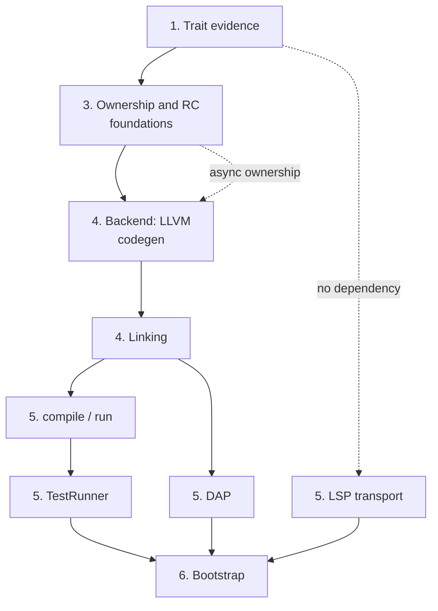

# Self-Hosting: Building the Ashes Compiler in Ashes

Status as of 2026-08-25. This document contains both the capability audit of what Ashes-the-language,
its compiler/runtime, and its standard library must provide before a compiler can be written in Ashes,
and the implementation handoff for the active self-hosted toolchain migration. See
[FUTURE_FEATURES.md](FUTURE_FEATURES.md) for how self-hosting fits the broader roadmap and the
[self-hosted toolchain README](https://github.com/MattiasHognas/Ashes/blob/main/selfhost/README.md)
for package boundaries and commands.

## Migration state

The new implementation lives entirely under `selfhost/`. It is pure Ashes: Python, shell, C#, and
Node.js helpers are not part of its implementation or test path. The existing .NET toolchain remains
in the repository permanently as a buildable, tested stage-0 and behavioral reference after the
self-hosted compiler becomes the default. The Node.js VS Code extension also remains in the repository,
and so does the .NET registry server (`src/Ashes.Registry`): it is a deployed service, not part of the
toolchain a user runs, so only its client commands are ported. Neither implementation may be removed or
changed merely to make the self-hosted port easier.

| Area | Ported surface | State |
|---|---|---|
| Frontend | Tokens, UTF-8 source spans, lexer, typed syntax model, leading import-header separation, inline-module lifting and validation, expressions, patterns, types, and whole-program parsing for all current declaration forms | Implemented and covered by pure-Ashes tests; token streams also have shared stage-0/self-hosted parity fixtures |
| Formatter | Canonical formatting for complete programs, declarations, expressions, patterns, and types, including precedence and idempotence coverage | Implemented and covered by pure-Ashes tests |
| Semantics foundations | Stable symbols/scopes, semantic types, substitution, unordered open-row unification, constrained schemes, and source type resolution | Implemented and covered by pure-Ashes tests |
| Expression/program inference | Core and structural expressions, operators, records, guarded matches, Result pipelines, `let?`, annotations, constructors, recursive groups, aliases, zero-cost types, sequential top-level inference, and package-aware inference of dependency-ordered stitched modules | Implemented for the listed surface |
| Capabilities | Declaration and operation schemes, effect propagation, handlers and `resume`, provider registration, exact concrete provider satisfaction, abstract requirement preservation, and provider/handler ambiguity rejection | Implemented for inference; lowering and code generation remain |
| Traits | Operator constraints; trait declaration/method registration; forward supertrait validation; cycle rejection; qualified method schemes; default-body type checking; ordinary implementation registration with rigid heads, requirements, optional defaults, and type-checked supplied methods; deterministic duplicate/structural-overlap rejection; package orphan ownership for traits and nominal head types; decreasing conditional requirements; selected-default dependency validation; canonical constraints with transitive supertrait elimination; written binding-requirement boundary validation; recursive concrete instance evidence resolution; canonical failure traces; deterministic hidden-dictionary ABI shape planning; ABI-ordered call-site evidence argument planning; constrained-function application/partial-capture planning; active evidence forwarding with deterministic supertrait paths; active trait-method slot planning; concrete dictionary-construction input planning with supplied/default method selection; dependency-aware selected-method construction order; evidence transport destinations for direct functions, closures, aggregates, and async frames; constrained-value rewriting with hidden parameters, dictionary destructuring, and unambiguous method binding; constrained-reference rewriting with exact or inherited active evidence; concrete dictionary-value rewriting with selected method bindings and nested supertrait values; the shipped standard trait ABI plus primitive/structural implementation heads bound to rewritten `Ashes.Trait` source bodies; and deterministic, declaration-aware `deriving` expansion for ordinary and zero-cost nominal types | Declaration, ordinary implementation, coherence, termination, default-cycle, constraint-canonicalization, written `requires` validation, evidence-plan resolution, structured resolution failures, dictionary ABI layouts, call-site evidence arguments, constrained-function application plans, recursive/sibling evidence-forwarding plans, active method-access plans, concrete construction inputs, selected-method build order, value-transport plans, constrained-value/reference rewriting, concrete dictionary-value rewriting, standard implementation evidence/source binding, syntax-level deriving expansion, and semantic deriving eligibility validation implemented; physical IR lowering remains |
| IR, optimizer, ownership, backend, linker | Complete IR model/text form plus core lowering for constants, lexical locals, calls, closures, captures, control flow, recursion, structural values and patterns, operators, BigInt literals, and the shipped non-async/non-FFI builtin operations; arena brackets, call windows, and lifetime placement over six byte-exact IR parity fixtures; a linux-x64 LLVM backend and pure-Ashes ELF linker producing real executables | In progress; trait-evidence/provider/async lowering, Perceus dup/drop emission, reuse, optimization levels, and the other three targets remain |
| CLI, LSP, DAP, TestRunner, fuzzing runner, registry commands | Package boundaries are defined; `fmt` and `init` are ported (see the checklist below) | Started |
| Bootstrap | No stage-1/stage-2 compiler build or equivalence comparison yet | Not started |

The current packages intentionally form the same strict dependency graph as the existing toolchain:
`frontend` has no compiler dependency, `formatter` depends only on `frontend`, and `semantics` depends
only on `frontend`. Do not move backend behavior into those packages. Future packages must follow the
dependency table in the
[self-hosted README](https://github.com/MattiasHognas/Ashes/blob/main/selfhost/README.md#package-dependency-graph)
and
must reference only the packages they actually consume.

### Planned work

Work should continue in dependency order. Each item below is a reviewable milestone or a short series
of milestones; split an item when its tests and public contract can stand alone. The six phases below
still hold at that granularity, but three keystone decisions gate the shape of everything under them —
naming them explicitly here keeps them from hiding inside a longer numbered item:

1. **Complete trait semantics.** Thread evidence through every value shape and lower dictionaries and
   method dispatch. Add `deriving` expansion only after ordinary evidence works end to end. The
   remaining gap is one architectural decision — call-site dictionary forwarding, under "Traits,
   implementations, and evidence" below — blocked on making `CoreLowering`'s own local type
   reconstruction constraint-aware, or merging it with the external inference pass into one
   type-variable space. Every other item in this phase (concrete dictionary construction, the standard
   trait ABI, `deriving`'s physical lowering, and the "supply evidence from a requirement's instantiated
   type, never trait name alone" item under "Optimization, ownership, and reuse", which is the same gap
   seen from the ownership side) is inert until one of those two paths lands. Verify generic capability
   evidence disambiguation (under "Capabilities and handlers") before writing any code for it —
   inference's own provider-ambiguity rejection may already make it unreachable in practice.
2. **Close whole-program semantic gaps.** Port import/module and export resolution, external declaration
   typing and ABI metadata, package/project stitching, remaining declaration namespace rules, exhaustive
   diagnostics, and any expression/type-inference behavior not yet represented by the focused tests.
   Compare observable results with the C# compiler rather than copying its internal object graph. This
   phase does not depend on phase 1 and is largely residue — small, self-contained items (resource
   move/borrow/consume rules, the registry/lock-file graph's network half, source-function origins
   through the future IR) that can close out alongside it rather than after it.
3. **Define and lower the complete IR.** Port the current IR model and text form, expression and
   declaration lowering, trait/capability evidence, async state machines, optimization passes, ownership
   and move analysis, Perceus lifetime placement, reuse, and compiler explanation/tooling metadata. Keep
   ownership inferred and retain the current no-GC memory contract. Internally this phase has its own
   hard order, under "Optimization, ownership, and reuse": heap layout classification (copy /
   RC-managed / resource / borrowed-view / region / unsupported — build the tagless single-constructor
   ADT layout against this classifier from the start, not bolted on afterward) comes before the
   ownership/move-analysis pass (parameter/capture ownership, freshness, reachability, borrows,
   forwarding, whole-program SCC provenance), which comes before Perceus duplication/drop insertion
   itself. Almost every other item in that section is a *port*, not new design — each already has a
   stage-0-proven fix, and several have a minimized repro or a written regression test from this
   project's own history. The highest-value single ports, each covering several crash shapes at once:
   retaining runtime-managed children in an escaping/owning aggregate (the class stage-0's #608 closed),
   releasing a pattern-bound value passed by name as a TCO back-edge argument (the class stage-0's
   fannkuch-redux investigation closed — 2.4 GB to a flat 8.2 MB), and supplying trait evidence from a
   requirement's instantiated type rather than by name (the class stage-0's #650 closed). Reuse
   (structural droppers, safe allocation reuse) and coroutine-frame/async ownership close out this
   phase; cross-mode validation and the `ownership`/`rc`/`reuse`/`memory` explain snapshots prove it
   held.
4. **Port native code generation and linking.** Implement LLVM emission, target ABI handling, runtime
   and bitcode selection, ELF/PE construction, external libraries/resources, debug information, and all
   four target RIDs. Start with the host target but preserve target-independent APIs from the outset.
   LLVM C API bindings and host `libLLVM` loading gate everything else under "LLVM code generation and
   runtime integration"; IR emission needs phase 3's ownership/RC shape settled, but not every one of
   its bug-class items fixed first. Under "Object parsing and executable linking", object parsing gates
   the four target layouts, which are then independent of each other — do linux-x64 first, since it
   unblocks every later phase that only needs one working target. The `musttail` upgrade item (under
   "Optimization, ownership, and reuse") is explicitly blocked on this phase existing; the
   scheduler/async runtime item needs phase 3's coroutine-frame ownership decided first.
5. **Port the toolchain consumers.** Build the Ashes CLI orchestration and registry commands, then the
   TestRunner, LSP, DAP, and deterministic fuzzing/fuzzyrunner packages. LSP and DAP remain consumers of
   compiler packages; they must not duplicate parsing, inference, lowering, or runtime behavior. `fmt`,
   the manifest commands (`init`/`add`/`remove`/`restore`/`tree`/`why`), and the LSP transport itself
   have no dependency on phase 4 at all — the formatter, `ProjectSupport`, and frontend/semantics are
   already done, so these can start as soon as there is time for them rather than waiting their turn.
   `compile`/`run`/`repl`, by contrast, need phase 4 finished end to end, and TestRunner needs `compile`
   and `run` before it can compile a single test. DAP needs phase 4's debug information and a real,
   linked executable to attach to. The full `.ash` corpus run through both toolchains, at the end of
   this phase, is the first honest parity signal for the whole port.
6. **Bootstrap and prove parity.** Produce a stage-1 compiler with the existing compiler, use stage 1 to
   build stage 2, compare deterministic compiler artifacts or normalized observable output, and run the
   same source/test corpus through both implementations. Add reproducible bootstrap and release jobs
   only after host-target parity is stable, then extend execution/structural validation to every RID.
   Grow the standing phase benchmark at every milestone along the way, not only here — it has already
   surfaced four real stage-0 memory bugs in one week of use, and a crashing corpus file it finds is a
   bug to record, not a file to quietly exclude.

### Current execution roadmap (compiler only)

The six phases above remain the dependency frame; this is the concrete, ordered work plan from
today's state to a complete self-hosted **compiler** — frontend, semantics, backend, linker, CLI,
and TestRunner through bootstrap. LSP, DAP, the registry client commands, and the fuzzing runner
are deliberately out of scope here; they follow the compiler and are tracked only by the checklist
below. Milestones are ordered by dependency, each one landable as its own short series of PRs, and
each closes with the standing gate: the affected test surface green, the phase benchmark run, and
no compile-time or RSS regression. Every checklist item below carries a stable ID
(**`SECTION-N`**, e.g. `OPT-25`); each milestone lists the IDs that gate it — a milestone is done
when those IDs are `[x]` (or their named "Open:" tail is closed, for a shared `[~]` item).

1. **Finish the file-system and process builtin surface.** Resource-typed handles in the
   self-hosted lowering first (the compiler-provided-handle classification and deterministic
   cleanup stage 0 already proves; it unblocks `File.open`/`readChunk`/`readLine`/`close` and the
   resource-alias diagnostics at once), then the File read family (landed:
   `readText`/`readAllBytes`/`mmap`/`writeBytes`/`makeExecutable` over the proven raw-syscall
   helpers), `Environment` (landed: all five members over libc imports), `Console` basics
   (landed: all four members), the real buffered-stdout ring with
   flush-on-exit (`writeBuffered`/`flush` currently write immediately — sound but unbatched), and
   `Process.*` (landed: all six members over raw `pipe2`/`fork`/`execve`/`wait4`/`kill`
   syscalls, with the entry-captured `__ashes_envp` and the linker's new `.bss` segment carrying
   the parent environment into children). `Process` is what lets the TestRunner spawn compiled
   tests at all.
   Gates: SEM-14, LNK-4 (its "Open:" tail), and the files/environment/process/console/
   buffered-stdout slice of CG-11.
2. **Memory-model correctness.** The backend's RC/arena stand-ins deliberately leak today; this
   milestone retires that debt in phase 3's own internal order: complete heap-layout
   classification, then ownership/move analysis, then Perceus duplication/drop insertion (leading
   with the three named highest-value bug-class ports), then real scoped arenas in place of the
   `malloc` stand-ins, reuse, `--debug-disable-reuse` parity, and the four explain snapshots.
   Gate hard on the challenge benchmarks: this is where compile-time and RSS regressions would
   first appear.
   Gates: OPT-22..OPT-27, OPT-29, OPT-30, OPT-32..OPT-36, OPT-38..OPT-42, OPT-44, OPT-45,
   CG-6, CG-10, and CG-4's arena/drop tail.
3. **Trait and capability physical lowering.** The one keystone decision — call-site dictionary
   forwarding via constraint-aware local type reconstruction, or a merged type-variable space —
   then dictionary construction/dispatch lowering, the standard trait ABI, `deriving`'s physical
   lowering, and capability handler/provider/static-provider dictionary lowering (which also
   unblocks the remaining provider diagnostics). Independent enough of milestone 2 that the
   keystone decision can be made in parallel; the physical lowering itself wants milestone 2's
   ownership shape settled.
   Gates: TRT-13..TRT-15, CAP-7, CAP-8, SEM-15, OPT-28, and IR-8's trait/provider tail.
4. **The async/Task arc.** Coroutine-frame ownership (decided in milestone 2), the
   `StateMachineTransform` port completion, and the run-queue scheduler/task runtime codegen —
   the single largest remaining corpus block (~65 test files).
   Gates: OPT-43, CG-12.
5. **Optimizer and performance parity.** Optimization-level selection (`-O0`..`-O3`), the
   remaining `IrOptimizer` passes, and the mutual-recursion merge widening, benchmarked against
   stage 0 on the standing phase benchmark and the challenge programs.
   Gates: OPT-13, OPT-19, OPT-20, and CG-3's optimization-level tail.
6. **Net and vendored bitcode.** Sockets/TLS/HTTP builtins, Mbed TLS/openlibm/PCRE2 bitcode
   selection and linking, `Ashes.Number.Math` transcendentals, BigInt, and Regex — the remaining
   builtin families, all behind the same declare-per-module/import-whitelist mechanism already in
   place.
   Gates: CG-13 and the net/clock/entropy/regex/math/BigInt slice of CG-11.
7. **TestRunner port and full-corpus parity.** Discovery, the directive surface, isolation,
   timeouts, and reporting (needs milestone 1's `Process` and File surface), then the full
   `tests/` corpus and `examples/` run through BOTH toolchains with every difference classified —
   the first honest parity signal for the whole port.
   Gates: TR-1..TR-6.
8. **CLI completion.** `compile`/`run` option parity (`--target`, `-O`, `--debug`, `--emit-ir`,
   `--explain`, `--project` compile), the `test` command over the ported TestRunner, `install`,
   and the stateful `repl`.
   Gates: CLI-4, CLI-9, and the "Open:" tails of CLI-1..CLI-3.
9. **Targets beyond linux-x64 and debug information.** Object-parsing generalization, then the
   three remaining image layouts in the documented order (linux-arm64 ELF, win-x64 PE with the
   Windows runtime builtins, win-arm64 PE structurally), plus DWARF debug information — kept in
   the compiler scope even though its main consumer (DAP) is out of scope here.
   Gates: LNK-1, LNK-7..LNK-13, CG-2, CG-8, CG-9, CG-14, CG-15.
   **Organizing rule, decided up front so the first port does not set the wrong precedent.** The
   platform surface is three axes, not one, and each takes a different treatment. *Image format*
   (ELF/PE) and the relocation/trampoline work under it is genuinely different code: separate
   modules, as stage 0 already does (`LlvmImageLinkerElf`/`…ElfArm64`/`…Pe`/`…PeArm64`);
   `ElfLinker.ash` gains siblings rather than branches. *Architecture* (x64/arm64) changes syscall
   numbers and asm constraints but not the emitters: a resolver seam, the shape of stage 0's
   `ResolveSyscallNr` + `EmitSyscallArm64`/`EmitSyscallX86`, so the ~120 call sites pay nothing —
   the linux-x64 wrappers are already isolated in `IrCodegen.Syscalls.LinuxX64.ash` for exactly
   this. *OS* (raw syscall vs Win32 import) is the one to get right: most builtin emitters share
   their whole algorithm across platforms (`emitFileReadText`'s open/measure/allocate/read-loop/
   validate/close is identical on Windows) and differ only in primitives, so thread a record of
   those primitives through them — the way `DirectoryExternals` already threads libc handles —
   and do NOT duplicate the emitter per target. Stage 0 took the inline-branch route here and pays
   for it: ~110 `IsLinuxFlavor`/`IsWindowsFlavor` branches across twelve files, with 99
   `EmitLinux*`/`EmitWindows*` references inside `LlvmCodegenBuiltins.File.cs` alone. Split by file
   only where the ALGORITHM diverges, not merely the primitives — `Directory.entries`' `readdir`
   stream versus `FindFirstFile` iteration is the standing example, and stage 0 splits there too
   (`LlvmCodegenBuiltins.Directory.Windows.cs`). Name such a file subject-first, platform-last
   (`IrCodegen.Filesystem.Windows.ash`) so a subject's slices sort together. The primitives record
   itself is deliberately NOT built ahead of the first Windows emitter: its shape should be derived
   from a real second implementation, and converting the direct calls to it is a mechanical rename
   the existing fixtures verify.
10. **Bootstrap and retirement.** Stage 1 (built by stage 0) builds stage 2; compare deterministic
    artifacts or normalized output; compile and run the compiler, standard library, examples, and
    corpus with the bootstrapped compiler; wire the reproducible bootstrap/packaging jobs; and
    only then retire the .NET toolchain from the default path.
    Gates: BOOT-1..BOOT-4, BOOT-6..BOOT-11, and BOOT-5's compiler/CLI/TestRunner bundles (its
    LSP/DAP/fuzzing bundles belong to the out-of-scope tracks).

Continuous residue alongside every milestone, not a milestone of its own: the remaining
diagnostics and namespace/inference gap items (SEM-17), cross-implementation parity fixtures as
phases stabilize (PKG-6), the registry/lock tail of MOD-7 and stitching-origins tail of MOD-8,
and the phase benchmark after every landed slice (BOOT-8).

### Toolchain implementation checklist

This is the authoritative feature inventory for the self-hosted toolchain. It tracks observable
compiler and tool behavior, not the presence of similarly named data types. The status markers are:

- `[x]` — implemented in pure Ashes and covered by an executable pure-Ashes test;
- `[~]` — a useful part is implemented, but the current compiler's complete observable contract is
  not yet covered;
- `[ ]` — not implemented in the self-hosted toolchain.

The checklist covers the currently shipped toolchain. Features explicitly listed as unsupported or
future work in the language reference are not self-hosting requirements until they become part of the
shipped language. The existing C#, .NET, and Node.js implementations remain the compatibility oracle;
their internal class boundaries are not requirements when a smaller pure-Ashes design preserves the
same public behavior.

#### Package and test foundations

- [x] **PKG-1** Define pure-Ashes `frontend`, `formatter`, and `semantics` packages with the required dependency
  direction and no host-language implementation helpers.
- [x] **PKG-2** Keep package tests in separate `devDependency` projects and compile them into standalone native
  executables.
- [x] **PKG-3** Exercise frontend, formatter, and semantics tests with reuse enabled and with
  `--debug-disable-reuse`.
- [x] **PKG-4** Supply the language, standard-library, host-environment, filesystem, process, byte-buffer, JSON,
  regex, and installed-layout capabilities identified by the prerequisite audit below.
- [x] **PKG-5** Document every production module's responsibility and load-bearing invariants, preserving
  behaviorally relevant stage-0 contracts without copying host-language API boilerplate.
- [~] **PKG-6** Add cross-implementation parity fixtures as each self-hosted phase gains a stable serialized
  public result. Versioned token-stream fixtures now compare every public token field between stage 0
  and the pure-Ashes lexer; syntax, formatted source, diagnostics, inferred schemes, IR, and executable
  parity formats remain.
- [x] **PKG-7** Make every self-hosted package buildable from a restored source-only dependency graph without
  undeclared checkout-relative inputs.

#### Frontend and source model

- [x] **FE-1** Model tokens, structured diagnostics, and canonical UTF-8 byte spans.
- [x] **FE-2** Lex identifiers, keywords, operators, comments, whitespace, strings, runes, signed and unsigned
  integers, floats, and malformed input, including Unicode scalar validation.
- [x] **FE-3** Model the complete typed syntax surface for programs, declarations, expressions, patterns, and
  type expressions without collapsing those categories.
- [x] **FE-4** Parse literals, variables, qualified references, calls, tuples, lists, records, record updates,
  unary/binary operators, pipes, and their precedence and associativity.
- [x] **FE-5** Parse lambdas, conditionals, nested and recursive bindings, `let?`, `let!`, matches, guards,
  handlers, `perform`, and every current pattern form.
- [x] **FE-6** Parse named, applied, tuple, function, pointer, capability-row, annotated, and constrained type
  syntax.
- [x] **FE-7** Parse exports, aliases, algebraic/record/zero-cost types, flat top-level bindings, recursive
  groups, and optional trailing expressions after the project layer has separated any import header.
- [x] **FE-8** Parse external functions and types, ownership annotations, resources and destructors, native
  strings, pointers, buffers, out parameters, capability rows, and `symbol@library` aliases.
- [x] **FE-9** Parse capability declarations, static providers, trait declarations, implementations,
  supertraits, requirements, defaults, and deriving clauses.
- [x] **FE-10** Preserve source-ordered recovery diagnostics and the current declaration-boundary behavior for
  incomplete editor input and project-stitched programs.
- [x] **FE-11** Compare the complete frontend diagnostic corpus with the C# frontend by diagnostic code, span,
  ordering, and recovery result (the versioned `ashes-diagnostic-v1` parity format under
  `parity/frontend/diagnostics`, checked from both stage 0 and
  `selfhost/tests/frontend-diagnostic-parity`). Porting surfaced and fixed: unsigned-literal
  overflow picking the wrong diagnostic, an unmatched closing bracket permanently disabling
  declaration-boundary detection, three divergent end-of-input wordings unified behind one shared
  check, a refutable-let-pattern span read after its arena scope was reclaimed, and a spurious
  `ASH003` code on the constructor-less-type diagnostic.

#### Formatter

- [x] **FMT-1** Canonically format every expression, pattern, and type form while preserving precedence.
- [x] **FMT-2** Canonically format complete programs and every top-level declaration form.
- [x] **FMT-3** Preserve intentional source spellings where the formatter contract requires them and sort only
  semantically unordered surfaces such as requirement sets.
- [x] **FMT-4** Cover golden output, parse-format-parse behavior, and formatter idempotence.
- [x] **FMT-5** Preserve written import headers and leading/standalone comments around the formatted AST body
  (`formatSource`): the leading comment block kept verbatim, imports re-rendered canonically,
  standalone comments reinserted at their whitespace-insensitive token-signature anchors (next
  anchor, then previous, then top of file — no comment text is ever dropped).
- [x] **FMT-6** Apply formatter options for indentation/newlines (`FormattingOptions`, applied as a
  post-processing rescale over the fixed-4-space internal output) and the opt-in pipeline-layout
  collection (`x |> f |> g` from a nested call chain, all-or-nothing, stopping at a capitalized
  constructor once an outer stage exists). Porting found and fixed a pre-existing stage-0
  double-newline-conversion bug (`\r\r\n`) and a stage-order reversal in the first selfhost port.
- [x] **FMT-7** Keep the parentheses around a record update used as a record-literal field value (and in
  multiline call arguments and list elements) whenever another sibling follows — dropping them
  makes the update absorb the following fields, so the formatted file no longer parses the same.
  The rule is written into the formatter reference; covered by `selfhost/tests/formatter/Main.ash`.
- [x] **FMT-8** Compare the full formatter corpus and malformed-input behavior with the C# formatter. The
  whole-file pass found one crash — a nested `let name param = ...` binding's sugar-parameter list
  clobbered by arena reuse one call after parsing, fixed by deep-copying the built value before
  span construction in `parserParseTopLevelBinding` — and a boundary-splitter gate (a declaration
  value is no longer cut at an indented `then`/`else`/`in`/pipe line after a completed call).

#### Semantic foundations and ordinary inference

- [x] **SEM-1** Model stable symbols, qualified identities, immutable lexical scopes, and deterministic fresh
  type variables.
- [x] **SEM-2** Model semantic primitive, unsigned, function, tuple, list, pointer, named, capability, and open-row
  types.
- [x] **SEM-3** Compute free variables, substitutions, occurs checks, structural unification, generalization,
  instantiation, and constrained rank-1 schemes.
- [x] **SEM-4** Unify capability rows independently of declaration order and allow open tails to absorb unmatched
  capabilities.
- [x] **SEM-5** Resolve source primitives, parameters, functions, tuples, pointers, aliases, nominal types,
  zero-cost types, and capability rows.
- [x] **SEM-6** Infer literals, variables, lambdas, calls, tuples, lists, conditionals, ordinary lets, recursive
  lets, and annotations with let-polymorphism.
- [x] **SEM-7** Infer all operator families while retaining their trait constraints.
- [x] **SEM-8** Infer matches, guards, literal/list/tuple/constructor/record/as/or patterns, and consistent
  pattern-local bindings.
- [x] **SEM-9** Register algebraic, record, alias, and zero-cost declarations; infer constructors, constructor
  patterns, record literals, and record updates.
- [x] **SEM-10** Infer `Result` map/flat-map/error-map pipelines and `let?` propagation.
- [x] **SEM-11** Infer sequential top-level bindings, shared-monomorphic recursive groups, and an optional trailing
  expression.
- [x] **SEM-12** Infer async bodies, `await`, `let!`, task result/error propagation, and structured task APIs:
  the standard `Task(e, a)` type is seeded next to `Maybe`/`Result`, `await task` types as the
  `Result(e, a)` the task runs to (`ExpectedTaskType` otherwise), and `let!` exposes that `Result`
  to the ordinary propagation rules; lowering `await` belongs to core lowering.
- [x] **SEM-13** Perform complete match exhaustiveness, redundancy, large-ADT hardening, and source-compatible
  diagnostic reporting (`matchCoverageError`, stage 0's message text; also enforced during
  single-file lowering via `checkCoreMatchCoverage`, so the `tests/pattern_*` diagnostics fail
  through the self-hosted CLI with stage 0's wording). Porting found the parser had no column rule
  for match/handler arm attachment — a nested match silently swallowed the enclosing match's
  remaining arms; `parserLeadingPipeColumn` now ends an arm list at any `|` dedented past the
  first arm's column, as stage 0 does.
- [x] **SEM-14** Enforce resource move/borrow/consume rules, deterministic cleanup constraints, and use-after-move
  diagnostics at the semantic boundary. In `CoreLowering.ash`, every owned `let` or pattern
  binding whose resolved type is a resource — the compiler-provided `FileHandle` and `Process`,
  or a declared `external type T resource destructor f` by its opaque name — is live, closed, or
  moved. Closed: an explicit `File.close`, or a `consume` argument of the resource's own
  destructor (closing a moved or closed binding is reported: moved-close, double close). Moved:
  stored into a constructor, tuple, list, or cons cell; passed to a consuming callee (a let-bound
  lambda borrows a parameter only when stage 0's `isParamUsedOnlyAsBorrowRead` proves it reads
  it, any other callee and any non-destructor `consume` external consumes; a `borrow` external
  only reads); captured by a closure; or returned as its arm's result. A resource builtin or
  external reading a released binding reports stage 0's use-after-close/use-after-move messages,
  and a live binding gets stage 0's `CleanupResource` at its `let` or arm exit — naming the
  destructor ABI for a declared resource — which the backend lowers to `close` for a handle and
  pipe-close plus reap for a process (the destructor call itself is CG-8's). Residue tracked
  elsewhere: sockets join the resource names with milestone 6's net builtins; the recursive
  cleanup of a resource-bearing aggregate and the dropper of a resource-capturing closure are
  OPT-25's; the cleanup a tail self-call must run before its back edge is OPT-25's TCO tail
  (today the arm's cleanup follows the call, which keeps that call an ordinary call rather than
  a fused tail call).
- [~] **SEM-15** Seed the shipped standard trait/type identities and primitive/structural implementation heads so
  ordinary evidence resolution no longer depends only on focused test declarations. The remaining
  builtin and standard-library value/type environment must be populated through module stitching.
- [x] **SEM-16** Validate every written binding `requires` clause against the inferred canonical external
  requirement set, including recursive groups and ambiguity checks.
- [~] **SEM-17** Port the remaining declaration namespace, duplicate-name, shadowing, annotation, and inference
  diagnostics with stable codes and source spans. Done: `ASH013` (duplicate top-level binding) and
  `ASH014` (forward reference and non-`recursive` self-reference, kept distinct from
  genuinely-unknown names). `ASH016` was never missing — import-resolution collision checking
  already covers it. `ASH015` has no stage-0 reference implementation at all — nothing to port
  until stage 0 implements it.

#### Capabilities and handlers

- [x] **CAP-1** Register capability declarations and parameter-sharing operation schemes.
- [x] **CAP-2** Propagate ambient effects through implicit/explicit operations, lambdas, ordinary and
  higher-order calls, partial application, and `Result` pipelines.
- [x] **CAP-3** Infer handler operation arms, shared instances, `resume`, return arms, arm effects, and residual
  row discharge.
- [x] **CAP-4** Register complete, coherent, instance-specialized static providers and type-check their operation
  implementations.
- [x] **CAP-5** Satisfy exact concrete capability requirements from providers while retaining abstract
  requirements and rejecting provider/handler ambiguity.
- [x] **CAP-6** Lower dynamic handler evidence, one-shot continuation state, pre/post handler control flow, and
  dynamically scoped handler globals into IR — the mechanism is described under the
  "Lower capability handlers/providers and trait evidence" entry in "IR model and lowering".
- [~] **CAP-7** Lower static-provider dictionaries and generic capability evidence into IR. Done:
  static-provider dictionary calls (`emitStaticProviderCall`), and `findStaticProvider` matching
  on capability name AND resolved type arguments (name-only matching cannot distinguish
  `provide Log(Int)` from `provide Log(Str)`; given no required arguments it matches by name only
  when every candidate agrees, reporting ambiguity otherwise). Open: the whole-program wiring —
  `CoreStaticProviderLayout` is constructed nowhere outside test fixtures, since
  `TypeEnvironment` carries no operation implementation `Expr`s (needs a `ProviderDecl` AST walk),
  and deriving a call site's required type arguments is nontrivial when the capability parameter
  appears only in return position (`get : Unit -> a`).
- [ ] **CAP-8** Validate capability explanations and observable behavior against normal, optimization-disabled,
  and reuse-disabled C# compilation.

#### Traits, implementations, and evidence

- [x] **TRT-1** Infer operator constraints and retain them in generalized schemes.
- [x] **TRT-2** Register trait declarations, qualified method schemes, forward supertraits, acyclic supertrait
  graphs, and type-checked default bodies.
- [x] **TRT-3** Register ordinary `implement` declarations with resolved rigid heads, requirements, supplied
  methods, and inherited defaults.
- [x] **TRT-4** Validate implementation trait/arity, method uniqueness and completeness, substituted method
  signatures, capability rows, and requirement variables.
- [x] **TRT-5** Reject exact duplicate and structurally overlapping implementation heads independently of source
  or traversal order.
- [x] **TRT-6** Track package provenance for traits and nominal head types and enforce the orphan ownership rule.
- [x] **TRT-7** Validate decreasing conditional requirements for generic implementation heads while allowing
  fixed requirements on fully concrete heads.
- [x] **TRT-8** Reject dependency cycles among the defaults selected by an implementation while allowing a
  supplied method override to break the cycle.
- [x] **TRT-9** Canonicalize constraints, remove exact duplicates, and remove supertraits implied by stronger
  constraints.
- [x] **TRT-10** Validate written binding `requires` clauses against inferred canonical constraints, including
  nested lets, recursive groups, invalid trait heads, and ambiguous requirement variables.
- [x] **TRT-11** Resolve unique concrete instances recursively with cycle/depth guards while preserving abstract
  constraints as hidden dictionary parameters.
- [x] **TRT-12** Diagnose missing, ambiguous, incoherent, non-terminating, and ambiguous-type-variable goals with
  canonical requirement traces.
- [~] **TRT-13** Plan hidden trait dictionary parameters, method fields, specialized direct-supertrait fields,
  call-site evidence arguments in deterministic ABI order, constrained-partial-application evidence
  capture, exact and inherited active-dictionary forwarding across recursive and sibling call
  edges, ABI-ordered supplied/default method fields with dependency-aware build order, dictionary
  transport destinations (direct parameters, closure captures, nested aggregates, async frames),
  and constrained value/reference rewriting; physically thread dictionaries through the lowered
  representations. Done: every planning layer above, plus the first real lowering wiring —
  `lowerCoreProgramWithEnvironment` elaborates a plain constrained top-level `let`'s value against
  genuine `inferProgram` output; the sole-active-parameter inherited-forwarding fallback (stage
  0's `FindActiveTraitDictionaryParameter` semantics — raw scheme constraints from two bindings
  never share a type-variable id, so exact stable-key matching alone can never fire); and
  call-site forwarding as a pure pre-lowering AST rewrite, gated on the call argument being
  syntactically one of the caller's own outermost lambda parameters (sound via HM unification —
  an unguarded trait-name-only match forwarded the WRONG evidence for an unrelated concrete call,
  proven by IR dump). Open: recursive-binding value elaboration, concrete/global call-site
  resolution for an unconstrained caller, and the phase plan's keystone — constraint-aware local
  type reconstruction in `CoreLowering.ash`, or one merged type-variable space with inference
  (the local reconstruction and the external environment share no variable space; merging their
  outputs into one scheme produced an infinite substitution cycle).- [~] Rewrite concrete dictionary construction into dependency-ordered selected method bindings,
  ABI-ordered fields, and recursively constructed inherited evidence. Lower those values, default
  dispatch, method selection, and safe concrete specialization into IR without changing unoptimized
  behavior.
- [~] **TRT-14** Register the shipped standard trait ABI and primitive/structural implementation heads, including
  recursive evidence requirements and stable compiler-private implementation references. The stitching
  phase now binds those references to rewritten `Ashes.Trait` source bodies by alpha-normalized
  implementation-head structure; physical dictionary lowering remains.
- [~] **TRT-15** Expand `deriving {Eq, Ord, Show, Hash}` into ordinary implementations before coherence checking.
  Ordinary and zero-cost nominal declarations now expand in written order, retain only payload-relevant
  type-parameter requirements, generate deterministic method bodies, and participate in ordinary
  coherence and evidence resolution. Function, pointer, task, unbound-variable, and non-regular
  recursive fields are rejected. A stitched-program declaration context also rejects builtin and
  declared resources, opaque external types, capabilities, and transparent aliases to unsupported
  fields independently of declaration or module order. Physical dictionary and method lowering remains.

#### Modules, projects, externals, and whole-program semantics

- [x] **MOD-1** Separate and validate leading import headers while preserving their written forms, aliases,
  selectors, source lines, and imports-stripped UTF-8 body offsets for formatting and diagnostics;
  retain uppercase-final paths for the resolver to disambiguate as modules or type selectors.
- [x] **MOD-2** Resolve whole-module, aliased, value-selector, and type-selector imports using typed module
  interfaces, longest-module-path ambiguity rules, export validation, and post-resolution collision
  checks. Map module names to source paths and select project, include, dependency, or shipped-library
  sources with ambiguity and reserved-namespace checks. Construct deterministic reachable-module plans
  in dependency-first order, reject cycles, and enumerate filesystem-backed sources deterministically.
- [x] **MOD-3** Validate explicit exports and build value/type/constructor/submodule interfaces from parsed
  programs without exporting externals, trailing bodies, private declarations, or imported modules
  implicitly.
- [x] **MOD-4** Enforce sequential visibility, qualification, reserved namespaces, module cycles, and stable
  compiler-private names across stitched modules. Dependency planning, cycle rejection, and
  dependency-ordered semantic scopes assign deterministic definition identities, record ordinary
  versus recursive visibility boundaries, realize resolved selectors and whole-module imports, validate
  full/short qualifiers and collisions, and assign stable public and compiler-private names. Syntax-tree
  rewriting preserves lexical shadows and source spans while replacing declaration, value, constructor,
  type, trait, and capability references with those compiler names.
- [x] **MOD-5** Parse and validate typed `ashes.json` manifests, including entry extensions, package versions,
  defaults, source roots, includes, output settings, registry/path dependencies, dev dependencies,
  root-level local `overrides`, and forward-compatible unknown fields. Filesystem path resolution and
  entry existence checks belong to project discovery.
- [x] **MOD-6** Discover projects upward, honor explicit project selection, load manifests, resolve project
  paths, validate entry existence, and deterministically plan reachable modules from source-only
  packages.
- [~] **MOD-7** Resolve path and registry package graphs, lock files, package identities, one-version-per-package
  coherence, and program-global providers/implementations. Recursive path dependency resolution,
  dev-dependency propagation, cycle and namespace validation, diamond deduplication, and compilation
  planning across dependency source roots are complete. The typed versioned lock-file model, strict
  parser, selected-manifest lock-path mapping, content-addressed cache-path mapping, consumption of
  restored locked packages as validated dependency source roots, and root-only local override
  substitution with exact locked namespace/version checks are also complete; dependency-declared
  overrides are ignored. Registry resolution, cache materialization, and hash verification remain.
  Stitched-project inference now accumulates providers and implementations in one program-global
  environment.
- [~] **MOD-8** Stitch the complete project while preserving original file/module spans, definition identities,
  package provenance, and source-function origins. Semantic definition plans now retain source spans,
  source paths, module names, package identities, qualified names, and compiler names; rewritten module
  syntax retains its `At` spans. Rewritten modules are now combined in dependency order, compile-time
  exports and non-entry bodies are removed, the single entry body is retained, and half-open module
  regions plus definition-to-item placements preserve deterministic source/package provenance.
  The combined declarations are inferred in that same order while switching package ownership at every
  module boundary; deriving output stays module-local while eligibility validation shares the stitched
  declaration context, trait orphan checks retain package identity, and implementation coherence is
  program-global. An unqualified name two whole-module imports both export is rejected only where
  the module uses it unqualified (stage 0's referenced-name rule: `import Ashes.Collection.List as
  list` beside `import Ashes.Text as text` is routine, and both export `length`); an unused
  collision keeps the first import's binding, and a local top-level definition of the name shadows
  every import. Retaining source-function origins through the future IR remains.
- [x] **MOD-9** Lift and resolve inline modules, enforce their restricted declaration surface, and integrate them
  with cross-file imports, exports, aliases, and selector ambiguity rules. Pure-Ashes lifting covers
  header recognition, indentation and dedenting, nested name composition, child-before-parent order,
  same-scope qualifier rewriting, and restricted-body, reserved-name, and duplicate-name validation.
  Reachable compilation planning now publishes synthetic sources with stable provenance, orders nested
  children before parents, rejects reachable file/inline collisions, honors compatibility and explicit
  parent exports, and resolves cross-file whole-module, alias, value-selector, and uppercase type imports.
- [x] **MOD-10** Type external functions, opaque/declared resource types, ownership modes, native strings, arrays,
  pointers, buffers, out parameters, symbols, libraries, and capability requirements. External opaque
  types are registered before function typing; source-call shapes omit compiler-owned out parameters,
  append their values to results, retain ABI syntax for validation, and keep direct-only contracts out
  of first-class bindings.
- [x] **MOD-11** Validate external ABI combinations and produce the metadata required by lowering, code generation,
  linking, LSP, and package capability auditing. Pure-Ashes validation resolves transparent aliases and
  zero-cost representations, preserves ordered parameter/source shapes and native ownership, verifies
  resource and owned-string destructors, and publishes canonical function, resource, symbol/library,
  direct-call, and sorted runtime-authority metadata with the inferred program.
- [x] **MOD-12** Match the current compiler's entry-expression rules, project diagnostics, and deterministic
  diagnostic ordering across files. Declaration-only entries infer Unit, non-entry trailing bodies
  are ignored, and reachable parse diagnostics retain their structured source/span data in stable
  discovery, span, and emission order.

#### IR model and lowering

- [x] **IR-1** Model the complete `IrProgram` — functions, registers, locals, literals, coroutine metadata,
  ownership instructions, and stable function-origin lineage — covering all 229 instruction
  variants, source locations, task-frame ABI constants, and external/trait metadata.
- [x] **IR-2** The canonical lowered/final IR text format and deterministic function selection used by
  `--emit-ir` and compiler reports, matching stage 0's ordering, annotations, operand rules, and
  the complete 229-instruction textual vocabulary.
- [x] **IR-3** Lower constants, locals, strict left-to-right evaluation, calls, closures, captures, partial
  applications, and lifted functions, driving a whole `ProgramSyntax` (top-level items threaded
  directly; `let recursive ... and ...` groups split into member and continuation lowerers;
  duplicate top-level bindings rejected). Covered by `CoreProgramLoweringTests.ash` and the
  byte-for-byte `selfhost/tests/ir-program-parity` fixtures.
- [x] **IR-4** Lower control flow, conditions, matches, guards, recursion, mutual recursion, and tail calls
  (recursive groups predeclare monomorphic member types and share one environment; tail-position
  recursive applications stay ordinary calls at this phase — the optimization milestone owns the
  back-edge transforms).
- [x] **IR-5** Lower tuples, lists, strings, bytes, nominal/record/zero-cost ADTs, constructors, field
  access, patterns, and record updates with stage-0-compatible layouts (tuple words, two-word list
  cells, interned strings, tagged cells, erased zero-cost wrappers). A field read through a
  receiver whose type is still a variable at the access (a parameter read before any call
  constrains it) resolves by the field's name when exactly one record type declares it, stage 0's
  `ResolveRecordReceiverByFieldName`; an ambiguous field leaves the receiver unresolved.
- [x] **IR-6** Lower operators, BigInt, text/number conversions, program arguments, panic, standard I/O,
  filesystem, environment, process, networking, TLS/HTTP, regex, and other builtin operations.
- [x] **IR-7** Lower external calls, resources/destructors, native ownership conventions, library/resource
  references, and target ABI metadata.
- [~] **IR-8** Lower capability handlers/providers and trait evidence according to the completed semantic
  plans. Done: dynamically scoped handler globals (save/switch/restore around a `handle`),
  static-provider dictionary calls, operation-arm closure installation, and stage 0's entire
  `TryRewriteResume` family — tail-position `resume(e)`, one-shot `let x = resume(v) in body`
  (post closures queued at the `perform` site and folded at `handle` exit), the one-shot
  match-scrutinee shape, non-resuming `let`/`let recursive` prefixes, and `if`/`match` branches
  resuming independently; a `resume` in any other position is rejected
  (`UnsupportedOperationArmResume`) rather than lowering wrong. Covered by
  `CoreCapabilityLoweringTests.ash`. Open: trait-evidence physical lowering (tracked under the
  traits section) and the static `provide` capability-resolution pipeline.
- [x] **IR-9** Retain source maps, definition/hover identities, diagnostic locations, function origins, and
  explanation metadata through generated helper functions (single- and multi-file source contexts,
  structured provenance, hover/public-authority collectors, compilation decision snapshots).
- [x] **IR-10** Resolve a dependency module's combined-source positions through stitched item regions — the
  self-hosted stitcher combines syntax trees, so a module's spans stay offsets into its own file,
  and every emitted instruction carries the innermost enclosing `ExprAt` span. Covered by
  `MetadataAndOriginsTests.ash`. (Stage 0's re-rendered text regions needed `SourceLineAnchor`
  fragment anchors instead — recorded there.)
- [x] **IR-11** Validate lowered IR invariants (program- and function-level) and compare normalized
  lowered-IR fixtures byte-for-byte with the C# compiler
  (`selfhost/parity/semantics/lowered-ir/`).

#### Optimization, ownership, and reuse

- [x] **OPT-1** Port compile-time evaluation (bounded step/depth budgets, scalar call folding) and the
  deterministic IR optimization pipeline: ownership-copy elision, RcDup sinking and RcDup/RcDrop
  fusion, known-closure devirtualization, constant propagation/folding, identity elimination and
  strength reduction, unreachable/dead-code elimination, and redundant arena-bracket stripping.
- [x] **OPT-2** Constant propagation computes a true meet-over-paths at multi-predecessor labels (one fact
  snapshot per incoming edge, intersected once all are observed; unobserved back edges clear) and
  tracks local-slot state — essential, since real lowered IR routes every `let` and join through a
  slot, so temp-only facts fold nothing. Covered by `selfhost/tests/semantics/IrOptimizerTests.ash`.
- [x] **OPT-3** Fold statically-known conditional branches and `SwitchTag`s, recomputing predecessor edges
  from the post-fold instruction list so a newly-unreferenced label dies with its body.
- [x] **OPT-4** Re-run ownership-copy elision after identity elimination/strength reduction (the identity
  rewrite introduces copies the earlier elision pass never revisits; the pass recomputes its facts
  per call, so a second run is safe).
- [x] **OPT-5** Devirtualization reaches a curried call's later applications via a whole-program
  known-returned-label fixpoint (`CallKnown` to a function proven to return one heap `MakeClosure`
  label rewrites to an env-word load plus direct `CallKnown`, iterated to a local fixed point).
  A stack closure never qualifies as a known returned label — its environment dies with the frame.
- [x] **OPT-6** Block-local common-subexpression elimination over duplicate `GetAdtField` reads and pure
  `CallKnown` calls, keyed through a LoadLocal/StoreLocal/Borrow/RcDup alias map with seeded
  env/arg-slot identities; invalidated by potential aliased writes but NOT by arena/stack
  bookkeeping (cursor moves, not writes).
- [x] **OPT-7** Store-to-load forwarding through provably-fresh allocation targets. The cached value must be
  the write's raw source temp, never its alias-canonicalized identity — a canonicalized sentinel is
  a valid cache key but crashes codegen if emitted as a value.
- [x] **OPT-8** Closure environment scalarization for one scalar capture (the captured value rides the env
  argument of a memoized `__scalarenvN` callee variant; `LoadEnv`-only callees, coroutines
  excluded), and
- [x] **OPT-9** for two captures (the second rides the free ownership-flag word), reaching let-bound local
  helpers via slot-resolved devirtualization with dead-load and dropper-free cleanup removal.
- [x] **OPT-10** Prune closure captures the lowered body never reads (`pruneDeadCaptures`): fills deleted,
  survivors renumbered compactly, environment shrunk; self-referential lambdas and
  mutual-recursion groups decline.
- [x] **OPT-11** Fold left-nested single-use string-concatenation chains into one N-ary `ConcatStrN` as the
  pipeline's last step. Single-use analysis alone is insufficient: the fold delays reads across the
  chain, so any arena save/restore/reclaim, stack-pointer bracket, or branch between the innermost
  part and the fold point declines the whole chain (a reclaim can reuse an earlier part's address).
- [x] **OPT-12** The two whole-program closure-environment passes between the per-function pipeline and
  scalarization: captured-closure-call devirtualization (every creation site stores the same label,
  settled by a fixpoint over the capture graph) and currying-stage inlining (a copy-only stage's
  chain rewritten to a caller-frame environment). These took the stitched packages from
  almost-all-`CallClosure` to mostly-direct calls.
- [ ] **OPT-13** Widen the affine-accumulator in-place-append (`ConcatStrTip`) arming to the `let`-bound form
  `let acc2 = acc + rhs in loop(...)(acc2)`, as stage 0 now does: a fail-closed single-use counter
  gates eligibility, the append arms at the `let`'s value, and loads of the armed binding carry the
  producer fact so the back edge skips the predecessor release (without the skip the accumulator is
  freed while live). The fact must be re-derivable from durable per-function state — stage 0's
  reset resolution replays instructions with per-temp facts cleared.
- [x] **OPT-14** Control-flow simplification (jump threading, unreferenced-label removal, redundant
  fallthrough elision), iterated with unreachable-code elimination to a true fixed point — one pass
  cannot fully collapse a real multi-arm match cascade.
- [x] **OPT-15** Tag-grouped match compilation (`planTagGroups`/`lowerMatchArmsViaTagGroups`): arms grouped by
  outer tag, one switch, linear testing scoped inside a group. Sharp edges, each confirmed by a
  real failure: unify the scrutinee against the patterns BEFORE deciding (its type can still be a
  variable that only these patterns pin down); a group's fail target is the match's trailing
  default arm when one exists, never the exhaustiveness-failure label; and a bare `None`-style arm
  is a variable pattern syntactically — it must resolve against the constructor table or it becomes
  a catch-all that absorbs every later arm.
- [x] **OPT-16** Gate the dead-arm trim to shapes the coverage engine analyzes exactly (catch-alls, bool
  literals, empty list, constructors whose children are all catch-alls). The "Missing case" engine
  under-approximates by design — correct for a diagnostic, unsound as an unreachability proof
  (record sub-patterns contribute no constraints; per-column independence misses cross-column
  gaps), and the unsound trim deleted live arms in the semantics package itself.
- [x] **OPT-17** Ordinary and mutual tail-call optimization, stack-safety rules, and profitability/cost
  signals, with SCC decomposition and tag-based dispatch trampoline plans. Covered by
  `selfhost/tests/semantics/TcoTests.ash`.
- [x] **OPT-18** Upgrade the advisory `tail` marker to `musttail` for proven-eligible non-loop tail calls,
  gated on a whole-function scan for native stack allocations; `IrCodegen.ash` fuses direct,
  stored-to-join-slot, and fallthrough-into-join shapes through arbitrarily deep copy-forwarding
  chains (`computeTailJoins`, including an `if` join reached only by a jump that forwards into the
  enclosing `match` join), and currying-stage inlining heap-allocates a self-re-entering
  chain's environment so recursive back edges stay fusable.
- [ ] **OPT-19** Widen mutual-recursion loop merging past same-arity/identical-parameter-type groups: one
  dispatch slot per agreeing parameter position plus one per distinct type elsewhere, non-callee
  slots filled with the slot type's default literal; a slot type with no constructible default, or
  differing result types, declines the group. The base same-arity merge itself is not ported yet
  (stage 0's `TryLowerMutualRecursionTco` through `RewriteGroupTailCalls` in
  `Lowering.TopLevel.cs`: the merged `lambda_N` loop body, `__recgroup_dispatch_N`, and the
  `MutualRecursionWrapper` members); the `mutual_recursion` IR parity fixture, whose `recgroup_*`
  members and entry already match, joins the parity runner with it.
- [ ] **OPT-20** Resolve a member body's **non-tail** sibling references inside the merged dispatch: bind
  every member name to its already-emitted closure slot while lowering the synthesized dispatch
  body, or a well-formed program hits the forward-reference diagnostic (`ASH014`).
- [x] **OPT-21** Infer parameter/capture ownership, result reachability and freshness, moves, borrows,
  forwarding, and whole-program SCC provenance summaries.
- [x] **OPT-22** Prove open-world inspect-only parameters as a monotone least fixpoint over every registered
  function, so in-place reuse borrowing survives a hand-off to a proven read-only helper
  (`FunctionOwnershipSummary.ParameterOwnership` cannot answer this — it classifies a plain
  inspecting helper's parameter as consumed).
  Done (`OwnershipInference.ash`): `inferProgramParameterOwnership` classifies every registered
  function's parameters as a whole-program fixpoint in stage 0's direction (the proven set
  starts empty, a parameter is promoted to borrowed once every mention is a borrow read, passes
  repeat until stable), so a hand-off to a proven inspecting helper or a chain of them stays
  borrowed, a genuine hand-off cycle never converges and stays consumed, and a shadowed,
  unregistered, ambiguous, or partially applied callee still consumes;
  `inferProgramOwnership` reports the fixpoint verdict. `CoreLowering` seeds its state with the
  fixpoint over the program's top-level functions (`withProgramParameterOwnership`) and its
  call-site borrow decision (`markCallArgumentsMoved`) overlays the proven verdict on the
  single-function summary the way stage 0's call lowering consults its proven inspect-only set:
  a parameter the fixpoint proved borrowed stays a borrow where the single-function summary saw
  a consuming hand-off, for a callee that is a registered top-level function with the classified
  parameter chain; a local lambda or a shadowing name keeps the single-function verdict.
- [~] **OPT-23** Classify copy, RC-managed, resource, borrowed-view, region, and unsupported heap layouts.
  Done (`HeapLayoutClassification.ash`): resource-bearing and unresolved-type detection
  (cycle-guarded) and per-child drop kinds for list/tuple/ADT shapes, with constructor fields
  instantiated against concrete type arguments; the structural copy kind of the whole graph and of
  every child (inline, shallow, deep, or none), whether every owned child is droppable, the
  runtime outer-cell reuse eligibility with its copy/record/owned-child/TCO-owned-child/recursive
  ADT and TCO list-element support flags, and the stable rejection flags (resource or borrowed-view
  containment, unsupported child drop layout, unresolved type, unsupported outer-cell reuse).
  Deferred to reuse specialization: the borrowed-view projection of a capability. The reuse flags
  now have a first consumer (OPT-42's ordinary match-arm path), gated on a still-open producer gap
  — see OPT-42's own note.
- [~] **OPT-24** Lay out a single-constructor ADT without a tag word (payload at offset 0), the tagless flag
  carried on every ADT instruction; skip tag tests in matches, load the tag as a literal in
  synthesized droppers/copiers, and keep reuse tokens layout-exact. Build the classifier with this
  layout from the start rather than unboxing the tagged layout later. Done: `TaglessAdtLayout.ash`
  decides the flag once per type declaration (a sole constructor of arity at least one that is
  not compiler-provided, zero-cost, a resource handle, or resource-bearing through any field, type
  argument, list, or tuple) and owns the offset/size helpers the lowering and backend share;
  `CoreConstructorLayout.tagless` carries the decision, and `CoreLowering.ash` emits it on
  `AllocAdt`/`SetAdtField`/`GetAdtField` at construction, record access and update, and
  pattern-field loads, skipping the tag compare (the `ptr != 0` guard stays) and the sole-group
  `GetAdtTag`/`SwitchTag`; `IrText` prints `Tagless=true` as stage 0 does; the backend sizes the
  cell, skips the tag store, offsets fields from 0, and refuses a `GetAdtTag` of a tagless cell
  before emitting a function. Covered by `TaglessAdtLayoutTests.ash` and the tagless record,
  nested, generic, tail-loop, and nullary programs in `selfhost/tests/backend/Main.ash`. The
  synthesized droppers and copiers read the flag: field loads and stores carry it, the
  deep-copy plan of a sole-constructor type never switches on a tag, and the constructor-switching
  ADT dropper loads a tagless cell's tag as the literal 0 (stage 0's `EmitAdtTag`), checked by
  `StructuralDroppersTests.ash`. Open: `AllocAdtStack`/`AllocAdtToSpace`/`AllocReusing` carry the
  flag but are not lowered or emitted yet; reuse-token layout exactness waits on reuse
  specialization.
- [~] **OPT-25** Insert Perceus duplication/drop operations and deterministic resource cleanup across
  ordinary, exceptional, handler, and coroutine control flow. Done: arena save/restore/reclaim
  brackets around every flat top-level `let`, nested `let` chain binding (closing LIFO after the
  innermost body), `match` arm on the linear dispatch path (save before the pattern test;
  restore/reclaim on both exits, the arm's own `match_arm_cleanup_N` block jumping on to the real
  fail target), and general call spine (opened before the callee, closed after the last
  application), each closed under stage 0's scope rule: reset when the result's resolved type
  survives a reset (scalars and zero-cost wrappers of them; an operator-defaulted variable counts
  as `Int`), otherwise left open (copy-out is not ported). The rule is type-directed, so the
  context's expected type is threaded through the lowering state as stage 0's
  `LoweredValueRequest.ExpectedType`: a `let`, recursive binding, lambda, `if`, `match`, `handle`,
  call, list literal, and cons forward it to the parts stage 0 forwards it to (the else branch
  expects the then branch's type, a call argument its parameter type, a list element its element
  type, a lambda pins its parameter type from it), every other expression is unified with it
  afterwards, and a general call constrains its spine's result with it before any argument is
  lowered — so a sibling call inside a recursive-group member, whose result type is unresolved on
  its own, still resets its window. A constructor allocates in the arena unless its consumer
  requests an RC cell (`runtimeAdtRequested`, consumed at instantiation), the dead top-level `let`
  path being the one requester. Reads of owned bindings emit stage 0's `Borrow` alias; a bracketed
  `let` that owns its binding spills the body result to a slot across the closing restore
  (`closeOwnedLetBracket`) and anchors the release at the scope exit; the ported
  `PerceusLifetimePlacement` (over `IrControlFlowGraph`) re-inserts each drop at the control-flow
  precise last use per block, with compensating `RcDup`s for borrowed closure arguments and
  record-field stores. Tagged constructor patterns on the linear path guard the tag test with
  `ptr != 0` in stage 0's temp order; the tag-group path binds fields under the switch without
  either. Closures carry stage 0's origins (`SourceFunction from <let name>`, `ClosureHelper` with
  the `lambda:<start>:<length>:<param>` discriminator, anonymous helpers), a scalar-capture
  environment normalizer (`<label>$env_normalize`), and a let-bound lambda used only as a direct
  callee is a `MakeClosureStack`. Runtime-managed strings follow stage 0's
  `LoweredValueRequest`: a consumer that keeps a fresh string alive (a direct binding result, an
  immediate `Text.length`/`byteLength`/`IO.print` use) asks the fresh-string builtins
  (`fromInt`/`fromFloat`/`formatFloat`/`fromBigInt`/`toHex`/ASCII case/`Rune.toText`/
  `Bytes.subText`) for an RC result (`RuntimeManaged=true`), the consumed operand of a
  print/write/`byteLength`/concat is released right after the use (`RcDrop ... RuntimeManaged`
  on a newly produced temp), a `let` adopts its RC value as an owner released at scope exit
  unless its body tail-forwards the binding (the read then transfers ownership without a
  `Borrow`), a lambda whose body produces an RC value is a `MakeClosure ReturnsRuntimeManaged`
  and a single-argument call to it marks its result newly produced, and a scope that owned and
  released a binding closes with stage 0's `PopOwnershipScope` copy-out: a heap result that
  cannot survive the reset but has a copy-out kind (a string or `Bytes`, a list over scalars, a
  same-arity scalar-field ADT) is copied past the reset as an RC-normalized
  `CopyOutArena`/`CopyOutList`, the ADT's static size counting its tag word only when the type
  is not tagless. Every `match` arm is bracketed on every dispatch path: the tag-group
  (`SwitchTag`) path brackets each linearly tested group case with its own `match_arm_cleanup_N`
  block (the `match_group_next_N` label allocated first) and a trivial single-case group on its
  success path only, and the capability-operation arms bracket like linear arms. An arm's
  pattern bindings are stage 0's `TrackOwnedBindingsInPattern` owners (a resource, or any
  heap-typed binding by its owned type name), released at the arm exit after the result store
  (`RcDrop ... OwnerSlot=N`, moved to the last use by the placement pass), and an arm that owned
  a live binding closes with the same `PopOwnershipScope` copy-out as an owned `let`, the copy
  replacing the result in the match slot; a record field receiver is loaded without the
  owned-read `Borrow`, as stage 0's `TryLowerRecordFieldLoad` does. The `let_bindings`,
  `nested_let_scopes`, `scalar_match`, `ownerless_match`, `pattern_match`, `closure_capture`,
  `heap_result_builtin`, `heap_result_let`, `heap_result_list`, `record_pattern`,
  `tag_group_arm_brackets`, and `match_arm_copy_out` fixtures match stage 0 byte-for-byte,
  source locations included (`MatchArmScopeTests.ash` covers the list and tagged-ADT arm
  copy-outs, the lambda arm's pattern-owner release, and the operation-arm brackets). A self-recursive tail call is still a `CallClosure`; the backend fuses it
  into a `musttail` when the instruction past the call's own window close stores or returns its
  result. A function whose parameter always reaches its result (`ResultReach.ash`, stage 0's
  `ResultAlwaysReachesVariable` over the parsed tree, following saturated calls into the
  let-bound callees the lowering already records) normalizes a string or ADT argument at entry:
  the `rc_arg_normalize_copy`/`rc_arg_normalize_done` block reads the hidden ownership flag
  (`LoadArgumentOwnership`), copies a borrowed argument into an owned value (an RC-normalized
  `CopyOutArena` for a string or a same-arity scalar-field ADT, a `CopyOutList` for a list over
  copyable heads, the per-child deep copy for a tuple and a runtime-managed ADT, single- and
  multi-constructor), stores it back into the argument slot ahead of the body, and the closure
  carrying the function is a `MakeClosure`/`MakeClosureStack AcceptsRuntimeManagedArgument`;
  the normalized functions of the `parameter_reaches_result_string`,
  `parameter_reaches_result_record`, and `parameter_reaches_result_record_update` fixtures
  match stage 0's text (`ResultReachTests.ash`). A general call closes its window under stage 0's
  `LowerCallRestoreArena`: a scalar result, or a result the callee is known to place on the RC
  heap (a single application of a let-bound function whose lowered body produced an RC result
  of a runtime-manageable type, or of a heap type without any copy-out), resets the window; any
  other result whose type has a call copy-out (the scope kinds plus lists of strings and of
  scalar lists, `GetCallCopyOutKind`) reads the callee's `ReturnsRuntimeManaged` bit before the
  call and crosses the reset through the conditional `call_copy_arena_result` /
  `call_reclaim_owned_result` block, the reloaded slot value being the RC result; a
  self-recursive callee keeps the plain scope rule so the backend's tail fusion still finds the
  call adjacent to its return. On the argument side (`LowerAppliedClosureCall`), an RC argument
  (a fresh runtime temp, or a binding that owns one) to a parameter the callee does not borrow
  reads the callee's `AcceptsRuntimeManagedArgument` bit: a fresh argument the callee's result
  keeps, or that an entry-normalizing callee adopts (`runtimeNormalizedArgumentLabels`), passes
  as is; a named binding the result may keep is retained unconditionally; any other is retained
  under the bit through the `rc_call_argument_not_retained` slot. The flag rides on the
  `CallClosure`, and a fresh string, `Bytes`, `BigInt`, closure, or childless-ADT argument the
  callee did not take is released after the call. `CallOwnership.ash` holds the pure rules
  (copy-out kind, callee borrow and reach facts), and the reach analysis poisons a call through
  a qualified or computed callee as stage 0 does. The `call_result_copy_out` and
  `call_argument_retain` fixtures join the byte-identical set. A saturated application of a
  curried let-bound function follows stage 0's returned-closure chain
  (`functionReturnedClosureLabels`, recorded from the last closure instruction producing a
  body temp) to the innermost stage's recorded placement, the known-result decision is gated by
  the RC-eligibility provenance (`CallResultProvenance.ash` classifies each let-bound function's
  terminal arms as stage 0's `BuildProvenanceFunctionNode` does and `OwnershipProvenance.ash`
  solves the forwarding fixpoint; a body-RC but non-eligible callee still reads the returns
  bit), a `ConcatStr` carries `RuntimeManaged=true` when its consumer asked for a runtime string
  (its operands lowered without the request, its result newly produced, a newly produced
  operand released after the use), and a consumed list, tuple, or ADT argument is released
  through stage 0's inline `rcdrop_list`/`rc_drop_tuple_shared`/`rc_drop_shared` walks (the
  spine-only and shallow releases when the callee's arena result may keep the parts, the
  constructor-switching dropper for a recursive or owned-child ADT); the
  `consumed_list_argument` fixture joins the byte-identical set, while
  `curried_known_call_result` and `concat_runtime_result` match stage 0 up to the trait-evidence
  header and the curried inner lambda's locations (`CallWindowLoweringTests.ash`). A fresh runtime-managed scrutinee
  matched directly (a call result or a nested match result that is a string, `Bytes`, or a list
  over scalars) is owned by the arm that matched it, stage 0's `$match_rc_N`: after the pattern
  test and guard the arm stores it into an owner slot of its own, releases it at the arm exit
  (`RcDrop ... OwnerSlot=N RuntimeManaged=true`, moved to the store by the placement pass; a
  list owner walks its spine inline through the `rcdrop_list_N` loop, stage 0's
  `EmitRuntimeManagedListDrop`), and closes with the owned-scope copy-out; an arm whose pattern
  binds the whole scrutinee or a heap value out of it takes no owner. The match result carries
  stage 0's `MarkRuntimeManagedMatchResult` status: runtime-managed when every arm stored a
  runtime-managed value (the empty list literal of a list-typed join counts), newly produced only
  when every arm's was, so a lambda whose body is such a match is a `ReturnsRuntimeManaged`
  closure and a known call to it resets its window. Beside a fresh-string arm, a literal string
  arm of a guard-free match is normalized to an RC-normalized `CopyOutArena` of the constant
  (`ShouldNormalizeStaticStringMatchArms`; stage 0 applies no such rule to `if`). With a
  capability in the program, an arm's closing reset and its cleanup block's reset run under the
  live-posts guard (`live_posts_skip_N`, the counter one past the pending-post register). The
  pure rules live in `MatchArmOwnership.ash`; the `match_rc_scrutinee` and
  `match_list_scrutinee_drop` fixtures join the byte-identical set, and `MatchArmScopeTests.ash`
  covers the guarded arm resets under a `handle` at the expression level (the
  `handle_match_arm_reset` fixture stays out of the runner: the single-file lowering takes no
  capability declarations). The TCO loop of a self-recursive
  function is lowered as stage 0's loop rather than a call the backend fuses: the chain
  parameters the loop body captures move into local slots at entry (`LoadEnv`, `StoreLocal`), an
  unread or shadowed parameter gets a zeroed synthetic slot, the fixed loop-entry watermark, the
  compaction-size slot, and a reservation slot pair per affine accumulator
  (`TcoAffineAppend.ash`, stage 0's `ComputeAffineSelfAppendOrdinals`) precede the
  `lambda_N_body` label, the per-iteration watermark and `SaveStackPointer` follow it, and the
  back edge evaluates every argument into a temp under the children transfer, loads the old
  parameters, stores the new ones, releases the iteration-local runtime owners, resets the
  per-iteration watermark when every argument's resolved type survives a reset (both resolved
  through a `TcoResetPending` placeholder once the function body is lowered, the pre-restore
  slot and release temps allocated after the body's own), restores the stack pointer, and jumps;
  the backend emits `SaveStackPointer`/`RestoreStackPointer` through `llvm.stacksave`/
  `llvm.stackrestore`. The `tco_scalar_loop`, `tco_scalar_owned_let`, and
  `tco_unused_chain_parameter` fixtures join the byte-identical set; `TcoLoopLoweringTests.ash`
  holds the loop-function comparisons of `tco_list_walk` (identical loop function; the program
  lacks the list capture's closure normalizer and dropper) and
  `tco_non_tail_self_call_in_operator_operand` (the scalar loops match except for the window
  reset of the non-tail self-call under the operator, whose result type stage 0 infers before
  lowering). Runtime-managed loop parameters (stage 0's `RuntimeManagedSlotsInOrder`) are now
  ported for the `Str` shape: `TcoRuntimeManagedParams.ash`'s `runtimeManagedStrOrdinals` decides,
  from the loop's raw body before lowering, which parameters are rebuilt only through `+` — read
  through a plain-variable alias first — or passed straight through at every tail self-call, and
  `CoreLowering.ash` splices the entry normalization at the recorded loop-entry point once the
  whole body's types resolve (the function's own direct argument reads the caller's hidden
  ownership flag via `LoadArgumentOwnership`, stage 0's `EmitRuntimeManagedTcoArgumentNormalization`;
  a captured chain parameter is always copied, stage 0's `EmitRuntimeManagedTcoParamCopy`), the
  back edge releases the predecessor's own reference unless the argument is that same parameter
  unchanged (`tcoBackEdgeDropStrPredecessors`; no active-flag locals — placement is a single
  whole-function decision here, not iteration-conditional, so there is nothing for a flag to
  track), and the exit compares the loop's returned value against the parameter's own current
  value at runtime and releases only when they differ (the transferred-reference case). Verified
  crash- and leak-free at 200000 iterations
  (`tests/tco_runtime_managed_str_accumulator_plateau.ash`, run through the backend suite next to
  a 200000-element `List(Str)` consumed through its own pattern-owned tail). A `List`-typed
  parameter is placed the same way in two self-call shapes (`TcoRuntimeManagedParams.ash`'s
  `tcoSelfCallShapes`, stage 0's `TcoSelfCallArgumentShape` walk over the loop body's `if`
  branches, `match` arms, and `let` bodies): grown by one cons cell per iteration onto the
  parameter's own value (every back edge's cell allocated on the reference-counted heap, its head
  a fresh producer or a retained owner) or consumed through its own pattern-bound tail over heap
  heads whose arm keeps them borrowed (`namesBorrowedOnly`: an operator operand, a scrutinee, a
  condition, a field read, or an argument of a borrowing builtin — a head passed to a self-call
  or user function, consed, stored, returned, or captured keeps the list in the arena, since no
  pattern-owner protective duplicate is ported). The resolved element must support the
  runtime-managed accumulator layout and a spine copy (`listHeadCopyKindOf`), and a sibling that
  permanently blocks the frame's reclaim (stage 0's `IsPermanentlyBlockingTcoParam`) demotes every
  list candidate. Each candidate's active flag is allocated at loop entry; an admitted slot is
  normalized at entry (`CopyOutList` under the ownership flag for the direct argument, unconditional
  for a captured chain parameter) with its flag set, every back edge with a runtime-managed list
  takes stage 0's runtime-managed reset (`TcoBackEdgeTryEmitRuntimeManagedReset`: a consumed
  tail's successor is retained null-tolerantly and the old root released under the flag, the
  iteration owners released, the fixed loop-entry watermark restored, the successors stored with
  their flags set, the chunks reclaimed), and the exit releases each slot under its flag through
  the shared-cell `rcdrop_list` walk, transfer-checked against a list-typed result whose direct
  read of a slot also marks the function's result runtime-managed. Verified at 200000 iterations
  by `tests/tco_runtime_managed_list_accumulator_plateau.ash` through the backend suite and by
  `TcoOwnershipRulesTests.ash`. A consumed list whose string-like heads outlive their arm (a
  head forwarded to another parameter) is admitted too, its heads protected by their pattern
  owners' retains (`escapingConsumedHeadOrdinals` reports the positions, the placement admits
  them over `Str`/`Bytes`/`BigInt` elements only); the active flag a list-shaped parameter gets
  at the loop entry is retired from the function's slots when the resolved types keep the list
  in the arena, so the numbering stays stage 0's. Open: ADT- and tuple-typed parameters, freshly
  rebuilt lists, lists over heads without a spine copy (the `rc_normalize_list` deep copy),
  escaping aggregate heads of a consumed list (a promoted aggregate owner needs the structural
  release the placement does not name yet), the runtime-managed reset and
  active flags for a loop whose only runtime-managed parameters are `Str`, and the copy-out reset
  paths for arena aggregates (fixed-watermark compaction, the two-phase up/down copies, affine
  string reservations — a loop over such parameters is emitted without a back-edge reset), the
  resources and closures among the back-edge releases, the mutual-recursion loop merge
  (milestone 5's OPT-19; `mutual_recursion` stays out of the parity runner until then: its
  `recgroup_*` members and entry already match, the merged `lambda_N` body,
  `__recgroup_dispatch_N`, and the `MutualRecursionWrapper`s are missing), the deferred call-result copy-out for a result whose layout is still
  unresolved at the call (`CallResultCopyOutPending`), the provenance classification's
  `IsFreshRuntimeManageableAdtExpressionCore` fallback and its fresh `Bytes`/`BigInt` builtin
  producers (only the fresh-string builtins ground a node; a `let recursive` binding is not a
  forwarding target), the runtime flag on a deferred add that seals to `ConcatStr`, the
  `BigInt.parse`/`Text.uncons` result droppers of a consumed argument, the capability live-posts guard around the call reset, the RC request for a constructor or list built in a lambda's arm (stage 0 allocates
  it `RuntimeManaged` and flags the closure `ReturnsRuntimeManaged`; the selfhost copies the
  arena result out at the arm close instead), the scrutinee owner of an ADT, tuple, or closure
  scrutinee and of an arm that binds the whole scrutinee or a heap value out of it (stage 0's
  independently owned fields, the binding-to-owner aliasing, and the
  `TransferDirectRuntimeManagedMatchResult` transfer of a returned binding; such an arm keeps
  today's unowned scrutinee), the TCO-parameter branch of the join rule
  (`BranchJoinsRuntimeManagedResult`), the live-posts guard around an arm's guarded copy-out
  close and around the `let` and call resets, the whole-program `handle` fixture (the
  single-file lowering takes no capability declarations), the `Borrow` of a captured closure
  read as a callee (stage 0 borrows an owned capture; the selfhost loads it bare, which keeps a
  function whose match scrutinee calls a captured function out of the parity runner), the dead
  `ReturnsRuntimeManaged` bit read stage 0 emits before a known-RC call of a match-bodied
  callee, coroutine/async back edges, the
  `rc_normalize_list` deep-copy loop of an entry-normalized list child over non-copyable heads
  (such a parameter is left unnormalized), the source locations of a curried inner lambda's
  instructions (stage 0 tags them with the `let`'s span, which keeps the three
  `parameter_reaches_result_*` fixtures and the entry-normalized `_start_main`s out of the
  parity runner), the owner-alias walk across curried chains, borrowed reads of owned bindings
  at call sites, and the remaining runtime-managed aggregate placements. Done on the aggregate
  side: a `let` whose value is a fresh list matched immediately (directly, or through a cons onto
  it) or returned directly, a record literal read only as a field receiver, matched by one
  constructor arm, or returned as a fresh tree, a tuple literal returned directly, and a
  constructor application matched immediately or returned as a fresh runtime-manageable value
  ask for stage 0's `List`/`Record`/`Tuple`/`Adt` representation (`aggregateLetValueRequest`, at
  nested and top-level `let`s alike, the top-level body being the rest of the program); a lambda
  body whose terminal arms build a fresh runtime-manageable constructor, list, tuple, or record
  tree asks for it as stage 0's `LowerEscapingResult` does (`functionBodyRequest` over
  `AggregateOwnership`'s escape terminals and arm reconciliation) and otherwise carries its
  children out under the transfer; a constructor honors the request through
  `isRuntimeManagedConstructorCandidate` (copy, generic-copy-over-literals, fresh-heap-child,
  owned-child, accumulator-shaped, and fresh recursive-copy applications, the record rule, the
  nullary rule), lowering each field under stage 0's per-field string/list/tuple request,
  normalizing an arena list field with `CopyOutList`, and retaining its live-owner children after
  all fields (`AllocAdt RuntimeManaged=true`, the closure `ReturnsRuntimeManaged`); a tuple is
  runtime-managed when every element is (`isRuntimeManageableTupleElement`) and a list cell when
  its head is (`isRuntimeManageableListElement`), the runtime or escaping tuple, list literal,
  and cons cell retaining every owned child they store (OPT-30); and a runtime-managed owned
  `let` releases at its scope exit with stage 0's inline walk (`StructuralDroppers`'
  `synthesizeOwnedAggregateRelease` spliced into the function: the `rcdrop_unique_list` walk of
  a fresh list, the `rcdrop_list` walk of any other list, the tuple walk, the known-constructor
  field walk under `rc_drop_known_shared`, and the type-directed ADT walk), the owner's
  `OwnedReleasePlan` (deep uniqueness, constructor) recorded when the `let` adopts the value and
  shared once a runtime cell retains the binding. A capture of an owned binding borrows its read
  as stage 0's by-name owner lookup does. The `owned_let_list_drop` and
  `aggregate_children_retain` fixtures join the byte-identical set
  (`OwnedAggregateReleaseTests.ash` covers the function-level shapes and the syntactic
  predicates). A `Str`-typed loop parameter's own runtime-managed placement is now separately
  closed (OPT-26/OPT-27/OPT-29's "the runtime-managed loop parameters" tail: entry
  normalization, back-edge retain/drop, and the exit transfer check, gated on the parameter
  being rebuilt only through `+` — read through a plain-variable alias too — or passed straight
  through at every tail self-call, `TcoRuntimeManagedParams.ash`'s `runtimeManagedStrOrdinals`).
  Open on the aggregate side: the closure-capture `let` rules
  (`IsImmediateRuntimeClosureCaptureUse`), the tracked child bindings of an immediate match
  (`RuntimeAdtChildBindings`), the `Bytes`/`BigInt` producers, the TCO list-element
  normalization and loop-parameter retains for a `List`- or ADT-typed parameter (the
  `tco_let_call_result_in_accumulator_record.ash` and `tco_owned_let_in_operand_self_call.ash`
  shapes), the proven-fresh call funnel of the ownership
  summary, the runtime-managed scrutinee owner and the match result's all-arms runtime status
  (which keep `lambda_returns_record` out of the runner: its `_start_main` still copies the
  match result out at the top-level scope exit), and the pattern-owner `RcDrop` naming the
  structural dropper.
  Cascading drops: `StructuralDroppers.ash` synthesizes stage 0's structural owner dropper
  (`__rcdrop_structural_N`, the iterative list-spine walk with an owned-head release, the
  unique-guarded tuple and single-constructor walks, string/bytes/bigint leaves) and the
  constructor-switching ADT dropper (`__rcdrop_N`, called for a recursive-copy or owned-child
  ADT child, self-calls through the label cache) as complete env-and-arg `IrFunction`s with
  their type-owned origins, from the pruned type and `HeapLayoutClassification`'s per-child drop
  kinds under a per-name symbol id, matching stage 0's instruction text for a record with a list
  and a string, a list of such records, a tuple with a list, a recursive tree, and an owned-child
  variant (`StructuralDroppersTests.ash`); a field load carries the OPT-24 tagless flag decided
  over the constructors in scope (`typeIsTagless`, a user-declared resource or zero-cost type
  being invisible to the dropper environment and left tagged). `CoreLowering` caches the labels
  per pretty type (`dropperLabels`), names the dropper on the dead top-level constructor drop,
  and splices the same walks inline for a runtime-managed owned `let` at its scope exit
  (`synthesizeOwnedAggregateRelease`, see the aggregate placements above). Open on the
  droppers: the `Result(Str, BigInt)` and text-uncons special drops, zero-cost erasure in the
  classification environment (the dropper environment carries no type-resolution context), and
  naming the dropper on the pattern-owner releases once those are runtime-managed.
- [~] **OPT-26** Retain a runtime-managed owned binding that a tail self-call argument carries out of its
  scope (the argument escapes the iteration like a result escapes its callee — request
  `TransfersRuntimeManagedChildren`, honored by the constructor-argument path even without an
  owning aggregate consumer). Regression: `tests/tco_let_call_result_in_accumulator_record.ash`.
  Done: the consumer request carries stage 0's `TransfersRuntimeManagedChildren`
  (`transfersRuntimeManagedChildren`); a tail self-call's arguments — `isTailSelfCall`: the
  enclosing loop function applied to all of its parameters in tail position of its loop body
  (OPT-29) — are lowered under the transfer, which the constructor, record, cons-head,
  list-literal, and tuple paths forward to their children and honor by retaining the read of a
  live `let` owner (`retainTransferredChild`: the `Borrow`, then an `RcDup RuntimeManaged=true`
  whose duplicate is what the cell stores, guarded `MayBeEmpty` for a list-typed owner), stage 0's
  `DuplicateRuntimeManagedOwnedValueForTransfer`; the argument's own read of an owner is retained
  the same way, and the cons tail is not forwarded to, as in stage 0. Covered by
  `TcoOwnershipRulesTests.ash` and the shared `tests/tco_owned_let_in_tail_argument_record.ash`
  (a known call whose body is a fresh-string builtin — the one `let` value the selfhost places on
  the RC heap today) run through the backend suite, next to the regression fixture itself, whose
  `let label = taken(...)` result stays an arena string until call-result RC normalization is
  ported, so no retain fires on it. The tail self-call's arguments are now the loop's back edge
  (OPT-25), lowered into temps under the transfer before any parameter slot changes.
  Runtime-managed loop parameter placement itself is now ported for the `Str` shape (a
  parameter rebuilt only through `+`, or passed straight through, at every tail self-call —
  OPT-29's own note): `TcoRuntimeManagedParams.ash`'s `runtimeManagedStrOrdinals` decides it
  from the loop's raw AST before the body is lowered (reusing `TcoAffineAppend.ash`'s walk over
  a body with every plain-variable `let` alias inlined by name first, so a `let r = acc in ...`
  wrapper does not hide the accumulator from it), and `CoreLowering.ash`'s
  `finalizeTcoRuntimeManagedParams`/`tcoBackEdgeDropStrPredecessors` splice in the entry
  normalization, the back-edge predecessor release, and the transfer-checked exit release once
  the whole body's types are resolved. Verified leak-free and crash-free at 200000 iterations by
  `tests/tco_runtime_managed_str_accumulator_plateau.ash`, run through the backend suite. Open:
  the Perceus pattern-owner duplicate an owning consumer adds
  (`DuplicatePerceusPatternOwnerForAggregate`) and the loop-parameter retain marker
  (`DuplicateRuntimeManagedTcoParameterForAggregate`) for a `List`- or ADT-typed loop parameter,
  waiting on pattern owners (a grown or consumed `List` parameter is now placed runtime-managed
  under OPT-25's shape rules, an ADT parameter is not). FIXED in stage 0 (2026-09-05): the
  loop-parameter retain marker was skipped for every read inside a tail self-call's arguments,
  so a runtime-managed `Str` parameter consed into a sibling accumulator
  (`collect(n - 1)(text + suffix)(text :: acc)`) was released by the back edge while the cell
  still held it, a use-after-free the self-hosted lowering never had; the marker is now skipped
  only for the parameter's read inside its own successor
  (`tests/tco_runtime_managed_param_consed_into_sibling_accumulator.ash`);
  `tco_owned_let_in_tail_argument_record.ash` and
  `tco_let_call_result_in_accumulator_record.ash`'s remaining diff from stage 0 is a
  call-argument-retention gap for a plain top-level function called from inside the loop body
  (whether the callee accepts a runtime-managed argument, checked through a hidden closure
  flag) — a different mechanism than the loop parameter's own placement, left open here.
- [x] **OPT-27** Decide a `let`'s runtime-RC ownership from what its value temp IS, not how it is
  represented: only a fresh producer or a transferred value confers a releasable reference; a
  plain read of an RC-normalized slot is a borrowed read, and registering it as an owner
  double-releases every iteration. Regression: `tests/tco_let_alias_of_rc_parameter.ash`.
  `adoptRuntimeLetValue` registers an owner only for a `RuntimeNewlyProduced` value temp — a
  fresh producer's result, a known call marked by its callee's body placement, a copy-out, or a
  transferred read (`transferRuntimeOwner`); a parameter `LoadLocal`, a `LoadEnv`, a pattern-field
  load, and the `Borrow` of an owner's read are never marked, so `let r = acc` inside a loop
  releases nothing at its exit (`TcoOwnershipRulesTests.ash`; the regression program runs through
  the backend suite). The RC-normalized loop parameter the rule guards against arrives with
  OPT-25's parameter entry normalization. Selfhost port: `acc` itself (the parameter `r`
  aliases) is now placed runtime-managed and carries its own back-edge predecessor release and
  transfer-checked exit release (OPT-26/OPT-29's shared "runtime-managed loop parameters" tail),
  while `r`'s own reads still add neither — `TcoOwnershipRulesTests.ash`'s
  `expectLetAliasOfParameterIsNotAnOwner` now asserts exactly the parameter's own two releases
  and no duplicate from the alias.
- [ ] **OPT-28** Supply the evidence for a trait requirement inside a constrained function from the
  requirement's own instantiated type, never by trait name alone — the call lowering must unify
  the real arguments first, keep any name-threaded hint only for a still-bare type variable, and
  never serve a concrete requirement from the active dictionary. Regression:
  `tests/trait_concrete_requirement_inside_polymorphic_function.ash`.
- [~] **OPT-29** Keep every operator operand out of tail position: in a genuine TCO loop, a self-call that is
  an operand of an operator in another branch is an ordinary call, never a back-edge jump.
  Regression: `tests/tco_non_tail_self_call_in_operator_operand.ash`. Done: the consumer request
  carries stage 0's `InTailPosition` (`tailPosition`), true at a loop body's root — a recursive
  binding whose innermost lambda body `hasTailSelfCalls` gets a `CoreTcoLoop`
  (`recursiveTcoLoop`), the curried lambdas between the binding and that body stay in the loop and
  any other lambda leaves it (`enterLambdaTcoLoop`) — and forwarded only through `let` and
  `let recursive` bodies, `if` branches (`&&`/`||` included), `match` arms, and the call node
  itself; every operator operand, call argument, `let` value, condition, and scrutinee is lowered
  without it (`tailPositionForwards`, the request-side `TcoTailPositionScope`). The flag decides
  the tail self-call whose arguments transfer their children (OPT-26); the call itself stays a
  `CallClosure` the backend fuses only when its result is stored or returned, so an operand
  self-call is an ordinary call by construction. Covered by `TcoTests.ash` (`hasTailSelfCalls`
  over operator operands), `TcoOwnershipRulesTests.ash` (the operand branch's cons stores the
  plain borrow, the tail branch's the retained duplicate), and the regression program plus
  `tests/tco_owned_let_in_operand_self_call.ash` run through the backend suite. The loop itself
  is lowered under OPT-25 (parameter slots, the `lambda_N_body` back edge, `SaveStackPointer`,
  the deferred back-edge reset), so an operand self-call is an ordinary call and a tail self-call
  the loop's jump; the regression program's scalar loops are compared with stage 0's in
  `TcoLoopLoweringTests.ash`. Runtime-managed loop parameter placement (argument ownership flags
  with entry and back-edge normalization, the exit transfer — OPT-25's own "Open:" tail has the
  mechanism) is now ported for a `Str` parameter, closing the gap for
  `tco_let_alias_of_rc_parameter.ash`'s `loop` and `walk` functions specifically
  (`TcoOwnershipRulesTests.ash`'s `expectLetAliasOfParameterIsNotAnOwner`); the whole program
  still differs from stage 0 (a `let`-wrapped `if`-window `Str` copy-out neither this nor OPT-25
  ports, and its `pascalCaseCharacters`/`continuePascalCase` pair is mutual recursion, milestone
  5's OPT-19), so it stays out of the parity runner. A `List`- or ADT-typed loop parameter (the
  OPT-26 and OPT-29 fixtures proper) follows OPT-25's list shapes for a grown or consumed `List`
  (the operand fixture's `acc` is now a runtime-managed list) and stays open for an ADT, waiting on OPT-25's aggregate-shaped
  tail above.
- [~] **OPT-30** Retain every runtime-managed child an escaping or owning aggregate stores — tuples, list
  literals, and cons cells exactly like the ADT constructor path; a loop parameter's retain is a
  marker upgraded at finalization when its placement is runtime-RC. Regression:
  `tests/aggregate_result_retains_runtime_managed_children.ash`. Done: a tuple retains each
  element read from a live owner after the tuple temp is allocated and before the cell is
  (`retainAggregateChildTemps`) when it is runtime-managed or escaping (the transfer flag, the
  loop body's tail position, or a runtime tuple request); a list literal's and a cons cell's head
  are retained as they are lowered when the list is runtime-managed or escaping, and an escaping
  arena cons cell retains its owned tail null-tolerantly (`retainConsTail`); the
  `aggregate_children_retain` fixture (a tuple, a list literal, and a cons of `let`-owned
  strings and lists escaping their functions) matches stage 0 byte for byte and runs through the
  backend suite. Open: the loop-parameter retain marker and its finalization (the TCO loop
  lowering), and the pattern-owner duplicate of OPT-26. Related interim narrowing: the
  consumed-call-argument child-preserving release now applies only when the callee's VERIFIED
  compiled result is arena-placed or unresolved — a verified runtime-managed result copied or
  retained the parts it kept, so the caller deep-releases (skipping there leaked one reference per
  kept part, 507 MB → 8.2 MB on the consumed-tuple-head plateau workload).
  FIXED concrete instance (root-caused and closed 2026-09-02): a TCO arm rebuilding its state ADT
  around a pattern-extracted list field dup-transferred the binding's ownership into the fresh
  ARENA successor, and the back-edge normalization copied the aggregate without releasing the
  dying original's owned references — every iteration's `CopyOutList` copy survived one count too
  high (~250 B/iteration; 204 MB at 200K iterations). `EmitRuntimeManagedTcoConstructorDeepCopy`
  now releases the source's owned children after copying them (top level only — nesting is
  handled by the release's own cascading walk), scoped to the back-edge ADT normalization path.
  The plateau test passes deterministically; 200K-iteration probes plateau at 8.2 MB. Tuple
  successors were probed with the analogous rebuild shape and plateau at 4.1 MB — no release
  needed there. Still open here: the entry-side parameter normalization (a one-time, not
  per-iteration, non-release).
- [x] **OPT-31** Keep a heap aggregate alive when stored through a generic parameter of a function neither
  inlined nor specialized: both call-lowering paths copy the argument into the persistent to-space
  region (the RC heap is NOT immune — it shares the arena's reclaimable cursor). Covers `Str` and
  `List(Str)`; extend on new failing shapes. Regression:
  `src/Ashes.Tests/GenericParameterHeapValueUafTests.cs`.
- [x] **OPT-32** Retain the elements a generic function (`Ashes.Collection.List.reverse`) moves from a
  consumed list into cells it builds — the generic cons allocates an arena cell around a
  type-variable head with no retain. Root cause was one call-boundary gap, not the cons cell
  itself: `GetCallCopyOutKind` recognized only a `Str` head or a list of arena-resettable elements
  and fell straight to `CopyOutKind.None` for anything else a generic function's element type
  variable can be instantiated with — a tuple, a named record/ADT, `Bytes`, `BigInt`, or a nested
  list over one of those — so a generic function's returned list of such elements escaped the call
  with no normalization at all, in place of the retain a monomorphic accumulator's own TCO
  parameter-entry normalization already performs for the identical element shape via
  `EmitRuntimeManagedTcoListDeepCopy`. Fixed by routing that already-proven recursive per-element
  deep-copy machinery through the call-result path too (`CanEmitRuntimeManagedListElementDeepCopy`,
  `LowerUncoveredCallResultCopyOut`, `LowerCallDeepCopyOutListResult` in `Lowering.cs`/
  `Lowering.Ownership.cs`), both for the immediate and the type-inference-deferred copy-out sites.
  Regression: `src/Ashes.Tests/GenericListRetainsRuntimeManagedElementsTests.cs` (an IR-level
  assertion that the deep-copy walk now appears at the call site, plus a churn-loop execution
  test) and `tests/generic_reverse_retains_runtime_managed_elements.ash`. Two consequences of
  that copy now owning what was arena-placed before, both caller-side in `LowerCallFinish`: a
  call's consumed runtime-managed arguments are released only after its result is normalized
  (the deep copy of `append(map(f)(xs))(map(f)(ys))` read records the release had already
  freed through the callee's arena cells), and a deep-copied generic result consumed by a callee
  whose result stays in its own region (neither normalized here nor produced runtime-managed)
  and whose ownership summary is poisoned is not released at all — that callee may have borrowed
  the records' strings into a region that outlives the call (the self-hosted lowering's
  `finishMatchArm` stores an `ArmOwner` type name into an emitted `CleanupResource`), exactly as it
  could when the list was arena-placed, so the copy is left with the callee the way its arena
  predecessor was (`ConsumedDeepCopiedListStaysWithCallee`). Regression:
  `ConsumedArgumentsReleasedAfterResultNormalizationTests.cs`,
  `tests/generic_append_of_generic_map_results_releases_after_copy.ash`,
  `tests/generic_result_consumed_by_opaque_callee_keeps_parts.ash`. The same release rule also
  trusted a result-reach summary that `Lowering.MoveAnalysis.cs` had left empty: a record update
  and a dotted field read of a local (`x with f = v`, `x.f`, the latter parsed as a qualified
  name) were unmodeled and poisoned with no parameter in the reach set, so a fresh
  reference-counted argument a callee embedded through `with` was released by the caller right
  after the call and its block reused by the next allocation of the same size. Both are modeled
  now: the update's target and a field read reach the result through a component, the updated
  values whole (`OwnershipProvenanceTests.cs`).
- [ ] **OPT-33** Check an inlined helper's references transitively before inlining it inside a reuse arm or
  specialization (a helper's own body must resolve in the isolated scope too; an already-visited
  helper counts as resolved). Regression: `ReuseInlineResolutionTests`. Not yet applicable to
  selfhost: OPT-42's ordinary match-arm reuse path never inlines a helper call into an arm (no
  `InlineCall`/`_inliningInProgress` family is ported), so there is nothing for this check to gate
  yet — it becomes relevant once helper inlining or fold specialization lands.
- [x] **OPT-34** Admit a tuple whose elements include a list of records to runtime-RC placement, or retain
  rather than clone the string elements of an escaping arena tuple — threading a large string
  through such a tuple currently deep-copies it per rebuild (the self-hosted parser moved to a
  `Bytes` view to sidestep this; the general cost remains). Shipped: the per-rebuild copy came
  from `MaterializeEscapingArenaTupleElements` cloning every string binding placed into an
  arena-shell tuple, including one bound out of the borrowed parameter, whose release is an arena
  identity marker. Stage 0 now clones only a string whose owner really releases it (a
  runtime-managed let or match owner, a stable pattern owner, or an untracked binding); a
  borrowed parameter part is carried as is, since the parameter outlives the call and the call
  boundary copies the escaping result out as a whole. A 128 KB state string threaded through
  20000 rebuilds went from 0.49 s to under 10 ms; the shared
  `tests/escaping_tuple_borrowed_state_string.ash` runs the carried and the still-cloned shapes
  through both backends. The self-hosted lowering never had the clone. Admitting the tuple itself
  to runtime-RC placement (a list-of-records element needs a synthesized list dropper over record
  heads and a runtime-managed cons for the rebuilt list) stays open as a later placement widening.
- [x] **OPT-35** Retain, rather than copy, a borrowed string returned out of an aggregate parameter when the
  caller can prove the aggregate is reference-counted (accessor shape:
  `Borrow` + `CopyOutArena RcNormalization` copies the whole string per call). Root cause: an
  accessor's own compiled body (`let name (p: Person) = p.name`, a bare `GetAdtField` + `Return`)
  never allocates anything RC, so its per-callee `ReturnsRuntimeManaged` bit is `false`, baked once
  into every closure value built for that function (`LowerVar`'s top-level-function-ref case) — it
  can never reflect what a *specific call site's* own argument is, so `CopyOutArena
  RcNormalization` ran on every call regardless. Fixed with a call-site-local decision, not a
  change to the callee's bit: `IsTrivialParameterFieldAccessorBody` (`Lowering.cs`) recognizes the
  callee's body shape (a bare `LoadLocal`/`[Borrow]`/`GetAdtField` of its own single parameter,
  restricted to a Shallow-copyable field); `ClassifyAccessorArgumentRc` classifies the call site's
  own argument as `NotRc` (unchanged copy behavior), `DefinitelyRc` (a fresh temp, or a named
  binding whose own `OwnershipInfo` already says `RuntimeManaged` — the same per-name fact OPT-27's
  let-ownership rules read), or `PendingTcoSlot` for a self-recursive loop's own parameter, whose
  arena-vs-runtime-RC placement is not settled this early in lowering (`TryGetRuntimeManagedCallArgument`'s
  own documented timing) — resolved later by `FinalizeAccessorResultRetains`, an `RcDup`-marker
  mechanism mirroring `TcoParameterAggregateRetain`. Verified: a 200000-call loop over a `Person`
  sourced from a genuinely RC-placed `List(Person)` (the TCO parameter-entry path places it RC)
  went from 15.06s / 38.6M minor page faults (the old unconditional copy of a ~768 KB field) to
  0.06s / 4K page faults after the fix — a ~250x improvement — with RSS materially unchanged (the
  per-iteration arena bracket already reclaimed the copy either way; the win is the eliminated copy
  work, not peak memory). Regression:
  `src/Ashes.Tests/AccessorRetainsRcAggregateFieldTests.cs` (an IR-level assertion that the call
  site emits a forced-true ownership flag followed by an `RcDup ... RuntimeManaged=true` in place
  of the old packed-word bit-63 read, plus a correctness execution test) and
  `tests/accessor_returns_retained_string_from_rc_record.ash`.
- [x] **OPT-36** Keep a large string alive when a tail-recursive loop moves it from the list (or tuple state)
  it consumes into its accumulator — the consumed cell's release frees the moved element, read
  back freed for any string past one arena chunk. Repro: split a 15 KB line, walk it inline
  consing the lines, join the result. Closed by the consumed-argument release rule: a fresh list
  consumed by a callee whose result reaches its parts is released spine-only in the caller
  (`LowerCallDropConsumedRuntimeArguments`, the child-preserving walk), so the moved lines stay
  alive for the join. Regression: `tests/tco_loop_moves_split_line_into_accumulator.ash` (three
  5 KB lines split inline, walked, then read back after 20000 unrelated allocations).
- [x] **OPT-37** Release a TCO loop's aggregate result in its caller when the exit arm builds an ADT from the
  loop's own runtime-managed accumulators — the shell is recognized as runtime-manageable when its
  field is the enclosing loop's own parameter slot (narrowly — not any outer variable).
  Regression: `LinuxBackendCoverageTests.cs` (mechanism + RSS-plateau behavior tests).
- [x] **OPT-38** Release a plain runtime-RC value extracted by a match pattern and passed by name as a TCO
  back-edge argument: argument evaluation retains it for the successor, so the back edge must also
  release the pattern-bound owner's reference — it is not a moved value and must not follow the
  moved-argument rule written for resources. Only a plateau-over-iterations test catches this
  class (confirmed 2.4 GB → 8.2 MB on fannkuch-redux).
  Selfhost port: `let recursive f n xs last = match xs with | [] -> last | head :: rest ->
  f(n - 1)(rest)(head)` used to store the raw pattern-extracted `head` into the runtime-managed
  `last` slot with no retain while the back edge released the predecessor `last` — an
  over-release rather than the leak first suspected: with `xs: List(Str)`, the list's strings
  were freed while the list still held them (a use-after-free the selfhost-compiled
  `tests/tco_pattern_head_forwarded_to_other_parameter.ash` crashed on). Closed by porting stage
  0's pattern-binding ownership: `PatternBindingOwnership.ash` classifies every binder a `match`
  extracts from a loop parameter by its uses (borrowed by a plain call, transferred to its own
  parameter, embedded in an aggregate, forwarded to another parameter or captured, or
  unclassified), keyed by the binder's span; `CoreLowering.ash` binds a protected binder as a
  pattern owner (`CoreBinding.patternOwner`) whose reads always borrow, records a placement site
  after the arm's pattern, takes an identity `RcDup` where the binding is read into a tail
  self-call argument, a cons, a list literal, or an owning constructor, releases it at the arm exit
  under its resolved type name (`PatternBinding` while unresolved), and at the loop's finalize
  promotes the markers of a binder whose root parameter is runtime-managed or whose own type is
  `Str`/`Bytes`/`BigInt` to real retains and releases and splices stage 0's protective duplicate
  right after the pattern (`PatternBindingOwnershipTests.ash`, `TcoOwnershipRulesTests.ash`).
  Open: a runtime-managed root with an aggregate-typed escaping binder would need the structural
  dropper label on the promoted release, and the consumed-tail guard still keeps a list whose
  heads escape in the arena where stage 0 admits it to the reference-counted heap (the OPT-25
  tail).
- [x] **OPT-39** Release the RC-managed result of a call consumed only by a read-only builtin once nothing
  else owns it. Three facts must stay consistent: the release fires only for freshly-produced
  arguments; an if/match join keeps "newly produced" only when every arm was fresh; a let-scope's
  save/reload preserves the fact across the reload. Needs a long-running plateau test. Shipped:
  stage 0 releases the consumed result in all three shapes and its
  `Linux_backend_llvm_read_builtin_consumed_call_result_memory_should_plateau` test holds the RSS
  flat over 200000 iterations; the self-hosted lowering emits the same `RcDrop` after the read
  for a direct call result and for an `if`/`match` join of fresh branches, keeps a join with a
  borrowed branch and a let-owned result unreleased (the owner's scope-exit drop covers it), and
  the shared `tests/rc_release_read_builtin_join_result.ash` runs all four shapes through both
  backends. The self-hosted binaries' RSS does not plateau yet because the self-hosted backend
  still allocates every string result with `malloc` regardless of the runtime-managed flag (the
  CG-4 arena tail), so the plateau test stays stage-0-only until that lands.
- [ ] **OPT-40** Place stack, scoped-region, task/capability-region, persistent-region, RC, special-resource, global,
  and OS-backed allocations under the current no-GC contract.
- [ ] **OPT-41** Normalize complete graphs and insert deep-copy boundaries where region or ownership rules require
  them. Open: a borrowed `Str`/`Bytes`/`BigInt` part of a parameter or pattern binding stored into
  an aggregate is never retained at the store. For a runtime-RC aggregate that retain would be
  balanced by its dropper and is the Perceus-correct rule; for an arena aggregate (the self-hosted
  lowering's emitted instruction records, say) there is no dropper to balance it, so the arena
  consumer relies on the borrowed value's owner outliving the region instead — which is what the
  release-side rule under OPT-32 preserves for a generic callee's deep-copied result. Closing this
  needs the store-site retain for runtime-RC aggregates, mirrored in `CoreLowering.ash` with the
  affected parity oracles regenerated.
- [~] **OPT-42** Detect top-cell freshness and uniqueness, synthesize structural droppers, and implement safe
  allocation reuse for tuples, ADTs, closures, and tail-recursive paths. Done: a first consumer of
  `HeapLayoutClassification.ash`'s reuse-eligibility flags for the ORDINARY (non-TCO,
  non-specialization) match-arm path — `ReuseSpecialization.ash` (the pure Expr/Pattern-shape
  analysis: `reusePatternConstructorArity`/`reusePatternFieldBindings` extract a matched
  constructor's field-index-to-bound-name map, `reuseArmBodyRebuildsSameConstructor` recognizes a
  same-name, same-arity rebuild through nested `let`s including a field-order-projected record
  literal, `reuseTransferredFieldsSafe` checks every pointer-typed field is passed straight through
  unchanged rather than dropped or replaced, `exprMentionsName` is the shadow-blind dead-cell
  check) plus the state-threaded `CoreLowering.ash` hooks: `withReuseScrutinee` gates a whole match
  (exhaustive, guard-free, every case a distinct constructor of one type, every case's own rebuild
  transfer-safe — narrower than stage 0's cross-constructor reuse by requiring every arm, not only
  the ones with pointer fields, to rebuild its own matched constructor, so a produced token is
  always consumed by construction and the unconsumed-token release path stage 0 needs never
  arises), `reuseTokenIfEligible`/`reuseTruncateArmTokens` publish and bookkeep one `DropReuse`
  token per arm, and `allocateOrReuseConstructorCell`/`reuseEmitTransferredChild` consume it with
  `AllocReusing`, branching a transferred pointer field on the token's own runtime nullness exactly
  like stage 0's `EmitRuntimeReuseTransferredChild`. Verified: 16 existing whole-program parity
  fixtures re-checked byte-identical (no regression), 19 unit tests in
  `ReuseSpecializationTests.ash` covering the analysis functions directly, and a stage-0 oracle
  pair (`reuse_record_update.source`/`.ir`, `reuse_list_map.source`/`.ir`) that DOES emit
  `DropReuse`/`AllocReusing` for this exact mechanism, plus a `reuse_shared_falls_back` pair where
  stage 0 correctly emits neither (the scrutinee is provably shared by a second top-level binding).
  Open, blocking end-to-end activation in selfhost: selfhost's own constructor-placement lowering
  does not yet mark an ordinary `let`-bound or TCO-parameter named-ADT value `RuntimeManaged` the
  way stage 0 does for these same shapes (confirmed empirically: stage 0 places `Counter(count =
  0, total = 0)`/`Cons(1)(...)` as RC from construction; selfhost places the identical source as
  arena), so the hooks' own precondition (`isRuntimeTemp` on the scrutinee) never holds in selfhost
  yet and none of the three oracle fixtures are registered in `ir-program-parity/Main.ash`. The
  TCO-loop-native ARENA direct-reuse mechanism (`LowerLambdaCoreScanDirectReuse` and
  `CollectCtorMatchedScrutinees`'s constructor-pattern-only scan) and the full fold/list reuse
  SPECIALIZATION (`f$reuse` functions, to-space allocation, `RcIsUnique`-gated runtime uniqueness
  checks, structural droppers) are not ported — both are substantially larger than this slice and
  remain open.
- [ ] **OPT-43** Compute coroutine-frame ownership, async capture lifetimes, parallel handoff rules, and cleanup of
  cancelled or completed tasks.
- [ ] **OPT-44** Preserve semantics under `--debug-disable-reuse`, optimization levels, trait specialization
  changes, and explanation/report instrumentation.
- [~] **OPT-45** Produce stable `ownership`, `rc`, `reuse`, and `memory` explanation snapshots equivalent to the
  current public reports. Done: the report model, reporter, and formatter (`ExplainReport.ash`,
  `IrExplainReporter.ash`, `ExplainReportFormatter.ash`, `ReuseDecision.ash`), the decision
  snapshot capture (`captureDecisionSnapshot` in `DecisionSnapshot.ash`, built from whole-program
  ownership inference and the lowered origins), move-safety proofs, reuse decisions, and value
  placements (the `memory` report's `representation` blocks, recorded during lowering in
  `CoreLowering.ash` and finalized once against the final substitution), rendering byte-identical
  `ownership`, `rc`, `reuse`, and `memory` reports for the shared parity fixtures against stage 0's
  text under `selfhost/parity/semantics/explain/` across all 24 fixtures (`ExplainReportTests.ash`).
  Open: the `memory` report's `representation` counts are classified by a post-hoc, flow-insensitive
  walk over the lowered IR (`DecisionSnapshot.ash`'s `classifyInstructionRepr`) rather than the
  per-value ownership facts stage 0 records during lowering, so a value whose slot is written by more
  than one branch — a TCO loop's own result-slot join, a closure builder's environment copy, or a
  match/if result join — is classified from whichever branch wrote it last in program order instead
  of the branch that actually produced it; pinned as a known difference for `consumed_list_argument`,
  `match_rc_scrutinee`, `tco_scalar_loop`, `tco_scalar_owned_let`, `tco_unused_chain_parameter`,
  `aggregate_children_retain`, and `closure_capture`. The `mutual_recursion` RC counts and its
  memory report's dispatch-wrapper representation block also wait on recursive-group lowering
  parity. Separately, `closure_capture`'s ownership report does not trace a top-level binding
  aliasing a curried partial application back to the outer function's own second parameter, so its
  call site looks under-applied, and result-reach through a destructured pattern component
  (`analyzeMatchArmsReach`) is not tracked, so `record_pattern` and `tag_group_arm_brackets` read a
  pattern-extracted field as fresh rather than reaching its parameter, in both the ownership and
  memory reports; both are also pinned as known differences.

#### LLVM code generation and runtime integration

- [~] **CG-1** Define pure-Ashes bindings to the required LLVM C API and load the installed-layout host
  `libLLVM` without checkout-relative assumptions. Source of truth:
  `src/Ashes.Backend/Llvm/Interop/LlvmApi.cs` — its `LibraryImport` surface is the complete list of
  entry points the backend needs (no more are exposed on purpose; there is no `phi` binding, values
  that merge across branches go through a slot allocated before the branch), and
  `LlvmTargetSetup.cs` initializes the targets. `AshesCompiler.Backend.Llvm` binds the growing
  subset the backend actually uses (see the file itself for the exact surface), each addition
  proven end to end by `selfhost/tests/backend` against real emitted objects and
  exact-instruction assembly dumps. The bindings resolve a bare `libLLVM.so`/`.dll` via the
  executable's own `$ORIGIN` RUNPATH (Linux) or default DLL search order (Windows). Open: the rest
  of `LlvmApi.cs`'s surface as later slices need it.
- [ ] **CG-2** Locate the installed layout from the compiler binary itself: the shipped standard-library copies
  (`dist/` per target, `lib/Ashes/` in a checkout), the vendored bitcode payloads under
  `runtimes/<rid>/` with their `.version` markers (`HermeticRuntimeAssets.cs` validates them against
  the version the compiler was built for and fails fast on a mismatch), and the native `libLLVM`
  next to the executable — resolved relative to the running binary, never to a checkout or a working
  directory, so a stage-1 compiler works from the release bundle layout the .NET one ships in (see
  [Local CI/CD](../guide/local-ci.md) for the bundle shapes).
- [~] **CG-3** Select target triples, data layouts, CPUs, optimization levels, verification, object emission,
  and host/target-independent compile options. Source of truth: `LlvmTargetSetup.cs`,
  `LlvmCodegenPlatform.cs`, and the `Backends/` classes; contract in
  [How to Add a New Target](../internals/architecture.md#how-to-add-a-new-target). Done: the
  `x86_64-unknown-linux-gnu` triple, detected host CPU name/features, the target machine's data
  layout applied to the module, and object emission to a memory buffer. Open: optimization-level
  selection (hardcoded `None`), module verification between build and emit (an operand-type
  mistake currently surfaces only as an ISel crash at emission), and the other three target RIDs.
- [~] **CG-4** Emit LLVM for the complete IR. Source of truth: `LlvmCodegen.cs`, `LlvmCodegenExpressions.cs`,
  and `LlvmCodegenMemory.cs`; layout contracts in
  [Backend Architecture](../internals/architecture.md#backend-architecture), the
  [IR reference](../internals/ir.md), and the [Memory Model](../internals/architecture.md#memory-model).
  `AshesCompiler.Backend.IrCodegen` — split into dotted-filename slices (`IrCodegen.Support`,
  `IrCodegen.Filesystem`, `IrCodegen.TextBytes`, plus the core dispatcher/driver file), the
  stage-0-partial-style layout the dotted-filename module resolution enables —
  walks REAL `IrFunction`s (produced by the self-hosted
  frontend/semantics pipeline) and covers: scalars and locals (every value an `i64` word, one
  entry-block slot per temp/local), control flow with pre-created label blocks and terminator
  tracking, whole-program compilation of every lifted function under stage 0's exact
  `i64 f(env, arg, flag)` convention (`MakeClosure`/`MakeClosureStack`, `CallClosure`,
  `CallKnown`, `LoadFuncAddr`, `LoadEnv`, `LoadArgumentOwnership`, `Alloc`/`AllocStack`,
  memory-offset ops), real `match`/pattern compilation (null guard, tag compare, field
  extraction, guards, or-patterns, and tag-grouped `SwitchTag` dispatch), native `musttail`
  tail calls fused through join chains, string literals/printing/equality/concatenation
  (`.rodata`-backed immortal-header globals; length-check-then-`memcmp`; one `malloc`'d result
  with per-part `memcpy`), `PrintInt`/`PrintBool`/`PanicStr` over the raw `write` syscall, and
  the builtin surface tracked under "Object parsing and executable linking". The entry function
  lowers `Return` to the raw `exit` syscall plus `unreachable` (`e_entry` contract — the process
  entry can never `ret`), and the scoped arena (`IrCodegen.Arena`: 4 MiB `mmap` chunks linked by
  header/footer words, bump allocation for every non-RC `AllocAdt`/`Alloc`/`MakeClosure`,
  `SaveArenaState`/`RestoreArenaState`/`ReclaimArenaChunks` as watermark save, reset, and
  `munmap` walk, with module-level grow/reclaim helpers). The copy and normalization family is
  complete: `CopyOutArena` (fixed, `-1` string/`Bytes` by header length, `BigInt` by limb
  count) and `CopyOutList` (inline, string, and inner-list heads) in `IrCodegen.Arena`, and in
  `IrCodegen.Copy` `CopyOutClosure` (environment plus closure, nil environment kept),
  `CopyOutTcoListCell` (string/inner-list head, tail word preserved, nil pass-through), the
  persistent to-space and blob regions stage 0 keeps beside the arena (`__ashes_tospace_*`/
  `__ashes_blob_*`, grown lazily through `__ashes_region_grow`, never reset) behind
  `AllocAdtToSpace` and `CopyOutArenaToSpace`, and the in-place reuse forms `CopyFixedInto`,
  `CopyStringIntoOrFresh`, and `CopyFixedIntoOrFresh` (in place only when the old blob lies in
  the blob region's current chunk); `TcoResetPending` is rejected at dispatch, since lowering
  resolves every placeholder before handing the program over. Only `CopyOutArena`/`CopyOutList`
  are reached from real lowering today; the rest is exercised by hand-built IR fixtures in
  `selfhost/tests/backend` until the call-window/match-arm copy-out, TCO ownership, and reuse
  specialization ports emit them. Open: the rest of Perceus placement (cascading drops, dup
  insertion, closure droppers, reuse), TLS sections, and the async/parallel/net/FFI instruction
  families.
- [~] **CG-5** Intrinsic builtin and constructor resolution in `CoreLowering.ash`:
  `standardBuiltinLayouts`/`standardConstructorLayouts` seed `initialState` (backing language.md's
  "qualified access, no import required"), with `[0, reservedBuiltinTypeVariableCount)` permanently
  reserved for the embedded schemes' quantified ids (a live supply value colliding with a reserved
  id is an infinite `applySubstitution` loop, found via gdb). Top-level `type` declarations lower
  to real constructor layouts: generics, recursive ADTs, `List`/tuple/named-type fields, implicit
  omitted type parameters per language.md's migration rule, and parameterized-type arity
  diagnostics. Open: `deriving`, function-typed fields, real zero-cost classification, and
  `RcDrop.typeName` carrying the constructor rather than the declaring type (harmless — codegen
  ignores the field).
- [~] **CG-6** RC status. Done: a field-carrying `AllocAdt` is conservatively RC-classified
  (`fieldCount > 0`), `malloc`s the real 16-byte `{count, size}` header, and returns the
  post-header payload pointer; the RC runtime itself is ported in `IrCodegen.Rc` (source of
  truth: `LlvmCodegenMemory.cs`, `LlvmCodegenExpressions.cs`'s closure drop, and
  `LlvmCodegen.cs`'s dup/drop instruction dispatch) — `RcDup` (immortal-aware increment),
  `RcIsUnique`, `RcDrop` (immortal no-op, decrement, `free` at a count of `1`; the `mayBeEmpty`
  null guard; `Function` releases the environment block with the closure; a
  `structuralDropperLabel` is one `CallKnown` of the dropper with `(0, value, 0)` and no local
  decrement), `DropReuse` (the cell as token when unique, else decrement and the null token;
  immortal yields null untouched), and `AllocReusing` (tag store into the token, or a fresh RC
  cell of the layout on a null runtime-managed token; arena tokens are the tag store alone);
  string literals carry the immortal sentinel so every path leaves static storage alone. The
  provably-dead top-level constructor drop names its type's synthesized structural dropper
  (`StructuralDroppers.ash`, see OPT-25) when the payload reaches past the cell, and the dropper
  functions are registered in the program. The RC-normalizing copies produce real headers: a
  runtime-managed `CopyOutArena`/`CopyOutList`/`CopyOutClosure` `malloc`s a fresh `{1, size}`
  cell per copied value, string head, environment block, and closure, and a runtime-managed
  `CopyOutClosure` dispatches to the program's `$env_normalize` function by code address (the
  normalizer copies the captures and returns the new dropper; a closure without one gets the
  raw bytes). The callee side of the hidden ownership flag is `LoadArgumentOwnership` reading
  the third parameter, which `CallClosure`/`CallKnown` pass from their flag temp (`0` when the
  call site has none). libc `malloc`/`free` is the allocator: stage 0's size-binned free-list cache
  (`EmitRuntimeRcRelease`/`EmitAcquireRuntimeRcBlock`) is deliberately not ported. The real
  lowering now feeds this runtime its aggregate traffic: the runtime-managed tuple, list, and
  ADT cells, the `RcDup`s of the owned children they retain, and the inline spine, tuple, and
  field walks of an owned `let` (OPT-25's aggregate placements, OPT-30), exercised end to end by
  the owned-list, lambda-returns-record, and aggregate-children programs of the backend suite.
  Open: the free-list cache if the compile-time benchmark needs it; the rest of Perceus
  placement — the pattern-owner and loop-parameter drops from real lowering, shadowing-aware
  liveness, and the TCO-loop-native and fold-specialization reuse emission OPT-42 has not yet
  reached (its ordinary match-arm path is the first consumer; see OPT-42's note).
- [~] **CG-7** Link the emitted object into a real executable (`AshesCompiler.Backend.ElfLinker`, pure Ashes
  byte manipulation, no `ld`/`lld`). Source of truth: `LlvmImageLinkerElf.cs`. Static and
  eager-dynamic paths are chosen automatically from `.text`'s relocations: dynamic imports resolve
  over a per-symbol `libc.so.6` whitelist (`jmp`-through-GOT stubs, ELF hash/`.dynstr`/`.dynsym`/
  `.rela.dyn`, `PT_INTERP`/`PT_DYNAMIC`, `$ORIGIN` RUNPATH); a concatenated multi-`.rodata*`
  read-only image supports absolute 32/64-bit and PC-relative data patches plus inside-rodata
  (`.rela.rodata` jump-table) patches; local `.text` calls and address-taking resolve against the
  final text base; `.bss` (writable zero-initialized module globals — `__ashes_envp` is the
  first) becomes a trailing zero-filled `R+W` `PT_LOAD` on both paths with the same patch shapes.
  An unrecognized relocation type or external symbol is an `Error`, never a silently wrong link.
  Open: TLS sections, initialized `.data`, program arguments, and growing the recognized-symbol
  surface alongside codegen.
- [ ] **CG-8** Implement platform ABIs, stack handling, external calls, native arrays/strings/buffers/out
  parameters, resources, destructors, and debug-safe symbol naming. The lowering already emits
  `CallExternal` for a user external and a scope-exit `CleanupResource` carrying a declared
  resource's destructor ABI (SEM-14); the backend has neither call yet. Source of truth:
  `LlvmCodegenPlatform.cs` and the external-call paths of `LlvmCodegenBuiltins.cs`; per-platform
  rules live in the [Linking](../internals/architecture.md#linking) sections (Linux syscalls go through
  `ResolveSyscallNr`, with the AArch64 `clone`/`wait4` quirks recorded there; Windows `HANDLE`
  values stay `i64` end to end).
- [ ] **CG-9** Implement the Windows runtime side of the builtins: console handles and modes, `WSAPoll`-based
  socket readiness, `CreateProcessA`/pipes for subprocesses, the certificate store for TLS, and the
  KERNEL32/WS2_32/SHELL32/CRYPT32 import surface the PE linker must provide (an import is added in
  three places of `LlvmImageLinkerPe.cs`, see [Linking](../internals/architecture.md#windows-pe32)). Source of truth:
  the `Windows` branches of `LlvmCodegenBuiltins.*.cs` and `LlvmCodegenBuiltins.Directory.Windows.cs`.
- [x] **CG-10** Every fixed-size runtime-helper scratch `alloca` (syscall scratch such as `timespec`/
  `pollfd`/`termios`/`stat` buffers, the read-line and subprocess pipe buffers, `spawn`'s argv
  vector, print/format buffers, arena copy-out/reclaim slots, and the branch-merging result slots
  the `phi`-free codegen uses) goes through `Llvm.ash`'s `buildEntryAlloca`, which places it in the
  current function's **entry block** and restores the builder to the block it was emitting — the
  self-hosted backend emits at optimization level none, where a fixed-size alloca in any other
  block is a runtime stack-pointer adjustment that only function return reclaims, so one inside a
  jump-based loop body leaks native stack every iteration. The helper derives the function from
  the builder's current block rather than from a threaded `function_`, so a runtime helper
  synthesized into its own function hoists into that function's entry. The genuine `AllocStack`/
  `MakeClosureStack` path (`emitStackAlloc`, managed by its own save/restore bracket) keeps its
  loop-body alloca on purpose. Guarded by the backend suite's hand-built `Label`/`Jump` loop around
  `MonotonicMillis` (two million iterations, a stack overflow before the hoist); every loop the
  self-hosted lowering produces today is a `musttail` self call, so a source-level program cannot
  yet observe the leak.
- [~] **CG-11** Emit the runtime support for buffered stdout/stderr, program arguments, process exit, environment,
  terminal raw/poll operations, files/directories/memory maps, subprocesses, clocks/entropy, sockets,
  HTTP/TLS, regex, math, and BigInt. Done on linux-x64: process exit, environment, files/
  directories/memory maps, subprocesses (LNK-4), and the terminal (`IrCodegen.Console.ash`:
  `enableRawInput`/`restoreInput` over `TCGETS`/`TCSETS` with the saved termios and raw-active
  flag as module globals, `pollInput` over `ppoll` plus one `read`, `monotonicMillis` over
  `clock_gettime`). Open: the buffered stdout ring (writes are immediate), program arguments,
  entropy and the wall clock, sockets, HTTP/TLS, regex, math, and BigInt. Source of truth: one `LlvmCodegenBuiltins.<Area>.cs` file per
  area (`Console`, `File`, `Directory`, `Environment`, `Process`, `Net`, `Http`, `Tls`, `Regex`,
  `Text`, `Bytes`, `BigInt`) plus `LlvmCodegenBufferedStdout.cs`; contracts in the
  [Standard Library reference](../reference/standard-library.md) and the architecture sections on
  [external dependencies](../internals/architecture.md#external-dependencies), buffered standard output, the math runtime,
  and BigInt. Each builtin's capability marker (§20.8 of the language reference) is part of its
  contract.
- [ ] **CG-12** Emit scheduler, task, async I/O, structured-parallelism, worker-stack, cancellation, and graceful
  shutdown runtime support. Source of truth: `LlvmCodegenBuiltins.Async.cs` and
  `LlvmCodegenParallel.cs`; contract in [Async & TLS runtime model](../internals/architecture.md#async-tls-runtime-model)
  and the Memory Model sections on task and capability regions, threads and structured parallelism
  (the per-thread arena behind the `%gs`/`%fs` thread control block), and stacks.
- [ ] **CG-13** Select and link the shipped Mbed TLS, openlibm, and PCRE2 bitcode and any external library/resource
  payloads hermetically. Source of truth: `HermeticRuntimeAssets.cs` (a payload is linked only when the
  program uses its ABI, after the program's own optimization so the pre-optimized bitcode is not
  re-optimized); the `scripts/download-*.sh` provisioning stays shell and is not an implementation step.
- [ ] **CG-14** Emit source-level debug information and preserve valid DWARF/target debug sections through every
  supported optimization level. Set each instruction's location from its IR source location before
  emitting it, give arena/ownership machinery the artificial line-0 location, and keep the current
  location across any builder repositioning: LLVM's `SetInsertPoint(Instruction*)` adopts that
  instruction's location, so hoisting a scratch `alloca` into the entry block (whose allocas carry
  none) must save the location first, emit the `alloca` unlocated, and restore it — otherwise every
  instruction emitted afterwards for the same IR instruction loses its line, and a match arm whose
  whole body is one reference-counted allocation gets no line-table row (stage 0 had exactly this).
- [ ] **CG-15** Generate verified object files for `linux-x64`, `linux-arm64`, `win-x64`, and `win-arm64` from the
  corresponding native host compiler bundle (`LlvmTargetSetup.EnsureInitialized` per target,
  `VerifyModule` before emission; `ASH_DBG_DUMP_IR` dumps the module text on a verifier failure).
#### Object parsing and executable linking

- [ ] **LNK-1** Parse LLVM-emitted ELF and COFF objects, sections, symbols, string tables, data/BSS, and relocation
  addends using immutable byte buffers. Source of truth: `LlvmImageLinker.cs` (`ParseElfObject`,
  `ParseCoffObject`); the image constants (base, alignment) are in
  [Linking → Constants](../internals/architecture.md#constants).
- [~] **LNK-2** Shipped-module stitching (`stitchWithShippedModules`): the transitive `import Ashes.*` closure
  over the shipped `lib/Ashes` texts, intrinsic-only modules synthesized empty, whole-module alias
  shorthands and plain-import unqualified access resolved. Open: builtin modules with no lowerable
  members (`Ashes.Task`, `Ashes.Internal`), selector imports of intrinsic members, bare qualified
  references without an import, ambiguity reporting for colliding plain imports, and locating the
  shipped root from the compiler binary.
- [~] **LNK-3** Scalar and float instruction coverage: every integer arithmetic/bitwise/shift/comparison form,
  `PrintBool`, and float constants/arithmetic/ordered comparisons (each `f64` travels through the
  uniform `i64` word with bitcasts around every operation). Open: float formatting.
- [~] **LNK-4** Builtin member coverage beyond the original `Ashes.IO` set: the full non-async `Ashes.Text`/
  `Ashes.Byte`/`Ashes.Rune`/`Ashes.Number.UInt` surface the corpus uses (parse/format/uncons/toHex/
  parseFloat, byte builders/encoders/decoders/hash, string views through one view-aware
  `emitStringParts`, deferred operator typing for both-operands-unresolved `+`), the `Ashes.IO`
  write family, `readLine` (per-byte reads into a `musttail`-frame-safe per-call buffer),
  `writeBuffered`/`writeBufferedLine`/`flush` (immediate writes — with nothing deferred, the
  flush-on-exit contract holds by construction), `exit`, and the complete File/Directory filesystem
  surface: `File.exists`/`writeText`/`replace` and `Directory.createAll` on raw syscalls
  (`openat`/`write`/`close`/`mkdir`/`rename`), `Directory.entries`/`removeTree` via libc
  dynamic imports (`fdopendir`/`readdir`/`closedir`, `qsort`/`strcmp`, `strlen`/`realloc`/
  `memmove`, `lstat`/`nftw`/`remove`, `__errno_location`) with per-occurrence internal-linkage
  helper functions, a whole-buffer UTF-8 validator, and hand-built RC-managed list cons cells,
  and `File.open`/`readChunk`/`readLine`/`close` — a `FileHandle` is the raw fd as one scalar
  word (a seeded `SemNamed` builtin type, stage 0's runtime contract), `readChunk` reads into a
  runtime-sized RC string, and `File.readLine` reuses the stdin `readLine` machinery with the fd
  parameterized, plus the whole-file read family: `readText` (measure via `lseek`, 1 MiB cap,
  read loop, UTF-8 validation) and `readAllBytes` (uncapped, raw), `mmap` returning a zero-copy
  `Bytes` view over a `PROT_READ`/`MAP_PRIVATE` mapping, `writeBytes` sharing the `writeText`
  writer, and `makeExecutable` (libc `lstat` regular-file check + raw `chmod` 0755), all with
  stage 0's exact message constants, and the automatic close of a handle left open at its scope
  exit (SEM-14). Open: a real buffered-stdout ring only if immediate writes ever regress
  measured throughput.
  `Ashes.IO.Environment` is fully ported (`IrCodegen.Environment.ash`): `currentDirectory`/
  `executableDirectory` over libc `getcwd`/`readlink` with the parent-path trim,
  `temporaryDirectory`/`cacheDirectory` with stage 0's env-fallback chains, and `get` over
  `getenv` — libc rows ride the shared `DirectoryExternals`.
  `Ashes.IO.Process` is fully ported (`IrCodegen.Process.ash`): `spawn` (three `pipe2` pairs,
  `fork`, child `dup2`/`close` rewiring, `execve` with the parent environment from
  `__ashes_envp`), `writeStdin` (partial-write-safe loop), `readStdoutLine`/`readStderrLine`
  (per-byte scan, `Maybe(Str)`), `waitForExit` (`wait4` + `WEXITSTATUS`), and `kill`
  (`SIGTERM`) — a `Process` is stage 0's 32-byte `{stdinW, stdoutR, stderrR, pid}` payload, and
  its drop-time cleanup (close pipes, reap the child) is the same SEM-14 tail `FileHandle`
  carries.
- [x] **LNK-5** Diagnostic slices landed alongside the builtins, each with stage 0's exact message text:
  reserved built-in runtime type names rejected in top-level `type` declarations, explicit
  lambda-parameter type annotations enforced (previously silently discarded), and a `perform`
  whose target is not a capability operation rejected.
- [~] **LNK-6** The 20-byte Linux entry trampoline at the start of `.text` on both link paths (`e_entry` is
  the trampoline, restoring the post-`call` stack-alignment contract). The entry function now
  takes the initial stack pointer as its one parameter and captures the environment vector base
  (`sp + 8 * (argc + 2)`) into `__ashes_envp` for `Process.spawn`. Open: the argc/argv half —
  program arguments remain unported.
- [~] **LNK-7** Lay out and relocate x86-64 ELF64 images and emit the Linux entry trampoline and executable mode
  (`LlvmImageLinkerElf.cs`; [Linux x86-64](../internals/architecture.md#linux-x86-64-elf64) lists the relocation set and
  the trampoline). Done under CG-7 and LNK-6: static and eager-dynamic image layout, `.text`/
  multi-`.rodata*`/`.bss` segments, the documented relocation set plus `R_X86_64_64`/`PLT32`/
  `GLOB_DAT`, the entry trampoline, and the executable mode bit. Open: CG-7's tail (TLS sections,
  initialized `.data`) and LNK-6's argc/argv half.
- [ ] **LNK-8** Lay out and relocate AArch64 ELF64 images with the complete supported relocation set
  (`LlvmImageLinkerElfArm64.cs`; [Linux AArch64](../internals/architecture.md#linux-aarch64-elf64)).
- [ ] **LNK-9** Lay out AMD64 PE32+ images, imports, BSS, entry trampoline, stack probing, and relocations
  (`LlvmImageLinkerPe.cs`; [Windows](../internals/architecture.md#windows-pe32) — import-table slots are positional, so
  the hint array, the IAT address table, and the `__imp_` symbol map must change together).
- [ ] **LNK-10** Lay out ARM64 PE32+ images, imports, unwind/runtime requirements, entry code, and relocations
  (`LlvmImageLinkerPeArm64.cs`; validated structurally on x64 hosts, see the win-arm64 note in
  [Development](../guide/development.md)).
- [~] **LNK-11** Resolve compiler runtime symbols, platform APIs, linked bitcode symbols, external libraries, and
  embedded resources deterministically. Done: local `.text` symbols against the final text base
  and the per-symbol `libc.so.6` whitelist over GOT stubs (CG-7), an unrecognized symbol being an
  `Error`. Open: linked bitcode symbols (CG-13), external libraries, and embedded resources.
- [ ] **LNK-12** Write final executables atomically, preserve installed-layout behavior, and produce deterministic
  structural diagnostics for malformed or unsupported objects.
- [ ] **LNK-13** Execute host-target outputs and preserve the current Wine/QEMU/native/structural validation policy
  for non-host targets, including structural-only win-arm64 validation on x64 hosts. Source of truth:
  `src/Ashes.TestRunner/Runner.cs` and `src/Ashes.Tests/TestProcessHelper.cs` — a win-x64 binary
  under Wine runs with `WINEDEBUG=-all` and `WINEDLLOVERRIDES="mscoree,mshtml=d"` (the emitted PE
  never loads .NET or Gecko, and without the override a fresh prefix blocks on an installer dialog),
  and `qemu-aarch64` is looked up on `PATH` and at the rootless user-tools location.

#### CLI, package management, and registry client

Source of truth: `src/Ashes.Cli/` with `src/Ashes.Cli.Tests/` as the behavioral oracle; the
[CLI reference](../reference/cli.md) is the authoritative surface for every command and flag.

- [~] **CLI-1** Shared argument scanning, help, validation, exit codes, and dispatch. Done: the top-level
  dispatcher (`Dispatch.ash`, the package's runnable entry point) with usage/help exit codes and
  case-insensitive routing for the ported commands. Open: `--version`, target/CPU/worker/stack,
  optimization, and debug options.
- [~] **CLI-2** `compile` for files, expressions, projects, output selection, IR dumps, and compiler reports.
  Done: the single-file form through the full self-hosted pipeline to a linux-x64 executable, with
  `-o`/`--out`, default output naming, the `OK Wrote ...` confirmation, and stage 0's exit codes.
  Open: `--expr`, `--project`, other targets, optimization/debug options, `--explain`, IR dumps,
  elapsed time, and installed-layout library discovery.
- [~] **CLI-3** `run` with argument forwarding, temporary outputs, and exit-status propagation. Done: the file
  form (temp output, `--` forwarding, line-relayed stdio, the program's own exit code). Open:
  `--expr`, `--project`, uniquely named temp outputs, and the compile options above.
- [ ] **CLI-4** The stateful `repl`, target/optimization commands, recovery after diagnostics, and
  deterministic cleanup.
- [~] **CLI-5** `fmt` discovery, preview/write behavior, malformed-file handling, and canonical exit codes.
  Done: sorted recursive discovery, `-w` vs. preview, changed-files-only writes, the inline-module
  skip, and stage 0's exit codes — `-w` output byte-identical to stage 0's. Open: `.editorconfig`
  resolution and the elapsed-time clause in the write summary.
- [~] **CLI-6** `init`, `add`, `remove`, `restore`, `tree`, and `why` over manifests, dependencies, and lock
  files. Done: all six — `init` byte-identical to stage 0; `add`/`remove` edit raw manifest JSON so
  unknown fields survive (one shared indented writer; `add` deliberately does not reproduce stage
  0's field-reordering quirk); `tree`/`why` walk the lock-recorded graph with plain-text tree
  rendering and marked cycles; `restore` resolves path/overridden dependencies only and cleanly
  refuses a registry fetch. Open: registry restore (network, lock writing, `ash1:` verification)
  under the item below.
- [ ] **CLI-7** Semantic versions, version constraints, deterministic dependency solving, `ash1:` source
  hashes, archive validation, and package materialization
  ([the `ash1:` content hash](../internals/architecture.md#the-ash1-content-hash) fixes the byte-exact hashing rules).
- [ ] **CLI-8** Registry configuration and credentials plus `login`, `publish`, `yank`, `search`, and `info`,
  including package capability extraction from compiler metadata, against the unchanged .NET
  registry server ([Package registry](../internals/architecture.md#package-registry) documents the wire protocol).
- [~] **CLI-9** Render structured diagnostics and the `ownership`, `rc`, `reuse`, `traits`, `authority`,
  `concurrency`, and `memory` reports with stable filtering and stderr behavior
  ([Compiler reports](../reference/cli.md#compiler-reports)). Done: `--explain <kind>[:<selector>]`
  on `compile` and `run` (repeatable, deduplicated kinds, last selector wins, all seven kinds
  parsed, unknown kind or missing value a usage error listing the valid values), printing the
  reports to stderr between optimization and code generation. Open: structured diagnostics, the
  `test` command, and the `traits`/`authority`/`concurrency` data the self-hosted lowering does not
  record yet, which render as their empty sections.

#### TestRunner and validation infrastructure

- [ ] **TR-1** Discover individual files, directories, and project tests with the documented project-mode rules
  and deterministic ordering. Source of truth: `src/Ashes.TestRunner/Runner.cs`; the directive
  surface and execution model are in [Testing](../guide/testing.md). The runner compiles the
  unoptimized pipeline as well as the optimized one, so lowering bugs the optimizer would mask stay
  visible (`--pipeline both` in CI).
- [ ] **TR-2** Parse and enforce stdout, stderr, compile-error, exit-code, stdin, file/text, file/bytes,
  executable-directory, working-directory, TCP fixture, and formatter-skip directives.
- [ ] **TR-3** Compile tests normally, with the requested raw/reuse-disabled pipeline, and for selected targets;
  execute through native, Wine, or QEMU runners as appropriate.
- [ ] **TR-4** Enforce timeouts, isolate temporary files/processes/ports, terminate process trees, and report
  failures without leaking fixtures.
- [ ] **TR-5** Match exact output normalization, compiler-error matching, skip behavior, summaries, and exit
  codes.
- [ ] **TR-6** Run the full existing `.ash` corpus through both toolchains and classify every difference before
  bootstrap acceptance.

#### LSP, DAP, editor integration, and fuzzing

- [ ] **IDE-1** Implement Content-Length JSON-RPC transport, lifecycle, cancellation, document state, UTF-8/UTF-16
  coordinate conversion, and structured error handling for the LSP. Source of truth: `src/Ashes.Lsp/`
  with `src/Ashes.Lsp.Tests/` as the oracle; the consumer-only boundary is stated in
  [Tooling Servers](../internals/architecture.md#tooling-servers).
- [ ] **IDE-2** Provide compiler-backed diagnostics, hover schemes/effects/evidence, definitions, completions,
  references, semantic tokens, and canonical formatting without duplicating compiler logic.
- [ ] **IDE-3** Resolve projects, imports, dependencies, standard-library documentation, and multi-file updates in
  the LSP with deterministic invalidation.
- [ ] **IDE-4** Implement the standalone DAP transport and session lifecycle plus launch, breakpoints, stepping,
  threads, stack frames, scopes, variables, termination, and disconnect requests. Source of truth:
  `src/Ashes.Dap/` with `DapServerTests`; the debugger workflow it must serve is in
  [Debugging](../guide/debugging.md), and every module of a project must be breakpointable (the
  source-map anchors item under IR model and lowering).
- [ ] **IDE-5** Broker GDB, LLDB, and `lldb-dap` processes with portable command/response parsing, timeouts, value
  formatting, and source-path mapping; keep the DAP independent of compiler implementation packages.
- [ ] **IDE-6** Preserve the existing VS Code extension's compiler/LSP/DAP acquisition and launch contracts; the
  extension itself remains JavaScript/TypeScript because it runs inside the VS Code extension host.
- [ ] **IDE-7** Port deterministic seeds, profiles, generation budgets, typed program generation, invalid-source
  mutation, AST/IR invariants, execution oracles, coverage guidance, and interaction templates to the
  pure-Ashes fuzzing package. Source of truth: `src/Ashes.Fuzzing/` with `src/Ashes.Fuzzing.Tests/`;
  the campaign contract is in [Fuzz Testing](../guide/fuzz-testing.md).
- [ ] **IDE-8** Port shrinking, stable size metrics, corpus replay, artifact writing, failure classification,
  replay commands, isolated workers, timeouts, and campaign summaries.
- [ ] **IDE-9** Differentially fuzz the self-hosted and C# phases without making host-language helpers part of the
  self-hosted implementation or its normal test path.

#### Bootstrap, release, and default-toolchain gates

- [ ] **BOOT-1** Define a reproducible stage-0 input consisting of the released C# compiler, pinned LLVM/runtime
  payloads, restored source dependencies, and the pure-Ashes compiler sources.
- [ ] **BOOT-2** Build a stage-1 host compiler with stage 0, then use stage 1 to build stage 2 without invoking C#,
  Python, shell, or Node.js as an implementation step.
- [ ] **BOOT-3** Compare stage-1/stage-2 deterministic artifacts where possible and otherwise compare normalized
  tokens, diagnostics, schemes, IR, object structure, executable behavior, and reports.
- [ ] **BOOT-4** Compile and run the compiler, standard library, examples, and complete test corpus with the
  self-hosted host-target compiler.
- [ ] **BOOT-5** Build self-contained compiler, CLI, LSP, DAP, TestRunner, and fuzzing bundles for every host RID,
  including the matching native `libLLVM` and runtime payload layout.
- [ ] **BOOT-6** Cross-compile and execute/structurally validate all four target RIDs under the documented host
  matrix.
- [ ] **BOOT-7** Add deterministic bootstrap, parity, packaging, and release jobs to local CI and hosted CI with
  cached but reproducibly verifiable native assets.
- [ ] **BOOT-8** Grow the standing phase benchmark (`selfhost/bench/`, see its README) with the port: add the
  `lower` row when the self-hosted core lowering accepts a whole program and make `optimize`
  two-sided, add the stage-2 column once stage 1 emits executables, and refresh the results table at
  every milestone that changes a phase. The benchmark is also where stage-0 memory-model bugs surface
  first (four were found through it in one week), so a crashing corpus file is a bug to record, not a
  file to exclude silently.
- [ ] **BOOT-9** Demonstrate acceptable compile time, peak memory, produced-code behavior, diagnostics, and tool
  compatibility on representative projects before changing the default compiler. Acceptance is
  measured with the phase benchmark and the self-hosted package builds: no phase slower than the
  .NET implementation by more than the ratio recorded in the benchmark README at the time of the
  gate, and the semantics package compiling in the stage-1 compiler within the same peak memory as
  stage 0.
- [ ] **BOOT-10** Retire the .NET compiler and tooling servers from the default and release paths only after
  sustained bootstrap and release parity. Keep their sources buildable and tested in the repository as
  the permanent stage-0 and behavioral reference toolchain.
- [ ] **BOOT-11** After the self-hosted compiler becomes the default, make any source-tree reorganization a
  separate mechanical change. Prefer `toolchains/ashes/` for the primary implementation and
  `toolchains/dotnet/` for the preserved .NET implementation; keep shared documentation, libraries,
  tests, examples, and runtime payloads at the repository root.

### Continuation discipline

- Start behavior changes with a pure-Ashes failing test under `selfhost/tests/<package>/`; keep unit tests
  within the owning package and add cross-package tests only at real public boundaries.
- Keep test suites flat: compose small named checks through pipelines instead of sequencing them with
  deeply nested `let ... in` pyramids.
- Treat .NET stage-0 comments as audit input while porting. Preserve non-obvious observable behavior,
  ordering, ownership, diagnostics, and phase boundaries in a module header or a local standalone
  comment; do not copy XML documentation, C# API narration, or host-specific implementation details.
- Keep each milestone on a fresh `feature/...` branch and worktree. Copy `runtimes/` from the main
  checkout into a new worktree before backend-dependent validation; runtime payloads are intentionally
  not regenerated by the self-hosted work.
- Do not delete the existing .NET or Node.js implementations as part of or after the port. Keep the
  .NET implementation buildable and tested as the permanent stage-0 and behavioral reference; changing
  which implementation is shipped or launched by default is a separate decision.
- For the current frontend, formatter, and semantics tests, compile the corresponding
  `selfhost/tests/*/ashes.json` project and execute the emitted host binary. Run semantics tests both
  normally and with `--debug-disable-reuse` so ownership/reuse differences cannot hide a defect.
- Before publishing a milestone, format every changed `.ash` file, build `Ashes.slnx`, run the compiler
  and LSP unit suites, and verify C# formatting. Record exact commands and counts in the PR. Add focused
  bootstrap parity fixtures as soon as a self-hosted phase can serialize the same public result as C#.
- Update this migration table and the implementation status in `selfhost/README.md` in the same PR when
  a milestone changes either one. Do not mark an area complete merely because its data model exists.
- Keep every checklist item short and precise: its ID, its scope, a one-clause "Done:" boundary and
  a one-clause "Open:" tail where partially complete, and at most one load-bearing gotcha or
  regression-test pointer. Per-PR narratives, verification transcripts, and investigation histories
  belong in the PR description and git history, never appended to this document.

## Language/stdlib prerequisites

`Required` means Ashes still needs a design or implementation. An area tag names the eventual
consumer, not the project that must implement the prerequisite. Tests are required for every
delivered change. `Complete` capabilities link to the normative documentation for the shipped
surface. If a future audit finds an incomplete capability, its row must link to an actionable Ashes
work package added to this document.

| Capability | Status | Areas |
|---|---|---|
| [Unsigned integer support (`u8`, `u16`, `u32`, `u64`)](../reference/language.md#_2-1-integers) | Complete | `Compiler/Frontend`, `Compiler/Backend`, `Compiler/Linker` |
| [Byte type (`u8`) and byte literals](../reference/language.md#_2-1-integers) | Complete | `Compiler/Frontend`, `Compiler/Backend`, `Compiler/Linker` |
| [Bitwise operators (`&`, `\|`, `^`, `<<`, `>>`, `~`)](../reference/language.md#_3-5-bitwise) | Complete | `Compiler/Backend`, `Compiler/Linker` |
| [Numeric text conversions (`parseInt`, `parseFloat`, `fromInt`, `fromFloat`, `toHex`)](../reference/standard-library.md#ashes-text) | Complete | `Compiler/Frontend`, `Compiler/Semantics`, `Formatter`, `CLI` |
| [Basic FFI (`external` functions/types, pointers, resources, `symbol@library`)](../reference/language.md#_5-1-external-declarations) | Complete | `Compiler/Backend` |
| [Call-scoped native arrays of opaque handles](../reference/language.md#_5-1-external-declarations) | Complete | `Compiler/Backend`, `LSP`, `Fuzzing` |
| [LLVM out parameters](../reference/language.md#_5-1-external-declarations) | Complete | `Compiler/Frontend`, `Compiler/Backend`, `LSP`, `Fuzzing` |
| [Returned native strings](../reference/language.md#_5-1-external-declarations) | Complete | `Compiler/Backend`, `LSP`, `Fuzzing` |
| [Foreign pointer-plus-length buffers](../reference/standard-library.md#ashes-ffi) | Complete | `Compiler/Backend`, `LSP`, `Fuzzing` |
| [Immutable `Bytes` with indexed reads and append helpers](../reference/standard-library.md#ashes-byte) | Complete | `Compiler/Frontend`, `Compiler/Backend`, `Compiler/Linker`, `LSP`, `DAP` |
| [Little-endian byte encode/decode helpers (`u16/u32/u64`)](../reference/standard-library.md#ashes-byte) | Complete | `Compiler/Linker`, `DAP` |
| [Efficient preallocation, range copy, and random-access binary patching](../reference/standard-library.md#ashes-byte) | Complete | `Compiler/Linker`, `LSP`, `Fuzzing` |
| [Binary file output (`Ashes.IO.File.writeBytes`)](../reference/standard-library.md#ashes-io-file) | Complete | `Compiler/Linker`, `CLI`, `TestRunner`, `Fuzzing` |
| [Path normalization, joining, parent/basename, and relative paths](../reference/standard-library.md#ashes-io-path) | Complete | `Compiler/Semantics`, `CLI`, `LSP`, `TestRunner`, `Fuzzing` |
| [Current/executable/temp/cache directories and environment lookup](../reference/standard-library.md#ashes-io-environment) | Complete | `Compiler/Semantics`, `Compiler/Backend`, `CLI`, `LSP`, `DAP`, `TestRunner`, `Fuzzing` |
| [Directory enumeration, creation, deletion, and atomic rename](../reference/standard-library.md#ashes-io-directory) | Complete | `Compiler/Semantics`, `Compiler/Backend`, `CLI`, `LSP`, `TestRunner`, `Fuzzing` |
| [Marking emitted ELF files executable](../reference/standard-library.md#ashes-io-file) | Complete | `Compiler/Semantics`, `Compiler/Backend`, `CLI`, `LSP`, `TestRunner`, `Fuzzing` |
| [stderr output and controlled process exit codes](../reference/standard-library.md#ashes-io) | Complete | `CLI`, `LSP`, `DAP`, `TestRunner`, `Fuzzing` |
| [Installed-layout host-tool integration workflow](../guide/testing.md#execution-model) | Complete | `Compiler`, `CLI`, `TestRunner`, `Fuzzing` |
| [String helpers (`substring`, `length`, `indexOf`, `startsWith`, `contains`, `split`, `trim`)](../reference/standard-library.md#ashes-text) | Complete | `Compiler/Frontend`, `Compiler/Semantics`, `Formatter`, `CLI`, `LSP`, `DAP` |
| [Unicode scalar classification through `Rune`](../reference/standard-library.md#ashes-rune) | Complete | `Compiler/Frontend`, `Formatter`, `LSP` |
| [Canonical UTF-8 source offsets and UTF-16/LSP coordinate conversion](../reference/language.md#source-encoding-and-coordinates) | Complete | `Compiler/Frontend`, `Formatter`, `LSP`, `DAP` |
| [Persistent immutable map (`Ashes.Collection.Map`)](../reference/standard-library.md#ashes-collection-map) | Complete | `Compiler/Semantics`, `Compiler/Backend`, `LSP`, `DAP` |
| [Persistent immutable array (`Ashes.Collection.Array`)](../reference/standard-library.md#ashes-collection-array) | Complete | `Compiler/Frontend`, `Compiler/Semantics`, `Compiler/Backend`, `Formatter` |
| [Records, named patterns, and record-update syntax](../reference/language.md#_4-3-record-types) | Complete | `Compiler`, `Formatter`, `LSP` |
| [User-written type annotations, aliases, and zero-cost nominal types](../reference/language.md#_4-2-zero-cost-nominal-types) | Complete | `Compiler`, `Formatter`, `LSP` |
| [Project/module compilation with explicit exports and path dependencies](../guide/projects.md) | Complete | `Compiler/Semantics`, `CLI`, `LSP` |
| [Catchable error propagation for compile-pipeline flows](../reference/language.md#_13-4-error-handling) | Complete | `Compiler`, `Formatter`, `CLI`, `LSP`, `DAP` |
| [RC-Perceus deterministic memory without cyclic graphs](../internals/architecture.md#memory-model) | Complete | `Compiler`, `Formatter`, `LSP`, `DAP` |
| [Large-ADT exhaustiveness and performance hardening](../reference/language.md#_11-pattern-matching) | Complete | `Compiler/Frontend`, `Compiler/Semantics`, `Formatter` |
| [JSON parsing/serialization for `ashes.json` and JSON-RPC](../reference/standard-library.md#ashes-text-json) | Complete | `Compiler/Semantics`, `CLI`, `LSP`, `DAP` |
| [Stdio JSON-RPC Content-Length framing](../reference/standard-library.md#ashes-net-rpc) | Complete | `LSP`, `DAP` |
| [Interactive subprocess control with piped streams and timeouts](../reference/standard-library.md#ashes-io-process) | Complete | `DAP`, `TestRunner`, `Fuzzing` |
| [Regex utilities for tooling text](../reference/standard-library.md#ashes-text-regex) | Complete | `Compiler/Semantics`, `CLI`, `LSP`, `DAP`, `TestRunner` |
| [`Ashes.Test` unit assertions](../reference/standard-library.md#ashes-test) | Complete | `Tests` |

All currently identified Ashes prerequisites for self-hosting are complete. This audit does not claim
that compiler sources have been ported or that bootstrap staging has begun.

Registry/package commands, LSP, DAP, TestRunner, fuzz-harness parity, bootstrap staging, persistent
sets, generic hashing, and a named text builder are not missing Ashes prerequisites. They may become
separate port or optimization work later, but are outside this capability audit until a concrete
language/runtime/stdlib blocker is demonstrated.
