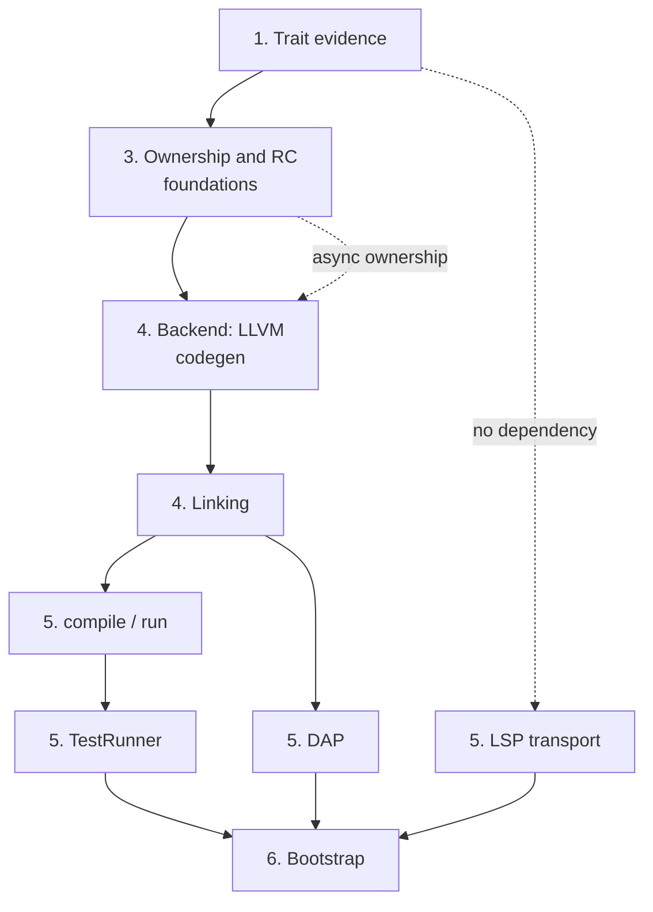

# Self-Hosting: Building the Ashes Compiler in Ashes

Status as of 2026-08-25. This document contains both the capability audit of what Ashes-the-language,
its compiler/runtime, and its standard library must provide before a compiler can be written in Ashes,
and the implementation handoff for the active self-hosted toolchain migration. See
[FUTURE_FEATURES.md](FUTURE_FEATURES.md) for how self-hosting fits the broader roadmap and the
[self-hosted toolchain README](https://github.com/MattiasHognas/Ashes/blob/main/selfhost/README.md)
for package boundaries and commands.

## Migration state

The new implementation lives entirely under `selfhost/`. It is pure Ashes: Python, shell, C#, and
Node.js helpers are not part of its implementation or test path. The existing .NET toolchain remains
in the repository permanently as a buildable, tested stage-0 and behavioral reference after the
self-hosted compiler becomes the default. The Node.js VS Code extension also remains in the repository,
and so does the .NET registry server (`src/Ashes.Registry`): it is a deployed service, not part of the
toolchain a user runs, so only its client commands are ported. Neither implementation may be removed or
changed merely to make the self-hosted port easier.

| Area | Ported surface | State |
|---|---|---|
| Frontend | Tokens, UTF-8 source spans, lexer, typed syntax model, leading import-header separation, inline-module lifting and validation, expressions, patterns, types, and whole-program parsing for all current declaration forms | Implemented and covered by pure-Ashes tests; token streams also have shared stage-0/self-hosted parity fixtures |
| Formatter | Canonical formatting for complete programs, declarations, expressions, patterns, and types, including precedence and idempotence coverage | Implemented and covered by pure-Ashes tests |
| Semantics foundations | Stable symbols/scopes, semantic types, substitution, unordered open-row unification, constrained schemes, and source type resolution | Implemented and covered by pure-Ashes tests |
| Expression/program inference | Core and structural expressions, operators, records, guarded matches, Result pipelines, `let?`, annotations, constructors, recursive groups, aliases, zero-cost types, sequential top-level inference, and package-aware inference of dependency-ordered stitched modules | Implemented for the listed surface |
| Capabilities | Declaration and operation schemes, effect propagation, handlers and `resume`, provider registration, exact concrete provider satisfaction, abstract requirement preservation, and provider/handler ambiguity rejection | Implemented for inference; lowering and code generation remain |
| Traits | Operator constraints; trait declaration/method registration; forward supertrait validation; cycle rejection; qualified method schemes; default-body type checking; ordinary implementation registration with rigid heads, requirements, optional defaults, and type-checked supplied methods; deterministic duplicate/structural-overlap rejection; package orphan ownership for traits and nominal head types; decreasing conditional requirements; selected-default dependency validation; canonical constraints with transitive supertrait elimination; written binding-requirement boundary validation; recursive concrete instance evidence resolution; canonical failure traces; deterministic hidden-dictionary ABI shape planning; ABI-ordered call-site evidence argument planning; constrained-function application/partial-capture planning; active evidence forwarding with deterministic supertrait paths; active trait-method slot planning; concrete dictionary-construction input planning with supplied/default method selection; dependency-aware selected-method construction order; evidence transport destinations for direct functions, closures, aggregates, and async frames; constrained-value rewriting with hidden parameters, dictionary destructuring, and unambiguous method binding; constrained-reference rewriting with exact or inherited active evidence; concrete dictionary-value rewriting with selected method bindings and nested supertrait values; the shipped standard trait ABI plus primitive/structural implementation heads bound to rewritten `Ashes.Trait` source bodies; and deterministic, declaration-aware `deriving` expansion for ordinary and zero-cost nominal types | Declaration, ordinary implementation, coherence, termination, default-cycle, constraint-canonicalization, written `requires` validation, evidence-plan resolution, structured resolution failures, dictionary ABI layouts, call-site evidence arguments, constrained-function application plans, recursive/sibling evidence-forwarding plans, active method-access plans, concrete construction inputs, selected-method build order, value-transport plans, constrained-value/reference rewriting, concrete dictionary-value rewriting, standard implementation evidence/source binding, syntax-level deriving expansion, and semantic deriving eligibility validation implemented; physical IR lowering remains |
| IR, optimizer, ownership, backend, linker | Complete IR model/text form plus core lowering for constants, lexical locals, calls, closures, captures, control flow, recursion, structural values and patterns, operators, BigInt literals, and the shipped non-async/non-FFI builtin operations | In progress; external/evidence/async lowering, optimization, ownership, backend, and linking remain |
| CLI, LSP, DAP, TestRunner, fuzzing runner, registry commands | Package boundaries are defined; `fmt` and `init` are ported (see the checklist below) | Started |
| Bootstrap | No stage-1/stage-2 compiler build or equivalence comparison yet | Not started |

The current packages intentionally form the same strict dependency graph as the existing toolchain:
`frontend` has no compiler dependency, `formatter` depends only on `frontend`, and `semantics` depends
only on `frontend`. Do not move backend behavior into those packages. Future packages must follow the
dependency table in the
[self-hosted README](https://github.com/MattiasHognas/Ashes/blob/main/selfhost/README.md#package-dependency-graph)
and
must reference only the packages they actually consume.

### Planned work

Work should continue in dependency order. Each item below is a reviewable milestone or a short series
of milestones; split an item when its tests and public contract can stand alone. The six phases below
still hold at that granularity, but three keystone decisions gate the shape of everything under them —
naming them explicitly here keeps them from hiding inside a longer numbered item:

1. **Complete trait semantics.** Thread evidence through every value shape and lower dictionaries and
   method dispatch. Add `deriving` expansion only after ordinary evidence works end to end. The
   remaining gap is one architectural decision — call-site dictionary forwarding, under "Traits,
   implementations, and evidence" below — blocked on making `CoreLowering`'s own local type
   reconstruction constraint-aware, or merging it with the external inference pass into one
   type-variable space. Every other item in this phase (concrete dictionary construction, the standard
   trait ABI, `deriving`'s physical lowering, and the "supply evidence from a requirement's instantiated
   type, never trait name alone" item under "Optimization, ownership, and reuse", which is the same gap
   seen from the ownership side) is inert until one of those two paths lands. Verify generic capability
   evidence disambiguation (under "Capabilities and handlers") before writing any code for it —
   inference's own provider-ambiguity rejection may already make it unreachable in practice.
2. **Close whole-program semantic gaps.** Port import/module and export resolution, external declaration
   typing and ABI metadata, package/project stitching, remaining declaration namespace rules, exhaustive
   diagnostics, and any expression/type-inference behavior not yet represented by the focused tests.
   Compare observable results with the C# compiler rather than copying its internal object graph. This
   phase does not depend on phase 1 and is largely residue — small, self-contained items (resource
   move/borrow/consume rules, the registry/lock-file graph's network half, source-function origins
   through the future IR) that can close out alongside it rather than after it.
3. **Define and lower the complete IR.** Port the current IR model and text form, expression and
   declaration lowering, trait/capability evidence, async state machines, optimization passes, ownership
   and move analysis, Perceus lifetime placement, reuse, and compiler explanation/tooling metadata. Keep
   ownership inferred and retain the current no-GC memory contract. Internally this phase has its own
   hard order, under "Optimization, ownership, and reuse": heap layout classification (copy /
   RC-managed / resource / borrowed-view / region / unsupported — build the tagless single-constructor
   ADT layout against this classifier from the start, not bolted on afterward) comes before the
   ownership/move-analysis pass (parameter/capture ownership, freshness, reachability, borrows,
   forwarding, whole-program SCC provenance), which comes before Perceus duplication/drop insertion
   itself. Almost every other item in that section is a *port*, not new design — each already has a
   stage-0-proven fix, and several have a minimized repro or a written regression test from this
   project's own history. The highest-value single ports, each covering several crash shapes at once:
   retaining runtime-managed children in an escaping/owning aggregate (the class stage-0's #608 closed),
   releasing a pattern-bound value passed by name as a TCO back-edge argument (the class stage-0's
   fannkuch-redux investigation closed — 2.4 GB to a flat 8.2 MB), and supplying trait evidence from a
   requirement's instantiated type rather than by name (the class stage-0's #650 closed). Reuse
   (structural droppers, safe allocation reuse) and coroutine-frame/async ownership close out this
   phase; cross-mode validation and the `ownership`/`rc`/`reuse`/`memory` explain snapshots prove it
   held.
4. **Port native code generation and linking.** Implement LLVM emission, target ABI handling, runtime
   and bitcode selection, ELF/PE construction, external libraries/resources, debug information, and all
   four target RIDs. Start with the host target but preserve target-independent APIs from the outset.
   LLVM C API bindings and host `libLLVM` loading gate everything else under "LLVM code generation and
   runtime integration"; IR emission needs phase 3's ownership/RC shape settled, but not every one of
   its bug-class items fixed first. Under "Object parsing and executable linking", object parsing gates
   the four target layouts, which are then independent of each other — do linux-x64 first, since it
   unblocks every later phase that only needs one working target. The `musttail` upgrade item (under
   "Optimization, ownership, and reuse") is explicitly blocked on this phase existing; the
   scheduler/async runtime item needs phase 3's coroutine-frame ownership decided first.
5. **Port the toolchain consumers.** Build the Ashes CLI orchestration and registry commands, then the
   TestRunner, LSP, DAP, and deterministic fuzzing/fuzzyrunner packages. LSP and DAP remain consumers of
   compiler packages; they must not duplicate parsing, inference, lowering, or runtime behavior. `fmt`,
   the manifest commands (`init`/`add`/`remove`/`restore`/`tree`/`why`), and the LSP transport itself
   have no dependency on phase 4 at all — the formatter, `ProjectSupport`, and frontend/semantics are
   already done, so these can start as soon as there is time for them rather than waiting their turn.
   `compile`/`run`/`repl`, by contrast, need phase 4 finished end to end, and TestRunner needs `compile`
   and `run` before it can compile a single test. DAP needs phase 4's debug information and a real,
   linked executable to attach to. The full `.ash` corpus run through both toolchains, at the end of
   this phase, is the first honest parity signal for the whole port.
6. **Bootstrap and prove parity.** Produce a stage-1 compiler with the existing compiler, use stage 1 to
   build stage 2, compare deterministic compiler artifacts or normalized observable output, and run the
   same source/test corpus through both implementations. Add reproducible bootstrap and release jobs
   only after host-target parity is stable, then extend execution/structural validation to every RID.
   Grow the standing phase benchmark at every milestone along the way, not only here — it has already
   surfaced four real stage-0 memory bugs in one week of use, and a crashing corpus file it finds is a
   bug to record, not a file to quietly exclude.

### Toolchain implementation checklist

This is the authoritative feature inventory for the self-hosted toolchain. It tracks observable
compiler and tool behavior, not the presence of similarly named data types. The status markers are:

- `[x]` — implemented in pure Ashes and covered by an executable pure-Ashes test;
- `[~]` — a useful part is implemented, but the current compiler's complete observable contract is
  not yet covered;
- `[ ]` — not implemented in the self-hosted toolchain.

The checklist covers the currently shipped toolchain. Features explicitly listed as unsupported or
future work in the language reference are not self-hosting requirements until they become part of the
shipped language. The existing C#, .NET, and Node.js implementations remain the compatibility oracle;
their internal class boundaries are not requirements when a smaller pure-Ashes design preserves the
same public behavior.

#### Package and test foundations

- [x] Define pure-Ashes `frontend`, `formatter`, and `semantics` packages with the required dependency
  direction and no host-language implementation helpers.
- [x] Keep package tests in separate `devDependency` projects and compile them into standalone native
  executables.
- [x] Exercise frontend, formatter, and semantics tests with reuse enabled and with
  `--debug-disable-reuse`.
- [x] Supply the language, standard-library, host-environment, filesystem, process, byte-buffer, JSON,
  regex, and installed-layout capabilities identified by the prerequisite audit below.
- [x] Document every production module's responsibility and load-bearing invariants, preserving
  behaviorally relevant stage-0 contracts without copying host-language API boilerplate.
- [~] Add cross-implementation parity fixtures as each self-hosted phase gains a stable serialized
  public result. Versioned token-stream fixtures now compare every public token field between stage 0
  and the pure-Ashes lexer; syntax, formatted source, diagnostics, inferred schemes, IR, and executable
  parity formats remain.
- [x] Make every self-hosted package buildable from a restored source-only dependency graph without
  undeclared checkout-relative inputs.

#### Frontend and source model

- [x] Model tokens, structured diagnostics, and canonical UTF-8 byte spans.
- [x] Lex identifiers, keywords, operators, comments, whitespace, strings, runes, signed and unsigned
  integers, floats, and malformed input, including Unicode scalar validation.
- [x] Model the complete typed syntax surface for programs, declarations, expressions, patterns, and
  type expressions without collapsing those categories.
- [x] Parse literals, variables, qualified references, calls, tuples, lists, records, record updates,
  unary/binary operators, pipes, and their precedence and associativity.
- [x] Parse lambdas, conditionals, nested and recursive bindings, `let?`, `let!`, matches, guards,
  handlers, `perform`, and every current pattern form.
- [x] Parse named, applied, tuple, function, pointer, capability-row, annotated, and constrained type
  syntax.
- [x] Parse exports, aliases, algebraic/record/zero-cost types, flat top-level bindings, recursive
  groups, and optional trailing expressions after the project layer has separated any import header.
- [x] Parse external functions and types, ownership annotations, resources and destructors, native
  strings, pointers, buffers, out parameters, capability rows, and `symbol@library` aliases.
- [x] Parse capability declarations, static providers, trait declarations, implementations,
  supertraits, requirements, defaults, and deriving clauses.
- [x] Preserve source-ordered recovery diagnostics and the current declaration-boundary behavior for
  incomplete editor input and project-stitched programs.
- [x] Compare the complete frontend diagnostic corpus with the C# frontend by diagnostic code, span,
  ordering, and recovery result rather than only by accepted syntax. Adds a versioned
  `ashes-diagnostic-v1` parity fixture format (`DiagnosticSerialization` in both stage 0 and pure
  Ashes, mirroring the existing `ashes-token-v1` token-parity format) under `parity/frontend/diagnostics`,
  covering representative lexer and parser malformed-input fixtures — unterminated strings, invalid
  and out-of-range numeric literals, unexpected characters, missing expressions/patterns, trailing
  tokens, a refutable let-pattern, `and` without `let recursive`, and a constructor-less type — each
  serializing the diagnostic code, span, message, and the count of top-level items still recovered
  despite the error, comparing to stage 0 via `SelfhostDiagnosticParityTests` and to the pure-Ashes
  parser via `selfhost/tests/frontend-diagnostic-parity`. **Found while porting:** the pure-Ashes
  lexer picked the wrong one of two distinct unsigned-integer-literal diagnostics for a value that
  overflows 64 bits (it validated only against the target suffix width, never against whether the
  value fits an unsigned 64-bit integer at all, which stage 0's `ulong.TryParse` checks first); an
  unmatched closing paren/bracket/brace in a malformed top-level value drove the declaration-boundary
  token-splitter's depth counter negative, permanently disabling boundary detection for the rest of
  the file instead of just the one malformed declaration; `parseProgram`/`parseExpression`/
  `parseTypeExpression` each invented their own "unexpected token after end of program/expression/type
  expression" wording where stage 0 reports one generic "...after end of expression" message from a
  single shared check, now unified the same way (`parserEnsureEndOfInput`); the refutable-let-pattern
  diagnostic reported a one-token span read from the diagnostic list well after the pattern's own
  span had been reclaimed by later parsing, rather than the pattern's own span — fixed with the same
  `Ashes.Internal.deepCopy` idiom already established elsewhere in this port for values that must
  outlive their enclosing arena scope; and one parser diagnostic (a constructor-less type declaration)
  always attached the `ASH003` code where stage 0 attaches none. A pre-existing pure-Ashes lexer test
  asserting the wrong message for a `u64` literal one past its maximum was corrected to match stage 0
  once the fix above surfaced it.

#### Formatter

- [x] Canonically format every expression, pattern, and type form while preserving precedence.
- [x] Canonically format complete programs and every top-level declaration form.
- [x] Preserve intentional source spellings where the formatter contract requires them and sort only
  semantically unordered surfaces such as requirement sets.
- [x] Cover golden output, parse-format-parse behavior, and formatter idempotence.
- [x] Preserve written import headers and leading/standalone comments around the formatted AST body.
  Pure Ashes now formats a whole file the way the `fmt` command does (`formatSource` in
  `SourceFormatting.ash`): the leading `//` comment block and blank lines are split off verbatim,
  every `import` line is lifted out and re-rendered canonically (`import Path[.selector][ as Alias]`,
  with a malformed `import ` line reported as `InvalidImportLine`), the remaining body is parsed and
  formatted, and each standalone comment line is reinserted before the formatted line whose
  whitespace-insensitive lexer-token signature (and occurrence number) matches its original next
  anchor, falling back to after its previous anchor and then to the top of the file, so no comment
  text is ever dropped. Comment lines keep their written text and indentation; the join uses the
  requested line ending.
- [x] Apply formatter options for indentation/newlines and preserve the current pipeline-layout choice
  made from the source form. Pure Ashes exposes `FormattingOptions` (`indentSize`, `useTabs`,
  `newLine`), `formattingOptionsDefault`, `formattingOptionsNormalize`, and
  `formatProgramWithOptions`/`formatExpressionWithOptions`, applied as a post-processing rescale pass
  (`formatterApplyOptions`) over the formatter's fixed-4-space, `\n`-terminated internal output
  rather than threading options through every writer, exploiting the invariant that every leading
  run of spaces in that output is an exact multiple of 4. Pipeline-layout preservation threads a
  `preferPipelines : Bool` parameter through the whole expression-formatting chain and adds pipeline
  collection (`formatterTryCollectPipeline`/`formatterCollectPipelineStages`): a nested call chain
  `g(f(x))` collects into `x |> f |> g` when enabled, all-or-nothing (any non-eligible function
  anywhere in the chain rejects the whole conversion), requiring at least two stages, and stopping
  collection at a capitalized constructor call once an outer stage already exists so `h(Some(f(x)))`
  renders as `h(x |> f |> Some)` rather than absorbing `h` into the chain. **Found while porting:**
  stage 0's C# formatter (`Formatter.cs`) had a pre-existing double-conversion bug — 6 call sites in
  `WriteMultilineCall`/`WriteListLiteral`/`WriteRecordLit` appended `options.NewLine` directly instead
  of the internal `'\n'` convention used everywhere else, so `FinishOutput`'s single blanket
  `"\n"` → `options.NewLine` pass converted an already-CRLF newline a second time (`\r\r\n`); fixed to
  match the rest of the file, with a regression test. Also found while porting: the initial selfhost
  port built pipeline stages by consing each newly discovered outer stage onto the front of the list
  while walking outer to inner, which already leaves the list in the correct innermost-first render
  order, then reversed it again before returning — flipping `x |> f |> g` into `x |> g |> f`; fixed by
  dropping the redundant reversal.
- [x] Keep the parentheses around a record update used as a record-literal field value: `fmt`
  rewrote `Value(state = (inner with currentSpan = previous), temp = temp)` to
  `Value(state = inner with currentSpan = previous, temp = temp)`, where the update absorbs the
  following fields, so the formatted file no longer compiled (`Missing field 'temp' in record
  literal`). Formatting must never change what a file parses to. **Found while porting the located
  core lowering.** Stage 0 now renders record-literal field values (inline and multiline), multiline
  call arguments, and multiline list elements at the precedence just above `with` whenever their
  own unparenthesized right edge is a record update (the update itself, or the trailing body of a
  `let`/lambda/`if`/`match`/`handle` ending in one) **and** another field, argument, or element
  follows — the last one in the list needs no such protection, since its own closing bracket already
  ends the update; getting this wrong (parenthesizing every occurrence regardless of position) was
  caught by reformatting the whole repository and finding spurious new parentheses on already-correct
  committed code. The rule is written into the formatter reference. Pure Ashes lacked the rule at
  every one of those sites and now ports it in full (`formatterEndsWithRecordUpdate`,
  `formatterFieldPrecedence`, gated on a following sibling at each call site), covered by the
  record-literal (inline, multiline, lambda-bodied, and last-field-needs-no-parens), update-field,
  call, tuple/list, and scrutinee cases in `selfhost/tests/formatter/Main.ash`.
- [x] Compare the full formatter corpus and malformed-input behavior with the C# formatter. A first
  whole-file pass over the self-hosted sources (`formatSource` on `ImportHeader.ash`,
  `SourceFormatting.ash`, the formatter test entry, and `StandardTraits.ash`) found one crash,
  root-caused and fixed 2026-08-26. **Minimized repro**: `let dummyPadding = (let fillCases names
  = names in fillCases(1))` — any nested `let name param = ...` binding — segfaulted reading a
  corrupted tail from its `sugarParameters: List(Str)` cons cell, reached through `formatProgram`'s
  deep-copy of the parsed `Expr` tree (or equally through a bare `Ashes.Collection.List.length` on
  the field with no formatter involved). A hardware watchpoint on the corrupted cell's tail word
  (`0x7ffff3401910` in one run) caught it initialized correctly to `0` (empty-list) by
  `parserParameterNames`, then overwritten with garbage by an unrelated allocation inside
  `parserExprEnd`/`parserExprSpan` — called immediately afterward, in
  `parserParseTopLevelBinding`'s own `(binding, parserExprEnd(value), ...)` return-tuple
  construction. The nested let's sugar-parameter list lives arbitrarily deep inside `value` (the
  parsed value expression of the *outer* binding); the compiler's arena/bracket accounting
  considered the nested let's parse-local temporaries reclaimable once its own parsing finished,
  not accounting for this list still being reachable through the still-live `value`, so the very
  next allocation (`parserExprEnd`'s own span construction) reused and clobbered its memory. Eleven
  earlier fix attempts targeting the list's own construction/copy-out (deep-copying the extracted
  name, deep-copying the whole tuple-list, hand-written list copiers, non-tail-recursive rebuilds,
  reordering double-uses, two C# ownership-analysis fixes) all failed because none of them widened
  the *scope* of what needed to survive — the list, not `value` as a whole. Fixed in
  `parserParseTopLevelBinding` (`selfhost/packages/frontend/src/AshesCompiler/Frontend/Parser.ash`)
  by deep-copying `value` itself immediately after `parserBuildLambdas` builds it, before
  `parserExprEnd` or anything else runs: `parserBuildLambdas(parameters)(rawValue)(name.position) |>
  Ashes.Internal.deepCopy`. `Ashes.Internal.deepCopy` on an `Expr` (a recursive, multi-constructor
  ADT the compiler's `AdtDeepCopier` machinery fully supports) forces every nested arena-placed
  structure into a fixed-watermark-safe copy while everything is still valid, closing the reuse
  window. Verified against the minimized repro, the full self-hosted formatter and semantics test
  suites, and the full C# (`Ashes.Tests`, `Ashes.Cli.Tests`) and end-to-end `.ash` suites — all pass.
  Ruled out along the way (kept for anyone hitting a similarly-shaped bug): reuse-specialization,
  the whole IR optimizer, and two confirmed-but-separate instances of a generic-`reverse`-of-
  heap-composite-accumulator bug (see the item below).
  The top-level boundary splitter no longer cuts a declaration value at an indented `then`/`else`/
  `in`/pipe line after a completed call (only a token that can start a whitespace-application
  argument begins the trailing expression, as in stage 0); that gate was found by the same pass.

#### Semantic foundations and ordinary inference

- [x] Model stable symbols, qualified identities, immutable lexical scopes, and deterministic fresh
  type variables.
- [x] Model semantic primitive, unsigned, function, tuple, list, pointer, named, capability, and open-row
  types.
- [x] Compute free variables, substitutions, occurs checks, structural unification, generalization,
  instantiation, and constrained rank-1 schemes.
- [x] Unify capability rows independently of declaration order and allow open tails to absorb unmatched
  capabilities.
- [x] Resolve source primitives, parameters, functions, tuples, pointers, aliases, nominal types,
  zero-cost types, and capability rows.
- [x] Infer literals, variables, lambdas, calls, tuples, lists, conditionals, ordinary lets, recursive
  lets, and annotations with let-polymorphism.
- [x] Infer all operator families while retaining their trait constraints.
- [x] Infer matches, guards, literal/list/tuple/constructor/record/as/or patterns, and consistent
  pattern-local bindings.
- [x] Register algebraic, record, alias, and zero-cost declarations; infer constructors, constructor
  patterns, record literals, and record updates.
- [x] Infer `Result` map/flat-map/error-map pipelines and `let?` propagation.
- [x] Infer sequential top-level bindings, shared-monomorphic recursive groups, and an optional trailing
  expression.
- [x] Infer async bodies, `await`, `let!`, task result/error propagation, and structured task APIs.
  Pure Ashes now seeds the standard `Task(e, a)` type next to `Maybe` and `Result` and types
  `await task` as stage 0 does: the operand must unify with `Task(e, a)` for a fresh error/success
  pair (`ExpectedTaskType` otherwise) and the expression is the `Result(e, a)` the task runs to, so
  a `let!` binding (the parser's `let x = await e`) exposes that `Result` to its body and the
  ordinary `let?`/`Result` propagation applies from there. The structured task APIs (`Ashes.Task`)
  are ordinary standard-library bindings typed through module stitching, and lowering `await` to
  `RunTask`/`AwaitTask` belongs to the core-lowering coverage of async bodies.
- [x] Perform complete match exhaustiveness, redundancy, large-ADT hardening, and source-compatible
  diagnostic reporting. Pure Ashes now checks every typed match once its arms are inferred
  (`matchCoverageError`): constructor patterns from two ADTs, unreachable arms (after a catch-all, a
  repeated literal, constructor, or composite pattern), missing constructors of an ADT scrutinee
  (with the `Result` wording, the five-constructor listing limit, and the "... and N more"
  truncation), a list scrutinee missing `[]` or `x :: xs`, half-covered bools, and the per-field
  missing-pattern search over lists, tuples, constructors, bools, and literals, reported with stage
  0's message text as `NonExhaustiveMatch`, `UnreachableMatchArm`, and
  `ConstructorPatternsFromDifferentAdts` inference errors; or-alternatives, as-patterns, and record
  patterns are expanded to plain positional patterns first, exactly as stage 0's diagnostic
  pre-pass does. Stable `ASH###` codes for these messages remain uncoded in stage 0 as well.
- [ ] Enforce resource move/borrow/consume rules, deterministic cleanup constraints, and use-after-move
  diagnostics at the semantic boundary.
- [~] Seed the shipped standard trait/type identities and primitive/structural implementation heads so
  ordinary evidence resolution no longer depends only on focused test declarations. The remaining
  builtin and standard-library value/type environment must be populated through module stitching.
- [x] Validate every written binding `requires` clause against the inferred canonical external
  requirement set, including recursive groups and ambiguity checks.
- [~] Port the remaining declaration namespace, duplicate-name, shadowing, annotation, and inference
  diagnostics with stable codes and source spans. `ASH013` (duplicate top-level binding) shipped
  with the whole-program lowering entry point (#639). **`ASH014` (forward reference) now also
  shipped**: `lowerCoreVariable`'s final "name not found anywhere ordinary" fallback checks a new
  `CoreLoweringState.topLevelNames` (every top-level value-binding name in the whole program,
  collected once up front by each whole-program entry point) before falling back to the generic
  `UnknownLoweringBinding` — if the name IS a real top-level binding, just not yet visible under
  Model A's sequential scoping (declared later in the file, or a plain, non-`recursive` self-
  reference), reports `ForwardTopLevelReference` instead. Mirrors stage 0's
  `LowerVarUnbound`/`_topLevelBindingNames` specialization
  (`Lowering.cs:2844`/`Lowering.TopLevel.cs:377`) closely — same two-set-membership design, ported
  directly since (unlike the trait-evidence problem above) this needs no external inference data at
  all, only the `ProgramSyntax` already being lowered. Regressions:
  `expectForwardReferenceToLaterBindingIsRejected`, `expectSelfReferenceWithoutRecursiveIsRejected`,
  `expectGenuinelyUnknownNameStillRejectedAsUnknown` (proving the two error paths — forward
  reference vs. genuinely undefined — stay correctly distinguished). **Correcting an assumption
  from this same pass**: `ASH016` (conflicting unqualified import selectors) is NOT missing —
  `ImportResolution.ash`'s `resolveImports`/`ConflictingResolvedImport` already detects exactly this
  (two selectors resolving to the same local name), is called from the real pipeline
  (`ModulePlan.ash`), and is tested (`ImportResolutionTests.ash`'s `checkResolvedCollision`); it's
  covered by the "Resolve whole-module, aliased, value-selector, and type-selector imports..."
  item's own "post-resolution collision checks" clause, already `[x]` elsewhere in this file — this
  paragraph should not have called it unported without checking. `ASH015` (`and` without a
  preceding `let recursive`) genuinely has no stage-0 reference implementation to port at all — no
  trace of its message or a dedicated check anywhere in `src/Ashes.Semantics`/`src/Ashes.Frontend`;
  either the parser's own syntax rules already make a bare `and` unreachable, or this is a
  documented-but-unimplemented-in-stage-0 code, the same "stable codes remain uncoded in stage 0"
  situation the match-exhaustiveness item above already flags for a different diagnostic family. Not
  something to port until stage 0 has a real implementation to port from.

#### Capabilities and handlers

- [x] Register capability declarations and parameter-sharing operation schemes.
- [x] Propagate ambient effects through implicit/explicit operations, lambdas, ordinary and
  higher-order calls, partial application, and `Result` pipelines.
- [x] Infer handler operation arms, shared instances, `resume`, return arms, arm effects, and residual
  row discharge.
- [x] Register complete, coherent, instance-specialized static providers and type-check their operation
  implementations.
- [x] Satisfy exact concrete capability requirements from providers while retaining abstract
  requirements and rejecting provider/handler ambiguity.
- [x] Lower dynamic handler evidence, one-shot continuation state, pre/post handler control flow, and
  dynamically scoped handler globals into IR. Correcting a stale duplicate of this item: fully done
  as of #646 — see the "Lower capability handlers/providers and trait evidence" entry below for the
  detailed history (dynamically scoped handler globals and evidence save/switch/restore: #640/#641;
  one-shot continuation state, the full `TryRewriteResume` family: #641-#646; pre/post handler
  control flow, the posts-fold mechanism: #642, exercised end-to-end by every one-shot test since).
- [~] Lower static-provider dictionaries and generic capability evidence into IR. Static-provider
  dictionaries: done and tested (`emitStaticProviderCall`, `CoreCapabilityLowering.ash`). Generic
  capability evidence: **matching logic fixed; whole-program wiring still open.** Stage 0 registers
  a static provider under a key built from its capability name AND its resolved type arguments
  (`Lowering.Capabilities.cs`'s `BuildProviderKey`/`_providers`), so `provide Log(Int)` and
  `provide Log(Str)` in the same program are two distinct, individually valid registrations —
  inference's own ambiguity rejection (ASH026/ASH027, the item above this section) only fires on
  two providers sharing the exact same key, never on two providers sharing only a capability name,
  so it does NOT guarantee `staticProviders` is free of same-named entries the way handler-arm
  completeness turned out to already be enforced at the inference phase. `findStaticProvider` used
  to match by `capabilityName` alone, ignoring `CoreStaticProviderLayout.typeArguments` entirely, so
  it could never distinguish the two. **Fixed**: `findStaticProvider` now also takes the caller's
  own `requiredTypeArguments : List(SemanticType)`. Given a specific, concrete type argument (the
  common case — a `provide` declaration's own type arguments are always concrete, no free
  variables, so structural equality is meaningful regardless of which pass produced either side),
  it picks the exactly-matching provider regardless of registration order
  (`expectExactTypeArgumentsSelectTheMatchingProvider`,
  `selfhost/tests/semantics/CoreCapabilityLoweringTests.ash`). Given `[]` (the only shape
  `CoreLowering.ash`'s own call site, `lowerPerform`, can supply today), it matches by name alone
  only when every candidate for that name shares the same type arguments — including the common
  case of a non-generic capability — and correctly reports no match (ambiguous) rather than
  silently picking whichever provider is listed first when they genuinely diverge
  (`expectAmbiguousProvidersWithoutRequiredTypeArgumentsAreUnresolved`).
  **Still open, deliberately out of scope for this fix**: unlike the call-site trait-dictionary
  forwarding gap above (fixed via a pure pre-lowering AST rewrite over the external
  `TypeEnvironment`), there is no analogous existing whole-program entry point here to extend —
  `CoreStaticProviderLayout(...)` is still constructed nowhere outside test fixtures, so
  `lowerPerform`'s static-provider branch remains unreachable from a real compile.
  `TypeEnvironment.providers : List(CapabilityProviderInferenceDefinition)` carries each provider's
  resolved `capabilityType`, but `CapabilityProviderOperationInferenceDefinition` only carries an
  operation's `name`/`semanticType`, not its implementation `Expr` — wiring real provider info needs
  new infrastructure to also walk the parsed program's own `ProviderDecl` AST nodes for those
  bodies, not just a `TypeEnvironment` lookup (a bigger, separate slice). Even once that exists,
  deriving `lowerPerform`'s own `requiredTypeArguments` per call site is not always as simple as
  reading an argument's type — an operation whose capability type parameter appears in RETURN
  position (e.g. `State`'s `get : Unit -> a`) has no argument to read it from at all.
- [ ] Validate capability explanations and observable behavior against normal, optimization-disabled,
  and reuse-disabled C# compilation.

#### Traits, implementations, and evidence

- [x] Infer operator constraints and retain them in generalized schemes.
- [x] Register trait declarations, qualified method schemes, forward supertraits, acyclic supertrait
  graphs, and type-checked default bodies.
- [x] Register ordinary `implement` declarations with resolved rigid heads, requirements, supplied
  methods, and inherited defaults.
- [x] Validate implementation trait/arity, method uniqueness and completeness, substituted method
  signatures, capability rows, and requirement variables.
- [x] Reject exact duplicate and structurally overlapping implementation heads independently of source
  or traversal order.
- [x] Track package provenance for traits and nominal head types and enforce the orphan ownership rule.
- [x] Validate decreasing conditional requirements for generic implementation heads while allowing
  fixed requirements on fully concrete heads.
- [x] Reject dependency cycles among the defaults selected by an implementation while allowing a
  supplied method override to break the cycle.
- [x] Canonicalize constraints, remove exact duplicates, and remove supertraits implied by stronger
  constraints.
- [x] Validate written binding `requires` clauses against inferred canonical constraints, including
  nested lets, recursive groups, invalid trait heads, and ambiguous requirement variables.
- [x] Resolve unique concrete instances recursively with cycle/depth guards while preserving abstract
  constraints as hidden dictionary parameters.
- [x] Diagnose missing, ambiguous, incoherent, non-terminating, and ambiguous-type-variable goals with
  canonical requirement traces.
- [~] Plan hidden trait dictionary parameters, method fields, specialized direct-supertrait fields,
  concrete-or-parameter call-site evidence arguments in deterministic ABI order, and ordinary
  arity/remaining-argument evidence capture for constrained partial applications. Plan exact and
  inherited active-dictionary forwarding across recursive and sibling call edges, including the
  selected method slot after following a supertrait path. Plan ABI-ordered supplied/default method
  fields, dependency-aware selected-method build order, and conditional-requirement/supertrait inputs
  for concrete dictionaries. Plan dictionary transport destinations for direct function parameters,
  closure captures, nested aggregate locations, and async frames. Rewrite constrained values with
  hidden dictionary parameters, deterministic dictionary destructuring, and unambiguous qualified
  method bindings. Rewrite constrained references with ABI-ordered exact or inherited active evidence.
  Physically thread dictionaries through the corresponding lowered representations. **First real
  wiring step taken**: `rewriteTraitConstrainedValue`/`rewriteTraitConstrainedReference`
  (`TraitEvidenceRewriting.ash`) — the elaboration functions this whole plan describes — were fully
  built and unit-tested in isolation but had ZERO real call sites; `CoreLowering.ash`'s whole-program
  entry points (`lowerCoreProgram`/`lowerCoreProgramWithSource`) also had no real caller and take
  only raw `ProgramSyntax`, no inference-result input at all. New `lowerCoreProgramWithEnvironment`
  takes a real `TypeEnvironment` (the same one `ProgramInferenceResult.environment` produces) and,
  for a plain (non-recursive) top-level `let` whose own generalized `TypeScheme` carries trait
  constraints, elaborates its value via `rewriteTraitConstrainedValue` before lowering — proven
  against genuine `inferProgram` output (not a hand-built fixture, unlike every existing
  `TraitEvidence*Tests.ash` file) for a user-declared trait, one `implement`, and one `requires`
  binding whose body calls the trait method. **Deliberately narrow first slice, not the whole
  epic**: recursive top-level bindings (`TopLevelLet(..., true)`/`TopLevelRecursiveGroup`) are not
  yet rewritten, and — critically — `rewriteTraitConstrainedReference` (call-site dictionary
  forwarding) is not wired at all, so a constrained binding now lowers correctly in isolation but
  any CALLER of it does not: the binding's value gains a hidden leading dictionary parameter that no
  call site supplies, so `describe(5)` against a `requires {Greet(a)}`-constrained `describe` fails
  lowering with a type mismatch (the dictionary ends up unified against the real argument). Proven
  by a regression that asserts exactly this failure mode without the rewrite, and sidesteps it by
  testing only the binding's own value, not a call site. Wiring `rewriteTraitConstrainedReference`
  into ordinary call/reference lowering is the natural next slice, and was attempted twice this
  session — see the two attempts below; both were reverted, but the second surfaced and fixed a
  real, independently-testable gap along the way. **Fixed: missing inherited-forwarding fallback.**
  `findTraitEvidenceForwarding`'s exact stable-key matching (`traitConstraintStableKey`, which
  embeds the raw type-variable id) can never match two independently-generalized schemes' "same"
  abstract requirement — each carries its own fresh quantified variable, with no reason to share an
  id. Stage 0 (`Lowering.TraitEvidence.cs`'s `FindActiveTraitDictionaryParameter`) has a fallback
  selfhost was missing entirely: when there's no exact match and the requirement is still abstract
  (a free variable, not yet unified with anything concrete), if there is exactly one active
  dictionary parameter for that trait name, use it — sound only because it's the only option; with
  two or more, no fallback fires and the ordinary missing-evidence rejection takes over. Added
  `findTraitEvidenceForwardingWithFallback` to `TraitEvidenceThreading.ash`, mirroring stage 0
  exactly. Regressions (`TraitEvidenceCallRewritingTests.ash`):
  `expectSoleActiveParameterFallbackCallRewrite` (the fallback fires correctly),
  `rejectAmbiguousActiveParametersCallRewrite` (and doesn't over-fire when genuinely ambiguous).
  This fix is real and shipped, but on its own is inert — nothing calls
  `rewriteTraitConstrainedReference` from real lowering yet (see the "attempted twice" note below
  for why not).
  **Call-site forwarding wired (PR #667), after two earlier attempts this session were reverted —
  read this before touching the mechanism again.** (1) checked a referenced name's RAW,
  un-instantiated scheme constraints (`bindingTraitConstraints`, straight from the external
  `TypeEnvironment`) at `ExprVar`-lowering time — failed even the simplest cases
  (`MissingActiveTraitEvidence`) because raw constraints from two different bindings' schemes never
  share a type-variable id, exactly the gap fix above closes. (2) Cross-referenced stage 0's actual
  solution (`InstantiateScheme` per reference, plus the fallback above) and re-implemented properly:
  `instantiateReferenceConstraints` (fresh per-reference instantiation via the existing
  `instantiate` primitive in `TypeSchemes.ash`) plus fixing two `generalize(...)([])` call sites in
  `CoreLowering.ash` that hardcoded empty constraints. Compiled clean, but a new inherited-forwarding
  test (`wrapper`, itself `requires {Greet(a)}`, calling `describe(y)`) **segfaulted** —
  root-caused to a genuine infinite substitution cycle: `generalize`'s `semanticType` argument (from
  `CoreLowering.ash`'s own LOCAL type reconstruction, its own local `typeSupply` numbering) and its
  `constraints` argument (from the EXTERNAL real-inference `TypeEnvironment`, a completely separate
  numbering space) get merged into one `TypeScheme`, but the two type systems share no variable
  space (unlike stage 0, where inference IS the lowering pass).
  **What actually shipped (third attempt) sidesteps both failure modes by never touching
  `CoreLowering.ash`'s local type reconstruction at all**: a pure pre-lowering AST rewrite
  (`rewriteTraitConstrainedTopLevelValue`/`rewriteTraitCallSiteReferences`,
  `TraitEvidenceRewriting.ash`) that walks a top-level binding's already-elaborated value using ONLY
  the external `TypeEnvironment`'s raw scheme constraints — the same un-instantiated constraints
  attempt (1) used, which is exactly why a naive version of this attempt was ALSO unsound: two
  bindings' raw scheme constraints for the same trait name are structurally indistinguishable
  (neither carries per-call-site instantiation), so a version that forwarded at any bare reference
  to a constrained binding, matched only by trait name, silently forwarded the WRONG evidence for an
  unrelated concrete call — proven by dumping the lowered IR of a deliberately adversarial test
  (`describe(5)` called from an unrelated unconstrained binding) and finding the callee's own
  first-class value had been wrapped into a bogus one-argument closure instead of a plain `Str`.
  **The fix**: forwarding only fires when the call's argument is syntactically one of the caller's
  OWN outermost lambda parameters (`outermostLambdaParameterNames`, fixed once per binding, never a
  literal/local/derived value) — sound because HM unification forces the callee's instantiated
  constraint variable to equal the caller's own parameter's variable whenever the argument really IS
  that parameter, so a match by trait name at that specific call site is never coincidental. This
  compiler's inference independently enforces that any live constraint be explicitly written and
  justified from the body (`MissingWrittenTraitRequirement`, `UnjustifiedWrittenTraitRequirement` —
  even `+` desugars through an implicit `Add` requirement), which is why a well-typed integration
  test for the pre-existing `MissingActiveTraitEvidence` diagnostic proved impractical to construct;
  that path's coverage remains in `TraitEvidenceForwardingTests.ash`/`TraitEvidenceCallRewritingTests.ash`.
  New coverage: `CoreProgramLoweringTests.ash`'s `expectCallSiteForwardingLowersWithEnvironment`
  (the `wrapper`/`describe` success case) and `expectUnguardedConcreteCallStaysUnrewrittenAndTypeMismatches`
  (the guard correctly declining a literal argument, leaving the pre-existing type-mismatch
  behavior intact rather than miscompiling). Full traces of all three attempts are in project memory
  (`project_selfhost_port_progress_2026_08_26.md`, `project_capability_provider_evidence_gap.md`)
  for whoever picks up the remaining pieces (recursive-binding value elaboration, concrete/global
  call-site resolution for an unconstrained caller).
- [~] Rewrite concrete dictionary construction into dependency-ordered selected method bindings,
  ABI-ordered fields, and recursively constructed inherited evidence. Lower those values, default
  dispatch, method selection, and safe concrete specialization into IR without changing unoptimized
  behavior.
- [~] Register the shipped standard trait ABI and primitive/structural implementation heads, including
  recursive evidence requirements and stable compiler-private implementation references. The stitching
  phase now binds those references to rewritten `Ashes.Trait` source bodies by alpha-normalized
  implementation-head structure; physical dictionary lowering remains.
- [~] Expand `deriving {Eq, Ord, Show, Hash}` into ordinary implementations before coherence checking.
  Ordinary and zero-cost nominal declarations now expand in written order, retain only payload-relevant
  type-parameter requirements, generate deterministic method bodies, and participate in ordinary
  coherence and evidence resolution. Function, pointer, task, unbound-variable, and non-regular
  recursive fields are rejected. A stitched-program declaration context also rejects builtin and
  declared resources, opaque external types, capabilities, and transparent aliases to unsupported
  fields independently of declaration or module order. Physical dictionary and method lowering remains.

#### Modules, projects, externals, and whole-program semantics

- [x] Separate and validate leading import headers while preserving their written forms, aliases,
  selectors, source lines, and imports-stripped UTF-8 body offsets for formatting and diagnostics;
  retain uppercase-final paths for the resolver to disambiguate as modules or type selectors.
- [x] Resolve whole-module, aliased, value-selector, and type-selector imports using typed module
  interfaces, longest-module-path ambiguity rules, export validation, and post-resolution collision
  checks. Map module names to source paths and select project, include, dependency, or shipped-library
  sources with ambiguity and reserved-namespace checks. Construct deterministic reachable-module plans
  in dependency-first order, reject cycles, and enumerate filesystem-backed sources deterministically.
- [x] Validate explicit exports and build value/type/constructor/submodule interfaces from parsed
  programs without exporting externals, trailing bodies, private declarations, or imported modules
  implicitly.
- [x] Enforce sequential visibility, qualification, reserved namespaces, module cycles, and stable
  compiler-private names across stitched modules. Dependency planning, cycle rejection, and
  dependency-ordered semantic scopes assign deterministic definition identities, record ordinary
  versus recursive visibility boundaries, realize resolved selectors and whole-module imports, validate
  full/short qualifiers and collisions, and assign stable public and compiler-private names. Syntax-tree
  rewriting preserves lexical shadows and source spans while replacing declaration, value, constructor,
  type, trait, and capability references with those compiler names.
- [x] Parse and validate typed `ashes.json` manifests, including entry extensions, package versions,
  defaults, source roots, includes, output settings, registry/path dependencies, dev dependencies,
  root-level local `overrides`, and forward-compatible unknown fields. Filesystem path resolution and
  entry existence checks belong to project discovery.
- [x] Discover projects upward, honor explicit project selection, load manifests, resolve project
  paths, validate entry existence, and deterministically plan reachable modules from source-only
  packages.
- [~] Resolve path and registry package graphs, lock files, package identities, one-version-per-package
  coherence, and program-global providers/implementations. Recursive path dependency resolution,
  dev-dependency propagation, cycle and namespace validation, diamond deduplication, and compilation
  planning across dependency source roots are complete. The typed versioned lock-file model, strict
  parser, selected-manifest lock-path mapping, content-addressed cache-path mapping, consumption of
  restored locked packages as validated dependency source roots, and root-only local override
  substitution with exact locked namespace/version checks are also complete; dependency-declared
  overrides are ignored. Registry resolution, cache materialization, and hash verification remain.
  Stitched-project inference now accumulates providers and implementations in one program-global
  environment.
- [~] Stitch the complete project while preserving original file/module spans, definition identities,
  package provenance, and source-function origins. Semantic definition plans now retain source spans,
  source paths, module names, package identities, qualified names, and compiler names; rewritten module
  syntax retains its `At` spans. Rewritten modules are now combined in dependency order, compile-time
  exports and non-entry bodies are removed, the single entry body is retained, and half-open module
  regions plus definition-to-item placements preserve deterministic source/package provenance.
  The combined declarations are inferred in that same order while switching package ownership at every
  module boundary; deriving output stays module-local while eligibility validation shares the stitched
  declaration context, trait orphan checks retain package identity, and implementation coherence is
  program-global. Retaining source-function origins through the future IR remains.
- [x] Lift and resolve inline modules, enforce their restricted declaration surface, and integrate them
  with cross-file imports, exports, aliases, and selector ambiguity rules. Pure-Ashes lifting covers
  header recognition, indentation and dedenting, nested name composition, child-before-parent order,
  same-scope qualifier rewriting, and restricted-body, reserved-name, and duplicate-name validation.
  Reachable compilation planning now publishes synthetic sources with stable provenance, orders nested
  children before parents, rejects reachable file/inline collisions, honors compatibility and explicit
  parent exports, and resolves cross-file whole-module, alias, value-selector, and uppercase type imports.
- [x] Type external functions, opaque/declared resource types, ownership modes, native strings, arrays,
  pointers, buffers, out parameters, symbols, libraries, and capability requirements. External opaque
  types are registered before function typing; source-call shapes omit compiler-owned out parameters,
  append their values to results, retain ABI syntax for validation, and keep direct-only contracts out
  of first-class bindings.
- [x] Validate external ABI combinations and produce the metadata required by lowering, code generation,
  linking, LSP, and package capability auditing. Pure-Ashes validation resolves transparent aliases and
  zero-cost representations, preserves ordered parameter/source shapes and native ownership, verifies
  resource and owned-string destructors, and publishes canonical function, resource, symbol/library,
  direct-call, and sorted runtime-authority metadata with the inferred program.
- [x] Match the current compiler's entry-expression rules, project diagnostics, and deterministic
  diagnostic ordering across files. Declaration-only entries infer Unit, non-entry trailing bodies
  are ignored, and reachable parse diagnostics retain their structured source/span data in stable
  discovery, span, and emission order.

#### IR model and lowering

- [x] Model the complete `IrProgram`, functions, registers, locals, literals, coroutine metadata,
  ownership instructions, and stable function-origin lineage. The pure model covers all 229 current
  instruction variants, source locations, task-frame ABI constants, external/trait metadata, and
  typed source/generated ownership without depending on emitted-label parsing.
- [x] Implement the canonical lowered/final IR text format and deterministic function selection used by
  `--emit-ir` and compiler reports. Pure Ashes now preserves stage-0 function order, source/generated
  selector behavior, trait-evidence annotations, source locations, operand omission and collection-count
  rules, label alignment, and the complete 229-instruction textual vocabulary.
- [x] Lower constants, locals, strict left-to-right evaluation, calls, closures, captures, partial
  applications, and lifted functions. The pure core lowerer threads inference variables and
  substitutions through curried applications, generalizes lexical lets, interns strings, assigns
  independent function temp/local spaces, uses deterministic first-free-use capture layouts, emits
  stack closures for immediate lambdas, and retains nested lifted-function generation order.
  `lowerCoreProgram`/`lowerCoreProgramWithSource` now drive a whole `ProgramSyntax` rather than only
  a single expression — the production entry point stage 0's own `Lower(Program)` has and pure Ashes
  previously lacked (`CoreLowering` was expression-level only, exercised solely by hand-built ASTs in
  unit tests). It threads lowering state through each top-level item directly instead of desugaring
  into one big nested-let expression first: a top-level `let recursive ... and ...` group has no
  expression-level representation (the language allows `and` groups only as top-level declarations,
  never nested), so `lowerPreparedRecursiveGroupWith` splits the single `lower` continuation the
  existing recursive-group lowering used into a member lowerer (the ordinary expression lowerer, for
  each member's own body) and a continuation lowerer (the rest of the top-level items, supplied as a
  closure rather than a literal `Expr`); `lowerPreparedRecursiveGroup` is now a same-lowerer
  convenience wrapper over it. Also reports `ASH013`-equivalent duplicate-top-level-binding rejection
  (`DuplicateTopLevelBinding`) during the walk. Type, external, capability, provider, trait, and
  implementation declarations are registered by inference ahead of lowering and are not part of the
  value chain, so they are skipped rather than lowered — a program using them, or any construct whose
  IR depends on the not-yet-ported ownership/reuse arena-bracketing pass (`selfhost/parity/semantics/
  lowered-ir/let_bindings.ir` and its neighbors), is out of scope until those land. Covered by
  `selfhost/tests/semantics/CoreProgramLoweringTests.ash` (plain/self-recursive/mutually-recursive
  top-level lets, duplicate-name rejection) and a new whole-program IR parity fixture consumer
  (`selfhost/tests/ir-program-parity`) comparing byte-for-byte against stage-0's already-recorded
  `simple_arith` lowered-IR fixture, source locations included.
- [x] Lower control flow, conditions, matches, guards, recursion, mutual recursion, and tail calls.
  Conditions and scalar matches preserve strict source order, one-time scrutinee/guard evaluation,
  branch-result joins, and arm-local bindings. Recursive functions use environment-relative self
  closures instead of capturing an uninitialized slot; recursive groups predeclare monomorphic member
  types, retain member order, and reconstruct siblings through one shared environment. Tail-position
  recursive applications remain strict ordinary calls at this phase; the later optimization milestone
  owns the specified ordinary and mutual back-edge transformations and their ownership/reset rules.
- [x] Lower tuples, lists, strings, bytes, nominal/record/zero-cost ADTs, constructors, field access,
  patterns, and record updates. The pure core lowerer now emits stage-0-compatible tuple words,
  two-word list cells, interned string references, tagged constructor/record cells, and erased
  zero-cost wrappers. Constructor layouts carry stable tags, schemes, and declared field order;
  first-class and partial constructors use ordinary curried closures. Structural matches cover
  empty/cons lists, tuples, constructors, records, `as`, and `or` patterns, while field access and
  immutable record updates use declared indices and evaluate replacement fields once. `Bytes` has
  no source literal form; byte-producing and byte-consuming intrinsics remain with the builtin
  operation item immediately below.
- [x] Lower operators, BigInt, text/number conversions, program arguments, panic, standard I/O,
  filesystem, environment, process, networking, TLS/HTTP, regex, and other builtin operations.
- [x] Lower external calls, resources/destructors, native ownership conventions, library/resource
  references, and target ABI metadata.
- [~] Lower capability handlers/providers and trait evidence according to the completed semantic
  plans. Correcting an earlier over-broad `[x]`: dynamically scoped handler globals (save/switch/
  restore of the global handler-slot array around a `handle`'s install/uninstall) and static-provider
  dictionary calls are real, working IR (`CoreCapabilityLowering.ash`'s `emitPerformEvidenceSave`/
  `Switch`/`Restore`, `StoreCapabilityHandler`/`LoadCapabilityHandler`, `emitStaticProviderCall`), but
  a `handle` never lowers any operation arm's body into the frame it installs — `lowerHandle` snapshots
  globals and calls `StoreCapabilityHandler`, then never writes a single arm closure into the frame's
  operation slots, so `emitDynamicPerform`'s closure read for a handled operation reads uninitialized
  stack memory. `resume` and pre/post handler control flow (stage 0's CPS-style `TryRewriteResume` +
  `LowerHandleFoldPosts`/`BuildCapabilityPost`) have no selfhost counterpart at all. **Found and fixed
  while auditing this gap**: the handler return-arm path referenced an unbound `ExprVar("__body_res")`
  — the handled body's actual lowered result (`bodyTemp`/`bodyType`) was computed and then discarded
  instead of bound to that name before the return-arm match ran, so any `handle ... with | return(x)
  -> ...` failed to lower at all (`UnknownLoweringBinding("__body_res")`). Fixed with the same
  `finishLetValue` binding path an ordinary `let` already uses. Regression:
  `selfhost/tests/semantics/CoreCapabilityLoweringTests.ash`'s
  `testHandleReturnArmLowering`. **Arm-closure installation is now ported** for the tail-position
  `resume` form: every operation arm's body must call `resume` exactly once, and only the simplest
  case — `resume(e)` as the whole (unwrapped) arm body — rewrites (to plain `e`) and lowers, wrapped
  in one lambda per parameter exactly like any other closure, then stored into the handler frame at
  the same offset `emitDynamicPerform` reads from (`(globalCount + 1 + opIndex) * 8`); an arm calling
  `resume` anywhere else is rejected with `UnsupportedOperationArmResume` rather than silently
  producing wrong IR. Regressions: `testHandleExpressionLowering` (now also asserts the closure
  store), `testHandleArmWithoutResumeIsRejected`. **One-shot `let`-position `resume` is now also
  ported**: `let x = resume(v) in body` as an arm's whole body lowers by wrapping `body` (renamed to
  a fresh post closure) as the actual continuation passed to the caller, and pushing that closure
  onto a per-handle "posts" list at the `perform` call site (`collectCapabilityPost`, a 16-byte cons
  cell allocated the same way list cells already are) rather than running it inline — the operation
  arm itself still only ever returns the resume value `v`, matching `emitDynamicPerform`'s existing
  call convention. `lowerHandle`'s exit path now folds that posts list against the handled body's
  result before returning (`foldCapabilityPosts`/`foldCapabilityPostsLoop`/
  `finishCapabilityPostsFold`, a hand-rolled loop over the list using `CallClosure`), so the post
  closure actually runs and its result — not the raw handled-body value — becomes the `handle`
  expression's value when no posts were queued (an unset post register is `0` and the fold is a
  no-op passthrough). Non-variable patterns in a one-shot arm's parameters are rejected with
  `UnsupportedOperationArmResume` — unlike the bare-tail-`resume(e)` case, which still supports them
  via a synthetic parameter name plus `match` (`buildArmParameterExpr`). Regressions:
  `testHandleOneShotResumeLowering` (arm closure + fold-loop shape, no `perform` in the handled
  body), `testHandleOneShotResumeWithPerformLowering` (a real `perform` inside the handled body,
  proving `collectCapabilityPost`'s cons-cell push fires at the call site, not just the arm-closure
  and fold-loop halves). **A non-resuming `let`/`let recursive` prefix before either resume shape is
  now also supported** — an ordinary arm body like `let y = f(x) in resume(y)` (do some work, then
  resume) previously fell through to `UnsupportedOperationArmResume` even though it should lower
  fine, since the old shape check only matched a bare tail `resume(e)` or a `let` whose value was
  *directly* the resume call, not a `let` wrapping either shape one layer down.
  `resolveOperationArmBody` now recurses through any prefix `ExprLet`/`ExprLetRecursive` whose own
  value doesn't reference `resume` (rejected otherwise), lowering the prefix through the ordinary
  `finishLetValue`/`lowerPreparedRecursiveGroupWith` paths with the recursive search for the
  eventual resume shape supplied as the continuation — mirrors stage 0's
  `TryRewriteResumeLet`/`TryRewriteResumeLetRecursive`, interleaved with real lowering rather than
  rewriting the Expr tree first (selfhost's closed `Expr` type has no synthetic node to rewrite a
  resume site into). Regressions: `testHandleLetPrefixBeforeTailResumeLowering`,
  `testHandleLetRecursivePrefixBeforeOneShotResumeLowering`. **`if` branches resuming
  independently are now also supported**: `if cond then <resume-shape> else <resume-shape>`, where
  `cond` must not reference `resume` (rejected otherwise, same rule stage 0's
  `TryRewriteResumeIf` applies — there is no one-shot if-condition-resume shape, unlike match's
  scrutinee, not yet ported) and each branch is independently resolved by the same
  `resolveOperationArmBody` recursion, so one branch can resume in tail position while the other
  resumes one-shot. This reused the *existing* if/branching lowering machinery unchanged
  (`prepareIfPlan`/`lowerIfThenBranch`/`finishIfElseBranch`, already `lower`-parameterized) rather
  than adding any new control-flow emission — `resolveOperationArmBody` just supplies a small
  `given (branchBody) -> given (s) -> resolveOperationArmBody(branchBody)(...)` wrapper as the
  `lower` those functions call per branch, so the pre-existing result-slot/label/join logic (a
  `StoreLocal`/`Jump`/`Label`/`LoadLocal` join, the same shape any ordinary `if` compiles to)
  handles the merge for free. Regressions: `testHandleIfBranchesWithDifferentResumeShapesLowering`
  (mixed tail/one-shot branches), `testHandleIfConditionResumeIsRejected`. **`match` case bodies
  resuming independently are now also supported** (mirrors stage 0's
  `TryRewriteResumeMatchCases`): when the scrutinee is NOT itself a resume call, it and every
  case's guard must not reference `resume` at all (rejected otherwise), and each case body is
  independently resolved by the same `resolveOperationArmBody` recursion — one case can resume in
  tail position while another resumes one-shot, same independence as `if`'s two branches. New
  `resolveOperationArmMatchArm`/`resolveOperationArmMatchArms` mirror `lowerMatchArm`/
  `lowerMatchArms` exactly, splitting the guard (still lowered through the arm's own ordinary
  `lower`) from the body (routed through `resolveOperationArmBody`) across the two separate pipe
  stages those functions already call `lower` from (`lowerMatchGuard` then `finishMatchArm`),
  rather than needing one `lower` to distinguish the two — simpler than the `if` case's
  `branchLower` wrapper needed to be. Always dispatches through the plain linear arm-by-arm path,
  never `lowerMatch`'s own tag-group dispatch optimization (`lowerMatchArmsViaTagGroups`) for
  constructor-pattern matches — correct but potentially slower IR for a resume-containing match on
  constructor patterns, acceptable since operation arms aren't a hot path the way ordinary pattern
  matching is. Regressions: `testHandleMatchCasesWithDifferentResumeShapesLowering`,
  `testHandleMatchScrutineeIndirectResumeIsRejected`, `testHandleMatchGuardResumeIsRejected`.
  **The one-shot match-scrutinee shape is now also ported**: a scrutinee that IS directly a resume
  call (`match resume(v) with | pat1 -> body1 | ...`, stage 0's `TryRewriteResumeOneShotMatch`) —
  `v` returns to the perform site immediately, and the WHOLE match, re-run against the resumed
  value via a fresh synthetic parameter, becomes the single post continuation, reusing
  `lowerOneShotPost` completely unchanged (it already accepts an arbitrary `postBody` Expr, and an
  ordinary reconstructed `ExprMatch` needs no `resolveOperationArmBody` routing once none of its
  cases resume again). Since the whole match becomes one post body, there is no further per-case
  independent resolution the way ordinary case-body recursion allows — every case's body and guard
  must NOT reference `resume` a second time (multi-shot rejected, `matchCasesReferenceResume`).
  Regressions: `testHandleOneShotMatchScrutineeResumeLowering`,
  `testHandleOneShotMatchScrutineeMultiShotIsRejected`. **This closes stage 0's entire
  `TryRewriteResume` family** — a handler whose arms use tail-position, one-shot-`let`-position, or
  one-shot-match-scrutinee `resume`, optionally behind a non-resuming `let`/`let recursive` prefix,
  an `if` with independently-resolved branches, or a `match` with independently-resolved case
  bodies, now lowers correctly; a `resume` call in any other position (a match/if condition that
  isn't itself the resume call, a second resume on a path that already resumed once) is rejected
  rather than silently producing wrong IR. **Gotcha hit while implementing**: `||` is not a valid
  Ashes infix operator (`&&`/`||` don't exist in the language — see
  [reference/language.md](../reference/language.md)); a first draft used
  `exprReferencesResume(caseBody) || guardReferencesResume` inside `matchCasesReferenceResume` and
  produced an opaque, unlocated `ASH003 Expected expression but found Pipe` from the whole-file
  parse, requiring bisection (deleting recently-added functions one at a time) to isolate — a
  chained `if ... then true else if ... then true else ...` is the idiom this codebase already uses
  elsewhere for combining booleans.
- [x] Retain source maps, definition/hover identities, diagnostic locations, function origins, and
  explanation metadata through generated helper functions. Pure Ashes source contexts resolve single-file
  and multi-file combined offsets to UTF-8 line/column coordinates and filter out internal runtime machinery.
  Function origins maintain structured provenance across entry, source functions, lambdas, specializations,
  wrappers, coroutines, normalizers, droppers, and copiers. Hover and public authority collectors index
  inferred types and capability requirements, and compilation decision snapshots capture function ownership,
  value placements, and external authority records.
- [x] Resolve a dependency module's combined-source positions through the stitcher's fragment line
  anchors rather than by counting lines inside the module's rendered region. A stitched module region
  is a re-rendering (export block and header gone, declarations hoisted, binding values rendered with
  renamed identifiers), so region-relative lines are wrong for every module but the entry; stage 0
  now records a `SourceLineAnchor` (combined range, file line and column where the fragment's text
  starts) for each rendered binding value and hoisted declaration and maps a position by line delta
  from its anchor, leaving glue between anchors unlocated. Without this, breakpoints cannot be set in
  dependency modules of a program compiled by the self-hosted compiler. The self-hosted stitcher
  combines syntax trees rather than re-rendered text, so a module's spans stay offsets into its own
  file and need no anchors: pure Ashes resolves a span through the combined item it belongs to
  (`StitchedItemRegion`, `createStitchedSourceContext`, `resolveItemSpanLocation` in
  `SourceContext.ash`), using the item's module region to name the file and that file's own line
  index for the line and column, and leaves an item outside every region unlocated as stitching
  glue. The core lowerer now carries the innermost enclosing `ExprAt` span in its state (restored
  when the node is left) and tags every emitted instruction through the item-aware context
  (`lowerCoreExpressionLocated`), so a dependency item's instructions carry that module's file and
  lines; covered by `selfhost/tests/semantics/MetadataAndOriginsTests.ash`.
- [x] Validate lowered IR invariants and compare normalized IR fixtures with the C# compiler. Pure Ashes
  IR validation enforces program-level invariants (entry label and non-closure contract, unique function
  and string literal labels, non-negative capability globals), function-level invariants (non-negative
  local and temp index bounds, intra-function label uniqueness, branch target resolution to defined
  labels, referenced string literals, non-negative coroutine metadata, and local debug metadata bounds).
  Shared normalized lowered IR fixtures in `selfhost/parity/semantics/lowered-ir/` compare stage-0 lowering
  and formatting with pure-Ashes output across arithmetic, let bindings, closures/captures, pattern matching,
  and mutual recursion.

#### Optimization, ownership, and reuse

- [x] Port compile-time evaluation and the current deterministic IR optimization pipeline, including
  constant simplification, dead-code cleanup, inlining/specialization, and metadata preservation.
  Pure Ashes compile-time evaluation evaluates pure constant-argument calls with bounded step (50,000)
  and depth (1,000) budgets, with full scalar call folding into constants. The deterministic optimization
  pipeline implements trivial ownership-copy elision (erased RcDup and single-use/copy-type Borrow remap),
  runtime RcDup sinking into branch diamonds, adjacent runtime RcDup/RcDrop fusion, known closure
  devirtualization (CallClosure -> CallKnown), constant propagation and folding with single-predecessor
  label flow, identity elimination and strength reduction, unreachable code elimination, dead code
  elimination, erased RcDrop marker cleanup, and interprocedural redundant arena bracket stripping.
- [x] Extend constant propagation to compute a true meet-over-paths at multi-predecessor labels (a fact
  survives only if every incoming edge agrees on it), not just single-predecessor label flow, and to
  local-slot state (StoreLocal/LoadLocal), not just raw temps. Pure Ashes now records one fact
  snapshot per predecessor edge (each `Jump`/`JumpIfFalse` target, each `SwitchTag` case and default)
  keyed by target label, intersects them with the fall-through state at the label once every counted
  edge has been observed, clears every fact at a label with an unobserved backward edge, tracks
  `StoreLocal`/`LoadLocal` slot facts that a store of an unknown value kills, and folds a load of a
  known slot into a literal; covered by `selfhost/tests/semantics/IrOptimizerTests.ash`, which this
  milestone also wires into the semantics test entry along with `IrValidationTests.ash`. The C# optimizer computes the meet by
  accumulating a state snapshot per predecessor edge (explicit branches, plus one edge per `SwitchTag`
  case/default, plus fall-through) and, once every edge into a label has been observed, intersecting
  them; a label with an edge not yet observed at that point in a forward scan (e.g. a loop back-edge)
  still conservatively clears all knowledge, matching the historical behavior for loop headers. Local-slot
  tracking is not a side detail: every `let`-bound value and if/match join result in Ashes IR is lowered
  through a mutable local slot (a StoreLocal in each producing arm, a LoadLocal at the point of use),
  never through direct temp reuse across a label — so temp-only meet-over-paths, alone, folds nothing in
  real compiled programs (verified: it only ever fires on synthetic hand-built IR with raw temps reused
  directly across a branch, a shape that doesn't occur in real lowered output). A slot holds at most one
  of Int/Float/Bool at a time; a store of an unknown or non-scalar value kills stale knowledge for that
  slot, since a slot is ordinary mutable storage, not single-assignment like a temp.
- [x] Fold a conditional branch whose condition is statically known (via the constant propagation above):
  rewrite `JumpIfFalse` to an unconditional jump when the condition is known false, or drop it entirely
  when known true, leaving execution to fall through to the surviving arm. Recompute predecessor edges
  fresh from the post-fold instruction list (not reused from before folding) when deciding whether a label
  still re-establishes reachability after a terminator, so a branch whose only remaining edge was just
  folded away is recognized as genuinely dead — including the label instruction itself and its body —
  rather than only losing its guarding jump while its now-unreachable body silently survives. Pure
  Ashes now folds a `JumpIfFalse` on a known condition (dropped when true, so no edge snapshot is
  recorded for the never-taken target; an unconditional `Jump` carrying its snapshot when false), folds
  a `SwitchTag` on a known tag to a `Jump` to the first case carrying that tag or the default, and
  rebuilds branch-reference counts inside unreachable-code elimination so a label with no remaining
  reference inside an unreachable region is dropped together with its body; covered by
  `selfhost/tests/semantics/IrOptimizerTests.ash`.
- [x] Re-run ownership-copy elision after identity elimination/strength reduction within the same
  optimization invocation: identity reduction (`x+0`, `0+x`, `x-0` -> `x`) rewrites the identity into a
  copy instruction rather than retargeting downstream uses directly, and — because a single-pass pipeline
  runs each stage once — that new copy is never revisited by the copy-elision stage that already ran
  earlier and would otherwise erase it (an erasable copy is one whose source is a constant producer, or
  whose target has exactly one remaining use). Ownership-copy elision must be a pure function of its
  input (recomputing its use-def facts fresh each call) for a second call to be safe and effective.
  Pure Ashes now runs `elideTrivialOwnershipCopies` a second time directly on the output of
  `reduceIdentitiesAndStrength` (its copy-type producers and use counts are recomputed on every call,
  so the second run needs no shared state), erasing the `Borrow` copies the identity rewrites
  introduce; covered by `selfhost/tests/semantics/IrOptimizerTests.ash`.
- [x] Extend closure devirtualization (`CallClosure -> CallKnown`) past a single `MakeClosure`
  definition: a curried call's second and later applications (`add(10)(32)`) never devirtualize
  today because the closure temp being called is defined by a `CallKnown` (the first application),
  not a `MakeClosure`, so the existing single-definition-count test never fires past the first
  argument. Compute, per function, via a whole-program least fixpoint (the same "repeat one pass
  until nothing changes" control structure the non-allocating-function summary already uses,
  generalized from a shrinking candidate set to a growing known-label map), whether every `Return`
  in a function's body is provably the same closure label — directly from a *heap* `MakeClosure`, or
  transitively through a `CallKnown` to another function already proven, earlier in the fixpoint, to
  return that same label. **Deliberately excludes a stack-allocated closure as a "known returned
  label" source, reasoned through before writing any code, not found by a wrong answer**: a stack
  closure's environment lives in its defining function's own native stack frame, gone the instant
  that function returns, so treating one as a function's known return value would let a later caller
  extract and dereference a dangling pointer once devirtualized. At a `CallClosure` site whose
  closure temp reaches such a `CallKnown`, rewrite to an explicit environment-field extraction
  (a plain read of the closure object's fixed env offset, matching the ordinary closure-call code
  generator's own field layout) immediately followed by a direct `CallKnown` — a plain field read
  neither consumes nor extends the closure object's lifetime, so it does not disturb whatever
  ownership/RC placement already exists for that temp. Iterate the rewrite per function to its own
  local fixed point so a curry deeper than two arguments fully resolves in one optimization pass, not
  just its first newly-direct hop. A two-to-four-label lambda-set-specialization dispatch (emitting a
  small direct-call-per-arm dispatch when a closure temp's reaching definitions disagree across a
  small closed set, rather than declining outright) was scoped as a stretch extension to this same
  capability and was not implemented in the C# compiler either — treat it as a separate, larger unit
  of work, not something this checklist item's own `[x]` should imply. Pure Ashes now computes the
  known-returned-label map as a whole-program least fixpoint over every function's `Return` sources
  (a single-defined heap `MakeClosure`, or a `CallKnown` to a function already in the map; a
  `MakeClosureStack` never qualifies), then rewrites each `CallClosure` whose closure temp is such a
  `CallKnown` result into a `LoadMemOffset` of the closure object's environment word at offset 8
  plus a direct `CallKnown`, iterating every function to its own local fixed point after the
  per-function pipeline and before arena-bracket elimination; covered by
  `selfhost/tests/semantics/IrOptimizerTests.ash` (direct, transitive, and stack-closure-declined).
- [x] Add a local common-subexpression elimination pass, scoped to a single straight-line block (reset
  at every label, never across control flow): forward a duplicate `GetAdtField` read or a duplicate
  `CallKnown` call to a function proven pure by the compile-time-evaluation purity oracle (reused, not
  reimplemented) to the first occurrence's result. Operands must be canonicalized through a
  LoadLocal/StoreLocal/Borrow/RcDup alias map before keying the cache — the same lesson meet-over-paths
  above already learned: real Ashes IR round-trips almost every value through a local slot, so
  raw-temp-identity-only keying folds nothing in real compiled programs (the ubiquitous `let x = p.x in
  let y = p.x` shape never matches without it). A function's own env/arg slots (0/1) additionally need
  a seeded identity: the backend's entry prologue populates them with a native store the IR-level
  optimizer never sees as an explicit `StoreLocal`, so without seeding, every read of a function's own
  argument looks like an unknown value. The cache must be invalidated on any instruction that could
  write through an aliased pointer (`SetAdtField`, any allocation/reuse variant, a non-pure call) but
  explicitly NOT on arena/stack bookkeeping (`SaveArenaState`/`RestoreArenaState`/`ReclaimArenaChunks`/
  `SaveStackPointer`/`RestoreStackPointer`) — those move an allocator cursor, never write through an
  existing pointer, and every `let` binding gets its own such bracket in practice, so treating them as
  aliasing would silence this pass almost everywhere. Separately, note that `CallKnown`-based merging is
  currently reachable only when the closure was already devirtualized from `CallClosure`, which itself
  requires the closure temp to trace directly to a `MakeClosure`/`MakeClosureStack` with no intervening
  local-slot round-trip — a condition essentially no `let`-bound function call satisfies today, a
  separate, pre-existing devirtualization gap this task did not attempt to fix. Pure Ashes now
  ports the block-local pass with the alias map, the seeded env/arg slot identities, the
  deny-by-default invalidation list with the arena/stack bookkeeping exemption, and the
  `computeEvaluableFunctions` oracle reused for known-call merging; the fresh-allocation
  store-to-load forwarding is the next item.
- [x] Extend the local common-subexpression pass above with store-to-load/projection forwarding:
  when a `SetAdtField` writes through a pointer proven fresh in the same block (an `AllocAdt`/
  `AllocAdtStack` target — nothing that existed before it could hold or derive a reference to memory
  that didn't exist yet), record the field cache entry directly from the write instead of only from a
  subsequent read, so an immediately-following `GetAdtField` of the same (pointer, field) forwards the
  stored value without round-tripping through memory (the `Point(p.y, p.x)`-style construct-then-
  destructure shape, matching Ashes' allocation-tier recognition for the same pattern). A write
  through a not-known-fresh pointer keeps the existing fully-conservative invalidate-everything
  behavior, since it could alias any entry already cached. **Sharp edge, found only by compiling and
  running real `.ash` source, not by hand-built raw-IR unit tests**: the cached value must be the
  write's raw, unresolved source temp, never its alias-canonicalized identity — canonicalization can
  resolve down to a synthetic, negative sentinel (the seeded identity for a function's own env/arg
  slot with no real defining instruction visible to this pass), and a sentinel is only ever safe as a
  cache *key* for matching two operands as the same value, never as a forwarded, *emitted* value —
  emitting one produces an out-of-range temp reference that crashes at codegen. This pattern (a fresh
  record's field set from a value that itself traces back to the enclosing function's own argument)
  is completely ordinary real code and was not exercised by any of this pass's own unit tests, only by
  compiling actual source and running the result. Pure Ashes now tracks `AllocAdt`/`AllocAdtStack`
  targets as fresh per block, populates the field cache from a `SetAdtField` through one with the
  write's raw source temp, and its test covers the sentinel edge directly (a fresh record's field
  set from the function's own argument, read back and added).
- [x] Add closure environment scalarization for a single scalar capture: when a stack-allocated
  closure's environment holds exactly one 8-byte value and its only use is already a devirtualized
  `CallKnown`, skip the environment allocation entirely and pass the captured value directly as the
  call's existing "env" argument, generating a scalar-reading callee variant (memoized per target
  label, original left untouched) rather than rewriting the callee in place. **Sharp edge, found only
  by compiling and running real `.ash` source, not by this pass's own hand-built raw-IR unit tests**:
  a real (non-coroutine) lowered closure reads a capture via the dedicated `LoadEnv(Target, Index)`
  instruction, which dereferences local slot 0 implicitly inside its own codegen — never via an
  explicit `LoadLocal(_, 0)` + `LoadMemOffset` pair, the shape a hand-built raw-IR test naturally
  produces and this pass was originally built around, and which essentially never occurs in real
  lowered output. Scope stays to exactly one capture: every Ashes-callable function shares one fixed
  3-word LLVM call signature so `CallClosure`'s indirect dispatch stays uniform regardless of capture
  count; an N-ary direct-call-only variant would need a new calling convention and a new IR
  call-instruction shape, out of scope here. Also excludes a coroutine callee (its state-machine
  transform rewrites `LoadEnv` into a `LoadMemOffset` against its own frame/state-struct temp instead
  — materially different and riskier) and a callee that reads the env slot as a raw value anywhere
  outside of `LoadEnv`. Removing the environment allocation lets the existing arena-bracket-stripping
  pass also strip the now-redundant bracket around the call as a free consequence, not something this
  pass touches directly — measured **1.51x faster at `-O0` and 2.65x faster at `-O2`** on a
  20,000,000-iteration hot loop building and calling a single-capture closure per iteration; unlike
  most passes in this pipeline, the `-O2` win is real (not subsumed by LLVM) because it comes from
  removing genuine arena-cursor runtime bookkeeping, not the allocation itself. Pure Ashes now
  ports the one-capture form: the caller-side gate (single-definition 8-byte `AllocStack`, one
  store at offset 0, two uses), the `LoadEnv`-only callee gate with the coroutine and raw-slot-0
  exclusions, the memoized `__scalarenvN` variant that reads slot 0 directly, and the original
  callee left untouched; the two-capture extension is the next item.
- [x] Extend closure environment scalarization to two scalar captures, and reach let-bound local
  helpers with it. A second capture travels in the call's ownership-flag word, which is free
  whenever the `CallKnown` passes no flag and the callee's body never reads one: the variant reads
  it through `LoadArgumentOwnership` (a raw read of that same parameter), the caller-side gate
  accepts a 16-byte `AllocStack` filled by exactly one store per 8-byte capture and used nowhere
  else, and three or more captures still keep their environment (the shared 3-word signature has
  no further free word). `LoadArgumentOwnership` counts as non-allocating so the scalarized call's
  arena bracket is stripped. Closure devirtualization resolves a call's closure temp through a local
  slot written by exactly one `StoreLocal` (lowering only reads a binding's slot inside the
  binding's own scope, after the store), removes the load it made dead, and removes the scope-exit
  `CleanupResource(Function)` of a stack closure that never received a dropper (no store to the
  closure object's dropper word at offset 24 — a runtime no-op), so the slot, the closure
  construction, and the environment die and a `let step = given x -> ...` helper scalarizes like an
  immediately-applied lambda. Measured **2.76x at `-O2` / 1.57x at `-O0`** on a 20,000,000-iteration
  loop building and calling a two-capture let-bound helper per iteration; the already-scalarized
  single-capture immediately-applied shape is unchanged. Pure Ashes now ports both halves: the
  16-byte site gate with the free-flag-word condition, the `LoadArgumentOwnership` variant read
  and its callee exclusion, `LoadArgumentOwnership` as non-allocating, and slot-resolved
  devirtualization with dead-load and dropper-free cleanup removal.
- [x] Prune a closure capture the lowered body never reads via `LoadEnv` (a lowering-stage change,
  not part of the `IrOptimizer` pipeline above, since a capture's environment is built at the
  creation site *before* the body is lowered and its used-set is known): record each capture's fill
  instruction range at construction time, then once the body's own instructions are available, delete
  the fills for indices with no corresponding `LoadEnv` read, renumber the survivors to a compact
  `0..k-1` range in both the fill offsets and the body's `LoadEnv` indices, and shrink the environment
  allocation's size to match — so every downstream consumer that recomputes its own offsets from the
  capture list's enumeration order (resource-capture tracking, the runtime-managed-closure dropper and
  normalizer) needs no separate patching. A capture that required retaining an owned outer value has
  that retain's accounting explicitly undone when its fill is deleted, not just the instruction
  removed. Declines a self-referential lambda (it reconstructs a closure over this same environment
  from inside its own body using a size recorded before pruning could run) and a mutual-recursion
  group (the environment is shared and filled once at the group site, not per member); a coroutine
  body is unaffected by construction, since it never goes through this capture/environment path at
  all. Composes with, but is a separate capability from, the single-scalar-capture environment
  scalarization above — a two-capture closure with one dead capture becomes eligible for that
  optimization only once this pass has pruned it down to one. **Measured**: pruning a mutual-recursion
  dispatch closure's env from two captures (16 bytes) to one (8 bytes) also unlocked the
  runtime-managed-closure normalizer above as a purely emergent side effect (that pass had been
  blocked only because the *other*, now-pruned capture wasn't itself runtime-normalizable). A
  200,000,000-iteration driver repeatedly entering the same mutual-recursion group ran **14% faster at
  the CLI's default `-O2`** — unlike most passes in this pipeline, this `-O2` win is real because it
  removes an allocation LLVM has no way to reconstruct once Ashes has already chosen to omit it.
  Pure Ashes now lowers a plain lambda's body before building its environment, so the pruning is a
  filter over the capture list plus a `LoadEnv` renumbering of the finished body rather than a
  deletion of already-emitted fills (`pruneDeadCaptures`, with the self-referential and group paths
  untouched); its free-variable analysis is shadowing-exact, so no current lowering path produces a
  dead capture and the mechanism is covered by direct tests over hand-built bodies.
- [x] Fold a left-nested chain of string-concatenation calls with single-use intermediates into one
  N-ary concatenation that allocates once for the sum of every part's length and copies each part
  directly into its final position, instead of paying one allocation and one growing copy per link
  (`n-1` allocations, `O(n^2)` bytes copied, for `n` parts). Run this as the very last step of the
  optimization pipeline, after every other pass, so no earlier pass needs to know about the new
  instruction shape — only code generation does. **A single-use/def-count safety check is necessary
  but not sufficient, found only by running the compiled output of a realistic chain, not by
  hand-built unit tests**: folding delays reading an *earlier* part's string until the new
  instruction's position, at the end of the chain: if a *later* part's own computation reclaims a
  bump-allocator cursor back past where the earlier part was allocated (e.g. each part is an inlined
  helper call, each with its own arena save/restore/reclaim bracket), the later part's own
  allocation can land at the same address the earlier part still needs to read from — invisible to a
  pure single-use analysis, since each temp genuinely is used exactly once; the hazard is *when* it's
  read relative to a reclaim, not how many times. Fix: before committing to a fold, scan every
  instruction from the innermost part's own definition through the fold point for any arena
  save/restore/reclaim bracket, stack-pointer save/restore, or branch/label instruction, and decline
  the whole chain if any appear — conservative on purpose (it does not attempt to prove a *specific*
  reclaim's range excludes a *specific* part's address). This materially narrows how often the fold
  fires: any part computed via a real function call typically carries its own arena bracket, so in
  practice this applies mainly to chains built from literals and other allocation-free intermediate
  values, not general "each part is an arbitrary expression" chains — a correctness-motivated
  narrowing, not a missed opportunity to relax later without more analysis work. **Measured**: a
  5-part literal chain (`"user " + "has " + "42 " + "items " + "today"`) inside a
  20,000,000-iteration loop ran **~2.25x faster at `-O0`** and **~15-17x faster at the CLI's default
  `-O2`** — unlike most passes in this pipeline, the `-O2` win dominates, since LLVM cannot invent
  away a real allocator call with observable side effects that the unfolded chain pays every
  iteration. Pure Ashes now carries `ConcatStrN` through its IR model, text dump, validation, and
  temp scans, and folds as the last program-level step with the same single-use chain walk, the
  runtime-managed flag agreement, and the bracket/branch decline over the innermost-part-to-root span.
- [x] Port the two whole-program closure-environment passes that run between the per-function
  pipeline and scalarization in the C# optimizer (`IrOptimizer.ClosureEnvironments.cs`).
  `DevirtualizeCapturedClosureCalls` resolves a `CallClosure` through a `LoadEnv` slot when every
  creation site of the enclosing function's environment stores the same closure label into that
  slot — a creation site being a `MakeClosure`/`MakeClosureStack` over a fresh single-store
  environment or the `CallKnown` the per-function devirtualization already produced for an
  immediately-called closure, and a stored value resolving directly, through a single-store local
  slot, through a captured slot of the creating function (a whole-program fixpoint over the capture
  graph), or through a call with a known returned label; any disagreement leaves the call indirect.
  `InlineCurryingStages` recognizes a stage function that only copies its captures and argument
  into a fresh environment and returns a closure over the next stage, and rewrites a caller that
  calls the stage, extracts the closure's environment, and calls the next stage into a caller-frame
  `AllocStack` environment filled directly, iterated to a fixpoint per function. Motivation: a
  stitched module's functions call each other through captured alias bindings, so the self-hosted
  packages were almost entirely `CallClosure` (9,894 against 542 `CallKnown` in the stage-1 phase
  benchmark) and every saturated curried call paid a heap environment per stage; the passes took
  the benchmark's lexer row from 7.6x to 3.1x of the .NET lexer and the parser row from 2.9x to
  1.4x. Both keep every rewritten instruction at the original call's position so the ownership
  placement of the extracted environment stays valid. Pure Ashes now ports both passes in the
  stage-0 order (captured devirtualization, returned devirtualization, stage inlining,
  scalarization, returned devirtualization again): capture sites are collected per environment
  word from every `MakeClosure`/`MakeClosureStack`/`CallKnown` over a single fresh allocation,
  grouped by (label, word), and settled by a whole-program fixpoint whose resolution follows the
  same single-definition, single-store-slot, `Borrow`, `LoadEnv`, and known-returned paths; a
  stage shape is matched instruction by instruction and the chain rewrite is keyed by body
  position so the environment-word load is dropped and the next call retargeted in place;
  covered by `selfhost/tests/semantics/IrOptimizerTests.ash` (captured call devirtualized,
  disagreeing sites declined, pure stage inlined into a caller-frame environment, retaining
  stage declined).
- [ ] Widen the affine-accumulator in-place-append (`ConcatStrTip`) arming to the `let`-bound
  accumulator form `let acc2 = acc + rhs in loop(...)(acc2)`, as the C# compiler now does. Four
  coordinated pieces, three of them in the not-yet-ported move-analysis/ownership side (see the
  reuse/move-analysis section below): the affine-self-append analysis follows a *single-use* `let`
  alias of a candidate parameter (a fail-closed occurrence counter — any unrecognized expression
  shape counts as a second use — gates eligibility, because the whole transform is sound only for a
  binding consumed exactly once); the in-place append is armed while lowering that `let`'s value
  rather than at the tail-call argument; and loads of the armed binding carry the append result's
  producer fact so the tail-call back edge recognizes the argument as the in-place-grown accumulator
  (whose append already consumed the old parameter's reference) and skips the predecessor release —
  without that skip the accumulator is freed while live, a crash once it outgrows its first chunk.
  Porting note: the C# reset resolution replays each function's instructions with all per-temp facts
  cleared and re-derived from the instructions alone, so this fact must be recoverable from durable
  per-function state (keyed by function and local slot), not only stamped once at initial lowering.
- [x] Add a control-flow simplification pass: jump threading (redirect a branch through a chain of
  empty labels — a label immediately followed by nothing but an unconditional jump — straight to the
  chain's final destination), unreferenced-label removal, and elision of a Jump immediately followed
  by its own target label (a redundant fallthrough). Every rewrite is locally safe without reachability
  analysis: redirecting a branch aims it at the same eventual destination; dropping a label with zero
  remaining references removes only a marker, never the code around it; and a redundant fallthrough
  Jump is a pure no-op (nothing can jump directly to a Jump instruction itself, only to a label, so it's
  reached solely by fallthrough, which reaches the label just as well without it). **Requires iterating
  jump-chain redirection together with unreachable-code elimination to a true fixed point, not a single
  pass**: redirecting several distinct branches to the same final label, once the now-unreferenced
  labels that used to separate them are dropped, stacks multiple unconditional Jumps directly
  back-to-back — every one after the first is newly unreachable code, and removing it can in turn bring
  a surviving Jump directly adjacent to its own target label, exposing a further redundant-fallthrough
  opportunity. A single application of "simplify, then sweep unreachable code" is not enough to fully
  collapse a real multi-arm `match` cascade (verified: a real compiled 4-constructor match left one
  redundant Jump/Label pair per arm after one pass, cleared only once the pair is iterated to a fixed
  point — the instruction count strictly decreasing each iteration bounds the loop). Primarily valuable
  at `-O0`/`--debug` (LLVM's own `simplifycfg` already performs this at `-O1`+) and for
  `--emit-ir`/`--explain` output quality; measured no meaningful hot-loop speed change at either `-O0`
  or `-O2` on a representative match-heavy benchmark (within measurement noise at both), consistent with
  removing well-predicted branches rather than real work. Pure Ashes now ports the three rewrites
  (`simplifyControlFlow`) and iterates them with unreachable-code elimination until the instruction
  count stops decreasing (`simplifyControlFlowToFixedPoint`).
- [x] Extend match compilation to group arms by their outer constructor tag (not just emit one tag
  switch for an already-fully-trivial flat match): more than one arm may share a tag, sharing one tag
  test across all of them, with a group of more than one case (or a single non-trivial nested
  sub-pattern) falling back to linear per-case testing scoped to that group only — never reordering or
  duplicating an arm across leaves, so this stays a pure grouping decision layered on top of already-
  correct per-arm testing/binding/reuse-token logic rather than a new pattern-matching engine. Also
  eliminate a redundant top-level-constructor-tag-only "exhaustive" check for dead-arm elimination in
  favor of a fully recursive, per-field-position coverage query (`Ok(true) | Ok(false) | Error(_)` must
  be provably exhaustive without needing a trailing wildcard, unlike naive tag-set coverage, which
  wrongly treats it as exhaustive after just two arms and can silently drop a live arm). **Sharp edge,
  confirmed twice**: the scrutinee's type can still be an unresolved type variable at the point this
  decision must be made — not just for a recursive function's own parameter, but for any function's own
  parameter whose type is pinned down only by unifying it against this same match's own patterns, which
  has not happened yet this early. The fix is not to decline until some later point (arm emission itself
  needs the trimmed case list first) but to perform that unification explicitly, one pattern at a time,
  before deciding — unification is idempotent, so doing it slightly earlier than it would otherwise
  happen adds no new constraint a correct program would not already require. Measured on two
  representative shapes against a temporary pre-task baseline: a repeated-tag match with two genuinely
  divergent nested cases (the outer tag shared, but each case still needing its own test) ran **~1.06x
  faster at `-O0`, ~1.04x faster at `-O2`**; five distinct-tag arms where only one has a non-trivial
  nested sub-pattern (previously disqualifying the *entire* match from tag-switch dispatch, not just
  that one arm) ran **~1.46x faster at `-O0`, ~1.03x faster at `-O2`** — the more representative,
  larger win, since disqualifying an entire match over one nested arm was the dominant real-world cost.
  Not yet closed: a multi-case group's own cases still each re-test the already-proven-by-the-outer-
  switch tag via general pattern testing, rather than a tag-already-known field-extraction variant;
  column reordering and cross-arm frequency heuristics remain unexplored. **Third confirmed sharp
  edge**: a group's last case's failure target must be the group's own trailing default arm's label
  whenever one exists in the match, not the match's overall exhaustiveness-failure label — a case
  whose outer tag matches but whose nested sub-pattern then fails (`Some(('>', _))` failing its
  character literal test) is exactly the situation a trailing `_` arm exists to cover, and routing it
  to the failure path instead produces a null result (segfault) or, when the failure path itself
  falls through by construction, silently skips the case entirely. Confirmed by a real regression:
  `reverse-complement` printed only its first FASTA header on every input because this exact shape
  (`Some(('>', _)) -> ... | _ -> ...`) misrouted on every line after the first. Pure Ashes now ports
  the tag-group dispatch (`planTagGroups`/`lowerMatchArmsViaTagGroups`): first-seen groups, one
  trailing catch-all as the switch default and every group's fail target, trivial single-case groups
  binding their payload with no tag re-test, linear testing within any other group, stage 0's
  four-arm linear threshold for an all-trivial match, and a decline for guards, zero-cost
  constructors, or a second ADT. Dead-arm elimination and its recursive coverage query are carried
  by the next item, which the pure-Ashes lowering does not have yet. A bare `None`/`NoVal` arm is a
  variable pattern in the syntax tree (the parser cannot tell a binder from a nullary constructor);
  pure-Ashes inference, pattern-binding preparation, lowering, and the group planner now resolve such
  a name against the constructor table exactly as stage 0 does, so it is a tag test rather than a
  catch-all binder that silently absorbed every later arm.
- [x] Gate the dead-arm trim above to pattern shapes the coverage engine analyzes exactly. The
  "Missing case" engine is a deliberate under-approximation of what is missing — correct for a
  diagnostic, which must never report a false "Missing case", and unsound as a proof that a trailing
  arm is unreachable: constructor argument positions are checked independently of one another
  (`(true, false) | (false, true)` covers both columns while `(false, false)` is unmatched), and a
  record sub-pattern contributes no field constraints at all, so `None | Some(Def { body = None })` is
  judged exhaustive and the live `Some(Def { body = Some(b) })` arm is deleted before lowering.
  **Found only by compiling and running the self-hosted semantics package itself**: that arm was
  `findInferenceTraitMethod`'s default-body case, so every default-method dependency check fell off
  the end of its match (a segfault at first; a silently wrong `error = None` once the default-arm
  routing fix above changed what a fallen-off match yields), and the same trim fired at four more
  sites. The prefix stops growing the moment a pattern enters it that is not a catch-all, a bool
  literal, the empty list, or a constructor/cons/tuple whose every child is a catch-all — for those,
  coverage reduces to the constructor set the engine enumerates completely; record patterns,
  int/string/rune literals, and any nested non-catch-all structure decline. The dead `_` after a
  complete set of catch-all-argument constructor arms is still trimmed.
- [x] Port ordinary and mutual tail-call optimization, stack-safety rules, and profitability/cost
  signals without changing strict evaluation order. Pure Ashes TCO analysis identifies tail positions
  across expressions and match arms, detects direct self-recursive tail calls for loop conversion, and
  decomposes mutual recursion groups into SCCs with tag-based dispatch trampoline plans. Profitability
  and cost signals analyze parameter RC-eligibility, allocation and borrow blockers, and threshold-based
  profitability verdicts without violating strict evaluation semantics. Fully validated with pure-Ashes
  test suite in `selfhost/tests/semantics/TcoTests.ash`.
  Pure Ashes now ports the trim with the gate built in (`trimProvablyUnreachableTrailingCases`):
  the prefix grows one guard-free arm at a time only while every arm is a catch-all, a bool literal,
  the empty list, or a cons/tuple/constructor whose children are all catch-alls, and for those shapes
  its coverage verdict is exactly the constructor set (from the layouts of the arms' ADT), the bool
  pair, or the two list shapes, so it needs no per-field engine; a literal, record, or nested
  constructor sub-pattern stops the prefix, and the trailing arms after a covering prefix are dropped
  before planning or lowering.
- [ ] Upgrade LLVM's advisory `tail` marker to the hard-guarantee `musttail` marker for a non-loop tail
  call already proven `CanEmitNativeTailCall`-eligible (exact `CallKnown`-immediately-followed-by-
  matching-`Return` adjacency), gated by a whole-function scan for any native stack allocation
  (closure environments and capability/effect-handler frames both use the same stack-allocation
  mechanism, and a handler frame's pointer can outlive a tail call later in the same function via a
  dynamically-scoped global). Blocked on LLVM code generation existing in `selfhost/` first (see below).
- [ ] Widen mutual-recursion loop merging past same-arity/identical-parameter-type groups with the
  dispatch slot layout: one dispatch slot per parameter position where every member's (structurally
  compared) parameter type agrees, and one slot per distinct type where they differ or where only some
  members have that position at all, so members of differing arity merge too. A tail call or wrapper
  entry fills the callee's slots with its arguments and every other slot with that slot type's default
  literal (`0`, `false`, `0.0`, `""`, the zero rune, the zero fixed-width unsigned, `[]`); a non-shared
  slot whose type has no constructible default (a user-declared type, tuple, function, or unresolved
  type variable) declines the group, and so do members whose result types differ (every member body
  becomes one arm of the dispatch match). Groups that merged under the old gate must lower to the
  identical shared-slot layout.
- [ ] Resolve a member body's **non-tail** sibling references inside the merged dispatch: only tail
  in-group calls are rewritten into dispatch calls, so a call whose result the member inspects
  (`match findCycle(name)(decls)(path) with ...` before its own tail call), a partial application,
  or a reference from a nested lambda stays a plain reference to the sibling. The closure-lowered
  member bodies resolve those by symbol through the group context, but the dispatch lambda is a
  fresh synthesized function; lowering it with only the dispatch's own name in scope makes the
  reference fall through to the forward-reference diagnostic (`ASH014 Binding 'findCycle' is not
  yet declared at this point.`) on a well-formed program. Bind every member name to its
  already-emitted closure slot (monomorphic at this point — schemes are generalized only after the
  transform) while lowering the dispatch body, exactly as the continuation scope later binds the
  names to the wrapper slots. The gap predates the shape widening above, but that widening made the
  self-hosted `findSupertraitCycleInRequirements`/`findSupertraitCycle` group eligible for merging
  and broke the `selfhost/tests/semantics` build.
- [x] Infer parameter/capture ownership, result reachability and freshness, moves, borrows, forwarding,
  and whole-program SCC provenance summaries.
- [ ] Prove open-world inspect-only parameters so in-place reuse borrowing survives a hand-off to
  another function: the same `BorrowInspectExpression`/`BorrowInspectOnly` walk that lets a TCO loop
  borrow its own tail parameter across match/head/tail uses and its own tail self-call is computed
  for every parameter of every registered function as a monotone least fixpoint (a hand-off to a
  callee already proven inspect-only in the previous pass is approved, so a chain of self-contained
  helpers converges while a genuine mutual cycle never does), and `BorrowInspectCall` consults that
  table for a call to a statically-resolved callee other than the function itself (a partial
  self-application is a separate question). Note that `FunctionOwnershipSummary.ParameterOwnership`
  cannot answer this — its walk is scoped to resource borrow-read builtins and classifies a plain
  inspecting helper's parameter as consumed. Every consumer of the consumed-tail gate
  (`ComputeTcoParamFacts`, `IsBorrowableInspectOnlyList`) sees through a proven callee unchanged, so
  a traversal that hands its tail to a read-only helper no longer takes the defensive
  `CopyOutArena` normalization path.
- [~] Classify copy, RC-managed, resource, borrowed-view, region, and unsupported heap layouts with
  constructor-specific child/drop information. `HeapLayoutClassification.ash` now ports the
  foundational slice of stage-0's `OrdinaryHeapLayoutCapability`/`Lowering.LayoutCapability.cs`:
  given a resolved `SemanticType` and the real `TypeEnvironment`, `classifyHeapLayout` reports
  whether the value transitively contains a declared resource type (walking `ExternalTypeDefinition`
  destructors, cycle-guarded by named-type symbol id, matching `IsResourceBearing`'s own cycle
  default of "not found on this path") or an unresolved type variable (`SemVariable`/`SemParameter`,
  cycle-guarded the same way, matching `ContainsUnresolvedLayoutType`), and — for list, tuple, and
  named-ADT shapes — each child's type and `HeapChildDropKind` (`DropString`/`DropBytes`/
  `DropBigInt`/`DropList`/`DropTuple`/`DropAdt`/`UnsupportedChildDrop`, mirroring `DropKindForType`).
  A named type's constructor fields are instantiated against its own concrete type arguments via
  the existing `applySubstitution`, keyed on the ordinary fresh `SemVariable`s
  `ProgramInference.ash`'s `registerTypeParameters` actually assigns a `TypeDecl`'s own parameters
  (not a separate rigid-parameter shape, corrected mid-implementation after a first attempt keyed on
  `SemParameter` silently produced unsubstituted fields — caught by a generic-ADT-at-two-instantiations
  test, not by inspection). **Deliberately deferred to a follow-up**, since it belongs to reuse
  specialization rather than the ownership/move-analysis foundation this item is a prerequisite for
  (the roadmap's own phase-3 ordering): `OrdinaryHeapStructuralCopyKind` (arena inline/shallow/deep
  copy eligibility) and every `Runtime*Supported` reuse-eligibility flag
  (`RuntimeOuterCellReuseSupported` and friends) — both are backend/reuse-specific concerns with no
  consumer yet in the self-hosted toolchain (no Perceus lifetime placement or reuse pass exists to
  need them), unlike child/drop classification, which the very next item in this list (Perceus
  duplication/drop insertion) needs immediately. A single-constructor tagless-ADT layout (the next
  checklist item) and the `region` placement family (a per-value ownership-inference decision, not a
  type-level fact even in stage-0) remain out of this item's scope for the same reason.
- [ ] Lay out a single-constructor ADT (one non-nullary constructor; not a builtin, zero-cost newtype,
  resource, or resource-bearing type) without a tag word: payload at offset 0, one word smaller per
  cell, with every ADT instruction that allocates, reads or writes such a cell carrying its tagless
  flag so the backend never consults the type for an offset; skip the tag test in a match against
  such a type and load its constructor tag as a literal in synthesized droppers and copiers; and
  keep reuse tokens layout-exact (a tagless token never satisfies a tagged constructor of the same
  field count, nor the reverse). Build the classifier with this layout from the start rather than
  porting the uniform tagged layout and unboxing it afterwards.
- [~] Insert Perceus duplication/drop operations and deterministic resource cleanup across ordinary,
  exceptional, handler, and coroutine control flow. **First slice landed**: `CoreLowering.ash` now
  brackets a `let` scope with the arena save/restore/reclaim triple stage 0 always emits
  (`SaveArenaState` before the value, `RestoreArenaState` + `ReclaimArenaChunks` after the body),
  for the flat top-level `let`/trailing-expression sequence `lowerCoreProgramItems` walks (Model A).
  Gated by `isProvablyArenaSafeExpr`/`topLevelItemsProvablyArenaSafe`, a conservative purely
  syntactic whitelist (scalar literals, scalar operators, a reference to an already-proven-scalar
  name, a nested `let` whose own value and body both pass the same check) proven true for the whole
  remaining chain *before* any lowering happens, so a program outside the whitelist lowers exactly
  as before — no waste, no shifted local-slot numbers for anything not bracketed. Landed this way
  specifically to avoid the general case's `CopyOutArena` requirement (an escaping heap-typed
  result crossing the reclaim boundary needs a copy the arena reset would otherwise invalidate),
  not yet ported. Makes the `let_bindings` whole-program IR parity fixture
  (`selfhost/parity/semantics/lowered-ir/let_bindings.ir`) match stage-0 byte-for-byte, the first of
  the four fixtures excluded by that suite's own note to do so.
  **Explicitly still out of scope**: a *nested* `ExprLet` (inside an arbitrary expression, as opposed
  to a flat top-level `let`) is not bracketed — `lowerLet` is unchanged, and only participates in the
  top-level safety check as a recognized (but not separately bracketed) shape, which is sound (a
  smaller, correct subset) but not yet as thorough as stage-0. `CopyOutArena` itself; the general
  heap-escaping case; `SaveArenaState.CoroutineLoop`/async back-edges; and everything else this
  checklist item's own text below still describes (entry normalization for a runtime-managed
  parameter, the owner-alias walk, the actual `RcDup`/`RcDrop` operations themselves — no
  `IrInstructionKind.RcDup`/`RcDrop` is emitted anywhere in `CoreLowering.ash` yet) remain unported.
  The `closure_capture`, `mutual_recursion`, and `pattern_match` parity fixtures stay excluded:
  closures need `CleanupResource`-style cleanup, `let recursive`/`and` groups lower through a
  different path (`lowerPreparedRecursiveGroupWith`, deliberately excluded from the safety check),
  and pattern matches need constructor-layout registration — none of which this slice touches.
  Include the entry normalization of a parameter
  that always reaches the function's result: such a function advertises that it accepts a
  runtime-managed argument and, at entry, keeps an owned reference or copies a borrowed one, for
  `Str` and for every record/ADT type the runtime RC layer can copy out or deep-copy (stage 0
  first limited this to `Str`; a curried stage capturing a reference-counted ADT argument for the
  closure it returns then held a pointer its caller freed, which is why the self-hosted lexer
  deep-copied every token until the fix). Include, in lifetime placement, the owner-alias walk that
  keeps an owned binding live across a curried call chain: an alias reaches the first stage's
  environment, every later stage copies it into the closure it returns, so applying an
  alias-holding closure (or a devirtualized stage over an alias-holding environment) yields an
  alias while that result is applied again; and treat a borrowed read of an owned binding passed as
  a call argument (a byte view of it taken at the call site) as the binding's reference, never as a
  consumed fresh result to release after the call.
- [ ] Retain a runtime-managed owned binding that a tail self-call argument carries out of its scope:
  `let label = helper(...) in loop(n - 1)(Wrapped(instruction = Jump(label), ...) :: acc)` stores the
  let-bound RC call result into the constructor field, and the binding's own scope-exit release
  still fires at the back edge, so without a retain the next iteration's parameter holds a freed
  reference (silently wrong values when the callee returned a literal, a heap-allocation failure
  when it returned an RC string). A tail self-call argument escapes every binding scope of the
  iteration exactly like a function result escapes its callee, so it must request the same
  transfer treatment (`TransfersRuntimeManagedChildren`) and the constructor-argument path must
  honor that request even without an owning consumer of the aggregate itself, leaving the Perceus
  pattern-owner duplicate gated as before. **Found only by compiling and running the self-hosted
  optimizer's own switch-fold test**; the bug predates the recent optimizer arc. Regression:
  `tests/tco_let_call_result_in_accumulator_record.ash`.
- [ ] Decide a `let`'s runtime-RC ownership from what its value temp *is*, not how it is represented:
  only a fresh producer (call result, constructor, concatenation) or a transferred value confers a
  reference the binding may release at scope exit. A plain read of an RC-normalized slot — a TCO
  loop parameter that the back edge's flag-gated parameter releases already own, an env capture, a
  pattern field — is a borrowed read that never retained, so `let r = acc in … loop(n - 1)(r + h)`
  must not register `r` as a runtime-managed owner: with both the back-edge parameter drop and an
  owning scope-exit drop for `r`, every iteration releases the same reference twice (and the
  `then r` return path drops the value before the exit transfer hands it out). **Found only by
  compiling and running the self-hosted projects package**: the heterogeneous mutual-recursion
  merge synthesizes exactly this alias (`let result = __recgroup_arg2`) in every member arm, and the
  merged `pascalCaseCharacters`/`continuePascalCase` group crashed the `selfhost/tests/projects`
  binary with a bus error; a plain single-function alias loop double-dropped silently on every
  earlier compiler. Regression: `tests/tco_let_alias_of_rc_parameter.ash`.
- [ ] Supply the evidence for a trait requirement inside a constrained function from the
  requirement's own instantiated type, never by trait name alone: a function that carries an `Eq(a)`
  dictionary and, in its body, calls another `Eq`-constrained function at a *concrete* type
  (`lookup(fnLabel)(knownLabels)` with `fnLabel: Str` inside a function polymorphic in the temp it
  looked up first) must resolve `Eq(Str)` statically, not thread its own `Eq(a)` dictionary through
  — with the caller's `Eq(Int)` that is a pointer comparison of strings (right for two interned
  literals, silently `None` for any computed string), and with the roles reversed it compares
  integers as strings and faults. A syntax-only pre-pass that threads evidence by trait name can
  only be a hint; the call lowering must unify the real arguments first and keep the hint solely
  for a requirement that is still a bare type variable, and the active-dictionary fallback must
  never serve a concrete or structured requirement. **Found only by compiling and running the
  self-hosted optimizer's returned-closure devirtualization**, whose label lookup passed on
  hand-built fixtures (interned labels) and failed on collector-built ones. Regression:
  `tests/trait_concrete_requirement_inside_polymorphic_function.ash`.
- [ ] Keep every operator operand out of tail position: in a function that is a TCO loop because
  some branch ends in a genuine tail self-call, a self-call that is an operand of `+`, `-`, a
  comparison, a negation, or a pipe in another branch (`then 1 + count(tail) else count(tail)`)
  is an ordinary call whose result the operator consumes, never a back-edge jump. Tail position
  is a property the lowering must clear at every operand boundary, not only at call arguments,
  `let` values, and scrutinees; a function with no genuine tail call never exposes the gap, which
  is why a plain `n + sumTo(n - 1)` never caught it. **Found only by compiling and running the
  self-hosted optimizer's own tests**, whose `1 + count(tail)` / `count(tail)` list walk returned
  0. Regression: `tests/tco_non_tail_self_call_in_operator_operand.ash`.
- [ ] Retain every runtime-managed child an escaping or owning aggregate stores, whatever the
  aggregate: the ADT constructor path retains owned bindings and loop parameters it stores, and
  tuples, list literals, and cons cells must do exactly the same — a runtime-RC tuple owns its
  children, and an escaping arena tuple or cell carries them out of the scopes that own them (a
  `let`'s scope exit, a TCO loop's exit drop, which recognizes only a parameter that *is* the
  result). A loop parameter's placement is decided after its body is lowered, so the retain is a
  marker upgraded at finalization when the placement is runtime-RC, and never inside a tail
  self-call's arguments where the back edge moves the parameter into the successor. `(xs, ys)`
  from a two-accumulator loop, `(ys, zs)` of two let-bound lists, `[xs, ys]`, and
  `(left :: rights, absorbed)` all read back freed cells once later allocations reused them.
  **Found only by compiling and running the self-hosted optimizer's concatenation-chain walk.**
  Regression: `tests/aggregate_result_retains_runtime_managed_children.ash`.
- [x] Keep a heap aggregate alive when it is stored through a generic parameter of a function that
  is neither inlined nor persistently specialized: `HashMap.set(key)([text])(map)` (a tuple, record,
  or `Some(text)` value behaves the same) and a user `setTree key value tree` storing `value` into
  an RC node both used to end up holding a dangling pointer. Small programs read back correctly; a
  string-allocating churn loop between the inserts and the reads exposed it. **Found by the
  self-hosted formatter's comment reinsertion, which stored `List(Str)` insertion texts and
  `List(Int)` anchor indices in `HashMap` values.** Fixed 2026-08-26 by copying the argument into the
  persistent to-space/blob region at each of the two call-lowering paths that reach a generic
  parameter: the ordinary curried path (`LowerCallApplyOneArgument`, gated on the callee's own
  pre-instantiation type scheme leaving the parameter position quantified, via
  `IsCalleeParameterQuantifiedInScheme`) and the in-place reuse specialization's field
  materialization (`MaterializeSpecializationField`, extended with a `List(Str)` branch alongside its
  existing `Str`/`Bytes`/copy-tuple coverage). Both share a new to-space list copier
  (`SynthesizeListToSpaceCopier`/`EmitListToSpaceCopy`), a to-space analogue of the existing
  arena/RC-heap list deep-copier. An earlier attempt that forced the argument onto the ordinary RC
  heap instead eliminated the crash but produced *silently wrong output* — RC allocations share the
  main arena's reclaimable bump-pointer cursor, so they are just as vulnerable to a
  `RestoreArenaState` reset as a plain arena value; only the persistent to-space region is actually
  immune. Currently covers `Str` and `List(Str)` argument types; extend if a new failing shape turns
  up. Regression: `src/Ashes.Tests/GenericParameterHeapValueUafTests.cs`.
- [ ] Retain the record elements that `Ashes.Collection.List.reverse` (or any generic function
  moving type-variable elements from a consumed list into the cells it builds) carries out of a
  loop's accumulator: a tail-recursive loop that conses a callee's record result (a record holding a
  `Str` and a `List(Int)` built by another loop) onto its accumulator and finishes with
  `reverse(acc)` reads the records back clobbered once a string-allocating churn loop has run
  (line-start counts `9 5` expected, `1 12` observed), at `-O2` and with `--debug` alike, while
  dropping the `reverse`, collecting the records by ordinary recursion, or reversing through a
  monomorphic local `reverseIndexes (xs: List(TextIndex))` is correct. The generic
  `go(head :: acc)` allocates a plain arena cell around the type-variable `head` with no retain, so
  the records survive only while nothing reclaims them; the same family as the generic-parameter
  item above. Twelve-line repro: build two such records in a loop, `reverse` the accumulator, churn
  20,000 string concatenations, print the list lengths. **Found by the self-hosted stitched source
  context (`buildItemIndexes`)**, whose pre-existing `buildModuleIndexes` had the same latent shape;
  both now collect their indexes by ordinary recursion. **Two more confirmed instances**, found
  2026-08-26 while root-causing the `StandardTraits.ash` formatter crash below: the frontend
  parser's `parserParseSugarParameters`/`parserBuildLambdas` (`List((Str, Maybe(TypeExpr)))`,
  sugar-parameter name/annotation pairs — exercised by every `let name param = ...` binding in the
  self-hosted sources) and `parserParseProgramItems`/`parserParseProgramBody`
  (`List(TopLevelItem)`, the parsed program's top-level declarations); both fixed the same way
  (monomorphic reverse over the concrete type). Neither instance was the cause of the
  `StandardTraits.ash` crash — that crash's actual root cause (a different arena-reuse shape, one
  call frame away from the sugar-parameter list itself) is documented and fixed under the
  formatter-corpus item below.
- [ ] Check an inlined helper's references transitively before inlining it inside a reuse arm or a
  reuse specialization: an inlinable free name only proves resolvable when that helper's own body
  resolves in the isolated scope too (a stitched stdlib helper calling a module sibling through the
  stitcher's alias name does not), and a helper already visited on the walk counts as resolved. Stage
  0 otherwise inlined the outer helper, declined the inner call, and reported the stdlib name as not
  yet declared. **Found by the `Ashes.Text.split` rewrite the phase benchmark motivated.** Regression:
  `ReuseInlineResolutionTests`.
- [ ] Admit a tuple whose elements include a list of records to runtime-RC placement, or retain
  rather than clone the string elements of an escaping arena tuple: a requested RC tuple falls back
  to an arena shell when an element is not runtime-manageable (`List(Token)`, a list of records,
  is not), and `MaterializeEscapingArenaTupleElements` then deep-copies every `Str` element whose
  provenance is unknown. The self-hosted parser's state `(List(Token), List(DiagnosticEntry), Str)`
  was rebuilt by `parserAdvance` on every token, so each token cloned the entire source into the
  arena (4,182-line `TypeInference.ash`: 24k clones of 233 KB per parse, ~1,400 four-MiB chunk
  map/unmap cycles, 382 ms). The parser now carries the source as its `Bytes` view, which that
  path leaves alone (29 ms); the general cost remains for any program threading a large string
  through an escaping tuple next to a list of records. **Found by the phase benchmark's parse row.**
- [ ] Retain, rather than copy, a borrowed string returned out of an aggregate parameter when the
  caller can prove the aggregate is reference-counted: an accessor such as
  `parserStateSource (state) = match state with (_, _, source) -> source` lowers to
  `Borrow` + `CopyOutArena RcNormalization`, a copy of the whole string per call, because the
  callee cannot tell an arena string from an RC one. The self-hosted parser no longer extracts the
  source (it scans the bytes in place); the item stays for the compiler.
- [ ] Keep a large string alive when a tail-recursive loop moves it from the list it consumes into
  its accumulator: `walk(Ashes.Text.split(source)("\n"))([])`, where `walk` matches `line :: rest`
  and conses `line` onto its accumulator, releases the line string with the consumed cell, so the
  later `join` over the accumulator reads freed memory for any line longer than roughly 4 KB (one
  arena chunk); lines under 3 KB only appear to work because the reclaimed chunk is still mapped.
  Binding the `split` result at top level makes the program correct (the list is then a global,
  never consumed), a `let` inside the function does not, and an inspecting call on the line
  before the cons (`Ashes.Text.trimStart(line) == ""`) also hides it, so the release decision
  depends on the element's ownership classification at the move. The self-hosted
  `parseImportHeader` hits it on `tests/regress_readline_loop_depth.ash` (a 15 KB `// stdin:`
  directive line) inside `finishHeader`'s join. **Found by the self-hosting phase benchmark's
  corpus run**, which now bisects and excludes crashing files per phase and reports their count.
  Twelve-line repro: build a 15 KB line with an affine-string loop, split it, walk it inline,
  join the result. The same release shows up without any list: a loop rebuilding a tuple state
  `walk((rest, source))(count + 1)` from its own pattern-bound elements reads a freed `source` at
  the end for any string over the chunk size (the fresh tuple is an arena `Alloc` whose children are
  neither retained nor copied), so the parser-state shape above is only fast, not yet proven safe,
  for strings the arena reclaim actually unmaps.
- [x] Release a TCO loop's aggregate result in its caller: a call to a loop whose exit arm builds
  an ADT directly from the loop's own runtime-managed accumulator parameters (`walk(50)([])([])`
  returning `Pair(xs, ys)`) leaked one RC reference per field per call (peak RSS grew linearly with
  the call count: 8 MB at 1,000 calls, 630 MB at 200,000). Root cause: the constructor's own field
  retain (`RcDup` on the accumulator arguments) always fires, but the eligibility check deciding
  whether the constructed shell itself becomes runtime-managed
  (`CanRuntimeManageFreshHeapChildAdtConstructorApplication`'s `List` field case, and its
  type-parameter-payload sibling `IsRuntimeManageableFreshGenericPayload`) only recognized an
  inline fresh list literal, not a reference to an existing binding — so the shell stayed arena,
  the retain was never balanced by a drop, and the reference leaked. Fixed by recognizing a
  reference to the *enclosing TCO loop's own parameter slot* as droppable too (the same structural
  fact the constructor's own retain was already keyed on), narrowly — not any arbitrary outer-scope
  variable, which would fabricate ownership over a value nothing actually retains (see
  `Directly_escaping_adt_with_borrowed_list_child_remains_arena_managed`). The tuple analogue of
  this shape (`(xs, ys)`) was already correct (fixed by the child-retain PR above); this closes the
  ADT gap. Regression coverage:
  `Linux_backend_llvm_tco_exit_adt_constructor_shell_is_runtime_managed` (mechanism) and
  `Linux_backend_llvm_tco_exit_adt_constructor_memory_should_plateau` (behavior), both in
  `LinuxBackendCoverageTests.cs`.
- [ ] Release a plain runtime-RC value extracted by a match pattern and passed **by name** as a TCO
  back-edge argument (e.g. `match advance(k)(st) with | Continue(next, r) -> loop(k - 1)(next)`):
  argument evaluation retains `next` for the successor parameter, so the back-edge's drop bookkeeping
  must also release the pattern-bound owner's own reference once the successor is established — it is
  not a moved value and must not follow the moved-argument rule written for resources and
  closures-with-droppers, which excludes an argument from the back-edge drop set. Getting this wrong
  leaks one reference per iteration with no observable failure until the retained graph itself grows
  unboundedly (confirmed via `fannkuch-redux`: 2.4 GB peak RSS at N=10, 27 GB at N=11, both flat at
  8.2 MB once fixed) — a plateau-over-iterations regression test, not a single-shot correctness test,
  is the only kind that catches this class of bug.
- [ ] Release the RC-managed result of a call consumed only by a read-only builtin
  (`Ashes.Text.byteLength`, `print`, `write`) once nothing else owns it: a fresh, unowned,
  RC-normalized call result (from `CopyOutArena`/`CopyOutList` normalization, or an RC-returning
  callee on both branches of a conditional return) has no natural release site, because lifetime
  placement only moves drops anchored to an existing owner and never invents one for an anonymous
  temporary. Three propagation facts must stay consistent together, since dropping any one silently
  reopens the leak one layer up: (1) a read-only builtin argument release must fire whenever the
  argument was itself freshly produced (a general "newly produced" ownership fact, not builtin-specific
  analysis) and must decline for a borrowed binding or literal; (2) an if/match join keeps a merged
  value's "newly produced" fact only when *every* arm was itself freshly produced — one borrowed or
  owned arm (including a runtime-managed but caller-owned TCO parameter) poisons the merge, since
  releasing a merged owned value would free memory still in use elsewhere; (3) a let-scope's
  save/reload around its own exit drops must preserve the same "newly produced" fact across the reload,
  since the reloaded temp names the same fresh object the pre-reload analysis already classified.
  Measured: an unfixed loop consuming `byteLength(f(i))` from a closure call each iteration grew to
  163 MB over 5,000,000 iterations against an 8.2 MB floor, at both `-O0` and `-O2`; a regression test
  for this class needs a long-running plateau check (a single-shot output comparison cannot see a
  32-bytes-per-iteration leak).
- [ ] Place stack, scoped-region, task/capability-region, persistent-region, RC, special-resource, global,
  and OS-backed allocations under the current no-GC contract.
- [ ] Normalize complete graphs and insert deep-copy boundaries where region or ownership rules require
  them.
- [ ] Detect top-cell freshness and uniqueness, synthesize structural droppers, and implement safe
  allocation reuse for tuples, ADTs, closures, and tail-recursive paths.
- [ ] Compute coroutine-frame ownership, async capture lifetimes, parallel handoff rules, and cleanup of
  cancelled or completed tasks.
- [ ] Preserve semantics under `--debug-disable-reuse`, optimization levels, trait specialization
  changes, and explanation/report instrumentation.
- [ ] Produce stable `ownership`, `rc`, `reuse`, and `memory` explanation snapshots equivalent to the
  current public reports.

#### LLVM code generation and runtime integration

- [ ] Define pure-Ashes bindings to the required LLVM C API and load the installed-layout host
  `libLLVM` without checkout-relative assumptions. Source of truth:
  `src/Ashes.Backend/Llvm/Interop/LlvmApi.cs` — its `LibraryImport` surface is the complete list of
  entry points the backend needs (no more are exposed on purpose; there is no `phi` binding, values
  that merge across branches go through a slot allocated before the branch), and
  `LlvmTargetSetup.cs` initializes the targets.
- [ ] Locate the installed layout from the compiler binary itself: the shipped standard-library copies
  (`dist/` per target, `lib/Ashes/` in a checkout), the vendored bitcode payloads under
  `runtimes/<rid>/` with their `.version` markers (`HermeticRuntimeAssets.cs` validates them against
  the version the compiler was built for and fails fast on a mismatch), and the native `libLLVM`
  next to the executable — resolved relative to the running binary, never to a checkout or a working
  directory, so a stage-1 compiler works from the release bundle layout the .NET one ships in (see
  [Local CI/CD](../guide/local-ci.md) for the bundle shapes).
- [ ] Select target triples, data layouts, CPUs, optimization levels, verification, object emission,
  and host/target-independent compile options. Source of truth: `LlvmTargetSetup.cs`,
  `LlvmCodegenPlatform.cs`, and the `Backends/` classes; contract in
  [How to Add a New Target](../internals/architecture.md#how-to-add-a-new-target). `--target-cpu`, `--parallel-workers`,
  and `--parallel-stack-size` reach codegen as compile options and must keep their documented
  defaults ([CLI reference](../reference/cli.md)).
- [ ] Emit LLVM for the complete IR: primitives, control flow, locals, closures, ADTs, strings, bytes,
  allocations, RC/drop/reuse, globals, and calls. Source of truth: `LlvmCodegen.cs`,
  `LlvmCodegenExpressions.cs`, and `LlvmCodegenMemory.cs` (allocation, RC headers and free-list bins,
  copy-out, string operations); the layout contracts are in
  [Backend Architecture](../internals/architecture.md#backend-architecture), the
  [IR reference](../internals/ir.md), and the [Memory Model](../internals/architecture.md#memory-model) sections on RC
  allocation and layout, scoped arenas, runtime payload layouts, and stacks. Every value is an `i64`
  word (pointers included) and every temp and local is an entry-block slot; the closure object layout
  `{code, env, packed size and flag bits, dropper}` is read by both codegen and the optimizer.
- [ ] Implement platform ABIs, stack handling, external calls, native arrays/strings/buffers/out
  parameters, resources, destructors, and debug-safe symbol naming. Source of truth:
  `LlvmCodegenPlatform.cs` and the external-call paths of `LlvmCodegenBuiltins.cs`; per-platform
  rules live in the [Linking](../internals/architecture.md#linking) sections (Linux syscalls go through
  `ResolveSyscallNr`, with the AArch64 `clone`/`wait4` quirks recorded there; Windows `HANDLE`
  values stay `i64` end to end).
- [ ] Implement the Windows runtime side of the builtins: console handles and modes, `WSAPoll`-based
  socket readiness, `CreateProcessA`/pipes for subprocesses, the certificate store for TLS, and the
  KERNEL32/WS2_32/SHELL32/CRYPT32 import surface the PE linker must provide (an import is added in
  three places of `LlvmImageLinkerPe.cs`, see [Linking](../internals/architecture.md#windows-pe32)). Source of truth:
  the `Windows` branches of `LlvmCodegenBuiltins.*.cs` and `LlvmCodegenBuiltins.Directory.Windows.cs`.
- [ ] Emit every fixed-size runtime-helper scratch `alloca` (RC-block acquisition, free-list bin
  lookup, dynamic allocation, copy-out/reclaim, BigInt formatting, and any future helper with the same
  shape) positioned in the function's **entry block**, never at the current insertion point inside a
  loop body — LLVM's canonical rule is that a fixed-size alloca belongs in the entry block as one
  frame slot allocated once; a fixed-size alloca emitted elsewhere is lowered at `-O0` as a runtime
  stack-pointer adjustment that only function return or `llvm.stackrestore` reclaims, so one inside a
  TCO loop body leaks native stack every iteration. `-O2` hides this completely (`mem2reg`/SROA
  promotes the scratch alloca away), so does every `-O2`-compiled test — an `.ash` test cannot guard
  this at all, since the end-to-end runner defaults to `-O2`; only a C# test that compiles at `-O0`
  explicitly can. Confirmed with a TCO loop allocating one fresh heap cell per iteration: `rsp`
  dropped exactly 112 bytes per iteration and never recovered, segfaulting a 1,000,000-element build
  at `-O0`. The genuine `AllocStack` path (managed by its own `SaveStackPointer`/`RestoreStackPointer`
  bracket, not a fixed helper slot) is a different mechanism and correctly stays a loop-body alloca —
  do not route it through the same entry-block hoist.
- [ ] Emit the runtime support for buffered stdout/stderr, program arguments, process exit, environment,
  terminal raw/poll operations, files/directories/memory maps, subprocesses, clocks/entropy, sockets,
  HTTP/TLS, regex, math, and BigInt. Source of truth: one `LlvmCodegenBuiltins.<Area>.cs` file per
  area (`Console`, `File`, `Directory`, `Environment`, `Process`, `Net`, `Http`, `Tls`, `Regex`,
  `Text`, `Bytes`, `BigInt`) plus `LlvmCodegenBufferedStdout.cs`; contracts in the
  [Standard Library reference](../reference/standard-library.md) and the architecture sections on
  [external dependencies](../internals/architecture.md#external-dependencies), buffered standard output, the math runtime,
  and BigInt. Each builtin's capability marker (§20.8 of the language reference) is part of its
  contract.
- [ ] Emit scheduler, task, async I/O, structured-parallelism, worker-stack, cancellation, and graceful
  shutdown runtime support. Source of truth: `LlvmCodegenBuiltins.Async.cs` and
  `LlvmCodegenParallel.cs`; contract in [Async & TLS runtime model](../internals/architecture.md#async-tls-runtime-model)
  and the Memory Model sections on task and capability regions, threads and structured parallelism
  (the per-thread arena behind the `%gs`/`%fs` thread control block), and stacks.
- [ ] Select and link the shipped Mbed TLS, openlibm, and PCRE2 bitcode and any external library/resource
  payloads hermetically. Source of truth: `HermeticRuntimeAssets.cs` (a payload is linked only when the
  program uses its ABI, after the program's own optimization so the pre-optimized bitcode is not
  re-optimized); the `scripts/download-*.sh` provisioning stays shell and is not an implementation step.
- [ ] Emit source-level debug information and preserve valid DWARF/target debug sections through every
  supported optimization level. Set each instruction's location from its IR source location before
  emitting it, give arena/ownership machinery the artificial line-0 location, and keep the current
  location across any builder repositioning: LLVM's `SetInsertPoint(Instruction*)` adopts that
  instruction's location, so hoisting a scratch `alloca` into the entry block (whose allocas carry
  none) must save the location first, emit the `alloca` unlocated, and restore it — otherwise every
  instruction emitted afterwards for the same IR instruction loses its line, and a match arm whose
  whole body is one reference-counted allocation gets no line-table row (stage 0 had exactly this).
- [ ] Generate verified object files for `linux-x64`, `linux-arm64`, `win-x64`, and `win-arm64` from the
  corresponding native host compiler bundle (`LlvmTargetSetup.EnsureInitialized` per target,
  `VerifyModule` before emission; `ASH_DBG_DUMP_IR` dumps the module text on a verifier failure).

#### Object parsing and executable linking

- [ ] Parse LLVM-emitted ELF and COFF objects, sections, symbols, string tables, data/BSS, and relocation
  addends using immutable byte buffers. Source of truth: `LlvmImageLinker.cs` (`ParseElfObject`,
  `ParseCoffObject`); the image constants (base, alignment) are in
  [Linking → Constants](../internals/architecture.md#constants).
- [ ] Lay out and relocate x86-64 ELF64 images and emit the Linux entry trampoline and executable mode
  (`LlvmImageLinkerElf.cs`; [Linux x86-64](../internals/architecture.md#linux-x86-64-elf64) lists the relocation set and
  the trampoline).
- [ ] Lay out and relocate AArch64 ELF64 images with the complete supported relocation set
  (`LlvmImageLinkerElfArm64.cs`; [Linux AArch64](../internals/architecture.md#linux-aarch64-elf64)).
- [ ] Lay out AMD64 PE32+ images, imports, BSS, entry trampoline, stack probing, and relocations
  (`LlvmImageLinkerPe.cs`; [Windows](../internals/architecture.md#windows-pe32) — import-table slots are positional, so
  the hint array, the IAT address table, and the `__imp_` symbol map must change together).
- [ ] Lay out ARM64 PE32+ images, imports, unwind/runtime requirements, entry code, and relocations
  (`LlvmImageLinkerPeArm64.cs`; validated structurally on x64 hosts, see the win-arm64 note in
  [Development](../guide/development.md)).
- [ ] Resolve compiler runtime symbols, platform APIs, linked bitcode symbols, external libraries, and
  embedded resources deterministically.
- [ ] Write final executables atomically, preserve installed-layout behavior, and produce deterministic
  structural diagnostics for malformed or unsupported objects.
- [ ] Execute host-target outputs and preserve the current Wine/QEMU/native/structural validation policy
  for non-host targets, including structural-only win-arm64 validation on x64 hosts. Source of truth:
  `src/Ashes.TestRunner/Runner.cs` and `src/Ashes.Tests/TestProcessHelper.cs` — a win-x64 binary
  under Wine runs with `WINEDEBUG=-all` and `WINEDLLOVERRIDES="mscoree,mshtml=d"` (the emitted PE
  never loads .NET or Gecko, and without the override a fresh prefix blocks on an installer dialog),
  and `qemu-aarch64` is looked up on `PATH` and at the rootless user-tools location.

#### CLI, package management, and registry client

- [ ] Implement shared argument scanning, help, validation, exit codes, stdout/stderr discipline, target
  selection, CPU/worker/stack options, optimization levels, and debug options. Source of truth:
  `src/Ashes.Cli/` with `src/Ashes.Cli.Tests/` and `CliDiagnosticsTests` as the behavioral oracle;
  the [CLI reference](../reference/cli.md) is the authoritative surface for every command and flag.
- [ ] Implement `compile` for files, expressions, projects, output selection, IR dumps, and compiler
  reports.
- [ ] Implement `run`, program argument forwarding, temporary outputs, and propagation of program exit
  status.
- [ ] Implement the stateful `repl`, target/optimization commands, recovery after diagnostics, and
  deterministic cleanup.
- [~] Implement `fmt` discovery, preview/write behavior, project awareness, malformed-file handling, and
  canonical exit codes. A new `selfhost/packages/cli` package (`Fmt.ash`, depending only on the
  already-complete `frontend` and `formatter`) implements the observable contract
  (`docs/md/reference/cli.md#ashes-fmt`): recursive `.ash` discovery under a directory (sorted,
  deterministic), the `-w`/`--write` vs. preview split, only rewriting a file whose formatted
  content actually changed, the inline-`module`-block skip carve-out (reusing
  `AshesCompiler.Frontend.InlineModules.containsInlineModule`, not reimplementing it), and stage
  0's exact `0`/`1`/`2` exit-code split (a missing path is a *user* error, exit 1; an ambiguous
  invocation — wrong argument count, a bare `-w` with no path — is a *usage* error, exit 2).
  Verified against stage 0 byte-for-byte: `fmt`'s `-w` output on a real repository file
  (`tests/trait_deriving.ash`) is identical to this port's own output for the same file (a raw
  stdout *preview* diff is not a valid comparison for this — Spectre.Console line-wraps
  `AnsiConsole.Write` output to a fixed console width when stdout is piped to a non-TTY, which
  cosmetically splits long lines/comments with no relationship to the canonical formatted text;
  the `-w` path writes via a plain file write and is unaffected). **Deliberately deferred, noted
  as open follow-ups in the port's own header comment**: `.editorconfig` resolution
  (`indent_style`/`indent_size`/`tab_width`/`end_of_line`; `formatSource` always applies the
  formatter's fixed 4-space/`\n` defaults) and the elapsed-time clause in the write-mode summary
  line (no monotonic-clock capability is shipped in `Ashes.IO` yet). "Project awareness" turned
  out to mean only the inline-module carve-out above — stage 0's own `fmt` handler
  (`src/Ashes.Cli/Program.cs`) does not consult `ashes.json`/project discovery at all, contrary to
  what the phrase suggests. Tested end-to-end against the real filesystem (a scratch directory
  tree, matching `tests/io_directory_operations.ash`'s own pattern) in
  `selfhost/tests/cli/Main.ash`, not just against in-memory strings.
- [~] Implement `init`, `add`, `remove`, `restore`, `tree`, and `why` over manifests, path/registry
  dependencies, lock files, frozen/offline modes, and the content-addressed source cache. Contract:
  [Projects](../guide/projects.md) and [Package manager](../internals/architecture.md#package-manager); source of truth
  `src/Ashes.Semantics/ProjectSupport.cs` (manifest, planning, stitching) and the CLI commands.
  `init` is ported (`Init.ash` in `selfhost/packages/cli`, the smallest of the six — no discovery,
  no dependency graph, just existence checks plus two fixed-shape file writes): a bare `--help`/
  `-h` prints usage, any other argument is a usage error, an existing `ashes.json` in the target
  directory fails without writing anything, and otherwise it writes the manifest (`name` from the
  directory's own basename, `entry`/`sourceRoots` fixed) and `src/Main.ash` (only if absent, never
  overwriting a file the user already has there) — verified byte-for-byte identical to stage 0's
  own output (`RunInit` in `src/Ashes.Cli/Program.cs`) for both files, and the same "already
  exists" exit code. `why` is ported (`Why.ash` in `selfhost/packages/cli`): resolves the target
  project's manifest, flattens its dependency graph
  (`AshesCompiler.Semantics.ProjectDependencyGraph`), then runs a breadth-first search from the
  root's own direct dependency namespaces (not the flattened graph, which would let an unrelated
  transitive package masquerade as a root) over the lock-recorded dependency edges to report the
  shortest path to the target namespace, or that it isn't a dependency at all. Verified against a
  scratch two-package registry+override fixture (`selfhost/tests/cli/Main.ash`) covering a direct
  dependency, a transitive one, an unrelated namespace, and a missing manifest, and separately
  against a hand-built three-package registry+override fixture end-to-end (the shape every real
  selfhost package's own manifest takes) — the shape that surfaced a genuine stage-0 compiler bug
  in argument retention across a curried call boundary, fixed in #663, not a `why`-specific issue.
  `tree` is ported (`Tree.ash` in `selfhost/packages/cli`, reusing `why`'s project/lock-file
  infrastructure and its BFS-adjacent root-dependency resolution): renders the resolved dependency
  tree (project root, its own direct `dependencies`/`devDependencies` in that order, then each
  one's lock-recorded transitive dependencies) as plain-text guide-connected lines (`└── `/`├── `
  with `    `/`│   ` continuations, matching the CLI reference's own example rendering byte for
  byte) rather than stage 0's Spectre.Console `Tree` widget markup, a namespace shared by two
  branches expanded in both while a cycle along a single path is cut and marked `(cycle)`, and a
  path dependency suffixed `(path)` instead of a lock version. Verified with pure unit tests over
  `renderDependencyTree` (root-only, direct+transitive, path-dependency-and-sibling-ordering,
  cycle) and an end-to-end scratch two-package registry+override fixture matching `why`'s own.
  Porting it surfaced a real Ashes inference gotcha, not a stage-0 bug: an unannotated self-recursive
  helper built on `==` (`containsNamespace`-shaped) left ambiguous inside a project with several
  other call chains reports `ASH010`/"no hidden dictionary parameter" with the location pinned to
  the project's entry file rather than the helper itself; the existing `containsText` helper in
  `ProjectDependencyGraph.ash` already carries the fix as its own convention — annotate such a
  helper's parameters explicitly (`(namespace: Str) (list: List(Str))`) rather than leaving them
  fully polymorphic. `add` is ported (`Add.ash` in `selfhost/packages/cli`): unlike every other
  ported command, it edits the manifest's raw JSON (`Ashes.Text.Json`'s `Json` value, not the typed
  `ProjectManifest` model) so unknown/forward-compatible fields survive untouched, matching stage
  0's own `Dictionary<string, object?>` round trip in `RunAdd`/`ReadProjectJson`/`WriteProjectJson`
  — but by updating the parsed key/value list in place (`setJsonObjectField`) rather than stripping
  and re-appending a field the way stage 0's dictionary rebuild does, this port does NOT reproduce
  stage 0's incidental quirk of relocating `dependencies`/`devDependencies` to the end of the
  object on every write; a deliberate deviation; the CLI reference's own contract for `add` never
  mentions field order. Re-serializes with a new private 2-space indented writer
  (`stringifyIndented`) matching `System.Text.Json`'s `WriteIndented = true` default (compact
  `{}`/`[]`, one member per line otherwise) — `Ashes.Text.Json`'s shipped `stringify` only produces
  compact JSON, so this was added as a private helper scoped to `Add.ash` rather than touching the
  shared stdlib module; deliberately deferred, matching `escStr`'s existing escaping rather than
  `System.Text.Json`'s stricter default encoder (no HTML-sensitive-character or non-ASCII
  `\uXXXX` escaping). Verified with pure unit tests over `setJsonObjectField` (in-place update vs.
  append), `addPackageToManifest` (creates a missing field, preserves the other dependency field,
  overwrites an existing package entry), and `stringifyIndented` (matches `init`'s own byte-exact
  sample shape, renders empty collections compactly), plus an end-to-end scratch fixture covering
  a fresh `dependencies` field, a `--path` dependency with backslash normalization, and a missing
  manifest. Porting it surfaced a genuine stage-0 bug, fixed first in #673 (not an `add`-specific
  self-hosting issue): `RunAdd`'s `--dev` branch never reattached the project's existing
  `dependencies` field to the rebuilt object, so `ashes add X --dev` on a project that already
  declared `dependencies` silently deleted that field on write. `remove` and `restore` remain
  unported.
- [ ] Implement semantic versions, version constraints, deterministic dependency solving, `ash1:` source
  hashes, archive validation, and package materialization
  ([the `ash1:` content hash](../internals/architecture.md#the-ash1-content-hash) fixes the byte-exact hashing rules).
- [ ] Implement registry configuration and credentials plus `login`, `publish`, `yank`, `search`, and
  `info`, including package capability extraction from compiler metadata, against the unchanged .NET
  registry server ([Package registry](../internals/architecture.md#package-registry) documents the wire protocol).
- [ ] Preserve the documented retired-`install` diagnostic and compatibility behavior for every current
  command and flag.
- [ ] Render structured diagnostics and the `ownership`, `rc`, `reuse`, `traits`, `authority`,
  `concurrency`, and `memory` reports with stable filtering and stderr behavior. Source of truth:
  `IrExplainReporter.cs`, `ExplainReportFormatter.cs`, `IrTextFormatter.cs`, and `IrFunctionSelector.cs` in
  `src/Ashes.Semantics/`; the report shapes are documented under
  [Compiler reports](../reference/cli.md#compiler-reports).

#### TestRunner and validation infrastructure

- [ ] Discover individual files, directories, and project tests with the documented project-mode rules
  and deterministic ordering. Source of truth: `src/Ashes.TestRunner/Runner.cs`; the directive
  surface and execution model are in [Testing](../guide/testing.md). The runner compiles the
  unoptimized pipeline as well as the optimized one, so lowering bugs the optimizer would mask stay
  visible (`--pipeline both` in CI).
- [ ] Parse and enforce stdout, stderr, compile-error, exit-code, stdin, file/text, file/bytes,
  executable-directory, working-directory, TCP fixture, and formatter-skip directives.
- [ ] Compile tests normally, with the requested raw/reuse-disabled pipeline, and for selected targets;
  execute through native, Wine, or QEMU runners as appropriate.
- [ ] Enforce timeouts, isolate temporary files/processes/ports, terminate process trees, and report
  failures without leaking fixtures.
- [ ] Match exact output normalization, compiler-error matching, skip behavior, summaries, and exit
  codes.
- [ ] Run the full existing `.ash` corpus through both toolchains and classify every difference before
  bootstrap acceptance.

#### LSP, DAP, editor integration, and fuzzing

- [ ] Implement Content-Length JSON-RPC transport, lifecycle, cancellation, document state, UTF-8/UTF-16
  coordinate conversion, and structured error handling for the LSP. Source of truth: `src/Ashes.Lsp/`
  with `src/Ashes.Lsp.Tests/` as the oracle; the consumer-only boundary is stated in
  [Tooling Servers](../internals/architecture.md#tooling-servers).
- [ ] Provide compiler-backed diagnostics, hover schemes/effects/evidence, definitions, completions,
  references, semantic tokens, and canonical formatting without duplicating compiler logic.
- [ ] Resolve projects, imports, dependencies, standard-library documentation, and multi-file updates in
  the LSP with deterministic invalidation.
- [ ] Implement the standalone DAP transport and session lifecycle plus launch, breakpoints, stepping,
  threads, stack frames, scopes, variables, termination, and disconnect requests. Source of truth:
  `src/Ashes.Dap/` with `DapServerTests`; the debugger workflow it must serve is in
  [Debugging](../guide/debugging.md), and every module of a project must be breakpointable (the
  source-map anchors item under IR model and lowering).
- [ ] Broker GDB, LLDB, and `lldb-dap` processes with portable command/response parsing, timeouts, value
  formatting, and source-path mapping; keep the DAP independent of compiler implementation packages.
- [ ] Preserve the existing VS Code extension's compiler/LSP/DAP acquisition and launch contracts; the
  extension itself remains JavaScript/TypeScript because it runs inside the VS Code extension host.
- [ ] Port deterministic seeds, profiles, generation budgets, typed program generation, invalid-source
  mutation, AST/IR invariants, execution oracles, coverage guidance, and interaction templates to the
  pure-Ashes fuzzing package. Source of truth: `src/Ashes.Fuzzing/` with `src/Ashes.Fuzzing.Tests/`;
  the campaign contract is in [Fuzz Testing](../guide/fuzz-testing.md).
- [ ] Port shrinking, stable size metrics, corpus replay, artifact writing, failure classification,
  replay commands, isolated workers, timeouts, and campaign summaries.
- [ ] Differentially fuzz the self-hosted and C# phases without making host-language helpers part of the
  self-hosted implementation or its normal test path.

#### Bootstrap, release, and default-toolchain gates

- [ ] Define a reproducible stage-0 input consisting of the released C# compiler, pinned LLVM/runtime
  payloads, restored source dependencies, and the pure-Ashes compiler sources.
- [ ] Build a stage-1 host compiler with stage 0, then use stage 1 to build stage 2 without invoking C#,
  Python, shell, or Node.js as an implementation step.
- [ ] Compare stage-1/stage-2 deterministic artifacts where possible and otherwise compare normalized
  tokens, diagnostics, schemes, IR, object structure, executable behavior, and reports.
- [ ] Compile and run the compiler, standard library, examples, and complete test corpus with the
  self-hosted host-target compiler.
- [ ] Build self-contained compiler, CLI, LSP, DAP, TestRunner, and fuzzing bundles for every host RID,
  including the matching native `libLLVM` and runtime payload layout.
- [ ] Cross-compile and execute/structurally validate all four target RIDs under the documented host
  matrix.
- [ ] Add deterministic bootstrap, parity, packaging, and release jobs to local CI and hosted CI with
  cached but reproducibly verifiable native assets.
- [ ] Grow the standing phase benchmark (`selfhost/bench/`, see its README) with the port: add the
  `lower` row when the self-hosted core lowering accepts a whole program and make `optimize`
  two-sided, add the stage-2 column once stage 1 emits executables, and refresh the results table at
  every milestone that changes a phase. The benchmark is also where stage-0 memory-model bugs surface
  first (four were found through it in one week), so a crashing corpus file is a bug to record, not a
  file to exclude silently.
- [ ] Demonstrate acceptable compile time, peak memory, produced-code behavior, diagnostics, and tool
  compatibility on representative projects before changing the default compiler. Acceptance is
  measured with the phase benchmark and the self-hosted package builds: no phase slower than the
  .NET implementation by more than the ratio recorded in the benchmark README at the time of the
  gate, and the semantics package compiling in the stage-1 compiler within the same peak memory as
  stage 0.
- [ ] Retire the .NET compiler and tooling servers from the default and release paths only after
  sustained bootstrap and release parity. Keep their sources buildable and tested in the repository as
  the permanent stage-0 and behavioral reference toolchain.
- [ ] After the self-hosted compiler becomes the default, make any source-tree reorganization a
  separate mechanical change. Prefer `toolchains/ashes/` for the primary implementation and
  `toolchains/dotnet/` for the preserved .NET implementation; keep shared documentation, libraries,
  tests, examples, and runtime payloads at the repository root.

### Continuation discipline

- Start behavior changes with a pure-Ashes failing test under `selfhost/tests/<package>/`; keep unit tests
  within the owning package and add cross-package tests only at real public boundaries.
- Keep test suites flat: compose small named checks through pipelines instead of sequencing them with
  deeply nested `let ... in` pyramids.
- Treat .NET stage-0 comments as audit input while porting. Preserve non-obvious observable behavior,
  ordering, ownership, diagnostics, and phase boundaries in a module header or a local standalone
  comment; do not copy XML documentation, C# API narration, or host-specific implementation details.
- Keep each milestone on a fresh `feature/...` branch and worktree. Copy `runtimes/` from the main
  checkout into a new worktree before backend-dependent validation; runtime payloads are intentionally
  not regenerated by the self-hosted work.
- Do not delete the existing .NET or Node.js implementations as part of or after the port. Keep the
  .NET implementation buildable and tested as the permanent stage-0 and behavioral reference; changing
  which implementation is shipped or launched by default is a separate decision.
- For the current frontend, formatter, and semantics tests, compile the corresponding
  `selfhost/tests/*/ashes.json` project and execute the emitted host binary. Run semantics tests both
  normally and with `--debug-disable-reuse` so ownership/reuse differences cannot hide a defect.
- Before publishing a milestone, format every changed `.ash` file, build `Ashes.slnx`, run the compiler
  and LSP unit suites, and verify C# formatting. Record exact commands and counts in the PR. Add focused
  bootstrap parity fixtures as soon as a self-hosted phase can serialize the same public result as C#.
- Update this migration table and the implementation status in `selfhost/README.md` in the same PR when
  a milestone changes either one. Do not mark an area complete merely because its data model exists.

## Language/stdlib prerequisites

`Required` means Ashes still needs a design or implementation. An area tag names the eventual
consumer, not the project that must implement the prerequisite. Tests are required for every
delivered change. `Complete` capabilities link to the normative documentation for the shipped
surface. If a future audit finds an incomplete capability, its row must link to an actionable Ashes
work package added to this document.

| Capability | Status | Areas |
|---|---|---|
| [Unsigned integer support (`u8`, `u16`, `u32`, `u64`)](../reference/language.md#_2-1-integers) | Complete | `Compiler/Frontend`, `Compiler/Backend`, `Compiler/Linker` |
| [Byte type (`u8`) and byte literals](../reference/language.md#_2-1-integers) | Complete | `Compiler/Frontend`, `Compiler/Backend`, `Compiler/Linker` |
| [Bitwise operators (`&`, `\|`, `^`, `<<`, `>>`, `~`)](../reference/language.md#_3-5-bitwise) | Complete | `Compiler/Backend`, `Compiler/Linker` |
| [Numeric text conversions (`parseInt`, `parseFloat`, `fromInt`, `fromFloat`, `toHex`)](../reference/standard-library.md#ashes-text) | Complete | `Compiler/Frontend`, `Compiler/Semantics`, `Formatter`, `CLI` |
| [Basic FFI (`external` functions/types, pointers, resources, `symbol@library`)](../reference/language.md#_5-1-external-declarations) | Complete | `Compiler/Backend` |
| [Call-scoped native arrays of opaque handles](../reference/language.md#_5-1-external-declarations) | Complete | `Compiler/Backend`, `LSP`, `Fuzzing` |
| [LLVM out parameters](../reference/language.md#_5-1-external-declarations) | Complete | `Compiler/Frontend`, `Compiler/Backend`, `LSP`, `Fuzzing` |
| [Returned native strings](../reference/language.md#_5-1-external-declarations) | Complete | `Compiler/Backend`, `LSP`, `Fuzzing` |
| [Foreign pointer-plus-length buffers](../reference/standard-library.md#ashes-ffi) | Complete | `Compiler/Backend`, `LSP`, `Fuzzing` |
| [Immutable `Bytes` with indexed reads and append helpers](../reference/standard-library.md#ashes-byte) | Complete | `Compiler/Frontend`, `Compiler/Backend`, `Compiler/Linker`, `LSP`, `DAP` |
| [Little-endian byte encode/decode helpers (`u16/u32/u64`)](../reference/standard-library.md#ashes-byte) | Complete | `Compiler/Linker`, `DAP` |
| [Efficient preallocation, range copy, and random-access binary patching](../reference/standard-library.md#ashes-byte) | Complete | `Compiler/Linker`, `LSP`, `Fuzzing` |
| [Binary file output (`Ashes.IO.File.writeBytes`)](../reference/standard-library.md#ashes-io-file) | Complete | `Compiler/Linker`, `CLI`, `TestRunner`, `Fuzzing` |
| [Path normalization, joining, parent/basename, and relative paths](../reference/standard-library.md#ashes-io-path) | Complete | `Compiler/Semantics`, `CLI`, `LSP`, `TestRunner`, `Fuzzing` |
| [Current/executable/temp/cache directories and environment lookup](../reference/standard-library.md#ashes-io-environment) | Complete | `Compiler/Semantics`, `Compiler/Backend`, `CLI`, `LSP`, `DAP`, `TestRunner`, `Fuzzing` |
| [Directory enumeration, creation, deletion, and atomic rename](../reference/standard-library.md#ashes-io-directory) | Complete | `Compiler/Semantics`, `Compiler/Backend`, `CLI`, `LSP`, `TestRunner`, `Fuzzing` |
| [Marking emitted ELF files executable](../reference/standard-library.md#ashes-io-file) | Complete | `Compiler/Semantics`, `Compiler/Backend`, `CLI`, `LSP`, `TestRunner`, `Fuzzing` |
| [stderr output and controlled process exit codes](../reference/standard-library.md#ashes-io) | Complete | `CLI`, `LSP`, `DAP`, `TestRunner`, `Fuzzing` |
| [Installed-layout host-tool integration workflow](../guide/testing.md#execution-model) | Complete | `Compiler`, `CLI`, `TestRunner`, `Fuzzing` |
| [String helpers (`substring`, `length`, `indexOf`, `startsWith`, `contains`, `split`, `trim`)](../reference/standard-library.md#ashes-text) | Complete | `Compiler/Frontend`, `Compiler/Semantics`, `Formatter`, `CLI`, `LSP`, `DAP` |
| [Unicode scalar classification through `Rune`](../reference/standard-library.md#ashes-rune) | Complete | `Compiler/Frontend`, `Formatter`, `LSP` |
| [Canonical UTF-8 source offsets and UTF-16/LSP coordinate conversion](../reference/language.md#source-encoding-and-coordinates) | Complete | `Compiler/Frontend`, `Formatter`, `LSP`, `DAP` |
| [Persistent immutable map (`Ashes.Collection.Map`)](../reference/standard-library.md#ashes-collection-map) | Complete | `Compiler/Semantics`, `Compiler/Backend`, `LSP`, `DAP` |
| [Persistent immutable array (`Ashes.Collection.Array`)](../reference/standard-library.md#ashes-collection-array) | Complete | `Compiler/Frontend`, `Compiler/Semantics`, `Compiler/Backend`, `Formatter` |
| [Records, named patterns, and record-update syntax](../reference/language.md#_4-3-record-types) | Complete | `Compiler`, `Formatter`, `LSP` |
| [User-written type annotations, aliases, and zero-cost nominal types](../reference/language.md#_4-2-zero-cost-nominal-types) | Complete | `Compiler`, `Formatter`, `LSP` |
| [Project/module compilation with explicit exports and path dependencies](../guide/projects.md) | Complete | `Compiler/Semantics`, `CLI`, `LSP` |
| [Catchable error propagation for compile-pipeline flows](../reference/language.md#_13-4-error-handling) | Complete | `Compiler`, `Formatter`, `CLI`, `LSP`, `DAP` |
| [RC-Perceus deterministic memory without cyclic graphs](../internals/architecture.md#memory-model) | Complete | `Compiler`, `Formatter`, `LSP`, `DAP` |
| [Large-ADT exhaustiveness and performance hardening](../reference/language.md#_11-pattern-matching) | Complete | `Compiler/Frontend`, `Compiler/Semantics`, `Formatter` |
| [JSON parsing/serialization for `ashes.json` and JSON-RPC](../reference/standard-library.md#ashes-text-json) | Complete | `Compiler/Semantics`, `CLI`, `LSP`, `DAP` |
| [Stdio JSON-RPC Content-Length framing](../reference/standard-library.md#ashes-net-rpc) | Complete | `LSP`, `DAP` |
| [Interactive subprocess control with piped streams and timeouts](../reference/standard-library.md#ashes-io-process) | Complete | `DAP`, `TestRunner`, `Fuzzing` |
| [Regex utilities for tooling text](../reference/standard-library.md#ashes-text-regex) | Complete | `Compiler/Semantics`, `CLI`, `LSP`, `DAP`, `TestRunner` |
| [`Ashes.Test` unit assertions](../reference/standard-library.md#ashes-test) | Complete | `Tests` |

All currently identified Ashes prerequisites for self-hosting are complete. This audit does not claim
that compiler sources have been ported or that bootstrap staging has begun.

Registry/package commands, LSP, DAP, TestRunner, fuzz-harness parity, bootstrap staging, persistent
sets, generic hashing, and a named text builder are not missing Ashes prerequisites. They may become
separate port or optimization work later, but are outside this capability audit until a concrete
language/runtime/stdlib blocker is demonstrated.
