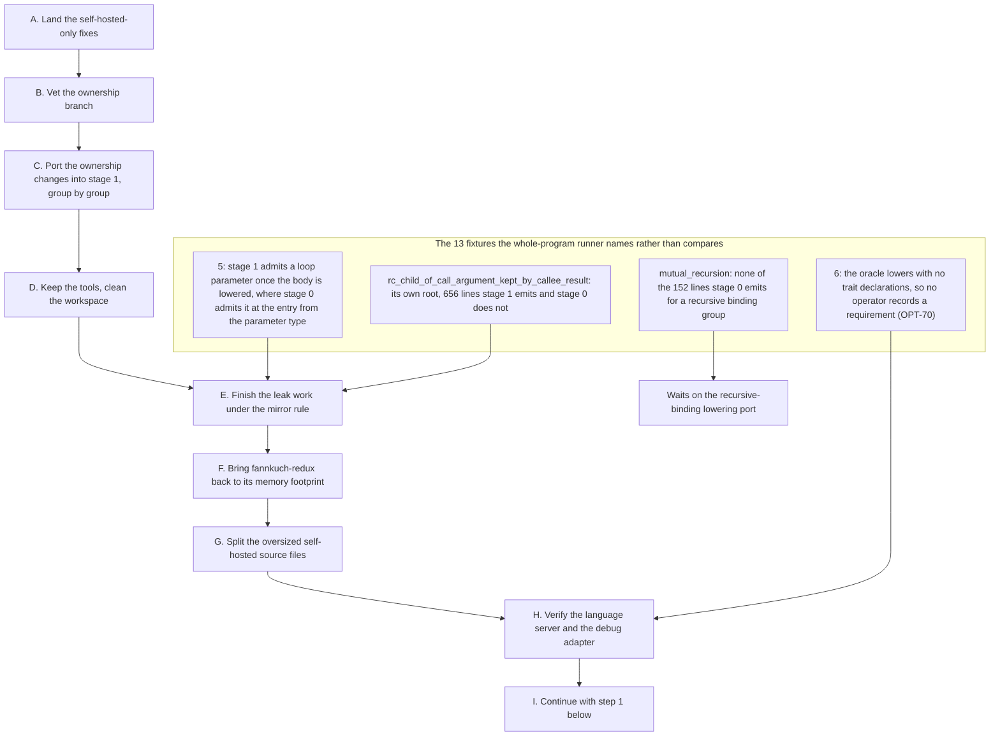

# Self-Hosting: Building the Ashes Compiler in Ashes

The plan for the self-hosted toolchain migration: where it stands, what to do next and in what
order, and the inventory of every item that remains. Completed work lives in the
[self-hosting log](SELF_HOSTING_LOG.md), which also holds the capability audit of what the
language, compiler and standard library had to provide before a compiler could be written in Ashes.

See [FUTURE_FEATURES.md](FUTURE_FEATURES.md) for how self-hosting fits the broader roadmap, and the
[self-hosted toolchain README](https://github.com/MattiasHognas/Ashes/blob/main/selfhost/README.md)
for package boundaries and commands.

## Start here

The goal right now is a **fixpoint**: the compiler built by the self-hosted compiler compiles its own
sources to a byte-identical copy of itself. Not feature parity with the .NET compiler, and not
matching its output instruction for instruction.

**Where things stand (2026-09-20).** Memory no longer has to be what stops the whole-tree build. The
wall this document used to describe was mostly repeated work rather than retained memory: stage 1
lowered the body of a function nested *k* lambdas deep 2^k times, and a curried function of *k*
parameters is *k* nested lambdas. With that fixed, stage 1 compiling the whole self-hosted tree goes
from being killed at a 40 GB cap after 23 minutes to finishing its lowering in 82 seconds at a
14.7 GB peak, and what stops it is a stage-1 semantic defect. Two things keep that from being the
state of `main`. The fix, and the stage-0 leak fixes measured alongside it, sit on the branch
`stage0-rc-general-results`. And that branch changed how stage 0 lowers ownership without the
matching change to stage 1, so the shared parity fixtures fail on it and it cannot be merged as it
is.

**The next task** is step A of "First: land the memory work and restore stage parity" under the work
order. Read that section before anything else: it holds what was measured, the order to land it in,
the rule it establishes (a stage-0 ownership change ships with its stage-1 mirror), and the
definition of leak-free that ends the memory work. Stage 1 still leaks after everything measured so
far, and leak-free is the priority once parity is restored.

The defect queue behind that is short. Three stops are known on the whole-tree build, listed in that
section in the order the build reaches them. SEM-22, an `==` generalization gap that also blocks
`sort`, is confined to `HoverTypeInfo` and unblocks nothing else. Everything else the 2026-09-17
sweep of the semantics package found is closed: MOD-20, MOD-21 and MOD-17c's dispatch half; the miscompiles
CG-20 and CG-21, CG-21 having turned out to be CG-20 seen from another shape; and the builtin layout
table's 52-member gap behind `QualifiedShippedReferences`. That sweep read 33 modules compiling, 51
exhausting a 24 GB cap and 2 stopping with a diagnostic; repeat it once step A has landed, because
most of those 51 were the repeated work and not their own memory.

OPT-85 keeps the record of the memory work before this: the profiling recipe headed "Profile it; do
not reason about it", the five sites that paid for the whole program at every query or release, the
whole-list copy stage 0 makes when a function returns or loops over a list parameter it cannot prove
is owned, **four approaches already refuted by measurement**, the genericity finding, and the
quadratic analysis tables (7,313 MB to 3,761 MB). It still stands as what not to retry.

**The probe** is how you learn where the self-hosted compiler currently stops. It is a small program
that imports one compiler module and calls the pipeline stages in turn, printing a marker after each,
so the last marker names the phase that failed:

```
loadProject -> stitchProject -> lowerCoreProgramWithSource -> optimizeIrProgram -> codegenProgram
```

Build it with stage 0 and `--debug`, so it carries symbols, and run it under `gdb -batch -ex run -ex
bt` when it faults rather than reading the exit code. Its `ashes.json` must list
`AshesCompiler.Frontend` and `AshesCompiler.Semantics` as devDependencies beside the path overrides,
or project loading fails with a null reference (SEM-20). Point it at one module at a time and sweep a
whole package before fixing anything, so what remains is a list you can order rather than a queue you
discover one failure at a time.

A module imported on its own is a good measure of time and memory and a poor end-to-end test: a
generic helper whose trait goal only its call sites settle is reported as missing evidence when
those call sites are not in the program. `IrCodegen.Support` imported alone stops that way in one
second on any stage 1. The end-to-end measure is stage 1 compiling the whole tree.

**Expect `main` to be slow and hungry until step A lands.** There the probe's own module
(`TypeResolution`) costs 3,776 MB and 2.56 s through the whole pipeline, a compiler module in the
middle of the package exceeds 24 GB, and compiling the semantics package whole peaked at 51.6 GB
after 10m40s before it had to be killed. Those figures are the repeated lowering: the `IrCodegen`
probe run to completion went from 782 seconds and 31.2 GB to 32 seconds and 2.7 GB with the fix.

**When you finish something**, move its entry to the [self-hosting log](SELF_HOSTING_LOG.md) rather
than marking it done here. Read "How to work on this" below before your first change.

## Work order

Every step names the checklist identifiers that gate it. Work them in this order.

### First: land the memory work and restore stage parity

These steps come before everything below. They exist because the memory work of 2026-09-20 sits on a
branch, `stage0-rc-general-results`, that cannot be merged as it is: it changes how stage 0 lowers
programs without the matching change to stage 1, and the shared parity fixtures say so.



**Landed so far.** A in #1114. B and C together in #1115 (arena reuse declines a reference-counted
token), #1116 (a reference-counted list literal cell never points at an arena cell), #1117 (closures
carry whether their function hands over an owned result) and #1119 (the ownership contract itself, with
stage 1 brought to parity on every shared program). D is the tools in
[`scripts/selfhost-dev/`](https://github.com/MattiasHognas/Ashes/blob/main/scripts/selfhost-dev/README.md). With them on `main`, stage 1
compiles the self-hosted code generator module in 32 s at 2.6 GB peak, against 35 s at 8.9 GB before.
E is under way, its first round in #1122. The descriptions of A to D below are kept as the record of
what was done and why. The branch `stage0-rc-general-results` they refer to no longer exists:
everything on it that changes what a program does has landed, and it was deleted rather than kept as
an archive. The one commit left out, a shortcut that skips the representation test for a value an
instruction just placed in the arena, changes generated code size and nothing else (measured: no
effect on memory), and is a separate small change with its own stage-1 mirror if it is wanted.

Two things the vetting in B added to the gate, because the gate as it stood was green through both.
The ownership branch made k-nucleotide use 37.9 GB instead of 214 MB while every suite passed, so the
`challenges/` programs are run against `main` before ownership work lands. And whole-program parity
and the self-hosted semantics suite compare IR text: stage 1 miscompiled `Ashes.Text.join` with both
green, and only the self-hosted `cli` and `backend` suites, which run code stage 1 generated, saw it.

**What was found.** Four things, all measured.

- *Stage 1 repeated its own work exponentially.* `lowerFunctionBodyResolvingCalls` lowers a lambda
  body and, when a call result resolved or a requirement closed the scope, lowers it again, and it
  did so at every nesting level. One function of 18 curried parameters cost stage 1 37 seconds and
  2.7 GB; stage 0 compiles the same program in 0.4 seconds. Lowering the closures nested in a body
  once while that body is lowered again brings it to 0.08 seconds and 122 MB. The single-module
  probe run to completion went from 782 seconds and 31.2 GB to 32 seconds and 2.7 GB. It was found by
  listing the leaked lowering states in a heap snapshot: 2,631 of them were 17 distinct states, one
  leaked 2,048 times. Identical leaked objects in power-of-two multiplicities mean repeated work, not
  a missing release.
- *Stage 0 leaks under its new ownership contract, and four of those leaks are fixed.* A record
  update that stored a fresh call result; loop bindings matched out of a `match (a, b) with` tuple,
  and an arena tuple whose retained child the result's normalization orphaned; list accumulators
  whose self-calls disagree in shape; and variant-typed loop parameters, which could never be placed
  and therefore blocked every sibling that might hold them. Together they took the probe from
  10,638 MB to 6,367 MB at two minutes and removed 90% of the leaked lowering states. Each has a
  plateau test that fails when its own toggle is set. Stage 1 still leaks after them.
- *The ownership contract was never mirrored into stage 1.* `CoreLowering.ash` has no owned slots at
  all; the last ownership work ported was the representation test. That is why 18 lowered-IR and 20
  explain fixtures under `selfhost/parity/semantics/` fail against stage 0 on that branch while stage
  1 still matches them: the fixtures are the alarm for exactly this, and they are not stale.
  Regenerating them would only move the failure to the stage-1 side.
- *The stage-2 build now stops on stage-1 defects, in this order.* A `show(key)` inside
  `IrCodegen.Support.lookupIndexedIn`, which is called with both `Str` and `Int` keys while stage 1's
  deferred trait goal can pin only one type; then `ASH002 Type mismatch: u64 vs u64` in a call to
  `IrCodegen.FloatText.floatTextConst`; then, past lowering, the list-marshalling slice of CG-11. The
  first predates this work: the unmodified stage 1 lowers the same function correctly once it has a
  single concrete call site.

**The rule from here on.** A change to how stage 0 lowers ownership ships with its stage-1 mirror
and regenerated fixtures in the same pull request. The branch above broke that rule, and the port in
step C is the cost of it. The note under "Now" that leaves other self-hosted mirrors filed and
untouched still holds for fixes the compiler's own sources never depend on; the ownership contract
is not one of those, because a stage 2 built by an unported stage 1 contains none of it.

**What "leak-free" means**, so the work has an end: compiling one more function with stage 1 adds no
reference-counted cell that is still live when the process exits, and resident memory plateaus over
a long compile. Both are measurable today, in seconds, with the tools kept in step D.

A. **Land the self-hosted-only fixes on their own.** Two commits touch only `CoreLowering.ash`: the
   repeated-lowering fix and the type annotations on `lowerFunctionBodyResolvingCalls`' callbacks
   (an unannotated callback's result type is unresolved where the call is lowered, so the contract's
   typed ownership step skips it and the owned value it returns is never released). Cut a branch from
   `main`, cherry-pick those two, gate them against `main`'s stage 0, and open the pull request. The
   annotation may measure as neutral there, since its gain depends on the contract; the
   repeated-lowering fix does not depend on anything. Add a regression test that compiles a function
   of about 16 curried parameters within a time bound, because a regression here brings the 40 GB
   wall back without any visible error.
B. **Vet the ownership branch before porting any of it.** Three checks, about a day. Run the
   `challenges/` benchmarks on `main` and on the branch, one at a time, and compare time and memory:
   the branch places more values on the reference-counted heap, and anything that regresses is fixed
   or dropped rather than mirrored. Sort the seven failing tests that are not parity fixtures into
   tests that expect the old IR shape and real regressions
   (`persistent_map_reuse_memory_should_plateau` looks like the second kind). Bisect the fixture
   failures to the commits that cause them, which both sizes the port and gives the groups to port
   in.
C. **Port the ownership changes into stage 1, group by group.** For each group from step B: cut a
   branch from `main`, cherry-pick the stage-0 commits of that group, write the stage-1 mirror,
   regenerate the fixtures (`ASHES_UPDATE_PARITY_FIXTURES=1`), and open one pull request. Both parity
   tests are green at the end of every group, so the alarm stays meaningful throughout. Take the
   groups one after another, each branch cut after the previous one merged, rather than stacking open
   pull requests: later contract commits build on earlier ones, and each gate should run against
   what `main` will actually contain. `stage0-rc-general-results` is never merged; it stays as the
   archive to pick from and the reference for what the ported result must reproduce, and is deleted
   once everything from it has landed. Every one of these is an ownership change, so the six
   self-hosted suites are the gate that counts: a change on that branch once passed the whole
   end-to-end suite, plain and under `ASHES_RC_POISON=1`, while miscompiling the derived `Ord` body,
   and only the self-hosted semantics suite saw it.
D. **Keep the tools, then clean up.** Move the scripts the remaining work depends on into the
   repository (the whole-tree stage-2 build with its memory samples, the curried-parameter scaling
   check, the exit-census and leaked-state tools, the reference-count watchpoint scripts), since they
   are what makes each step above a minutes-long loop rather than a day. Then delete the scratch
   directories, the old stage-1 binaries and heap dumps, and the stray outputs in the worktree.
E. **Finish the leak work under the mirror rule**, in a fresh worktree and branch. The method that
   found every fix above: compile a tiny input with stage 1, take a census of what is still live at
   exit, add one construct and diff the census, then put a hardware watchpoint on one leaked cell's
   reference count and read which retain has no matching release. Pricing constructs this way says
   where to look first: a `match` in a recursive loop leaks the most per function. Two patches are
   shelved with their measurements, neither with a gain beyond noise or a standalone regression test:
   releasing a fresh argument handed to a callee whose result reach is unknown when the result's type
   cannot contain it, and deferring ownership of a closure result whose type is still unresolved.
   Done is the definition above.

   The first round of E went after the largest class in a heap snapshot of the module probe, about
   430,000 leaked list heads of which 385,000 were lexer tokens, and reduced the lexer to reproducers
   of a few dozen lines. Its loop threads two list accumulators, conses onto one of them only when a
   callee's pair carries a value, and returns both in a tuple. Four things went wrong in that shape,
   and one of them is a miscompile rather than a leak: a callee's pair of records is placed on the
   reference-counted heap and released at the loop's back edge, while an arena list the loop keeps
   still points at one of its records, so `main` segfaults on a fifty-line program. What the fixes
   rest on is the loop protocol, which is worth stating because both of the wrong fixes tried first
   broke it. A parameter on the reference-counted heap has its successor copied at the back edge, with
   references of its own, before the iteration's owners are released; so a cell built for it borrows
   its children, and a retain stored in an arena cell is never released. A parameter left in the arena
   gets no copy, so a cell that escapes into it must retain what it stores. And a conditional
   accumulator may be placed on the reference-counted heap only when no consed head reads a loop
   parameter: a sibling parameter's predecessor is released at the same back edge. That last hazard
   is guarded, not fixed. Widening the placement to every accumulator of heap elements miscompiled
   two loops of stage 1 itself (`computeSccs` and `importWordsGo`, which cons a sibling parameter)
   with the end-to-end suite green, plain and poisoned; the self-hosted suites and the stage-1 dump
   tool saw it, which is the point of the gate above.

   Stage 1 had no counterpart of the placement these fixes extend (a list accumulator whose
   self-calls disagree in shape), one of the contract pieces step C left unported, so the
   reproducers landed as shared lowered-IR fixtures that stage 0 owned alone. The port followed:
   stage 1 now classifies an accumulator chosen by a branch, places it beside a sibling that cannot
   hold it, normalizes the arms of an `if` as it did a `match`'s (in source order, a fresh cell kept
   rather than retained), keeps a loop's successors without an arena reset when no reset is
   possible, and retains the children of a let-bound successor of an arena parameter. The four
   programs match stage 0 byte for byte and are listed in whole-program parity. The port found a
   leak of stage 1's own making on the way: the owner a `match` keeps its adopted scrutinee in had
   no binding to take a type name from, so a loop never released a pair a callee returned to it.
   The path for types only the normalization helper expresses (a recursive variant) followed in a
   second port. Stage 1 now synthesizes that helper and the type's own dropper, a function
   returning such a value hands it over owned and says so in its closure's header, a caller keeps
   the result in an owned slot it releases at its end or at a loop's back edge, behind a result it
   made independent first (an optional scalar or a table of pairs included), a loop accumulating
   such values lives on the reference-counted heap, and a caller that cannot name its callee reads
   the header to know which it got. Three programs over a recursive variant match stage 0 byte for
   byte and joined the shared fixtures. Two defects of stage 1's own surfaced on the way and were
   fixed at once: a second arm of a `match` ending in a tail call released the first arm's adopted
   scrutinee as well as its own, and a nullary constructor pattern was taken for a variable binding
   the whole scrutinee, which left that arm releasing nothing. A third port brought the reach
   analysis's exposure account (an unproven result still proves it never holds a parameter whole
   when every value the unproven construct saw is enumerated, so a fresh argument is released in
   the ordinary way rather than handed over), the release of a normalized parameter behind a result
   that only borrows from it, the closure environment normalizer on the general deep copy (a
   captured record holding a list of records gets one), a callee's later curried positions known
   normalized through the returned-closure chain, and the to-space copy of an argument bound to a
   callee's quantified parameter, which stage 1 lacked at call sites altogether. What is still
   unported from this arc is the frame that collects the retains an arena aggregate takes as a
   call's argument and releases them behind the call's result, with the refined back-edge test that
   decides slot by slot whether a successor can hold an owned value; both sit behind the placement
   of a loop parameter at the loop's entry, which stage 1 still decides at finalization. After this round
   the probe's leaked list heads in the first 2 GB of heap fall from 1,020,000 holding 472 MB to
   476,000 holding 177 MB, and its peak from 2,582 MB to 2,507 MB: about 15,000 large roots holding
   800 MB are now the largest class, and the next thing to identify.
   The second round priced stage 1 per compiled function with an exit census over two generated
   inputs: about 625 KB stays live for every function compiled, and the largest class came from the
   self-hosted IR optimizer. Hand-written reproducers of it kept diverging from the real code, so
   the optimizer itself is now run in a probe project (`optloop.sh`): N rounds over one lowered
   program in a fraction of a second, leaking about 1 MB per round, with every leaked cell
   traceable to a source line. It found a second miscompile on `main`, again by way of a leak: the
   back edge's copy of a dying arena successor released the source's children as references, and
   when the successor was a name bound out of a tuple rather than a literal, that release ran on an
   arena cons cell, read the integer before it as a count, and put arena memory on the free list
   when that integer was 1. Two leaks went with it: a callee returning its rebuilt record beside a
   second result never released its owned parameter, and a fresh argument handed to a callee whose
   result type has no place for it was never released (the patch shelved in the first round fits
   it exactly, and the probe is what it lacked: a measurement). One fix was dropped after
   measuring: exempting any record threaded through a loop from sibling blocking frees the
   optimizer's per-instruction pairs, and costs stage 1's own lowering 190 MB, because the state it
   threads is large and rebuilt every iteration. The probe still leaks 0.9 MB per round from other
   sites, which is where the next round starts.
   The third round first misread the largest class in the module probe's snapshot, about 18,000
   roots keeping 800 MB, as the live syntax tree of the program being compiled; the measurement
   described after this round shows it is neither. What holds from that round is that an exit
   census cannot tell live from leaked, since a function's syntax tree and IR are legitimately live
   when the process exits, and that a probe whose input does not change between rounds
   (`optloop.sh`) measures a leak where a per-function exit figure does not. The fix of the round is at the function's end: a function releases the values it owns only
   once its result is independent of them, and two kinds of result could never be made so. A list
   whose heads have no fixed copy (a table of string pairs) was not normalizable, which in the
   optimizer left the three largest per-round roots behind; and a variant whose fields are all
   inline, an optional integer, is neither a contract type nor has a generic one a fixed copy-out,
   so the 28 functions in the self-hosted sources that return one left whatever they owned, mostly
   an `Expr`. Fifty more functions leave their owned values behind because their result type is
   generic; those need annotations in the source, not a compiler change. What dominates the module
   probe after this is old versions of the lowering state's persistent maps, kept by arena records
   that hold reference-counted roots: the record-update design question, whose first designed fix
   was unsound, and the subject of the next round.
   Then the question was asked directly, how much of what stage 1 holds is leaked, and it has a
   measured answer (`reachat.sh`): interrupt stage 1, write a core, and mark conservatively from the
   stack, static data and every arena mapping into the reference-counted heap. On the code generator
   module probe, 9% of the reference-counted heap is reachable and **91% is reachable from nothing**,
   at 12 seconds (1.09 of 1.19 GB) and near the peak at 28 seconds (1.90 of 2.09 GB) alike, with
   sampled cells checked by hand against the whole core. Live data is about 190 MB under a 2.5 GB
   peak. That overturns the third round's first reading: the large 56-byte root class is neither the
   syntax tree nor live. Those records carry a function's name because they are `PatternWalk`, the
   state the pattern-binding ownership analysis threads through its mutually recursive walkers:
   forty dead versions per compiled function in a small input, and the class that claims about half
   of all the garbage in the probe. Each version is a record update built in the arena, copied onto
   the reference-counted heap at a call boundary, and never released: the state-threading copy tax
   and the leak are one mechanism. Arena memory, by contrast, holds almost none of the heap, so
   "arena records keep reference-counted roots alive" is not where the memory is.
   The `PatternWalk` shape was then reduced to a program of forty lines (a record state threaded
   through a mutually recursive walk, one walker returning its parameter whole in one arm) that
   leaked 1.2 KB per round, and its exit census (`progcensus2.sh`) named four defects in stage 0
   that were one leak. A record result from a callee whose result ownership is settled only at run
   time (a sibling in the group, a closure parameter) was taken for an arena value and retained
   again by the join it flowed into; such a result now reads the callee's returns bit like a result
   with a fixed copy-out does, kept as it is when reference-counted and copied into an owned graph
   otherwise. A fresh argument was given up to a callee whose result may return it whole even when
   that callee does not adopt it; it is now handed over under the adoption bit and released after
   the call unless the callee adopted it or returned it as the result, a pointer comparison. The
   proof that a result always reaches a parameter recursed into callees with a depth bound and no
   cycle, so a mutually recursive walker never owned its state; it is now a greatest fixpoint over
   every registered function, the dual of the may-reach summary. And a function owning its entry
   parameter refused to release it behind a join that returned the parameter bare, though the join
   had retained it. Stage 1 mirrors the four rules, and end-to-end tests pin the reproducers.
   The run-time read had to be narrowed twice before it was sound. It covers single-constructor
   records only, and only a callee the contract already commits to an owned return
   (`CalleeReturnsGeneralRcOwned`): a callee that returns a reference-counted value it does not own,
   the borrowed head of a list it goes on to drop, was taken over and released, and the second call
   through that path popped a corrupted free list — the self-hosted frontend suite crashed on
   `tokenize("\"abc")`, reduced to `reproducers/borrowed_list_head_returned_through_helper.ash`.
   Narrowed that far the rule leaves `recursive_group_threads_record_state` at 700 MB per million
   rounds against 1220 MB on `main`, and the other reproducers unchanged: the two that still leak
   are exactly the shape the owned-return guard excludes, so the callee side of the contract is the
   next round. That reproducer also segfaults under `ASHES_RC_POISON=1` when compiled by `main`,
   a separate and older defect. Found on the way: stage 1 has taken seven
   times longer on the probe since the third port (230 seconds against 32), an uncached walk of the
   heap layout at every admissibility question, to be cached next.
   The self-hosted optimizer's pass shape (`reproducers/optimizer_pass_state_and_rewritten_instruction.ash`,
   1380 MB at 100,000 rounds) was taken for an unreleased tuple: the callee's result pair was
   thought to keep its instruction shared, so the list's drop kept every child. The lowered and
   final IR both release the pair, and a variant that uses neither half of it leaks the same, so
   the census was read again: containers are freed and their children are not, and the children
   come from two unrelated leaks, each now a program of a dozen lines. A record parameter kept by
   an outer curried stage (`make (loc) (k)`) was copied onto the reference-counted heap at entry
   and the copy moved into an arena closure environment that nothing releases; it regressed in
   #622, found by bisecting the reproducer over published compilers. The outer stage no longer
   normalizes: the parameter reaches the result only as a capture of the next stage's closure,
   whose environment normalizer copies or retains it once the closure escapes. This is also the
   root cause of OPT-85's lowering-state probe (`stateleak`, 32 MB at 4,000 rounds on `main`, now
   8 MB), which was attacked from the other side, by giving the adopting environment a dropper,
   and that miscompiled five of the six self-hosted suites; this side passes all six. The other leak is older than August: a tuple consed onto a list inside a
   tuple result inherited the enclosing tuple's request for a reference-counted representation,
   while the list cell holding it stayed in the arena, so the arena reset reclaimed the cell and
   left the tuple. An arena list's element no longer takes that request. Both rules are mirrored
   in stage 1, and the optimizer reproducer, `loop_state_and_rewrite_pair` (1228 MB) and
   `record_state_list_field_grown_by_callee_pair` (312 MB) now stay at 8 MB with unchanged output.
   A loop accumulator with an arm that resets it to nil (`direct_successor_with_reset_arm`, 1752 MB)
   was never an accumulator edge, so the list stayed in the arena holding retained elements; nil is
   one now, and a nested join normalized in place no longer counts as borrowing the loop parameter,
   which had the outer join retain it a second time. Stage 1 needed only the first rule.
   None of this moved the module probe (2767 MB on `main`, 2750 MB after, 91% of the heap still
   leaked), and the census said why. Roots claiming 390 of the leaked megabytes are token lists, and
   the real parser, run in a probe (`parseloop.sh`), leaves 166 MB behind after one parse of a
   3,700-line file and 83 MB for each parse after, against 0.5 MB for lexing alone. The parser threads
   its state as a tuple of the token list, the diagnostics, the source bytes and a flag. That tuple
   lives in the arena (the byte view and a list whose representation is unknown at the tuple keep it
   there), while the token lists put into it are fresh reference-counted results
   (`List.append`, per declaration and per nested `let`). A call that hands a fresh list to a function
   returning it inside such a tuple transfers ownership to a callee that owns nothing, and every
   later state rebuild drops the arena tuple's reference to the old head cell. Reduced:
   `list_parameter_returned_inside_tuple.ash`. Three local rules were tried and reverted, each
   measured on the real parser: normalizing list parameters, an all-inline variant as a tuple
   sibling, and copying a transferred fresh list into the arena (which fixes both reproducers, and
   makes the parser worse, because its arena lists are copied back onto the reference-counted heap
   downstream). The same shape is behind the lexer's leaked token kinds, the recursive group's
   sibling result and the closure-parameter result: an owned reference-counted value stored in an
   arena aggregate nothing releases. That is the ownership contract's open question (which values
   a result owns, and who releases what an arena aggregate holds), and the next round is its design,
   not another local rule.
F. **Bring fannkuch-redux back to its memory footprint.** The benchmark peaks at about 3.3 GB on
   `main` where its README records 8 MB, and it did so before the ownership contract landed, so the
   cause is older than step C. It is a plain program with a fixed input, which makes it bisectable
   in minutes: publish the compiler at a commit (`publishcli.sh`, or `publishref.sh` for a commit
   that is not checked out) and compare with `challenge_ab.sh`. Find the commit, reduce the program
   to the loop that grows, and fix the placement; if the footprint cannot be restored without giving
   up a guarantee the contract needs, record why and what it would take instead.
G. **Split the oversized self-hosted source files.** `CoreLowering.ash` is about 22,500 lines, five
   times the next largest file (`TypeInference.ash` at 4,400, `Parser.ash` at 3,700, `IrOptimizer.ash`
   at 3,000). Split it into `Lowering.<Concern>.ash` modules, the way the backend's code generator is
   already split into `IrCodegen.<Concern>.ash`, and name each module after the stage-0
   `Lowering.<Concern>.cs` partial it mirrors wherever one exists, so the mirror rule's "where does
   this go in stage 1" has one obvious answer. Scoping is sequential and module imports are acyclic,
   so the cut follows the dependency order the file already has: the state record and its accessors
   first, then the emitters, then the concerns that use them. This is a move and nothing else: every
   shared fixture and the whole-program parity suite stay byte-identical, and stage 1's compile time
   and peak memory do not regress. It comes after the leak work rather than during it, because a
   file this size that is also open on a long-lived branch turns every move into a merge conflict.
   Once the pattern is settled, apply it to any other self-hosted file of several thousand lines.
H. **Verify the language server and the debug adapter against the current codebase.** The memory
   work changed the lowering that `Ashes.Lsp` consumes and the code `Ashes.Dap` debugs, the split
   moved most of the self-hosted lowering between files, and their own test suites exercise
   neither end to end: `Ashes.Lsp.Tests` drives the server's handlers, not an editor session, and
   the adapter has no suite that steps through a program built by the current compiler. Open the
   repository's own sources, the split modules included, and the examples in the VS Code extension
   and check diagnostics, hover, completion and formatting for errors in the server's log; then
   debug a program with `--debug` through the adapter under gdb and under lldb (breakpoints, step,
   locals, a let binding's own position) and check the adapter's log the same way. Anything found
   is fixed before the fixpoint work starts, with a test at the layer that would have caught it.
I. **Then the fixpoint**, steps 1 to 5 below, starting from the three defects listed above. For the
   first, prefer splitting `lookupIndexed` into a `Str`-keyed and an `Int`-keyed version over waiting
   for trait dictionary passing; it keeps the diagnostic and unblocks the sweep. The rest of this
   document follows once the fixpoint holds.

### Now: make the compiler compile itself

The near-term goal is a fixpoint, not feature parity with stage 0. Stage 2 and stage 3 are both
produced by the self-hosted compiler, so the fixpoint is blind to any disagreement between stage 0
and stage 1. That has a sharp consequence for what is worth doing: matching stage 0 instruction for
instruction is a debugging aid, not a requirement.

1. **Clear the blockers the probe reports.** Run the bootstrap probe over every module of a package
   before fixing the next failure it names, so what remains is a list ordered by how often a shape
   recurs rather than a queue discovered one failure at a time. The semantics package was last swept
   on 2026-09-17 and is due again once step A has landed: what remained there was SEM-22, confined to
   its own module, and a memory cap that was mostly repeated lowering. Gates: BOOT-2.
2. **Compile the whole self-hosted tree with stage 1.** With step A landed this is a loop of about
   two and a half minutes, a stage-1 build and a run, rather than a run that dies of memory: read the
   first diagnostic, find where it was raised, fix it, repeat. Three stops are already known and
   listed under "First". Prefer a small change to the self-hosted sources over a new stage-1 feature
   wherever both would work, since a source change reaches every stage at once. Expect more stops
   behind the known ones, and keep them as a list. Gates: BOOT-2, OPT-85.
3. **Make stage 2 run.** A stage-2 binary that faults on its own sources is a different class of
   defect from a stage-1 miscompile, because stage 1 is what compiled it, and the reduction
   technique that works for one does not transfer to the other. Do not trust the binary because it
   linked: compile the small programs with it and compare against stage 0, then build the six
   self-hosted suites with stage 1 instead of stage 0 and run them, which exercises stage 1's code
   generator far harder than anything has so far. Then measure stage 2 building stage 3. If it does
   not fit in memory, count what it allocates before assuming a missing release: identical objects
   in power-of-two multiplicities are repeated work. Gates: BOOT-2.
4. **Remove the sources of nondeterminism.** Hash-ordered iteration, address-derived values,
   traversal-seeded counters, timestamps and absolute paths baked into artifacts. Each produces a
   difference that looks like a miscompile and is not, so audit the emitters before comparing
   anything. Gates: BOOT-12.
5. **Establish the fixpoint.** Stage 2 compiles the same sources to a stage 3 byte-identical to
   stage 2. Gates: BOOT-3.

Deliberately **not** on this path, however real: the self-hosted mirrors of stage-0 lowering fixes
the compiler's own sources never depend on (OPT-82, OPT-84), stage-0 defects those sources never
reach (OPT-83 and the JSON view path), and exact-IR parity work for its own sake. File them, leave
them. The ownership contract is the exception, and is on the path as step C above: it decides
whether each later stage leaks, a stage 2 built by an unported stage 1 contains none of it, and
leaving it unmirrored is what turned the shared parity fixtures red.

### Next: make it a compiler anyone would use

6. **Full corpus.** Compile and run the compiler, standard library, examples and the whole test
   corpus with the self-hosted compiler. Gates: BOOT-4, the TestRunner items (TR-1..TR-9).
7. **Command-line completion.** Option parity for `compile` and `run`, the reporting flags, and the
   remaining commands. Gates: CLI-1..CLI-12.
8. **The rest of the port.** Trait and capability physical lowering, the async and task arc,
   optimizer and performance parity, sockets and the vendored bitcode payloads. These are ordered
   among themselves by the checklist's own dependencies, not by urgency to the bootstrap.
9. **Targets beyond linux-x64, and debug information.** Object-parsing generalization first, then
   the remaining three targets. Gates: the linker items (LNK-*) and the code-generation items.
10. **Editor and debugging tooling.** Language server, debug adapter, the fuzzing runner. These
    follow the compiler and gate nothing before it.

### Last: replace the default toolchain

11. **Prove it in the open.** Bootstrap, parity, packaging and release jobs in both local and hosted
    continuous integration, and the performance acceptance gate. Gates: BOOT-7, BOOT-8, BOOT-9.
12. **Retire the .NET toolchain from the default and release paths**, keeping its sources buildable
    and tested as the permanent stage-0 and behavioral reference. Only then consider any source-tree
    reorganization, as its own mechanical change. Gates: BOOT-10, BOOT-11.

## How to work on this

- Start behavior changes with a pure-Ashes failing test under `selfhost/tests/<package>/`; keep unit tests
  within the owning package and add cross-package tests only at real public boundaries.
- Keep test suites flat: compose small named checks through pipelines instead of sequencing them with
  deeply nested `let ... in` pyramids.
- Treat .NET stage-0 comments as audit input while porting. Preserve non-obvious observable behavior,
  ordering, ownership, diagnostics, and phase boundaries in a module header or a local standalone
  comment; do not copy XML documentation, C# API narration, or host-specific implementation details.
- Keep each milestone on a fresh `feature/...` branch and worktree. Copy `runtimes/` from the main
  checkout into a new worktree before backend-dependent validation; runtime payloads are intentionally
  not regenerated by the self-hosted work.
- Do not delete the existing .NET or Node.js implementations as part of or after the port. Keep the
  .NET implementation buildable and tested as the permanent stage-0 and behavioral reference; changing
  which implementation is shipped or launched by default is a separate decision.
- For the current frontend, formatter, and semantics tests, compile the corresponding
  `selfhost/tests/*/ashes.json` project and execute the emitted host binary. Run semantics tests both
  normally and with `--debug-disable-reuse` so ownership/reuse differences cannot hide a defect.
- Before publishing a milestone, format every changed `.ash` file, build `Ashes.slnx`, run the compiler
  and LSP unit suites, and verify C# formatting. Record exact commands and counts in the PR. Add focused
  bootstrap parity fixtures as soon as a self-hosted phase can serialize the same public result as C#.
- Update this migration table and the implementation status in `selfhost/README.md` in the same PR when
  a milestone changes either one. Do not mark an area complete merely because its data model exists.
- When an item is finished, move its entry to the [self-hosting log](SELF_HOSTING_LOG.md) rather
  than ticking it here. Nothing appears in both: an entry is either work or a record. A partly
  finished item is split, its completed half in the log and its open tail here. Identifiers are
  never reused, so check the log before numbering the next item in a series.
- Keep every checklist item short and precise: its ID, its scope, a one-clause "Done:" boundary and
  a one-clause "Open:" tail where partially complete, and at most one load-bearing gotcha or
  regression-test pointer. Per-PR narratives, verification transcripts, and investigation histories
  belong in the PR description and git history, never appended to this document.

## Migration state (reference)

A per-area snapshot of what is ported and what is not. Read it when you need context for an area;
the work order above is what to act on.

The new implementation lives entirely under `selfhost/`. It is pure Ashes: Python, shell, C#, and
Node.js helpers are not part of its implementation or test path. The existing .NET toolchain remains
in the repository permanently as a buildable, tested stage-0 and behavioral reference after the
self-hosted compiler becomes the default. The Node.js VS Code extension also remains in the repository,
and so does the .NET registry server (`src/Ashes.Registry`): it is a deployed service, not part of the
toolchain a user runs, so only its client commands are ported. Neither implementation may be removed or
changed merely to make the self-hosted port easier.

| Area | Ported surface | State |
|---|---|---|
| Frontend | Tokens, UTF-8 source spans, lexer, typed syntax model, leading import-header separation, inline-module lifting and validation, expressions, patterns, types, and whole-program parsing for all current declaration forms | Implemented and covered by pure-Ashes tests; token streams and frontend diagnostics also have shared stage-0/self-hosted parity fixtures |
| Formatter | Canonical formatting for complete programs, declarations, expressions, patterns, and types, including precedence and idempotence coverage | Implemented and covered by pure-Ashes tests |
| Semantics foundations | Stable symbols/scopes, semantic types, substitution, unordered open-row unification, constrained schemes, and source type resolution | Implemented and covered by pure-Ashes tests |
| Expression/program inference | Core and structural expressions, operators, records, guarded matches, Result pipelines, `let?`, annotations, constructors, recursive groups, aliases, zero-cost types, sequential top-level inference, and package-aware inference of dependency-ordered stitched modules | Implemented for the listed surface |
| Capabilities | Declaration and operation schemes, effect propagation, handlers and `resume`, provider registration, exact concrete provider satisfaction, abstract requirement preservation, and provider/handler ambiguity rejection; dynamic-handler lowering and backend dispatch | Inference and the dynamic-handler subset are implemented; static `provide` lowering and remaining handler ownership/region work are open (IR-8, OPT-43, OPT-52) |
| Traits | Operator constraints; trait declaration/method registration; forward supertrait validation; cycle rejection; qualified method schemes; default-body type checking; ordinary implementation registration with rigid heads, requirements, optional defaults, and type-checked supplied methods; deterministic duplicate/structural-overlap rejection; package orphan ownership for traits and nominal head types; decreasing conditional requirements; selected-default dependency validation; canonical constraints with transitive supertrait elimination; written binding-requirement boundary validation; recursive concrete instance evidence resolution; canonical failure traces; deterministic hidden-dictionary ABI shape planning; ABI-ordered call-site evidence argument planning; constrained-function application/partial-capture planning; active evidence forwarding with deterministic supertrait paths; active trait-method slot planning; concrete dictionary-construction input planning with supplied/default method selection; dependency-aware selected-method construction order; evidence transport destinations for direct functions, closures, aggregates, and async frames; constrained-value rewriting with hidden parameters, dictionary destructuring, and unambiguous method binding; constrained-reference rewriting with exact or inherited active evidence; concrete dictionary-value rewriting with selected method bindings and nested supertrait values; the shipped standard trait ABI plus primitive/structural implementation heads bound to rewritten `Ashes.Trait` source bodies; and deterministic, declaration-aware `deriving` expansion for ordinary and zero-cost nominal types | Declaration, ordinary implementation, coherence, termination, default-cycle, constraint-canonicalization, written `requires` validation, evidence-plan resolution, structured resolution failures, dictionary ABI layouts, call-site evidence arguments, constrained-function application plans, recursive/sibling evidence-forwarding plans, active method-access plans, concrete construction inputs, selected-method build order, value-transport plans, constrained-value/reference rewriting, concrete dictionary-value rewriting, standard implementation evidence/source binding, syntax-level deriving expansion, and semantic deriving eligibility validation implemented; physical IR lowering remains |
| IR, optimizer, ownership, backend, linker | Complete IR model/text form, core and builtin lowering, scoped arenas, RC/Perceus insertion, reuse and placement paths, supported tail-modulo-constructor and reverse-list/bytes transforms; a linux-x64 LLVM backend and pure-Ashes ELF linker producing real executables | In progress; zero-cost classification, trait-evidence/static-provider/async lowering, remaining ownership and region-lifetime gaps, fusion correctness, optimization levels, and the other three targets remain; individual checklist items distinguish supported paths from open tails |
| CLI, LSP, DAP, TestRunner, fuzzing runner, registry commands | `fmt`, `init`, `compile`, `run`, `add`, `remove`, `restore`, `tree`, and `why` have implemented surfaces; compile/report options are partial (see CLI-1..CLI-12) | In progress; remaining commands, TestRunner, fuzzing runner, LSP, and DAP remain separate checklist work |
| Bootstrap | Stage 0 builds an executable stage-1 CLI, and stage 1 compiles, links and runs ordinary programs. Stage 1 also carries compiler modules of its own through lowering, the optimizer and code generation to a working executable: 33 of the semantics package's 86 modules as of 2026-09-17, with memory, not defects, gating the rest — 51 exceed a 24 GB budget and one module is held by a defect | Stage-1 artifact available and working on ordinary programs; self-compilation of the whole tree, and the stage-2 against stage-3 fixpoint, not established |

The current packages intentionally form the same strict dependency graph as the existing toolchain:
`frontend` has no compiler dependency, `formatter` depends only on `frontend`, and `semantics` depends
only on `frontend`. Do not move backend behavior into those packages. Future packages must follow the
dependency table in the
[self-hosted README](https://github.com/MattiasHognas/Ashes/blob/main/selfhost/README.md#package-dependency-graph)
and
must reference only the packages they actually consume.

## Toolchain implementation checklist

What remains to be built in the self-hosted toolchain, grouped by subsystem. It tracks observable
compiler and tool behavior, not the presence of similarly named data types. The status markers are:

- `[~]` — a useful part is implemented, but the current compiler's complete observable contract is
  not yet covered, and the entry's `Open:` tail says what is left;
- `[ ]` — not implemented in the self-hosted toolchain.

Finished items are not listed here; see "How to work on this" for where they go.

The checklist covers the currently shipped toolchain. Features explicitly listed as unsupported or
future work in the language reference are not self-hosting requirements until they become part of the
shipped language. The existing C#, .NET, and Node.js implementations remain the compatibility oracle;
their internal class boundaries are not requirements when a smaller pure-Ashes design preserves the
same public behavior.

### Package and test foundations

- [~] **PKG-6** Add cross-implementation parity fixtures as each self-hosted phase gains a stable serialized
  public result. Done: versioned token streams, frontend and semantic diagnostics, whole-program
  lowered IR, and ownership/RC/reuse/memory explanation fixtures, exercised by the corresponding
  `selfhost/tests/*-parity` projects and `ExplainReportTests.ash`; formatter corpus comparison is
  recorded under FMT-8. Open: broader syntax/inferred-scheme serialization and standing full-corpus
  executable parity (TR-1..TR-6, BOOT-4), including the fusion regressions in OPT-61/OPT-62.

### Frontend and source model

Nothing open. Every item is in the [self-hosting log](SELF_HOSTING_LOG.md).

### Formatter

Nothing open. Every item is in the [self-hosting log](SELF_HOSTING_LOG.md).

### Semantic foundations and ordinary inference

- [~] **SEM-15** Seed the shipped standard trait/type identities and primitive/structural implementation heads so
  ordinary evidence resolution no longer depends only on focused test declarations. The remaining
  builtin and standard-library value/type environment must be populated through module stitching.
- [~] **SEM-17** Port the remaining declaration namespace, duplicate-name, shadowing, annotation, and inference
  diagnostics with stable codes and source spans. Done: `ASH013` (duplicate top-level binding) and
  `ASH014` (forward reference and non-`recursive` self-reference, kept distinct from
  genuinely-unknown names). `ASH016` was never missing — import-resolution collision checking
  already covers it. `ASH015` has no stage-0 reference implementation at all — nothing to port
  until stage 0 implements it.

### Capabilities and handlers

- [~] **CAP-7** Lower static-provider dictionaries and generic capability evidence into IR. Done:
  static-provider dictionary calls (`emitStaticProviderCall`), and `findStaticProvider` matching
  on capability name AND resolved type arguments (name-only matching cannot distinguish
  `provide Log(Int)` from `provide Log(Str)`; given no required arguments it matches by name only
  when every candidate agrees, reporting ambiguity otherwise). Open: the whole-program wiring —
  `CoreStaticProviderLayout` is constructed nowhere outside test fixtures, since
  `TypeEnvironment` carries no operation implementation `Expr`s (needs a `ProviderDecl` AST walk),
  and deriving a call site's required type arguments is nontrivial when the capability parameter
  appears only in return position (`get : Unit -> a`).
- [ ] **CAP-8** Validate capability explanations and observable behavior against normal, optimization-disabled,
  and reuse-disabled C# compilation.
- [ ] **CAP-9** Type a static-provider operation call from the operation's declared signature.
  `lowerPerform`'s static-provider branch still hands `emitStaticProviderCall` a `Unit` result
  type, so a provider-backed operation whose result is used as anything but `Unit` fails with a
  type mismatch; the dynamic perform branch was fixed on 2026-09-07 (`performResultType`
  instantiates the scheme `registerTopLevelCapabilityDeclaration` records and unifies it with the
  argument types), and the provider branch should share that helper once CAP-7's whole-program
  provider wiring exists.
- [ ] **CAP-10** Give a handler arm closure stage 0's argument normalization and returns-bit
  epilogue. Stage 0's `LowerHandleLowerArmClosures` emits the arm closure with
  `AcceptsRuntimeManagedArgument`, normalizes the operation argument at entry
  (`rc_arg_normalize_*`), and copies the result out on the returns bit (`rc_result_owned_*`);
  the self-hosted `installOperationArmClosures` lowers the arm body as a plain match under a
  live-posts guard with neither, so `tests/consumed_argument_through_handler.ash` peaks at
  60.7 MB through the self-hosted compiler against 28.7 MB through stage 0. OPT-49a's mirror
  (the perform site adopting the arm's reference-counted result) needs the returns bit first.
- [ ] **CAP-11** Report a closed-row capability violation as stage 0's `ASH018` at the offending
  binding's span. Stage 0's `ReportRowMissingCapabilities` names every capability the written
  `needs` row omits and reports it at the value span pushed by `LowerLetAnnotatedValue` and
  `LowerLetRecursiveFinalizeValue`; the self-hosted `unifyRows` rejects the same program as an
  undifferentiated `TypeMismatch` between the two rows, with neither the code nor a span, so a
  closed-row failure cannot be told from an ordinary type error. Add the fixture to
  `selfhost/tests/semantics-diagnostic-parity` once the diagnostic exists, since that corpus
  compares code, message text, and span.
- [ ] **CAP-12** Carry the runtime-managed ownership fact on the temp a guarded arena copy-out
  hands back. Stage 0's `TryEmitScopeCopyOut` routes both live-posts paths through a local and
  returns a reloaded temp, so the ownership fact belongs on that temp rather than on the copy
  destination; marking only the destination leaves nothing to release the copy and a loop grows
  its resident set without bound. The self-hosted `beginLivePostsGuard` is currently used only by
  `closeGuardedArmBracket`, which guards a restore and reclaim with no copy-out, so the shape does
  not exist there yet -- port it with the fact on the reloaded temp. The skipped path needs no
  special case: an arena value's header holds the immortal sentinel and a drop against it is a
  no-op.

### Traits, implementations, and evidence

- [~] **TRT-13** Plan hidden trait dictionary parameters, method fields, specialized direct-supertrait fields,
  call-site evidence arguments in deterministic ABI order, constrained-partial-application evidence
  capture, exact and inherited active-dictionary forwarding across recursive and sibling call
  edges, ABI-ordered supplied/default method fields with dependency-aware build order, dictionary
  transport destinations (direct parameters, closure captures, nested aggregates, async frames),
  and constrained value/reference rewriting; physically thread dictionaries through the lowered
  representations. Done: every planning layer above, plus the first real lowering wiring —
  `lowerCoreProgramWithEnvironment` elaborates a plain constrained top-level `let`'s value against
  genuine `inferProgram` output; the sole-active-parameter inherited-forwarding fallback (stage
  0's `FindActiveTraitDictionaryParameter` semantics — raw scheme constraints from two bindings
  never share a type-variable id, so exact stable-key matching alone can never fire); and
  call-site forwarding as a pure pre-lowering AST rewrite, gated on the call argument being
  syntactically one of the caller's own outermost lambda parameters (sound via HM unification —
  an unguarded trait-name-only match forwarded the WRONG evidence for an unrelated concrete call,
  proven by IR dump). Open: recursive-binding value elaboration, concrete/global call-site
  resolution for an unconstrained caller, and the phase plan's keystone — constraint-aware local
  type reconstruction in `CoreLowering.ash`, or one merged type-variable space with inference
  (the local reconstruction and the external environment share no variable space; merging their
  outputs into one scheme produced an infinite substitution cycle).
- [~] Rewrite concrete dictionary construction into dependency-ordered selected method bindings,
  ABI-ordered fields, and recursively constructed inherited evidence. Lower those values, default
  dispatch, method selection, and safe concrete specialization into IR without changing unoptimized
  behavior.
- [~] **TRT-14** Register the shipped standard trait ABI and primitive/structural implementation heads, including
  recursive evidence requirements and stable compiler-private implementation references. The stitching
  phase now binds those references to rewritten `Ashes.Trait` source bodies by alpha-normalized
  implementation-head structure; physical dictionary lowering remains.
- [~] **TRT-15** Expand `deriving {Eq, Ord, Show, Hash}` into ordinary implementations before coherence checking.
  Ordinary and zero-cost nominal declarations now expand in written order, retain only payload-relevant
  type-parameter requirements, generate deterministic method bodies, and participate in ordinary
  coherence and evidence resolution. Function, pointer, task, unbound-variable, and non-regular
  recursive fields are rejected. A stitched-program declaration context also rejects builtin and
  declared resources, opaque external types, capabilities, and transparent aliases to unsupported
  fields independently of declaration or module order. Physical dictionary and method lowering remains;
  until it lands, the selfhost rejects `==` on a list of a `deriving {Eq}` record
  (`tests/reuse_specialization_declines_unreachable_helper.ash`, `CoreOperatorTypeMismatch` on
  `List(Live)`), the one shared fixture that needs a derived implementation at run time.

### Modules, projects, externals, and whole-program semantics

- [~] **MOD-7** Resolve path and registry package graphs, lock files, package identities, one-version-per-package
  coherence, and program-global providers/implementations. Recursive path dependency resolution,
  dev-dependency propagation, cycle and namespace validation, diamond deduplication, and compilation
  planning across dependency source roots are complete. The typed versioned lock-file model, strict
  parser, selected-manifest lock-path mapping, content-addressed cache-path mapping, consumption of
  restored locked packages as validated dependency source roots, and root-only local override
  substitution with exact locked namespace/version checks are also complete; dependency-declared
  overrides are ignored. Registry resolution, cache materialization, and hash verification remain.
  Stitched-project inference now accumulates providers and implementations in one program-global
  environment.
- [~] **MOD-8** Stitch the complete project while preserving original file/module spans, definition identities,
  package provenance, and source-function origins. Semantic definition plans now retain source spans,
  source paths, module names, package identities, qualified names, and compiler names; rewritten module
  syntax retains its `At` spans. Rewritten modules are now combined in dependency order, compile-time
  exports and non-entry bodies are removed, the single entry body is retained, and half-open module
  regions plus definition-to-item placements preserve deterministic source/package provenance.
  The combined declarations are inferred in that same order while switching package ownership at every
  module boundary; deriving output stays module-local while eligibility validation shares the stitched
  declaration context, trait orphan checks retain package identity, and implementation coherence is
  program-global. An unqualified name two whole-module imports both export is rejected only where
  the module uses it unqualified (stage 0's referenced-name rule: `import Ashes.Collection.List as
  list` beside `import Ashes.Text as text` is routine, and both export `length`); an unused
  collision keeps the first import's binding, and a local top-level definition of the name shadows
  every import. Retaining source-function origins through the future IR remains.
- [~] **MOD-17** The stage-1 compile of the CLI package fails with
  `CoreOperatorTypeMismatch("==", List(SemNamed(0, "AshesCompiler_Semantics_Types_SemanticType", [])),
  List(SemVariable(6418)))`, reached once MOD-16 closed (2026-09-13, 29 s and 14.6 GiB).
  Diagnosis: not an operand-comparison bug but the physical trait dispatch TRT-13..TRT-15
  still lack. Stage 0's `LowerEqualityOp` first maps `==` to the `Eq` trait
  (`RecordMappedBinaryTrait`: unify the operands, resolve `Eq(T)` evidence, build the
  dictionary, select `equal`, two `CallClosure`s) and only a primitive operand type takes the
  direct comparison; the self-hosted `emitResolvedCoreEquality` has the primitive comparisons
  alone, so every `==` on a list, tuple, or user type is rejected, and the operands are never
  unified either (`arguments == []` at `TypeResolution.ash:360` leaves the literal's element a
  variable). The real sites are lists of `deriving {Eq}` types (`TypeResolution.ash:360`,
  `ExternalTyping.ash:568`); a reduced repro is a `Shape deriving {Eq}` with `list == []` and
  `left == right` over `List(Shape)`. Sliced, each its own PR:
  - [ ] **MOD-17c** The other mapped operators (`<`..`>=` through `Ord` with its `Eq`
    supertrait, `+` through `Add` on a user type) and trait method calls at a concrete type
    (`Ashes.Trait.Show.show(x)`, which the selfhost source uses), sharing the dispatch of
    MOD-17a; default methods whose bodies call sibling methods (`less` via `compare`) need the
    concrete operand type pinned on the default lambda's parameters before it is lowered.
    Reached by the probe on `ReuseDecision`, which stops at
    `UnknownLoweringBinding("Ashes_Trait_Show.show")` in 0.1 s, and on `HoverTypeInfo`, which
    stops at `ASH002 Type mismatch: Int vs Str` in argument 1 of `Ashes_Collection_List_sort`.
    The `sort` stop is this item and not a separate inference defect: `sort`'s body is
    `left <= right`, and three lines show `<=` defaulting its operands to `Int` with no second use
    to blame —

    ```ash
    let isOrdered left right = left <= right

    Ashes.IO.print(if isOrdered("a")("b") then "yes" else "no")
    ```

    — which stage 1 rejects with `Type mismatch: Int vs Str` while stage 0 runs it. `==` already
    infers correctly at a single use, so the comparison operators are what remain.
    Done (2026-09-16): the comparison operators reach `Ord` dispatch. `emitResolvedCoreOrdered`
    falls back to `emitCoreTraitBinaryDispatch("Ord")` past its primitive cases exactly as
    `emitResolvedCoreEquality` falls back to `Eq`, with `<`, `<=`, `>` and `>=` mapped to `less`,
    `lessOrEqual`, `greater` and `greaterOrEqual`. It had to move below that dispatch in the file,
    which is sequentially scoped.
    Done (2026-09-16): `"a" < "b"`, `<=`, `>` and `>=` compile and agree with stage 0 on all twelve
    combinations of two operands and three orderings. Three things were in the way, and the
    diagnosis that named only the third was wrong about which fires first.

    1. **Supertrait plans blocked every `Ord` dispatch.** `buildTraitMethodClosure` matched only
       `TraitEvidenceInstance(..., requirementPlans, [])`, and `Ord` requires `Eq`, so a non-empty
       supertrait list fell through to the catch-all — which is why the error carried
       `SemTuple([SemString])` rather than the bare `SemString` a missing method reports. Supertrait
       plans are now carried and ignored rather than rejected. Only a method body dispatching a
       supertrait method at the head's own type needs that dictionary, and at a concrete head the
       dispatch resolves its evidence from the environment instead; where a generic head really
       would need one the body reports `MissingCoreTraitEvidence` rather than lowering something
       wrong. Building the dictionaries properly remains open, but nothing needs it yet.
    2. **The defaults call a sibling method.** Past that, `Ord.compare` inside the four default
       bodies is a name lowering cannot resolve — `UnknownLoweringBinding("Ord.compare")` — because
       it denotes no value and the head type it would dispatch at is not pinned on the default
       lambda's parameters. So the four are emitted the way `notEqual` already was: dispatch
       `compare`, read the result's tag, test it against the constructors that default accepts. The
       tests are a branchless `OrInt` fold, deliberately: the predicate is emitted inside whatever
       expression the comparison appears in, and a label there splits a block the surrounding
       lowering built as straight-line code — a partially applied call whose argument it is faults
       when cut in two. `Unordered` is why the accepting sets are listed rather than derived from
       tag order: `greaterOrEqual` is `Greater` or `Equal`, not "at least `Equal`".
    3. **`Ordering` had no lowering layout.** `StandardTraits.ash` seeds its four constructors for
       inference only, so `constructorLayout("Less")` answered `None` for any program that never
       names the type. They now sit in `standardConstructorLayouts` beside `Unit`, `Maybe` and
       `Result`, tagged in the declaration order `lib/Ashes/Trait.ash` uses. A missing tag fails
       with `UnknownLoweringBinding("Ordering")` rather than degrading to an arm that never matches,
       which would have answered every comparison `false`.

    Done (2026-09-16): **a unary trait method named directly now dispatches too.**
    `Ashes.Trait.Show.show(x)` was `UnknownLoweringBinding("Ashes_Trait_Show.show")` because it has
    no mapped operator to route through — `traitOperatorCall` recognizes only the binary
    `Eq.equal`/`Eq.notEqual` forms. `traitUnaryMethodCall` recognizes the unary ones and
    `emitCoreTraitUnaryDispatch` resolves the trait's evidence for the operand's own type, builds the
    method's closure for that plan, and calls it once rather than through the curried pair a binary
    method takes. `Show.show` and `Hash.hash` are wired; the result type is the method's own, fixed
    by the trait rather than by the operand. Verified against stage 0 on `Int`, `Bool`, `Str`, a
    `deriving {Show}` constructor and a list (`42|true|"hi"|Circle|[1, 2]` from both), and on
    `Hash.hash` for `Int` and `Str` including the 64-bit string hash.

    Open: `sort` still does not compile, for **SEM-22** and not for this. Its body's `<=` pins the
    operand type at the first use, so `sort` types as `List(Int) -> List(Int)`. SEM-22 turns out to
    be trait-keystone work rather than a generalization tweak — see its entry.

    Also found while validating, pre-existing on main and unrelated to traits: a **two-parameter
    curried helper whose second argument is a trait-dispatched comparison result miscompiles** —
    `let describe label flag = label + "=" + (if flag then "T" else "F")` called as
    `describe("eq")([1] == [2])` prints garbage when built by a pristine stage 1, and the `Ord` form
    of the same shape segfaults. A one-parameter helper, a literal `Bool` in the two-parameter
    helper, and the comparison consumed directly by an `if` are all correct, so the partial
    application is what carries it.
- [ ] **SEM-22** A binding whose body uses `==` is not generalized: its first use fixes the operand
  type (2026-09-16). Five lines reproduce it, and the failure is symmetric, so it is the first use
  that pins rather than one type being unsupported:

  ```ash
  let isSame left right = left == right

  Ashes.IO.print(if isSame("a")("a")
      then (if isSame(1)(1) then "both" else "str only")
      else "no")
  ```

  Stage 1 reports `ASH002 Type mismatch: Str vs Int. Context: in argument #1 of call to 'isSame'.`,
  and swapping the two uses reports `Int vs Str`. Either use alone compiles and runs, so `==`'s
  dispatch is fine — MOD-17a and MOD-17b landed that — and what is missing is the `Eq(a)`
  constraint surviving into the binding's generalized scheme.

  **The generalization that matters is in `CoreLowering.ash`, not in inference, and the earlier
  guidance here sent the next reader to the wrong subsystem** (traced 2026-09-16). Tracing every
  call to `generalize` while compiling the reproducer shows exactly one, and neither
  `inferTopLevelBinding` nor `generalizeRecursiveBindings` is its caller — both were instrumented
  and neither fires for a flat top-level `let`. The caller is `generalizeResolvedType`, which
  passes `constraints = []` unconditionally, so no `Eq(a)` can reach the scheme by that route no
  matter what inference selected. What it generalizes against is
  `pendingOperatorScheme(state) :: resolvedBindingSchemes(outerBindings)(state)`, and the trace
  reads:

  ```
  [gen] type=SemFunction(SemVariable(6), SemFunction(SemVariable(6), SemBool, None), None)
        constraints=[] candidates=[6] quantified=[] envSchemes=1 envFree=[6]
  ```

  One scheme in that environment — the pending operator default the `==` left behind — and its free
  variable is the very variable the binding needs to quantify. So variable 6 is held back,
  `isSame` generalizes to nothing, and the first use pins it.

  **Removing the pending scheme from that environment miscompiles, and an earlier revision of this
  entry was wrong to call it merely a classification regression.** The reproducer does then compile
  and print `both` — but only because both its operands are interned string literals, so a pointer
  comparison happens to answer correctly. Five cases tell them apart:

  ```ash
  let isSame left right = left == right

  let a = Ashes.Text.fromInt(12) + "x"

  let b = Ashes.Text.fromInt(12) + "x"
  ```

  where the last case is `isSame(a)(b)` over two equal strings built at runtime. Stage 0 answers
  `TFTFT`; stage 1 with the pending scheme removed answers `TFTF**F**`. It also regresses
  representation classification — the self-hosted semantics suite fails on `closure_capture.memory`,
  where `makeAdder` goes from `copy value: 3` and `region: 2` to `conservative unknown: 3` and
  `conservative unknown: 1 / region: 1` — but the wrong answer is the real objection.

  **The pending default is not a constraint; it is a deferred instruction rewrite**, which is why
  generalizing over it cannot work. `emitDeferredCoreAdd` and its `==` twin emit a *speculative*
  `AddInt`/`CmpIntEq` and record `(target, operandType)` so `buildProgram` can swap the instruction
  for the resolved type's real form once the substitution is final. One emitted body therefore
  admits exactly one resolved operand type. A binding used at both `Str` and `Int` would need two
  different instructions out of one body, so pinning the variable is the mechanism working as
  designed, not an oversight.

  So SEM-22 is not a generalization tweak. Making such a binding polymorphic means routing the
  operator through **trait evidence** — the body taking an `Eq` dictionary parameter and each use
  supplying it — instead of through the speculative-instruction path.

  **Two of the four steps that needs are already done, and the blocker is not the trait machinery**
  (walked 2026-09-17). Each step below was checked rather than assumed:

  1. **Inference already infers the constraint.** A probe running `inferProgram` on
     `let isSame left right = left == right` with no use to pin it, and reading the scheme back
     through `bindingTraitConstraints`, prints
     `quantified=[... (7, "t7")] constraints=[TraitConstraint(traitName = "Eq", typeArguments =
     [SemVariable(7)])]`. No inference work is needed for the unannotated case.
  2. **The elaboration machinery already works.** `lowerCoreProgramWithEnvironment` feeds the
     binding's scheme constraints to `rewriteTraitConstrainedValue`, and the probe program lowers
     cleanly through it. `expectTraitConstrainedBindingFailsWithoutEnvironment` in
     `CoreProgramLoweringTests.ash` pins that the environment is what makes the difference.
  3. **The CLI supplies no environment, and cannot today.** `lowerCoreProgramWithSourceAndReuse`
     passes `None`, so `rewriteTraitConstrainedTopLevelValue` returns every value untouched — which
     is why even an explicitly written `requires {Eq(a)}` is ignored by a real compile. Threading an
     environment through is a few lines, but the environment cannot be produced:
     `inferStitchedProject` fails on any real program. Walking it finds `UnknownTypeName("Unit")`
     first — `Unit` is absent from both `resolveTypeName`'s built-in names and
     `standardTraitEnvironment`, a one-line fix that was verified — and then
     `UnknownValue("Ashes.Byte.compare")`. **Both are now fixed**:
     `withIntrinsicBuiltinSignatures` binds every `standardBuiltinLayouts` entry under the qualified
     name inference looks it up by and registers `Unit`, and both inference entry points start their
     type-variable supply above `reservedInferenceTypeVariableCount` — seeding the builtins is
     exactly what would otherwise have exposed the self-mapping-substitution loop that
     `reservedBuiltinTypeVariableCount` records.

     **What that leaves is one genuine type error in the shipped standard library.** Inference now
     reaches the end of name resolution and type-checks the whole stitched stdlib, stopping on
     `InferenceUnificationError(TypeMismatch(SemUInt(16), SemUInt(8)))` — on every program, including
     `Ashes.IO.print("x")`, because the stitcher always pulls the same baseline modules in. It is not
     the seeded traits colliding with the stitched `Ashes.Trait` source: the same mismatch appears
     with the seeded traits omitted. The error carries no location, so finding it needs either a span
     on the diagnostic or a bisection over the shipped modules.
  4. **Concrete call sites still need evidence.** `rewriteTraitConstrainedTopLevelValue` rewrites
     references *inside* a constrained binding's value; a use in the trailing expression or in an
     unconstrained binding gets nothing. The existing test is explicit that it does not cover this —
     "No call site references `describe`: this proves the value-side rewrite alone".

  So the order is: the `u16`/`u8` mismatch, then thread the environment through the CLI (a few
  lines, built and reverted once already — it stays out while it would be inert), then concrete
  call-site evidence. Only the last is trait-dictionary work; the rest is what
  actually gates it.

  One dead end, so it is not walked twice: reading the generalized scheme back out of
  `inferProgram`'s environment from a probe under `selfhost/tests/semantics` proved nothing,
  because an unconstrained binding printed the same shape — two more leading arrows than its source
  has parameters — as the constrained one, which means the probe was not reading what it looked
  like it was reading. Validate any such probe against a binding whose scheme is already known
  before drawing a conclusion from it.

### IR model and lowering

- [~] **IR-5** Lower tuples, lists, strings, bytes, nominal/record/zero-cost ADTs, constructors, field
  access, patterns, and record updates with stage-0-compatible layouts (tuple words, two-word list
  cells, interned strings, tagged cells, erased zero-cost wrappers). Done: ordinary structural
  lowering and the zero-cost helper paths for layouts explicitly classified as zero-cost. A field
  read through a receiver whose type is still a variable at the access (a parameter read before any call
  constrains it) resolves by the field's name when exactly one record type declares it, stage 0's
  `ResolveRecordReceiverByFieldName`; an ambiguous field leaves the receiver unresolved.
  Reopened: production declaration-to-layout construction still sets `isZeroCost = false` in
  `CoreLowering.ash`; wire real zero-cost classification and exercise erasure from parsed source,
  not only supplied layouts. This is CG-5's existing zero-cost gap, owned by milestone 2.
- [~] **IR-8** Lower capability handlers/providers and trait evidence according to the completed semantic
  plans. Done: dynamically scoped handler globals (save/switch/restore around a `handle`),
  static-provider dictionary calls, operation-arm closure installation, and stage 0's entire
  `TryRewriteResume` family — tail-position `resume(e)`, one-shot `let x = resume(v) in body`
  (post closures queued at the `perform` site and folded at `handle` exit), the one-shot
  match-scrutinee shape, non-resuming `let`/`let recursive` prefixes, and `if`/`match` branches
  resuming independently; a `resume` in any other position is rejected
  (`UnsupportedOperationArmResume`) rather than lowering wrong. Covered by
  `CoreCapabilityLoweringTests.ash`. Open: trait-evidence physical lowering (tracked under the
  traits section) and the static `provide` capability-resolution pipeline.
- [~] **IR-9** Retain source maps, definition/hover identities, diagnostic locations, function origins, and
  explanation metadata through generated helper functions (single- and multi-file source contexts,
  structured provenance, hover/public-authority collectors, compilation decision snapshots).
  Done: source locations/origins, metadata models and helpers, and ownership/value-placement
  snapshots. Reopened: wire lowering/inference to collect definition/reference hover records and
  populate public/external authority records in real compilation snapshots. `HoverTypeInfo.ash`
  currently supplies helpers without a lowering collector, and `captureDecisionSnapshot` leaves
  the authority lists empty. Require source-driven tests rather than hand-built metadata; milestone
  8 owns the compiler collection, with CLI-9 and IDE-2 consuming it.

### Optimization, ownership, and reuse

- [ ] **OPT-13** Widen the affine-accumulator in-place-append (`ConcatStrTip`) arming to the `let`-bound form
  `let acc2 = acc + rhs in loop(...)(acc2)`, as stage 0 now does: a fail-closed single-use counter
  gates eligibility, the append arms at the `let`'s value, and loads of the armed binding carry the
  producer fact so the back edge skips the predecessor release (without the skip the accumulator is
  freed while live). The fact must be re-derivable from durable per-function state — stage 0's
  reset resolution replays instructions with per-temp facts cleared.
- [ ] **OPT-19** Widen mutual-recursion loop merging past same-arity/identical-parameter-type groups: one
  dispatch slot per agreeing parameter position plus one per distinct type elsewhere, non-callee
  slots filled with the slot type's default literal; a slot type with no constructible default, or
  differing result types, declines the group. The base same-arity merge itself is not ported yet
  (stage 0's `TryLowerMutualRecursionTco` through `RewriteGroupTailCalls` in
  `Lowering.TopLevel.cs`: the merged `lambda_N` loop body, `__recgroup_dispatch_N`, and the
  `MutualRecursionWrapper` members); the `mutual_recursion` IR parity fixture, whose `recgroup_*`
  members and entry already match, joins the parity runner with it.
- [ ] **OPT-20** Resolve a member body's **non-tail** sibling references inside the merged dispatch: bind
  every member name to its already-emitted closure slot while lowering the synthesized dispatch
  body, or a well-formed program hits the forward-reference diagnostic (`ASH014`).
- [~] **OPT-23** Classify copy, RC-managed, resource, borrowed-view, region, and unsupported heap layouts.
  Done (`HeapLayoutClassification.ash`): resource-bearing and unresolved-type detection
  (cycle-guarded) and per-child drop kinds for list/tuple/ADT shapes, with constructor fields
  instantiated against concrete type arguments; the structural copy kind of the whole graph and of
  every child (inline, shallow, deep, or none), whether every owned child is droppable, the
  runtime outer-cell reuse eligibility with its copy/record/owned-child/TCO-owned-child/recursive
  ADT and TCO list-element support flags, and the stable rejection flags (resource or borrowed-view
  containment, unsupported child drop layout, unresolved type, unsupported outer-cell reuse).
  Deferred to reuse specialization: the borrowed-view projection of a capability. The reuse flags
  now have a first consumer (OPT-42's ordinary match-arm path); the producer gap that then gated it
  is closed with the rest of OPT-42 — see its own note. FIXED (2026-09-05): every cycle guard on the classification walks keyed
  on the symbol id alone, and the lowering's own type layer names every declared type with id 0,
  so a nested named type (a record of records, a record holding a resource-bearing record) looked
  like a cycle back into its parent: nested records were never admitted to the record layout, and
  resource or unresolved-type containment through a nested type was missed. The guards now key
  on the id and name together (`heapPathContains`), as the constructor lookup already did.
- [~] **OPT-25** Insert Perceus duplication and drop operations, and deterministic resource cleanup,
  across ordinary, exceptional, handler, and coroutine control flow.
  Its completed work is in the [self-hosting log](SELF_HOSTING_LOG.md).
  Open: the single-cell list copies under the advancing watermark (a
  `head :: <accumulator>` list the runtime-managed placement declines keeps the arena; no shared
  `tco_*`, `runtime_rc_*`, `escaping_*`, `aggregate_*`, or `reuse_*` fixture makes stage 0 emit
  `CopyOutTcoListCell` or a single-cell compaction copy any more, its runtime-managed list
  admissions having taken every such shape, so the port waits for a shape that needs it), the
  resources and closures among the back-edge releases, the mutual-recursion loop merge
  (milestone 5's OPT-19; `mutual_recursion` stays out of the parity runner until then: its
  `recgroup_*` members and entry already match, the merged `lambda_N` body,
  `__recgroup_dispatch_N`, and the `MutualRecursionWrapper`s are missing), the provenance classification's
  `IsFreshRuntimeManageableAdtExpressionCore` fallback and its fresh `Bytes`/`BigInt` builtin
  producers (only the fresh-string builtins ground a node; a `let recursive` binding is not a
  forwarding target), the runtime flag on a deferred add that seals to `ConcatStr`, the
  `BigInt.parse`/`Text.uncons` result droppers of a consumed argument, the capability live-posts guard around the call reset, the RC request for a constructor or list built in a lambda's arm (stage 0 allocates
  it `RuntimeManaged` and flags the closure `ReturnsRuntimeManaged`; the selfhost copies the
  arena result out at the arm close instead), the scrutinee owner of an ADT, tuple, or closure
  scrutinee and of an arm that binds the whole scrutinee or a heap value out of it (stage 0's
  independently owned fields, the binding-to-owner aliasing, and the
  `TransferDirectRuntimeManagedMatchResult` transfer of a returned binding; such an arm keeps
  today's unowned scrutinee), the TCO-parameter branch of the join rule
  (`BranchJoinsRuntimeManagedResult`), the live-posts guard around an arm's guarded copy-out
  close and around the `let` and call resets, the whole-program `handle` fixture (the
  single-file lowering takes no capability declarations), the `Borrow` of a captured closure
  read as a callee (stage 0 borrows an owned capture; the selfhost loads it bare, which keeps a
  function whose match scrutinee calls a captured function out of the parity runner), the dead
  `ReturnsRuntimeManaged` bit read stage 0 emits before a known-RC call of a match-bodied
  callee, coroutine/async back edges, the
  `rc_normalize_list` deep-copy loop of an entry-normalized list child over non-copyable heads
  (such a parameter is left unnormalized), the source locations of a curried inner lambda's
  instructions (stage 0 tags them with the `let`'s span, which keeps the three
  `parameter_reaches_result_*` fixtures and the entry-normalized `_start_main`s out of the
  parity runner), the owner-alias walk across curried chains, borrowed reads of owned bindings
  at call sites, and the remaining runtime-managed aggregate placements. Done on the aggregate
  side: a `let` whose value is a fresh list matched immediately (directly, or through a cons onto
  it) or returned directly, a record literal read only as a field receiver, matched by one
  constructor arm, or returned as a fresh tree, a tuple literal returned directly, and a
  constructor application matched immediately or returned as a fresh runtime-manageable value
  ask for stage 0's `List`/`Record`/`Tuple`/`Adt` representation (`aggregateLetValueRequest`, at
  nested and top-level `let`s alike, the top-level body being the rest of the program); a lambda
  body whose terminal arms build a fresh runtime-manageable constructor, list, tuple, or record
  tree asks for it as stage 0's `LowerEscapingResult` does (`functionBodyRequest` over
  `AggregateOwnership`'s escape terminals and arm reconciliation) and otherwise carries its
  children out under the transfer; a constructor honors the request through
  `isRuntimeManagedConstructorCandidate` (copy, generic-copy-over-literals, fresh-heap-child,
  owned-child, accumulator-shaped, and fresh recursive-copy applications, the record rule, the
  nullary rule), lowering each field under stage 0's per-field string/list/tuple request,
  normalizing an arena list field with `CopyOutList`, and retaining its live-owner children after
  all fields (`AllocAdt RuntimeManaged=true`, the closure `ReturnsRuntimeManaged`); a tuple is
  runtime-managed when every element is (`isRuntimeManageableTupleElement`) and a list cell when
  its head is (`isRuntimeManageableListElement`), the runtime or escaping tuple, list literal,
  and cons cell retaining every owned child they store (OPT-30); and a runtime-managed owned
  `let` releases at its scope exit with stage 0's inline walk (`StructuralDroppers`'
  `synthesizeOwnedAggregateRelease` spliced into the function: the `rcdrop_unique_list` walk of
  a fresh list, the `rcdrop_list` walk of any other list, the tuple walk, the known-constructor
  field walk under `rc_drop_known_shared`, and the type-directed ADT walk), the owner's
  `OwnedReleasePlan` (deep uniqueness, constructor) recorded when the `let` adopts the value and
  shared once a runtime cell retains the binding. A capture of an owned binding borrows its read
  as stage 0's by-name owner lookup does. The `owned_let_list_drop` and
  `aggregate_children_retain` fixtures join the byte-identical set
  (`OwnedAggregateReleaseTests.ash` covers the function-level shapes and the syntactic
  predicates). A `Str`-typed loop parameter's own runtime-managed placement is now separately
  closed (OPT-26/OPT-27/OPT-29's "the runtime-managed loop parameters" tail: entry
  normalization, back-edge retain/drop, and the exit transfer check, gated on the parameter
  being rebuilt only through `+` — read through a plain-variable alias too — or passed straight
  through at every tail self-call, `TcoRuntimeManagedParams.ash`'s `runtimeManagedStrOrdinals`).
  The match-bodied consumed list loop (`sumTextLengths xs total = match xs with [] -> total |
  s :: rest -> sumTextLengths(rest)(total + byteLength(s))`) now lowers as stage 0's shape:
  stage 0 lowers a binding that encountered a trait requirement against the closed type its
  discovery pass inferred (`ElaborateInferredTraitBindings` rewrites the binding with that type
  as its annotation), so the head `s` is `Str` at its pattern and is tracked, borrowed, and
  anchored, while the same head in a body with no mapped operator (`bang(head) :: stamp(tail)`,
  `non_tail_self_call_list_result`) stays untracked; the self-hosted lowering reaches the same
  point by lowering a body that applies a mapped operator (`exprAppliesMappedOperator`, stage
  0's `GetMappedOperatorTraitName` set) a second time when its first pass closed a scope type
  it entered with as a variable (`bodyEncounteredRequirementClosedScope`,
  `pattern_head_read_under_operator` pins the rule); a tail self-call argument
  that reads the pattern binding the ownership facts proved to be its root parameter's
  unchanged successor (`PatternTransferredToSameParameter`) takes one reference before the old
  root is walked unconditionally and its active flag cleared, ahead of the old-parameter loads
  and the stores (stage 0's `LowerCallTcoTransferPatternBindings`, decided at the back edge from
  the parameters' resolved types, deferred to the body's next lowering while any is a
  variable), and the reset stores the already runtime-managed successor without a second
  retain, its guarded release standing down; the exit checks every runtime-managed slot against
  a reference-counted body result under one selection flag whatever the result's type (stage
  0's `IsRuntimeManagedResultTemp` gate, replacing the per-kind type gates); and the deferred
  reset blocks take their labels from a separate range per function, renumbered once the whole
  program is lowered, entry first and lifted functions in order (stage 0 resolves the blocks at
  the end of lowering with the program-global label counter). `tco_consumed_list_parameter_borrowed_head`
  and `tco_consumed_list_parameter_returned_head` are whole-program parity fixtures. Open
  beside it: an affine accumulator's concatenation through a `let` alias (`let r = acc in ...
  loop(n - 1)(r + "x")`, `TcoOwnershipRulesTests`' alias program) is still built in the arena
  and copied out at the reset, where stage 0's `PromoteLoopBoundStringConcats` promotes the
  `ConcatStr` through the alias slot (a fixed point over the loads of managed slots and the
  slots stored only from managed temps, promoting the concatenations that flow to a parameter
  store or the body result outside a mixed join).
  The record loops followed: the exit releases every runtime-managed slot in parameter order
  (stage 0's `RuntimeManagedSlotsInOrder`, the admission order, which is parameter order for
  slots admitted together; `emitTcoExitDropsInOrder` replaces the string, list, ADT grouping),
  a record successor's back-edge copy burns the two temps stage 0's
  `TcoBackEdgeNormalizeRuntimeManagedArg` and `EmitRuntimeManagedTcoDeepCopy` allocate ahead of
  the constructor deep copy, and a closure capturing a sole-constructor record gets its
  environment normalizer and closure dropper (`AdtCaptureCopy`: the cell copied out with its
  owned children re-established by their own kinds, the dropper releasing it through the
  unique-guarded walk); the synthesized `__deepcopy` copiers now carry the synthesizing site's
  location as the droppers do. `tco_record_parameter_exit_before_list_accumulator`,
  `tco_owned_child_record_accumulator`, and `tco_record_string_field_into_successor` are
  whole-program parity fixtures. A loop parameter read of any type, or a heap-typed field read
  out of one, stored into a constructor field retains outright when its slot is admitted by
  then and otherwise through stage 0's pending skeleton (`rc_constructor_field_not_retained`:
  the value routed through a slot the retain path overwrites, under a flag finalize zeroes for
  an unadmitted root, `emitPendingConstructorFieldRetain`), replacing the identity marker the
  finalize pass promoted; and the dropper and copier label cache now survives a lambda body
  (`restoreOuterFrame`), so a type's structural dropper and deep copier are synthesized once
  per program as stage 0 does rather than once per loop.
  `tco_record_field_read_into_successor` is a whole-program parity fixture. A loop parameter of
  any type read into a tuple or list cell takes the identity duplicate stage 0's
  `DuplicateRuntimeManagedTcoParameterForAggregate` emits (the scalar skip is gone; the
  finalize pass leaves an unplaced parameter's marker as the identity it is), and the back
  edge's synthetic zero counts as a reference-counted arm result the way stage 0's
  `LowerCallTcoBackEdgeDummy` marks it, ownership-neutral (recorded in `backEdgeDummyTemps`
  rather than marked, so the function's own result never counts it), so the reachable arms
  alone decide the join's representation and the back-edge arm closes its arena bracket;
  `tco_consumed_record_list_tuple_result` pins both. A list of records grown by cons at every
  tail self-call now admits from its static shape and element layout the way stage 0's
  `EvaluateTcoRcEligibility` does: a pattern binding rooted at a loop parameter the frame
  admits by now counts as reference-counted at the cons (`loopParameterIsRuntimeManaged`
  through `patternBindingRootSlot`, the list case joined to `loopSlotIsRuntimeManaged`), so
  the cell is allocated reference-counted from the first pass and the accumulator's admission
  follows instead of waiting on it; the head of such a cell takes an independent copy when it
  is not reference-counted already (stage 0's `NormalizeRuntimeManagedListElement`: a string or
  list by its copy-out, a record by the constructor deep copy behind two burned temps, the
  field loads and stores located and the copy-outs not) and a pattern owner is no longer
  transfer-retained (its identity marker is its retain, as stage 0's
  `DuplicateRuntimeManagedOwnedValueForTransfer` skips pattern owners); an arm returning the
  direct read of an admitted loop parameter resets its bracket as stage 0 does for a
  runtime-managed owner's read. `tco_record_head_consed_into_sibling_accumulator` is a
  whole-program parity fixture. The two record-head loops followed: a field access reads its
  receiver without the pattern-owner borrow (stage 0's `TryLowerRecordFieldLoad` loads the
  receiver plain even for a pattern owner); a pattern owner stored into a constructor argument
  takes its identity marker under a transferring request as well as under an owning one
  (`retainEscapingConstructorArgument`); a runtime-managed ADT slot passed through unchanged at
  a back edge whose other argument changes shape is retained (`RcDup`, stage 0's
  `TcoBackEdgeRetainRuntimeManagedArg`) rather than deep-copied, and its arena reservation
  zeroing stands down like a runtime argument's (`resetArgumentIsManaged`); and the deferred
  reset's inline release of an iteration owner runs with the span cleared, as stage 0 resolves
  the deferred blocks without a location. `tco_returned_record_head` and
  `tco_record_head_stored_into_copy_adt_successor` are whole-program parity fixtures. The arena
  variant loop followed, which was stage 0's direct in-place reuse of a loop accumulator: a
  parameter the loop body matches directly by a constructor pattern
  (`collectCtorMatchedScrutinees`, recorded on the loop context), not placed on the
  reference-counted heap at the provisional entry, of a non-resource ADT with no whole-cell
  shallow copy but a synthesizable arena copier, is a linear reuse root
  (`scanDirectReuseAccumulators`, stage 0's `LowerLambdaCoreScanDirectReuse`): its copier is
  synthesized at the loop entry (so it takes the lambda id ahead of the body's compaction
  labels, as stage 0's `TrySynthesizeAdtCopier` in the scan does), its name joins
  `linearReuseNames`, and a match on it hands each arm's dead matched cell out as an arena
  reuse token (`DropReuse` without the runtime flag, no rebuild requirement, an unconsumed
  token merely discarded) unless the first arm's constructor carries a heap field (stage 0's
  `IsArenaReuseUnsafeForRuntimeManagedChildren`); a same-constructor rebuild consumes the token
  in place (`AllocReusing` in the arena, its fields unguarded), the resolved back edge keeps a
  linear root out of reference-counted placement (stage 0's `ReuseAccumulator` placement
  reason), and once the body is lowered a body without a field-bearing `AllocReusing` reverts
  its nullary reuses to fresh allocations and omits the entry copies (`PrepareDirectReuseBody`),
  while a structural rebuild's entry deep copy is elided when the whole-program move analysis
  proves the accumulator uniquely owned at every call (`moveSafetyProof` over the program's
  top-level functions and call sites, now carried on the lowering state) and emitted at the
  loop-entry splice point otherwise. `tco_variant_parameter_reused_in_place` is a whole-program
  parity fixture; the nullary-revert and shared-accumulator entry-copy shapes are checked
  against stage 0 by scratch programs only. Found beside it and left open: a bare nullary
  constructor passed directly as a variant parameter's successor (`count(n - 1)(Empty)(acc)`)
  is a reference-counted candidate in stage 0 (`AllocAdt RuntimeManaged=true`) while the
  self-hosted request keeps it in the arena, and a copier stage 0 synthesizes at a deferred
  reset lands after the lambdas in the function list, where the self-hosted one is appended as
  the body is lowered.
  Open on the aggregate side: the closure-capture `let` rules
  (`IsImmediateRuntimeClosureCaptureUse`), the tracked child bindings of an immediate match
  (`RuntimeAdtChildBindings`), the `Bytes`/`BigInt` producers, the TCO list-element
  normalization and loop-parameter retains for a `List`- or ADT-typed parameter (the
  `tco_let_call_result_in_accumulator_record.ash` and `tco_owned_let_in_operand_self_call.ash`
  shapes), the proven-fresh call funnel of the ownership
  summary, the runtime-managed scrutinee owner and the match result's all-arms runtime status
  (which keep `lambda_returns_record` out of the runner: its `_start_main` still copies the
  match result out at the top-level scope exit), and the pattern-owner `RcDrop` naming the
  structural dropper.
  Cascading drops: `StructuralDroppers.ash` synthesizes stage 0's structural owner dropper
  (`__rcdrop_structural_N`, the iterative list-spine walk with an owned-head release, the
  unique-guarded tuple and single-constructor walks, string/bytes/bigint leaves) and the
  constructor-switching ADT dropper (`__rcdrop_N`, called for a recursive-copy or owned-child
  ADT child, self-calls through the label cache) as complete env-and-arg `IrFunction`s with
  their type-owned origins, from the pruned type and `HeapLayoutClassification`'s per-child drop
  kinds under a per-name symbol id, matching stage 0's instruction text for a record with a list
  and a string, a list of such records, a tuple with a list, a recursive tree, and an owned-child
  variant (`StructuralDroppersTests.ash`); a field load carries the OPT-24 tagless flag decided
  over the constructors in scope (`typeIsTagless`, a user-declared resource or zero-cost type
  being invisible to the dropper environment and left tagged). `CoreLowering` caches the labels
  per pretty type (`dropperLabels`), names the dropper on the dead top-level constructor drop,
  and splices the same walks inline for a runtime-managed owned `let` at its scope exit
  (`synthesizeOwnedAggregateRelease`, see the aggregate placements above). Open on the
  droppers: the `Result(Str, BigInt)` and text-uncons special drops, zero-cost erasure in the
  classification environment (the dropper environment carries no type-resolution context), and
  naming the dropper on the pattern-owner releases once those are runtime-managed.
- [~] **OPT-26** Retain a runtime-managed owned binding that a tail self-call argument carries out of its
  scope (the argument escapes the iteration like a result escapes its callee — request
  `TransfersRuntimeManagedChildren`, honored by the constructor-argument path even without an
  owning aggregate consumer). Regression: `tests/tco_let_call_result_in_accumulator_record.ash`.
  Done: the consumer request carries stage 0's `TransfersRuntimeManagedChildren`
  (`transfersRuntimeManagedChildren`); a tail self-call's arguments — `isTailSelfCall`: the
  enclosing loop function applied to all of its parameters in tail position of its loop body
  (OPT-29) — are lowered under the transfer, which the constructor, record, cons-head,
  list-literal, and tuple paths forward to their children and honor by retaining the read of a
  live `let` owner (`retainTransferredChild`: the `Borrow`, then an `RcDup RuntimeManaged=true`
  whose duplicate is what the cell stores, guarded `MayBeEmpty` for a list-typed owner), stage 0's
  `DuplicateRuntimeManagedOwnedValueForTransfer`; the argument's own read of an owner is retained
  the same way, and the cons tail is not forwarded to, as in stage 0. Covered by
  `TcoOwnershipRulesTests.ash` and the shared `tests/tco_owned_let_in_tail_argument_record.ash`
  (a known call whose body is a fresh-string builtin — the one `let` value the selfhost places on
  the RC heap today) run through the backend suite, next to the regression fixture itself, whose
  `let label = taken(...)` result stays an arena string until call-result RC normalization is
  ported, so no retain fires on it. The tail self-call's arguments are now the loop's back edge
  (OPT-25), lowered into temps under the transfer before any parameter slot changes.
  Runtime-managed loop parameter placement itself is now ported for the `Str` shape (a
  parameter rebuilt only through `+`, or passed straight through, at every tail self-call —
  OPT-29's own note): `TcoRuntimeManagedParams.ash`'s `runtimeManagedStrOrdinals` decides it
  from the loop's raw AST before the body is lowered (reusing `TcoAffineAppend.ash`'s walk over
  a body with every plain-variable `let` alias inlined by name first, so a `let r = acc in ...`
  wrapper does not hide the accumulator from it), and `CoreLowering.ash`'s
  `finalizeTcoRuntimeManagedParams`/`tcoBackEdgeDropStrPredecessors` splice in the entry
  normalization, the back-edge predecessor release, and the transfer-checked exit release once
  the whole body's types are resolved. Verified leak-free and crash-free at 200000 iterations by
  `tests/tco_runtime_managed_str_accumulator_plateau.ash`, run through the backend suite. Open:
  the Perceus pattern-owner duplicate an owning consumer adds
  (`DuplicatePerceusPatternOwnerForAggregate`) and the loop-parameter retain marker
  (`DuplicateRuntimeManagedTcoParameterForAggregate`) for a `List`- or ADT-typed loop parameter,
  waiting on pattern owners (a grown or consumed `List` parameter is now placed runtime-managed
  under OPT-25's shape rules, an ADT parameter is not). FIXED in stage 0 (2026-09-05): the
  loop-parameter retain marker was skipped for every read inside a tail self-call's arguments,
  so a runtime-managed `Str` parameter consed into a sibling accumulator
  (`collect(n - 1)(text + suffix)(text :: acc)`) was released by the back edge while the cell
  still held it, a use-after-free the self-hosted lowering never had; the marker is now skipped
  only for the parameter's read inside its own successor
  (`tests/tco_runtime_managed_param_consed_into_sibling_accumulator.ash`). FIXED in stage 0
  (2026-09-05): a field read out of a runtime-managed record parameter (`pair.current`) stored
  into a successor record was never retained at all — the back edge's deep copy released the
  dying successor's borrowed child and the old parameter's structural release freed it again, a
  crash after enough iterations; `TryResolveTcoParameterRead` now treats a heap-typed field read
  of a loop parameter like the parameter itself in both retain paths, its own successor included
  (`tests/tco_runtime_managed_param_field_read_into_successor.ash`). The self-hosted lowering had
  the same gap for the string-field shape once OPT-25 placed owned-child records
  (`State(label = s.label, ...)`, a double free); it now takes an identity `RcDup` marker for a
  heap-typed loop-parameter read or field read stored into a constructor cell
  (`retainLoopParameterChild`, recorded in `tcoParameterRetainSites`) and promotes the markers of
  every parameter the frame places on the reference-counted heap at finalization
  (`promoteTcoParameterRetains`, stage 0's `FinalizeTcoParameterAggregateRetains`), checked by
  `tests/tco_runtime_managed_param_string_field_into_successor.ash` through both backends;
  `tco_owned_let_in_tail_argument_record.ash` and
  `tco_let_call_result_in_accumulator_record.ash`'s remaining diff from stage 0 is a
  call-argument-retention gap for a plain top-level function called from inside the loop body
  (whether the callee accepts a runtime-managed argument, checked through a hidden closure
  flag) — a different mechanism than the loop parameter's own placement, left open here.
- [ ] **OPT-28** Supply the evidence for a trait requirement inside a constrained function from the
  requirement's own instantiated type, never by trait name alone — the call lowering must unify
  the real arguments first, keep any name-threaded hint only for a still-bare type variable, and
  never serve a concrete requirement from the active dictionary. Regression:
  `tests/trait_concrete_requirement_inside_polymorphic_function.ash`.
- [~] **OPT-29** Keep every operator operand out of tail position: in a genuine TCO loop, a self-call that is
  an operand of an operator in another branch is an ordinary call, never a back-edge jump.
  Regression: `tests/tco_non_tail_self_call_in_operator_operand.ash` (its `Ashes.Trait.Show.show`
  call keeps it from compiling through the self-hosted compiler until milestone 3's trait
  lowering; with `aggregate_result_retains_runtime_managed_children.ash` it is one of the loop
  sweep's two known compile failures, both against a baseline of 56 passing fixtures). Done: the consumer request
  carries stage 0's `InTailPosition` (`tailPosition`), true at a loop body's root — a recursive
  binding whose innermost lambda body `hasTailSelfCalls` gets a `CoreTcoLoop`
  (`recursiveTcoLoop`), the curried lambdas between the binding and that body stay in the loop and
  any other lambda leaves it (`enterLambdaTcoLoop`) — and forwarded only through `let` and
  `let recursive` bodies, `if` branches (`&&`/`||` included), `match` arms, and the call node
  itself; every operator operand, call argument, `let` value, condition, and scrutinee is lowered
  without it (`tailPositionForwards`, the request-side `TcoTailPositionScope`). The flag decides
  the tail self-call whose arguments transfer their children (OPT-26); the call itself stays a
  `CallClosure` the backend fuses only when its result is stored or returned, so an operand
  self-call is an ordinary call by construction. Covered by `TcoTests.ash` (`hasTailSelfCalls`
  over operator operands), `TcoOwnershipRulesTests.ash` (the operand branch's cons stores the
  plain borrow, the tail branch's the retained duplicate), and the regression program plus
  `tests/tco_owned_let_in_operand_self_call.ash` run through the backend suite. The loop itself
  is lowered under OPT-25 (parameter slots, the `lambda_N_body` back edge, `SaveStackPointer`,
  the deferred back-edge reset), so an operand self-call is an ordinary call and a tail self-call
  the loop's jump; the regression program's scalar loops are compared with stage 0's in
  `TcoLoopLoweringTests.ash`. Runtime-managed loop parameter placement (argument ownership flags
  with entry and back-edge normalization, the exit transfer — OPT-25's own "Open:" tail has the
  mechanism) is now ported for a `Str` parameter, closing the gap for
  `tco_let_alias_of_rc_parameter.ash`'s `loop` and `walk` functions specifically
  (`TcoOwnershipRulesTests.ash`'s `expectLetAliasOfParameterIsNotAnOwner`); the whole program
  still differs from stage 0 (a `let`-wrapped `if`-window `Str` copy-out neither this nor OPT-25
  ports, and its `pascalCaseCharacters`/`continuePascalCase` pair is mutual recursion, milestone
  5's OPT-19), so it stays out of the parity runner. A `List`- or ADT-typed loop parameter (the
  OPT-26 and OPT-29 fixtures proper) follows OPT-25's list shapes for a grown or consumed `List`
  (the operand fixture's `acc` is now a runtime-managed list), and an ADT parameter follows
  OPT-25's copy-ADT, tuple, owned-child and nested-record placements (#866 to #870).
- [~] **OPT-30** Retain every runtime-managed child an escaping or owning aggregate stores — tuples, list
  literals, and cons cells exactly like the ADT constructor path; a loop parameter's retain is a
  marker upgraded at finalization when its placement is runtime-RC. Regression:
  `tests/aggregate_result_retains_runtime_managed_children.ash` (compiles through the self-hosted
  compiler only once milestone 3's trait lowering resolves its `Ashes.Trait.Show.show` call; the
  loop sweep's second known compile failure). Done: a tuple retains each
  element read from a live owner after the tuple temp is allocated and before the cell is
  (`retainAggregateChildTemps`) when it is runtime-managed or escaping (the transfer flag, the
  loop body's tail position, or a runtime tuple request); a list literal's and a cons cell's head
  are retained as they are lowered when the list is runtime-managed or escaping, and an escaping
  arena cons cell retains its owned tail null-tolerantly (`retainConsTail`); the
  `aggregate_children_retain` fixture (a tuple, a list literal, and a cons of `let`-owned
  strings and lists escaping their functions) matches stage 0 byte for byte and runs through the
  backend suite. The loop-parameter retain marker and its finalization are ported (#869, #871,
  #872: an identity `RcDup` marker for a loop-parameter read or field read stored into a
  constructor, cons, list-literal or tuple cell, promoted to a real retain once the frame places
  the parameter). Done (2026-09-07): the pattern-owner duplicate of OPT-26 on a tuple element
  (`duplicatePatternOwnerChild` per element, before the post-element retains, as stage 0's
  `LowerTupleLiteral` has it, so a destructured scalar element takes the identity marker too);
  the loop-parameter retain of a constructor argument now follows every argument
  (`retainConstructorLoopParameterArguments`, stage 0's
  `RetainRuntimeManagedTcoConstructorArguments`) ahead of the owned-child retains instead of
  landing at the read; and a fresh string successor of a `Str` parameter placed by type takes
  the reference-counted request only when its concatenation reads the parameter itself or a
  `let` bound to a plain read of it (`concatChainReadsParameter`, `variableReadsParameterSlot`),
  the shape stage 0's promotion reaches from the parameter through such an alias; a
  successor reading no parameter (`fromInt(n) + "-x"`) is built in the arena and copied out by
  the back edge, stage 0's shape since before OPT-46 (checked against a build of the pre-OPT-46
  commit), where the self-hosted request for a reference-counted successor was the divergence.
  Two numbering
  mirrors came with the whole-program fixtures: the tuple release allocates stage 0's
  `rc_drop_tuple_shared` label even for a tuple of scalars, which needs no unique-cell walk, and
  the closure environment normalizer emits its leaf `CopyOutArena` without a location, as stage
  0's deep-copy emitter does. A survey of the
  fifteen import-free loop fixtures against stage 0's lowered IR
  (`tests/tco_runtime_managed_*`, `tco_arena_variant_accumulator_plateau`) now matches all
  fifteen exactly (`fresh_list_rebuild`, `record_accumulator`, `tuple_accumulator`,
  `str_param_non_affine`, `list_accumulator`, `str_accumulator`, `find_string_head`,
  `record_list_accumulator`, `owned_child_record_accumulator`,
  `param_string_field_into_successor`, `param_field_read_into_successor`,
  `record_param_consed_into_sibling_accumulator`, `find_record_head`,
  `consumed_record_heads_escape`, `tco_arena_variant_accumulator_plateau`, and the
  whole-program parity fixtures
  `tco_tuple_parameter_rebuild`, `tco_str_parameter_fresh_successor`,
  `tco_consumed_list_parameter_borrowed_head`, `tco_consumed_list_parameter_returned_head`,
  `tco_record_parameter_exit_before_list_accumulator`, `tco_owned_child_record_accumulator`,
  `tco_record_string_field_into_successor`, `tco_record_field_read_into_successor`,
  `tco_consumed_record_list_tuple_result`, `tco_record_head_consed_into_sibling_accumulator`,
  `tco_returned_record_head`, `tco_record_head_stored_into_copy_adt_successor`,
  `tco_variant_parameter_reused_in_place`); the loop survey carries no remaining divergence. Related interim narrowing: the
  consumed-call-argument child-preserving release now applies only when the callee's VERIFIED
  compiled result is arena-placed or unresolved — a verified runtime-managed result copied or
  retained the parts it kept, so the caller deep-releases (skipping there leaked one reference per
  kept part, 507 MB → 8.2 MB on the consumed-tuple-head plateau workload).
  The selfhost's result-reach analysis now records component reach like stage 0's `values/0`
  entries: a `match` arm binds each pattern variable to the scrutinee's reach at its component
  path (`bindPatternReach`: cons head/tail, tuple and constructor positions, record fields, `as`
  aliases, or-patterns), so a callee that keeps a destructured part of a parameter reaches that
  parameter through a component rather than poisoning the state or missing it. The
  consumed-argument rules split on it (`calleeResultReachesArgument` sums the whole and
  component entries; `calleeResultReachesArgumentWhole` the whole entry alone): a fresh argument
  moves into the callee only when the result may keep the value itself, while a component reach
  keeps the caller's spine release with its children preserved. Before the split the destructured
  case was a poisoned state whose transfer freed the moved-out lines
  (`tests/tco_loop_moves_split_line_into_accumulator.ash` printed a freed count,
  `tests/escaping_tuple_nested_adt_lifetime.ash` a clobbered payload).
  FIXED concrete instance (root-caused and closed 2026-09-02): a TCO arm rebuilding its state ADT
  around a pattern-extracted list field dup-transferred the binding's ownership into the fresh
  ARENA successor, and the back-edge normalization copied the aggregate without releasing the
  dying original's owned references — every iteration's `CopyOutList` copy survived one count too
  high (~250 B/iteration; 204 MB at 200K iterations). `EmitRuntimeManagedTcoConstructorDeepCopy`
  now releases the source's owned children after copying them (top level only — nesting is
  handled by the release's own cascading walk), scoped to the back-edge ADT normalization path.
  The plateau test passes deterministically; 200K-iteration probes plateau at 8.2 MB. Tuple
  successors were probed with the analogous rebuild shape and plateau at 4.1 MB — no release
  needed there. Still open here: the entry-side parameter normalization (a one-time, not
  per-iteration, non-release).
- [~] **OPT-40** Place stack, scoped-region, task/capability-region, persistent-region, RC, special-resource, global,
  and OS-backed allocations under the current no-GC contract. Done, each under the item that
  owns its mechanism: the scoped region (the arena, with its brackets, fixed-watermark
  compaction, and back-edge resets; OPT-25), the reference-counted heap (the `{count, size}`
  cells, retains, drops, droppers, and copiers; CG-6 and OPT-25's aggregate placements),
  special resources (compiler-provided handles with deterministic cleanup; SEM-14), globals
  (the `.bss` segment with the entry-captured environment pointer, and string literals under
  the immortal sentinel; CG-7 and CG-6), and the OS-backed file view (`File.mmap`'s zero-copy
  `Bytes`; LNK-4). Verified (2026-09-09), one of the two stack-placement proofs: the closure form
  (`MakeClosureStack`) is chosen, not merely emitted from hand-built IR — `armSourceFunction`'s
  `nameUsedOnlyAsDirectCallee` (`CoreLowering.ash`, stage 0's `UsesLetNameOnlyAsDirectCallee`) sets
  `pendingStackClosure` for a let-bound lambda whose name is never read except as the callee of a
  direct call, and `ExprLambda`'s own lowering reads that flag as `stackAllocate`; covered end to
  end by `CoreLoweringTests.ash`'s `expectStrictImmediateCall`/`expectPartialApplicationOrder`,
  which assert the exact `MakeClosureStack` instruction for a top-level helper called only
  directly. The ADT proof is also implemented: `constructorExpression`,
  `immediateSingleArmDestructuringMatch`, and `stackAllocatableScrutineeCases` request
  `AllocAdtStack` through `emitFreshConstructorCell`, with the conservative limits recorded in
  OPT-24. Persistent placement is likewise reached from real lowering: OPT-42's specialization
  materialization emits `AllocAdtToSpace` and blob/copy operations, including the copiers
  synthesized by `ToSpaceCopiers.ash`. These are no longer hand-built-IR-only paths.
  Open: the remaining backend region-lifetime parity under CG-4/OPT-42, and task/capability
  regions under milestone 4 (CG-12, OPT-43); do not confuse emitted placement with complete
  reclamation of those regions.
- [ ] **OPT-43** Compute coroutine-frame ownership, async capture lifetimes, parallel handoff rules, and cleanup of
  cancelled or completed tasks.
- [~] **OPT-44** Preserve semantics under `--debug-disable-reuse`, optimization levels, trait specialization
  changes, and explanation/report instrumentation. Done (2026-09-05): `--debug-disable-reuse` on
  `compile` and `run` (stage 0's hidden flag, `LoweringConfiguration.EnableReuse`) threads
  `reuseEnabled` into the lowering state (`lowerCoreProgramWithSourceAndReuse`); with it off
  `withReuseScrutinee` publishes no token and `isImmediateSafeAdtMatchUse` withholds the
  recursive-copy admission a reuse-safe rebuild justifies, so every cell allocates fresh and the
  owner's scope-exit release stands — the placement the selfhost had before OPT-42's activation.
  Stage 0 instead keeps publishing tokens and refuses to consume them; the IR under the flag
  therefore differs while the program's behavior is the same. The flag also withholds the whole
  `f$reuse` specialization (2026-09-09): `reuseSpecializedCallOf` declines with `reuseEnabled`
  false, so a qualifying call keeps its ordinary path and no specialization is generated at all.
  Open: optimization levels (milestone 5), trait specialization (milestone 3), and the report
  instrumentation's reuse decisions under the flag.
- [~] **OPT-45** Produce stable `ownership`, `rc`, `reuse`, and `memory` explanation snapshots equivalent to the
  current public reports. Done: the report model, reporter, and formatter (`ExplainReport.ash`,
  `IrExplainReporter.ash`, `ExplainReportFormatter.ash`, `ReuseDecision.ash`), the decision
  snapshot capture (`captureDecisionSnapshot` in `DecisionSnapshot.ash`, built from whole-program
  ownership inference and the lowered origins), move-safety proofs, reuse decisions, and value
  placements (the `memory` report's `representation` blocks, recorded during lowering in
  `CoreLowering.ash` and finalized once against the final substitution), rendering byte-identical
  `ownership`, `rc`, `reuse`, and `memory` reports for the shared parity fixtures against stage 0's
  text under `selfhost/parity/semantics/explain/` across all 24 fixtures (`ExplainReportTests.ash`).
  The match/if result join is fixed (2026-09-09): the lowering records the representation it
  decided for a join whose every arm left a reference-counted value (`recordDecidedRepresentation`
  and `recordJoinRepresentation` beside `markControlFlowJoin`, carried out of lowering as
  `CoreLoweringResult.joinRepresentations`), and `captureDecisionSnapshot` keeps those facts at the
  head of each function's temp map for the whole walk, so neither the reload of the shared result
  slot nor anything reading it can pick up the unreachable no-match default's store. On
  `match_rc_scrutinee` that turns `conservative unknown: 2, runtime rc: 2` into stage 0's own
  `runtime rc: 3`; only a count difference is left there (the self-hosted lowering records a value
  placement for one more value in that function than stage 0 records at all, and the walk cannot
  place it). A per-read-site fact was also tried for the RC argument-normalization prologue's
  reload and reverted: marking that reload conservative-unknown propagates through the parameter
  slot and costs `consumed_list_argument` the one runtime-rc value stage 0 does report, so that
  shape needs the representation resolved per read rather than per reload. Open: that prologue, a
  TCO loop's own result-slot join, and a closure builder's environment copy are still classified by
  the post-hoc, flow-insensitive walk over the lowered IR (`DecisionSnapshot.ash`'s
  `classifyInstructionRepr`) rather than the per-value ownership facts stage 0 records during
  lowering, so such a value is classified from whichever branch wrote its slot last in program order
  instead of the branch that actually produced it; pinned as a known difference for
  `consumed_list_argument`, `match_rc_scrutinee`, `tco_scalar_loop`, `tco_scalar_owned_let`,
  `tco_unused_chain_parameter`, `aggregate_children_retain`, and `closure_capture`. The `mutual_recursion` RC counts and its
  memory report's dispatch-wrapper representation block also wait on recursive-group lowering
  parity. Separately, `closure_capture`'s ownership report does not trace a top-level binding
  aliasing a curried partial application back to the outer function's own second parameter, so its
  call site looks under-applied; it is also pinned as a known difference. Result-reach through a
  destructured pattern component is tracked since the component-reach port, so `record_pattern`
  and `tag_group_arm_brackets` match stage 0 in every report.
- [ ] **OPT-56** The remaining stage-0 compile-time levers, each 1 s to 4 s of the semantics test
  program, in profile order: lifetime placement rebuilds the block list and rescans the whole
  function for every owner (`PlaceOwner`'s `BuildBlocks`, `FindOwnerUses`, and
  `CollectOwnerAliases`), which is quadratic on the entry and should index uses by slot once per
  function; move analysis's `CreateParameterMoveSafety` walks call sites per parameter and
  `BuildOwnershipSummaries` is 3.6 s in all; the IR optimizer's `ElideTrivialOwnershipCopies`
  and `DevirtualizeKnownClosureCalls` rebuild use counts per function per round; body lowering's
  `CountNameOccurrences` and `TryFindLocalLetInMatch` rewalk arm bodies; and project stitching's
  `BuildCompilationLayout` is 3 s before lowering starts. The def-use enumerators
  (`StateMachineTransform.GetUsedTemps` and `GetDefinedTemps`) allocate an array and a boxed
  enumerator per instruction per call and were 8% of the compile before the facts cache; a
  span-based variant would take the rest.
- [ ] **OPT-53** Self-hosted mirror of the stage-0 lowering speed-ups of TRT-16's change.
  `PerceusLifetimePlacement.ash` scans every alias store for every load
  (`loadSeesAliasStore` over `aliasStores`, with `containsStore` and a per-instruction
  `blockSpanContaining` walk over the block list), which stage 0's `CollectOwnerAliases`
  replaced by alias stores indexed by slot with the region's block order computed once; port
  that shape (an `Ashes.Collection.Map` keyed by slot, and block spans precomputed per
  instruction) before stage 1 compiles itself, since the pass was 80 s of the semantics test
  program's compile in stage 0. `HeapLayoutClassification.ash` recomputes a monomorphic
  declaration's unresolved-type and resource facts at every value; stage 0 memoizes a resolved
  monomorphic symbol (`_resolvedLayoutTypeSymbols`). The self-hosted lowering records no hover
  types, so that gate has no counterpart.
- [~] **OPT-52** Self-hosted mirror of OPT-49a and OPT-49b. Now that the three shapes compile
  through the self-hosted compiler (OPT-49c), port the perform site adopting a handler arm's
  reference-counted result by its returns bit (with CAP-10's arm-closure normalization and
  returns-bit epilogue), and the closure child rule: `HeapLayoutClassification.ash` still
  classifies a function child as `UnsupportedChildDrop`/`NoStructuralCopy`, stage 0's rule before
  OPT-49b, so a record holding a closure over an entry-normalized parameter stays in the arena
  and `tests/consumed_argument_captured_by_lambda.ash` leaks through the self-hosted compiler
  (38.9 MB at 40000 iterations against stage 0's 8.2 MB plateau).
  Done (2026-09-08), the backend half of the closure child rule: `IrCodegen.Support.ash`'s
  `packClosureEnvironmentSize` packs a fourth bit, `closureRuntimeManagedBit` (`1 << 61`, stage
  0's `ClosureRuntimeManagedBit`), and `closureEnvironmentSizeMask` no longer folds it into the
  environment-size bits. `IrCodegen.Rc.ash`'s `emitRuntimeRcClosureDrop` is now count-aware: it
  checks the closure's own reference count first and calls the dropper (the new
  `emitClosureDropperCall`, `dropper(0, env, 0)` exactly as stage 0's
  `EmitClosureDropperCall`) and releases the environment only on the last reference, a shared
  `RcDrop` giving up nothing but its own count — the previous version dropped the environment
  unconditionally on every closure `RcDrop`, over-releasing it once a closure had more than one
  live reference. `IrCodegen.ash`'s `CleanupResource "Function"` is a no-op only when the closure
  is reference-counted (its dropper runs on the last `RcDrop` instead); an arena closure calls the
  dropper directly, for a resource it captured-and-escaped (no self-hosted lowering produces one
  yet, so this path stays untested but is no longer silently wrong). `IrCodegen.Copy.ash`'s
  `emitCopyOutClosure` carries no dropper when copying a reference-counted source into an arena
  destination (the arena copy shares the captures the original still owns) and now recomputes the
  destination's own runtime-managed bit instead of copying the source's bit unchanged, so a
  closure copied between representations gets the right one either way. New backend test
  `expectRcClosureSharedDrop`/`testRcClosureSharedDrop` in `selfhost/tests/backend/Main.ash`
  (`selfhost_backend_rc_closure_shared_drop_e2e`): a closure with a wired dropper (stored at
  closure+24 by a plain `StoreMemOffset`, exactly as lowering does) is duplicated, the duplicate
  dropped (expect no dropper call, and the environment still readable through the original
  reference), then the original dropped (expect exactly one dropper call) — confirmed to fail on
  the pre-fix code (the dropper never runs at all, since the mechanism did not exist) and pass
  after. All ten selfhost suites, the full C# suite (2553/2553), the LSP suite (72/72), and the
  e2e suite are green.
  Done (2026-09-08), the classification half of the closure child rule: checked stage 0's actual
  `CanDropAdtGraph`/`DropKindForType`/`IsRuntimeOwnedChildAdtLayout` before assuming the narrow
  scoping OPT-51's own lesson would suggest — stage 0's admission is in fact a blanket
  `TypeRef.TFun => true`/`OrdinaryHeapChildDropKind.Closure` inside the SAME shared field-rule
  functions every layout kind consults, safe unconditionally because a closure's own release
  (reference-counted or arena) is self-contained regardless of what placed it; the actual gate on
  whether a SPECIFIC closure literal ever reaches such a field is a separate, later decision
  (`IsRuntimeRcOwningClosureExpression`, still open below), not this classification. Mirrored
  exactly: `heapDroppableLeafField` gained a `SemFunction -> true` case, `heapDropKind` a new
  `DropClosure` variant (`HeapChildDropKind` in `HeapLayoutClassification.ash`), and
  `StructuralDroppers.ash`'s `emitChildDrop` — the actual per-field release emission a synthesized
  dropper function walks, previously silently falling through to a no-op for `SemFunction`, which
  would have been a second, independent leak even after the drop-kind reported the field as owned
  — a `SemFunction` case emitting a plain `RcDrop("Function")` exactly like the String/Bytes/BigInt
  leaves beside it. Verified the ripple stays inert for the OPT-49b shape specifically:
  `IsRuntimeOwnedChildAdtLayout`/`heapRuntimeOwnedChildAdtLayout` both gate on at least two
  constructors before the field-type switch is ever reached, and the single-constructor TCO
  owned-child layout wants a list of scalars, not a closure, so a single-constructor
  closure-holding record (the `Box(reader = ...)` shape) does not newly qualify for outer-cell
  reuse — confirmed by updating `HeapLayoutClassificationTests.ash`'s
  `testAdtContainingFunctionHasUnsupportedChild` (now
  `testAdtContainingFunctionHasDroppableClosureChild`) and rerunning the full self-hosted
  semantics suite, including the reuse-specialization and structural-dropper suites, which all
  stayed green. Still open: CAP-10 (the handler-arm mirror this item's other half depends on) and
  the self-hosted `IsRuntimeRcOwningClosureExpression` equivalent deciding when a closure literal
  itself is placed on the reference-counted heap in the first place — until that lands, no
  self-hosted `MakeClosure` ever requests the reference-counted form (every emission site in
  `CoreLowering.ash` still passes a literal `false`), so this classification half stays exactly as
  dormant as the backend half was before it. Also needed once that lands: the runtime-managed
  deep-copier support for a record/ADT holding a closure field (stage 0's
  `EmitRuntimeManagedTcoConstructorDeepCopy`-family `CopyOutClosure RuntimeManaged` handling),
  which the self-hosted deep-copy-plan machinery (`argumentCopyPlanOf`/`constructorCopyPlansOf` in
  `CoreLowering.ash`) does not yet cover for a `SemFunction` field. Pin both fixtures as plateau programs through
  the self-hosted compiler once they match.
- [ ] **OPT-58** Self-hosted mirror of stage 0's map-then-`foldLeft` fusion (`Lowering.Fusion.cs`'s
  `TryLowerMapFoldLeftFusion`): `Ashes.Collection.List.foldLeft(f)(init)(Ashes.Collection.List.map(g)(xs))`
  (or its `fold` alias) fused into a single tail-recursive loop applying `g` then `f` per element,
  never materializing the mapped list, whenever both callbacks are proven total over a type whose
  arithmetic behavior is fixed by the language. Cannot reuse the mechanism the neighboring
  `Byte.fromList(List.reverse(xs))` fusion was ported through (`ModuleReferenceRewriting.ash`'s
  `tryFuseByteFromReversedList`, a pure source-AST rewrite during module-reference resolution,
  before type inference runs) — that fusion's soundness is purely structural (`reverse` is a fixed,
  capability-free fold, sound for any element type), but this one's is not: it needs `init`'s
  resolved type and `xs`'s resolved element type to be one of the fixed-core-behavior primitives,
  which is only known after type inference. Needs a new hook inside `CoreLowering.ash`'s own
  call-lowering path instead, at whatever point a resolved `SemanticType` is available for a call's
  arguments (not yet surveyed for this purpose) — mirroring stage 0's placement of the check inside
  `LowerCall`, after `LowerExpr` returns a type for `init`/`xs`. Prerequisite: OPT-61 repairs
  stage 0's lexical callback/callee identity proofs; do not port its current wrong-code behavior.
  Acceptance includes effectful callbacks shadowing pure top-level declarations: all mapper
  effects must precede all folder effects when fusion cannot prove the actual callbacks total.
  Owned by milestone 5, after the correctness repairs; preserve the unfused fallback and its
  single evaluation of arguments when any proof fails.
- [ ] **OPT-59** Self-hosted mirror of stage 0's enumerated-reach split (`ResultReachCause.UnenumeratedInputs`
  plus `ReachExposed`/`UnknownCalleeReach` in `Lowering.MoveAnalysis.cs`, landed as #970). Stage 0
  separates "the result is not provably confined" from "the values that went into it were not
  enumerated": a call it cannot resolve to a registered function — a parameter applied as a function,
  the `f(head)` of every map — contributes the callee value's own reach plus each argument's, at the
  depth it was handed over, on paths tagged so they stay out of the published may-alias set. A
  parameter handed over only as a destructured component is then provably never kept whole even though
  the summary is poisoned, which is what lets a caller release a consumed list whose element type
  equals the result's (`List(Str) -> List(Str)`, where structural type containment cannot tell "the
  result embeds the argument" from "the result shares nothing with it"). Until this lands, a program
  compiled by the self-hosted compiler keeps that list: stage 0 measured 12.3 MB at 50 rounds growing
  to 32.9 MB at 200 before the fix, and a flat 8.2 MB after. The analysis half is an increment rather
  than new machinery — `ResultReachSummaries.ash` already carries whole-versus-component reach
  (`isWholeName`, `recordRoot`, and `OwnershipSummary.ash`'s `wholeParameterReach`) — so the work is
  adding the cause beside `UnmodelledReach` in `OwnershipSummary.ash`, having `reachPoisoned` set it at
  every existing site, and adding the one enumerating site for an unresolved callee. The consumer half
  has no namesake to mirror: `CallOwnership.ash` models parameter ownership, not stage 0's
  `ConsumedRuntimeArgument` hand-over under a callee adoption flag, so that side needs surveying first.
  Keep the published reach facts byte-identical the way stage 0 did, or the shared explain fixtures
  move and `ExplainReportTests.ash` needs a `checkKnownDifference` entry. Details in
  `project_whole_reach_survives_poison` (session memory).
- [ ] **OPT-60** Self-hosted mirror of stage 0's call-site element specialization
  (`Lowering.ElementSpecialization.cs`, landed as #971): a top-level generic function whose own
  lowering declined a tail-modulo-constructor cons at an abstract element is lowered again with one
  call site's concrete parameter types pinned, in an isolated scope, and the call is routed to that
  copy, so the reference-counted cell gate on `CoreLowering.ash`'s `lowerConsTmc` passes where the
  generic body could not. Until it lands, the self-hosted compiler keeps declining generic
  `List.map`/`List.filter`, whose recursion stays bounded by the native stack at roughly 170000
  elements. Depends on OPT-59: without the release that unlocks, routing the stdlib map into a
  same-element-type copy strands the input list once per call — stage 0 measured 20 MB, 135 MB and
  508 MB at 10, 100 and 400 rounds in exactly that configuration, against a flat 8.2 MB with both
  halves in place. Not mechanical: it needs an isolated lowering-context save and restore (stage 0
  saves and clears scopes, reuse tokens, the TCO context, annotation seeds and hover recording), a
  lowering entry point that accepts a forced label, and the evidence gate that sends a call back to the
  generic function when its copy still declines a cons or still reads the closure of a function being
  lowered — without that gate a concrete `filter` whose recursion survives goes quadratic. Details in
  `project_tmc_element_specialization_findings` (session memory).
- [ ] **OPT-61** Repair fusion's lexical binding identity in stage 0 and use the corrected contract
  in both compilers (milestone 5, before OPT-58). `TryResolveFusableCallbackBody` in
  `Lowering.Fusion.cs` chooses a top-level lambda by source name even when a parameter shadows
  it; an effectful mapper/folder pair then prints `map, fold, map, fold` instead of
  `map, map, fold, fold`. `ResolveCalleeQualifiedName` also re-resolves a saved alias's AST in
  the current scope: bind `operation` to identity, bind `saved = operation`, shadow `operation`
  with `List.reverse`, then `Byte.fromList(saved([1u8, 2u8, 3u8]))` incorrectly starts with `3`
  instead of `1`. Both defects reproduce at `-O0` and `-O2`. Resolve proofs against the actual
  declaration and defining scope, not spelling or reinterpreted syntax. Acceptance: committed
  source-driven regressions for alias chains, let/parameter/pattern shadowing, effect order,
  and conservative decline of unknown callbacks/callees in both optimization modes.
- [~] **OPT-62** Reverse-list/bytes fusion parity and compiler-private helper isolation
  (milestone 5, sharing OPT-61's binding-identity contract). Done: both compilers carry the
  reversed-fill flag through `BytesFromList` and fill the buffer backwards without constructing
  a reversed list. Open: `ModuleReferenceRewriting.ash`'s `fusionCalleeResolvesTo` ignores local
  bindings; after importing `List.reverse`, a function parameter named `reverse` passed identity
  is wrongly removed by the fusion, changing the first byte of `[1u8, 2u8, 3u8]` from `1` to `3`.
  Its generated `Ashes.Byte.fromReversedList` is also registered as a public builtin in
  `CoreBuiltinLowering.ash`: stage 1 accepts a direct user call that stage 0 rejects. Preserve local
  shadowing and keep generated helpers inaccessible to source programs, without adding a public
  API. Require paired acceptance/rejection and output fixtures, including selector imports,
  local shadows, aliases, shared inputs, and ownership/reuse modes. CG-4 retains the separate
  allocation-placement/lifetime gaps of bytes producers.
- [~] **OPT-63** Tail-modulo-constructor invariants and cross-compiler coverage (milestone 5).
  Done: both compilers loop over a tail-position `head :: self(...)` with a saturated, resolved
  self-call when the cell can be RC-managed; the partial spine is nil-terminated, the chain closes
  before ownership finalization, and normal back-edge reclamation remains enabled. Source of truth:
  `Lowering.cs`/`Lowering.Reuse.cs`, mirrored by `CoreLowering.ash`/`TcoAnalysis.ash`; invariants in
  [Tail modulo constructor](../internals/architecture.md#ownership-placement). Stage 0 now also
  specializes eligible generic producers at concrete call sites (#971); the stage-1 port belongs
  to OPT-60, after OPT-59's consumed-input release. Open here: standing cross-compiler coverage
  of both supported and declined shapes, retaining the sound element-ownership/placement proof
  rather than retaining an arena spine across resets or disabling reclamation. Cover
  cross-compiler tests: `tmc_constructor_recursion_semantics`, `tmc_constructor_recursion_stack`,
  `tmc_filter_shape_interleaved`, and `tmc_map_shape_stack`, plus generic fallback, shared-tail,
  stack-limit, effect-order, and repeated-run RSS cases.
- [ ] **OPT-64** Self-hosted mirror of stage 0's unreachable-function prune
  (`IrOptimizer.PruneUnreachableFunctions` in `Ashes.Semantics/IrOptimizer.Reachability.cs`). Every
  top-level binding of an imported module is lowered whether or not the importing program uses it,
  so importing one standard library function compiles in that module's whole surface; stage 0 drops
  the functions the entry point cannot reach, following the labels instructions name — the closure
  constructions, the devirtualized call, and the two releases that carry a generated helper label —
  plus the `$env_normalize` helper the backend resolves by name suffix rather than through an
  operand. Measured on a program importing `Ashes.Collection.List` and calling only `list.length`:
  36 emitted functions down to 3. The prune is preceded by the elision of the
  closures unread top-level bindings leave in the entry point (`ElideDeadTopLevelClosureBindings`
  in `Ashes.Semantics/IrOptimizer.DeadBindings.cs`), without which the construct/cleanup pair keeps
  every one of those functions reachable; a binding goes only when its every reader is that cleanup
  or a capture into an environment being removed too, which is what keeps the removal
  ownership-neutral. Placement is part of the contract, not an implementation detail:
  it runs over already-lowered IR, so binding, inference, and lowering have all happened and no
  diagnostic is affected; after the optimizer, whose own contract is that it never removes a
  function; and before the IR dumps and explain reports, so `--emit-ir final` keeps meaning what
  code generation receives. It is never gated on a report flag. The shared explain parity fixtures
  depend on that placement — they are built from `IrOptimizer.Optimize` directly, so they stay
  byte-identical until this port lands and can be compared across both compilers unchanged.
- [ ] **OPT-65** Self-hosted mirror of stage 0's handed-over-argument release contract
  (`ResolveHandedOverReleaseGuard` in `Lowering.cs`). A reference the caller hands over for the
  callee's result to keep is stranded the moment the callee declines to adopt it, and stage 0 now
  settles that from the callee's *compiled* result: a body verified to return a reference-counted
  value owns every part it kept, so it strands the handed-over reference exactly as a copied result
  does and needs no runtime result-ownership flag to guard the release — only the adoption flag,
  which is still honoured. Until this lands, a statically reference-counted result suppresses the
  release and leaks one argument list per call; stage 0 measured fannkuch N=9 going from 8,204 KiB
  to 253,968 KiB, with N=11 no longer fitting in 1 GiB. This is the consumer half OPT-59 already
  says needs surveying first — `CallOwnership.ash` models parameter ownership, not stage 0's
  `ConsumedRuntimeArgument` hand-over under an adoption flag — so that survey is the prerequisite.
  Mirror the contract rather than the symptom: unconditionally dropping a handed-over reference is
  unsound, because other callees genuinely adopt it or keep it in their result. Since #1002 the
  port covers the ordinary call site, and since the self-call port the operand-position self call
  too (`"a" + go(n - 1)`, `1 + countLeft(n - 1)`) of a binding stage 0 does not elaborate: stage 0
  lowers such a recursive binding's body against a lowering-local arrow whose result stays
  unresolved until the body is done, so the call asks for an arena result (the ownership word's
  bit 1) and defers its copy-out; the self-hosted lowering, which resolves as it goes, gives the
  self call's last application a fresh result type (`deferSelfCallResultType`) unified with the
  binding's own once the body is finished (`unifySelfCallResults`). A binding stage 0 *does*
  elaborate (its body applies an operator and its inferred type is closed, which is every such
  binding the compiler meets, since it always stitches `Ashes.Trait` in; see OPT-70) is lowered
  against its closed arrow, result included, so its self call reads the returns bit like any
  call: the self-hosted mirror is the second lowering of the body, judged on a copy of the first
  whose self-call results and body type are bound into the binding's own arrow
  (`closeRecursiveBodyResult`), with the deferral decided again on entry
  (`refreshSelfResultDeferral`). The deferred copy-out itself is real (`deferCallCopyOut`,
  resolved with the pending resets by `splicePendingBlocks`: the copy-out block ahead of the
  reload, or the store and reload removed and the reload's temp renamed when the resolved type
  needs none), which also closed OPT-25's `CallResultCopyOutPending` tail. `--emit-ir lowered`
  of the stage-0 CLI now matches the self-hosted dump of `self_call_operand_string_result`,
  `tco_non_tail_self_call_in_operator_operand`, `tco_record_head_consed_into_sibling_accumulator`,
  and `parameter_reaches_result_record_update` function for function (the un-stitched oracle
  fixtures differ by OPT-70's elaboration gap); a recursive group's sibling call is left to
  OPT-19's merged dispatch.
- [ ] **OPT-66** Self-hosted mirror of stage 0's let-bound tail-call argument facts. A tail self-call
  whose argument is a `let`-bound name passes a value built earlier in the same iteration, and stage 0
  read the loop's structural facts off that bare `Var`: the parameter was placed on the arena instead
  of reference-counted, the back edge declined its reset, and the loop never released the parameter's
  previous value — leaking the whole previous list every iteration (192,524 KiB over 2,000,000 rounds,
  flat 8,204 KiB after). It is the let binding that matters, not the list length or the parameter
  count. Two independent sites, and fixing either alone still leaks: the fact walker
  (`TcoParamFactsWalkCall`) must carry the let-bound values alongside its tail-owner map and resolve
  the argument only *after* the unchanged-passthrough and consumed-tail tests, which classify by which
  binding the name refers to and so must keep seeing the name; and the lowering-time resolution
  (`LowerCallTcoGatherResetFacts`) must accept both binding kinds, since a generalized `let` binds a
  scheme rather than a local and the slot lives on both. The self-hosted equivalents are
  `TcoAnalysis.ash` and `CoreLowering.ash`, neither audited for this. Details in
  `project_let_bound_tail_call_argument_leak` (session memory).
- [ ] **OPT-67** The self-hosted `fmt` still segfaults on a large source. Two separate fixes each
  raised the threshold and neither removed it: `Ashes.Text.length`/`take`/`drop` moved to an index
  walk (OPT-39's entry above), and the backend began running LLVM's `default<O2>` pipeline instead
  of emitting at optimization level none. With both in place `fmt` still crashes on
  `TypeInference.ash` (241 KB), confirmed directly against the built self-hosted CLI. The symptom
  was previously attributed entirely to the missing optimization pipeline; that attribution is now
  wrong, because the underlying gap is fixed and the crash persists. The remaining cause is
  uninvestigated and is most likely a stack cost specific to the parser/formatter's own
  recursive-descent shape rather than the one-frame-per-element `List.map` pattern the
  optimization-level work measured and closed — so start by measuring frame depth through
  `fmt` on a large source, not by re-checking the pass pipeline. Details in
  `project_selfhost_gaps_found_task3` (session memory).
- [ ] **OPT-70** The lowered-ir parity oracle (`SelfhostIrParityTests`, `new Lowering(diagnostics)`
  on the bare fixture source) registers no trait declarations, so no operator records a trait
  requirement there and `ElaborateInferredTraitBindings` never lowers a binding against its
  closed inferred type. The compiler always stitches `Ashes.Trait` in (`PrepareStandaloneCompilationSource`
  and the project loader both add it), so every closed monomorphic binding whose body applies an
  operator is elaborated in a real compile, and the self-hosted lowering follows the compiler
  (`bodyEncounteredRequirementClosedScope` lowers such a body again against the closed scope).
  Where elaboration changes the IR the committed `.ir` therefore pins a configuration no compile
  runs: a self call under an operator asks for an arena result in the oracle but reads the
  returns bit in the compiler (`self_call_operand_string_result`,
  `tco_non_tail_self_call_in_operator_operand`, `parameter_reaches_result_record_update`,
  `tco_record_head_consed_into_sibling_accumulator`), an unannotated list parameter's active
  flag is allocated at the loop entry rather than lazily (`tco_consumed_list_parameter_borrowed_head`),
  and the pattern-bound head read under an operator is tracked and borrowed
  (`pattern_head_read_under_operator`). Surveyed 2026-09-13 with `ashes compile --emit-ir lowered`
  over all 63 fixture sources: the self-hosted dump equals the compiler's on every fixture
  except those six's un-stitched oracles, the stitched `_start_main` brackets of `simple_arith`
  and `ownerless_match`, the trait-dictionary `makeAdder` of `closure_capture` (TRT), and the
  deliberately excluded `generic_list_result_deep_copy`, `handle_match_arm_reset`, and
  `mutual_recursion`. The runner lists the six as `elaboratedFixtures` and skips them by name;
  `TcoLoopLoweringTests` pins `sumTo`'s compiler dump inline instead. Give the oracle the trait
  declarations the compiler stitches without its implementations (so the fixtures keep their
  un-stitched numbering and no dictionary closures appear), regenerate the six, and compare them
  again; a fixture that turns trait-polymorphic under declared traits (`closure_capture`'s
  `makeAdder`) belongs to the trait milestone instead.
- [ ] **OPT-71** A tail-recursive loop whose accumulator is a record holding growing lists
  (`InlineModuleCollection(names, outer, modules)` rebuilt once per source line) copies those
  lists out of the per-iteration arena at every back edge: the cells the iteration consed live
  in the window the reset reclaims, so the successor record's whole graph is copied to survive
  it, and a loop over n lines costs n^2 memory. Measured 2026-09-13 with the frontend's
  inline-module scanner on a flat source: 4,000 lines 2.1 GiB, 8,000 lines 8.5 GiB, 16,000
  lines 30 GiB, where the same loop over three list parameters (a grown-cons shape each, placed
  on the reference-counted heap) takes 32 MiB at 8,000 lines. The scanner now carries the three
  lists as parameters and builds the record at the end (`collectInlineModules`), and its
  qualifier rewrite walks the source by byte index (`rewriteQualifierBytes`) instead of taking
  a fresh tail per character; the model gap stays: a record loop parameter whose owned children
  are lists the body extends should place those children on the reference-counted heap the way
  a bare list parameter is (OPT-25's owned-child record accumulator copies the record but not
  a cons chain the body grows), so a record accumulator costs what its fields would cost as
  parameters. Both compilers, since stage 0 emits the copy and the self-hosted lowering mirrors
  it.
- [ ] **OPT-78** Two self-hosted lowering divergences found while writing OPT-74's parity fixture
  (2026-09-13), both pre-existing: the self-hosted compiler applies the tail-modulo-constructor
  transform to a generic producer whose head type is still a type variable (`let recursive
  rebuild xs = match xs with | [] -> [] | h :: t -> h :: rebuild(t)`, called at `List(Str)`),
  where stage 0 declines it and lowers the recursion (its element specialization is what gets
  the reference-counted cell); and it emits no `__rcdrop_structural_N` owner dropper for a
  top-level `match names with | name :: _ -> name | [] -> "none"` over a reference-counted
  list of strings, where stage 0 synthesizes one. Neither shape is in a parity fixture; the
  scratch dumper (`dumpir`) on the two snippets shows both. Mirror stage 0's
  `CanBuildRuntimeManagedCell` decline for an unresolved element type and its structural
  dropper synthesis for the pattern owner, and add both shapes as fixtures. Two more found
  while writing OPT-77's fixture (2026-09-13): for a whole-tree rebuild with two self calls in
  one constructor (`Node(double(left))(value + value)(double(right))`) stage 0 passes a
  runtime-managed argument flag (value 2) on the first self call only, where the current
  self-hosted lowering passes none and the one on `main` before OPT-74 passed it on both; and
  for a single-parameter reader with a nested pattern (`Node(Leaf, value, _right)`, or a
  nested match on the bound child) stage 0 synthesizes the direct-reuse copier and produces
  the arms' `DropReuse` tokens (then discards them), where the self-hosted lowering emits
  neither. Both shapes were kept out of the fixture; add them once mirrored. Two more found
  while writing OPT-79's fixture (2026-09-14, `rc_child_of_call_argument_kept_by_callee_result`,
  kept out of the exact-comparison list for them): the self-hosted lowering positions the
  `LoadEnv` reads of a closure helper at the enclosing `let` (`53:5`) where stage 0 positions
  each at the pipe stage that reads the capture (`54:8`, `55:8`, `56:8`); and stage 0
  synthesizes a `__tospacecopy_adt_N` deep copier for an `Env(impls = [])` record passed to a
  generic parameter, where the self-hosted lowering emits none.
- [~] **OPT-80** The stage-1 compile of the semantics package alone outgrows the address space the
  probe can give it.
  Its completed work is in the [self-hosting log](SELF_HOSTING_LOG.md).
  Open:
  - [ ] **OPT-80g** Self-hosted mirror gaps left by OPT-80c, seen as exact-IR divergences
    the parity runner lists among the fixtures it does not compare. Three closed
    (2026-09-15), and `producer_conses_nested_variant_head` rejoined the comparison with them:
    the self-hosted lowering closed a tail-modulo-constructor spine at the return whenever the
    loop's shape had reserved the spine slots, where stage 0 closes only a spine a cons actually
    linked a cell onto (`TmcActivated`), so a producer whose record head the cell cannot own as a
    reference carried a vestigial close; a call whose result type the recursive binding's own
    arrow had not yet resolved asked the callee for an arena result even when the consumer
    already named the type (the cons asks for `List(head)` before the tail is lowered), where
    stage 0 lowers it against a complete inference and adopts the result by the callee's returns
    bit; and a whole-value `RcDrop` of a user type named `Function` carried that name, where
    stage 0 tags it `Function_` apart from the closure protocol the backend releases a
    `Function` through (`RuntimeManagedAdtTypeName`). What is left of that first gap is
    `user_type_named_function_release`, and its root is narrower than the flags it shows: both
    lowerings reach the same `mayReach` question for the self call's argument (the pattern-bound
    tail of the loop parameter, handed to a callee whose result may keep parts of it), and answer
    it differently because `ResultReaches` is not mirrored. Stage 0 looks the parameter up in the
    reach map by its exact name, so a result that reaches only a destructured component
    (`functions/0`, the record field the arm binds and conses into the head) does not count, the
    argument takes the accepts bit as its pending flag, and finalize zeroes it. The self-hosted
    `reachCountOf` counts the parameter's own entry and every `param/i` component entry with it
    (added with the selfhost's component reach in #879, which the consumed-argument rules depend
    on), so the argument takes a forced retain flag and a pending adoption flag, both dead after
    finalize zeroes the forced one. Making `reachCountOf` exact is not the fix: measured
    (2026-09-15), it breaks `consumed_string_list_copied_release`,
    `match_fresh_scrutinee_owner_release`, `match_fresh_scrutinee_head_returned` and
    `record_head_list_producer`, which need the component reach. Mirroring means splitting the
    component reach from the whole-parameter question at this call site alone. A closure
    capturing a record whose field is a list over owned elements
    (`parameter_reaches_result_record_update`, compared only by the stage-0 oracle
    tests) gets an environment normalizer and a `__rc_cdrop` dropper from stage 0
    (`CanRuntimeNormalizeClosureCapture` admits the record), where the self-hosted
    `captureCopyOf` declines a list over heap elements. Read once more (2026-09-15), that one is
    narrower than it looks: the two lowerings agree on the capture itself (both admit a list only
    over a scalar element), and diverge one level down — the compiler admits the record by its
    layout capability and copies the field with the deep-copy emitter, which walks a list of owned
    elements cell by cell (`rc_normalize_list`, visible in the fixture's normalizer), while the
    self-hosted `childCaptureCopies` asks `captureCopyOf` again for the child and so applies the
    capture's own stricter list rule. The self-hosted deep-copy emitter already produces that walk
    (`emitListDeepCopy`, from `argumentCopyPlanOf`'s `ListDeepArgumentCopy`); what it does not have
    is a form that returns instructions rather than threading the lowering state, which is what the
    synthesized normalizer body needs. A further gap from OPT-80f: for a loop
    whose accumulator carries tuples of a variant-carrying record
    (`tco_parameter_kept_by_borrowing_callee_result`), stage 0 admits the accumulator to
    runtime management and clones each tuple at the back edge through synthesized copiers
    (`IndependentClone`), and normalizes the environment of the closure the loop applies,
    where the self-hosted lowering keeps the accumulator in the arena. Two more from the
    record-update fixture of OPT-80f (`record_update_successor_of_loop_parameter`): a call
    argument that reads a loop parameter the provisional placement already admits
    (`extend(token)(state)` with `state: State` annotated) is a runtime-managed temp in stage 0
    (`LowerVar` marks reads of `IsRuntimeManagedTcoParamSlot` slots), so
    `PrepareRuntimeManagedCallArgument` retains it outright for a callee whose result reaches
    it, where the self-hosted `argumentHandOffOf` keeps every loop-parameter argument pending
    under its slot and retains it under the callee's accepts bit (the self-hosted grown-cons
    admission, `tcoListSlotElement`, needs `tcoBackEdgesAllocateRuntimeCells`, a fact the
    back edges establish after an earlier arm's call was lowered, so the accumulate-and-reverse
    fixture `accumulate_and_reverse_producer` of OPT-80d shows the same divergence at its
    `reverse(acc)` call; the compiler's provisional placement from the parameter types at the
    loop entry is what this lowering lacks); and a two-parameter loop
    whose first parameter is a `Str` it only compares (`containsText (value: Str) (values:
    List(Str))`) has stage 0 copy the captured string into a runtime-managed value at entry
    and release it at exit, where the self-hosted admission (`runtimeManagedOrdinals` from the
    affine analysis) keeps it in the arena; the fixture was written without that helper, and
    `tco_string_parameter_kept_by_callee_error_result` shows the same admission gap for the
    unannotated string parameters of `validateAll`, whose forced argument retain survives
    finalization in stage 0 and is zeroed by this lowering. Mirror the rest and return the
    fixtures to the comparison.
  - [ ] **OPT-85** Cut what the arena accumulates while the optimizer runs, so a whole package fits.
    This is the live memory task and what step 2 of the work order waits on. Last measured
    (2026-09-14, after OPT-80h): `TypeResolution` peaks at 7.9 GiB in 2.9 s, and the semantics
    package dies at a 30 GiB cap in 3.5 s; one module through the full pipeline costs roughly 9 GB
    and two and a half minutes (2026-09-15). Half of that is now gone — the quadratic association
    tables below took the `TypeResolution` probe to 3,761 MB — but a package still does not fit.
    Do **not** go at the layout of what it holds: OPT-80i tried exactly that, admitting self-reaching
    record types to the reference-counted heap so the map could leave the arena, and it is refuted by
    measurement. Making such a type reference-counted does not stop the arena accumulating; it
    replaces a shared arena pointer with a deep copy of the whole type graph at every boundary that
    used to share one, and the cost grows with module size. The numbers, the branch it was measured
    on, and why none of the seven bugs it exposed is independently landable are in the
    [self-hosting log](SELF_HOSTING_LOG.md).

    **Profile it; do not reason about it** (2026-09-17). Everything below this block was derived
    from phase RSS and ablation, and it pointed at the optimizer. A per-function profile of the real
    stage-1 CLI says otherwise, and found in a day what that reasoning had not. The recipe:
    build stage 1 with `--debug`; run it under `perf record -e page-faults -c N --call-graph fp`
    for allocation and `-F 99 -e cpu-clock` for time; disable transparent huge pages for the
    process first with `prctl(PR_SET_THP_DISABLE)` in a ten-line launcher, because otherwise one
    fault is 4 KB or 2 MB and the weights are meaningless; resolve addresses with `addr2line -f`,
    since the image has DWARF and no symbol table; charge a fault whose leaf is the unnamed runtime
    allocator to its caller; and bucket by ten-second bin against an RSS timeline polled on the
    same `/proc/uptime` clock, which is what separates the phases.

    **The wall is a cliff, not a slope.** `IrInstructions` is 314 lines and exhausts 40 GB;
    `TypeResolution`, many times larger, fits in 3 GB. Everything that imports the 229-constructor
    instruction type inherits the cost, which is most of the package. So "~450 KB per lowered
    instruction" below is an average over modules that do not import it and predicts nothing about
    the ones that do.

    **What the profile found and what is fixed.** Each was a site that scales with the program and
    is reached in proportion to the program: every structural release and copy deep-copied every
    constructor in the program and renumbered them again; `coverageEnvironment` rebuilt that copy
    at each of twelve uses; every heap-layout query scanned every constructor and peeled each
    one's fields (85% of CPU for minutes on the instruction type); the linker copied the whole
    `.text` four times per relocation; import resolution built an `Eq(Maybe(Str))` dictionary per
    binding scanned. All closed. `TypeResolution` 3,777 MB / 2.68 s to 3,024 MB / 1.49 s,
    `DerivingExpansion` 6,440 MB / 32.78 s to 2,983 MB / 8.01 s, byte-identical output. The
    instruction-type modules still exhaust 40 GB, after 1:10 rather than 4:24.

    **The cost that remains is a stage-0 calling-convention tax, and it is the next thing to fix.**
    A function that returns a list parameter must return an owned list and cannot see whether the
    one it was given is, so it copies it. The lowered IR of a three-line helper that conses onto a
    `List(Int)` or hands it back holds two `CopyOutList ... RcNormalization` of the *entire* list,
    and a third (`ArenaResultBoundary`) when the caller wants an arena result. A tail-recursive
    loop over a typed list does the same to a borrowed argument on entry (`rc_arg_normalize_copy`).
    Any table threaded through helpers is therefore quadratic, in memory that is never returned.
    Two instances are rewritten so the list never leaves one loop (`collectBlockStarts`, and
    `sumCounts`/`maxCounts` in `ResultReachSummaries`); the pattern is everywhere else, and fixing
    it source by source does not scale. The principled fix is in `Lowering`: a parameter whose
    caller already passed a reference-counted value (the ownership word's bit 0 says so for a
    loop's entry today) can be retained instead of copied. That needs the runtime to tell an
    arena cell from a reference-counted one, which it cannot for cons cells: arena `Str`, `Bytes`
    and `BigInt` carry an immortal header, cons cells carry none. It is a change to call-boundary
    ownership in both compilers, so it wants every self-hosted suite and the IR parity fixtures.

    **Making a table monomorphic to avoid dictionary garbage makes it worse.** A generic
    `lookupAssociation` compares through an `Eq` dictionary, and a curried dictionary method
    allocates a partial application per comparison: 704 MB of a 4.45 GB compile. Annotating the key
    `Int` removes that and resolves the element layout, which moves the table from the arena to
    reference counting and turns on exactly the copies above: 3,577 MB became 4,298 MB. Tried twice,
    reverted. The dictionary garbage is real, but it has to be fixed in how a saturated call to a
    dictionary method is lowered, not by typing the call site.

    **Two measurement traps, both hit.** A page-fault profile counts churn and retention alike:
    fixing a site that faults gigabytes can leave the peak untouched, and did, three times. And a
    script that greps the compiler's output for a few strings reports nothing for a segfault, so a
    crash read as an 877 MB, 17-second success for an hour, the byte comparison passing against the
    previous run's stale executable. Remove the output before every run and print the exit status.

    **What the accumulation is** (measured 2026-09-16; the measurement, not a fix). Phase RSS for
    the `TypeResolution` probe: 0.87 GiB after stitching, 1.97 GiB after lowering, 7.08 GiB after
    the optimizer, peaking at 7.31 GiB. The optimizer is 5.1 GiB of the 7.3, and it is spread
    evenly across its whole-program stages rather than concentrated in one — per-function pipeline
    +1.40, captured-closure devirtualization +1.18, currying inlining +0.89, scalarization +0.80,
    the final bracket and concat passes +0.54.

    It is **not** the rebuilt functions. Every one of those passes already returns its input
    unchanged when it has nothing to rewrite (`foldConcatStrChains`,
    `devirtualizeCapturedClosureCallsInFunction`, `inlineCurryingStages`). What the arena holds is
    the per-function *analysis scratch* — `countDefinitions`, `countUses`,
    `functionSingleDefinitions`, `collectCaptureSites` — which is dead the moment the pass returns
    and is never reclaimed. A sixty-line reduction (4000 records of 200 instructions, scanned into
    a throwaway table and returned unchanged) costs 205 MB where the same program with the scan
    removed costs 29 MB: **86% of the memory is dead scratch**.

    The reason it is never reclaimed is that the scope abandons its arena window. Across the
    semantics package stage 0 emits 43,912 `SaveArenaState` against 33,219 `RestoreArenaState`:
    **14,666 windows are opened and never restored**, in 3,363 functions. Instrumenting the decision
    in `PopOwnershipScope` classifies 12,776 abandoned scope exits: 6,886 are a heap result with no
    copy-out kind, 5,890 owned nothing by name so the copy-out arm was never attempted, and by shape
    7,967 are named records or ADTs (the compiler's own `LoweredCoreValue`, `CoreLoweringState`,
    `Maybe`, `Result`, `Expr`, `MapTree`), 2,134 lists, 1,623 tuples and only 352 unresolved type
    variables. Cross-tabulated, **11,930 of 12,776 (93%) are abandoned because the result type has
    no copy-out kind**.

    **The abandoned-window count is not what costs the memory** (measured 2026-09-16 against a
    running stage 1, correcting the reading above). Peak live anonymous mapping for the
    `TypeResolution` probe is 7.13 GiB against 7.35 GiB peak RSS, and the whole of it arrives in one
    burst: the arena sits flat at 1.70 GiB for the first 12,000 mapping events, rises to 6.95 GiB
    over the next 4,000, then creeps only 0.18 GiB across the remaining 17,000 and is never given
    back. Reclamation demonstrably works everywhere else — the run maps 32.95 GiB and unmaps 31.27
    GiB. Ablating the optimizer drops the peak to 2.67 GiB; ablating its stages one at a time is
    roughly additive with no dominant pass (captured-closure devirtualization 1.31, currying
    inlining 0.80, scalarization 0.70, the final bracket/concat pair 0.55, the per-function pipeline
    0.31), and within the largest, analysis and rewrite leak about equally (0.70 against 0.61).
    Running the optimizer and **discarding its result** costs the same 7.79 GiB, so the retention is
    not the result being live. Peak scales linearly with program size at **~450 KB of RSS per
    lowered IR instruction**, constant to within 25% across a 20x range (Symbols 824 insts/352 MB,
    Scope 3,134/1.13 GB, ResultReach 3,370/1.66 GB, TypeResolution 16,065/7.01 GB).

    **The reproducer is a straight-line `let` chain, not a loop.** `optimizeIrProgramWithOptions`
    threads roughly twenty whole-program stages through nested `let ... in` bindings; its lowered
    IR opens ~22 arena windows in its first 160 instructions and restores one. A minimal chain of
    `let s(i) = stage(s(i-1)) in` over a pointer-bearing record leaks one intermediate per stage —
    16.4 MB at 8 stages, 28.7 MB at 16, 49.2 MB at 32 — against a live set that never changes, and
    `--explain memory` reports exactly one `conservative unknown` placement per stage (stages + 2,
    at every length measured). The leaked bytes are the intermediate list's cons cells (~1.37 MB per
    stage for 20,000 cells). `Linux_backend_straight_line_rebind_chain_memory_should_plateau` in
    `src/Ashes.Tests/LinuxBackendCoverageTests.cs` is that reproducer, skipped until the fix lands.
    **The same shape inside a tail-recursive loop does not reproduce it** — the back-edge reset
    reclaims the window every iteration and hides the leak, which is why four earlier reductions
    (record result, tuple result, whole-program pass chain, pass count) all plateaued and proved
    nothing. Any future reduction must be straight-line.

    **The cause is an unresolved element layout, and it disables all three reclamation paths at
    once** (measured 2026-09-16). Inside a polymorphic function every heap intermediate's layout is
    a type variable, and that single fact means:

    1. `RequestsArenaResult` (`Lowering.cs`) sets the ownership word's bit 1 for any result type
       that `ContainsUnresolvedLayoutType`, so the callee returns an **arena-placed** value
       (a plain `Alloc`, not `AllocAdt RuntimeManaged`). The arena is a bump allocator, so a dead
       intermediate buried under a later live one cannot be freed. Tracing the reproducer prints
       `[arena-result] List<a>` ten times for three stages.
    2. `GetTcoListCopyOutKind` returns `None` when the element type is a type variable, so
       `TcoBackEdgeAllArgsCopyable` fails and a loop emits **no back-edge reset** — even with
       `freshListRebuild=True`. The non-fresh-list downgrade is not what declines here.
    3. A `let` binding's arena window unwinds only at the end of the enclosing function, so a
       nested `let` chain keeps all N intermediates alive by construction.

    **Proof, and the fix it points at.** The same program with one type annotation is flat: a
    32-stage loop over `List(Str)` holds 9,484 KB, and so does a 128-stage one (9,484 KB at 4, 16,
    32, 64 and 128 stages), while the generic form grows 8,976 → 13,240 → 17,336 → 25,360 → 46,004
    KB. Resolving the layout is therefore sufficient. **Monomorphising is not by itself the fix**:
    annotating the *chain* form makes it worse, 50.5 MB against 17.3 MB at 32 stages, because each
    stage's result is then RC-normalised with a deep copy. Only the loop form benefits, because only
    there does a reset point exist.

    So the fix is two parts, and neither works alone: **(a)** broaden
    `Lowering.ElementSpecialization.cs` from its single trigger (a tail-modulo-constructor cons
    declined because the element type was still a type variable, counted by
    `_abstractElementTmcDeclines` and consumed by `RegisterElementSpecializationCandidate`) to also
    fire on a back-edge reset declined for an abstract argument layout; and **(b)** present the
    optimizer's stages as a loop rather than a nested `let` chain, since the chain has no reset
    point for (a) to enable.

    **Admitting self-recursive ADTs to the reclamation classifiers is refuted by measurement, and an
    earlier revision of this document was wrong about it.** `IsArenaDeepCopyAdtLayout` answers false
    on re-entering a type, so no self-recursive ADT gets a deep-copy kind; since `MapTree`, `Expr`
    and the IR instruction types are all recursive, no reset can express carrying them across a
    watermark. Lifting that for the reclamation classifiers only — keeping the rejecting answer for
    the placement ones, which otherwise split a type's constructor arms across arena and
    reference-counted representations — appeared to cut the probe from 7.35 GB to 0.90 GB.

    **That 87% was a miscompilation, not a win.** `GetTcoListCopyOutKind` classifies a list argument
    by its element type and `EmitListDeepCopy` emits the copy, and the two must ask the same
    question. Lifting only the classifier made it promise `DeepAdt` — so the loop qualified for the
    back-edge reset and the argument counted as copyable — while the emitter still answered
    `IsDeepCopyOutSafeType`, fell through, and returned the original pointer unchanged. The reset
    then reclaimed a spine the loop parameter still pointed at. The memory was "saved" by discarding
    live data.

    With the emitter switched to match, the self-hosted semantics suite passes and the saving
    disappears: the probe reads **7.04 GB against a 7.35 GB baseline**, and per module Symbols
    352 → 360 MB, Scope 1,130 → 1,145, ResultReach 1,660 → 1,659, TypeResolution 7,010 → 7,039 —
    within noise, slightly worse in places. **The direction is worth nothing measurable.**

    Two things survive it. A standing design constraint: those two predicates must stay in lockstep,
    because a classifier that promises `DeepAdt` against an emitter that silently declines does not
    fail loudly, it resets over live data. And one latent trap, now closed: `IrInst.RcDup` and
    `IrInst.RcDrop` both carry a `MayBeEmpty` flag and guard the header access, while
    `IrInst.RcIsUnique` carried neither and read the reference count at `value - 16`.

    **No site on main could reach that trap, and the earlier note here that it was a live defect was
    wrong.** `MayUseEmptyListRepresentation` is exactly `Prune(type) is TypeRef.TList`, so a list is
    the only runtime-managed value that can be the null pointer — and both list-typed `RcIsUnique`
    sites (`EmitRuntimeManagedListDrop`, `EmitRuntimeManagedListSpineDrop`) already branch on
    emptiness before the test, because their walk loops need that branch to terminate anyway. The
    other nine sites test a tuple, a named record or an ADT, none of which is ever null; their own
    following `RcDrop` would fault identically if one were. So the guard is worth nothing as an
    unconditional branch — it would cost a compare per cell inside the list-drop loop for a case
    that cannot arise — and `RcIsUnique` instead took the same optional `MayBeEmpty` flag `RcDup`
    carries. Lowering sets it nowhere today; codegen emits the guard only when it is set.
    `Linux_backend_empty_value_uniqueness_test_answers_not_unique` pins the behaviour at the IR
    level and segfaults without the guard.

    **The evidence, kept because it is what makes that constraint concrete.** A binary search over a
    temporary `ASHES_TCO_ALLOW_FIRST` gate isolated the whole fault to one loop,
    `emitPerformEvidenceSave` in `CoreCapabilityLowering.ash:136`, whose six arguments classify as

    ```
    arg 0 Int                     pass=False canReset=True
    arg 1 Int                     pass=True  canReset=True
    arg 2 Int                     pass=False canReset=True
    arg 3 Int                     pass=True  canReset=True
    arg 4 List<Int>               cons=True  kind=Shallow    -> 16-byte single-cell copy, emitted
    arg 5 List<IrInstructionKind> fresh=True kind=DeepAdt    -> promised, NEVER EMITTED
    ```

    and whose back edge carries only argument 4's copy:

    ```
    CopyOutArena   DestTemp=86 SrcTemp=57 StaticSizeBytes=16 Purpose=ArenaTcoCompaction
    RestoreArenaState CursorLocalSlot=12 EndLocalSlot=13 PreRestoreEndSlot=36
    CopyOutArena   DestTemp=88 SrcTemp=86 StaticSizeBytes=16 Purpose=ArenaTcoCompaction
    StoreLocal     Slot=4 Source=88     <- arg 4, compacted
    StoreLocal     Slot=1 Source=75     <- arg 5, stored RAW
    ReclaimArenaChunks SavedEndSlot=13 PreRestoreEndSlot=36
    ```

    Argument 5's successor is `append(instructions)([nextSave])`, a spine rebuilt entirely above the
    watermark, so the reclaim frees it while the loop parameter still points at it. The fault
    surfaced far downstream, as `EmitRuntimeRcDrop`'s count load on a null value (`rax = -16`) in
    `buildProgram`, whose own IR is byte-identical to a pristine build — which is the point: a
    classifier that over-promises does not fail where it lies.

    Also refuted on that branch, beyond the four above: the two-pass overlap (already implemented, and
    a third Phase A clone does not help); nullary constructors; the bare recursive self-reference (a
    real defect, but unrelated to the crash); instantiation-keyed recursion paths; the non-fresh
    accumulator downgrade; and restricting recursion types to the advancing watermark. Every "admit
    fewer types" workaround fails for one reason — the win and the fault came from the same
    instructions.

    **(a) does not work as a trigger tweak, and the obstacle is a phase order.** Recording the
    declined reset next to `_abstractElementTmcDeclines` and widening the gate compiles and the
    counter does increment, but nothing specializes and the measurement is unchanged: a back-edge
    whose argument type is still an inference variable does not decide anything at emission time.
    It emits an `IrInst.TcoResetPending` placeholder, and `ResolveDeferredTcoResets` makes the real
    decision **at the end of lowering** — long after `RegisterElementSpecializationCandidate` ran
    for the enclosing function. The decline signal therefore always arrives too late to make that
    function a candidate. Whoever picks this up must either predict the decline at emission time
    from the argument's type alone, or run the specialization decision as a later pass over the
    already-lowered IR; extending the existing trigger in place cannot work. (`runStages` in the
    reproducer never even reaches the gate for a second reason worth knowing: a plain top-level
    `let` is absent from `_topLevelFunctionRefs`, so `stage` and `pipeline` are rejected with
    `hasRef=False`.)

    **Four approaches are already refuted by measurement. Do not repeat them.**
    - *Copy out when the scope allocated but owns nothing by name* (846 sites): extending the
      `hadAliveOwned` guard with an "did anything allocate since the watermark" scan made the probe
      **worse**, 7.41 GiB against 7.31 GiB. The copies cost more than they reclaim.
    - *Reset with no copy when the result predates the window* (905 sites, found by walking the
      result temp back through `LoadLocal`/`Borrow`/`RcDup` to its origin): **unsound**. Stage 1
      built this way dies in `stitchProject` with a corrupted allocation length, and the three C#
      fixtures it breaks name the hazard exactly — `accumulate_and_reverse_producer`,
      `tco_list_parameter_resolved_by_back_edge`, `tco_consumed_list_parameter_borrowed_head`. A
      loop parameter's value predates the watermark, but the back edge and the reuse tokens write
      window-allocated cells *into* it, so the immutability argument ("a value made before T cannot
      point at anything made after T") does not hold where in-place writes exist. Any future
      attempt needs an explicit guard that the scope performed no in-place write into a predating
      value.
    - *Admitting self-reaching records to the reference-counted heap*: OPT-80i, above.
    - *Giving self-recursive named records and ADTs a deep copy-out kind* (the 93%, measured
      2026-09-16): `IsArenaDeepCopyAdtLayout` rejects a type on re-entering it, so every
      tree-shaped type is `ArenaDeepCopySupported = false` even though `TrySynthesizeAdtCopier`
      registers its label before emitting the body and *can* already recurse through the env[0]
      self-closure. Admitting them (plus resolving the bare self-reference the standard library
      writes — `Node(Int, MapTree, K, V, MapTree)` inside `type MapTree(K, V)` — which otherwise
      leaves `K`/`V` unsubstituted in both the classifier and `CopyFieldInsideCopier`'s `Pretty`
      comparison) does work: a monomorphic 200-node tree accumulator over 4,000 iterations goes
      from `kind=None` to `kind=DeepAdt` and 12.3 MB to 8.2 MB. It is still not worth landing.
      It breaks the invariant that every `AllocAdt` of one type agrees on `RuntimeManaged`
      (`Self_recursive_adt_sibling_arm_with_fresh_recursive_children_still_escapes`,
      `Recursive_adt_analysis_is_cycle_guarded`, and the `reuse_path_rebuild_declines_copy`
      lowering and explain fixtures) — an arena cell's no-op drop never walks into RC children, so
      a mixed representation leaks — and repairing that is the same coupling that made OPT-80i
      unlandable.

    **Genericity, not recursion, is the binding constraint** (measured 2026-09-16, the same
    session). The copy-out classifier cannot answer at all where the compiler's memory actually
    goes, because the standard library's containers are compiled once, generically: at the back
    edge of `Ashes.Collection.Map`'s own loops the accumulator prints as `MapTree<a, b>`, not
    `MapTree(Str, Int)`, so no layout-derived kind exists to assign. The same 200-insert,
    4,000-iteration workload costs 115 MB through the generic `MapTree` and 12.3 MB through a
    monomorphic tree **before any change**, and the generic figure is untouched by the classifier
    fix above. Reaching it needs the loop's argument layout to be concrete, which is what
    `Lowering.ElementSpecialization.cs` already does for one narrow trigger — a tail-modulo-
    constructor cons declined because the cell's element type was still a type variable. The
    untried direction is to broaden that trigger to an arena reset declined because an argument's
    layout is a type variable, reusing the machinery rather than the classifier.

    **The analysis scratch is the memory, measured directly** (2026-09-16). Removing
    `foldConcatStrChains` outright takes the probe from 7,313 MB to 6,759 MB. Keeping it but
    computing only its three tables and returning the function unrewritten costs **7,312 MB** — the
    whole 0.55 GB is the tables, and the rewrite is free. The same three tables
    (`countDefinitions`, `countUses`, `collectSingleDefiningInstructions`) are rebuilt per function
    inside four separate whole-program stages — `collectClosureDefinitionFacts` (1.31 GB),
    `inlineCurryingStagesOnce` (0.80), `scalarizeCallSitesInFunction` (0.70) and
    `foldConcatStrChains` (0.55) — which is 3.36 of the optimizer's 4.68 GB.

    **Sharing them between passes is not the fix**, and the earlier suggestion here that it might be
    was wrong: each stage rewrites the function it just analysed, so the next stage needs fresh
    tables. They are not redundant, they are *dead* — and never released. Each of those stage bodies
    is a straight-line `let` chain (`let defCounts = ... in let singleDefs = ... in let useCounts =
    ... in <result>`) whose result is an `IrFunction`, which is exactly the shape
    `Linux_backend_straight_line_rebind_chain_memory_should_plateau` pins: every intermediate lives
    to the end of the enclosing function. Releasing a `let`-bound intermediate at its last use,
    rather than at scope exit, is therefore the one remaining lead with a measured target behind it.

    **The tables were also quadratic, and that half is fixed** (2026-09-16). Dead is not the whole
    story: `setAssociation` rebuilds the spine ahead of the key on every insert, so a table of *n*
    entries costs O(n^2) cons cells, and the cost is per *function* rather than per program. A
    controlled experiment separates the two effects. At an identical total size of 5,000 `let`
    bindings, 200 functions of 25 lets cost 12,497 MB in 1.78 s while 10 functions of 500 lets cost
    58,988 MB in 39.3 s — a 22x time ratio against the 20x that sum-of-squares predicts, and the
    same shape in memory. The three tables are only ever read back through `lookupAssociation`,
    which returns the first match, so prepending a newer binding means exactly what replacing the
    old one meant. `pushAssociation` does that, and the three builders (`countDefinitions`,
    `countUses`, `collectSingleDefiningInstructions`) now use it: the `TypeResolution` probe drops
    from 7,313 MB to **3,761 MB**, the many-small program from 12,497 to **6,240 MB**, and the
    few-large one from 58,988 MB in 39.3 s to **27,052 MB in 3.87 s** — 49% of the peak, and a 10x
    compile-time win on the shape the compiler's own sources have. Stage 1 built this way produces
    output identical to stage 0 on every program checked, and the self-hosted semantics suite
    passes. Tables read any other way — `expansions` in `collectStageExpansions`, and anything
    passed to `removeAssociation` — must keep `setAssociation`, whose single-entry-per-key shape
    they need.

    **What remains after it** is the other half of the same paragraph: the intermediates are still
    released at scope exit rather than at last use, so the surviving 3.8 GB is dead scratch held to
    the end of each enclosing function.

    **Where the memory actually is, by phase** (stage 1 on the `TypeResolution` probe, RSS sampled
    at stderr markers): 846 MB after parse and stitch, 1,957 after lowering, 7,053 after the
    optimizer, 7,313 after codegen and linking. The optimizer is 5.1 GB of the 7.3.

    **Allocation volume is a separate and much larger number, and it is not the problem.** The same
    run maps 32.95 GB and unmaps 31.27 GB. With the optimizer ablated it still maps 29.66 GB while
    peaking at only 2.66 GB, so the pre-optimizer phases churn ~30 GB and reclaim essentially all of
    it. Peak, not volume, is what fails. Two cheap hypotheses about volume are refuted: source
    locations are not the cost (forcing every `IrInstruction`'s `location` to `None` leaves the peak
    at 7,307 MB), and no single oversized structure accounts for it.

    **Reproducing the measurement.** Phase RSS: the compiler cannot read `/proc/self/status` (a
    zero-length procfs file defeats `readText`), so print a marker to stderr from
    `lowerStitchedProgram` and from between the optimizer's stages, and sample `/proc/<pid>/statm`
    from a wrapper that reads those markers off a fifo. Window balance: `--emit-ir lowered` and an
    awk pass counting `SaveArenaState` against `RestoreArenaState` per `function` line. The
    abandonment classification: a temporary counter in `PopOwnershipScope`'s final `else`, dumped at
    process exit. The copy-out reduction: 4,000 iterations each building a 200-entry table and
    returning its input unchanged, compiled by stage 0 and measured with `/usr/bin/time -v` — 213 MB
    through the generic `Ashes.Collection.Map`, 82 MB with the scan removed, 12.3 MB against a
    monomorphic tree of the same size. The back-edge decision itself is quickest to read from a
    temporary `Console.Error.WriteLine` in `EmitTcoBackEdgeArenaBlock` printing each argument's
    `Pretty` type beside `TcoBackEdgeArgCopyOutKind`; the argument type is what gives the genericity
    away.
- [ ] **OPT-87** The call-boundary children transfer over-retains when the caller's own binding
  outlives the call, and it is what makes
  `Linux_backend_llvm_matched_head_stored_into_arena_state_for_normalizing_callee_memory_should_plateau`
  fail about two runs in three (2026-09-17). The test is not flaky measurement: the workload leaks
  linearly, about 250 bytes an iteration — 8,208 KB at 10k iterations, 12,304 at 20k, 20,496 at 50k,
  32,784 at 100k, 57,356 at 200k, in 4 MB arena steps converging on a constant per-iteration cost.
  Its three samples straddle the 8,192 KB `growthBudgetKb`, which is the only reason it sometimes
  passes.

  `git bisect` over the commits since the test was added lands on #1020, which introduced the retain
  it was written to need: `CalleeResultMayReachArgument` gates the children transfer on
  `ResultReaches`, so a call whose result may reach the argument retains the owned bindings the
  argument aggregate stores. In the plateau workload `advance` matches its `State` apart and rebuilds
  one from the fields, and the bindings it stores are loop-lived, so that reference is never
  consumed.

  **Do not fix it by narrowing the predicate to `ResultReachesWhole`.** That was tried and reverted
  (#1083, #1093): it miscompiles the self-hosted formatter, whose `formatTypeExpression` over a
  capability row (`a -> List(a) needs {ConsoleIO | e}`) formats wrongly, because a callee whose
  result reaches the argument only through destructured components still holds those components
  afterwards — the dangling child #1020 exists to prevent. A leak is the safe side of that trade, so
  the retain stays and **the fix belongs on the release side**: balance the transfer where the
  caller's binding outlives the call, rather than declining it.

  Worth knowing for any future change here: the gate that missed the miscompile covered semantics, IR
  parity and backend but not the formatter, frontend, projects or cli suites. A change to
  call-boundary ownership needs all of them.
- [ ] **OPT-82** The self-hosted lowering has no mirror for stage 0's
  `IsRuntimeManagedLoopParameterTerminal` (2026-09-15). Stage 0 now treats a match or `if` arm that
  is a bare read of a runtime-managed loop parameter as a fresh runtime-managed arm, so a string
  literal beside it is normalized and the join stays reference-counted — which is what makes the
  loop exit emit its hand-over guard instead of releasing the string it returns. The self-hosted
  `retainedPatternOwnerTerminal` covers only the pattern-owner half of that rule. The mirror cannot
  be written where that function sits: `CoreLowering.ash` is sequentially scoped, and the placement
  predicate it needs (`loopSlotIsRuntimeManaged`, with `parameterSlotAtOrdinal` off
  `state.tcoLoopFrame`) is defined some 5,600 lines further down, while `CoreTcoLoop`'s own
  `runtimeManagedOrdinals` is the narrower affine-self-append set and does not answer the question.
  Either hoist the placement predicate above `shouldNormalizeStaticStringArms`'s first caller or
  carry the answer on `CoreTcoLoop` as the shapes already are. No parity fixture moved when stage 0
  changed, so nothing currently fails; the divergence shows up as a released result in a
  self-hosted build of a loop shaped like `Ashes.Text.Json`'s whitespace skip.
- [ ] **OPT-83** A result that views a released value is only copied when the arena deep copy can
  reproduce its type (2026-09-15). A callee may hand an argument's own bytes back inside its result
  rather than copy them — `Ashes.Text.unconsText`, `Ashes.Byte.subView` — so a function that releases
  a string it passed to such a callee leaves its own result naming freed memory. Stage 0 now marks a
  runtime-managed string or bytes binding whose scope result may carry such a view
  (`ResultMayViewCallArgument`), copies the scope result before the release, and pins that release
  where lowering put it. The copy is `EmitDeepCopy` at the arena result boundary, so it is taken only
  for the result types `CanNormalizeRuntimeManagedResultIntoArena` admits. `Ashes.Text.Json.parse`
  is the case it does not cover: `parseValue` returns `Result(Str, (Json(...), Str))`, and `Json` is
  a self-recursive parameterized ADT the arena deep copy declines, so the string beside it keeps
  pointing into the released `trimmed`. Under the release-poison knob every array whose elements are
  not scalars still misparses — `["a"]`, `[[]]`, `[{}]` — while `[1]`, `[true]` and `[null]` are
  clean, because those elements never take the view path. Closing this needs a deep copy that reproduces
  a self-recursive type, which is why it is filed separately. The minimal
  reproduction is `tests/rc_escaping_view_backing_released.ash` with its first tuple element changed
  to a self-recursive ADT.
- [ ] **OPT-84** The self-hosted lowering has no mirror for stage 0's escaping-view copy
  (2026-09-15): `ResultMayViewCallArgument`, the `ResultMayViewValue` flag on an owned value, the
  scope-exit copy that precedes the release, and the already-placed release marker that keeps the
  release after that copy. No parity fixture moved when stage 0 changed, so nothing currently fails;
  the divergence shows up as a released backing in a self-hosted build of any function that hands a
  local string to a callee and returns what the callee read out of it.
- [ ] **OPT-75** Stage 0 does not compile a self tail call inside a lambda a pipe applies at once
  (`head |> anchorSlot |> (given (slot) -> if ... then walk(rest)(slot :: acc) else walk(rest)(acc))`)
  as a loop: the lambda is a real call and the self call inside it a non-tail call, so the walk
  costs a stack frame per element (`PerceusLifetimePlacement`'s `ownerSlots` overflowed the
  default stack on a 20,000-instruction entry function). Lower `e |> (given (x) -> body)` as
  `let x = e in body`, which keeps tail position, in both compilers; the two placement walks
  are rewritten with `let` meanwhile.
- [ ] **OPT-76** Stage 0 frees a reference-counted value an arena record still holds when the
  record is consed onto a loop parameter. A `let`-bound call result placed on the
  reference-counted heap and stored into an arena record's field is a borrow (an arena cell
  never releases its fields, so the owner is expected to outlive the cell), and the owner's
  release is placed at the iteration's end; a record consed onto a list the loop carries
  outlives the iteration, so the next iteration's allocation reuses the freed cells and the
  record reads another value's data, or a freed page. Reproduction (2026-09-13, segfaults):
  `let recursive build groups ids index built = match groups with | [] -> reverse(built)
  | (name, targets) :: rest -> let deps = depsOf(targets)(ids)(index) in let comp =
  Comp(id = index, members = [name], deps = deps) in build(rest)(ids)(index + 1)(comp :: built)`
  where `depsOf` conses Ints from a map lookup, over five groups; the same builder as
  `comp :: buildAux(rest)` (a call result, not a loop argument) is sound because the result
  crosses the callee's boundary with its children retained. The arena aggregate handed to a
  loop parameter needs the same treatment as one returned: retain the reference-counted
  children it embeds (or place the aggregate on the reference-counted heap with a dropper) so
  the owner's release balances, which is the OPT-71 model gap for record loop parameters seen
  from the child's side. Until then a stage-1 builder that stores a `let`-bound call result
  into a record and accumulates the records on a loop parameter keeps the recursive shape.

### LLVM code generation and runtime integration

- [~] **CG-1** Define pure-Ashes bindings to the required LLVM C API and load the installed-layout host
  `libLLVM` without checkout-relative assumptions. Source of truth:
  `src/Ashes.Backend/Llvm/Interop/LlvmApi.cs` — its `LibraryImport` surface is the complete list of
  entry points the backend needs (no more are exposed on purpose; there is no `phi` binding, values
  that merge across branches go through a slot allocated before the branch), and
  `LlvmTargetSetup.cs` initializes the targets. `AshesCompiler.Backend.Llvm` binds the growing
  subset the backend actually uses (see the file itself for the exact surface), each addition
  proven end to end by `selfhost/tests/backend` against real emitted objects and
  exact-instruction assembly dumps. The bindings resolve a bare `libLLVM.so`/`.dll` via the
  executable's own `$ORIGIN` RUNPATH (Linux) or default DLL search order (Windows). Open: the rest
  of `LlvmApi.cs`'s surface as later slices need it.
- [ ] **CG-2** Locate the installed layout from the compiler binary itself: the shipped standard-library copies
  (`dist/` per target, `lib/Ashes/` in a checkout), the vendored bitcode payloads under
  `runtimes/<rid>/` with their `.version` markers (`HermeticRuntimeAssets.cs` validates them against
  the version the compiler was built for and fails fast on a mismatch), and the native `libLLVM`
  next to the executable — resolved relative to the running binary, never to a checkout or a working
  directory, so a stage-1 compiler works from the release bundle layout the .NET one ships in (see
  [Local CI/CD](../guide/local-ci.md) for the bundle shapes).
- [~] **CG-3** Select target triples, data layouts, CPUs, optimization levels, verification, object emission,
  and host/target-independent compile options. Source of truth: `LlvmTargetSetup.cs`,
  `LlvmCodegenPlatform.cs`, and the `Backends/` classes; contract in
  [How to Add a New Target](../internals/architecture.md#how-to-add-a-new-target). Done: the
  `x86_64-unknown-linux-gnu` triple, detected host CPU name/features, the target machine's data
  layout applied to the module, and object emission to a memory buffer. Open: optimization-level
  selection (hardcoded `None`), module verification between build and emit (an operand-type
  mistake currently surfaces only as an ISel crash at emission), and the other three target RIDs.
- [~] **CG-4** Emit LLVM for the complete IR. Source of truth: `LlvmCodegen.cs`, `LlvmCodegenExpressions.cs`,
  and `LlvmCodegenMemory.cs`; layout contracts in
  [Backend Architecture](../internals/architecture.md#backend-architecture), the
  [IR reference](../internals/ir.md), and the [Memory Model](../internals/architecture.md#memory-model).
  `AshesCompiler.Backend.IrCodegen` — split into dotted-filename slices (`IrCodegen.Support`,
  `IrCodegen.Filesystem`, `IrCodegen.TextBytes`, plus the core dispatcher/driver file), the
  stage-0-partial-style layout the dotted-filename module resolution enables —
  walks REAL `IrFunction`s (produced by the self-hosted
  frontend/semantics pipeline) and covers: scalars and locals (every value an `i64` word, one
  entry-block slot per temp/local), control flow with pre-created label blocks and terminator
  tracking, whole-program compilation of every lifted function under stage 0's exact
  `i64 f(env, arg, flag)` convention (`MakeClosure`/`MakeClosureStack`, `CallClosure`,
  `CallKnown`, `LoadFuncAddr`, `LoadEnv`, `LoadArgumentOwnership`, `Alloc`/`AllocStack`,
  memory-offset ops), real `match`/pattern compilation (null guard, tag compare, field
  extraction, guards, or-patterns, and tag-grouped `SwitchTag` dispatch), native `musttail`
  tail calls fused through join chains, string literals/printing/equality/concatenation
  (`.rodata`-backed immortal-header globals; length-check-then-`memcmp`; one result with
  per-part `memcpy`, placed by the instruction's runtime-managed flag: a `malloc`'d
  reference-counted cell the lowering's `RcDrop` frees, or an arena block with the immortal
  header the bracket reclaims — `ConcatStr`, `ConcatStrN`, `TextFromInt`, `RuneToText` and the
  `Bytes` builders `BytesAppend`, `BytesAppendByte`, `BytesAllocate`, `BytesEmpty`,
  `BytesSingleton` and `BytesU16Le`/`U32Le`/`U64Le` today; `BytesFromList`, the copy-on-write
  `BytesSet*`/`BytesCopyRange`, the float, slicing, uncons, parse, UTF-8 and I/O producers still
  `malloc` unconditionally and leak their arena-placed results), `PrintInt`/`PrintBool`/`PanicStr` over the raw `write` syscall, and
  the builtin surface tracked under "Object parsing and executable linking". The entry function
  lowers `Return` to the raw `exit` syscall plus `unreachable` (`e_entry` contract — the process
  entry can never `ret`), and the scoped arena (`IrCodegen.Arena`: 4 MiB `mmap` chunks linked by
  header/footer words, bump allocation for every non-RC `AllocAdt`/`Alloc`/`MakeClosure`,
  `SaveArenaState`/`RestoreArenaState`/`ReclaimArenaChunks` as watermark save, reset, and
  `munmap` walk, with module-level grow/reclaim helpers). The copy and normalization family is
  complete: `CopyOutArena` (fixed, `-1` string/`Bytes` by header length, `BigInt` by limb
  count) and `CopyOutList` (inline, string, and inner-list heads) in `IrCodegen.Arena`, and in
  `IrCodegen.Copy` `CopyOutClosure` (environment plus closure, nil environment kept),
  `CopyOutTcoListCell` (string/inner-list head, tail word preserved, nil pass-through), the
  persistent to-space and blob regions stage 0 keeps beside the arena (`__ashes_tospace_*`/
  `__ashes_blob_*`, grown lazily through `__ashes_region_grow`, never reset) behind
  `AllocAdtToSpace` and `CopyOutArenaToSpace`, and the in-place reuse forms `CopyFixedInto`,
  `CopyStringIntoOrFresh`, and `CopyFixedIntoOrFresh` (in place only when the old blob lies in
  the blob region's current chunk); `TcoResetPending` is rejected at dispatch, since lowering
  resolves every placeholder before handing the program over. Only `CopyOutArena`/`CopyOutList`
  are reached from real lowering today; the rest is exercised by hand-built IR fixtures in
  `selfhost/tests/backend` until the call-window/match-arm copy-out, TCO ownership, and reuse
  specialization ports emit them. Open: the rest of Perceus placement (cascading drops, dup
  insertion, closure droppers, reuse), TLS sections, and the async/parallel/net/FFI instruction
  families.
- [~] **CG-5** Intrinsic builtin and constructor resolution in `CoreLowering.ash`:
  `standardBuiltinLayouts`/`standardConstructorLayouts` seed `initialState` (backing language.md's
  "qualified access, no import required"), with `[0, reservedBuiltinTypeVariableCount)` permanently
  reserved for the embedded schemes' quantified ids (a live supply value colliding with a reserved
  id is an infinite `applySubstitution` loop, found via gdb). Top-level `type` declarations lower
  to real constructor layouts: generics, recursive ADTs, `List`/tuple/named-type fields, implicit
  omitted type parameters per language.md's migration rule, parameterized-type arity
  diagnostics, and (2026-09-07) function-typed fields — a pure arrow over the supported field
  types resolves to `SemFunction`, so `type Box = | reader: Int -> Str` lowers to a closure-word
  field; an arrow carrying a capability row is still rejected. Open: `deriving`, real zero-cost
  classification, and
  `RcDrop.typeName` carrying the constructor rather than the declaring type (harmless — codegen
  ignores the field).
- [~] **CG-6** RC status. Done: a field-carrying `AllocAdt` is conservatively RC-classified
  (`fieldCount > 0`), `malloc`s the real 16-byte `{count, size}` header, and returns the
  post-header payload pointer; the RC runtime itself is ported in `IrCodegen.Rc` (source of
  truth: `LlvmCodegenMemory.cs`, `LlvmCodegenExpressions.cs`'s closure drop, and
  `LlvmCodegen.cs`'s dup/drop instruction dispatch) — `RcDup` (immortal-aware increment),
  `RcIsUnique`, `RcDrop` (immortal no-op, decrement, `free` at a count of `1`; the `mayBeEmpty`
  null guard; `Function` releases the environment block with the closure; a
  `structuralDropperLabel` is one `CallKnown` of the dropper with `(0, value, 0)` and no local
  decrement), `DropReuse` (the cell as token when unique, else decrement and the null token;
  immortal yields null untouched), and `AllocReusing` (tag store into the token, or a fresh RC
  cell of the layout on a null runtime-managed token; arena tokens are the tag store alone);
  string literals carry the immortal sentinel so every path leaves static storage alone. The
  provably-dead top-level constructor drop names its type's synthesized structural dropper
  (`StructuralDroppers.ash`, see OPT-25) when the payload reaches past the cell, and the dropper
  functions are registered in the program. The RC-normalizing copies produce real headers: a
  runtime-managed `CopyOutArena`/`CopyOutList`/`CopyOutClosure` `malloc`s a fresh `{1, size}`
  cell per copied value, string head, environment block, and closure, and a runtime-managed
  `CopyOutClosure` dispatches to the program's `$env_normalize` function by code address (the
  normalizer copies the captures and returns the new dropper; a closure without one gets the
  raw bytes). The callee side of the hidden ownership flag is `LoadArgumentOwnership` reading
  the third parameter, which `CallClosure`/`CallKnown` pass from their flag temp (`0` when the
  call site has none). libc `malloc`/`free` is the allocator: stage 0's size-binned free-list cache
  (`EmitRuntimeRcRelease`/`EmitAcquireRuntimeRcBlock`) is deliberately not ported. The real
  lowering now feeds this runtime its aggregate traffic: the runtime-managed tuple, list, and
  ADT cells, the `RcDup`s of the owned children they retain, and the inline spine, tuple, and
  field walks of an owned `let` (OPT-25's aggregate placements, OPT-30), exercised end to end by
  the owned-list, lambda-returns-record, and aggregate-children programs of the backend suite.
  Every reuse emission path the lowering has now feeds this runtime: the ordinary match-arm
  tokens, OPT-25's TCO-loop-native arena tokens, and (2026-09-09) the `f$reuse` specialization's
  own list-cell tokens, whose `AllocReusing` carries `ListCell` and reuses the matched cons cell in
  place. Open: the free-list cache if the compile-time benchmark needs it; the rest of Perceus
  placement — the pattern-owner and loop-parameter drops from real lowering, and shadowing-aware
  liveness.
- [~] **CG-7** Link the emitted object into a real executable (`AshesCompiler.Backend.ElfLinker`, pure Ashes
  byte manipulation, no `ld`/`lld`). Source of truth: `LlvmImageLinkerElf.cs`. Static and
  eager-dynamic paths are chosen automatically from `.text`'s relocations: dynamic imports resolve
  over a per-symbol `libc.so.6` whitelist (`jmp`-through-GOT stubs, ELF hash/`.dynstr`/`.dynsym`/
  `.rela.dyn`, `PT_INTERP`/`PT_DYNAMIC`, `$ORIGIN` RUNPATH); a concatenated multi-`.rodata*`
  read-only image supports absolute 32/64-bit and PC-relative data patches plus inside-rodata
  (`.rela.rodata` jump-table) patches; local `.text` calls and address-taking resolve against the
  final text base; `.bss` (writable zero-initialized module globals — `__ashes_envp` is the
  first) becomes a trailing zero-filled `R+W` `PT_LOAD` on both paths with the same patch shapes.
  An unrecognized relocation type or external symbol is an `Error`, never a silently wrong link.
  Open: TLS sections, initialized `.data`, program arguments, and growing the recognized-symbol
  surface alongside codegen.
- [ ] **CG-8** Implement platform ABIs, stack handling, external calls, native arrays/strings/buffers/out
  parameters, resources, destructors, and debug-safe symbol naming. The lowering already emits
  `CallExternal` for a user external and a scope-exit `CleanupResource` carrying a declared
  resource's destructor ABI (SEM-14); the backend has neither call yet. Source of truth:
  `LlvmCodegenPlatform.cs` and the external-call paths of `LlvmCodegenBuiltins.cs`; per-platform
  rules live in the [Linking](../internals/architecture.md#linking) sections (Linux syscalls go through
  `ResolveSyscallNr`, with the AArch64 `clone`/`wait4` quirks recorded there; Windows `HANDLE`
  values stay `i64` end to end).
- [ ] **CG-9** Implement the Windows runtime side of the builtins: console handles and modes, `WSAPoll`-based
  socket readiness, `CreateProcessA`/pipes for subprocesses, the certificate store for TLS, and the
  KERNEL32/WS2_32/SHELL32/CRYPT32 import surface the PE linker must provide (an import is added in
  three places of `LlvmImageLinkerPe.cs`, see [Linking](../internals/architecture.md#windows-pe32)). Source of truth:
  the `Windows` branches of `LlvmCodegenBuiltins.*.cs` and `LlvmCodegenBuiltins.Directory.Windows.cs`.
- [~] **CG-11** Emit the runtime support for buffered stdout/stderr, program arguments, process exit, environment,
  terminal raw/poll operations, files/directories/memory maps, subprocesses, clocks/entropy, sockets,
  HTTP/TLS, regex, math, and BigInt. Done on linux-x64: process exit, environment, files/
  directories/memory maps, subprocesses (LNK-4), and the terminal (`IrCodegen.Console.ash`:
  `enableRawInput`/`restoreInput` over `TCGETS`/`TCSETS` with the saved termios and raw-active
  flag as module globals, `pollInput` over `ppoll` plus one `read`, `monotonicMillis` over
  `clock_gettime`), and the trusted foreign-memory copy (`Ashes.Ffi.copyBytes`: the intrinsic
  module, its `*u8 -> u64 -> Result(Str, Bytes)` scheme and `CopyFfiBytes` lowering in
  `CoreBuiltinLowering.ash`, and `IrCodegen.Support.ash`'s `emitCopyFfiBytes` with stage 0's four
  ranges: over 1 GiB is `Error`, zero length is `Ok` of the empty bytes whatever the pointer, a
  null pointer with a nonzero length is `Error`, otherwise one `memcpy` into fresh reference-counted
  bytes). Done (2026-09-15): program arguments (`IrCodegen.ProgramArgs.ash`, stage 0's
  `EmitLinuxProgramArgsInitialization`: the entry walks argv from the last argument back to
  `argv[1]`, measures each NUL-terminated string, copies it into an arena string and conses it on,
  so the descending walk leaves the list in argument order, published in one module global every
  function's `LoadProgramArgs` loads; a per-function stack cell, as stage 0 had until 2026-09-14,
  leaves every read below the entry an empty list) and the `external` call itself
  (`IrCodegen.External.ash`, stage 0's `EmitCallExternalValues`: every symbol the program calls
  declared once from a scan of the whole program, reusing the runtime's own declaration where the
  name matches so LLVM does not rename the second one to `strlen.1`; each argument word converted
  to what its ABI position declares and the result normalized back to a word, with `ToCString` for
  a `Str` argument. A `Buffer`, `Out` or `NativeString` position panics rather than emitting
  something silently wrong: those need `AllocFfiOut`/`LoadFfiOut`/`CopyFfiString`, still open, and
  the self-hosted linker still resolves an imported symbol against its own fixed table rather than
  the `symbol@library` the declaration carries). Open: the buffered stdout ring (writes are
  immediate), entropy and the wall clock, sockets, HTTP/TLS, regex, math, and BigInt. Source of truth: one `LlvmCodegenBuiltins.<Area>.cs` file per
  area (`Console`, `File`, `Directory`, `Environment`, `Process`, `Net`, `Http`, `Tls`, `Regex`,
  `Text`, `Bytes`, `BigInt`) plus `LlvmCodegenBufferedStdout.cs`; contracts in the
  [Standard Library reference](../reference/standard-library.md) and the architecture sections on
  [external dependencies](../internals/architecture.md#external-dependencies), buffered standard output, the math runtime,
  and BigInt. Each builtin's capability marker (§20.8 of the language reference) is part of its
  contract.
- [ ] **CG-12** Emit scheduler, task, async I/O, structured-parallelism, worker-stack, cancellation, and graceful
  shutdown runtime support. Source of truth: `LlvmCodegenBuiltins.Async.cs` and
  `LlvmCodegenParallel.cs`; contract in [Async & TLS runtime model](../internals/architecture.md#async-tls-runtime-model)
  and the Memory Model sections on task and capability regions, threads and structured parallelism
  (the per-thread arena behind the `%gs`/`%fs` thread control block), and stacks.
- [ ] **CG-13** Select and link the shipped Mbed TLS, openlibm, and PCRE2 bitcode and any external library/resource
  payloads hermetically. Source of truth: `HermeticRuntimeAssets.cs` (a payload is linked only when the
  program uses its ABI, after the program's own optimization so the pre-optimized bitcode is not
  re-optimized); the `scripts/download-*.sh` provisioning stays shell and is not an implementation step.
- [ ] **CG-14** Emit source-level debug information and preserve valid DWARF/target debug sections through every
  supported optimization level. Set each instruction's location from its IR source location before
  emitting it, give arena/ownership machinery the artificial line-0 location, and keep the current
  location across any builder repositioning: LLVM's `SetInsertPoint(Instruction*)` adopts that
  instruction's location, so hoisting a scratch `alloca` into the entry block (whose allocas carry
  none) must save the location first, emit the `alloca` unlocated, and restore it — otherwise every
  instruction emitted afterwards for the same IR instruction loses its line, and a match arm whose
  whole body is one reference-counted allocation gets no line-table row (stage 0 had exactly this).
- [ ] **CG-15** Generate verified object files for `linux-x64`, `linux-arm64`, `win-x64`, and `win-arm64` from the
  corresponding native host compiler bundle (`LlvmTargetSetup.EnsureInitialized` per target,
  `VerifyModule` before emission; `ASH_DBG_DUMP_IR` dumps the module text on a verifier failure).
- [ ] **CG-17** Port parallel code generation: split a large program into partitions of lifted
  functions (one per 1024 functions, at most 16, derived from the program's size alone so the
  image stays reproducible), emit each partition as its own module that declares every lifted
  function, defines its own range and the runtime helpers, and holds the entry function and the
  shared globals in partition 0 alone (the other partitions declare those globals), optimize and
  emit the partitions' objects on separate threads, link the vendored bitcode payloads into
  partition 0, keep the shared thread-local arena cursors thread-local (local-exec) in the
  declarations the other partitions get, make the libc-named helpers every module defines weak
  outside partition 0, and mark a very large entry function `optnone` so its once-run body is not
  optimized. Source of truth: `LlvmCodegen.ParallelObjects.cs`, `ProgramPartition` in
  `LlvmTargetSetup.cs`, and the partition filter in `EmitProgramModuleFunctions`. Needs
  `ASHES_LLVM_JOBS` and the `ObjectPartitions` compile option, and LNK-14's relocatable merge.
  Stage 0's semantics test program went from 3.4 min to 1.9 min with it.

### Object parsing and executable linking

- [ ] **LNK-14** Merge several relocatable objects into one, the way `ld -r` does, so the
  ordinary single-object linker links a program compiled in partitions: concatenate the sections
  of the same name (same type and flags) at each input section's alignment, PROGBITS, NOBITS
  (`.bss` and the arm64 `.tbss` arena cursors), and the processor-specific `.eh_frame` alike;
  rebuild the symbol table with every object's locals first (section index remapped, value
  rebased by the input section's offset, one section symbol per merged section) and the globals
  and weaks deduplicated by name (a definition beats an undefined reference, a global definition
  beats a weak one, two global definitions are an error); rewrite every `.rela.*` entry with the
  offset rebased, the symbol index remapped, and the addend of a section-symbol reference
  increased by the input section's offset, leaving the relocation type untouched so one merge
  serves x86-64 and AArch64; drop `.llvm_addrsig`, reject debug sections. Source of truth:
  `ElfRelocatableObjects.cs` (and its `.Merge` and `.Writer` partials). The COFF counterpart
  (`CoffRelocatableObjects.cs` and its `.Input` and `.Output` partials) merges the same way for
  the Windows targets: sections with the same name and flags are concatenated at their
  alignment (COMDAT and alignment bits aside), a COMDAT several objects carry (the weak helper
  definitions and LLVM's `__xmm@`/`__real@` constant sections) is kept once by its selection
  rule and an associative section follows the section it is associated with, a relocation
  against an input section symbol is redirected to a static marker symbol at that section's
  offset so the relocated bytes and the relocation types stay untouched, an external symbol
  several objects define outside a COMDAT keeps the first object's definition external and
  demotes the later copies to static, weak externals keep their alternate through the remapped
  auxiliary record, directive and address-significance sections are dropped, DWARF sections are
  rejected, and a section past 0xFFFF relocations is written (and read by the PE linker) in the
  `IMAGE_SCN_LNK_NRELOC_OVFL` form.
- [ ] **LNK-15** Stage 0, win-x64: two corpus programs fail to compile for the Windows target on
  main (found 2026-09-07 running the whole corpus through Wine; both reproduce with the compiler
  before the compile-speed changes). `capability_row_trait_generic_helper_keeps_open_tail.ash`:
  `LLVM COFF text relocation targeted unsupported symbol '__imp_abs.1' in section 0` (LLVM
  emits a call to the C `abs` libcall through an import thunk the PE linker does not provide;
  either lower the integer absolute value without the libcall or add `abs` to the import
  surface). `external_only_letin_trailing_expr.ash` and `type_zero_cost_ffi.ash`: `Windows
  external symbol 'strlen' requires an explicit DLL name` (the tests declare a libc external the
  Windows backend cannot map; they need a Windows DLL mapping or a `skip-on-target`). All three
  are unrelated to the multi-object link; the rest of the corpus (722 programs) passes on
  win-x64 under Wine with the split forced to four partitions.
- [ ] **LNK-1** Parse LLVM-emitted ELF and COFF objects, sections, symbols, string tables, data/BSS, and relocation
  addends using immutable byte buffers. Source of truth: `LlvmImageLinker.cs` (`ParseElfObject`,
  `ParseCoffObject`); the image constants (base, alignment) are in
  [Linking → Constants](../internals/architecture.md#constants).
- [~] **LNK-2** Shipped-module stitching (`stitchWithShippedModules`): the transitive `import Ashes.*` closure
  over the shipped `lib/Ashes` texts, intrinsic-only modules synthesized empty, whole-module alias
  shorthands and plain-import unqualified access resolved, and bare qualified references without
  an import (`Ashes.Text.join` with no header): `QualifiedShippedReferences` scans each module's
  token stream for `Ashes.*` paths the way stage 0's `CollectQualifiedStdModuleReferences` does,
  a member the builtin table does not lower loads its shipped module like an import (in the
  single-file stitcher and the project planner alike, ordered ahead of the referrer), and
  `resolveStitchedQualified` falls back to a stitched `Ashes.*` module's export when no import
  binding matches (`selfhost_backend_shipped_qualified_without_import_e2e`,
  `QualifiedShippedReferencesTests.ash`). Open: builtin modules with no lowerable
  members (`Ashes.Task`, `Ashes.Internal`), selector imports of intrinsic members,
  ambiguity reporting for colliding plain imports, and locating the
  shipped root from the compiler binary.
- [~] **LNK-3** Scalar and float instruction coverage: every integer arithmetic/bitwise/shift/comparison form,
  `PrintBool`, and float constants/arithmetic/ordered comparisons (each `f64` travels through the
  uniform `i64` word with bitcasts around every operation). Open: float formatting.
- [~] **LNK-4** Builtin member coverage beyond the original `Ashes.IO` set: the full non-async `Ashes.Text`/
  `Ashes.Byte`/`Ashes.Rune`/`Ashes.Number.UInt` surface the corpus uses (parse/format/uncons/toHex/
  parseFloat, byte builders/encoders/decoders/hash, string views through one view-aware
  `emitStringParts`, deferred operator typing for both-operands-unresolved `+`), the `Ashes.IO`
  write family, `readLine` (per-byte reads into a `musttail`-frame-safe per-call buffer),
  `writeBuffered`/`writeBufferedLine`/`flush` (immediate writes — with nothing deferred, the
  flush-on-exit contract holds by construction), `exit`, and the complete File/Directory filesystem
  surface: `File.exists`/`writeText`/`replace` and `Directory.createAll` on raw syscalls
  (`openat`/`write`/`close`/`mkdir`/`rename`), `Directory.entries`/`removeTree` via libc
  dynamic imports (`fdopendir`/`readdir`/`closedir`, `qsort`/`strcmp`, `strlen`/`realloc`/
  `memmove`, `lstat`/`nftw`/`remove`, `__errno_location`) with per-occurrence internal-linkage
  helper functions, a whole-buffer UTF-8 validator, and hand-built RC-managed list cons cells,
  and `File.open`/`readChunk`/`readLine`/`close` — a `FileHandle` is the raw fd as one scalar
  word (a seeded `SemNamed` builtin type, stage 0's runtime contract), `readChunk` reads into a
  runtime-sized RC string, and `File.readLine` reuses the stdin `readLine` machinery with the fd
  parameterized, plus the whole-file read family: `readText` (measure via `lseek`, 1 MiB cap,
  read loop, UTF-8 validation) and `readAllBytes` (uncapped, raw), `mmap` returning a zero-copy
  `Bytes` view over a `PROT_READ`/`MAP_PRIVATE` mapping, `writeBytes` sharing the `writeText`
  writer, and `makeExecutable` (libc `lstat` regular-file check + raw `chmod` 0755), all with
  stage 0's exact message constants, and the automatic close of a handle left open at its scope
  exit (SEM-14). Open: a real buffered-stdout ring only if immediate writes ever regress
  measured throughput.
  `Ashes.IO.Environment` is fully ported (`IrCodegen.Environment.ash`): `currentDirectory`/
  `executableDirectory` over libc `getcwd`/`readlink` with the parent-path trim,
  `temporaryDirectory`/`cacheDirectory` with stage 0's env-fallback chains, and `get` over
  `getenv` — libc rows ride the shared `DirectoryExternals`.
  `Ashes.IO.Process` is fully ported (`IrCodegen.Process.ash`): `spawn` (three `pipe2` pairs,
  `fork`, child `dup2`/`close` rewiring, `execve` with the parent environment from
  `__ashes_envp`), `writeStdin` (partial-write-safe loop), `readStdoutLine`/`readStderrLine`
  (per-byte scan, `Maybe(Str)`), `waitForExit` (`wait4` + `WEXITSTATUS`), and `kill`
  (`SIGTERM`) — a `Process` is stage 0's 32-byte `{stdinW, stdoutR, stderrR, pid}` payload, and
  its drop-time cleanup (close pipes, reap the child) is the same SEM-14 tail `FileHandle`
  carries.
- [~] **LNK-6** The 20-byte Linux entry trampoline at the start of `.text` on both link paths (`e_entry` is
  the trampoline, restoring the post-`call` stack-alignment contract). The entry function now
  takes the initial stack pointer as its one parameter and captures the environment vector base
  (`sp + 8 * (argc + 2)`) into `__ashes_envp` for `Process.spawn`. Open: the argc/argv half —
  program arguments remain unported.
- [~] **LNK-7** Lay out and relocate x86-64 ELF64 images and emit the Linux entry trampoline and executable mode
  (`LlvmImageLinkerElf.cs`; [Linux x86-64](../internals/architecture.md#linux-x86-64-elf64) lists the relocation set and
  the trampoline). Done under CG-7 and LNK-6: static and eager-dynamic image layout, `.text`/
  multi-`.rodata*`/`.bss` segments, the documented relocation set plus `R_X86_64_64`/`PLT32`/
  `GLOB_DAT`, the entry trampoline, and the executable mode bit. Open: CG-7's tail (TLS sections,
  initialized `.data`) and LNK-6's argc/argv half.
- [ ] **LNK-8** Lay out and relocate AArch64 ELF64 images with the complete supported relocation set
  (`LlvmImageLinkerElfArm64.cs`; [Linux AArch64](../internals/architecture.md#linux-aarch64-elf64)).
- [ ] **LNK-9** Lay out AMD64 PE32+ images, imports, BSS, entry trampoline, stack probing, and relocations
  (`LlvmImageLinkerPe.cs`; [Windows](../internals/architecture.md#windows-pe32) — import-table slots are positional, so
  the hint array, the IAT address table, and the `__imp_` symbol map must change together).
- [ ] **LNK-10** Lay out ARM64 PE32+ images, imports, unwind/runtime requirements, entry code, and relocations
  (`LlvmImageLinkerPeArm64.cs`; validated structurally on x64 hosts, see the win-arm64 note in
  [Development](../guide/development.md)).
- [~] **LNK-11** Resolve compiler runtime symbols, platform APIs, linked bitcode symbols, external libraries, and
  embedded resources deterministically. Done: local `.text` symbols against the final text base
  and the per-symbol `libc.so.6` whitelist over GOT stubs (CG-7), an unrecognized symbol being an
  `Error`. Open: linked bitcode symbols (CG-13), external libraries, and embedded resources.
- [ ] **LNK-12** Write final executables atomically, preserve installed-layout behavior, and produce deterministic
  structural diagnostics for malformed or unsupported objects.
- [ ] **LNK-13** Execute host-target outputs and preserve the current Wine/QEMU/native/structural validation policy
  for non-host targets, including structural-only win-arm64 validation on x64 hosts. Source of truth:
  `src/Ashes.TestRunner/Runner.cs` and `src/Ashes.Tests/TestProcessHelper.cs` — a win-x64 binary
  under Wine runs with `WINEDEBUG=-all` and `WINEDLLOVERRIDES="mscoree,mshtml=d"` (the emitted PE
  never loads .NET or Gecko, and without the override a fresh prefix blocks on an installer dialog),
  and `qemu-aarch64` is looked up on `PATH` and at the rootless user-tools location.

### CLI, package management, and registry client

Source of truth: `src/Ashes.Cli/` with `src/Ashes.Cli.Tests/` as the behavioral oracle; the
[CLI reference](../reference/cli.md) is the authoritative surface for every command and flag.

- [ ] **SEM-20** Stage 0's project loader throws a null reference instead of a diagnostic when a
  manifest's `overrides` name a package its `devDependencies` do not (found 2026-09-15 while
  rebuilding the bootstrap probe). The compile reports only `error: Object reference not set to an
  instance of an object`, with no file, no span and no clue which package is missing, and adding the
  package to `devDependencies` fixes it. A manifest is user input, so this needs an ordinary
  diagnostic naming the override that resolves to nothing.
- [ ] **CLI-12** The self-hosted CLI reports `Ashes.IO.File.writeText() failed` when the default
  output path is a directory (found 2026-09-15: compiling `hello.ash` beside an existing `hello/`
  directory). The message names the failing call rather than the reason, and passing `-o` elsewhere
  succeeds. Report that the path exists and is a directory, the way stage 0's own write errors do.
- [ ] **TR-9** `Linux_backend_llvm_matched_head_stored_into_arena_state_for_normalizing_callee_memory_should_plateau`
  fails intermittently under memory pressure (observed 2026-09-15 on an otherwise unmodified tree,
  failing two runs in three while the machine was busy and passing alone). Every plateau test
  measures resident set against a fixed bound, so a loaded machine makes them report a leak that is
  not there. Give the plateau bound headroom, or make the measurement insensitive to what else is
  running, so a red suite always means a real regression.

- [~] **CLI-1** Shared argument scanning, help, validation, exit codes, and dispatch. Done: the top-level
  dispatcher (`Dispatch.ash`, the package's runnable entry point) with usage/help exit codes and
  case-insensitive routing for the ported commands. Open: `--version`, target/CPU/worker/stack,
  optimization, and debug options.
- [~] **CLI-2** `compile` for files, expressions, projects, output selection, IR dumps, and compiler reports.
  Done: the single-file form through the full self-hosted pipeline to a linux-x64 executable, with
  `-o`/`--out`, default output naming, the `OK Wrote ...` confirmation, stage 0's exit codes,
  `--explain` parsing/report dispatch (CLI-9), and `--debug-disable-reuse` (OPT-44); the project
  form (`--project <manifest>`, or the `ashes.json` discovered upward from the working directory
  when no input is given): `ProjectCompilationPlanning` loads the shipped `Ashes.*` modules a
  project's modules import (`buildProjectCompilationPlanWithShipped`, the name itself or its
  parent module for a type import, intrinsic modules as empty units) and keeps every parsed
  program and the resolved dependency graph in the plan, `ProjectStitching.stitchProject`
  turns the plan into one stitched program with stage 0's package identities (`ashes-core`, the
  dependency's name, the project's manifest name or path), and the CLI compiles it like a file
  with stage 0's `<outDir>/<name>` default output, output-directory creation, and its
  "Cannot combine --project with input file or --expr." / "Project file not found" / "Missing
  input file or --expr." messages (`selfhost/tests/projects/ProjectStitchingTests.ash`, the
  `--as-cli` project tests in `selfhost/tests/cli`).
  Open: `--expr`, other targets, optimization and the remaining debug options, IR dumps
  (CLI-10), elapsed time, installed-layout library discovery, the automatic registry restore
  stage 0 runs before a project compile, and per-module source locations for a project build
  (the lowering's source context takes the entry text only; MOD-8's anchors). Missing report
  data remains under CLI-9/IR-9, not an unported `--explain` option.
- [~] **CLI-3** `run` with argument forwarding, temporary outputs, and exit-status propagation. Done: the file
  and project forms (temp output named by the file's stem or the project's output name, `--`
  forwarding, line-relayed stdio, the program's own exit code). Open: `--expr`, uniquely named
  temp outputs, and the compile options above.
- [ ] **CLI-4** The stateful `repl`, target/optimization commands, recovery after diagnostics, and
  deterministic cleanup.
- [~] **CLI-5** `fmt` discovery, preview/write behavior, malformed-file handling, and canonical exit codes.
  Done: sorted recursive discovery, `-w` vs. preview, changed-files-only writes, the inline-module
  skip, and stage 0's exit codes — `-w` output byte-identical to stage 0's. Open: `.editorconfig`
  resolution (including `ashes_prefer_pipelines`, which the repository's own `.editorconfig` turns
  on and which stage 1's `FormattingOptions.preferPipelines` already carries; until it is
  resolved, stage 1's `fmt` formats with the option off and so leaves nested call chains as
  calls where stage 0 writes pipelines) and the elapsed-time clause in the write summary.
- [~] **CLI-6** `init`, `add`, `remove`, `restore`, `tree`, and `why` over manifests, dependencies, and lock
  files. Done: all six — `init` byte-identical to stage 0; `add`/`remove` edit raw manifest JSON so
  unknown fields survive (one shared indented writer; `add` deliberately does not reproduce stage
  0's field-reordering quirk); `tree`/`why` walk the lock-recorded graph with plain-text tree
  rendering and marked cycles; `restore` resolves path/overridden dependencies only and cleanly
  refuses a registry fetch. Open: registry restore (network, lock writing, `ash1:` verification)
  under the item below.
- [ ] **CLI-7** Semantic versions, version constraints, deterministic dependency solving, `ash1:` source
  hashes, archive validation, and package materialization
  ([the `ash1:` content hash](../internals/architecture.md#the-ash1-content-hash) fixes the byte-exact hashing rules).
- [ ] **CLI-8** Registry configuration and credentials plus `login`, `publish`, `yank`, `search`, and `info`,
  including package capability extraction from compiler metadata, against the unchanged .NET
  registry server ([Package registry](../internals/architecture.md#package-registry) documents the wire protocol).
- [~] **CLI-9** Render structured diagnostics and the `ownership`, `rc`, `reuse`, `traits`, `authority`,
  `concurrency`, and `memory` reports with stable filtering and stderr behavior
  ([Compiler reports](../reference/cli.md#compiler-reports)). Done: `--explain <kind>[:<selector>]`
  on `compile` and `run` (repeatable, deduplicated kinds, last selector wins, all seven kinds
  parsed, unknown kind or missing value a usage error listing the valid values), printing the
  reports to stderr between optimization and code generation. Open: structured diagnostics, the
  `test` command, and the `traits`/`authority`/`concurrency` data the self-hosted lowering does not
  record yet, which render as their empty sections.
- [ ] **CLI-11** `ASHES_TIMING` on the self-hosted `compile` and `run`: one
  `timing: <phase> <milliseconds> ms` line per phase on stderr (`lower`, `optimize`, `backend` and its
  `backend.*` parts, per-partition lines under a split), as stage 0's `CompilePhaseTiming`
  reports them, so the two compilers' phases can be compared without sampling.
- [ ] **CLI-10** `--emit-ir <lowered|final>` on the self-hosted `compile` and `run`. The lowering
  already produces stage 0's text (`formatIr`), but the CLI rejects the option, so comparing the
  self-hosted compiler's IR with stage 0's `--emit-ir lowered` for a real program needs a scratch
  project that reads the file, loads `lib/Ashes`, calls `stitchWithShippedModules` and
  `lowerCoreProgramWithSourceAndReuse`, and prints `formatIr` (the recipe OPT-49c used).

### TestRunner and validation infrastructure

- [ ] **TR-1** Discover individual files, directories, and project tests with the documented project-mode rules
  and deterministic ordering. Source of truth: `src/Ashes.TestRunner/Runner.cs`; the directive
  surface and execution model are in [Testing](../guide/testing.md). The runner compiles the
  unoptimized pipeline as well as the optimized one, so lowering bugs the optimizer would mask stay
  visible (`--pipeline both` in CI).
- [ ] **TR-2** Parse and enforce stdout, stderr, compile-error, exit-code, stdin, file/text, file/bytes,
  executable-directory, working-directory, TCP fixture, and formatter-skip directives.
- [ ] **TR-3** Compile tests normally, with the requested raw/reuse-disabled pipeline, and for selected targets;
  execute through native, Wine, or QEMU runners as appropriate.
- [ ] **TR-4** Enforce timeouts, isolate temporary files/processes/ports, terminate process trees, and report
  failures without leaking fixtures.
- [ ] **TR-5** Match exact output normalization, compiler-error matching, skip behavior, summaries, and exit
  codes.
- [ ] **TR-6** Run the full existing `.ash` corpus through both toolchains and classify every difference before
  bootstrap acceptance.
- [ ] **TR-7** Root-cause the rare miss in stage 0's
  `Linux_backend_llvm_should_serve_http_concurrently_across_workers` test. Once in a full
  parallel `Ashes.Tests` run (2026-09-07, integration of #917-#920) 119 of 120 loopback requests
  against the three-reactor `serveParallel` server carried `200 OK`; the same binary passed the
  test eleven times in isolation, the whole `LinuxBackendCoverageTests` class, and a second full
  suite run, and the merged compilers left the server program's IR byte-identical on the
  exercised path. The C# `HttpGetRawWithRetryAsync` helper retries only when the connection
  throws, so a connection the server accepts and closes without a response (an accept-backlog
  or reactor hand-off race under host load) counts as a miss. Decide whether the server drops
  the connection or the harness misreads it, fix that side, and make the helper distinguish an
  empty reply from a refused connection.

### LSP, DAP, editor integration, and fuzzing

- [ ] **IDE-1** Implement Content-Length JSON-RPC transport, lifecycle, cancellation, document state, UTF-8/UTF-16
  coordinate conversion, and structured error handling for the LSP. Source of truth: `src/Ashes.Lsp/`
  with `src/Ashes.Lsp.Tests/` as the oracle; the consumer-only boundary is stated in
  [Tooling Servers](../internals/architecture.md#tooling-servers).
- [ ] **IDE-2** Provide compiler-backed diagnostics, hover schemes/effects/evidence, definitions, completions,
  references, semantic tokens, and canonical formatting without duplicating compiler logic.
- [ ] **IDE-3** Resolve projects, imports, dependencies, standard-library documentation, and multi-file updates in
  the LSP with deterministic invalidation.
- [ ] **IDE-4** Implement the standalone DAP transport and session lifecycle plus launch, breakpoints, stepping,
  threads, stack frames, scopes, variables, termination, and disconnect requests. Source of truth:
  `src/Ashes.Dap/` with `DapServerTests`; the debugger workflow it must serve is in
  [Debugging](../guide/debugging.md), and every module of a project must be breakpointable (the
  source-map anchors item under IR model and lowering).
- [ ] **IDE-5** Broker GDB, LLDB, and `lldb-dap` processes with portable command/response parsing, timeouts, value
  formatting, and source-path mapping; keep the DAP independent of compiler implementation packages.
- [ ] **IDE-6** Preserve the existing VS Code extension's compiler/LSP/DAP acquisition and launch contracts; the
  extension itself remains JavaScript/TypeScript because it runs inside the VS Code extension host.
- [ ] **IDE-7** Port deterministic seeds, profiles, generation budgets, typed program generation, invalid-source
  mutation, AST/IR invariants, execution oracles, coverage guidance, and interaction templates to the
  pure-Ashes fuzzing package. Source of truth: `src/Ashes.Fuzzing/` with `src/Ashes.Fuzzing.Tests/`;
  the campaign contract is in [Fuzz Testing](../guide/fuzz-testing.md).
- [ ] **IDE-8** Port shrinking, stable size metrics, corpus replay, artifact writing, failure classification,
  replay commands, isolated workers, timeouts, and campaign summaries.
- [ ] **IDE-9** Differentially fuzz the self-hosted and C# phases without making host-language helpers part of the
  self-hosted implementation or its normal test path.

### Bootstrap, release, and default-toolchain gates

- [ ] **BOOT-1** Define a reproducible stage-0 input consisting of the released C# compiler, pinned LLVM/runtime
  payloads, restored source dependencies, and the pure-Ashes compiler sources.
- [ ] **BOOT-2** Build a stage-1 host compiler with stage 0, then use stage 1 to build stage 2 without invoking C#,
  Python, shell, or Node.js as an implementation step. Probe: `ashes compile --project
  selfhost/packages/cli/ashes.json` through stage 1 (possible since CLI-2's project form). Its
  first run (2026-09-13) stopped at `Ashes.Ffi`, a builtin module with neither a shipped source
  nor an intrinsic entry; closing that (CG-11's FFI slice) uncovered, in order, and each is
  fixed: the inline-module scanner's character-by-character `"\r\n"` normalization overflowing
  the stack on a 1 MB module; `Ashes.IO.File.readText`'s 1 MiB cap refusing `CoreLowering.ash`
  (the planner and the CLI now read sources through `readAllBytes`, `readSourceText`); the
  same scanner's record accumulator costing quadratic memory (OPT-71); a selector import of an
  intrinsic builtin member (`import Ashes.Internal.deepCopy as deepCopy`) unknown to the
  planner's interface and to the stitcher (the intrinsic module's interface is now synthesized
  from the builtin table and the stitcher keeps such selectors as `intrinsicSelectors`); and
  the stitcher's `findModule` deep-copying a whole module scope at every name lookup. Planning
  and stitching of the CLI package now complete in 0.5 s and 1.7 GiB. The next blocker was the
  self-hosted lowering's memory: lowering the stitched CLI package exhausted 24 GiB in 6 s, and
  the same probe on the frontend package alone (325 KB of source) reached 8.2 GiB before
  failing on `Ashes.Internal.Regex.compileRaw` (a builtin `standardBuiltinLayouts` lacks; CG-11)
  and on the formatter package 9.0 GiB before `UnsupportedTypeDeclaration` for a bare
  `AshesCompiler.Frontend.Syntax.Expr` (a stitched generic type used without its argument; a
  stitching gap, now MOD-13). OPT-72 made the lowering linear in the number of declarations and
  stack-safe, and fixed a stage-0 use after unmap it exposed; OPT-73 made the provenance and
  reach fixpoints once-per-program worklists. MOD-13 closed the two stitching gaps that
  stopped the lowering at 15 GiB; the lowering then ran on past them and exhausted 45 GiB.
  OPT-74 (the builder head copies) brought it to MOD-14's diagnostic in 25 s and 28 GiB, and
  OPT-77 (the specialization entry copies) to 21 s and 12.9 GiB, against the 9 GiB stage 0
  itself needs for the same package. MOD-14 (type aliases and the program-arguments value)
  moved the stop to MOD-15's diagnostic, MOD-15 (external functions registered, kept
  unrenamed, nullary calls) to MOD-16's, and MOD-16 (native-string results typed as `Result`)
  to MOD-17's `CoreOperatorTypeMismatch("==", ...)` at 29 s and 14.6 GiB. MOD-17a (concrete
  `Eq` dispatch) moved that stop to `UnsupportedCoreTraitDispatch("Eq", List(SemanticType))`
  at 28.9 s and 14.7 GiB, and MOD-17b (the structural implementations with their requirement
  evidence) to MOD-18's `UnsupportedCoreLoweringPattern("unknown constructor TypeAt")` at
  31.6 s and 13.9 GiB, and MOD-18 (type selector imports bring their module in) to MOD-19's
  `unknown record AshesPrivateType_..._HandlerOperationArmDefinition` at 41.5 s and 14.1 GiB,
  and MOD-19 (private record names resolved as constructors) past every diagnostic into the
  memory wall: the lowering of the semantics package alone no longer fits in 50 GiB of address
  space (OPT-80, the next blocker, with its per-module measurements; its slices a to h left the
  wall standing, and OPT-85 carries what is left of it); a single-file program that reads
  `Ashes.IO.args` lowers and now links and runs through the stage-1 backend too, and so does one
  calling a C symbol through `external` (CG-11's program-arguments and `CallExternal` items,
  2026-09-15; the CLI package's LLVM bindings additionally need the out-parameter and
  native-string marshalling, and a linker that imports the symbol its declaration names), and
  a program importing `DerivingExpansion` stopped earlier still, in the lowering itself
  (OPT-81, 2026-09-15: a borrowed ownership sub-list is read back as garbage), and past that
  diagnostic in the backend (CG-18, 2026-09-15: a deferred call-result copy-out found its reload
  by a position a loop frame's entry splice had moved). With both closed it compiles and links to
  a working executable in 35 s and 9.5 GiB, the first compiler module to reach one. The suspects for
  OPT-80 (whatever the next gdb `mmap` sampling names: the deriving expansion's `Ord` bodies
  at registration, the `constructorInferenceDefinitionsFromLayouts` record builder, the
  curried `Ashes.Trait` operator closures behind linear name scans) are listed there. The
  measurement tool is a
  scratch driver that runs `loadProject`, `stitchProject`, `lowerCoreProgramWithSourceAndReuse`,
  and `optimizeIrProgram` in turn under `ulimit -v` with `/usr/bin/time`, since a gdb trace of
  the growing process trips the machine's memory watchdog. Re-run the probe after each blocker
  closes; it is the cheapest honest signal of what still blocks self-compilation.
  The probe compiles one module at a time. Sweep every module of a package before fixing the next
  blocker it reports, so what remains is a list to order by how often a shape recurs rather than a
  queue discovered one failure at a time; that habit is what made the stretch to OPT-81 slow. Stage 2
  then has to run: a stage-2 binary that faults on its own sources is a different class of defect
  from a stage-1 miscompile, because stage 1 is what compiled it, and the reduction technique that
  works for one does not transfer to the other.
- [ ] **BOOT-3** Establish the fixpoint: stage 2, the compiler stage 1 built, compiles the same
  sources to a stage 3 that is byte-identical to stage 2. That equality is what idempotence means
  here, and it is deliberately not a comparison of stage 1 against stage 2 — those two are built by
  different compilers and need not agree, and demanding that they do would reintroduce exactly the
  instruction-for-instruction parity with stage 0 that the bootstrap does not need. Compare stage 1
  and stage 2 on normalized observable output instead — tokens, diagnostics, schemes, IR, object
  structure, executable behavior, and reports — as the weaker cross-check that stage 2 is a working
  compiler at all.
- [ ] **BOOT-4** Compile and run the compiler, standard library, examples, and complete test corpus with the
  self-hosted host-target compiler.
- [ ] **BOOT-5** Build self-contained compiler, CLI, LSP, DAP, TestRunner, and fuzzing bundles for every host RID,
  including the matching native `libLLVM` and runtime payload layout.
- [ ] **BOOT-6** Cross-compile and execute/structurally validate all four target RIDs under the documented host
  matrix.
- [ ] **BOOT-7** Add deterministic bootstrap, parity, packaging, and release jobs to local CI and hosted CI with
  cached but reproducibly verifiable native assets.
- [ ] **BOOT-8** Grow the standing phase benchmark (`selfhost/bench/`, see its README) with the port: add the
  `lower` row when the self-hosted core lowering accepts a whole program and make `optimize`
  two-sided, add the stage-2 column once stage 1 emits executables, and refresh the results table at
  every milestone that changes a phase, and record the stage-0 compile time and peak resident set
  of the self-hosted packages beside it (TRT-16 found a tenfold drift nobody measured). The
  benchmark is also where stage-0 memory-model bugs surface
  first (four were found through it in one week), so a crashing corpus file is a bug to record, not a
  file to exclude silently.
- [ ] **BOOT-9** Demonstrate acceptable compile time, peak memory, produced-code behavior, diagnostics, and tool
  compatibility on representative projects before changing the default compiler. Acceptance is
  measured with the phase benchmark and the self-hosted package builds: no phase slower than the
  .NET implementation by more than the ratio recorded in the benchmark README at the time of the
  gate, and the semantics package compiling in the stage-1 compiler within the same peak memory as
  stage 0.
- [ ] **BOOT-10** Retire the .NET compiler and tooling servers from the default and release paths only after
  sustained bootstrap and release parity. Keep their sources buildable and tested in the repository as
  the permanent stage-0 and behavioral reference toolchain.
- [ ] **BOOT-11** After the self-hosted compiler becomes the default, make any source-tree reorganization a
  separate mechanical change. Prefer `toolchains/ashes/` for the primary implementation and
  `toolchains/dotnet/` for the preserved .NET implementation; keep shared documentation, libraries,
  tests, examples, and runtime payloads at the repository root.
- [ ] **BOOT-12** Remove what would make the stage-2 against stage-3 comparison fail for reasons
  unrelated to correctness, and do it before running that comparison: iteration ordered by a hash,
  any value derived from an address, a counter seeded by traversal order, a timestamp or an absolute
  path baked into an artifact. Auditing the emitters is far cheaper than diagnosing a binary diff,
  and every one of these produces a difference that looks like a miscompile and is not.

