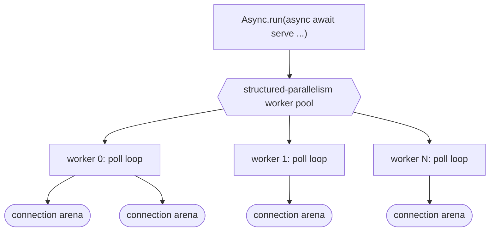
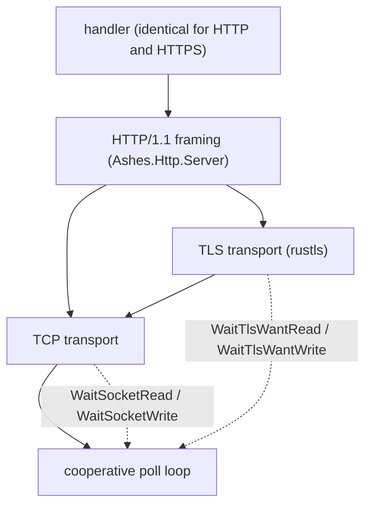
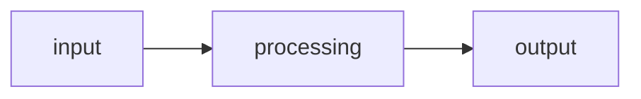
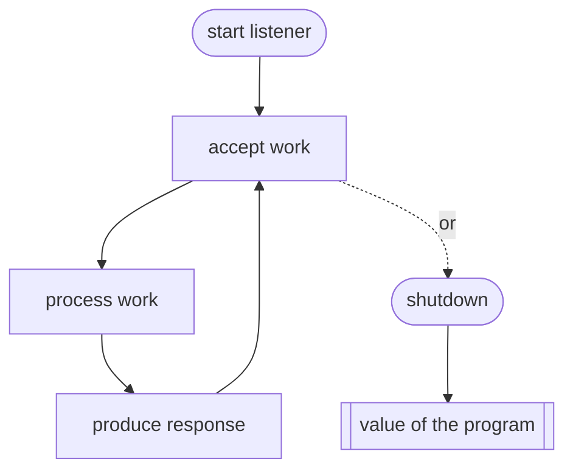

# Future: Server Support

## Status: Design (direction decided)

This document describes the intended design for long-running server support in Ashes. It supersedes
the earlier open-ended exploration: the major forks have been resolved and are recorded below as
decisions, with a smaller set of genuinely open questions left at the end.

It remains a design document, not an implementation guide. The implementation must be derived from
the existing compiler and runtime architecture (parser, semantic analysis, capabilities, async
lowering, IR, state-machine transformation, the cooperative scheduler, the structured-parallelism
runtime, and the arena memory model), not from any code sketch here. The `.ash` snippets are
illustrative surface syntax and are expected to bend to what the compiler actually infers and lowers.

---

## Goal and philosophy

Ashes programs have a clear beginning, a final expression, and eventual termination. Server support
preserves this: a server is not a different kind of program, it is a long-running expression whose
value is the lifecycle of the listener. The program still terminates — it terminates when the server
stops.

There are two entirely separate kinds of result, and keeping them separate is the spine of the whole
design:

- **The per-request / per-connection result** is local to one unit of work. It is consumed to
  produce a response and never affects the server.
- **The server lifecycle result** is the value of the final program expression. `Ok(())` means a
  clean stop (graceful shutdown, explicit stop, cancellation); `Error(...)` means the listener could
  not run (bind failure, unrecoverable listener failure).

---

## Execution model (decided)

A server is not a new runtime. It is the composition of three subsystems Ashes already has:

1. **The cooperative poll loop.** The async runtime is already an event loop: state-machine tasks
   park on typed waits (`WaitSocketRead`, `WaitSocketWrite`, `WaitTlsWantRead`, `WaitTlsWantWrite`,
   `WaitTimer`) and the scheduler `poll()`s the aggregate descriptor set when nothing is runnable.
   Accepting a connection is a task parked on `WaitSocketRead` of the listening descriptor; each
   accepted connection becomes another task on the same loop. No new scheduling concept is required
   to multiplex many connections on one thread.
2. **The structured-parallelism runtime.** Multi-core execution already exists: a worker pool built
   on `clone`/`futex` with a work-conserving queue, each worker owning a per-thread arena.
3. **The arena memory model.** Deterministic, reclaim-by-scope allocation with the reuse
   specialization that keeps hot loops allocation-free.

A server is therefore: **N worker threads (structured parallelism), each running an independent copy
of the cooperative poll loop over its own share of the connections, each connection scoped to its own
arena within the worker.**



The program itself is unchanged — a long-running task awaited as the final expression:

```ash
match Ashes.Async.run(async
    await http.serve(8080)(handle))
with
    | Ok(()) -> io.print("server stopped")
    | Error(e) -> io.print(e)
```

`await` is only legal inside an `async` block driven by `Ashes.Async.run` (see LANGUAGE_SPEC), so the
lifecycle match wraps `Async.run`, not a bare top-level `await`. `serve` returns the lifecycle
`Task(E, ())`.

---

## Concurrency model (decided and DELIVERED: multi-process reactors, cooperative loop per reactor)

**Delivered (2026-07-05):** single-threaded cooperative concurrency via `Ashes.Async.spawn`.
`serve` spawns each handler as a detached task with a private arena (freed on completion, so memory
is constant under sustained load); detached tasks advance whenever the driver blocks, and their
socket/timer waits join the driver's poll set (epoll on Linux, WSAPoll on Windows — all three
targets in lockstep). Measured on the echo benchmark: connections genuinely overlap (four 300 ms
handlers complete in ~300 ms wall), 64-way tail latency roughly halves versus the sequential serve,
throughput lands within ~10-15% of a concurrent .NET echo server — on one core.

**Delivered (2026-07-06):** the multi-core multi-reactor, shipped as **processes** rather than
threads (see Work status for the mechanism per target). A first spike showed `Parallel.both`
cannot host reactors (it is fork-join; a never-returning reactor deadlocks the join), so instead
of a dedicated long-lived-worker thread primitive the reactors are forked/relaunched processes —
separate address spaces keep each reactor's scheduler state independent, which purity keeps sound.
The bullets below describe the design as shipped.

- **Worker-per-core, independent reactors.** Each worker process runs its own poll loop and handles
  its own connections. There is no shared connection state and no cross-worker scheduler — this is
  the multi-reactor (prefork) shape, not a single acceptor feeding a thread pool.
- **Accept distribution.** The preferred mechanism is `SO_REUSEPORT`: each worker binds the same
  address independently and the kernel load-balances new connections across them, avoiding a shared
  accept queue and thundering-herd wakeups. A single shared bound descriptor that all workers
  `accept()` on is the fallback where `SO_REUSEPORT` is unavailable — this is what Windows uses
  (an inherited listener shared by relaunched worker processes); Linux x64 and arm64 use
  `SO_REUSEPORT`.
- **Worker count** defaults to the detected core count (the same cap the parallel runtime uses) and
  is overridable, mirroring the existing `--parallel-workers` / worker-override surface.
- **Purity is an asset here.** Because there is no mutation, connections are genuinely independent;
  there is no shared mutable request state to guard. Any cross-connection aggregation a program wants
  (counters, metrics) is expressed with the same merge-on-join pattern as `Parallel.reduce`, not
  shared memory.

---

## Handler model (decided: return a response directly)

Handlers produce a response directly. There is no separate `render` function and no
`Result(AppError, Response)` convention imposed by the framework — an error response such as a 404 is
an ordinary `Response`, and the handler builds it. `Result` is reserved for the server lifecycle, not
for application errors.

### HTTP

```ash
import Ashes.Http.Server as http
import Ashes.IO as io

let handle req =
    match http.path(req) with
        | "/health" -> http.text(200)("ok")
        | _ -> http.text(404)("not found")
in
    match Ashes.Async.run(async await http.serve(8080)(handle)) with
        | Ok(()) -> io.print("server stopped")
        | Error(e) -> io.print(e)
```

- The handler type is `Request -> Task(E, Response)`. The normal path is a `Response`. Handlers do
  async work with ordinary `await`:

  ```ash
  let handle req =
      match await users.find(42) with
          | Ok(user) -> http.json(200)(user)
          | Error(_) -> http.text(404)("not found")
  ```

- **Handler failures are always isolated to their connection.** If a handler's task leaks an
  `Error(e)` (an unhandled failure rather than an explicit response), the server turns that single
  connection into a 500 and continues; it never stops the listener. The only failures that end the
  server are lifecycle failures (bind/listener), surfaced through the lifecycle result. Handlers are
  encouraged to catch and build explicit responses; the 500 path is a safety net, not the intended
  error channel.
- There is deliberately no `serveAsync` variant. Async is the model; a synchronous handler is just
  one that never awaits.

### TCP

TCP is session-oriented rather than request/response: the handler owns the connection and reads and
writes until the session ends.

```ash
import Ashes.Net.Tcp.Server as tcp

let recursive handle client =
    match await tcp.receive(client)(4096) with
        | Ok("") -> Ok(())
        | Ok(message) ->
            match await tcp.send(client)("echo: " + message) with
                | Ok(_) -> handle(client)
                | Error(e) -> Error(e)
        | Error(e) -> Error(e)
in
    match Ashes.Async.run(async await tcp.serve(9000)(handle)) with
        | Ok(()) -> io.print("server stopped")
        | Error(e) -> io.print(e)
```

- The handler type is `Connection -> Task(E, ())`. Persistent protocols make the handler naturally
  recursive; no loop construct is introduced. The connection is a resource, closed automatically when
  the handler task completes (see memory lifetime).

---

## Memory lifetime (central constraint)

This is the gating design work, not a side concern. The arena model assumes a program terminates and
reclaims at exit; a server never terminates, so any allocation not scoped and reclaimed accumulates
until the process is killed. Server support is unsound until this is resolved.

- **Per-connection arena scope.** Each accepted connection's handler allocates into a scope bounded
  by that connection's task, reclaimed deterministically when the task completes. Because a single
  worker's poll loop keeps many connections live at once, the requirement is stronger than the
  existing per-thread arena: a worker needs **many concurrent, independently reclaimed scopes**, one
  per live connection, not a single arena reset at a loop boundary.
- **Ties into ownership / resource safety.** A connection (its socket) is a resource with a lifetime;
  its arena scope is exactly that lifetime. This is the same machinery the ownership and
  resource-safety roadmap is building — auto-drop of a resource bound to a scope — applied to a
  connection task. Server lifetimes should be derived from that work rather than a bespoke mechanism.
- **Backpressure and bounds.** Per-worker concurrent-connection limits (accept throttling) cap
  resident memory and protect against overload; connections beyond the limit are queued or rejected
  rather than admitted unboundedly. The reuse specialization keeps steady-state per-request work
  allocation-free on the hot path where it applies.

Concrete acceptance criterion: a server under sustained load must reach a steady-state resident set,
with per-connection allocation returning to the arena on connection close. This should be validated
the way the 1BRC work validates constant memory — resident-set stability across a long run, not just
a smoke test.

---

## Capabilities

Server entry points perform network I/O, so they carry a network capability under the unified
capabilities system. This is consistent with how effectful operations are tracked elsewhere and
makes "this program is a server" visible in its type rather than hidden. Delivered as the split
built-in marker capabilities `NetListen` / `NetConnect` — see Decisions below and LANGUAGE_SPEC
section 20.8.

---

## Library before syntax

The first implementation introduces no new language syntax. Server support is a library:

```ash
http.serve(8080)(handle)
tcp.serve(9000)(handle)
```

Everything above is expressible with existing constructs — functions, `match`, recursion, `async` /
`await`, capabilities, and the parallelism runtime. Dedicated syntax is only worth revisiting if,
after the library matures, it demonstrably improves readability rather than duplicating what these
constructs already express.

---

## Networking layers (decided: TCP first, HTTPS in scope)

The layers stack: a byte transport (plaintext TCP or TLS), then HTTP framing on top of whichever
transport. HTTPS is not a separate server — it is the HTTP server running over a TLS transport, so the
handler is byte-for-byte identical between HTTP and HTTPS.



- **TCP server** is the base primitive: `bind` / `listen` / `accept` added to `Ashes.Net.Tcp.Server`,
  reusing the existing `send` / `receive` / `close` and the existing socket wait kinds. `accept` parks
  on `WaitSocketRead` of the listener.
- **TLS transport** rides the existing hermetic `rustls` runtime. This is a smaller addition than it
  looks: the cooperative poll loop already drives rustls connections through `WaitTlsWantRead` /
  `WaitTlsWantWrite`, the runtime is already embedded per-executable on all three targets
  (linux-x64, linux-arm64, win-x64), and an accepted TLS connection is the existing `TlsSocket`
  runtime type. What is genuinely new is the **server side** of rustls: the client path only uses the
  client-config and certificate-verifier FFI surface, so a server needs the server-config / acceptor
  surface plus certificate-and-key provisioning (present a chain and private key, do the server half
  of the handshake, honor SNI). There is already a `tls-server` loopback fixture in the test harness,
  but it is a C# test helper for exercising the client — not an Ashes-native listener.
- **HTTP server** is a library over the transport: request parsing and response serialization,
  `Ashes.Http.Server`, reusing the HTTP/1.1 conventions already present on the client side. It is
  parameterized over the transport, which is what makes HTTP and HTTPS one code path.

### HTTPS example

The handler is unchanged from the HTTP example; only the listener differs — it takes a TLS config
(certificate chain and private key) and binds a TLS transport:

```ash
import Ashes.Http.Server as http

let handle req =
    match http.path(req) with
        | "/health" -> http.text(200)("ok")
        | _ -> http.text(404)("not found")
in
    let tls = http.tls("cert.pem")("key.pem")
    in
        match Ashes.Async.run(async await http.serveTls(8443)(tls)(handle)) with
            | Ok(()) -> io.print("server stopped")
            | Error(e) -> io.print(e)
```

`serveTls` shares the lifecycle result, the handler contract, and the multi-reactor / per-connection
arena model with `serve`; TLS is purely the transport underneath. The same applies to raw encrypted
TCP sessions — a TLS counterpart to `tcp.serve` where the handler receives a `TlsSocket`.

**Sequencing.** Prove the plaintext TCP-then-HTTP path first, then add the TLS transport; but HTTPS is
a designed-for layer here, not an afterthought — the whole point of parameterizing HTTP over the
transport is that HTTPS falls out without a second handler model.

---

## Work status

### Delivered (all three targets, tested per target; exceptions noted)

- `Ashes.Net.Tcp.Server`: `listen` / `accept` primitives (non-blocking; `accept` parks on
  `WaitSocketRead`) and the `serve(port)(handler)` combinator.
- Single-threaded concurrent serving: `serve` spawns each handler via `Ashes.Async.spawn`
  (detached tasks with private, individually reclaimed arenas — memory is constant under
  sustained load, which also covers the per-connection reclamation milestone for the
  single-threaded case). Ownership of resources referenced by a spawned task moves into the task.
- `Ashes.Http.Server`: minimal HTTP/1.1 — request-line parse (`method` / `path`), response
  constructors (`text`, status reasons, `Content-Length`), synchronous handler, `Connection: close`.
- `Ashes.Http.Server` extensions: request headers (`header(req)(name)`, case-insensitive) and body
  (`body(req)`), `json` and custom-header (`respond`, `withHeader`) responses, and **async handlers**
  (`handler : HttpRequest -> Task(E, HttpResponse)`, so a handler can `await`; a handler `Error`
  becomes a `500`).
- HTTP/1.1 **keep-alive** and **cross-read buffering**: the connection is reused for successive
  requests; reads are buffered until a full request (headers + `Content-Length` bytes of body) is
  available, so bodies larger than one read and slow/split requests work. Closes on
  `Connection: close`, handler failure, or peer disconnect. Request bodies may be framed by
  `Content-Length` or `Transfer-Encoding: chunked` (chunk extensions ignored, trailers unsupported).
- **Persistent epoll scheduler (Linux)**: each reactor creates one epoll fd and reuses it for every
  wait (no epoll_create1/close per park), with a per-fd mask table so a socket is registered once
  (EPOLL_CTL_ADD), re-MOD'd only when its event mask changes, and skipped when already correct — so a
  wait over N parked sockets costs O(newly-parked) syscalls, not O(N). Sockets leave the set
  kernel-side on close (with a `forget` hook clearing the table for fd reuse). The Windows detached
  WSAPoll array cap was raised 256 -> 4096.
- **Graceful shutdown (Linux)**: the runtime installs `SIGINT`/`SIGTERM` handlers (a naked
  `rt_sigreturn` restorer, no `SA_RESTART`) so the signal interrupts the parked `accept` (`EINTR`);
  the accept step then completes with a shutdown sentinel and `serve` stops the loop and returns
  `Ok(())`, so the program exits cleanly (verified single- and multi-worker on linux-x64; arm64 uses
  the standard `rt_sigreturn` restorer). Windows serve terminates on the default disposition today; a
  console-ctrl handler + accept wake-up is the remaining piece there.
- Server-side TLS (`Ashes.Net.Tls.Server`): `handshake(socket)(certPem)(keyPem)` (rustls server
  config built once from PEM contents and cached; server half of the handshake, reusing the
  scheduler's `WaitTlsWantRead` / `WaitTlsWantWrite` parking) and the `serveTls(port)(certPath)(keyPath)(handler)`
  combinator. Same hermetic rustls runtime and three targets as the TLS client.
- **Multi-core multi-reactor on all three targets** (`serve` is parallel by default): one reactor
  process per online CPU, so an endpoint scales across cores with no worker count in program code.
  `serve(port)(handler)` uses this automatically; `serveParallel(port)(workers)(handler)` overrides
  the count. Worker count defaults to one per online CPU, honoring the shared `--parallel-workers`
  cap. Separate address spaces make each reactor's scheduler state independent, which purity keeps
  sound. Two mechanisms behind one `forkWorkers` intrinsic:
    - **Linux (x64 native + arm64 via qemu):** the parent `fork`s the workers up front; each binds the
      port with `SO_REUSEPORT` so the kernel load-balances new connections. Children get
      `PR_SET_PDEATHSIG` so they die with the parent.
    - **Windows (win-x64):** no `fork` and no `SO_REUSEPORT`, so the parent creates one inheritable
      listener, publishes it (a `__ashes_worker_listener` global + the `ASHES_WORKER_FD` env var) and
      relaunches itself with `CreateProcessA(bInheritHandles=TRUE)`; each worker adopts the inherited
      handle (its `listen` returns it) and all accept on the one shared listener. A Job Object with
      `KILL_ON_JOB_CLOSE` makes workers die with the parent. Verified functionally under Wine; the
      automated win-x64 tests cap to a single reactor because Wine's cross-process inherited-socket
      accept is unreliable (a Wine limit, not a code issue) — the multi-process path is covered by the
      Linux `serveParallel` test and manual runs.
  This sidesteps the fork-join long-lived-worker problem below by using processes rather than the
  `Parallel` worker pool.
- Cross-target parity for all of the above (linux-x64 native, linux-arm64 via qemu, win-x64 via
  wine/WSAPoll) plus a load/latency benchmark against a .NET baseline (`challenges/server/`): with
  the multi-reactor, TCP echo leads the .NET baseline and HTTP roughly doubles it at conc 64.
- **Run-queue scheduler with fair composites** (2026-07-07): the cooperative runtime is a flat
  run-queue (park / enqueue / resume with waiter delivery) instead of re-entrant detached stepping,
  so a detached handler blocked in `Ashes.Async.all` / `race` advances its peers — two connections
  whose handlers both aggregate sub-tasks now overlap instead of serializing. Async tail-recursive
  loops (the serve and connection loops) compile to a single looping coroutine with a restart
  back-edge (no C-stack recursion), which also fixed concurrent-HTTP corruption under load. Every
  async program on every target runs on the scheduler: the aggregate wait is the persistent epoll
  set on Linux and one `WSAPoll` over the parked set on Windows (win-x64 parity delivered
  2026-07-07; overlap regression test mutation-verified against the legacy driver).
- **Per-iteration arena reset at the async-loop restart back-edge** (2026-07-07): a long-lived loop
  such as an HTTP keep-alive connection reclaims each request's allocations instead of growing its
  arena per request. The reset is gated statically (no `Async.spawn` in the loop body) and at
  runtime (a task-header flag cleared when an `all` / `race` composite ancestor shares the arena).
  Validated by an RSS regression test (3000 keep-alive requests of a 16 KB body: bounded, versus
  +68 MB with the reset disabled) and a benchmark rerun showing no throughput cost. This closes the
  memory-lifetime acceptance criterion (steady-state resident set); with win-x64 scheduler parity
  the reset is active on all three targets.

### Remaining (specifications in Decisions below; implement in this order)
1. **Graceful shutdown completion:** DELIVERED — drain with timeout (default 10 s, second signal
   forces, `serveWithDrainTimeout`), the Windows console-ctrl handler, and the multi-worker parent
   forwarding the signal and reaping workers instead of cutting them via the death signal.
2. **Stop capability:** DELIVERED — `Stop.stop(Unit)` built-in performable capability requests
   graceful whole-server shutdown through the signal/drain path (a worker signals the parent);
   `needs {Stop}` visible in handler types (LANGUAGE_SPEC section 20.8). Landed with a prerequisite
   fix: capability rows now thread through higher-order library combinators and recursive helpers
   (previously a recursive helper's self-type had a closed `{}` row, which rejected passing any
   capability-performing function to `serve`, `List.map`, etc. — this also un-blocks a handler that
   dials out with `NetConnect`).
3. **`NetListen` / `NetConnect` capabilities**: DELIVERED — built-in marker capabilities on the
   endpoint-creating operations (LANGUAGE_SPEC section 20.8); closed rows reject undeclared
   endpoint creation (ASH018), the runtime is their implicit provider at top level.
4. **HTTP streaming bodies:** incremental chunked-request decode is DELIVERED (each read decodes
   only the undecoded tail; the 8 MiB cap applies mid-stream). Next: response streaming
   (`Transfer-Encoding: chunked` from a pull-based producer, which needs function-typed ADT fields
   first), then the request-side body reader (after the affine-ownership work).
5. Minor scheduler refinement: the aggregate wait re-queues every parked leaf per wakeup
   (O(parked)); per-fd wakeup targeting would cut re-step work under very high concurrency. A first
   implementation attempt is parked as too delicate to land in a rushed pass — it needs care on
   three points found the hard way: (a) `struct epoll_event` is `__attribute__((packed))` on x86-64
   (12-byte stride, `data` at offset 4) but unpacked on arm64 (16-byte stride, `data` at offset 8),
   so registering the fd in `data` and reading it back from `epoll_wait` must be arch-correct — the
   existing registration writes `data` at offset 8, which is harmless only because the current
   requeue-all never reads it back; (b) the batched event buffer must be a module-global, not a
   stack alloca — `EmitSchedulerAggregateWait` runs inside the scheduler loop, so a per-wakeup 1 KB
   alloca overflows the stack; (c) the requeue pass must partition the parked list (re-queue only
   ready sockets and elapsed timers, rebuild the rest) without breaking the drain-timer and
   graceful-shutdown paths, which the first attempt still got wrong. Best done as a focused change
   with the full server suite plus the concurrent-HTTP test as the guard.

---

## Desired mental model

A normal program:



A server:



Only shutdown produces the value of the overall program.

---

## Decisions (settled 2026-07-07)

The former open questions are now decided as follows. These are specifications to implement
against, in the listed order; the `.ash` shapes bend to what the compiler actually infers.

### Graceful shutdown: drain with timeout, second signal forces

The first `SIGINT` / `SIGTERM` (or console-ctrl event on Windows) stops accepting and begins a
**drain**: in-flight handlers may run to completion for up to a bound (default **10 s**), after
which the server exits with the lifecycle result `Ok(())`. A **second** signal during the drain
exits immediately. A multi-worker parent forwards the signal to its workers and waits out the same
bound rather than cutting them via the death signal / job object (those remain as the crash
backstop, not the shutdown path). Draining means: the accept task completes with the shutdown
sentinel as today, and the reactor keeps running until its live spawned handler count reaches zero
or the bound elapses. The bound is a `serve` variant parameter (`withDrainTimeout`-shaped), not a
global.

Windows mechanism: `SetConsoleCtrlHandler` (the handler runs on a separate thread) sets the
shutdown flag; because another thread cannot interrupt a parked `WSAPoll` the way a signal EINTRs
`epoll_wait`, the aggregate wait's socket timeout is **capped at 200 ms**, so the flag is observed
within one cap interval and from there the sentinel path is identical to Linux. (A per-reactor
loopback wake socket in every poll set is the refinement if sub-cap reaction time ever matters; an
idle server waking 5x/s costs nothing measurable.) A second console event during the drain calls
`ExitProcess(0)`.

### Programmatic stop: a Stop capability

Beyond signals, a server can be stopped from inside the program through a **capability**, designed
under the unified capabilities system: a `serve` variant runs the handler with a `Stop` capability
in scope; invoking its operation (once) triggers exactly the signal path above — stop accepting,
drain, lifecycle `Ok(())`. One-shot semantics: further invocations are no-ops. This is the first
effectful one-shot capability, so its precise typing (operation shape, interaction with handler
purity) must be specified in LANGUAGE_SPEC before implementation; it deliberately shares every
runtime mechanism with signal shutdown so the capability is thin.

### HTTP streaming: full request + response design

Both directions are in scope, sharing one concept: a body is a **stream of byte chunks** rather
than a `Str`.

- **Request side.** A streaming handler variant receives the request with headers parsed but the
  body unread, plus a **body reader** — a resource (like a socket; auto-dropped with the
  connection, non-escaping) pulled with `await http.readChunk(reader)` returning
  `Ok(Some(bytes))` / `Ok(None)` at end-of-body / `Error(e)` on transport failure. Framing
  (Content-Length or chunked) is decoded incrementally under the reader, which also removes the
  remaining per-read chunked re-decode. The buffered `body(req)` handler stays the default surface;
  the 8 MiB cap applies only to the buffered form.
- **Response side.** A streamed response is built from a **pull-based chunk producer** (the same
  recursion-instead-of-loops shape as everything else: a function returning
  `Task(E, Option((chunk, next)))`-morally, exact shape to be pinned against what lowering
  supports); the server sends `Transfer-Encoding: chunked` framing, one chunk per pull.
- **Implementation order:** incremental chunked-request decode under the existing buffered surface
  first (no API change), then response streaming, then the request-side reader (it leans on the
  resource-safety machinery for the reader's non-escape guarantee).

Still open within HTTP, deliberately minor: per-server configurability of the 8 MiB cap and finer
header limits (count / line length) — revisit when a concrete need appears.

### TLS server policy for v1: rustls defaults, single certificate

Certificate and key provisioning stays PEM file paths (ACME / auto-renewal out of scope). One
certificate chain per listener — no SNI map / virtual hosting in v1. TLS version and cipher policy
are the rustls defaults (TLS 1.2 / 1.3) with no knobs. No mutual TLS / client-certificate
authentication in v1. No ALPN until HTTP/2 framing exists. Each of these widens only when a
concrete use case arrives; the rustls server-config plumbing already shipped.

### Network capability: split listen / connect

Two distinct capabilities under the unified capabilities system, not one `Net`:

- **`NetListen`** — required to open a listening endpoint: `tcp.serve` / `http.serve` /
  `serveTls` (and the underlying `listen`).
- **`NetConnect`** — required to dial out: `tcp.connect`, `Http.get` / `post`, TLS client
  connects.

Operations on an **established** connection (send / receive / close on an accepted or connected
socket, and the handler's work generally) require no capability: possession of the connection
resource is the authority, and the capability governs creating endpoints, not using them. A
program that both serves and calls out carries both. The split is the security-meaningful boundary
("this program opens a listener"), and deciding it now avoids a breaking re-split of a coarse
`Net` later.

### Cross-target accept distribution (resolved earlier)

Delivered on all three targets: `SO_REUSEPORT` per-worker binds on Linux (x64 and arm64), and an
inherited shared listener on Windows (the parent creates one inheritable listener and relaunches
itself; workers accept on the shared handle). See Work status.
