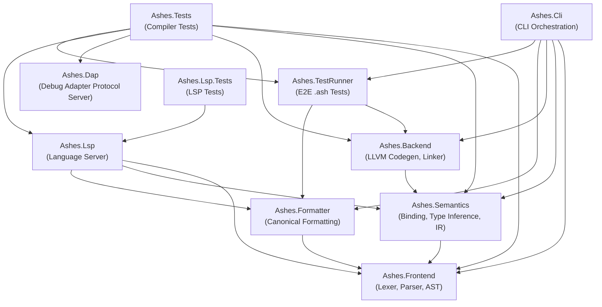
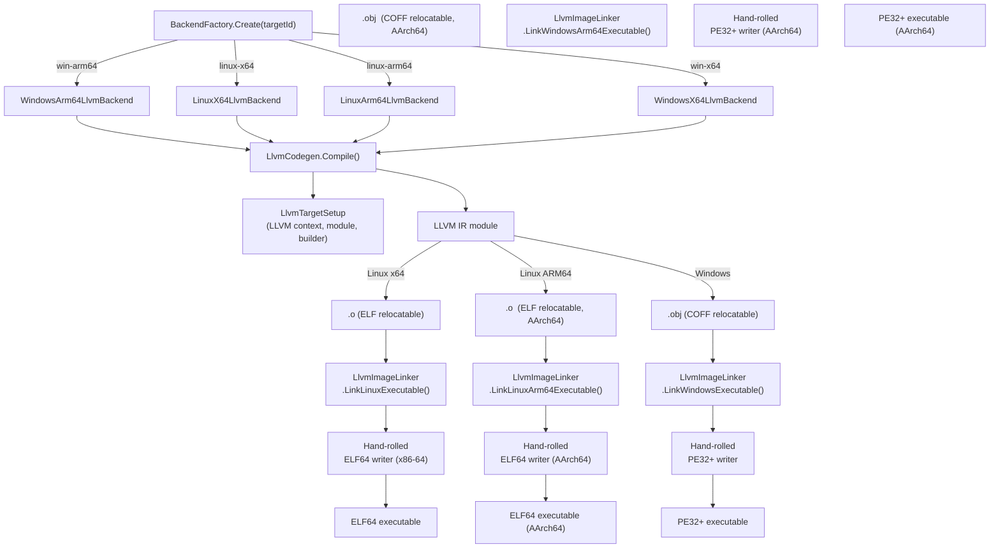
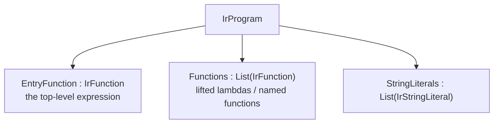

# Compiler Architecture

This document describes the internal architecture of the Ashes compiler,
covering the compilation pipeline, project structure, backend design,
intermediate representation, memory model, and linking strategy.

---

## Compilation Pipeline

Source code flows through four major phases before producing a native
executable:

```mermaid
flowchart LR
    A[".ash source"] --> B["Lexer"]
    B --> C["Token stream"]
    C --> D["Parser"]
    D --> E["AST"]
    E --> F["Binder / Resolver\n+ Type Inference"]
    F --> G["Typed AST"]
    G --> H["Lowering"]
    H --> I["IR"]
    I --> J["LLVM Codegen"]
    J --> K["LLVM IR"]
    K --> L["Object code\n(.o / .obj)"]
    L --> M["Linker"]
    M --> N["Native executable\n(ELF / PE)"]
```



| Phase | Project | Key class | Output |
|-------|---------|-----------|--------|
| Tokenization | Ashes.Frontend | `Lexer` | Token stream |
| Parsing | Ashes.Frontend | `Parser` | `Ast` nodes |
| Binding, inference & lowering | Ashes.Semantics | `Lowering` | `IrProgram` |
| Code generation | Ashes.Backend | `LlvmCodegen` | LLVM IR → object file |
| Linking | Ashes.Backend | `LlvmImageLinker` | Native executable bytes |

Each pipeline project's public surface is documented directly from its `///` XML doc comments in
the [Frontend](api/frontend.md), [Semantics](api/semantics.md), [Backend](api/backend.md), and
[Formatter](api/formatter.md) API references.

---

## Project Dependency Graph

The repository is split into ten .NET projects with strict dependency
rules:



**Key rules:**

- **Frontend** has zero internal dependencies.
- **Semantics** depends only on Frontend.
- **Backend** depends only on Semantics (transitively Frontend).
- **Formatter** depends only on Frontend — it never touches Semantics or Backend.
- **Lsp** must **not** depend on Backend.
- **Dap** currently has zero internal compiler dependencies and remains a standalone tooling process.
- **Cli** is the only orchestration project that wires all phases together.

---

## Tooling Servers

Ashes exposes two editor-facing servers alongside the compiler and CLI:

| Project | Protocol | Responsibility |
|---------|----------|----------------|
| Ashes.Lsp | Language Server Protocol | Syntax highlighting, diagnostics, completions, hovers, formatting |
| Ashes.Dap | Debug Adapter Protocol | Launching debug sessions, translating IDE debug requests to native debugger commands, surfacing runtime state |

`Ashes.Lsp` is a consumer of compiler phases: it requests parsing,
binding, and formatting services from the compiler projects and converts
the results into LSP responses.

`Ashes.Dap` is intentionally outside the compiler pipeline. It does not
parse or type-check `.ash` code; instead it brokers DAP traffic between
the IDE and a native debugger backend such as GDB or LLDB, operating on
already-compiled binaries and their debug information.

---

## Package manager

Ashes has **no separate compilation and no binary artifacts**: `ProjectSupport.BuildCompilationPlan`
resolves imports across directories and stitches every module into one source string that is
type-inferred, monomorphized, and lowered as a unit. Three consequences shape the whole package model:

- **A package is a source tree** — nothing to build or version by ABI. The global cache is
  content-addressed *source*; "installing" a cached package makes its roots visible to resolution rather
  than compiling it (so a cached `ashes add` is instant).
- **One version per package per build** — two versions would stitch into the same namespace and collide,
  so a version conflict is an error, not duplicate-and-isolate. This removes npm-style diamond
  duplication by construction.
- **The compiler is never the solver** — resolution happens in the CLI at `restore` time and produces a
  deterministic set of source roots that the compiler, LSP, and test runner all consume through
  `LoadProject`. `ResolveImport` never learns about registries, versions, or archives.

Dependencies are declared in `ashes.json` (see the projects guide) and imported under a namespace (the
`namespace` field, else the PascalCase of the package name). A **path** dependency resolves live from
disk; a **registry** dependency resolves through the registry into the lock and cache. Both are
transitive — a dependency's own dependencies are pulled, diamond-deduplicated, and a cycle is `ASH035` —
and the namespace discipline (`ASH028` / `ASH029`) is enforced across the whole resolved set.

**Resolution** is the Cargo model: SemVer constraints, the highest version satisfying all constraints
across the transitive graph, unified to one version per package, pinned in `ashes.lock`. A first resolve
pins the newest compatible version; later publishes do not change the build until an explicit update. An
empty intersection is a typed conflict (`ASH032`). The single-version world makes this simpler than
npm/Cargo (no multi-version isolation to attempt); unlike Go's MVS it selects newest-compatible rather
than lowest.

**Lock file** (`ashes.lock`) — a generated, committed file holding the resolved graph so every front end
consumes an identical root set. `restore` writes it; `build` / `run` / `test` read it (auto-restoring a
missing or stale lock); `restore --frozen` fails if resolution would change it, and `--offline` trusts it
and only verifies the cache. Each entry records the package's namespace, version, source
(`registry+<url>` or `git+<url>`), and `ash1:` hash.

**Cache** — content-addressed source under `$XDG_CACHE_HOME/ashes` (`cache/pkg/<ns>/<version>/<hash>/…`),
shared across projects, deduplicated, and safe under concurrent CI. The compiler and the CLI compute cache
paths the same way (`ProjectSupport.CachePathFor`), so the compiler reads exactly what `restore` wrote;
cached content is verified against the lock's hash (`ASH034`) before use.

### The `ash1:` content hash

The integrity value is a hash of the **source tree**, not of any archive, so it is identical however the
source was fetched. Over the set of packaged files:

1. Each file is a `(path, bytes)` pair, `path` package-root-relative with `/` separators (no leading
   `./`, no backslashes).
2. Emit the line `"<sha256-hex-of-bytes>  <path>\n"` (two spaces, LF) per file.
3. Sort the lines by `path` (ordinal).
4. Concatenate, SHA-256 the result, hex-encode it lowercase, and prefix `ash1:`.

Directory entries, symlinks, and file modes are excluded — only paths and contents contribute. The
registry recomputes this at publish and rejects a mismatch against the client's declared value; the client
re-verifies every download and cache read. The CLI (`SourceHasher`) and server (`ContentHash`) implement
it independently, locked to agreement by a pinned test vector.

The command surface (`add` / `remove` / `restore` / `tree` / `why`, and the registry verbs) is in the CLI
reference; the manifest shape and namespace discipline are in the projects guide.

---

## Package registry

`Ashes.Registry` is the reference package registry: a standalone ASP.NET Core (.NET 10) minimal-API server
that stores and serves Ashes packages. It lives in the compiler solution for build/test/format but deploys
on its own lifecycle, and is a strict downstream consumer of `Ashes.Frontend`/`Ashes.Semantics` for
publish-time validation — no compiler phase depends on it. Packages are **source**: a published version's
blob is the gzip source tarball, content-addressed by the `ash1:` hash of its uncompressed file tree, so
identical trees deduplicate and a download verifies by re-hashing regardless of transport.

**HTTP API (`/api/v1`).** Read endpoints are unauthenticated and cacheable; writes take a bearer token.

| Method | Path | Purpose |
|--------|------|---------|
| GET | `/healthz`, `/api/v1/index` | Liveness; registry info + effective limits |
| GET | `/api/v1/packages`, `/api/v1/search?q=` | Browse (paginated); search (FTS5-ranked) |
| GET | `/api/v1/packages/{ns}`, `/api/v1/packages/{ns}/{version}` | Package metadata + versions; one version |
| GET | `/api/v1/packages/{ns}/{version}/source` | Download the source tarball (`application/gzip`) |
| POST | `/api/v1/tokens` | Mint an API token |
| PUT | `/api/v1/packages/{ns}/{version}` | Publish (multipart: `metadata` JSON + `source` tarball) |
| POST | `/api/v1/packages/{ns}/{version}/yank`, `/unyank` | Yank / reverse a yank (owner-only) |
| GET/POST/DELETE | `/api/v1/packages/{ns}/owners` | List / add / remove co-owners (owner-only) |

Errors use a uniform envelope `{ "error": { "code", "message" } }` with stable codes: `not_found`,
`unauthorized`, `namespace_owned_by_another`, `version_exists`, `version_yanked`, `limit_exceeded`,
`namespace_lint`, `invalid_version`, `hash_mismatch`. The generated OpenAPI document and its Scalar
reference are mapped in the Development environment only.

**Publish pipeline.** `PUT` runs an ordered pipeline that writes nothing until every stage passes:
authenticate → unpack the tarball under the per-file/total/count and decompressed-ceiling limits and the
source-only content allowlist → authorize the namespace (the first publish claims it, later versions
require ownership) → validate SemVer and immutability (a differing hash for an existing version is
`version_exists`; an identical re-publish is an idempotent no-op) → namespace lint → compute the `ash1:`
hash server-side and verify it against the client's declared value → extract the public capability rows →
store the blob, then the package (owner claim), then the version.

**Capability audit.** The namespace lint and capability extraction reuse the compiler front end behind
`IManifestValidator` / `ICapabilityExtractor`. The default extractor parses and lowers the uploaded source
— stitching multi-module packages through the project loader when an `ashes.json` is present — and reads
the inferred `needs {...}` rows off the exported bindings via `Lowering.PublicApiCapabilities()`, so the
audit reflects real inference rather than a heuristic scan. It is best-effort: a compiler failure yields
no capabilities instead of blocking the publish.

**Storage** sits behind narrow interfaces (`IBlobStore`, `IMetadataStore`, `ISearchIndex`, `IAccountStore`)
so the reference filesystem/SQLite implementation can be swapped for object storage / PostgreSQL at scale:

- Content-addressed **blobs** on the filesystem (`data/blobs/<kk>/<hash>`), written atomically and deduplicated.
- **Metadata, accounts, and tokens** in SQLite via EF Core migrations. The database is configured by
  `ConnectionStrings:Registry` (defaulting under the `--data` directory) and swaps to PostgreSQL by provider.
- **Search** is a SQLite FTS5 index over namespace/description/keywords, kept in sync by triggers; queries
  select candidates by prefix-token match and rank name-first (exact > prefix > description, downloads tie-break).

Token secrets are random 256-bit values, shown once and stored only as SHA-256 hashes. `POST
/api/v1/tokens` open self-registration is a self-host convenience gated by `Registry:AllowOpenRegistration`
(default on); a public instance turns it off and provisions tokens out of band. The client verbs
(`login`, `publish`, `yank`, `search`, `info`) are covered in the CLI reference.

---

## Backend Architecture

The backend converts IR into a native executable through LLVM:



All backends implement `IBackend` and delegate to the same
`LlvmCodegen.Compile()` entry point, which branches internally based on
the target ID.

### External dependencies

| Dependency | Source | Purpose |
|------------|--------|---------|
| libLLVM (native) | Downloaded via `scripts/download-llvm-native.*` | LLVM C API (`libLLVM.so` / `libLLVM.dll`) |
| Mbed TLS (bitcode) | Vendored under `runtimes/` (refreshed via `scripts/download-mbedtls.sh`) | TLS runtime for `Ashes.Net.Http` / `Ashes.Net.Tls` (`libmbedtls.bc`), linked into programs that use it |
| openlibm (bitcode) | Vendored under `runtimes/` (refreshed via `scripts/download-openlibm.sh`) | Transcendental math for `Ashes.Number.Math` Layer 2 (`libopenlibm.bc`), linked into programs that use it |
| PCRE2 (bitcode) | Vendored under `runtimes/` (refreshed via `scripts/download-pcre2.sh`) | Regular-expression engine for `Ashes.Text.Regex` (`libpcre2.bc`, 8-bit + Unicode, JIT off), linked into programs that use it |

The compiler talks to LLVM through a thin P/Invoke interop layer
(`Ashes.Backend/Llvm/Interop/LlvmApi.cs`) — no managed wrapper packages
are used.

#### Updating native runtime libraries

The native payloads live in `runtimes/{linux-x64,linux-arm64,win-x64,win-arm64}/`
and are provisioned for build/publish with the following scripts:

| Dependency | Linux / WSL | Windows (run from WSL) |
|------------|-------------|------------------------|
| libLLVM | `./scripts/download-llvm-native.sh [MAJOR]` (default 22) | `./scripts/download-llvm-native.sh --all [LLVM_VERSION]` |
| Mbed TLS | `./scripts/download-mbedtls.sh` (host arch) or `./scripts/download-mbedtls.sh --all` | `./scripts/download-mbedtls.sh --all` (all targets build on one host with clang) |
| openlibm | `./scripts/download-openlibm.sh` (host arch) or `./scripts/download-openlibm.sh --all` | `./scripts/download-openlibm.sh --all` (all targets build on one host with clang) |
| PCRE2 | `./scripts/download-pcre2.sh` (host arch) or `./scripts/download-pcre2.sh --all` | `./scripts/download-pcre2.sh --all` (all targets build on one host with clang) |

`Ashes.Backend.csproj` validates that the expected LLVM library and
Mbed TLS payload exist for the active RID. LLVM is copied into the
build output root, while `libmbedtls.bc` and `mbedtls.version` are
copied under `runtimes/<rid>/`; `Directory.Build.targets` reapplies the
RID-specific copies during `dotnet publish`.

The Mbed TLS `libmbedtls.bc` payloads are committed to the repository.
Re-run `scripts/download-mbedtls.sh` only when updating `MbedTlsVersion`
or refreshing the vendored bitcode. See *Async & TLS runtime model* below.

The openlibm `libopenlibm.bc` payloads are likewise committed. Re-run
`scripts/download-openlibm.sh` only when updating `OpenlibmVersion` in
`Directory.Build.props` or refreshing the vendored bitcode. Because bitcode is
produced by the clang frontend, every target's payload builds on one host with
clang alone (no cross toolchain). See *Math runtime model* below.

The PCRE2 `libpcre2.bc` payloads (backing `Ashes.Text.Regex`) are committed and provisioned the same
way. Re-run `scripts/download-pcre2.sh` only when updating `Pcre2Version` in
`Directory.Build.props`. The script compiles the 8-bit PCRE2 library (Unicode on, JIT off) from
source to per-target bitcode, then `internalize` + `globaldce` strips everything unreachable from
the exposed API down to a minimal external surface: `malloc`/`free` (routed to an emitted bump
region) and `memcpy`/`memset`/`memcmp`/`strlen` (backend builtins), plus `memchr` (a libc import on
Linux). The Windows payload is compiled with the `windows-gnu` triple — PCRE2's exposed functions
pass more than four arguments, so it needs the Microsoft x64 calling convention — using vendored
declaration-only stub headers plus a small `memchr`/`strchr`/ctype shim, so no MinGW sysroot is
required. A compiled pattern (`pcre2_code*`) lives in the bump region, which the arena never
relocates, so a `Regex` value is a stable handle; per-match scratch is reclaimed by a region cursor
save/restore around each match. The payload is linked into a program only when it uses `Ashes.Text.Regex`
(gated on the regex IR intrinsics), after the program's own optimization passes.

To bump the LLVM version, pass the new version to the download script —
no source changes are needed because the LLVM C API is stable across
releases. For Mbed TLS, update `MbedTlsVersion` in
`Directory.Build.props` and re-run `scripts/download-mbedtls.sh` to
provision matching payloads.

### Async & TLS runtime model

Networking (TCP/HTTP) and TLS are **async-only**: the `Ashes.Net.Http` / `Ashes.Net.Tcp`
/ `Ashes.Net.Tls` APIs return `Task(E, A)` and are consumed via `await` /
`Ashes.Task.run` (the `Task` type is the enforcement — misuse is an ordinary type
error). Under the hood these lower to **non-blocking leaf tasks** driven by the
coroutine/state-machine machinery (`StateMachineTransform.cs` + the LLVM task
runner): each leaf task carries wait metadata and steps incrementally, returning
*pending* on would-block and resuming on readiness — via `epoll` on Linux and
`WSAPoll` on Windows. Networking crosses a per-module runtime ABI (`ashes_tcp_*`,
`ashes_http_*`, `ashes_step_*_task` symbols) rather than calling backend helpers at
each instruction site.

#### The run-queue scheduler

Every async program, on every target, runs on a **flat run-queue scheduler**
(`ashes_scheduler_run`): tasks link into an intrusive FIFO through a `ReadyNext`
header slot, and the loop pops a task, steps it once, and routes the outcome —
*completed* delivers the result to the task's `Waiter` (the task suspended on it)
and re-enqueues that waiter; *suspended* enqueues the freshly awaited sub-task and
parks the awaiter; a *pending leaf* moves to a parked list. `await` therefore
**parks instead of blocking**: no C-stack recursion, and any number of tasks
interleave fairly on one thread (concurrency, not parallelism). When the ready
queue drains and the main task is incomplete, an **aggregate wait** blocks until
the earliest timer deadline or, when socket/TLS/HTTP leaves are parked, on socket
readiness — an `epoll_wait` on a persistent epoll set on Linux, or one `WSAPoll`
over a pollfd array rebuilt from the parked list on Windows — then re-queues the
parked leaves.
`Ashes.Task.all` / `race` are **parking composite tasks**: children carry the
composite as their `Waiter`, each completion decrements the composite's counter
(`all`) or delivers the first result (`race`), and the composite completes to its
own waiter — a handler blocked in `all` never serializes its peers.
`Ashes.Task.spawn` enqueues a detached task with a **private region**
(`ArenaOwner` = itself): each scheduler step installs the owning task's arena
cursor as the global bump allocator and writes it back after, sub-tasks inherit
the awaiter's owner (zero-copy awaits), and a spawned root's arena is reaped when
it completes — a server handling many connections does not grow without bound.

#### Async tail-recursive loops

A `let recursive` helper defined **inside an async body whose own body awaits**
(the accept loop of a server, a connection read loop) compiles to **one looping
coroutine**, not a closure of nested blocking runs: the helper becomes a
task-returning closure around a *transparent* coroutine (its result slot holds
the body's raw value, no `Ok`-wrap), saturated call sites await the task
implicitly (so the call keeps the helper body's source-level type), and a
saturated **self tail call restarts the coroutine in place** — new arguments are
stored into the parameter locals and control jumps to a restart label at the body
start. The loop lives in a single task frame (no per-iteration task allocation,
no waiter chain), and its awaits are ordinary suspend points on the enclosing
run. `StateMachineTransform` detects the restart back-edge and switches to
loop-aware liveness for locals (every written-and-read local is saved/restored at
every suspend), since positional before/after analysis is unsound across a
backward jump. Awaits inside *nested plain lambdas* still lower to a blocking
`RunTask` — only the helper's own coroutine scope suspends.

The restart back-edge also carries a **per-iteration region reset** (the same
watermark and explicitly classified compaction machinery as region-managed synchronous TCO loops), so a long-lived loop —
an HTTP keep-alive connection serving thousands of requests — reclaims each
iteration's allocations instead of growing its arena per request. Loop-invariant
and scalar arguments take the plain reset (flat memory); fresh heap-typed
arguments are copied out to the watermark (the loop retains only the live
loop-carried state per iteration). The reset is gated twice for soundness: it is
emitted only when the loop body contains no `spawn` (a detached task's captures
could reference iteration allocations), and at runtime it runs only while the
task's `LoopResetOk` header flag is set — the scheduler clears the flag at
suspend time when a composite (`all`/`race`) ancestor shares the arena, where
interleaved siblings could allocate above a stale watermark.

#### Task frames and memory

A `Task` value is a heap **state struct** allocated by `CreateTask` in its
scheduler-owned region. The struct holds a fixed header (state index, coroutine function pointer,
result slot, awaited-task pointer, scheduler chaining/wait metadata) followed by
the coroutine's captured environment and one slot per variable that is live
across an `await`. `StateMachineTransform` splits the async body at each
`AwaitTask` into numbered states (N awaits produce N+1 states) and inserts
save/restore sequences, so suspension serializes the live temps into the struct
and resumption reloads them — **no machine stack survives across an `await`**;
a suspended task costs its state struct, not a stack frame.

Task memory is reclaimed by scoped scheduler watermarks plus the
scheduler's spawned-region reap: ordinary task structs return when an enclosing
task/capability scope resets its region, and a spawned root task's private region is freed by
the scheduler when the task completes. Task execution is **single-threaded on
the calling thread** — the scheduler steps every task on the thread that invoked
`Ashes.Task.run` (concurrency, not parallelism), so all task allocations land
in that thread's arenas and never alias another thread's heap. One structural
restriction follows from the layout: a parallel fork/join (`Ashes.Task.Parallel.both`)
must not straddle an `await`, because the worker descriptor and worker arena are
not serialized into the state struct; the transform asserts this.

TLS/HTTPS ride a **hermetic Mbed TLS runtime linked into the executable**: the vendored
bitcode payload (`libmbedtls.bc`, under `runtimes/`) is linked into the program module —
like the openlibm and PCRE2 payloads — only when the program uses `https://` or
`Ashes.Net.Tls`; no shared library is written or loaded at run time. I/O goes through
compiler-emitted BIO callbacks over the program's own nonblocking sockets, and randomness
comes from Mbed TLS's platform entropy (`getrandom` on Linux, `BCryptGenRandom` on
Windows) feeding a CTR_DRBG. The remaining external surface resolves at static link
time: libc imports on Linux, and msvcrt/kernel32/bcrypt PE imports (plus in-payload
`__udivti3`-family shims for i128 division) on Windows. Both the client
(config + certificate-verifier) and the **server** (server-config + acceptor half of
the handshake, from a PEM chain and key) surfaces are wired. Client certificate and
hostname validation are **mandatory** — system trust roots by default, with
`SSL_CERT_FILE` as an explicit PEM-root override (used by loopback TLS tests).
Runtime-init or verifier failures return `Error(...)` rather than crashing. Deferred TLS scope: mutual TLS / client certs, custom trust (per-call CA
bundles, pinning), SNI / multiple certificates, ALPN, HTTP/2, HTTP/3.

#### Server runtime: multi-reactor and graceful shutdown

A server is not a new runtime — it is the composition already described: the run-queue
scheduler (one cooperative poll loop per process), `Ashes.Task.spawn` (each accepted
connection's handler is a detached task with a private region reaped on completion, so
resident memory is bounded under sustained load), and the async tail-recursive loop
transform (the accept loop and each connection's keep-alive loop are single suspending
coroutines with the per-iteration arena reset). `Ashes.Net.Tcp.Server.serve` /
`Ashes.Net.Http.Server.serve` / `serveTls` return the lifecycle `Task(E, ())`: `Ok(())`
is a clean stop, `Error(...)` a bind/listener failure.

`serve` is a **multi-reactor prefork** — one independent reactor process per online CPU,
no shared connection state and no cross-worker scheduler. The two per-target mechanisms
sit behind one `forkWorkers` intrinsic:

- **Linux (x64 / arm64):** the parent `fork`s the workers up front; each binds the port
  with `SO_REUSEPORT` so the kernel load-balances new connections. Children set
  `PR_SET_PDEATHSIG` so they die with the parent (the crash backstop).
- **Windows:** no `fork` / `SO_REUSEPORT`, so the parent creates one inheritable listener,
  publishes it (a `__ashes_worker_listener` global + `ASHES_WORKER_FD` env var) and
  relaunches itself with `CreateProcessA(bInheritHandles=TRUE)`; each worker accepts on
  the shared inherited handle, and a Job Object with `KILL_ON_JOB_CLOSE` ties their
  lifetime to the parent.

Separate address spaces keep each reactor's scheduler state independent, which purity
keeps sound; worker count defaults to the online-CPU count under the `--parallel-workers`
cap (`serveParallel` overrides it).

**Graceful shutdown** drains rather than cuts. The first `SIGINT`/`SIGTERM` (Linux) or
console-ctrl event (Windows, via `SetConsoleCtrlHandler`) sets a shutdown flag; the accept
step stops accepting and holds the shutdown sentinel until the live spawned-handler count
reaches zero or a drain bound (default 10 s, configurable through `serveWithDrainTimeout`)
elapses, then `serve` returns `Ok(())`. A second signal exits immediately. A multi-reactor
parent forwards the signal to its workers and reaps them (`wait4(WNOHANG)`) before exiting,
so no worker is cut mid-request. The signal interrupts the parked `epoll_wait` via `EINTR`
on Linux; on Windows another thread cannot interrupt a parked `WSAPoll`, so the aggregate
wait's socket timeout is capped at 200 ms to observe the flag promptly. `Stop.stop(Unit)`
(a built-in capability, see [Capabilities Lowering](#capabilities-lowering)) requests the
same drain from inside a handler — a worker signals the parent, so it stops the whole server.

### Math runtime model

`Ashes.Number.Math` is delivered in two layers with no runtime dependency in either.

**Layer 1 (hermetic core).** The integer helpers and pure-Float helpers ship as
ordinary Ashes in `lib/Ashes/Math.ash`; `sqrt`/`floor`/`ceil`/`round`/`trunc`
lower to `llvm.*` intrinsics and `toFloat`/`floorToInt`/`roundToInt`/`truncToInt`
to `sitofp`/`fptosi` — no native payload.

**Layer 2 (transcendentals).** `sin`, `cos`, `exp`, `ln`, `pow`, … are backed by
a vendored **openlibm compiled to LLVM bitcode** (`libopenlibm.bc`, ~50-70 KB per
target, under `runtimes/<rid>/`). Each is an `IrInst.CallLibm` to the openlibm
symbol. When the program's IR references any of them (`ProgramUsesMathRuntimeAbi`,
mirroring the TLS gate), the backend parses the bitcode (`LLVMParseIRInContext`)
and links it into the program module (`LLVMLinkModules2`) so the symbols resolve
as ordinary internal functions in the single emitted object — **no dynamic
import, no `dlopen`, no dependency on a system `libm`**. Hermetic-only and
math-free programs link nothing. The link runs *after* the program's LLVM
optimization passes, so openlibm's already-optimized bitcode is not re-optimized
into libm libcall intrinsics (e.g. `llvm.exp2`).

Provisioning (`scripts/download-openlibm.sh`) builds the bitcode from openlibm's
curated source set with `-fno-builtin -DNDEBUG -ffreestanding`, adds the float
classifiers (`s_isinf`/`s_isnan`) and no-op `fenv` shims, `llvm-link`s them, and
`opt internalize`/`globaldce`s to a minimal self-contained module. Bitcode is
frontend-only, so all four targets build on one host with clang. The win-x64
payload uses the MinGW (`windows-gnu`) triple — its datalayout is identical to
`windows-msvc`, so the bitcode links into the compiler's MSVC-target module — plus
win-only adjustments (neuter openlibm's long-double weak-alias macro; skip the
float/long-double/complex/gamma/bessel source variants; a few forwarding shims).

### BigInt (arbitrary-precision integers)

`BigInt` is a native primitive (`Ashes.Number.BigInt`), consistent with `Int`/`Float`/`u8`–`u64` being
native. It is an **immutable heap value** — a pointer to
`{ i64 header, i64 limb[…] }` where `header = (negFlag << 32) | limbCount`, the magnitude is
sign-magnitude base-2^64 little-endian, and the form is normalized (no leading-zero limbs; zero is
header `0`). Being a pointer word, it flows through slots, closures, tuples, and `match` like any
other heap value, and every operation returns a fresh normalized result (no source-visible mutation).
An independently owned result carries the common RC allocation header immediately before this
payload; temporary arithmetic buffers may remain in a proven scoped arena.

Unlike the openlibm math payload, the BigInt arithmetic is **emitted directly as LLVM-IR runtime
helper functions** by the backend (`EmitBigIntRuntimeHelpers`), the same technique as the
freestanding `memcmp`/`strlen` helpers — there is no vendored library or build step. The helpers
(`bignum_add`/`_sub`/`_mul`/`_divmod`/`_cmp`/`_from_i64`/`_to_decimal`/`_from_decimal`) are emitted
once per program that uses BigInt (gated by `ProgramUsesBigIntRuntimeAbi`), with internal linkage so
unused ones are dead-stripped. The helpers do not allocate themselves: call-site codegen reads the
operand limb counts, pre-sizes result and scratch buffers in the selected RC or scoped region, and
passes them in. The IR is pure integer arithmetic (i64/i128) with no syscalls or soft-int libcalls — the
64×64→128 multiply lowers to hardware `umulh`, and decimal conversion divides 32 bits at a time so it
needs only i64 `udiv` — so all three targets share one implementation. Division is binary long
division (Knuth Algorithm D is a documented performance follow-up).

RC-owned BigInt accumulators release replaced buffers at TCO back-edges; large released buffers return
to the OS instead of accumulating in the small-block cache. `Int↔BigInt` conversions live in
`Ashes.Number.BigInt` (`fromInt`/`toInt`); string conversions live in `Ashes.Text`
(`fromBigInt`/`parseBigInt`), matching `fromInt`/`parseInt`.

---

## Intermediate Representation

The IR is a flat, register-based instruction set defined in
`Ashes.Semantics/Ir.cs`. The `Lowering` pass converts the typed AST into
an `IrProgram`, which the backend consumes.

### IrProgram structure



Each `IrFunction` contains a flat list of `IrInst` records, a local-slot
count, and a temporary-register count.

### Instruction categories

| Category | Instructions |
|----------|-------------|
| Constants | `LoadConstInt`, `LoadConstFloat`, `LoadConstBool`, `LoadConstStr`, `LoadProgramArgs` |
| Locals / memory | `LoadLocal`, `StoreLocal`, `LoadEnv`, `LoadMemOffset`, `StoreMemOffset` |
| Arithmetic | `AddInt`, `SubInt`, `MulInt`, `DivInt`, `AddFloat`, `SubFloat`, `MulFloat`, `DivFloat` |
| Comparisons | `CmpIntEq/Ne/Ge/Le`, `CmpFloatEq/Ne/Ge/Le`, `CmpStrEq/Ne` |
| Strings | `ConcatStr` |
| Closures | `MakeClosure`, `CallClosure` |
| Allocation | `Alloc`, `AllocAdt`, `SetAdtField`, `GetAdtTag`, `GetAdtField` |
| Console I/O | `PrintInt`, `PrintStr`, `PrintBool`, `WriteStr`, `ReadLine`, `PanicStr` |
| File I/O | `FileReadText`, `FileWriteText`, `FileExists` |
| Networking | `HttpGet`, `HttpPost`, `NetTcpConnect`, `NetTcpSend`, `NetTcpReceive`, `NetTcpClose` |
| Control flow | `Label`, `Jump`, `JumpIfFalse`, `Return` |

Registers are addressed by integer index (temporaries). Each instruction
writes to a `Target` register and reads from `Source` / `Left` / `Right`
registers.

---

## Memory Model

Ashes uses a hybrid, non-tracing memory model. RC Perceus is the general
lifetime substrate for escaping ordinary heap graphs; compiler-proven scoped
values, scheduler state, OS-backed payload views, and a small number of
specialized data-structure regions retain explicit region lifetimes. There is
no tracing garbage collector and no ownership syntax in the source language.

### Ownership placement

Lowering infers a `FunctionOwnershipSummary` for each visible function:
parameters are borrowed or consumed, results record which parameters they may
reach, captures record their ownership, and unique inputs/results are tracked
where proven. `PerceusLifetimePlacement` then moves ordinary lifetime operations
from lexical anchors to control-flow-precise positions:

- an owner is moved when its sole reference transfers;
- `RcDup` is emitted as late as possible when ownership splits;
- `RcDrop` is emitted after the last use or at the start of a branch where the
  owner is dead;
- match payloads receive their own reference before a parent is consumed;
- TCO back-edges drop replaced owners, and function exit transfers only the
  returned root while dropping every other active owner.

Affine string accumulation gives `ConcatStrTip` a consuming ownership contract
when its accumulator is runtime-managed. Extending in place transfers the same
reference; allocating a larger reservation copies the bytes and releases the
old reference. This conditional implementation still presents one uniform
"consume left, produce target" contract to TCO parallel assignment, preventing
both a predecessor double-drop and a retained old reservation.

These are compiler-internal operations. Resource ownership is separate:
`CleanupResource` closes or reaps files, sockets, processes, and
resource-bearing closures and remains governed by the `ASH006`-`ASH008`
diagnostics.

### RC allocation and layout

An RC-managed allocation starts with a 16-byte header followed by the existing
value payload:

```text
allocation base  -> [reference_count:i64][allocation_size:i64][payload...]
value pointer    --------------------------------------------^
```

The public value pointer still addresses the legacy payload, so field/tag
offsets do not depend on whether a value is RC- or region-managed. New RC cells
start at count 1. `RcDup` increments the count. `RcDrop` decrements a shared
cell; on the last reference it first releases owned children through the
type-directed drop path, then releases the cell. Known constructors and
deep-unique roots use specialized drop paths that avoid unnecessary tag or
uniqueness checks.

Small allocations, including the RC header, of at most 4096 bytes come from a
dense per-thread RC bump region. Released small cells join a per-thread free
list; allocation scans it for an exact-size match before bump-allocating.
Larger cells are allocated directly from the OS and returned directly on their
last drop. Thread teardown releases its RC chunks and any cached cells.

### Complete graphs and copy boundaries

An RC parent may own only inline data, static non-owning data, or independently
owned RC children. When an arena value must escape as RC, lowering normalizes
the complete owned graph rather than copying only its root. A moved child needs
no count change; a retained child receives exactly one `RcDup`.

The IR makes every remaining copy operation declare its purpose:

| `CopyOutPurpose` | Meaning |
|---|---|
| `RcNormalization` | Build an independently owned RC graph from an arena/static source. |
| `ArenaScopeBoundary` | Preserve a value across a scheduler/capability scope watermark. |
| `ArenaCallBoundary` | Preserve a value across a scheduler/capability call watermark. |
| `ArenaTcoCompaction` | Keep live loop state while resetting such a region. |
| `IndependentClone` | Explicit `deepCopy`, reuse defense, or worker publication. |

`AllocAdtToSpace` and `CopyOutArenaToSpace` are not general escape mechanisms;
they belong only to the persistent `Map`/`HashMap` region described below.

### Drop specialization and reuse

The optimizer sinks branch-local duplicates and fuses adjacent `RcDup`/
`RcDrop` pairs when no intervening uniqueness observation can see the count.
For a dead matched constructor, `DropReuse` implements the Perceus token
contract:

1. If the cell is unique, release or transfer its old fields and return the
   cell address as the token.
2. If it is shared, decrement it and return null.
3. `AllocReusing` overwrites a compatible non-null cell; a null token allocates
   a fresh RC cell. Its layout discriminator keeps tagged ADTs distinct from
   untagged two-word list cells.
4. Any token not consumed by a compatible constructor is released.

When an old child is also a field of the rebuilt constructor, the unique path
moves that reference. The shared/null path duplicates it because the old shared
parent still owns its field. This is reuse specialization, and it lets pure
recursive code update unique data in place without changing source semantics.
Recursive list-rewriter specializations use the same contract: an entry clone
makes a scalar-element list unique, recursive suffix calls return reused cells
below their call watermark, and each cons rebuild overwrites its matched
untagged cell. Pointer-bearing list heads require an additional conditional
child-transfer proof before they use this path: a unique parent moves each
child, while a shared parent must retain the child before rebuilding. One
strictly local form is proven today: when a fresh aggregate call feeds an
immediate recursive list rewriter, the rewriter may overwrite both the
untagged spine and single-constructor record heads inside the same arena call
window. The enclosing escape boundary still performs normal whole-graph RC
normalization; the local reused result is never mislabeled as already RC-owned.

### Scoped arenas

Region allocation remains an optimization for values proven not to escape.
Each thread has a chunked bump arena. A scope records its cursor and current
chunk with `SaveArenaState`; `RestoreArenaState` resets the cursor, and
`ReclaimArenaChunks` returns abandoned chunks through `munmap` or
`VirtualFree`. TCO and coroutine restart edges use fixed watermarks to reclaim
per-iteration scratch. When a non-recursive helper has a fresh ownership
summary and supplies a TCO successor argument, lowering may inline it into the
back edge. Its aggregate then remains inside the loop's arena window until the
existing copy/reset boundary, avoiding an otherwise redundant intermediate RC
normalization. Capture expansion includes the helper's own function
dependencies; helpers with aliasing or poisoned results keep the ordinary call
boundary.

Arena use is not a permissive fallback: an escaping ordinary graph must be
normalized to RC unless it is inside one of the explicit boundaries above.
Borrowed mmap-backed `Bytes` views remain tied to their resource/runtime
region, and lists containing such views are not blindly deep-copied because
that would duplicate the mapped buffer per cell.

Each thread's runtime-RC allocator caches released blocks up to 4 KiB in
exact-size bins. The lazily allocated bin table makes allocation and release
constant-time even when a workload mixes many string or collection sizes;
larger blocks bypass the cache and return directly to the OS. The bin table
and cached cells belong to the thread's RC region and are reclaimed with that
region.

Tail-recursive cursors through lists of inline elements (`Int`, `Float`, and
other reset-safe values) borrow the caller-owned list instead of normalizing
and reference-counting every cons cell. Every tail remains below the loop
watermark, and there is no owned child to transfer out of a discarded cell.
Lists with owned pointer-bearing elements retain the RC path so pattern
payload transfer can preserve child ownership.

### Task and capability regions

Task frames and capability-handler state are scheduler-owned regions rather
than ordinary RC cells. Suspension and resumptive control flow can retain state
non-linearly; keeping one explicit region owner avoids publishing a partially
RC-managed graph across those edges. Spawned roots have private arenas that are
reaped on completion. Their fixed initial 4 MiB chunk leaves its far footer
page untouched: the reaper derives that first chunk from the task address,
while chunks allocated on growth use the normal footer/previous-end chain.
This preserves variable-size reclamation without faulting a second physical
page for every short-lived request. Main-task and async-TCO regions use scoped
or restart watermarks. Multi-scale RSS tests cover task runs, detached
handlers, HTTP keep-alive loops, and capability-bearing TCO; a native
minor-fault gate covers the lazy initial task footer.

### Threads and structured parallelism

RC counts are deliberately thread-local and non-atomic. Ashes does not yet
implement Perceus `tshare` marking. `Ashes.Task.Parallel` therefore never
publishes an RC cell directly to another thread: captures and results cross the
boundary through independent deep copies, and each worker owns its arena, RC
region, and free list. The parent waits for true worker exit before reclaiming
the worker stack, TCB, regions, and copied result source.

Per-thread allocator state is reached through `%gs` on linux-x64, the TEB
`ArbitraryUserPointer` on Windows, and ELF local-exec TLS via `TPIDR_EL0` on
linux-arm64. The worker cap comes from `--parallel-workers` or the detected core
count; `Ashes.Task.Parallel.withWorkers` may lower that cap dynamically but
cannot raise it. Direct cross-thread RC publication requires a future atomic
or thread-share transition.

### Persistent collection region

The in-place `Map`/`HashMap` specialization retains a separate persistent
to-space/blob region. New nodes and copied keys/values survive loop watermarks;
same-key updates overwrite compatible storage in place after region and
capacity checks. This is an Ashes-specific specialized region, not the lifetime
model for ordinary collections. Dedicated 2K/10K/50K RSS slopes and the 1BRC
profile guard both fresh-insert and overwrite paths against retained growth.

### Cycles

Reference counting does not collect cycles. RC admission is limited to acyclic
immutable graphs: inductive ADTs, lists, tuples, records, scalar heap buffers,
and non-self-referential closure environments. Task/scheduler links remain
region-owned. A future mutable reference type or cyclic closure representation
must add cycle handling or be explicitly excluded from RC admission.

### Runtime payload layouts

| Value | Payload addressed by the value pointer |
|---|---|
| String / Bytes | `[length_and_view_flag:i64][bytes...]` |
| BigInt | `[sign_and_limb_count:i64][limb0:i64]...` |
| List cons | `[head:i64][tail:i64]`; nil is zero |
| ADT / record | `[tag:i64][field0:i64]...` |
| Tuple / environment | `[word0:i64][word1:i64]...` |
| Closure | `[code:i64][env:i64][packed_env_size_and_ownership:i64][dropper:i64]` |

An RC value has the common 16-byte allocation header immediately before this
payload. Read-only literals and borrowed views do not. Stack allocation remains
available for short-lived compiler-proven values.

The closure packed word reserves bit 63 for runtime-managed result ownership,
bit 62 for RC-argument adoption, and the low 62 bits for environment size.
Closure code uses the internal `(env, arg, owns_arg) -> value` ABI. When
`owns_arg` is set, a normalizing direct-parameter entry adopts the transferred
RC root. A caller retains the root when it must keep its own reference, while a
fresh result can transfer its existing reference. Otherwise the entry
defensively copies an arena graph. Curried parameters already captured in an
environment do not advertise direct-argument adoption.

### Stacks

Heap allocators serve values; call frames use the ordinary machine stack, and
the compiler does not install guard handlers — exhausting a stack faults the
process (SIGSEGV on Linux, stack-overflow exception on Windows). Tail-recursive
loops (including eligible `let recursive ... and ...` groups, which lowering merges
into a single dispatch loop) run in constant stack space; only non-tail
recursion depth is bounded by these sizes:

- **Main thread, Linux (x64/arm64).** The ELF images do not override the
  platform stack, so the main thread gets the OS default (`RLIMIT_STACK`,
  commonly 8 MiB).
- **Main thread, win-x64.** The PE optional header reserves 8 MiB
  (`SizeOfStackReserve`, 4 KiB initially committed). The reserve can be
  overridden at compile time via the `ASHES_WIN_STACK_RESERVE_BYTES`
  environment variable read by the PE linker.
- **Parallel workers.** `Ashes.Task.Parallel` workers get 1 MiB by default —
  `mmap`'d on Linux, passed to `CreateThread` on win-x64 — configurable with
  the `--parallel-stack-size` CLI flag.

---

## Capabilities Lowering

The capability surface and typing rules are specified in
[Language Reference](../reference/language.md) section 20; this section documents how they compile.

### Capability typing: the ambient row

Typing threads an **ambient capability row** through lowering. Each lambda's arrow carries a row
variable that becomes the body's ambient row; operation calls insert their capability into it. At an
application, an *open* (inferred) callee row unifies with the caller's ambient row, while a
written *closed* row only subsumes into it — calling a `needs {Prices}` function from a
`{Prices, Clock}` context is fine. A `handle` lowers its body under `{handled capabilities | t}` with
`t` unified into the enclosing row, which is what makes handlers transparent to capabilities they do
not list. Rows generalize with let-polymorphism; the ambient row's variables count as part of the
environment (the row analog of the value restriction). Unsigned operations infer monomorphically
within the compilation unit by unifying all perform-sites and handler arms.

### Handler evidence: dynamically-scoped globals

Handler evidence is dynamically scoped, with no per-call threading. The backend materializes one
module global per declared capability (`__ashes_capability_handler_<i>`, index = declaration order)
holding a pointer to the innermost installed handler frame for that capability, 0 when none. A
`handle` expression stack-allocates one frame per handled capability:

```text
[0 .. numCapabilities-1]              snapshot of every capability global, taken before any of this
                                 handle's frames install
[numCapabilities]                     pointer to the handle's shared posts-list head slot
[numCapabilities + 1 + opDeclIndex]   one arm closure per operation (declaration order)
```

and installs it by writing the frame pointer into the capability's global; on body exit it restores
the global from the frame's own snapshot slot. A perform site loads the capability's global (O(1) —
no search), swaps **all** capability globals to the frame's snapshot, calls the arm closure with the
operation's arguments through the ordinary closure ABI, and swaps back. The snapshot swap is what
gives correct deep-handler semantics: an arm runs under the evidence in scope at its handler's
installation (with the handler itself removed), so an arm performing its own capability reaches the
next outer handler, and handlers installed between the handler and the perform site are invisible
to the arm. Typing makes a missing handler unreachable; the emitted guard panics with a clear
message rather than dereferencing null if that invariant is ever broken.

A tail-resumptive arm compiles to an ordinary closure: every tail-position `resume(e)` is
rewritten to `e` at the AST level ("resume with v" is exactly "return v to the perform site"), so
there is no continuation capture at all.

### One-shot resumptive arms: the pre/post split

An arm that does work after `resume` returns needs no continuation capture either, because the
deep-handler reduction `handle E[perform op] with h  →  C[handle E[v] with h]` runs the arm
context `C` *around* the resumed computation. The arm splits syntactically at its single
`resume` call: `let x = resume(v) in B` (or `match resume(v) with cases`) becomes the resume
argument `v` — returned to the perform site exactly like a tail arm — plus a **post-resume
continuation** `given x -> B`, handed to the perform site through a reserved pending-post register
(one extra evidence global) and pushed onto the handle's shared LIFO posts list (a
`{closure, next}` cell chain; each frame stores a pointer to the handle's list-head slot). On
body exit, after the `return` arm, the handle folds the pending posts over the result — LIFO, so
the most recent perform's continuation applies innermost, matching the reduction order. Posts
run outside the handle under the enclosing evidence, exactly where `C` sits in the reduction.
`resume` must run exactly once per arm path; aborting paths (never resume) need unwinding and
are rejected, and multi-shot is out of scope under the no-GC rule.

Because a pending post (and everything it captures) lives in arena allocations of the dynamic
extent it was pushed in, every arena reclaim (per-call watermarks, scope exits, TCO back-edge
resets, failed-match-arm cleanups) is guarded by a **live-posts counter** (a second reserved
global): while it is non-zero the reclaim is skipped. Data a post references always predates its
push, so windows with no push during them stay safe to reclaim; the counter is decremented as
each post is folded. Programs that declare no capabilities compile byte-for-byte as before — the
guards are only emitted when capabilities exist.

The IR surface is two instructions, `LoadEffectHandler` and `StoreEffectHandler` (see
[IR Reference](ir.md)); frames, posts cells, and the fold loop use the ordinary
`AllocStack` / `Alloc` / `StoreMemOffset` / `LoadMemOffset` / `CallClosure` / label machinery.

Current limitations: the evidence globals are per-process, so installing or using handlers
across `Ashes.Task.Parallel` workers is unspecified (per-thread evidence belongs with the TLS arena
work), and a `handle` whose body suspends (`await`) is unspecified — handler frames are
stack-allocated and do not survive coroutine suspension.

### Static providers and generic dictionary passing

A `provide` (registered in `Lowering.CapabilityDictionaries`/`Lowering.Capabilities`) satisfies a
capability *statically*. At a concrete instance the operation compiles to a direct call to the
provider's implementation — no evidence global. Generic uses take two forms. A non-recursive generic
function whose body performs a parameterized operation is **monomorphized by inlining** at each
concrete call site. A function annotated with an explicit `needs {Cap(a)}` row is instead compiled by
**dictionary passing** (`RegisterAndTransformDictionaryFunctions`, a pre-lowering AST pass): each
operation of each parameterized needed capability becomes a hidden leading parameter, `Cap.op` in the
body is rewritten to reference it, and calls to dictionary functions are threaded — self and sibling
calls syntactically (so the parameter is captured by any nested closure), external calls at lowering
(`LowerDictionaryFunctionCall`), where the concrete instance is recovered from the pinned argument
types and supplied from a provider. This is the strategy that reaches recursive and higher-order
generics, which inlining cannot. Unparameterized capabilities in a `needs` row stay on the dynamic
(handler/provider) path even when the row also carries a dictionary-passed one.

---

## Linking

The compiler does **not** shell out to an external linker. Instead,
`LlvmImageLinker` directly transforms LLVM-emitted object files into
executable images.

### Linux x86-64 (ELF64)

1. LLVM emits an **ELF relocatable** (`.o`).
2. `ParseElfObject` reads section headers, symbol table, and string tables
   using `System.Buffers.Binary`.
3. Allocated data sections (`.rodata`, `.data`, `.bss`) are laid out at a
   page-aligned data VA.
4. `.text` relocations (`R_X86_64_PC32`, `R_X86_64_32`, `R_X86_64_32S`)
   are resolved against text and data section base addresses.
5. A 20-byte **trampoline** is prepended: saves the stack pointer, calls
   the entry function, then invokes `syscall exit(0)`.
6. A hand-rolled binary writer emits the final two-segment (text + data)
   ELF64 executable with the ELF header and two `PT_LOAD` program headers.

### Linux AArch64 (ELF64)

1. LLVM emits an **ELF relocatable** (`.o`) targeting `aarch64-unknown-linux-gnu`.
2. The same `ParseElfObject` parser is reused — the ELF container format
   is identical for both architectures.
3. AArch64-specific relocations are applied: `R_AARCH64_CALL26`,
   `R_AARCH64_JUMP26`, `R_AARCH64_ADR_PREL_PG_HI21`,
   `R_AARCH64_ADD_ABS_LO12_NC`, `R_AARCH64_LDST_IMM12_LO12_NC*`,
   `R_AARCH64_ABS64`, `R_AARCH64_ABS32`, and `R_AARCH64_PREL32`.
4. A 28-byte **trampoline** (7 AArch64 instructions) is prepended:
   `mov x0, sp; bl entry; mov x0, #0; mov x8, #93; svc #0; brk #0; brk #0`.
5. The ELF header uses `EM_AARCH64 (183)` as the machine type.
6. The same two-segment layout (text + data) is used.

### Windows (PE32+)

1. LLVM emits a **COFF relocatable** (`.obj`).
2. `ParseCoffObject` reads section headers, symbols, and relocations.
3. Data sections (`.rdata`, `.data`) are packed into a single PE `.rdata`
   section; `.bss` becomes a separate zero-filled PE section.
4. Import tables are constructed for **KERNEL32.DLL** (`ExitProcess`,
   `GetStdHandle`, `WriteFile`, `ReadFile`, `CreateFileA`, `CloseHandle`,
   `VirtualAlloc`, `VirtualFree`, `Sleep`, `CreatePipe`, `CreateProcessA`,
   `TerminateProcess`, `WaitForSingleObject`, etc.), **SHELL32.DLL**
   (`CommandLineToArgvW`), **WS2_32.DLL** (socket APIs), and **CRYPT32.DLL**
   (certificate store APIs).
5. COFF relocations (`IMAGE_REL_AMD64_ADDR32`, `IMAGE_REL_AMD64_REL32`)
   are resolved, preserving encoded addends.
6. A 24-byte **trampoline** + 35-byte **`__chkstk` stub** are prepended.
   The chkstk stub probes each 4 KB page for stack allocations >4096 bytes.
7. A hand-rolled binary writer assembles the final PE32+ executable with
   `.text`, `.rdata`, optional `.bss` sections, and the import directory.

### Constants

| Constant | Value | Notes |
|----------|-------|-------|
| Image base | `0x400000` | Both ELF and PE |
| Page/section alignment | `0x1000` | 4 KB |
| Arena chunk size | 4 MB | Chunked, grow-on-demand — not a static slab |
| Input buffer | 64 KB | `ReadLine` buffer |
| Max file read | 1 MB | `FileReadText` limit |

---

## How to Add a New Target

Adding a new compile target requires:

1. **Add a target ID** in `Backends/TargetIds.cs`.
2. **Create a backend class** implementing `IBackend` in `Backends/`.
   It should delegate to `LlvmCodegen.Compile()` with the new target ID.
3. **Register it** in `BackendFactory.Create()`.
4. **Add a target triple** in `Llvm/LlvmTargetSetup.cs` (e.g.,
   `"aarch64-unknown-linux-gnu"`).
5. **Add a codegen flavor** in `LlvmCodegen.LlvmCodegenFlavor` and add
   codegen branches for any platform-specific code (syscall numbers,
   calling conventions, ABI details). Use `IsLinuxFlavor()` for shared
   Linux behavior and `ResolveSyscallNr()` for syscall number translation.
6. **Add a linker path** in `LlvmImageLinker` for the new object format
   and executable format.
7. **Initialize the LLVM target** in `LlvmTargetSetup.EnsureInitialized()`
   (e.g., `LlvmApi.InitializeAArch64*`).

### Currently supported targets

| Target ID | Triple | Object format | Executable format |
|-----------|--------|---------------|-------------------|
| `linux-x64` | `x86_64-unknown-linux-gnu` | ELF64 | ELF64 (x86-64) |
| `linux-arm64` | `aarch64-unknown-linux-gnu` | ELF64 | ELF64 (AArch64) |
| `win-x64` | `x86_64-pc-windows-msvc` | COFF | PE32+ |
| `win-arm64` | `aarch64-pc-windows-msvc` | COFF (AArch64) | PE32+ (AArch64) |
