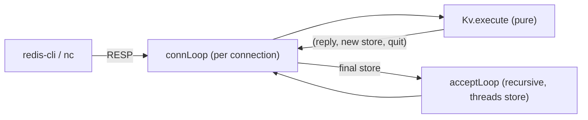

# Key-value store service (mini Redis over TCP)

An in-memory key-value server speaking enough of the Redis wire protocol (RESP)
that a stock `redis-cli` — or a bare `nc` session — can talk to it. Unlike the
`restful_api` example, which is stateless per request and externalizes storage
behind a capability, this server holds its data **in memory across connections**:
the store is an accumulator threaded through the recursive accept loop, so
"mutation" is just recursion with a new value. That is also faithful to real
Redis, whose core is a single-threaded command loop.



- `Resp.ash` — the wire codec: parses RESP arrays and inline commands from a
  buffered stream (returning need-more on partial input) and renders simple
  strings, errors, integers, bulk and null-bulk strings, and arrays.
- `Kv.ash` — the pure engine: case-insensitive dispatch of
  `PING`, `ECHO`, `SET`, `GET`, `DEL`, `EXISTS`, `KEYS`, `QUIT` (plus a stub
  `COMMAND` reply for the redis-cli handshake) over an association-list store,
  returning `(reply, new store, close?)`.
- `Main.ash` — the server: `listen`, then a recursive `acceptLoop` whose
  parameter is the store; each connection runs `connLoop` (read, parse, execute,
  reply) and returns the updated store to the next iteration.
- `KvTest.ash` — pure tests over the codec and engine; no socket needed.

## Run

```sh
cd examples/key_value_store_service
dotnet run --project ../../src/Ashes.Cli -- compile --project ashes.json
./out/key-value-store-service
```

Then, from another shell:

```sh
redis-cli -p 6380
127.0.0.1:6380> SET name ashes
OK
127.0.0.1:6380> GET name
"ashes"
127.0.0.1:6380> KEYS *
1) "name"
127.0.0.1:6380> DEL name
(integer) 1
```

Values survive across connections — reconnect and `GET` still answers. Without
redis-cli, `nc 127.0.0.1 6380` works too: type `PING` or `SET k v` as plain
lines (inline commands).

## Run the tests

```sh
cd examples/key_value_store_service
dotnet run --project ../../src/Ashes.Cli -- run --project ashes-test.json
```

Each check prints an `ok - ...` line and the run ends with `all tests passed`.

## Notes

- Connections are served one at a time: `acceptLoop` finishes a connection
  before accepting the next, because the store must thread through sequentially.
  Real Redis is also a single-threaded loop, though it multiplexes clients;
  doing that here would need per-connection interleaving with shared state.
- The store is a plain association list to keep the example self-contained
  (`Ashes.Collection.Map`/`Ashes.Collection.HashMap` currently have no remove operation, and stitched
  stdlib functions are single shared instances across a program).
- `KEYS` supports `*` and exact-match patterns only, and RESP bulk lengths are
  treated as character counts, so multi-byte UTF-8 values are not
  length-accurate.
- Extension ideas: `SAVE`/load snapshots through a storage capability (the
  restful_api pattern), `EXPIRE` via a clock capability, and concurrent clients
  once shared state across handlers is expressible.
