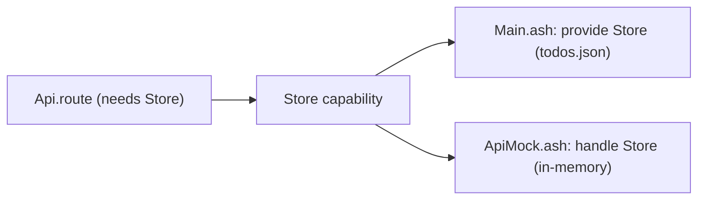

# RESTful todo API with capability-based storage

A small CRUD API over `Ashes.Http.Server` that keeps its storage behind a custom
`Store` capability. The routing layer (`Api.ash`) is a pure function from request
to response and never decides where the todos live: `Main.ash` satisfies `Store`
with a static `provide` backed by a JSON file, while `ApiMock.ash` satisfies the
same routes with an in-memory `handle` so the test entry (`ApiTest.ash`) runs
without a socket or a file.



The stored collection is a JSON array of `{"id": Int, "title": Str, "done": Bool}`
objects, and a todo travels through the code as the tuple `(id, title, done)`.

| Method and path | Behavior |
| --- | --- |
| `GET /todos` | The whole collection |
| `POST /todos` | Create from `{"title": Str, "done"?: Bool}`, id assigned |
| `GET /todos/{id}` | One todo, or 404 |
| `PUT /todos/{id}` | Replace title and done, or 404 |
| `DELETE /todos/{id}` | Remove, 204 on success |

## Run the server

```sh
cd examples/restful_api
dotnet run --project ../../src/Ashes.Cli -- compile --project ashes.json
./out/restful-api
```

Then, from another shell:

```sh
curl -s -X POST http://127.0.0.1:8080/todos -d '{"title":"write spec"}'
curl -s http://127.0.0.1:8080/todos
curl -s -X PUT http://127.0.0.1:8080/todos/1 -d '{"title":"revise spec","done":true}'
curl -s -X DELETE http://127.0.0.1:8080/todos/1
```

The collection persists in `todos.json` next to the server. The server runs a
single worker so file reads and writes stay ordered; a Ctrl-C drains in-flight
requests and prints `server stopped`.

## Run the tests

The mock-backed tests are an ordinary program with its own project manifest:

```sh
cd examples/restful_api
dotnet run --project ../../src/Ashes.Cli -- run --project ashes-test.json
```

Each check prints an `ok - ...` line and the run ends with `all tests passed`.

## Notes

- The provider in `Main.ash` resolves at compile time, so the routes run inside
  the async request handler without dynamic handler frames; the mock in
  `ApiMock.ash` is a dynamic handler installed around each test run.
- The example works around some current compiler constraints in project mode:
  - Stitched module functions are single shared instances, for both types and
    capability rows. `Api.ash` carries its own `reverseTodos` because
    `Ashes.List.reverse` is already instantiated at `Str` inside
    `Ashes.Http.Server`, and the `Store` row spreads through shared stdlib
    instances (the response builders, `requestFromLine`, even `Text.fromInt`),
    so everything touching them in the test program runs inside the handled
    scope of `ApiMock.runTests`.
  - A `handle` in the project entry file does not yet discharge a capability
    declared in an imported module — the harness lives in `ApiMock.ash` and
    `ApiTest.ash` only calls the already-discharged `runTests`.
  - `provide` declarations hoist above the module's `let` declarations, so the
    provider arms in `Main.ash` repeat the `"todos.json"` literal instead of
    referencing a binding.
  - The responders (`notFound`, `methodNotAllowed`, `noContent`) take a `Unit`
    argument: evaluating them as top-level values would close the shared
    response-builder row at module init and conflict with the `Store` row the
    routes need.
